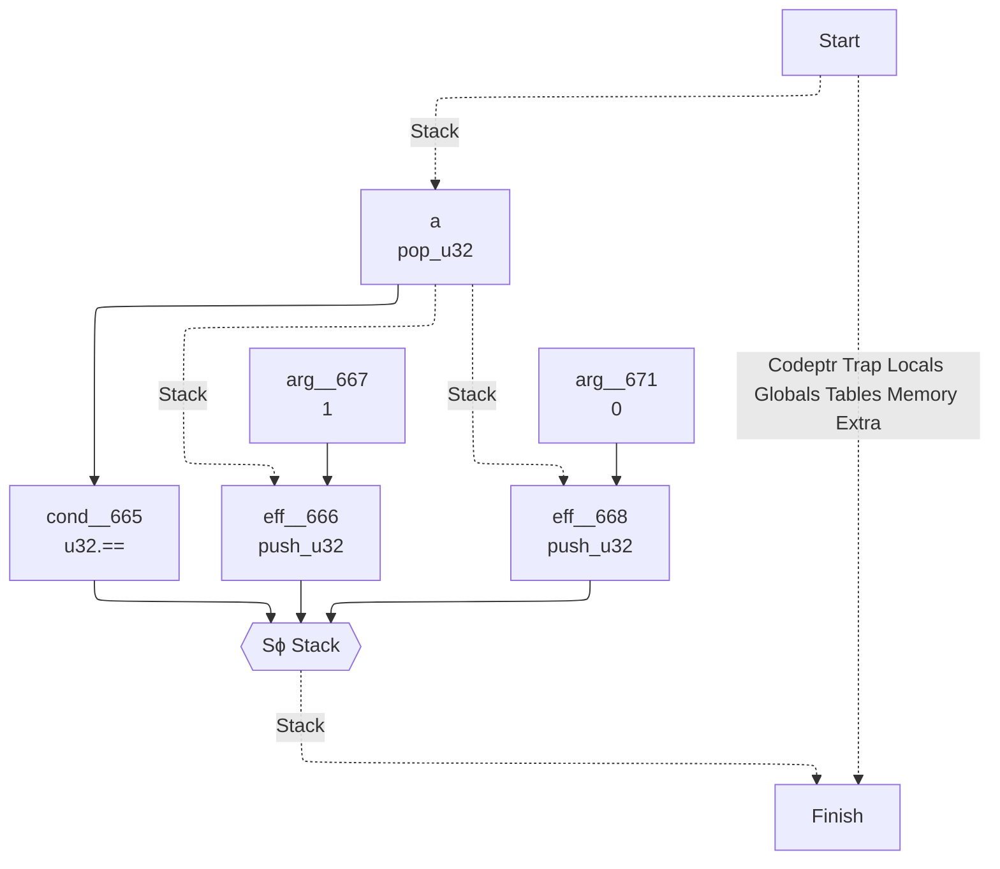
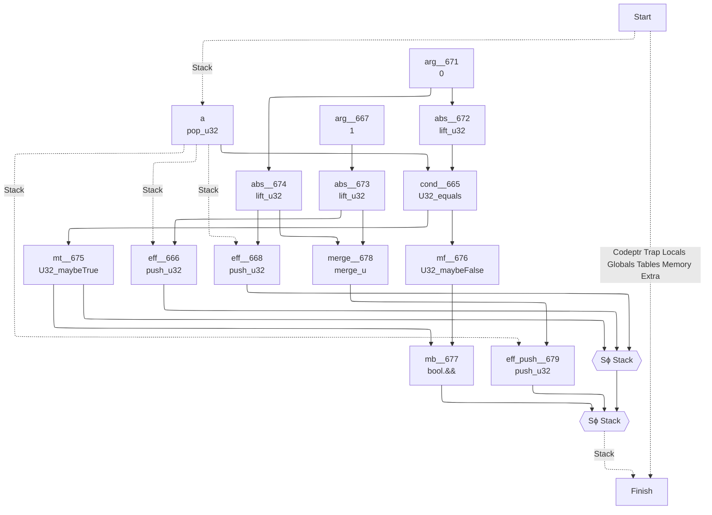
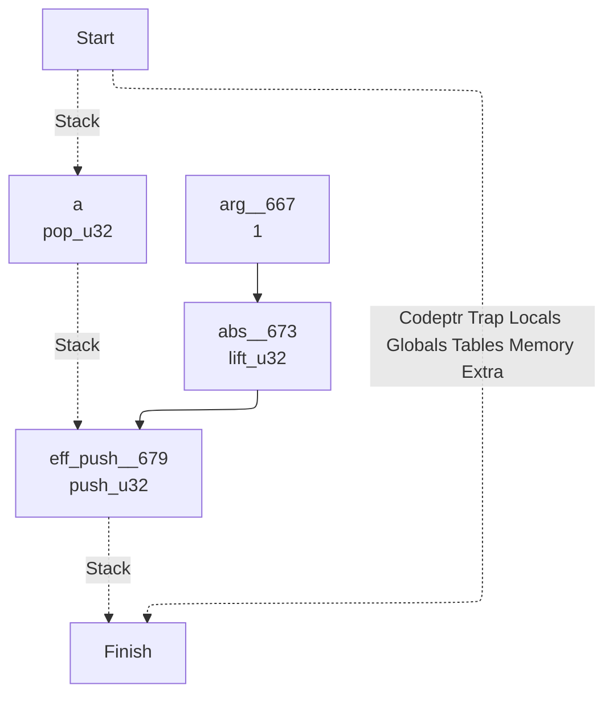

# Wasm Canonical Bytecode Definitions

<https://mkhan45.github.io/wasm-cbd>

## Canonical Definition (Concrete Interpreter)
```scala
def I32_EQZ() {
	var x = pop_i32();
	if (x == 0) {
	    push_i32(1);
	} else {
	    push_i32(0);
	}
}
```

## Sea of Variables


## Abstract Interpreter Transform


```scala
def I32_EQZ() {
	def a = pop_u32();
	def mt = U32_maybeTrue(U32_equals(a, lift_u32(0)));
	def mf = U32_maybeFalse(U32_equals(a, lift_u32(0)));
	if (bool.&&(mt, mf)) {
		push_u32(merge_u(lift_u32(1), lift_u32(0)));
	} else {
		if (mt) {
			push_u32(lift_u32(1));
		} else {
			push_u32(lift_u32(0));
		}
	}
}
```

## Validator Specialization

```scala
def I32_EQZ() {
	def a = pop_u32();
	push_u32(lift_u32(1));
}
```
