## UNREACHABLE
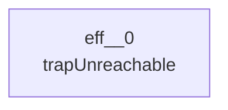
## NOP
```mermaid
---
config:
  layout: elk
---
graph TD
```
## LOCAL_GET
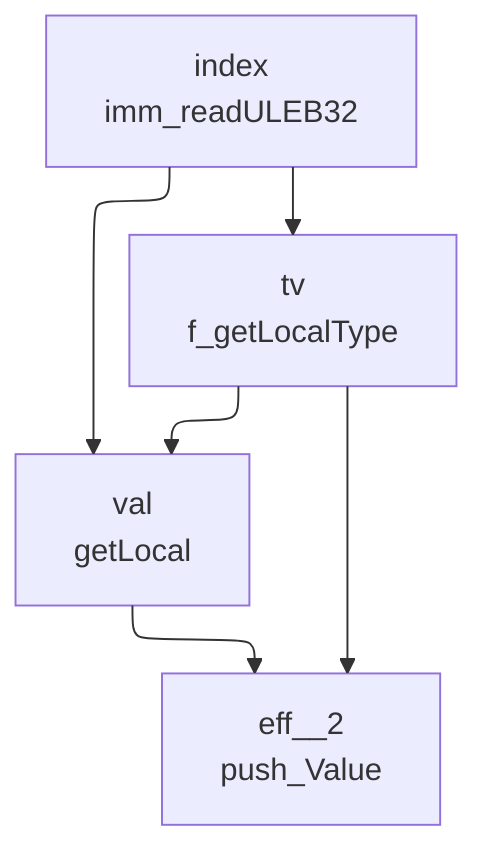
## LOCAL_SET
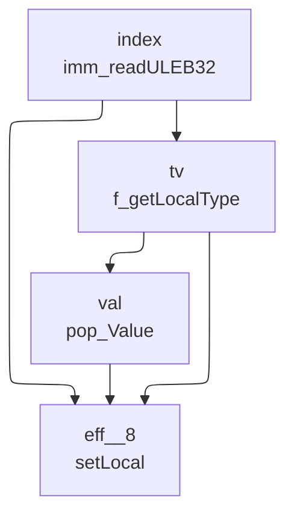
## LOCAL_TEE
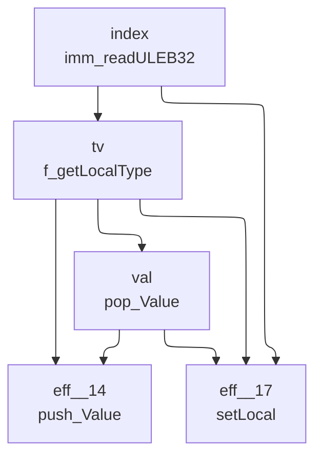
## GLOBAL_GET
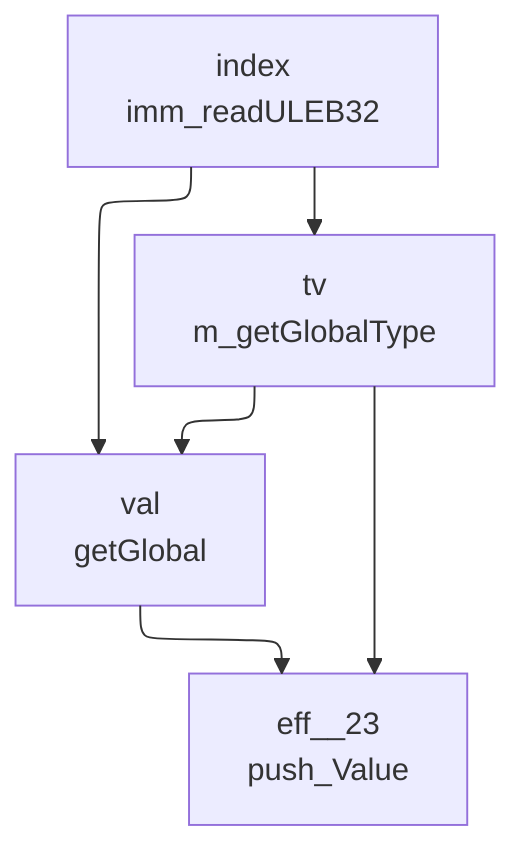
## GLOBAL_SET
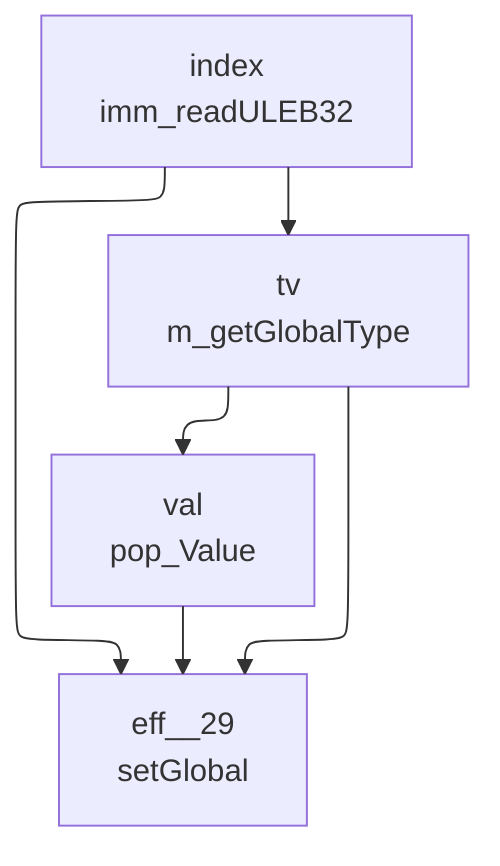
## TABLE_GET
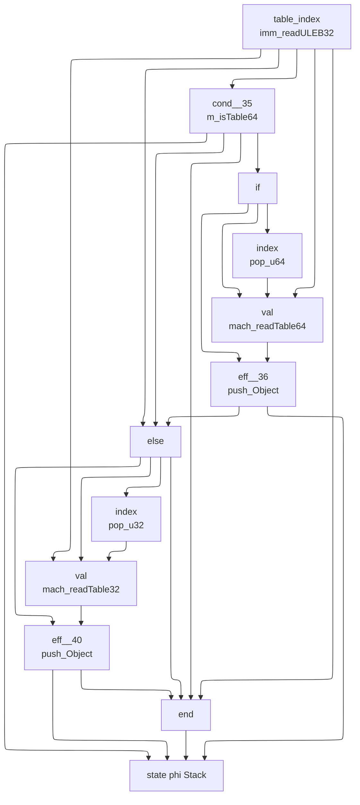
## TABLE_SET
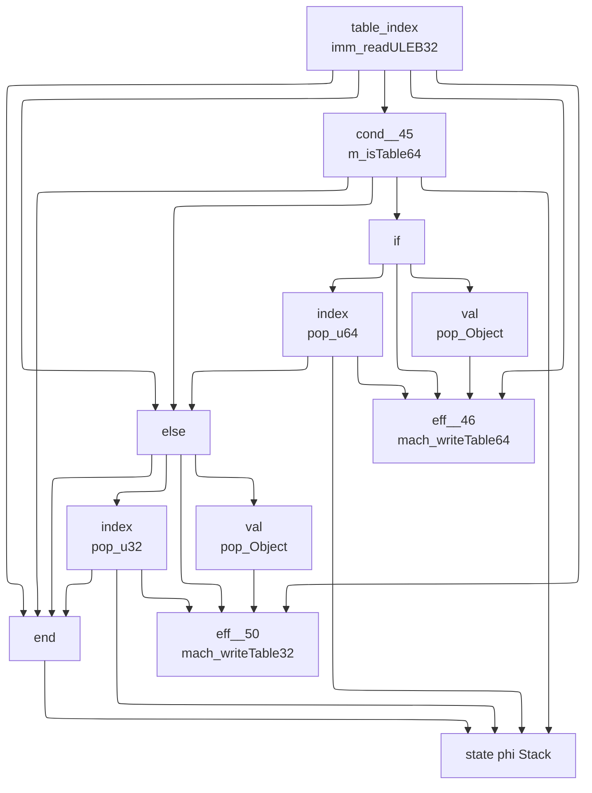
## CALL
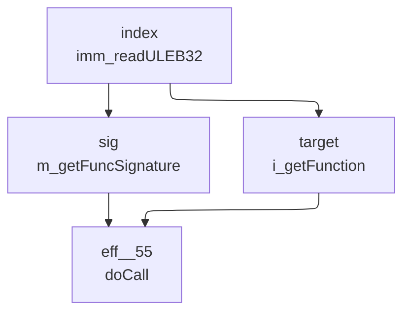
## CALL_INDIRECT
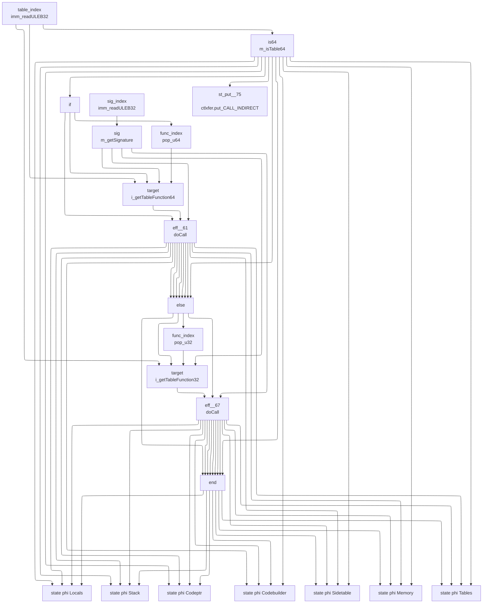
## RETURN_CALL
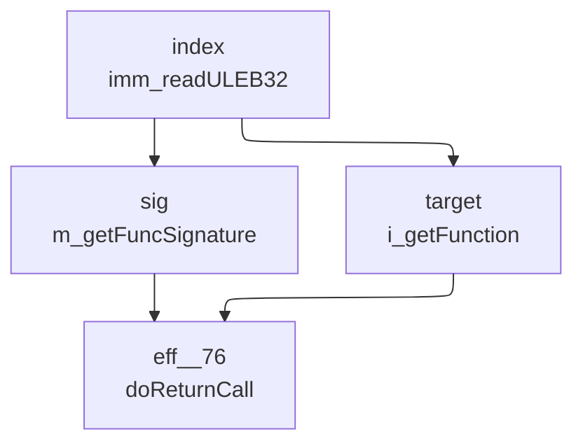
## DROP
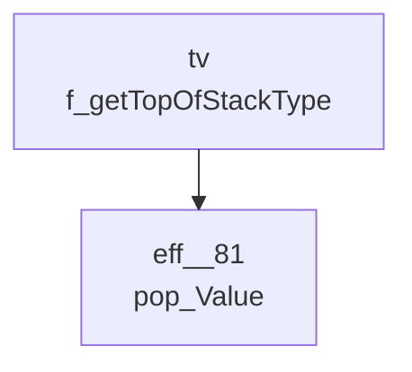
## SELECT
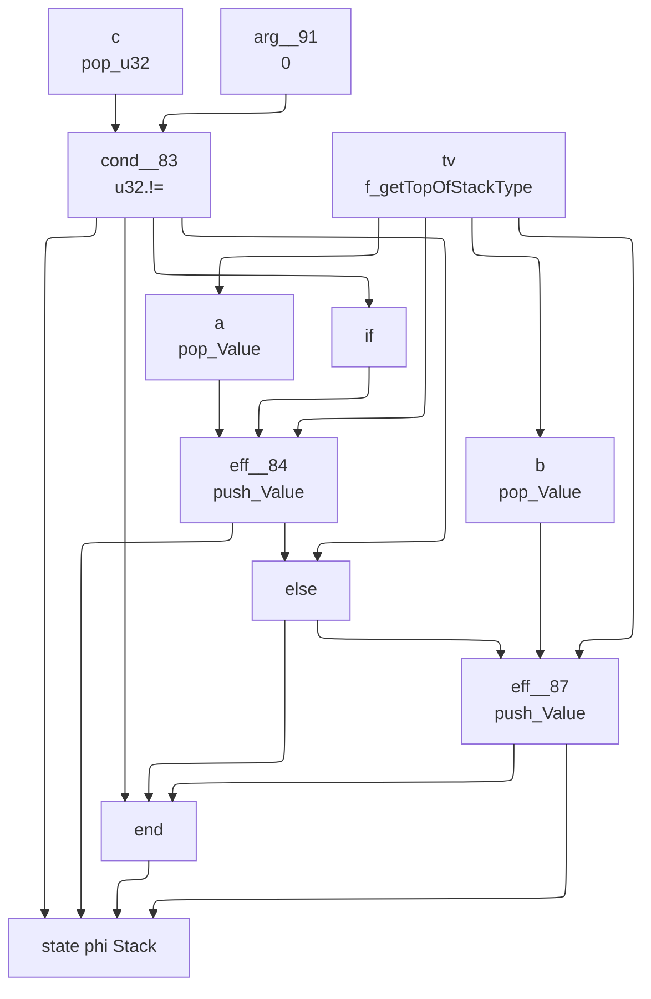
## I32_CONST

## I32_ADD
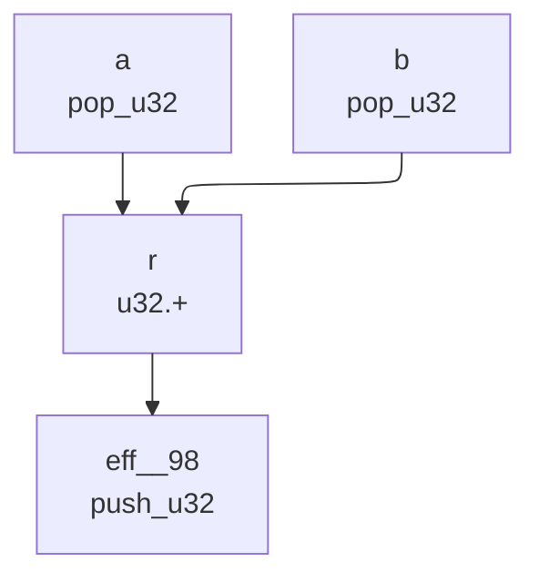
## I32_SUB
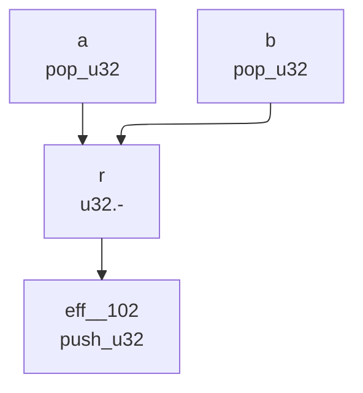
## I32_MUL

## I32_DIV_S
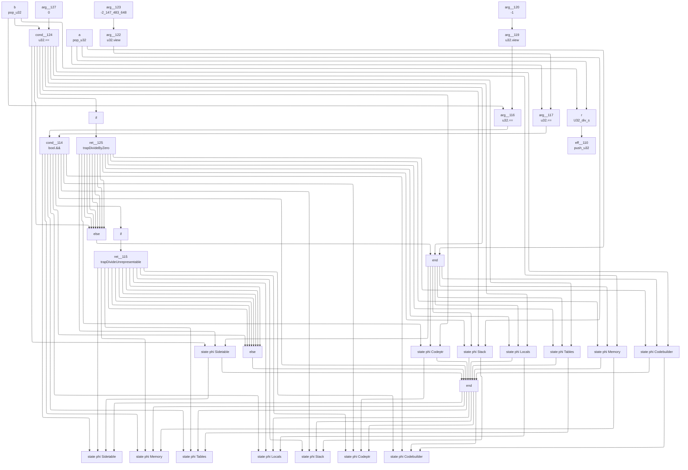
## I32_DIV_U
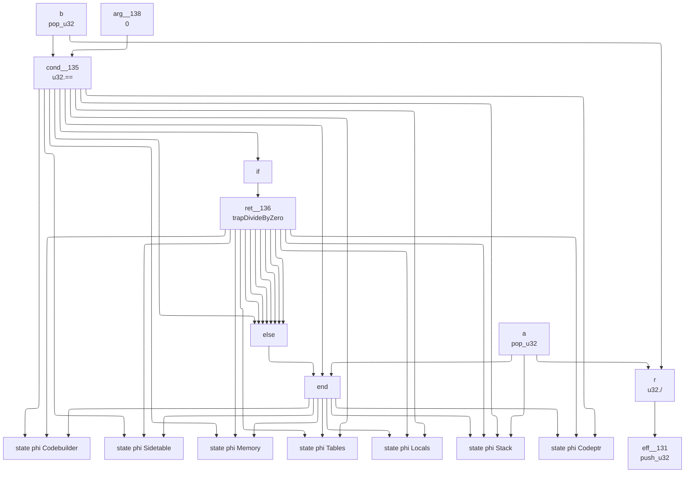
## I32_EQZ
```mermaid
---
config:
  layout: elk
---
graph TD
	9["
	state phi Stack
	"]
	2 --> 9
	5 --> 9
	8 --> 9
	6 --> 9
	6["
	eff__143
	push_u32
	"]
	1 --> 6
	4 --> 6
	4["
	else
	"]
	2 --> 4
	8 --> 4
	8["
	eff__141
	push_u32
	"]
	7 --> 8
	3 --> 8
	3["
	if
	"]
	2 --> 3
	2["
	cond__140
	u32.==
	"]
	0 --> 2
	1 --> 2
	1["
	arg__146
	0
	"]
	0["
	a
	pop_u32
	"]
	7["
	arg__142
	1
	"]
	5["
	end
	"]
	2 --> 5
	4 --> 5
	6 --> 5
```
## I32_EQ
```mermaid
---
config:
  layout: elk
---
graph TD
	10["
	state phi Stack
	"]
	2 --> 10
	5 --> 10
	9 --> 10
	7 --> 10
	7["
	eff__159
	push_u32
	"]
	6 --> 7
	4 --> 7
	4["
	else
	"]
	2 --> 4
	9 --> 4
	9["
	eff__157
	push_u32
	"]
	8 --> 9
	3 --> 9
	3["
	if
	"]
	2 --> 3
	2["
	cond__156
	u32.==
	"]
	1 --> 2
	0 --> 2
	0["
	b
	pop_u32
	"]
	1["
	a
	pop_u32
	"]
	8["
	arg__158
	1
	"]
	6["
	arg__160
	0
	"]
	5["
	end
	"]
	2 --> 5
	4 --> 5
	7 --> 5
```
## I32_NE
```mermaid
---
config:
  layout: elk
---
graph TD
	10["
	state phi Stack
	"]
	2 --> 10
	5 --> 10
	9 --> 10
	7 --> 10
	7["
	eff__168
	push_u32
	"]
	6 --> 7
	4 --> 7
	4["
	else
	"]
	2 --> 4
	9 --> 4
	9["
	eff__166
	push_u32
	"]
	8 --> 9
	3 --> 9
	3["
	if
	"]
	2 --> 3
	2["
	cond__165
	u32.!=
	"]
	1 --> 2
	0 --> 2
	0["
	b
	pop_u32
	"]
	1["
	a
	pop_u32
	"]
	8["
	arg__167
	1
	"]
	6["
	arg__169
	0
	"]
	5["
	end
	"]
	2 --> 5
	4 --> 5
	7 --> 5
```
## I32_LT_U
```mermaid
---
config:
  layout: elk
---
graph TD
	10["
	state phi Stack
	"]
	2 --> 10
	5 --> 10
	9 --> 10
	7 --> 10
	7["
	eff__177
	push_u32
	"]
	6 --> 7
	4 --> 7
	4["
	else
	"]
	2 --> 4
	9 --> 4
	9["
	eff__175
	push_u32
	"]
	8 --> 9
	3 --> 9
	3["
	if
	"]
	2 --> 3
	2["
	cond__174
	u32.<
	"]
	1 --> 2
	0 --> 2
	0["
	b
	pop_u32
	"]
	1["
	a
	pop_u32
	"]
	8["
	arg__176
	1
	"]
	6["
	arg__178
	0
	"]
	5["
	end
	"]
	2 --> 5
	4 --> 5
	7 --> 5
```
## I32_LT_S
```mermaid
---
config:
  layout: elk
---
graph TD
	10["
	state phi Stack
	"]
	2 --> 10
	5 --> 10
	9 --> 10
	7 --> 10
	7["
	eff__186
	push_u32
	"]
	6 --> 7
	4 --> 7
	4["
	else
	"]
	2 --> 4
	9 --> 4
	9["
	eff__184
	push_u32
	"]
	8 --> 9
	3 --> 9
	3["
	if
	"]
	2 --> 3
	2["
	cond__183
	U32_lt_s
	"]
	1 --> 2
	0 --> 2
	0["
	b
	pop_u32
	"]
	1["
	a
	pop_u32
	"]
	8["
	arg__185
	1
	"]
	6["
	arg__187
	0
	"]
	5["
	end
	"]
	2 --> 5
	4 --> 5
	7 --> 5
```
## I32_LE_S
```mermaid
---
config:
  layout: elk
---
graph TD
	10["
	state phi Stack
	"]
	2 --> 10
	5 --> 10
	9 --> 10
	7 --> 10
	7["
	eff__195
	push_u32
	"]
	6 --> 7
	4 --> 7
	4["
	else
	"]
	2 --> 4
	9 --> 4
	9["
	eff__193
	push_u32
	"]
	8 --> 9
	3 --> 9
	3["
	if
	"]
	2 --> 3
	2["
	cond__192
	U32_le_s
	"]
	1 --> 2
	0 --> 2
	0["
	b
	pop_u32
	"]
	1["
	a
	pop_u32
	"]
	8["
	arg__194
	1
	"]
	6["
	arg__196
	0
	"]
	5["
	end
	"]
	2 --> 5
	4 --> 5
	7 --> 5
```
## I32_GT_U
```mermaid
---
config:
  layout: elk
---
graph TD
	10["
	state phi Stack
	"]
	2 --> 10
	5 --> 10
	9 --> 10
	7 --> 10
	7["
	eff__204
	push_u32
	"]
	6 --> 7
	4 --> 7
	4["
	else
	"]
	2 --> 4
	9 --> 4
	9["
	eff__202
	push_u32
	"]
	8 --> 9
	3 --> 9
	3["
	if
	"]
	2 --> 3
	2["
	cond__201
	u32.>
	"]
	1 --> 2
	0 --> 2
	0["
	b
	pop_u32
	"]
	1["
	a
	pop_u32
	"]
	8["
	arg__203
	1
	"]
	6["
	arg__205
	0
	"]
	5["
	end
	"]
	2 --> 5
	4 --> 5
	7 --> 5
```
## I32_AND
```mermaid
---
config:
  layout: elk
---
graph TD
	3["
	eff__210
	push_u32
	"]
	2 --> 3
	2["
	r
	u32.&
	"]
	1 --> 2
	0 --> 2
	0["
	b
	pop_u32
	"]
	1["
	a
	pop_u32
	"]
```
## F32_CONST
```mermaid
---
config:
  layout: elk
---
graph TD
	2["
	eff__214
	push_f32
	"]
	1 --> 2
	1["
	arg__215
	f32_reinterpret_u32
	"]
	0 --> 1
	0["
	x
	imm_readULEB32
	"]
```
## F32_ADD
```mermaid
---
config:
  layout: elk
---
graph TD
	3["
	eff__218
	push_f32
	"]
	2 --> 3
	2["
	r
	float.+
	"]
	1 --> 2
	0 --> 2
	0["
	b
	pop_f32
	"]
	1["
	a
	pop_f32
	"]
```
## F32_SUB
```mermaid
---
config:
  layout: elk
---
graph TD
	3["
	eff__222
	push_f32
	"]
	2 --> 3
	2["
	r
	float.-
	"]
	1 --> 2
	0 --> 2
	0["
	b
	pop_f32
	"]
	1["
	a
	pop_f32
	"]
```
## F32_MUL
```mermaid
---
config:
  layout: elk
---
graph TD
	3["
	eff__226
	push_f32
	"]
	2 --> 3
	2["
	r
	float.*
	"]
	1 --> 2
	0 --> 2
	0["
	b
	pop_f32
	"]
	1["
	a
	pop_f32
	"]
```
## F32_DIV
```mermaid
---
config:
  layout: elk
---
graph TD
	14["
	state phi Codebuilder
	"]
	3 --> 14
	6 --> 14
	7 --> 14
	7["
	ret__235
	trapDivideByZero
	"]
	4 --> 7
	4["
	if
	"]
	3 --> 4
	3["
	cond__234
	float.==
	"]
	0 --> 3
	2 --> 3
	2["
	arg__237
	0.0f
	"]
	0["
	b
	pop_f32
	"]
	6["
	end
	"]
	3 --> 6
	5 --> 6
	1 --> 6
	1["
	a
	pop_f32
	"]
	5["
	else
	"]
	3 --> 5
	7 --> 5
	7 --> 5
	7 --> 5
	7 --> 5
	7 --> 5
	7 --> 5
	7 --> 5
	13["
	state phi Sidetable
	"]
	3 --> 13
	6 --> 13
	7 --> 13
	12["
	state phi Memory
	"]
	3 --> 12
	6 --> 12
	7 --> 12
	11["
	state phi Tables
	"]
	3 --> 11
	6 --> 11
	7 --> 11
	10["
	state phi Locals
	"]
	3 --> 10
	6 --> 10
	7 --> 10
	9["
	state phi Stack
	"]
	3 --> 9
	6 --> 9
	7 --> 9
	1 --> 9
	8["
	state phi Codeptr
	"]
	3 --> 8
	6 --> 8
	7 --> 8
	16["
	eff__230
	push_f32
	"]
	15 --> 16
	15["
	r
	float./
	"]
	1 --> 15
	0 --> 15
```
## F32_SQRT
```mermaid
---
config:
  layout: elk
---
graph TD
	2["
	eff__239
	push_f32
	"]
	1 --> 2
	1["
	r
	float.sqrt
	"]
	0 --> 1
	0["
	a
	pop_f32
	"]
```
## F32_EQ
```mermaid
---
config:
  layout: elk
---
graph TD
	10["
	state phi Stack
	"]
	2 --> 10
	5 --> 10
	9 --> 10
	7 --> 10
	7["
	eff__245
	push_u32
	"]
	6 --> 7
	4 --> 7
	4["
	else
	"]
	2 --> 4
	9 --> 4
	9["
	eff__243
	push_u32
	"]
	8 --> 9
	3 --> 9
	3["
	if
	"]
	2 --> 3
	2["
	cond__242
	float.==
	"]
	1 --> 2
	0 --> 2
	0["
	b
	pop_f32
	"]
	1["
	a
	pop_f32
	"]
	8["
	arg__244
	1
	"]
	6["
	arg__246
	0
	"]
	5["
	end
	"]
	2 --> 5
	4 --> 5
	7 --> 5
```
## F32_NE
```mermaid
---
config:
  layout: elk
---
graph TD
	10["
	state phi Stack
	"]
	2 --> 10
	5 --> 10
	9 --> 10
	7 --> 10
	7["
	eff__254
	push_u32
	"]
	6 --> 7
	4 --> 7
	4["
	else
	"]
	2 --> 4
	9 --> 4
	9["
	eff__252
	push_u32
	"]
	8 --> 9
	3 --> 9
	3["
	if
	"]
	2 --> 3
	2["
	cond__251
	float.!=
	"]
	1 --> 2
	0 --> 2
	0["
	b
	pop_f32
	"]
	1["
	a
	pop_f32
	"]
	8["
	arg__253
	1
	"]
	6["
	arg__255
	0
	"]
	5["
	end
	"]
	2 --> 5
	4 --> 5
	7 --> 5
```
## F32_LT
```mermaid
---
config:
  layout: elk
---
graph TD
	10["
	state phi Stack
	"]
	2 --> 10
	5 --> 10
	9 --> 10
	7 --> 10
	7["
	eff__263
	push_u32
	"]
	6 --> 7
	4 --> 7
	4["
	else
	"]
	2 --> 4
	9 --> 4
	9["
	eff__261
	push_u32
	"]
	8 --> 9
	3 --> 9
	3["
	if
	"]
	2 --> 3
	2["
	cond__260
	float.<
	"]
	1 --> 2
	0 --> 2
	0["
	b
	pop_f32
	"]
	1["
	a
	pop_f32
	"]
	8["
	arg__262
	1
	"]
	6["
	arg__264
	0
	"]
	5["
	end
	"]
	2 --> 5
	4 --> 5
	7 --> 5
```
## F32_LE
```mermaid
---
config:
  layout: elk
---
graph TD
	10["
	state phi Stack
	"]
	2 --> 10
	5 --> 10
	9 --> 10
	7 --> 10
	7["
	eff__272
	push_u32
	"]
	6 --> 7
	4 --> 7
	4["
	else
	"]
	2 --> 4
	9 --> 4
	9["
	eff__270
	push_u32
	"]
	8 --> 9
	3 --> 9
	3["
	if
	"]
	2 --> 3
	2["
	cond__269
	float.<=
	"]
	1 --> 2
	0 --> 2
	0["
	b
	pop_f32
	"]
	1["
	a
	pop_f32
	"]
	8["
	arg__271
	1
	"]
	6["
	arg__273
	0
	"]
	5["
	end
	"]
	2 --> 5
	4 --> 5
	7 --> 5
```
## F32_GT
```mermaid
---
config:
  layout: elk
---
graph TD
	10["
	state phi Stack
	"]
	2 --> 10
	5 --> 10
	9 --> 10
	7 --> 10
	7["
	eff__281
	push_u32
	"]
	6 --> 7
	4 --> 7
	4["
	else
	"]
	2 --> 4
	9 --> 4
	9["
	eff__279
	push_u32
	"]
	8 --> 9
	3 --> 9
	3["
	if
	"]
	2 --> 3
	2["
	cond__278
	float.>
	"]
	1 --> 2
	0 --> 2
	0["
	b
	pop_f32
	"]
	1["
	a
	pop_f32
	"]
	8["
	arg__280
	1
	"]
	6["
	arg__282
	0
	"]
	5["
	end
	"]
	2 --> 5
	4 --> 5
	7 --> 5
```
## BR
```mermaid
---
config:
  layout: elk
---
graph TD
	3["
	st_put__290
	ctlxfer.put_BR
	"]
	1 --> 3
	1["
	label
	f_getLabel
	"]
	0 --> 1
	0["
	depth
	imm_readULEB32
	"]
	2["
	ret__287
	doBranch
	"]
	1 --> 2
```
## BR_IF
```mermaid
---
config:
  layout: elk
---
graph TD
	15["
	state phi Sidetable
	"]
	4 --> 15
	7 --> 15
	9 --> 15
	8 --> 15
	8["
	ret__294
	doFallthru
	"]
	6 --> 8
	6["
	else
	"]
	4 --> 6
	9 --> 6
	9 --> 6
	9 --> 6
	9 --> 6
	9 --> 6
	9 --> 6
	9 --> 6
	9["
	ret__292
	doBranch
	"]
	1 --> 9
	5 --> 9
	5["
	if
	"]
	4 --> 5
	4["
	cond__291
	u32.!=
	"]
	2 --> 4
	3 --> 4
	3["
	arg__296
	0
	"]
	2["
	cond
	pop_u32
	"]
	1["
	label
	f_getLabel
	"]
	0 --> 1
	0["
	depth
	imm_readULEB32
	"]
	7["
	end
	"]
	4 --> 7
	6 --> 7
	8 --> 7
	8 --> 7
	8 --> 7
	8 --> 7
	8 --> 7
	8 --> 7
	8 --> 7
	14["
	state phi Memory
	"]
	4 --> 14
	7 --> 14
	9 --> 14
	8 --> 14
	13["
	state phi Tables
	"]
	4 --> 13
	7 --> 13
	9 --> 13
	8 --> 13
	12["
	state phi Locals
	"]
	4 --> 12
	7 --> 12
	9 --> 12
	8 --> 12
	11["
	state phi Stack
	"]
	4 --> 11
	7 --> 11
	9 --> 11
	8 --> 11
	10["
	state phi Codeptr
	"]
	4 --> 10
	7 --> 10
	9 --> 10
	8 --> 10
	17["
	st_put__298
	ctlxfer.put_BR_IF
	"]
	1 --> 17
	16["
	state phi Codebuilder
	"]
	4 --> 16
	7 --> 16
	9 --> 16
	8 --> 16
```
## BR_TABLE
```mermaid
---
config:
  layout: elk
---
graph TD
	3["
	st_put__303
	ctlxfer.put_BR_TABLE
	"]
	0 --> 3
	0["
	labels
	imm_readLabels
	"]
	2["
	eff__300
	doSwitch
	"]
	0 --> 2
	1 --> 2
	1["
	key
	pop_u32
	"]
```
## BLOCK
```mermaid
---
config:
  layout: elk
---
graph TD
	1["
	eff__304
	doBlock
	"]
	0 --> 1
	0["
	bt
	imm_readBlockType
	"]
```
## LOOP
```mermaid
---
config:
  layout: elk
---
graph TD
	1["
	eff__306
	doLoop
	"]
	0 --> 1
	0["
	bt
	imm_readBlockType
	"]
```
## TRY
```mermaid
---
config:
  layout: elk
---
graph TD
	1["
	eff__308
	doTry
	"]
	0 --> 1
	0["
	bt
	imm_readBlockType
	"]
```
## IF
```mermaid
---
config:
  layout: elk
---
graph TD
	15["
	state phi Sidetable
	"]
	4 --> 15
	7 --> 15
	9 --> 15
	8 --> 15
	8["
	ret__313
	doFallthru
	"]
	6 --> 8
	6["
	else
	"]
	4 --> 6
	9 --> 6
	9 --> 6
	9 --> 6
	9 --> 6
	9 --> 6
	9 --> 6
	9 --> 6
	9["
	ret__311
	doBranch
	"]
	2 --> 9
	5 --> 9
	5["
	if
	"]
	4 --> 5
	4["
	cond__310
	u32.==
	"]
	1 --> 4
	3 --> 4
	3["
	arg__315
	0
	"]
	1["
	cond
	pop_u32
	"]
	2["
	label
	doIf
	"]
	0 --> 2
	0["
	bt
	imm_readBlockType
	"]
	7["
	end
	"]
	4 --> 7
	6 --> 7
	8 --> 7
	8 --> 7
	8 --> 7
	8 --> 7
	8 --> 7
	8 --> 7
	8 --> 7
	14["
	state phi Memory
	"]
	4 --> 14
	7 --> 14
	9 --> 14
	8 --> 14
	13["
	state phi Tables
	"]
	4 --> 13
	7 --> 13
	9 --> 13
	8 --> 13
	12["
	state phi Locals
	"]
	4 --> 12
	7 --> 12
	9 --> 12
	8 --> 12
	11["
	state phi Stack
	"]
	4 --> 11
	7 --> 11
	9 --> 11
	8 --> 11
	10["
	state phi Codeptr
	"]
	4 --> 10
	7 --> 10
	9 --> 10
	8 --> 10
	17["
	st_put__317
	ctlxfer.put_IF
	"]
	2 --> 17
	16["
	state phi Codebuilder
	"]
	4 --> 16
	7 --> 16
	9 --> 16
	8 --> 16
```
## ELSE
```mermaid
---
config:
  layout: elk
---
graph TD
	2["
	st_put__321
	ctlxfer.put_ELSE
	"]
	0 --> 2
	0["
	label
	doElse
	"]
	1["
	ret__319
	doBranch
	"]
	0 --> 1
```
## END
```mermaid
---
config:
  layout: elk
---
graph TD
	12["
	state phi Codebuilder
	"]
	1 --> 12
	4 --> 12
	5 --> 12
	0 --> 12
	0["
	eff__324
	doEnd
	"]
	5["
	ret__323
	doReturn
	"]
	2 --> 5
	2["
	if
	"]
	1 --> 2
	1["
	cond__322
	f_isAtEnd
	"]
	4["
	end
	"]
	1 --> 4
	3 --> 4
	0 --> 4
	0 --> 4
	0 --> 4
	0 --> 4
	0 --> 4
	0 --> 4
	0 --> 4
	3["
	else
	"]
	1 --> 3
	5 --> 3
	5 --> 3
	5 --> 3
	5 --> 3
	5 --> 3
	5 --> 3
	5 --> 3
	11["
	state phi Sidetable
	"]
	1 --> 11
	4 --> 11
	5 --> 11
	0 --> 11
	10["
	state phi Memory
	"]
	1 --> 10
	4 --> 10
	5 --> 10
	0 --> 10
	9["
	state phi Tables
	"]
	1 --> 9
	4 --> 9
	5 --> 9
	0 --> 9
	8["
	state phi Locals
	"]
	1 --> 8
	4 --> 8
	5 --> 8
	0 --> 8
	7["
	state phi Stack
	"]
	1 --> 7
	4 --> 7
	5 --> 7
	0 --> 7
	6["
	state phi Codeptr
	"]
	1 --> 6
	4 --> 6
	5 --> 6
	0 --> 6
```
## RETURN
```mermaid
---
config:
  layout: elk
---
graph TD
	0["
	ret__325
	doReturn
	"]
```
## REF_NULL
```mermaid
---
config:
  layout: elk
---
graph TD
	2["
	eff__326
	push_Object
	"]
	1 --> 2
	1["
	arg__327
	object_Null
	"]
	0["
	idx
	imm_readULEB32
	"]
```
## REF_IS_NULL
```mermaid
---
config:
  layout: elk
---
graph TD
	9["
	state phi Stack
	"]
	1 --> 9
	4 --> 9
	8 --> 9
	6 --> 9
	6["
	eff__331
	push_u32
	"]
	5 --> 6
	3 --> 6
	3["
	else
	"]
	1 --> 3
	8 --> 3
	8["
	eff__329
	push_u32
	"]
	7 --> 8
	2 --> 8
	2["
	if
	"]
	1 --> 2
	1["
	cond__328
	object_isNull
	"]
	0 --> 1
	0["
	obj
	pop_Object
	"]
	7["
	arg__330
	1
	"]
	5["
	arg__332
	0
	"]
	4["
	end
	"]
	1 --> 4
	3 --> 4
	6 --> 4
```
## REF_AS_NON_NULL
```mermaid
---
config:
  layout: elk
---
graph TD
	13["
	eff__336
	push_Object
	"]
	0 --> 13
	0["
	obj
	pop_Object
	"]
	12["
	state phi Codebuilder
	"]
	1 --> 12
	4 --> 12
	5 --> 12
	5["
	eff__339
	trapNull
	"]
	2 --> 5
	2["
	if
	"]
	1 --> 2
	1["
	cond__338
	object_isNull
	"]
	0 --> 1
	4["
	end
	"]
	1 --> 4
	3 --> 4
	0 --> 4
	3["
	else
	"]
	1 --> 3
	5 --> 3
	5 --> 3
	5 --> 3
	5 --> 3
	5 --> 3
	5 --> 3
	5 --> 3
	11["
	state phi Sidetable
	"]
	1 --> 11
	4 --> 11
	5 --> 11
	10["
	state phi Memory
	"]
	1 --> 10
	4 --> 10
	5 --> 10
	9["
	state phi Tables
	"]
	1 --> 9
	4 --> 9
	5 --> 9
	8["
	state phi Locals
	"]
	1 --> 8
	4 --> 8
	5 --> 8
	7["
	state phi Stack
	"]
	1 --> 7
	4 --> 7
	5 --> 7
	0 --> 7
	6["
	state phi Codeptr
	"]
	1 --> 6
	4 --> 6
	5 --> 6
```
## STRUCT_NEW
```mermaid
---
config:
  layout: elk
---
graph TD
	3["
	eff__341
	push_Object
	"]
	2 --> 3
	2["
	obj
	object_New
	"]
	1 --> 2
	1["
	sig
	m_getSignature
	"]
	0 --> 1
	0["
	struct_idx
	imm_readULEB32
	"]
```
## STRUCT_GET
```mermaid
---
config:
  layout: elk
---
graph TD
	15["
	state phi Sidetable
	"]
	5 --> 15
	8 --> 15
	9 --> 15
	9["
	ret__371
	trapNull
	"]
	6 --> 9
	6["
	if
	"]
	5 --> 6
	5["
	cond__370
	object_isNull
	"]
	4 --> 5
	4["
	obj
	pop_Object
	"]
	8["
	end
	"]
	5 --> 8
	7 --> 8
	1 --> 8
	4 --> 8
	1["
	field_index
	imm_readULEB32
	"]
	7["
	else
	"]
	5 --> 7
	9 --> 7
	9 --> 7
	9 --> 7
	9 --> 7
	9 --> 7
	9 --> 7
	9 --> 7
	14["
	state phi Memory
	"]
	5 --> 14
	8 --> 14
	9 --> 14
	13["
	state phi Tables
	"]
	5 --> 13
	8 --> 13
	9 --> 13
	12["
	state phi Locals
	"]
	5 --> 12
	8 --> 12
	9 --> 12
	11["
	state phi Stack
	"]
	5 --> 11
	8 --> 11
	9 --> 11
	4 --> 11
	10["
	state phi Codeptr
	"]
	5 --> 10
	8 --> 10
	9 --> 10
	1 --> 10
	3["
	offset
	m_getFieldOffset
	"]
	0 --> 3
	1 --> 3
	0["
	struct_index
	imm_readULEB32
	"]
	2["
	kind
	m_getFieldKind
	"]
	0 --> 2
	1 --> 2
	16["
	state phi Codebuilder
	"]
	5 --> 16
	8 --> 16
	9 --> 16
```
## STRUCT_GET_S
```mermaid
---
config:
  layout: elk
---
graph TD
	15["
	state phi Sidetable
	"]
	5 --> 15
	8 --> 15
	9 --> 15
	9["
	ret__390
	trapNull
	"]
	6 --> 9
	6["
	if
	"]
	5 --> 6
	5["
	cond__389
	object_isNull
	"]
	4 --> 5
	4["
	obj
	pop_Object
	"]
	8["
	end
	"]
	5 --> 8
	7 --> 8
	1 --> 8
	4 --> 8
	1["
	field_index
	imm_readULEB32
	"]
	7["
	else
	"]
	5 --> 7
	9 --> 7
	9 --> 7
	9 --> 7
	9 --> 7
	9 --> 7
	9 --> 7
	9 --> 7
	14["
	state phi Memory
	"]
	5 --> 14
	8 --> 14
	9 --> 14
	13["
	state phi Tables
	"]
	5 --> 13
	8 --> 13
	9 --> 13
	12["
	state phi Locals
	"]
	5 --> 12
	8 --> 12
	9 --> 12
	11["
	state phi Stack
	"]
	5 --> 11
	8 --> 11
	9 --> 11
	4 --> 11
	10["
	state phi Codeptr
	"]
	5 --> 10
	8 --> 10
	9 --> 10
	1 --> 10
	3["
	offset
	m_getFieldOffset
	"]
	0 --> 3
	1 --> 3
	0["
	struct_index
	imm_readULEB32
	"]
	2["
	kind
	m_getFieldKind
	"]
	0 --> 2
	1 --> 2
	16["
	state phi Codebuilder
	"]
	5 --> 16
	8 --> 16
	9 --> 16
```
## STRUCT_GET_U
```mermaid
---
config:
  layout: elk
---
graph TD
	15["
	state phi Sidetable
	"]
	5 --> 15
	8 --> 15
	9 --> 15
	9["
	ret__409
	trapNull
	"]
	6 --> 9
	6["
	if
	"]
	5 --> 6
	5["
	cond__408
	object_isNull
	"]
	4 --> 5
	4["
	obj
	pop_Object
	"]
	8["
	end
	"]
	5 --> 8
	7 --> 8
	1 --> 8
	4 --> 8
	1["
	field_index
	imm_readULEB32
	"]
	7["
	else
	"]
	5 --> 7
	9 --> 7
	9 --> 7
	9 --> 7
	9 --> 7
	9 --> 7
	9 --> 7
	9 --> 7
	14["
	state phi Memory
	"]
	5 --> 14
	8 --> 14
	9 --> 14
	13["
	state phi Tables
	"]
	5 --> 13
	8 --> 13
	9 --> 13
	12["
	state phi Locals
	"]
	5 --> 12
	8 --> 12
	9 --> 12
	11["
	state phi Stack
	"]
	5 --> 11
	8 --> 11
	9 --> 11
	4 --> 11
	10["
	state phi Codeptr
	"]
	5 --> 10
	8 --> 10
	9 --> 10
	1 --> 10
	3["
	offset
	m_getFieldOffset
	"]
	0 --> 3
	1 --> 3
	0["
	struct_index
	imm_readULEB32
	"]
	2["
	kind
	m_getFieldKind
	"]
	0 --> 2
	1 --> 2
	16["
	state phi Codebuilder
	"]
	5 --> 16
	8 --> 16
	9 --> 16
```
## I32_LOAD
```mermaid
---
config:
  layout: elk
---
graph TD
	13["
	if
	"]
	12 --> 13
	12["
	cond__416
	m_isMemory64
	"]
	10 --> 12
	10["
	memindex
	phi
	"]
	5 --> 10
	8 --> 10
	9 --> 10
	1 --> 10
	1["
	memindex
	0u
	"]
	9["
	memindex__429
	imm_readULEB32
	"]
	6 --> 9
	6["
	if
	"]
	5 --> 6
	5["
	cond__428
	u8.!=
	"]
	4 --> 5
	2 --> 5
	2["
	arg__431
	0
	"]
	4["
	arg__430
	u8.&
	"]
	0 --> 4
	3 --> 4
	3["
	arg__433
	0x40u8
	"]
	0["
	flags
	imm_readU8
	"]
	8["
	end
	"]
	5 --> 8
	7 --> 8
	0 --> 8
	7["
	else
	"]
	5 --> 7
	9 --> 7
	9 --> 7
	11["
	state phi Codeptr
	"]
	5 --> 11
	8 --> 11
	9 --> 11
	0 --> 11
	25["
	state phi Stack
	"]
	12 --> 25
	15 --> 25
	23 --> 25
	19 --> 25
	19["
	eff__422
	push_u32
	"]
	18 --> 19
	14 --> 19
	14["
	else
	"]
	12 --> 14
	20 --> 14
	23 --> 14
	23["
	eff__417
	push_u32
	"]
	22 --> 23
	13 --> 23
	22["
	val
	mach_readMemory64_u32
	"]
	10 --> 22
	21 --> 22
	20 --> 22
	13 --> 22
	20["
	offset
	imm_readULEB64
	"]
	13 --> 20
	21["
	index
	pop_u64
	"]
	13 --> 21
	18["
	val
	mach_readMemory32_u32
	"]
	10 --> 18
	17 --> 18
	16 --> 18
	14 --> 18
	16["
	offset
	imm_readULEB32
	"]
	14 --> 16
	17["
	index
	pop_u32
	"]
	14 --> 17
	15["
	end
	"]
	12 --> 15
	14 --> 15
	16 --> 15
	19 --> 15
	24["
	state phi Codeptr
	"]
	12 --> 24
	15 --> 24
	20 --> 24
	16 --> 24
```
## I32_LOAD8_U
```mermaid
---
config:
  layout: elk
---
graph TD
	13["
	if
	"]
	12 --> 13
	12["
	cond__434
	m_isMemory64
	"]
	10 --> 12
	10["
	memindex
	phi
	"]
	5 --> 10
	8 --> 10
	9 --> 10
	1 --> 10
	1["
	memindex
	0u
	"]
	9["
	memindex__447
	imm_readULEB32
	"]
	6 --> 9
	6["
	if
	"]
	5 --> 6
	5["
	cond__446
	u8.!=
	"]
	4 --> 5
	2 --> 5
	2["
	arg__449
	0
	"]
	4["
	arg__448
	u8.&
	"]
	0 --> 4
	3 --> 4
	3["
	arg__451
	0x40u8
	"]
	0["
	flags
	imm_readU8
	"]
	8["
	end
	"]
	5 --> 8
	7 --> 8
	0 --> 8
	7["
	else
	"]
	5 --> 7
	9 --> 7
	9 --> 7
	11["
	state phi Codeptr
	"]
	5 --> 11
	8 --> 11
	9 --> 11
	0 --> 11
	25["
	state phi Stack
	"]
	12 --> 25
	15 --> 25
	23 --> 25
	19 --> 25
	19["
	eff__440
	push_u32
	"]
	18 --> 19
	14 --> 19
	14["
	else
	"]
	12 --> 14
	20 --> 14
	23 --> 14
	23["
	eff__435
	push_u32
	"]
	22 --> 23
	13 --> 23
	22["
	val
	mach_readMemory64_u8
	"]
	10 --> 22
	21 --> 22
	20 --> 22
	13 --> 22
	20["
	offset
	imm_readULEB64
	"]
	13 --> 20
	21["
	index
	pop_u64
	"]
	13 --> 21
	18["
	val
	mach_readMemory32_u8
	"]
	10 --> 18
	17 --> 18
	16 --> 18
	14 --> 18
	16["
	offset
	imm_readULEB32
	"]
	14 --> 16
	17["
	index
	pop_u32
	"]
	14 --> 17
	15["
	end
	"]
	12 --> 15
	14 --> 15
	16 --> 15
	19 --> 15
	24["
	state phi Codeptr
	"]
	12 --> 24
	15 --> 24
	20 --> 24
	16 --> 24
```
## I32_LOAD16_S
```mermaid
---
config:
  layout: elk
---
graph TD
	13["
	if
	"]
	12 --> 13
	12["
	cond__452
	m_isMemory64
	"]
	10 --> 12
	10["
	memindex
	phi
	"]
	5 --> 10
	8 --> 10
	9 --> 10
	1 --> 10
	1["
	memindex
	0u
	"]
	9["
	memindex__465
	imm_readULEB32
	"]
	6 --> 9
	6["
	if
	"]
	5 --> 6
	5["
	cond__464
	u8.!=
	"]
	4 --> 5
	2 --> 5
	2["
	arg__467
	0
	"]
	4["
	arg__466
	u8.&
	"]
	0 --> 4
	3 --> 4
	3["
	arg__469
	0x40u8
	"]
	0["
	flags
	imm_readU8
	"]
	8["
	end
	"]
	5 --> 8
	7 --> 8
	0 --> 8
	7["
	else
	"]
	5 --> 7
	9 --> 7
	9 --> 7
	11["
	state phi Codeptr
	"]
	5 --> 11
	8 --> 11
	9 --> 11
	0 --> 11
	25["
	state phi Stack
	"]
	12 --> 25
	15 --> 25
	23 --> 25
	19 --> 25
	19["
	eff__458
	push_u32
	"]
	18 --> 19
	14 --> 19
	14["
	else
	"]
	12 --> 14
	20 --> 14
	23 --> 14
	23["
	eff__453
	push_u32
	"]
	22 --> 23
	13 --> 23
	22["
	val
	mach_readMemory64_u16
	"]
	10 --> 22
	21 --> 22
	20 --> 22
	13 --> 22
	20["
	offset
	imm_readULEB64
	"]
	13 --> 20
	21["
	index
	pop_u64
	"]
	13 --> 21
	18["
	val
	mach_readMemory32_u16
	"]
	10 --> 18
	17 --> 18
	16 --> 18
	14 --> 18
	16["
	offset
	imm_readULEB32
	"]
	14 --> 16
	17["
	index
	pop_u32
	"]
	14 --> 17
	15["
	end
	"]
	12 --> 15
	14 --> 15
	16 --> 15
	19 --> 15
	24["
	state phi Codeptr
	"]
	12 --> 24
	15 --> 24
	20 --> 24
	16 --> 24
```
## I64_LOAD
```mermaid
---
config:
  layout: elk
---
graph TD
	13["
	if
	"]
	12 --> 13
	12["
	cond__470
	m_isMemory64
	"]
	10 --> 12
	10["
	memindex
	phi
	"]
	5 --> 10
	8 --> 10
	9 --> 10
	1 --> 10
	1["
	memindex
	0u
	"]
	9["
	memindex__483
	imm_readULEB32
	"]
	6 --> 9
	6["
	if
	"]
	5 --> 6
	5["
	cond__482
	u8.!=
	"]
	4 --> 5
	2 --> 5
	2["
	arg__485
	0
	"]
	4["
	arg__484
	u8.&
	"]
	0 --> 4
	3 --> 4
	3["
	arg__487
	0x40u8
	"]
	0["
	flags
	imm_readU8
	"]
	8["
	end
	"]
	5 --> 8
	7 --> 8
	0 --> 8
	7["
	else
	"]
	5 --> 7
	9 --> 7
	9 --> 7
	11["
	state phi Codeptr
	"]
	5 --> 11
	8 --> 11
	9 --> 11
	0 --> 11
	25["
	state phi Stack
	"]
	12 --> 25
	15 --> 25
	23 --> 25
	19 --> 25
	19["
	eff__476
	push_u64
	"]
	18 --> 19
	14 --> 19
	14["
	else
	"]
	12 --> 14
	20 --> 14
	23 --> 14
	23["
	eff__471
	push_u64
	"]
	22 --> 23
	13 --> 23
	22["
	val
	mach_readMemory64_u64
	"]
	10 --> 22
	21 --> 22
	20 --> 22
	13 --> 22
	20["
	offset
	imm_readULEB64
	"]
	13 --> 20
	21["
	index
	pop_u64
	"]
	13 --> 21
	18["
	val
	mach_readMemory32_u64
	"]
	10 --> 18
	17 --> 18
	16 --> 18
	14 --> 18
	16["
	offset
	imm_readULEB32
	"]
	14 --> 16
	17["
	index
	pop_u32
	"]
	14 --> 17
	15["
	end
	"]
	12 --> 15
	14 --> 15
	16 --> 15
	19 --> 15
	24["
	state phi Codeptr
	"]
	12 --> 24
	15 --> 24
	20 --> 24
	16 --> 24
```
## F32_LOAD
```mermaid
---
config:
  layout: elk
---
graph TD
	13["
	if
	"]
	12 --> 13
	12["
	cond__488
	m_isMemory64
	"]
	10 --> 12
	10["
	memindex
	phi
	"]
	5 --> 10
	8 --> 10
	9 --> 10
	1 --> 10
	1["
	memindex
	0u
	"]
	9["
	memindex__501
	imm_readULEB32
	"]
	6 --> 9
	6["
	if
	"]
	5 --> 6
	5["
	cond__500
	u8.!=
	"]
	4 --> 5
	2 --> 5
	2["
	arg__503
	0
	"]
	4["
	arg__502
	u8.&
	"]
	0 --> 4
	3 --> 4
	3["
	arg__505
	0x40u8
	"]
	0["
	flags
	imm_readU8
	"]
	8["
	end
	"]
	5 --> 8
	7 --> 8
	0 --> 8
	7["
	else
	"]
	5 --> 7
	9 --> 7
	9 --> 7
	11["
	state phi Codeptr
	"]
	5 --> 11
	8 --> 11
	9 --> 11
	0 --> 11
	25["
	state phi Stack
	"]
	12 --> 25
	15 --> 25
	23 --> 25
	19 --> 25
	19["
	eff__494
	push_f32
	"]
	18 --> 19
	14 --> 19
	14["
	else
	"]
	12 --> 14
	20 --> 14
	23 --> 14
	23["
	eff__489
	push_f32
	"]
	22 --> 23
	13 --> 23
	22["
	val
	mach_readMemory64_f32
	"]
	10 --> 22
	21 --> 22
	20 --> 22
	13 --> 22
	20["
	offset
	imm_readULEB64
	"]
	13 --> 20
	21["
	index
	pop_u64
	"]
	13 --> 21
	18["
	val
	mach_readMemory32_f32
	"]
	10 --> 18
	17 --> 18
	16 --> 18
	14 --> 18
	16["
	offset
	imm_readULEB32
	"]
	14 --> 16
	17["
	index
	pop_u32
	"]
	14 --> 17
	15["
	end
	"]
	12 --> 15
	14 --> 15
	16 --> 15
	19 --> 15
	24["
	state phi Codeptr
	"]
	12 --> 24
	15 --> 24
	20 --> 24
	16 --> 24
```
## F64_LOAD
```mermaid
---
config:
  layout: elk
---
graph TD
	13["
	if
	"]
	12 --> 13
	12["
	cond__506
	m_isMemory64
	"]
	10 --> 12
	10["
	memindex
	phi
	"]
	5 --> 10
	8 --> 10
	9 --> 10
	1 --> 10
	1["
	memindex
	0u
	"]
	9["
	memindex__519
	imm_readULEB32
	"]
	6 --> 9
	6["
	if
	"]
	5 --> 6
	5["
	cond__518
	u8.!=
	"]
	4 --> 5
	2 --> 5
	2["
	arg__521
	0
	"]
	4["
	arg__520
	u8.&
	"]
	0 --> 4
	3 --> 4
	3["
	arg__523
	0x40u8
	"]
	0["
	flags
	imm_readU8
	"]
	8["
	end
	"]
	5 --> 8
	7 --> 8
	0 --> 8
	7["
	else
	"]
	5 --> 7
	9 --> 7
	9 --> 7
	11["
	state phi Codeptr
	"]
	5 --> 11
	8 --> 11
	9 --> 11
	0 --> 11
	25["
	state phi Stack
	"]
	12 --> 25
	15 --> 25
	23 --> 25
	19 --> 25
	19["
	eff__512
	push_f64
	"]
	18 --> 19
	14 --> 19
	14["
	else
	"]
	12 --> 14
	20 --> 14
	23 --> 14
	23["
	eff__507
	push_f64
	"]
	22 --> 23
	13 --> 23
	22["
	val
	mach_readMemory64_f64
	"]
	10 --> 22
	21 --> 22
	20 --> 22
	13 --> 22
	20["
	offset
	imm_readULEB64
	"]
	13 --> 20
	21["
	index
	pop_u64
	"]
	13 --> 21
	18["
	val
	mach_readMemory32_f64
	"]
	10 --> 18
	17 --> 18
	16 --> 18
	14 --> 18
	16["
	offset
	imm_readULEB32
	"]
	14 --> 16
	17["
	index
	pop_u32
	"]
	14 --> 17
	15["
	end
	"]
	12 --> 15
	14 --> 15
	16 --> 15
	19 --> 15
	24["
	state phi Codeptr
	"]
	12 --> 24
	15 --> 24
	20 --> 24
	16 --> 24
```
## I32_STORE
```mermaid
---
config:
  layout: elk
---
graph TD
	14["
	if
	"]
	13 --> 14
	13["
	cond__524
	m_isMemory64
	"]
	10 --> 13
	10["
	memindex
	phi
	"]
	5 --> 10
	8 --> 10
	9 --> 10
	1 --> 10
	1["
	memindex
	0u
	"]
	9["
	memindex__537
	imm_readULEB32
	"]
	6 --> 9
	6["
	if
	"]
	5 --> 6
	5["
	cond__536
	u8.!=
	"]
	4 --> 5
	2 --> 5
	2["
	arg__539
	0
	"]
	4["
	arg__538
	u8.&
	"]
	0 --> 4
	3 --> 4
	3["
	arg__541
	0x40u8
	"]
	0["
	flags
	imm_readU8
	"]
	8["
	end
	"]
	5 --> 8
	7 --> 8
	0 --> 8
	7["
	else
	"]
	5 --> 7
	9 --> 7
	9 --> 7
	11["
	state phi Codeptr
	"]
	5 --> 11
	8 --> 11
	9 --> 11
	0 --> 11
	25["
	state phi Memory
	"]
	13 --> 25
	16 --> 25
	22 --> 25
	19 --> 25
	19["
	eff__530
	mach_writeMemory32_u32
	"]
	10 --> 19
	18 --> 19
	17 --> 19
	12 --> 19
	15 --> 19
	15["
	else
	"]
	13 --> 15
	20 --> 15
	21 --> 15
	22 --> 15
	22["
	eff__525
	mach_writeMemory64_u32
	"]
	10 --> 22
	21 --> 22
	20 --> 22
	12 --> 22
	14 --> 22
	12["
	val
	pop_u32
	"]
	20["
	offset
	imm_readULEB64
	"]
	14 --> 20
	21["
	index
	pop_u64
	"]
	14 --> 21
	17["
	offset
	imm_readULEB32
	"]
	15 --> 17
	18["
	index
	pop_u32
	"]
	15 --> 18
	16["
	end
	"]
	13 --> 16
	15 --> 16
	17 --> 16
	18 --> 16
	19 --> 16
	24["
	state phi Stack
	"]
	13 --> 24
	16 --> 24
	21 --> 24
	18 --> 24
	23["
	state phi Codeptr
	"]
	13 --> 23
	16 --> 23
	20 --> 23
	17 --> 23
```
## I32_STORE8
```mermaid
---
config:
  layout: elk
---
graph TD
	14["
	if
	"]
	13 --> 14
	13["
	cond__542
	m_isMemory64
	"]
	10 --> 13
	10["
	memindex
	phi
	"]
	5 --> 10
	8 --> 10
	9 --> 10
	1 --> 10
	1["
	memindex
	0u
	"]
	9["
	memindex__555
	imm_readULEB32
	"]
	6 --> 9
	6["
	if
	"]
	5 --> 6
	5["
	cond__554
	u8.!=
	"]
	4 --> 5
	2 --> 5
	2["
	arg__557
	0
	"]
	4["
	arg__556
	u8.&
	"]
	0 --> 4
	3 --> 4
	3["
	arg__559
	0x40u8
	"]
	0["
	flags
	imm_readU8
	"]
	8["
	end
	"]
	5 --> 8
	7 --> 8
	0 --> 8
	7["
	else
	"]
	5 --> 7
	9 --> 7
	9 --> 7
	11["
	state phi Codeptr
	"]
	5 --> 11
	8 --> 11
	9 --> 11
	0 --> 11
	25["
	state phi Memory
	"]
	13 --> 25
	16 --> 25
	22 --> 25
	19 --> 25
	19["
	eff__548
	mach_writeMemory32_u8
	"]
	10 --> 19
	18 --> 19
	17 --> 19
	12 --> 19
	15 --> 19
	15["
	else
	"]
	13 --> 15
	20 --> 15
	21 --> 15
	22 --> 15
	22["
	eff__543
	mach_writeMemory64_u8
	"]
	10 --> 22
	21 --> 22
	20 --> 22
	12 --> 22
	14 --> 22
	12["
	val
	pop_u32
	"]
	20["
	offset
	imm_readULEB64
	"]
	14 --> 20
	21["
	index
	pop_u64
	"]
	14 --> 21
	17["
	offset
	imm_readULEB32
	"]
	15 --> 17
	18["
	index
	pop_u32
	"]
	15 --> 18
	16["
	end
	"]
	13 --> 16
	15 --> 16
	17 --> 16
	18 --> 16
	19 --> 16
	24["
	state phi Stack
	"]
	13 --> 24
	16 --> 24
	21 --> 24
	18 --> 24
	23["
	state phi Codeptr
	"]
	13 --> 23
	16 --> 23
	20 --> 23
	17 --> 23
```
## I32_STORE16
```mermaid
---
config:
  layout: elk
---
graph TD
	14["
	if
	"]
	13 --> 14
	13["
	cond__560
	m_isMemory64
	"]
	10 --> 13
	10["
	memindex
	phi
	"]
	5 --> 10
	8 --> 10
	9 --> 10
	1 --> 10
	1["
	memindex
	0u
	"]
	9["
	memindex__573
	imm_readULEB32
	"]
	6 --> 9
	6["
	if
	"]
	5 --> 6
	5["
	cond__572
	u8.!=
	"]
	4 --> 5
	2 --> 5
	2["
	arg__575
	0
	"]
	4["
	arg__574
	u8.&
	"]
	0 --> 4
	3 --> 4
	3["
	arg__577
	0x40u8
	"]
	0["
	flags
	imm_readU8
	"]
	8["
	end
	"]
	5 --> 8
	7 --> 8
	0 --> 8
	7["
	else
	"]
	5 --> 7
	9 --> 7
	9 --> 7
	11["
	state phi Codeptr
	"]
	5 --> 11
	8 --> 11
	9 --> 11
	0 --> 11
	25["
	state phi Memory
	"]
	13 --> 25
	16 --> 25
	22 --> 25
	19 --> 25
	19["
	eff__566
	mach_writeMemory32_u16
	"]
	10 --> 19
	18 --> 19
	17 --> 19
	12 --> 19
	15 --> 19
	15["
	else
	"]
	13 --> 15
	20 --> 15
	21 --> 15
	22 --> 15
	22["
	eff__561
	mach_writeMemory64_u16
	"]
	10 --> 22
	21 --> 22
	20 --> 22
	12 --> 22
	14 --> 22
	12["
	val
	pop_u32
	"]
	20["
	offset
	imm_readULEB64
	"]
	14 --> 20
	21["
	index
	pop_u64
	"]
	14 --> 21
	17["
	offset
	imm_readULEB32
	"]
	15 --> 17
	18["
	index
	pop_u32
	"]
	15 --> 18
	16["
	end
	"]
	13 --> 16
	15 --> 16
	17 --> 16
	18 --> 16
	19 --> 16
	24["
	state phi Stack
	"]
	13 --> 24
	16 --> 24
	21 --> 24
	18 --> 24
	23["
	state phi Codeptr
	"]
	13 --> 23
	16 --> 23
	20 --> 23
	17 --> 23
```
## I64_STORE
```mermaid
---
config:
  layout: elk
---
graph TD
	14["
	if
	"]
	13 --> 14
	13["
	cond__578
	m_isMemory64
	"]
	10 --> 13
	10["
	memindex
	phi
	"]
	5 --> 10
	8 --> 10
	9 --> 10
	1 --> 10
	1["
	memindex
	0u
	"]
	9["
	memindex__591
	imm_readULEB32
	"]
	6 --> 9
	6["
	if
	"]
	5 --> 6
	5["
	cond__590
	u8.!=
	"]
	4 --> 5
	2 --> 5
	2["
	arg__593
	0
	"]
	4["
	arg__592
	u8.&
	"]
	0 --> 4
	3 --> 4
	3["
	arg__595
	0x40u8
	"]
	0["
	flags
	imm_readU8
	"]
	8["
	end
	"]
	5 --> 8
	7 --> 8
	0 --> 8
	7["
	else
	"]
	5 --> 7
	9 --> 7
	9 --> 7
	11["
	state phi Codeptr
	"]
	5 --> 11
	8 --> 11
	9 --> 11
	0 --> 11
	25["
	state phi Memory
	"]
	13 --> 25
	16 --> 25
	22 --> 25
	19 --> 25
	19["
	eff__584
	mach_writeMemory32_u64
	"]
	10 --> 19
	18 --> 19
	17 --> 19
	12 --> 19
	15 --> 19
	15["
	else
	"]
	13 --> 15
	20 --> 15
	21 --> 15
	22 --> 15
	22["
	eff__579
	mach_writeMemory64_u64
	"]
	10 --> 22
	21 --> 22
	20 --> 22
	12 --> 22
	14 --> 22
	12["
	val
	pop_u64
	"]
	20["
	offset
	imm_readULEB64
	"]
	14 --> 20
	21["
	index
	pop_u64
	"]
	14 --> 21
	17["
	offset
	imm_readULEB32
	"]
	15 --> 17
	18["
	index
	pop_u32
	"]
	15 --> 18
	16["
	end
	"]
	13 --> 16
	15 --> 16
	17 --> 16
	18 --> 16
	19 --> 16
	24["
	state phi Stack
	"]
	13 --> 24
	16 --> 24
	21 --> 24
	18 --> 24
	23["
	state phi Codeptr
	"]
	13 --> 23
	16 --> 23
	20 --> 23
	17 --> 23
```
## F32_STORE
```mermaid
---
config:
  layout: elk
---
graph TD
	14["
	if
	"]
	13 --> 14
	13["
	cond__596
	m_isMemory64
	"]
	10 --> 13
	10["
	memindex
	phi
	"]
	5 --> 10
	8 --> 10
	9 --> 10
	1 --> 10
	1["
	memindex
	0u
	"]
	9["
	memindex__609
	imm_readULEB32
	"]
	6 --> 9
	6["
	if
	"]
	5 --> 6
	5["
	cond__608
	u8.!=
	"]
	4 --> 5
	2 --> 5
	2["
	arg__611
	0
	"]
	4["
	arg__610
	u8.&
	"]
	0 --> 4
	3 --> 4
	3["
	arg__613
	0x40u8
	"]
	0["
	flags
	imm_readU8
	"]
	8["
	end
	"]
	5 --> 8
	7 --> 8
	0 --> 8
	7["
	else
	"]
	5 --> 7
	9 --> 7
	9 --> 7
	11["
	state phi Codeptr
	"]
	5 --> 11
	8 --> 11
	9 --> 11
	0 --> 11
	24["
	state phi Stack
	"]
	13 --> 24
	16 --> 24
	21 --> 24
	18 --> 24
	18["
	index
	pop_u32
	"]
	15 --> 18
	15["
	else
	"]
	13 --> 15
	20 --> 15
	21 --> 15
	21["
	index
	pop_u64
	"]
	14 --> 21
	20["
	offset
	imm_readULEB64
	"]
	14 --> 20
	16["
	end
	"]
	13 --> 16
	15 --> 16
	17 --> 16
	18 --> 16
	17["
	offset
	imm_readULEB32
	"]
	15 --> 17
	23["
	state phi Codeptr
	"]
	13 --> 23
	16 --> 23
	20 --> 23
	17 --> 23
	22["
	eff__597
	mach_writeMemory64_f32
	"]
	10 --> 22
	21 --> 22
	20 --> 22
	12 --> 22
	14 --> 22
	12["
	val
	pop_f32
	"]
	19["
	eff__602
	mach_writeMemory32_f32
	"]
	10 --> 19
	18 --> 19
	17 --> 19
	12 --> 19
	15 --> 19
```
## F64_STORE
```mermaid
---
config:
  layout: elk
---
graph TD
	14["
	if
	"]
	13 --> 14
	13["
	cond__614
	m_isMemory64
	"]
	10 --> 13
	10["
	memindex
	phi
	"]
	5 --> 10
	8 --> 10
	9 --> 10
	1 --> 10
	1["
	memindex
	0u
	"]
	9["
	memindex__627
	imm_readULEB32
	"]
	6 --> 9
	6["
	if
	"]
	5 --> 6
	5["
	cond__626
	u8.!=
	"]
	4 --> 5
	2 --> 5
	2["
	arg__629
	0
	"]
	4["
	arg__628
	u8.&
	"]
	0 --> 4
	3 --> 4
	3["
	arg__631
	0x40u8
	"]
	0["
	flags
	imm_readU8
	"]
	8["
	end
	"]
	5 --> 8
	7 --> 8
	0 --> 8
	7["
	else
	"]
	5 --> 7
	9 --> 7
	9 --> 7
	11["
	state phi Codeptr
	"]
	5 --> 11
	8 --> 11
	9 --> 11
	0 --> 11
	25["
	state phi Memory
	"]
	13 --> 25
	16 --> 25
	22 --> 25
	19 --> 25
	19["
	eff__620
	mach_writeMemory32_f64
	"]
	10 --> 19
	18 --> 19
	17 --> 19
	12 --> 19
	15 --> 19
	15["
	else
	"]
	13 --> 15
	20 --> 15
	21 --> 15
	22 --> 15
	22["
	eff__615
	mach_writeMemory64_f64
	"]
	10 --> 22
	21 --> 22
	20 --> 22
	12 --> 22
	14 --> 22
	12["
	val
	pop_f64
	"]
	20["
	offset
	imm_readULEB64
	"]
	14 --> 20
	21["
	index
	pop_u64
	"]
	14 --> 21
	17["
	offset
	imm_readULEB32
	"]
	15 --> 17
	18["
	index
	pop_u32
	"]
	15 --> 18
	16["
	end
	"]
	13 --> 16
	15 --> 16
	17 --> 16
	18 --> 16
	19 --> 16
	24["
	state phi Stack
	"]
	13 --> 24
	16 --> 24
	21 --> 24
	18 --> 24
	23["
	state phi Codeptr
	"]
	13 --> 23
	16 --> 23
	20 --> 23
	17 --> 23
```
