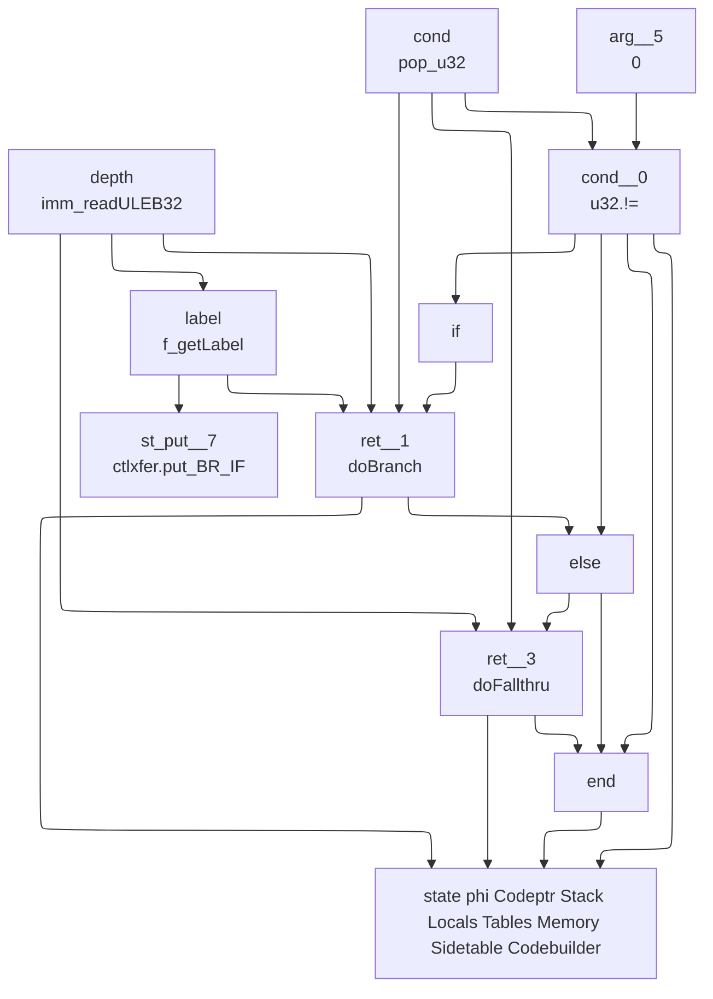

## BR_IF

```mermaid
---
config:
  layout: elk
---
graph TD
	11["
	st_put__7
	ctlxfer.put_BR_IF
	"]
	1 --> 11
	1["
	label
	f_getLabel
	"]
	0 --> 1
	0["
	depth
	imm_readULEB32
	"]
	10["
	state phi Codeptr Stack Locals Tables Memory Sidetable Codebuilder 	"]
	4 --> 10
	7 --> 10
	9 --> 10
	8 --> 10
	8["
	ret__3
	doFallthru
	"]
	2 --> 8
	0 --> 8
	6 --> 8
	6["
	else
	"]
	4 --> 6
	9 --> 6
	9["
	ret__1
	doBranch
	"]
	1 --> 9
	2 --> 9
	0 --> 9
	5 --> 9
	5["
	if
	"]
	4 --> 5
	4["
	cond__0
	u32.!=
	"]
	2 --> 4
	3 --> 4
	3["
	arg__5
	0
	"]
	2["
	cond
	pop_u32
	"]
	7["
	end
	"]
	4 --> 7
	6 --> 7
	8 --> 7
```
