## UNREACHABLE
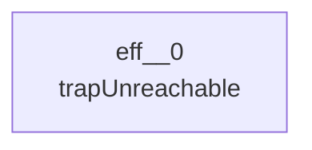
## NOP
```mermaid
---
config:
  layout: elk
---
graph TD
```
## LOCAL_GET
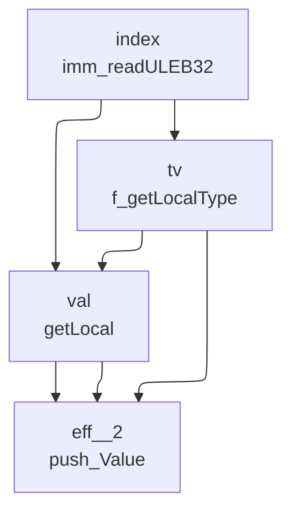
## LOCAL_SET
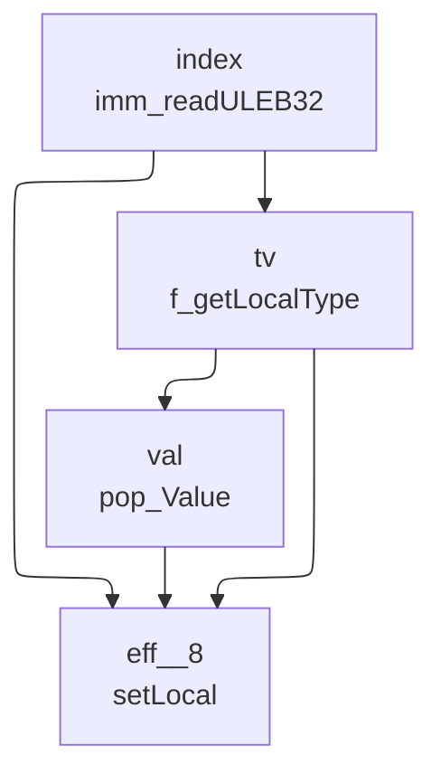
## LOCAL_TEE
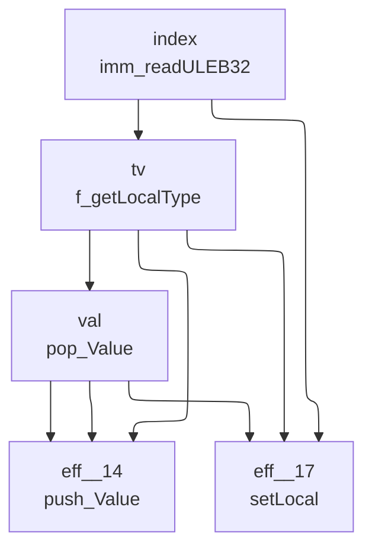
## GLOBAL_GET
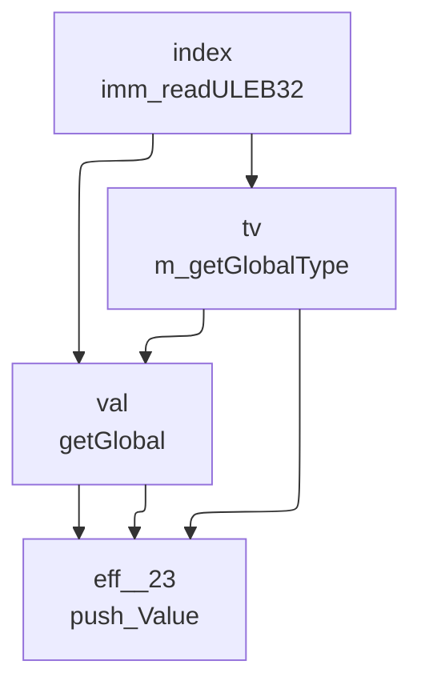
## GLOBAL_SET
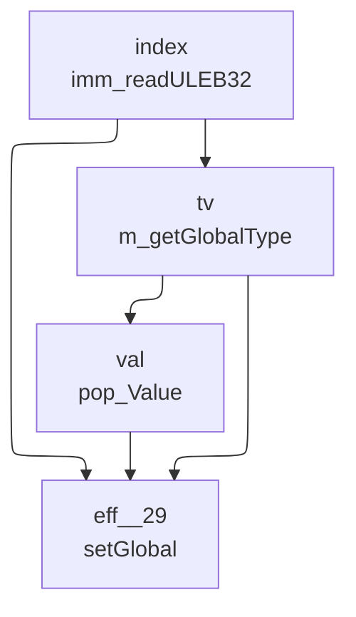
## TABLE_GET
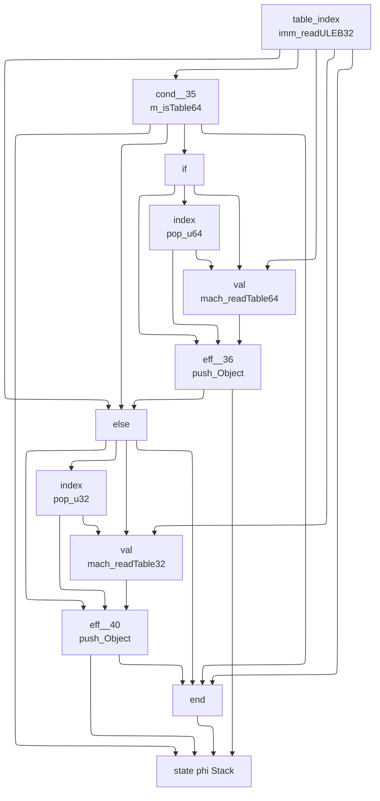
## TABLE_SET
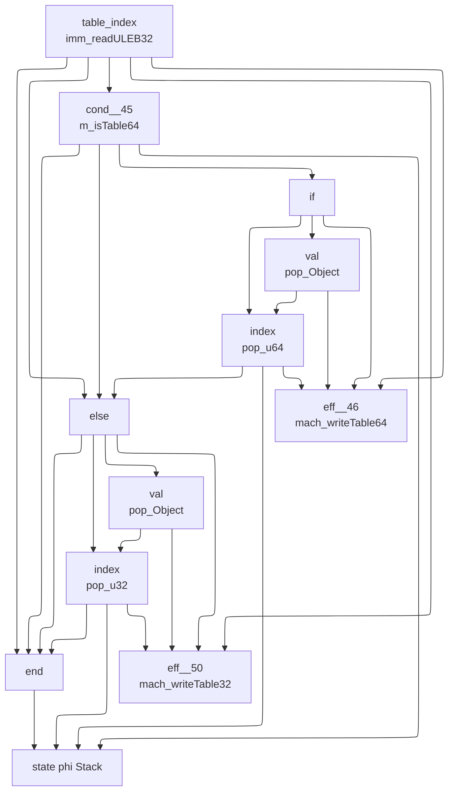
## CALL
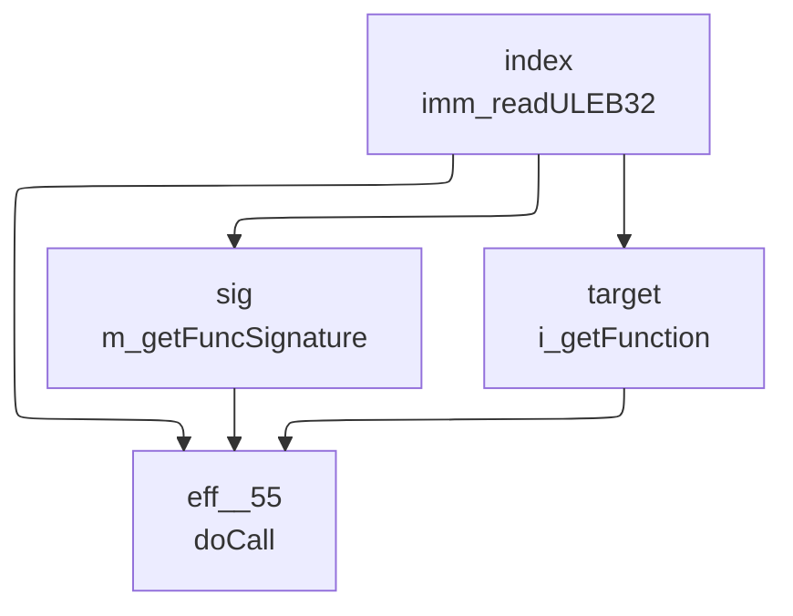
## CALL_INDIRECT
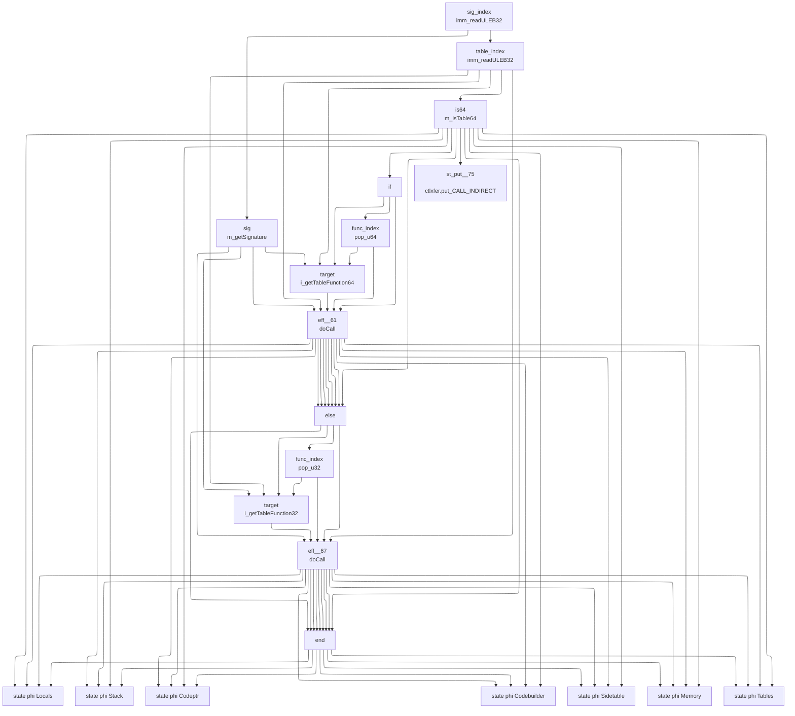
## RETURN_CALL
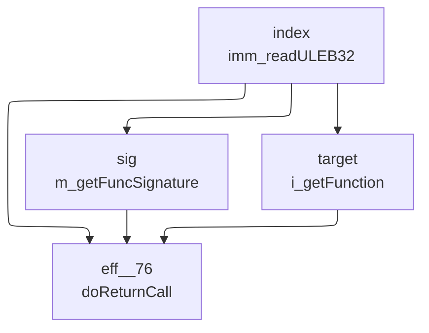
## DROP
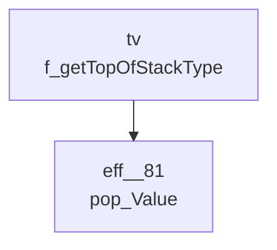
## SELECT
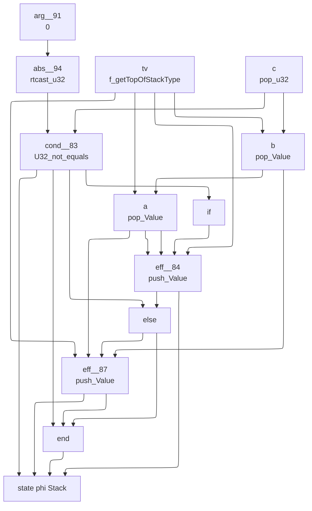
## I32_CONST
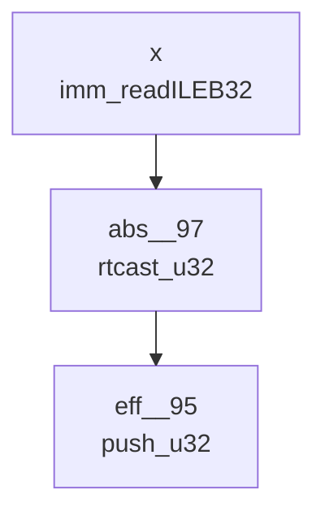
## I32_ADD
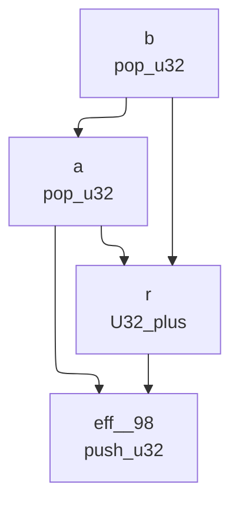
## I32_SUB
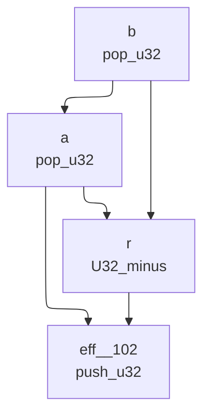
## I32_MUL
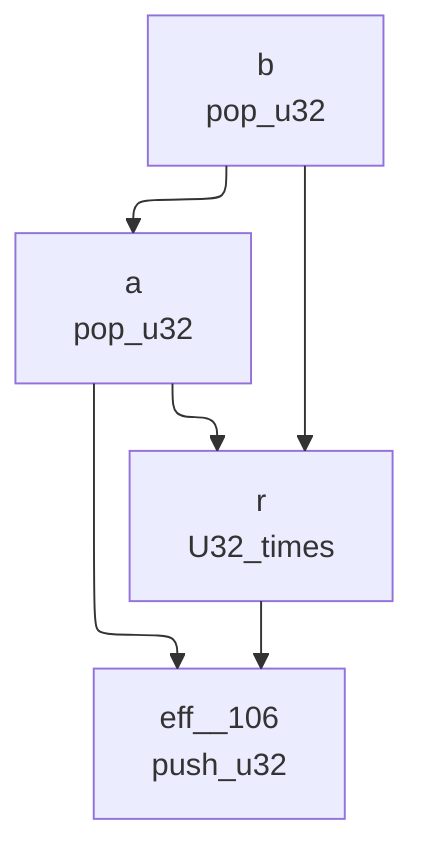
## I32_DIV_S
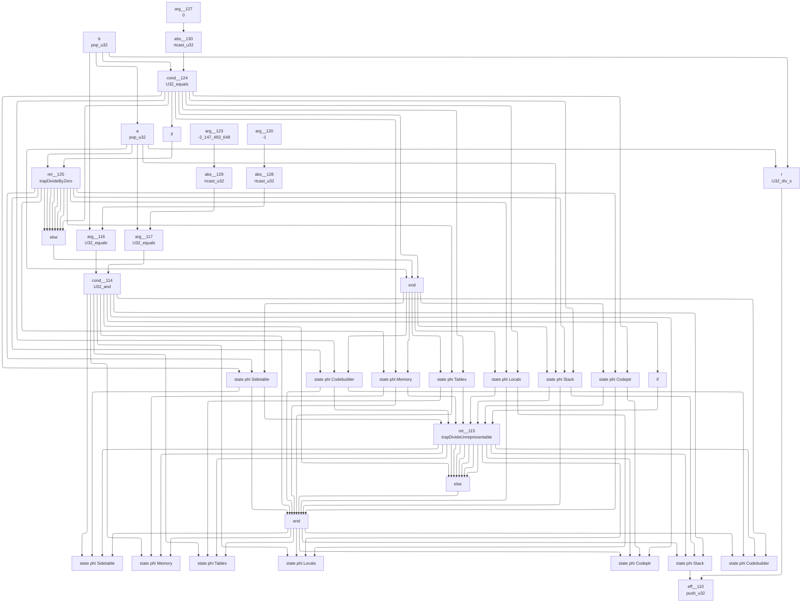
## I32_DIV_U
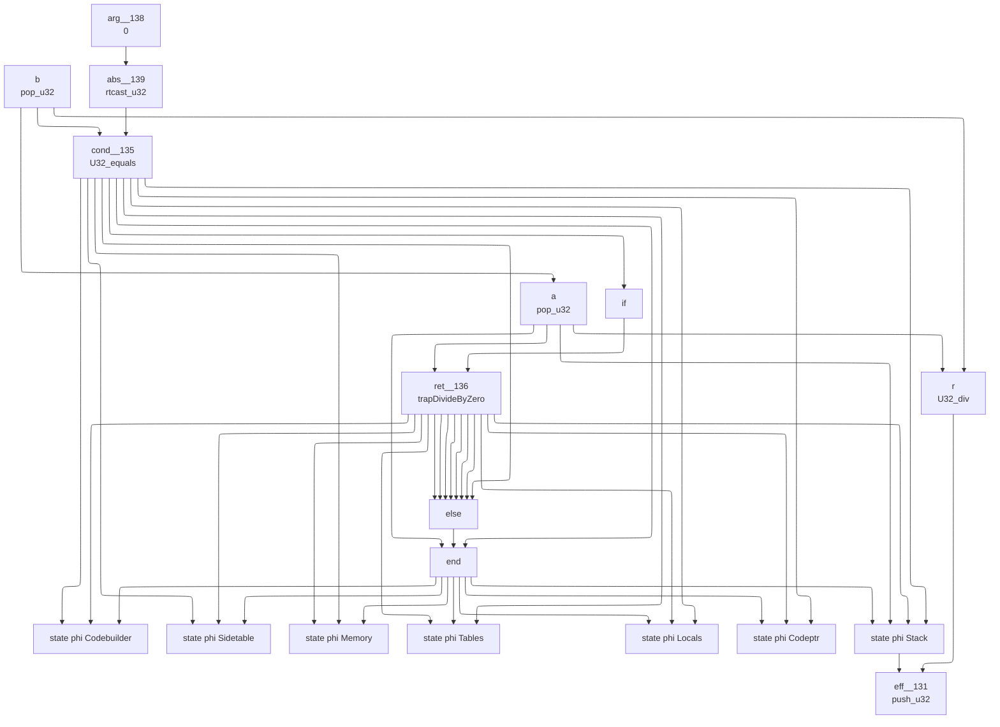
## I32_EQZ
```mermaid
---
config:
  layout: elk
---
graph TD
	13["
	abs__149
	rtcast_u32
	"]
	6 --> 13
	6["
	arg__144
	0
	"]
	12["
	abs__148
	rtcast_u32
	"]
	8 --> 12
	8["
	arg__142
	1
	"]
	11["
	abs__147
	rtcast_u32
	"]
	1 --> 11
	1["
	arg__146
	0
	"]
	10["
	state phi Stack
	"]
	2 --> 10
	5 --> 10
	9 --> 10
	7 --> 10
	7["
	eff__143
	push_u32
	"]
	13 --> 7
	0 --> 7
	4 --> 7
	4["
	else
	"]
	2 --> 4
	9 --> 4
	9["
	eff__141
	push_u32
	"]
	12 --> 9
	0 --> 9
	3 --> 9
	3["
	if
	"]
	2 --> 3
	2["
	cond__140
	U32_equals
	"]
	0 --> 2
	11 --> 2
	0["
	a
	pop_u32
	"]
	5["
	end
	"]
	2 --> 5
	4 --> 5
	7 --> 5
```
## I32_EQ
```mermaid
---
config:
  layout: elk
---
graph TD
	12["
	abs__158
	rtcast_u32
	"]
	6 --> 12
	6["
	arg__154
	0
	"]
	11["
	abs__157
	rtcast_u32
	"]
	8 --> 11
	8["
	arg__152
	1
	"]
	10["
	state phi Stack
	"]
	2 --> 10
	5 --> 10
	9 --> 10
	7 --> 10
	7["
	eff__153
	push_u32
	"]
	12 --> 7
	1 --> 7
	4 --> 7
	4["
	else
	"]
	2 --> 4
	9 --> 4
	9["
	eff__151
	push_u32
	"]
	11 --> 9
	1 --> 9
	3 --> 9
	3["
	if
	"]
	2 --> 3
	2["
	cond__150
	U32_equals
	"]
	1 --> 2
	0 --> 2
	0["
	b
	pop_u32
	"]
	1["
	a
	pop_u32
	"]
	0 --> 1
	5["
	end
	"]
	2 --> 5
	4 --> 5
	7 --> 5
```
## I32_NE
```mermaid
---
config:
  layout: elk
---
graph TD
	12["
	abs__167
	rtcast_u32
	"]
	6 --> 12
	6["
	arg__163
	0
	"]
	11["
	abs__166
	rtcast_u32
	"]
	8 --> 11
	8["
	arg__161
	1
	"]
	10["
	state phi Stack
	"]
	2 --> 10
	5 --> 10
	9 --> 10
	7 --> 10
	7["
	eff__162
	push_u32
	"]
	12 --> 7
	1 --> 7
	4 --> 7
	4["
	else
	"]
	2 --> 4
	9 --> 4
	9["
	eff__160
	push_u32
	"]
	11 --> 9
	1 --> 9
	3 --> 9
	3["
	if
	"]
	2 --> 3
	2["
	cond__159
	U32_not_equals
	"]
	1 --> 2
	0 --> 2
	0["
	b
	pop_u32
	"]
	1["
	a
	pop_u32
	"]
	0 --> 1
	5["
	end
	"]
	2 --> 5
	4 --> 5
	7 --> 5
```
## I32_LT_U
```mermaid
---
config:
  layout: elk
---
graph TD
	12["
	abs__176
	rtcast_u32
	"]
	6 --> 12
	6["
	arg__172
	0
	"]
	11["
	abs__175
	rtcast_u32
	"]
	8 --> 11
	8["
	arg__170
	1
	"]
	10["
	state phi Stack
	"]
	2 --> 10
	5 --> 10
	9 --> 10
	7 --> 10
	7["
	eff__171
	push_u32
	"]
	12 --> 7
	1 --> 7
	4 --> 7
	4["
	else
	"]
	2 --> 4
	9 --> 4
	9["
	eff__169
	push_u32
	"]
	11 --> 9
	1 --> 9
	3 --> 9
	3["
	if
	"]
	2 --> 3
	2["
	cond__168
	U32_lt
	"]
	1 --> 2
	0 --> 2
	0["
	b
	pop_u32
	"]
	1["
	a
	pop_u32
	"]
	0 --> 1
	5["
	end
	"]
	2 --> 5
	4 --> 5
	7 --> 5
```
## I32_LT_S
```mermaid
---
config:
  layout: elk
---
graph TD
	12["
	abs__185
	rtcast_u32
	"]
	6 --> 12
	6["
	arg__181
	0
	"]
	11["
	abs__184
	rtcast_u32
	"]
	8 --> 11
	8["
	arg__179
	1
	"]
	10["
	state phi Stack
	"]
	2 --> 10
	5 --> 10
	9 --> 10
	7 --> 10
	7["
	eff__180
	push_u32
	"]
	12 --> 7
	1 --> 7
	4 --> 7
	4["
	else
	"]
	2 --> 4
	9 --> 4
	9["
	eff__178
	push_u32
	"]
	11 --> 9
	1 --> 9
	3 --> 9
	3["
	if
	"]
	2 --> 3
	2["
	cond__177
	U32_lt_s
	"]
	1 --> 2
	0 --> 2
	0["
	b
	pop_u32
	"]
	1["
	a
	pop_u32
	"]
	0 --> 1
	5["
	end
	"]
	2 --> 5
	4 --> 5
	7 --> 5
```
## I32_LE_S
```mermaid
---
config:
  layout: elk
---
graph TD
	12["
	abs__194
	rtcast_u32
	"]
	6 --> 12
	6["
	arg__190
	0
	"]
	11["
	abs__193
	rtcast_u32
	"]
	8 --> 11
	8["
	arg__188
	1
	"]
	10["
	state phi Stack
	"]
	2 --> 10
	5 --> 10
	9 --> 10
	7 --> 10
	7["
	eff__189
	push_u32
	"]
	12 --> 7
	1 --> 7
	4 --> 7
	4["
	else
	"]
	2 --> 4
	9 --> 4
	9["
	eff__187
	push_u32
	"]
	11 --> 9
	1 --> 9
	3 --> 9
	3["
	if
	"]
	2 --> 3
	2["
	cond__186
	U32_le_s
	"]
	1 --> 2
	0 --> 2
	0["
	b
	pop_u32
	"]
	1["
	a
	pop_u32
	"]
	0 --> 1
	5["
	end
	"]
	2 --> 5
	4 --> 5
	7 --> 5
```
## I32_GT_U
```mermaid
---
config:
  layout: elk
---
graph TD
	12["
	abs__203
	rtcast_u32
	"]
	6 --> 12
	6["
	arg__199
	0
	"]
	11["
	abs__202
	rtcast_u32
	"]
	8 --> 11
	8["
	arg__197
	1
	"]
	10["
	state phi Stack
	"]
	2 --> 10
	5 --> 10
	9 --> 10
	7 --> 10
	7["
	eff__198
	push_u32
	"]
	12 --> 7
	1 --> 7
	4 --> 7
	4["
	else
	"]
	2 --> 4
	9 --> 4
	9["
	eff__196
	push_u32
	"]
	11 --> 9
	1 --> 9
	3 --> 9
	3["
	if
	"]
	2 --> 3
	2["
	cond__195
	U32_gt
	"]
	1 --> 2
	0 --> 2
	0["
	b
	pop_u32
	"]
	1["
	a
	pop_u32
	"]
	0 --> 1
	5["
	end
	"]
	2 --> 5
	4 --> 5
	7 --> 5
```
## I32_LE_U
```mermaid
---
config:
  layout: elk
---
graph TD
	12["
	abs__212
	rtcast_u32
	"]
	6 --> 12
	6["
	arg__208
	0
	"]
	11["
	abs__211
	rtcast_u32
	"]
	8 --> 11
	8["
	arg__206
	1
	"]
	10["
	state phi Stack
	"]
	2 --> 10
	5 --> 10
	9 --> 10
	7 --> 10
	7["
	eff__207
	push_u32
	"]
	12 --> 7
	1 --> 7
	4 --> 7
	4["
	else
	"]
	2 --> 4
	9 --> 4
	9["
	eff__205
	push_u32
	"]
	11 --> 9
	1 --> 9
	3 --> 9
	3["
	if
	"]
	2 --> 3
	2["
	cond__204
	U32_lte
	"]
	1 --> 2
	0 --> 2
	0["
	b
	pop_u32
	"]
	1["
	a
	pop_u32
	"]
	0 --> 1
	5["
	end
	"]
	2 --> 5
	4 --> 5
	7 --> 5
```
## I32_GT_S
```mermaid
---
config:
  layout: elk
---
graph TD
	12["
	abs__221
	rtcast_u32
	"]
	6 --> 12
	6["
	arg__217
	0
	"]
	11["
	abs__220
	rtcast_u32
	"]
	8 --> 11
	8["
	arg__215
	1
	"]
	10["
	state phi Stack
	"]
	2 --> 10
	5 --> 10
	9 --> 10
	7 --> 10
	7["
	eff__216
	push_u32
	"]
	12 --> 7
	1 --> 7
	4 --> 7
	4["
	else
	"]
	2 --> 4
	9 --> 4
	9["
	eff__214
	push_u32
	"]
	11 --> 9
	1 --> 9
	3 --> 9
	3["
	if
	"]
	2 --> 3
	2["
	cond__213
	U32_gt_s
	"]
	1 --> 2
	0 --> 2
	0["
	b
	pop_u32
	"]
	1["
	a
	pop_u32
	"]
	0 --> 1
	5["
	end
	"]
	2 --> 5
	4 --> 5
	7 --> 5
```
## I32_GE_U
```mermaid
---
config:
  layout: elk
---
graph TD
	12["
	abs__230
	rtcast_u32
	"]
	6 --> 12
	6["
	arg__226
	0
	"]
	11["
	abs__229
	rtcast_u32
	"]
	8 --> 11
	8["
	arg__224
	1
	"]
	10["
	state phi Stack
	"]
	2 --> 10
	5 --> 10
	9 --> 10
	7 --> 10
	7["
	eff__225
	push_u32
	"]
	12 --> 7
	1 --> 7
	4 --> 7
	4["
	else
	"]
	2 --> 4
	9 --> 4
	9["
	eff__223
	push_u32
	"]
	11 --> 9
	1 --> 9
	3 --> 9
	3["
	if
	"]
	2 --> 3
	2["
	cond__222
	U32_ge_u
	"]
	1 --> 2
	0 --> 2
	0["
	b
	pop_u32
	"]
	1["
	a
	pop_u32
	"]
	0 --> 1
	5["
	end
	"]
	2 --> 5
	4 --> 5
	7 --> 5
```
## I32_GE_S
```mermaid
---
config:
  layout: elk
---
graph TD
	12["
	abs__239
	rtcast_u32
	"]
	6 --> 12
	6["
	arg__235
	0
	"]
	11["
	abs__238
	rtcast_u32
	"]
	8 --> 11
	8["
	arg__233
	1
	"]
	10["
	state phi Stack
	"]
	2 --> 10
	5 --> 10
	9 --> 10
	7 --> 10
	7["
	eff__234
	push_u32
	"]
	12 --> 7
	1 --> 7
	4 --> 7
	4["
	else
	"]
	2 --> 4
	9 --> 4
	9["
	eff__232
	push_u32
	"]
	11 --> 9
	1 --> 9
	3 --> 9
	3["
	if
	"]
	2 --> 3
	2["
	cond__231
	U32_ge_s
	"]
	1 --> 2
	0 --> 2
	0["
	b
	pop_u32
	"]
	1["
	a
	pop_u32
	"]
	0 --> 1
	5["
	end
	"]
	2 --> 5
	4 --> 5
	7 --> 5
```
## I32_AND
```mermaid
---
config:
  layout: elk
---
graph TD
	3["
	eff__240
	push_u32
	"]
	2 --> 3
	1 --> 3
	1["
	a
	pop_u32
	"]
	0 --> 1
	0["
	b
	pop_u32
	"]
	2["
	r
	U32_and
	"]
	1 --> 2
	0 --> 2
```
## I32_OR
```mermaid
---
config:
  layout: elk
---
graph TD
	3["
	eff__244
	push_u32
	"]
	2 --> 3
	1 --> 3
	1["
	a
	pop_u32
	"]
	0 --> 1
	0["
	b
	pop_u32
	"]
	2["
	r
	U32_or
	"]
	1 --> 2
	0 --> 2
```
## I32_XOR
```mermaid
---
config:
  layout: elk
---
graph TD
	3["
	eff__248
	push_u32
	"]
	2 --> 3
	1 --> 3
	1["
	a
	pop_u32
	"]
	0 --> 1
	0["
	b
	pop_u32
	"]
	2["
	r
	U32_or
	"]
	1 --> 2
	0 --> 2
```
## I32_SHL
```mermaid
---
config:
  layout: elk
---
graph TD
	3["
	eff__252
	push_u32
	"]
	2 --> 3
	1 --> 3
	1["
	a
	pop_u32
	"]
	0 --> 1
	0["
	b
	pop_u32
	"]
	2["
	r
	U32_shl
	"]
	1 --> 2
	0 --> 2
```
## I32_SHR_U
```mermaid
---
config:
  layout: elk
---
graph TD
	3["
	eff__256
	push_u32
	"]
	2 --> 3
	1 --> 3
	1["
	a
	pop_u32
	"]
	0 --> 1
	0["
	b
	pop_u32
	"]
	2["
	r
	U32_shr_u
	"]
	1 --> 2
	0 --> 2
```
## I32_SHR_S
```mermaid
---
config:
  layout: elk
---
graph TD
	3["
	eff__260
	push_u32
	"]
	2 --> 3
	1 --> 3
	1["
	a
	pop_u32
	"]
	0 --> 1
	0["
	b
	pop_u32
	"]
	2["
	r
	U32_shr_s
	"]
	1 --> 2
	0 --> 2
```
## I32_ROTL
```mermaid
---
config:
  layout: elk
---
graph TD
	3["
	eff__264
	push_u32
	"]
	2 --> 3
	1 --> 3
	1["
	a
	pop_u32
	"]
	0 --> 1
	0["
	b
	pop_u32
	"]
	2["
	r
	U32_rotl
	"]
	1 --> 2
	0 --> 2
```
## I32_ROTR
```mermaid
---
config:
  layout: elk
---
graph TD
	3["
	eff__268
	push_u32
	"]
	2 --> 3
	1 --> 3
	1["
	a
	pop_u32
	"]
	0 --> 1
	0["
	b
	pop_u32
	"]
	2["
	r
	U32_rotr
	"]
	1 --> 2
	0 --> 2
```
## I32_CLZ
```mermaid
---
config:
  layout: elk
---
graph TD
	2["
	eff__272
	push_u32
	"]
	1 --> 2
	0 --> 2
	0["
	a
	pop_u32
	"]
	1["
	r
	U32_clz
	"]
	0 --> 1
```
## I32_CTZ
```mermaid
---
config:
  layout: elk
---
graph TD
	2["
	eff__275
	push_u32
	"]
	1 --> 2
	0 --> 2
	0["
	a
	pop_u32
	"]
	1["
	r
	U32_ctz
	"]
	0 --> 1
```
## I32_POPCNT
```mermaid
---
config:
  layout: elk
---
graph TD
	2["
	eff__278
	push_u32
	"]
	1 --> 2
	0 --> 2
	0["
	a
	pop_u32
	"]
	1["
	r
	U32_popcnt
	"]
	0 --> 1
```
## I32_REM_S
```mermaid
---
config:
  layout: elk
---
graph TD
	14["
	state phi Codebuilder
	"]
	3 --> 14
	6 --> 14
	7 --> 14
	7["
	ret__286
	trapDivideByZero
	"]
	1 --> 7
	4 --> 7
	4["
	if
	"]
	3 --> 4
	3["
	cond__285
	U32_equals
	"]
	0 --> 3
	17 --> 3
	17["
	abs__289
	rtcast_u32
	"]
	2 --> 17
	2["
	arg__288
	0
	"]
	0["
	b
	pop_u32
	"]
	1["
	a
	pop_u32
	"]
	0 --> 1
	6["
	end
	"]
	3 --> 6
	5 --> 6
	1 --> 6
	5["
	else
	"]
	3 --> 5
	7 --> 5
	7 --> 5
	7 --> 5
	7 --> 5
	7 --> 5
	7 --> 5
	7 --> 5
	13["
	state phi Sidetable
	"]
	3 --> 13
	6 --> 13
	7 --> 13
	12["
	state phi Memory
	"]
	3 --> 12
	6 --> 12
	7 --> 12
	11["
	state phi Tables
	"]
	3 --> 11
	6 --> 11
	7 --> 11
	10["
	state phi Locals
	"]
	3 --> 10
	6 --> 10
	7 --> 10
	8["
	state phi Codeptr
	"]
	3 --> 8
	6 --> 8
	7 --> 8
	16["
	eff__281
	push_u32
	"]
	15 --> 16
	9 --> 16
	9["
	state phi Stack
	"]
	3 --> 9
	6 --> 9
	7 --> 9
	1 --> 9
	15["
	r
	U32_rem_s
	"]
	1 --> 15
	0 --> 15
```
## I32_REM_U
```mermaid
---
config:
  layout: elk
---
graph TD
	14["
	state phi Codebuilder
	"]
	3 --> 14
	6 --> 14
	7 --> 14
	7["
	ret__295
	trapDivideByZero
	"]
	1 --> 7
	4 --> 7
	4["
	if
	"]
	3 --> 4
	3["
	cond__294
	U32_equals
	"]
	0 --> 3
	17 --> 3
	17["
	abs__298
	rtcast_u32
	"]
	2 --> 17
	2["
	arg__297
	0
	"]
	0["
	b
	pop_u32
	"]
	1["
	a
	pop_u32
	"]
	0 --> 1
	6["
	end
	"]
	3 --> 6
	5 --> 6
	1 --> 6
	5["
	else
	"]
	3 --> 5
	7 --> 5
	7 --> 5
	7 --> 5
	7 --> 5
	7 --> 5
	7 --> 5
	7 --> 5
	13["
	state phi Sidetable
	"]
	3 --> 13
	6 --> 13
	7 --> 13
	12["
	state phi Memory
	"]
	3 --> 12
	6 --> 12
	7 --> 12
	11["
	state phi Tables
	"]
	3 --> 11
	6 --> 11
	7 --> 11
	10["
	state phi Locals
	"]
	3 --> 10
	6 --> 10
	7 --> 10
	8["
	state phi Codeptr
	"]
	3 --> 8
	6 --> 8
	7 --> 8
	16["
	eff__290
	push_u32
	"]
	15 --> 16
	9 --> 16
	9["
	state phi Stack
	"]
	3 --> 9
	6 --> 9
	7 --> 9
	1 --> 9
	15["
	r
	U32_rem_u
	"]
	1 --> 15
	0 --> 15
```
## I32_EXTEND8_S
```mermaid
---
config:
  layout: elk
---
graph TD
	2["
	eff__299
	push_u32
	"]
	1 --> 2
	0 --> 2
	0["
	a
	pop_u32
	"]
	1["
	r
	U32_extend8_s
	"]
	0 --> 1
```
## I32_EXTEND16_S
```mermaid
---
config:
  layout: elk
---
graph TD
	2["
	eff__302
	push_u32
	"]
	1 --> 2
	0 --> 2
	0["
	a
	pop_u32
	"]
	1["
	r
	U32_extend16_s
	"]
	0 --> 1
```
## I64_CONST
```mermaid
---
config:
  layout: elk
---
graph TD
	2["
	abs__307
	rtcast_u64
	"]
	0 --> 2
	0["
	x
	imm_readILEB64
	"]
	1["
	eff__305
	push_u64
	"]
	2 --> 1
```
## I64_ADD
```mermaid
---
config:
  layout: elk
---
graph TD
	3["
	eff__308
	push_u64
	"]
	2 --> 3
	1 --> 3
	1["
	a
	pop_u64
	"]
	0 --> 1
	0["
	b
	pop_u64
	"]
	2["
	r
	U64_plus
	"]
	1 --> 2
	0 --> 2
```
## I64_SUB
```mermaid
---
config:
  layout: elk
---
graph TD
	3["
	eff__312
	push_u64
	"]
	2 --> 3
	1 --> 3
	1["
	a
	pop_u64
	"]
	0 --> 1
	0["
	b
	pop_u64
	"]
	2["
	r
	U64_minus
	"]
	1 --> 2
	0 --> 2
```
## I64_MUL
```mermaid
---
config:
  layout: elk
---
graph TD
	3["
	eff__316
	push_u64
	"]
	2 --> 3
	1 --> 3
	1["
	a
	pop_u64
	"]
	0 --> 1
	0["
	b
	pop_u64
	"]
	2["
	r
	U64_times
	"]
	1 --> 2
	0 --> 2
```
## I64_DIV_S
```mermaid
---
config:
  layout: elk
---
graph TD
	31["
	state phi Sidetable
	"]
	21 --> 31
	24 --> 31
	25 --> 31
	13 --> 31
	13["
	state phi Sidetable
	"]
	3 --> 13
	6 --> 13
	7 --> 13
	7["
	ret__335
	trapDivideByZero
	"]
	1 --> 7
	4 --> 7
	4["
	if
	"]
	3 --> 4
	3["
	cond__334
	U64_equals
	"]
	0 --> 3
	2 --> 3
	2["
	arg__337
	0
	"]
	0["
	b
	pop_u64
	"]
	1["
	a
	pop_u64
	"]
	0 --> 1
	6["
	end
	"]
	3 --> 6
	5 --> 6
	1 --> 6
	5["
	else
	"]
	3 --> 5
	7 --> 5
	7 --> 5
	7 --> 5
	7 --> 5
	7 --> 5
	7 --> 5
	7 --> 5
	25["
	ret__325
	trapDivideUnrepresentable
	"]
	14 --> 25
	13 --> 25
	12 --> 25
	11 --> 25
	10 --> 25
	9 --> 25
	8 --> 25
	22 --> 25
	22["
	if
	"]
	21 --> 22
	21["
	cond__324
	bot_and
	"]
	20 --> 21
	17 --> 21
	17["
	arg__327
	U64_equals
	"]
	1 --> 17
	16 --> 17
	16["
	arg__333
	-9223372036854775808L
	"]
	20["
	arg__326
	U64_equals
	"]
	0 --> 20
	19 --> 20
	19["
	arg__330
	-1
	"]
	8["
	state phi Codeptr
	"]
	3 --> 8
	6 --> 8
	7 --> 8
	9["
	state phi Stack
	"]
	3 --> 9
	6 --> 9
	7 --> 9
	1 --> 9
	10["
	state phi Locals
	"]
	3 --> 10
	6 --> 10
	7 --> 10
	11["
	state phi Tables
	"]
	3 --> 11
	6 --> 11
	7 --> 11
	12["
	state phi Memory
	"]
	3 --> 12
	6 --> 12
	7 --> 12
	14["
	state phi Codebuilder
	"]
	3 --> 14
	6 --> 14
	7 --> 14
	24["
	end
	"]
	21 --> 24
	23 --> 24
	8 --> 24
	9 --> 24
	10 --> 24
	11 --> 24
	12 --> 24
	13 --> 24
	14 --> 24
	23["
	else
	"]
	21 --> 23
	25 --> 23
	25 --> 23
	25 --> 23
	25 --> 23
	25 --> 23
	25 --> 23
	25 --> 23
	30["
	state phi Memory
	"]
	21 --> 30
	24 --> 30
	25 --> 30
	12 --> 30
	29["
	state phi Tables
	"]
	21 --> 29
	24 --> 29
	25 --> 29
	11 --> 29
	28["
	state phi Locals
	"]
	21 --> 28
	24 --> 28
	25 --> 28
	10 --> 28
	26["
	state phi Codeptr
	"]
	21 --> 26
	24 --> 26
	25 --> 26
	8 --> 26
	34["
	eff__320
	push_u64
	"]
	33 --> 34
	27 --> 34
	27["
	state phi Stack
	"]
	21 --> 27
	24 --> 27
	25 --> 27
	9 --> 27
	33["
	r
	U64_div_s
	"]
	1 --> 33
	0 --> 33
	32["
	state phi Codebuilder
	"]
	21 --> 32
	24 --> 32
	25 --> 32
	14 --> 32
```
## I64_DIV_U
```mermaid
---
config:
  layout: elk
---
graph TD
	14["
	state phi Codebuilder
	"]
	3 --> 14
	6 --> 14
	7 --> 14
	7["
	ret__343
	trapDivideByZero
	"]
	1 --> 7
	4 --> 7
	4["
	if
	"]
	3 --> 4
	3["
	cond__342
	U64_equals
	"]
	0 --> 3
	2 --> 3
	2["
	arg__345
	0
	"]
	0["
	b
	pop_u64
	"]
	1["
	a
	pop_u64
	"]
	0 --> 1
	6["
	end
	"]
	3 --> 6
	5 --> 6
	1 --> 6
	5["
	else
	"]
	3 --> 5
	7 --> 5
	7 --> 5
	7 --> 5
	7 --> 5
	7 --> 5
	7 --> 5
	7 --> 5
	13["
	state phi Sidetable
	"]
	3 --> 13
	6 --> 13
	7 --> 13
	12["
	state phi Memory
	"]
	3 --> 12
	6 --> 12
	7 --> 12
	11["
	state phi Tables
	"]
	3 --> 11
	6 --> 11
	7 --> 11
	10["
	state phi Locals
	"]
	3 --> 10
	6 --> 10
	7 --> 10
	8["
	state phi Codeptr
	"]
	3 --> 8
	6 --> 8
	7 --> 8
	16["
	eff__338
	push_u64
	"]
	15 --> 16
	9 --> 16
	9["
	state phi Stack
	"]
	3 --> 9
	6 --> 9
	7 --> 9
	1 --> 9
	15["
	r
	U64_div
	"]
	1 --> 15
	0 --> 15
```
## I64_REM_S
```mermaid
---
config:
  layout: elk
---
graph TD
	14["
	state phi Codebuilder
	"]
	3 --> 14
	6 --> 14
	7 --> 14
	7["
	ret__351
	trapDivideByZero
	"]
	1 --> 7
	4 --> 7
	4["
	if
	"]
	3 --> 4
	3["
	cond__350
	U64_equals
	"]
	0 --> 3
	2 --> 3
	2["
	arg__353
	0
	"]
	0["
	b
	pop_u64
	"]
	1["
	a
	pop_u64
	"]
	0 --> 1
	6["
	end
	"]
	3 --> 6
	5 --> 6
	1 --> 6
	5["
	else
	"]
	3 --> 5
	7 --> 5
	7 --> 5
	7 --> 5
	7 --> 5
	7 --> 5
	7 --> 5
	7 --> 5
	13["
	state phi Sidetable
	"]
	3 --> 13
	6 --> 13
	7 --> 13
	12["
	state phi Memory
	"]
	3 --> 12
	6 --> 12
	7 --> 12
	11["
	state phi Tables
	"]
	3 --> 11
	6 --> 11
	7 --> 11
	10["
	state phi Locals
	"]
	3 --> 10
	6 --> 10
	7 --> 10
	8["
	state phi Codeptr
	"]
	3 --> 8
	6 --> 8
	7 --> 8
	16["
	eff__346
	push_u64
	"]
	15 --> 16
	9 --> 16
	9["
	state phi Stack
	"]
	3 --> 9
	6 --> 9
	7 --> 9
	1 --> 9
	15["
	r
	U64_rem_s
	"]
	1 --> 15
	0 --> 15
```
## I64_REM_U
```mermaid
---
config:
  layout: elk
---
graph TD
	14["
	state phi Codebuilder
	"]
	3 --> 14
	6 --> 14
	7 --> 14
	7["
	ret__359
	trapDivideByZero
	"]
	1 --> 7
	4 --> 7
	4["
	if
	"]
	3 --> 4
	3["
	cond__358
	U64_equals
	"]
	0 --> 3
	2 --> 3
	2["
	arg__361
	0
	"]
	0["
	b
	pop_u64
	"]
	1["
	a
	pop_u64
	"]
	0 --> 1
	6["
	end
	"]
	3 --> 6
	5 --> 6
	1 --> 6
	5["
	else
	"]
	3 --> 5
	7 --> 5
	7 --> 5
	7 --> 5
	7 --> 5
	7 --> 5
	7 --> 5
	7 --> 5
	13["
	state phi Sidetable
	"]
	3 --> 13
	6 --> 13
	7 --> 13
	12["
	state phi Memory
	"]
	3 --> 12
	6 --> 12
	7 --> 12
	11["
	state phi Tables
	"]
	3 --> 11
	6 --> 11
	7 --> 11
	10["
	state phi Locals
	"]
	3 --> 10
	6 --> 10
	7 --> 10
	8["
	state phi Codeptr
	"]
	3 --> 8
	6 --> 8
	7 --> 8
	16["
	eff__354
	push_u64
	"]
	15 --> 16
	9 --> 16
	9["
	state phi Stack
	"]
	3 --> 9
	6 --> 9
	7 --> 9
	1 --> 9
	15["
	r
	U64_rem_u
	"]
	1 --> 15
	0 --> 15
```
## I64_AND
```mermaid
---
config:
  layout: elk
---
graph TD
	3["
	eff__362
	push_u64
	"]
	2 --> 3
	1 --> 3
	1["
	a
	pop_u64
	"]
	0 --> 1
	0["
	b
	pop_u64
	"]
	2["
	r
	U64_and
	"]
	1 --> 2
	0 --> 2
```
## I64_OR
```mermaid
---
config:
  layout: elk
---
graph TD
	3["
	eff__366
	push_u64
	"]
	2 --> 3
	1 --> 3
	1["
	a
	pop_u64
	"]
	0 --> 1
	0["
	b
	pop_u64
	"]
	2["
	r
	U64_or
	"]
	1 --> 2
	0 --> 2
```
## I64_XOR
```mermaid
---
config:
  layout: elk
---
graph TD
	3["
	eff__370
	push_u64
	"]
	2 --> 3
	1 --> 3
	1["
	a
	pop_u64
	"]
	0 --> 1
	0["
	b
	pop_u64
	"]
	2["
	r
	U64_or
	"]
	1 --> 2
	0 --> 2
```
## I64_SHL
```mermaid
---
config:
  layout: elk
---
graph TD
	3["
	eff__374
	push_u64
	"]
	2 --> 3
	1 --> 3
	1["
	a
	pop_u64
	"]
	0 --> 1
	0["
	b
	pop_u64
	"]
	2["
	r
	U64_shl
	"]
	1 --> 2
	0 --> 2
```
## I64_SHR_U
```mermaid
---
config:
  layout: elk
---
graph TD
	3["
	eff__378
	push_u64
	"]
	2 --> 3
	1 --> 3
	1["
	a
	pop_u64
	"]
	0 --> 1
	0["
	b
	pop_u64
	"]
	2["
	r
	U64_shr_u
	"]
	1 --> 2
	0 --> 2
```
## I64_SHR_S
```mermaid
---
config:
  layout: elk
---
graph TD
	3["
	eff__382
	push_u64
	"]
	2 --> 3
	1 --> 3
	1["
	a
	pop_u64
	"]
	0 --> 1
	0["
	b
	pop_u64
	"]
	2["
	r
	U64_shr_s
	"]
	1 --> 2
	0 --> 2
```
## I64_ROTL
```mermaid
---
config:
  layout: elk
---
graph TD
	3["
	eff__386
	push_u64
	"]
	2 --> 3
	1 --> 3
	1["
	a
	pop_u64
	"]
	0 --> 1
	0["
	b
	pop_u64
	"]
	2["
	r
	U64_rotl
	"]
	1 --> 2
	0 --> 2
```
## I64_ROTR
```mermaid
---
config:
  layout: elk
---
graph TD
	3["
	eff__390
	push_u64
	"]
	2 --> 3
	1 --> 3
	1["
	a
	pop_u64
	"]
	0 --> 1
	0["
	b
	pop_u64
	"]
	2["
	r
	U64_rotr
	"]
	1 --> 2
	0 --> 2
```
## I64_CLZ
```mermaid
---
config:
  layout: elk
---
graph TD
	2["
	eff__394
	push_u64
	"]
	1 --> 2
	0 --> 2
	0["
	a
	pop_u64
	"]
	1["
	r
	U64_clz
	"]
	0 --> 1
```
## I64_CTZ
```mermaid
---
config:
  layout: elk
---
graph TD
	2["
	eff__397
	push_u64
	"]
	1 --> 2
	0 --> 2
	0["
	a
	pop_u64
	"]
	1["
	r
	U64_ctz
	"]
	0 --> 1
```
## I64_POPCNT
```mermaid
---
config:
  layout: elk
---
graph TD
	2["
	eff__400
	push_u64
	"]
	1 --> 2
	0 --> 2
	0["
	a
	pop_u64
	"]
	1["
	r
	U64_popcnt
	"]
	0 --> 1
```
## I64_EQZ
```mermaid
---
config:
  layout: elk
---
graph TD
	12["
	abs__411
	rtcast_u32
	"]
	6 --> 12
	6["
	arg__407
	0
	"]
	11["
	abs__410
	rtcast_u32
	"]
	8 --> 11
	8["
	arg__405
	1
	"]
	10["
	state phi Stack
	"]
	2 --> 10
	5 --> 10
	9 --> 10
	7 --> 10
	7["
	eff__406
	push_u32
	"]
	12 --> 7
	0 --> 7
	4 --> 7
	4["
	else
	"]
	2 --> 4
	9 --> 4
	9["
	eff__404
	push_u32
	"]
	11 --> 9
	0 --> 9
	3 --> 9
	3["
	if
	"]
	2 --> 3
	2["
	cond__403
	U64_equals
	"]
	0 --> 2
	1 --> 2
	1["
	arg__409
	0
	"]
	0["
	a
	pop_u64
	"]
	5["
	end
	"]
	2 --> 5
	4 --> 5
	7 --> 5
```
## I64_EQ
```mermaid
---
config:
  layout: elk
---
graph TD
	12["
	abs__420
	rtcast_u32
	"]
	6 --> 12
	6["
	arg__416
	0
	"]
	11["
	abs__419
	rtcast_u32
	"]
	8 --> 11
	8["
	arg__414
	1
	"]
	10["
	state phi Stack
	"]
	2 --> 10
	5 --> 10
	9 --> 10
	7 --> 10
	7["
	eff__415
	push_u32
	"]
	12 --> 7
	1 --> 7
	4 --> 7
	4["
	else
	"]
	2 --> 4
	9 --> 4
	9["
	eff__413
	push_u32
	"]
	11 --> 9
	1 --> 9
	3 --> 9
	3["
	if
	"]
	2 --> 3
	2["
	cond__412
	U64_equals
	"]
	1 --> 2
	0 --> 2
	0["
	b
	pop_u64
	"]
	1["
	a
	pop_u64
	"]
	0 --> 1
	5["
	end
	"]
	2 --> 5
	4 --> 5
	7 --> 5
```
## I64_NE
```mermaid
---
config:
  layout: elk
---
graph TD
	12["
	abs__429
	rtcast_u32
	"]
	6 --> 12
	6["
	arg__425
	0
	"]
	11["
	abs__428
	rtcast_u32
	"]
	8 --> 11
	8["
	arg__423
	1
	"]
	10["
	state phi Stack
	"]
	2 --> 10
	5 --> 10
	9 --> 10
	7 --> 10
	7["
	eff__424
	push_u32
	"]
	12 --> 7
	1 --> 7
	4 --> 7
	4["
	else
	"]
	2 --> 4
	9 --> 4
	9["
	eff__422
	push_u32
	"]
	11 --> 9
	1 --> 9
	3 --> 9
	3["
	if
	"]
	2 --> 3
	2["
	cond__421
	U64_not_equals
	"]
	1 --> 2
	0 --> 2
	0["
	b
	pop_u64
	"]
	1["
	a
	pop_u64
	"]
	0 --> 1
	5["
	end
	"]
	2 --> 5
	4 --> 5
	7 --> 5
```
## I64_LT_S
```mermaid
---
config:
  layout: elk
---
graph TD
	12["
	abs__438
	rtcast_u32
	"]
	6 --> 12
	6["
	arg__434
	0
	"]
	11["
	abs__437
	rtcast_u32
	"]
	8 --> 11
	8["
	arg__432
	1
	"]
	10["
	state phi Stack
	"]
	2 --> 10
	5 --> 10
	9 --> 10
	7 --> 10
	7["
	eff__433
	push_u32
	"]
	12 --> 7
	1 --> 7
	4 --> 7
	4["
	else
	"]
	2 --> 4
	9 --> 4
	9["
	eff__431
	push_u32
	"]
	11 --> 9
	1 --> 9
	3 --> 9
	3["
	if
	"]
	2 --> 3
	2["
	cond__430
	U64_lt_s
	"]
	1 --> 2
	0 --> 2
	0["
	b
	pop_u64
	"]
	1["
	a
	pop_u64
	"]
	0 --> 1
	5["
	end
	"]
	2 --> 5
	4 --> 5
	7 --> 5
```
## I64_LT_U
```mermaid
---
config:
  layout: elk
---
graph TD
	12["
	abs__447
	rtcast_u32
	"]
	6 --> 12
	6["
	arg__443
	0
	"]
	11["
	abs__446
	rtcast_u32
	"]
	8 --> 11
	8["
	arg__441
	1
	"]
	10["
	state phi Stack
	"]
	2 --> 10
	5 --> 10
	9 --> 10
	7 --> 10
	7["
	eff__442
	push_u32
	"]
	12 --> 7
	1 --> 7
	4 --> 7
	4["
	else
	"]
	2 --> 4
	9 --> 4
	9["
	eff__440
	push_u32
	"]
	11 --> 9
	1 --> 9
	3 --> 9
	3["
	if
	"]
	2 --> 3
	2["
	cond__439
	U64_lt
	"]
	1 --> 2
	0 --> 2
	0["
	b
	pop_u64
	"]
	1["
	a
	pop_u64
	"]
	0 --> 1
	5["
	end
	"]
	2 --> 5
	4 --> 5
	7 --> 5
```
## I64_LE_S
```mermaid
---
config:
  layout: elk
---
graph TD
	12["
	abs__456
	rtcast_u32
	"]
	6 --> 12
	6["
	arg__452
	0
	"]
	11["
	abs__455
	rtcast_u32
	"]
	8 --> 11
	8["
	arg__450
	1
	"]
	10["
	state phi Stack
	"]
	2 --> 10
	5 --> 10
	9 --> 10
	7 --> 10
	7["
	eff__451
	push_u32
	"]
	12 --> 7
	1 --> 7
	4 --> 7
	4["
	else
	"]
	2 --> 4
	9 --> 4
	9["
	eff__449
	push_u32
	"]
	11 --> 9
	1 --> 9
	3 --> 9
	3["
	if
	"]
	2 --> 3
	2["
	cond__448
	U64_le_s
	"]
	1 --> 2
	0 --> 2
	0["
	b
	pop_u64
	"]
	1["
	a
	pop_u64
	"]
	0 --> 1
	5["
	end
	"]
	2 --> 5
	4 --> 5
	7 --> 5
```
## I64_LE_U
```mermaid
---
config:
  layout: elk
---
graph TD
	12["
	abs__465
	rtcast_u32
	"]
	6 --> 12
	6["
	arg__461
	0
	"]
	11["
	abs__464
	rtcast_u32
	"]
	8 --> 11
	8["
	arg__459
	1
	"]
	10["
	state phi Stack
	"]
	2 --> 10
	5 --> 10
	9 --> 10
	7 --> 10
	7["
	eff__460
	push_u32
	"]
	12 --> 7
	1 --> 7
	4 --> 7
	4["
	else
	"]
	2 --> 4
	9 --> 4
	9["
	eff__458
	push_u32
	"]
	11 --> 9
	1 --> 9
	3 --> 9
	3["
	if
	"]
	2 --> 3
	2["
	cond__457
	U64_lte
	"]
	1 --> 2
	0 --> 2
	0["
	b
	pop_u64
	"]
	1["
	a
	pop_u64
	"]
	0 --> 1
	5["
	end
	"]
	2 --> 5
	4 --> 5
	7 --> 5
```
## I64_GT_S
```mermaid
---
config:
  layout: elk
---
graph TD
	12["
	abs__474
	rtcast_u32
	"]
	6 --> 12
	6["
	arg__470
	0
	"]
	11["
	abs__473
	rtcast_u32
	"]
	8 --> 11
	8["
	arg__468
	1
	"]
	10["
	state phi Stack
	"]
	2 --> 10
	5 --> 10
	9 --> 10
	7 --> 10
	7["
	eff__469
	push_u32
	"]
	12 --> 7
	1 --> 7
	4 --> 7
	4["
	else
	"]
	2 --> 4
	9 --> 4
	9["
	eff__467
	push_u32
	"]
	11 --> 9
	1 --> 9
	3 --> 9
	3["
	if
	"]
	2 --> 3
	2["
	cond__466
	U64_gt_s
	"]
	1 --> 2
	0 --> 2
	0["
	b
	pop_u64
	"]
	1["
	a
	pop_u64
	"]
	0 --> 1
	5["
	end
	"]
	2 --> 5
	4 --> 5
	7 --> 5
```
## I64_GT_U
```mermaid
---
config:
  layout: elk
---
graph TD
	12["
	abs__483
	rtcast_u32
	"]
	6 --> 12
	6["
	arg__479
	0
	"]
	11["
	abs__482
	rtcast_u32
	"]
	8 --> 11
	8["
	arg__477
	1
	"]
	10["
	state phi Stack
	"]
	2 --> 10
	5 --> 10
	9 --> 10
	7 --> 10
	7["
	eff__478
	push_u32
	"]
	12 --> 7
	1 --> 7
	4 --> 7
	4["
	else
	"]
	2 --> 4
	9 --> 4
	9["
	eff__476
	push_u32
	"]
	11 --> 9
	1 --> 9
	3 --> 9
	3["
	if
	"]
	2 --> 3
	2["
	cond__475
	U64_gt
	"]
	1 --> 2
	0 --> 2
	0["
	b
	pop_u64
	"]
	1["
	a
	pop_u64
	"]
	0 --> 1
	5["
	end
	"]
	2 --> 5
	4 --> 5
	7 --> 5
```
## I64_GE_S
```mermaid
---
config:
  layout: elk
---
graph TD
	12["
	abs__492
	rtcast_u32
	"]
	6 --> 12
	6["
	arg__488
	0
	"]
	11["
	abs__491
	rtcast_u32
	"]
	8 --> 11
	8["
	arg__486
	1
	"]
	10["
	state phi Stack
	"]
	2 --> 10
	5 --> 10
	9 --> 10
	7 --> 10
	7["
	eff__487
	push_u32
	"]
	12 --> 7
	1 --> 7
	4 --> 7
	4["
	else
	"]
	2 --> 4
	9 --> 4
	9["
	eff__485
	push_u32
	"]
	11 --> 9
	1 --> 9
	3 --> 9
	3["
	if
	"]
	2 --> 3
	2["
	cond__484
	U64_ge_s
	"]
	1 --> 2
	0 --> 2
	0["
	b
	pop_u64
	"]
	1["
	a
	pop_u64
	"]
	0 --> 1
	5["
	end
	"]
	2 --> 5
	4 --> 5
	7 --> 5
```
## I64_GE_U
```mermaid
---
config:
  layout: elk
---
graph TD
	12["
	abs__501
	rtcast_u32
	"]
	6 --> 12
	6["
	arg__497
	0
	"]
	11["
	abs__500
	rtcast_u32
	"]
	8 --> 11
	8["
	arg__495
	1
	"]
	10["
	state phi Stack
	"]
	2 --> 10
	5 --> 10
	9 --> 10
	7 --> 10
	7["
	eff__496
	push_u32
	"]
	12 --> 7
	1 --> 7
	4 --> 7
	4["
	else
	"]
	2 --> 4
	9 --> 4
	9["
	eff__494
	push_u32
	"]
	11 --> 9
	1 --> 9
	3 --> 9
	3["
	if
	"]
	2 --> 3
	2["
	cond__493
	U64_ge_u
	"]
	1 --> 2
	0 --> 2
	0["
	b
	pop_u64
	"]
	1["
	a
	pop_u64
	"]
	0 --> 1
	5["
	end
	"]
	2 --> 5
	4 --> 5
	7 --> 5
```
## I64_EXTEND8_S
```mermaid
---
config:
  layout: elk
---
graph TD
	2["
	eff__502
	push_u64
	"]
	1 --> 2
	0 --> 2
	0["
	a
	pop_u64
	"]
	1["
	r
	U64_extend8_s
	"]
	0 --> 1
```
## I64_EXTEND16_S
```mermaid
---
config:
  layout: elk
---
graph TD
	2["
	eff__505
	push_u64
	"]
	1 --> 2
	0 --> 2
	0["
	a
	pop_u64
	"]
	1["
	r
	U64_extend16_s
	"]
	0 --> 1
```
## I64_EXTEND32_S
```mermaid
---
config:
  layout: elk
---
graph TD
	2["
	eff__508
	push_u64
	"]
	1 --> 2
	0 --> 2
	0["
	a
	pop_u64
	"]
	1["
	r
	U64_extend32_s
	"]
	0 --> 1
```
## F32_CONST
```mermaid
---
config:
  layout: elk
---
graph TD
	3["
	abs__514
	rtcast_u32
	"]
	0 --> 3
	0["
	x
	imm_readULEB32
	"]
	2["
	eff__511
	push_f32
	"]
	1 --> 2
	1["
	arg__512
	f32_reinterpret_u32
	"]
	3 --> 1
```
## F32_ADD
```mermaid
---
config:
  layout: elk
---
graph TD
	3["
	eff__515
	push_f32
	"]
	2 --> 3
	1 --> 3
	1["
	a
	pop_f32
	"]
	0 --> 1
	0["
	b
	pop_f32
	"]
	2["
	r
	F32_plus
	"]
	1 --> 2
	0 --> 2
```
## F32_SUB
```mermaid
---
config:
  layout: elk
---
graph TD
	3["
	eff__519
	push_f32
	"]
	2 --> 3
	1 --> 3
	1["
	a
	pop_f32
	"]
	0 --> 1
	0["
	b
	pop_f32
	"]
	2["
	r
	F32_minus
	"]
	1 --> 2
	0 --> 2
```
## F32_MUL
```mermaid
---
config:
  layout: elk
---
graph TD
	3["
	eff__523
	push_f32
	"]
	2 --> 3
	1 --> 3
	1["
	a
	pop_f32
	"]
	0 --> 1
	0["
	b
	pop_f32
	"]
	2["
	r
	F32_times
	"]
	1 --> 2
	0 --> 2
```
## F32_DIV
```mermaid
---
config:
  layout: elk
---
graph TD
	14["
	state phi Codebuilder
	"]
	3 --> 14
	6 --> 14
	7 --> 14
	7["
	ret__532
	trapDivideByZero
	"]
	1 --> 7
	4 --> 7
	4["
	if
	"]
	3 --> 4
	3["
	cond__531
	U32_equals
	"]
	0 --> 3
	17 --> 3
	17["
	abs__535
	rtcast_u32
	"]
	2 --> 17
	2["
	arg__534
	0.0f
	"]
	0["
	b
	pop_f32
	"]
	1["
	a
	pop_f32
	"]
	0 --> 1
	6["
	end
	"]
	3 --> 6
	5 --> 6
	1 --> 6
	5["
	else
	"]
	3 --> 5
	7 --> 5
	7 --> 5
	7 --> 5
	7 --> 5
	7 --> 5
	7 --> 5
	7 --> 5
	13["
	state phi Sidetable
	"]
	3 --> 13
	6 --> 13
	7 --> 13
	12["
	state phi Memory
	"]
	3 --> 12
	6 --> 12
	7 --> 12
	11["
	state phi Tables
	"]
	3 --> 11
	6 --> 11
	7 --> 11
	10["
	state phi Locals
	"]
	3 --> 10
	6 --> 10
	7 --> 10
	8["
	state phi Codeptr
	"]
	3 --> 8
	6 --> 8
	7 --> 8
	16["
	eff__527
	push_f32
	"]
	15 --> 16
	9 --> 16
	9["
	state phi Stack
	"]
	3 --> 9
	6 --> 9
	7 --> 9
	1 --> 9
	15["
	r
	F32_div
	"]
	1 --> 15
	0 --> 15
```
## F32_SQRT
```mermaid
---
config:
  layout: elk
---
graph TD
	2["
	eff__536
	push_f32
	"]
	1 --> 2
	0 --> 2
	0["
	a
	pop_f32
	"]
	1["
	r
	F32_sqrt
	"]
	0 --> 1
```
## F32_EQ
```mermaid
---
config:
  layout: elk
---
graph TD
	12["
	abs__547
	rtcast_u32
	"]
	6 --> 12
	6["
	arg__543
	0
	"]
	11["
	abs__546
	rtcast_u32
	"]
	8 --> 11
	8["
	arg__541
	1
	"]
	10["
	state phi Stack
	"]
	2 --> 10
	5 --> 10
	9 --> 10
	7 --> 10
	7["
	eff__542
	push_u32
	"]
	12 --> 7
	1 --> 7
	4 --> 7
	4["
	else
	"]
	2 --> 4
	9 --> 4
	9["
	eff__540
	push_u32
	"]
	11 --> 9
	1 --> 9
	3 --> 9
	3["
	if
	"]
	2 --> 3
	2["
	cond__539
	U32_equals
	"]
	1 --> 2
	0 --> 2
	0["
	b
	pop_f32
	"]
	1["
	a
	pop_f32
	"]
	0 --> 1
	5["
	end
	"]
	2 --> 5
	4 --> 5
	7 --> 5
```
## F32_NE
```mermaid
---
config:
  layout: elk
---
graph TD
	12["
	abs__556
	rtcast_u32
	"]
	6 --> 12
	6["
	arg__552
	0
	"]
	11["
	abs__555
	rtcast_u32
	"]
	8 --> 11
	8["
	arg__550
	1
	"]
	10["
	state phi Stack
	"]
	2 --> 10
	5 --> 10
	9 --> 10
	7 --> 10
	7["
	eff__551
	push_u32
	"]
	12 --> 7
	1 --> 7
	4 --> 7
	4["
	else
	"]
	2 --> 4
	9 --> 4
	9["
	eff__549
	push_u32
	"]
	11 --> 9
	1 --> 9
	3 --> 9
	3["
	if
	"]
	2 --> 3
	2["
	cond__548
	U32_not_equals
	"]
	1 --> 2
	0 --> 2
	0["
	b
	pop_f32
	"]
	1["
	a
	pop_f32
	"]
	0 --> 1
	5["
	end
	"]
	2 --> 5
	4 --> 5
	7 --> 5
```
## F32_LT
```mermaid
---
config:
  layout: elk
---
graph TD
	12["
	abs__565
	rtcast_u32
	"]
	6 --> 12
	6["
	arg__561
	0
	"]
	11["
	abs__564
	rtcast_u32
	"]
	8 --> 11
	8["
	arg__559
	1
	"]
	10["
	state phi Stack
	"]
	2 --> 10
	5 --> 10
	9 --> 10
	7 --> 10
	7["
	eff__560
	push_u32
	"]
	12 --> 7
	1 --> 7
	4 --> 7
	4["
	else
	"]
	2 --> 4
	9 --> 4
	9["
	eff__558
	push_u32
	"]
	11 --> 9
	1 --> 9
	3 --> 9
	3["
	if
	"]
	2 --> 3
	2["
	cond__557
	U32_lt
	"]
	1 --> 2
	0 --> 2
	0["
	b
	pop_f32
	"]
	1["
	a
	pop_f32
	"]
	0 --> 1
	5["
	end
	"]
	2 --> 5
	4 --> 5
	7 --> 5
```
## F32_LE
```mermaid
---
config:
  layout: elk
---
graph TD
	12["
	abs__574
	rtcast_u32
	"]
	6 --> 12
	6["
	arg__570
	0
	"]
	11["
	abs__573
	rtcast_u32
	"]
	8 --> 11
	8["
	arg__568
	1
	"]
	10["
	state phi Stack
	"]
	2 --> 10
	5 --> 10
	9 --> 10
	7 --> 10
	7["
	eff__569
	push_u32
	"]
	12 --> 7
	1 --> 7
	4 --> 7
	4["
	else
	"]
	2 --> 4
	9 --> 4
	9["
	eff__567
	push_u32
	"]
	11 --> 9
	1 --> 9
	3 --> 9
	3["
	if
	"]
	2 --> 3
	2["
	cond__566
	U32_lte
	"]
	1 --> 2
	0 --> 2
	0["
	b
	pop_f32
	"]
	1["
	a
	pop_f32
	"]
	0 --> 1
	5["
	end
	"]
	2 --> 5
	4 --> 5
	7 --> 5
```
## F32_GT
```mermaid
---
config:
  layout: elk
---
graph TD
	12["
	abs__583
	rtcast_u32
	"]
	6 --> 12
	6["
	arg__579
	0
	"]
	11["
	abs__582
	rtcast_u32
	"]
	8 --> 11
	8["
	arg__577
	1
	"]
	10["
	state phi Stack
	"]
	2 --> 10
	5 --> 10
	9 --> 10
	7 --> 10
	7["
	eff__578
	push_u32
	"]
	12 --> 7
	1 --> 7
	4 --> 7
	4["
	else
	"]
	2 --> 4
	9 --> 4
	9["
	eff__576
	push_u32
	"]
	11 --> 9
	1 --> 9
	3 --> 9
	3["
	if
	"]
	2 --> 3
	2["
	cond__575
	U32_gt
	"]
	1 --> 2
	0 --> 2
	0["
	b
	pop_f32
	"]
	1["
	a
	pop_f32
	"]
	0 --> 1
	5["
	end
	"]
	2 --> 5
	4 --> 5
	7 --> 5
```
## BR
```mermaid
---
config:
  layout: elk
---
graph TD
	3["
	st_put__587
	ctlxfer.put_BR
	"]
	1 --> 3
	1["
	label
	f_getLabel
	"]
	0 --> 1
	0["
	depth
	imm_readULEB32
	"]
	2["
	ret__584
	doBranch
	"]
	1 --> 2
	0 --> 2
```
## BR_IF
```mermaid
---
config:
  layout: elk
---
graph TD
	15["
	state phi Sidetable
	"]
	4 --> 15
	7 --> 15
	9 --> 15
	8 --> 15
	8["
	ret__591
	doFallthru
	"]
	2 --> 8
	0 --> 8
	6 --> 8
	6["
	else
	"]
	4 --> 6
	9 --> 6
	9 --> 6
	9 --> 6
	9 --> 6
	9 --> 6
	9 --> 6
	9 --> 6
	9["
	ret__589
	doBranch
	"]
	1 --> 9
	2 --> 9
	0 --> 9
	5 --> 9
	5["
	if
	"]
	4 --> 5
	4["
	cond__588
	U32_not_equals
	"]
	2 --> 4
	18 --> 4
	18["
	abs__596
	rtcast_u32
	"]
	3 --> 18
	3["
	arg__593
	0
	"]
	2["
	cond
	pop_u32
	"]
	0["
	depth
	imm_readULEB32
	"]
	1["
	label
	f_getLabel
	"]
	0 --> 1
	7["
	end
	"]
	4 --> 7
	6 --> 7
	8 --> 7
	8 --> 7
	8 --> 7
	8 --> 7
	8 --> 7
	8 --> 7
	8 --> 7
	14["
	state phi Memory
	"]
	4 --> 14
	7 --> 14
	9 --> 14
	8 --> 14
	13["
	state phi Tables
	"]
	4 --> 13
	7 --> 13
	9 --> 13
	8 --> 13
	12["
	state phi Locals
	"]
	4 --> 12
	7 --> 12
	9 --> 12
	8 --> 12
	11["
	state phi Stack
	"]
	4 --> 11
	7 --> 11
	9 --> 11
	8 --> 11
	10["
	state phi Codeptr
	"]
	4 --> 10
	7 --> 10
	9 --> 10
	8 --> 10
	17["
	st_put__595
	ctlxfer.put_BR_IF
	"]
	1 --> 17
	16["
	state phi Codebuilder
	"]
	4 --> 16
	7 --> 16
	9 --> 16
	8 --> 16
```
## BR_TABLE
```mermaid
---
config:
  layout: elk
---
graph TD
	3["
	st_put__600
	ctlxfer.put_BR_TABLE
	"]
	0 --> 3
	0["
	labels
	imm_readLabels
	"]
	2["
	eff__597
	doSwitch
	"]
	0 --> 2
	1 --> 2
	1 --> 2
	0 --> 2
	1["
	key
	pop_u32
	"]
```
## BLOCK
```mermaid
---
config:
  layout: elk
---
graph TD
	1["
	eff__601
	doBlock
	"]
	0 --> 1
	0 --> 1
	0["
	bt
	imm_readBlockType
	"]
```
## LOOP
```mermaid
---
config:
  layout: elk
---
graph TD
	1["
	eff__603
	doLoop
	"]
	0 --> 1
	0 --> 1
	0["
	bt
	imm_readBlockType
	"]
```
## TRY
```mermaid
---
config:
  layout: elk
---
graph TD
	1["
	eff__605
	doTry
	"]
	0 --> 1
	0 --> 1
	0["
	bt
	imm_readBlockType
	"]
```
## IF
```mermaid
---
config:
  layout: elk
---
graph TD
	15["
	state phi Sidetable
	"]
	4 --> 15
	7 --> 15
	9 --> 15
	8 --> 15
	8["
	ret__610
	doFallthru
	"]
	2 --> 8
	2 --> 8
	2 --> 8
	2 --> 8
	2 --> 8
	2 --> 8
	2 --> 8
	6 --> 8
	6["
	else
	"]
	4 --> 6
	9 --> 6
	9 --> 6
	9 --> 6
	9 --> 6
	9 --> 6
	9 --> 6
	9 --> 6
	9["
	ret__608
	doBranch
	"]
	2 --> 9
	2 --> 9
	2 --> 9
	2 --> 9
	2 --> 9
	2 --> 9
	2 --> 9
	2 --> 9
	5 --> 9
	5["
	if
	"]
	4 --> 5
	4["
	cond__607
	U32_equals
	"]
	1 --> 4
	18 --> 4
	18["
	abs__615
	rtcast_u32
	"]
	3 --> 18
	3["
	arg__612
	0
	"]
	1["
	cond
	pop_u32
	"]
	2["
	label
	doIf
	"]
	0 --> 2
	1 --> 2
	0 --> 2
	0["
	bt
	imm_readBlockType
	"]
	7["
	end
	"]
	4 --> 7
	6 --> 7
	8 --> 7
	8 --> 7
	8 --> 7
	8 --> 7
	8 --> 7
	8 --> 7
	8 --> 7
	14["
	state phi Memory
	"]
	4 --> 14
	7 --> 14
	9 --> 14
	8 --> 14
	13["
	state phi Tables
	"]
	4 --> 13
	7 --> 13
	9 --> 13
	8 --> 13
	12["
	state phi Locals
	"]
	4 --> 12
	7 --> 12
	9 --> 12
	8 --> 12
	11["
	state phi Stack
	"]
	4 --> 11
	7 --> 11
	9 --> 11
	8 --> 11
	10["
	state phi Codeptr
	"]
	4 --> 10
	7 --> 10
	9 --> 10
	8 --> 10
	17["
	st_put__614
	ctlxfer.put_IF
	"]
	2 --> 17
	16["
	state phi Codebuilder
	"]
	4 --> 16
	7 --> 16
	9 --> 16
	8 --> 16
```
## ELSE
```mermaid
---
config:
  layout: elk
---
graph TD
	2["
	st_put__618
	ctlxfer.put_ELSE
	"]
	0 --> 2
	0["
	label
	doElse
	"]
	1["
	ret__616
	doBranch
	"]
	0 --> 1
	0 --> 1
	0 --> 1
	0 --> 1
	0 --> 1
	0 --> 1
	0 --> 1
	0 --> 1
```
## END
```mermaid
---
config:
  layout: elk
---
graph TD
	12["
	state phi Codebuilder
	"]
	1 --> 12
	4 --> 12
	5 --> 12
	0 --> 12
	0["
	eff__621
	doEnd
	"]
	5["
	ret__620
	doReturn
	"]
	0 --> 5
	0 --> 5
	0 --> 5
	0 --> 5
	0 --> 5
	0 --> 5
	0 --> 5
	2 --> 5
	2["
	if
	"]
	1 --> 2
	1["
	cond__619
	f_isAtEnd
	"]
	4["
	end
	"]
	1 --> 4
	3 --> 4
	0 --> 4
	0 --> 4
	0 --> 4
	0 --> 4
	0 --> 4
	0 --> 4
	0 --> 4
	3["
	else
	"]
	1 --> 3
	5 --> 3
	5 --> 3
	5 --> 3
	5 --> 3
	5 --> 3
	5 --> 3
	5 --> 3
	11["
	state phi Sidetable
	"]
	1 --> 11
	4 --> 11
	5 --> 11
	0 --> 11
	10["
	state phi Memory
	"]
	1 --> 10
	4 --> 10
	5 --> 10
	0 --> 10
	9["
	state phi Tables
	"]
	1 --> 9
	4 --> 9
	5 --> 9
	0 --> 9
	8["
	state phi Locals
	"]
	1 --> 8
	4 --> 8
	5 --> 8
	0 --> 8
	7["
	state phi Stack
	"]
	1 --> 7
	4 --> 7
	5 --> 7
	0 --> 7
	6["
	state phi Codeptr
	"]
	1 --> 6
	4 --> 6
	5 --> 6
	0 --> 6
```
## RETURN
```mermaid
---
config:
  layout: elk
---
graph TD
	0["
	ret__622
	doReturn
	"]
```
## REF_NULL
```mermaid
---
config:
  layout: elk
---
graph TD
	2["
	eff__623
	push_Object
	"]
	1 --> 2
	1["
	arg__624
	object_Null
	"]
	0["
	idx
	imm_readULEB32
	"]
```
## REF_IS_NULL
```mermaid
---
config:
  layout: elk
---
graph TD
	11["
	abs__632
	rtcast_u32
	"]
	5 --> 11
	5["
	arg__629
	0
	"]
	10["
	abs__631
	rtcast_u32
	"]
	7 --> 10
	7["
	arg__627
	1
	"]
	9["
	state phi Stack
	"]
	1 --> 9
	4 --> 9
	8 --> 9
	6 --> 9
	6["
	eff__628
	push_u32
	"]
	11 --> 6
	0 --> 6
	3 --> 6
	3["
	else
	"]
	1 --> 3
	8 --> 3
	8["
	eff__626
	push_u32
	"]
	10 --> 8
	0 --> 8
	2 --> 8
	2["
	if
	"]
	1 --> 2
	1["
	cond__625
	object_isNull
	"]
	0 --> 1
	0["
	obj
	pop_Object
	"]
	4["
	end
	"]
	1 --> 4
	3 --> 4
	6 --> 4
```
## REF_AS_NON_NULL
```mermaid
---
config:
  layout: elk
---
graph TD
	13["
	eff__633
	push_Object
	"]
	0 --> 13
	7 --> 13
	7["
	state phi Stack
	"]
	1 --> 7
	4 --> 7
	5 --> 7
	0 --> 7
	0["
	obj
	pop_Object
	"]
	5["
	eff__636
	trapNull
	"]
	0 --> 5
	2 --> 5
	2["
	if
	"]
	1 --> 2
	1["
	cond__635
	object_isNull
	"]
	0 --> 1
	4["
	end
	"]
	1 --> 4
	3 --> 4
	0 --> 4
	3["
	else
	"]
	1 --> 3
	5 --> 3
	5 --> 3
	5 --> 3
	5 --> 3
	5 --> 3
	5 --> 3
	5 --> 3
	12["
	state phi Codebuilder
	"]
	1 --> 12
	4 --> 12
	5 --> 12
	11["
	state phi Sidetable
	"]
	1 --> 11
	4 --> 11
	5 --> 11
	10["
	state phi Memory
	"]
	1 --> 10
	4 --> 10
	5 --> 10
	9["
	state phi Tables
	"]
	1 --> 9
	4 --> 9
	5 --> 9
	8["
	state phi Locals
	"]
	1 --> 8
	4 --> 8
	5 --> 8
	6["
	state phi Codeptr
	"]
	1 --> 6
	4 --> 6
	5 --> 6
```
## STRUCT_NEW
```mermaid
---
config:
  layout: elk
---
graph TD
	3["
	eff__638
	push_Object
	"]
	2 --> 3
	2["
	obj
	object_New
	"]
	1 --> 2
	1["
	sig
	m_getSignature
	"]
	0 --> 1
	0["
	struct_idx
	imm_readULEB32
	"]
```
## STRUCT_GET
```mermaid
---
config:
  layout: elk
---
graph TD
	15["
	state phi Sidetable
	"]
	5 --> 15
	8 --> 15
	9 --> 15
	9["
	ret__668
	trapNull
	"]
	4 --> 9
	1 --> 9
	6 --> 9
	6["
	if
	"]
	5 --> 6
	5["
	cond__667
	object_isNull
	"]
	4 --> 5
	4["
	obj
	pop_Object
	"]
	1["
	field_index
	imm_readULEB32
	"]
	0 --> 1
	0["
	struct_index
	imm_readULEB32
	"]
	8["
	end
	"]
	5 --> 8
	7 --> 8
	1 --> 8
	4 --> 8
	7["
	else
	"]
	5 --> 7
	9 --> 7
	9 --> 7
	9 --> 7
	9 --> 7
	9 --> 7
	9 --> 7
	9 --> 7
	14["
	state phi Memory
	"]
	5 --> 14
	8 --> 14
	9 --> 14
	13["
	state phi Tables
	"]
	5 --> 13
	8 --> 13
	9 --> 13
	12["
	state phi Locals
	"]
	5 --> 12
	8 --> 12
	9 --> 12
	11["
	state phi Stack
	"]
	5 --> 11
	8 --> 11
	9 --> 11
	4 --> 11
	10["
	state phi Codeptr
	"]
	5 --> 10
	8 --> 10
	9 --> 10
	1 --> 10
	3["
	offset
	m_getFieldOffset
	"]
	0 --> 3
	1 --> 3
	2["
	kind
	m_getFieldKind
	"]
	0 --> 2
	1 --> 2
	16["
	state phi Codebuilder
	"]
	5 --> 16
	8 --> 16
	9 --> 16
```
## STRUCT_GET_S
```mermaid
---
config:
  layout: elk
---
graph TD
	15["
	state phi Sidetable
	"]
	5 --> 15
	8 --> 15
	9 --> 15
	9["
	ret__687
	trapNull
	"]
	4 --> 9
	1 --> 9
	6 --> 9
	6["
	if
	"]
	5 --> 6
	5["
	cond__686
	object_isNull
	"]
	4 --> 5
	4["
	obj
	pop_Object
	"]
	1["
	field_index
	imm_readULEB32
	"]
	0 --> 1
	0["
	struct_index
	imm_readULEB32
	"]
	8["
	end
	"]
	5 --> 8
	7 --> 8
	1 --> 8
	4 --> 8
	7["
	else
	"]
	5 --> 7
	9 --> 7
	9 --> 7
	9 --> 7
	9 --> 7
	9 --> 7
	9 --> 7
	9 --> 7
	14["
	state phi Memory
	"]
	5 --> 14
	8 --> 14
	9 --> 14
	13["
	state phi Tables
	"]
	5 --> 13
	8 --> 13
	9 --> 13
	12["
	state phi Locals
	"]
	5 --> 12
	8 --> 12
	9 --> 12
	11["
	state phi Stack
	"]
	5 --> 11
	8 --> 11
	9 --> 11
	4 --> 11
	10["
	state phi Codeptr
	"]
	5 --> 10
	8 --> 10
	9 --> 10
	1 --> 10
	3["
	offset
	m_getFieldOffset
	"]
	0 --> 3
	1 --> 3
	2["
	kind
	m_getFieldKind
	"]
	0 --> 2
	1 --> 2
	16["
	state phi Codebuilder
	"]
	5 --> 16
	8 --> 16
	9 --> 16
```
## STRUCT_GET_U
```mermaid
---
config:
  layout: elk
---
graph TD
	15["
	state phi Sidetable
	"]
	5 --> 15
	8 --> 15
	9 --> 15
	9["
	ret__706
	trapNull
	"]
	4 --> 9
	1 --> 9
	6 --> 9
	6["
	if
	"]
	5 --> 6
	5["
	cond__705
	object_isNull
	"]
	4 --> 5
	4["
	obj
	pop_Object
	"]
	1["
	field_index
	imm_readULEB32
	"]
	0 --> 1
	0["
	struct_index
	imm_readULEB32
	"]
	8["
	end
	"]
	5 --> 8
	7 --> 8
	1 --> 8
	4 --> 8
	7["
	else
	"]
	5 --> 7
	9 --> 7
	9 --> 7
	9 --> 7
	9 --> 7
	9 --> 7
	9 --> 7
	9 --> 7
	14["
	state phi Memory
	"]
	5 --> 14
	8 --> 14
	9 --> 14
	13["
	state phi Tables
	"]
	5 --> 13
	8 --> 13
	9 --> 13
	12["
	state phi Locals
	"]
	5 --> 12
	8 --> 12
	9 --> 12
	11["
	state phi Stack
	"]
	5 --> 11
	8 --> 11
	9 --> 11
	4 --> 11
	10["
	state phi Codeptr
	"]
	5 --> 10
	8 --> 10
	9 --> 10
	1 --> 10
	3["
	offset
	m_getFieldOffset
	"]
	0 --> 3
	1 --> 3
	2["
	kind
	m_getFieldKind
	"]
	0 --> 2
	1 --> 2
	16["
	state phi Codebuilder
	"]
	5 --> 16
	8 --> 16
	9 --> 16
```
## I32_LOAD
```mermaid
---
config:
  layout: elk
---
graph TD
	25["
	state phi Stack
	"]
	12 --> 25
	15 --> 25
	23 --> 25
	19 --> 25
	19["
	eff__719
	push_u32
	"]
	18 --> 19
	17 --> 19
	14 --> 19
	14["
	else
	"]
	12 --> 14
	20 --> 14
	23 --> 14
	23["
	eff__714
	push_u32
	"]
	22 --> 23
	21 --> 23
	13 --> 23
	13["
	if
	"]
	12 --> 13
	12["
	cond__713
	m_isMemory64
	"]
	10 --> 12
	10["
	memindex
	phi
	"]
	5 --> 10
	8 --> 10
	9 --> 10
	1 --> 10
	1["
	memindex
	0u
	"]
	9["
	memindex__726
	imm_readULEB32
	"]
	0 --> 9
	6 --> 9
	6["
	if
	"]
	5 --> 6
	5["
	cond__725
	u8.!=
	"]
	4 --> 5
	2 --> 5
	2["
	arg__728
	0
	"]
	4["
	arg__727
	u8.&
	"]
	0 --> 4
	3 --> 4
	3["
	arg__730
	0x40u8
	"]
	0["
	flags
	imm_readU8
	"]
	8["
	end
	"]
	5 --> 8
	7 --> 8
	1 --> 8
	0 --> 8
	7["
	else
	"]
	5 --> 7
	9 --> 7
	9 --> 7
	21["
	index
	pop_u64
	"]
	13 --> 21
	22["
	val
	mach_readMemory64_u32
	"]
	10 --> 22
	21 --> 22
	20 --> 22
	13 --> 22
	20["
	offset
	imm_readULEB64
	"]
	11 --> 20
	13 --> 20
	11["
	state phi Codeptr
	"]
	5 --> 11
	8 --> 11
	9 --> 11
	0 --> 11
	17["
	index
	pop_u32
	"]
	14 --> 17
	18["
	val
	mach_readMemory32_u32
	"]
	10 --> 18
	17 --> 18
	16 --> 18
	14 --> 18
	16["
	offset
	imm_readULEB32
	"]
	11 --> 16
	14 --> 16
	15["
	end
	"]
	12 --> 15
	14 --> 15
	16 --> 15
	19 --> 15
	24["
	state phi Codeptr
	"]
	12 --> 24
	15 --> 24
	20 --> 24
	16 --> 24
```
## I32_LOAD8_U
```mermaid
---
config:
  layout: elk
---
graph TD
	25["
	state phi Stack
	"]
	12 --> 25
	15 --> 25
	23 --> 25
	19 --> 25
	19["
	eff__737
	push_u32
	"]
	18 --> 19
	17 --> 19
	14 --> 19
	14["
	else
	"]
	12 --> 14
	20 --> 14
	23 --> 14
	23["
	eff__732
	push_u32
	"]
	22 --> 23
	21 --> 23
	13 --> 23
	13["
	if
	"]
	12 --> 13
	12["
	cond__731
	m_isMemory64
	"]
	10 --> 12
	10["
	memindex
	phi
	"]
	5 --> 10
	8 --> 10
	9 --> 10
	1 --> 10
	1["
	memindex
	0u
	"]
	9["
	memindex__744
	imm_readULEB32
	"]
	0 --> 9
	6 --> 9
	6["
	if
	"]
	5 --> 6
	5["
	cond__743
	u8.!=
	"]
	4 --> 5
	2 --> 5
	2["
	arg__746
	0
	"]
	4["
	arg__745
	u8.&
	"]
	0 --> 4
	3 --> 4
	3["
	arg__748
	0x40u8
	"]
	0["
	flags
	imm_readU8
	"]
	8["
	end
	"]
	5 --> 8
	7 --> 8
	1 --> 8
	0 --> 8
	7["
	else
	"]
	5 --> 7
	9 --> 7
	9 --> 7
	21["
	index
	pop_u64
	"]
	13 --> 21
	22["
	val
	mach_readMemory64_u8
	"]
	10 --> 22
	21 --> 22
	20 --> 22
	13 --> 22
	20["
	offset
	imm_readULEB64
	"]
	11 --> 20
	13 --> 20
	11["
	state phi Codeptr
	"]
	5 --> 11
	8 --> 11
	9 --> 11
	0 --> 11
	17["
	index
	pop_u32
	"]
	14 --> 17
	18["
	val
	mach_readMemory32_u8
	"]
	10 --> 18
	17 --> 18
	16 --> 18
	14 --> 18
	16["
	offset
	imm_readULEB32
	"]
	11 --> 16
	14 --> 16
	15["
	end
	"]
	12 --> 15
	14 --> 15
	16 --> 15
	19 --> 15
	24["
	state phi Codeptr
	"]
	12 --> 24
	15 --> 24
	20 --> 24
	16 --> 24
```
## I32_LOAD16_S
```mermaid
---
config:
  layout: elk
---
graph TD
	25["
	state phi Stack
	"]
	12 --> 25
	15 --> 25
	23 --> 25
	19 --> 25
	19["
	eff__755
	push_u32
	"]
	18 --> 19
	17 --> 19
	14 --> 19
	14["
	else
	"]
	12 --> 14
	20 --> 14
	23 --> 14
	23["
	eff__750
	push_u32
	"]
	22 --> 23
	21 --> 23
	13 --> 23
	13["
	if
	"]
	12 --> 13
	12["
	cond__749
	m_isMemory64
	"]
	10 --> 12
	10["
	memindex
	phi
	"]
	5 --> 10
	8 --> 10
	9 --> 10
	1 --> 10
	1["
	memindex
	0u
	"]
	9["
	memindex__762
	imm_readULEB32
	"]
	0 --> 9
	6 --> 9
	6["
	if
	"]
	5 --> 6
	5["
	cond__761
	u8.!=
	"]
	4 --> 5
	2 --> 5
	2["
	arg__764
	0
	"]
	4["
	arg__763
	u8.&
	"]
	0 --> 4
	3 --> 4
	3["
	arg__766
	0x40u8
	"]
	0["
	flags
	imm_readU8
	"]
	8["
	end
	"]
	5 --> 8
	7 --> 8
	1 --> 8
	0 --> 8
	7["
	else
	"]
	5 --> 7
	9 --> 7
	9 --> 7
	21["
	index
	pop_u64
	"]
	13 --> 21
	22["
	val
	mach_readMemory64_u16
	"]
	10 --> 22
	21 --> 22
	20 --> 22
	13 --> 22
	20["
	offset
	imm_readULEB64
	"]
	11 --> 20
	13 --> 20
	11["
	state phi Codeptr
	"]
	5 --> 11
	8 --> 11
	9 --> 11
	0 --> 11
	17["
	index
	pop_u32
	"]
	14 --> 17
	18["
	val
	mach_readMemory32_u16
	"]
	10 --> 18
	17 --> 18
	16 --> 18
	14 --> 18
	16["
	offset
	imm_readULEB32
	"]
	11 --> 16
	14 --> 16
	15["
	end
	"]
	12 --> 15
	14 --> 15
	16 --> 15
	19 --> 15
	24["
	state phi Codeptr
	"]
	12 --> 24
	15 --> 24
	20 --> 24
	16 --> 24
```
## I64_LOAD
```mermaid
---
config:
  layout: elk
---
graph TD
	25["
	state phi Stack
	"]
	12 --> 25
	15 --> 25
	23 --> 25
	19 --> 25
	19["
	eff__773
	push_u64
	"]
	18 --> 19
	17 --> 19
	14 --> 19
	14["
	else
	"]
	12 --> 14
	20 --> 14
	23 --> 14
	23["
	eff__768
	push_u64
	"]
	22 --> 23
	21 --> 23
	13 --> 23
	13["
	if
	"]
	12 --> 13
	12["
	cond__767
	m_isMemory64
	"]
	10 --> 12
	10["
	memindex
	phi
	"]
	5 --> 10
	8 --> 10
	9 --> 10
	1 --> 10
	1["
	memindex
	0u
	"]
	9["
	memindex__780
	imm_readULEB32
	"]
	0 --> 9
	6 --> 9
	6["
	if
	"]
	5 --> 6
	5["
	cond__779
	u8.!=
	"]
	4 --> 5
	2 --> 5
	2["
	arg__782
	0
	"]
	4["
	arg__781
	u8.&
	"]
	0 --> 4
	3 --> 4
	3["
	arg__784
	0x40u8
	"]
	0["
	flags
	imm_readU8
	"]
	8["
	end
	"]
	5 --> 8
	7 --> 8
	1 --> 8
	0 --> 8
	7["
	else
	"]
	5 --> 7
	9 --> 7
	9 --> 7
	21["
	index
	pop_u64
	"]
	13 --> 21
	22["
	val
	mach_readMemory64_u64
	"]
	10 --> 22
	21 --> 22
	20 --> 22
	13 --> 22
	20["
	offset
	imm_readULEB64
	"]
	11 --> 20
	13 --> 20
	11["
	state phi Codeptr
	"]
	5 --> 11
	8 --> 11
	9 --> 11
	0 --> 11
	17["
	index
	pop_u32
	"]
	14 --> 17
	18["
	val
	mach_readMemory32_u64
	"]
	10 --> 18
	17 --> 18
	16 --> 18
	14 --> 18
	16["
	offset
	imm_readULEB32
	"]
	11 --> 16
	14 --> 16
	15["
	end
	"]
	12 --> 15
	14 --> 15
	16 --> 15
	19 --> 15
	24["
	state phi Codeptr
	"]
	12 --> 24
	15 --> 24
	20 --> 24
	16 --> 24
```
## F32_LOAD
```mermaid
---
config:
  layout: elk
---
graph TD
	25["
	state phi Stack
	"]
	12 --> 25
	15 --> 25
	23 --> 25
	19 --> 25
	19["
	eff__791
	push_f32
	"]
	18 --> 19
	17 --> 19
	14 --> 19
	14["
	else
	"]
	12 --> 14
	20 --> 14
	23 --> 14
	23["
	eff__786
	push_f32
	"]
	22 --> 23
	21 --> 23
	13 --> 23
	13["
	if
	"]
	12 --> 13
	12["
	cond__785
	m_isMemory64
	"]
	10 --> 12
	10["
	memindex
	phi
	"]
	5 --> 10
	8 --> 10
	9 --> 10
	1 --> 10
	1["
	memindex
	0u
	"]
	9["
	memindex__798
	imm_readULEB32
	"]
	0 --> 9
	6 --> 9
	6["
	if
	"]
	5 --> 6
	5["
	cond__797
	u8.!=
	"]
	4 --> 5
	2 --> 5
	2["
	arg__800
	0
	"]
	4["
	arg__799
	u8.&
	"]
	0 --> 4
	3 --> 4
	3["
	arg__802
	0x40u8
	"]
	0["
	flags
	imm_readU8
	"]
	8["
	end
	"]
	5 --> 8
	7 --> 8
	1 --> 8
	0 --> 8
	7["
	else
	"]
	5 --> 7
	9 --> 7
	9 --> 7
	21["
	index
	pop_u64
	"]
	13 --> 21
	22["
	val
	mach_readMemory64_f32
	"]
	10 --> 22
	21 --> 22
	20 --> 22
	13 --> 22
	20["
	offset
	imm_readULEB64
	"]
	11 --> 20
	13 --> 20
	11["
	state phi Codeptr
	"]
	5 --> 11
	8 --> 11
	9 --> 11
	0 --> 11
	17["
	index
	pop_u32
	"]
	14 --> 17
	18["
	val
	mach_readMemory32_f32
	"]
	10 --> 18
	17 --> 18
	16 --> 18
	14 --> 18
	16["
	offset
	imm_readULEB32
	"]
	11 --> 16
	14 --> 16
	15["
	end
	"]
	12 --> 15
	14 --> 15
	16 --> 15
	19 --> 15
	24["
	state phi Codeptr
	"]
	12 --> 24
	15 --> 24
	20 --> 24
	16 --> 24
```
## F64_LOAD
```mermaid
---
config:
  layout: elk
---
graph TD
	25["
	state phi Stack
	"]
	12 --> 25
	15 --> 25
	23 --> 25
	19 --> 25
	19["
	eff__809
	push_f64
	"]
	18 --> 19
	17 --> 19
	14 --> 19
	14["
	else
	"]
	12 --> 14
	20 --> 14
	23 --> 14
	23["
	eff__804
	push_f64
	"]
	22 --> 23
	21 --> 23
	13 --> 23
	13["
	if
	"]
	12 --> 13
	12["
	cond__803
	m_isMemory64
	"]
	10 --> 12
	10["
	memindex
	phi
	"]
	5 --> 10
	8 --> 10
	9 --> 10
	1 --> 10
	1["
	memindex
	0u
	"]
	9["
	memindex__816
	imm_readULEB32
	"]
	0 --> 9
	6 --> 9
	6["
	if
	"]
	5 --> 6
	5["
	cond__815
	u8.!=
	"]
	4 --> 5
	2 --> 5
	2["
	arg__818
	0
	"]
	4["
	arg__817
	u8.&
	"]
	0 --> 4
	3 --> 4
	3["
	arg__820
	0x40u8
	"]
	0["
	flags
	imm_readU8
	"]
	8["
	end
	"]
	5 --> 8
	7 --> 8
	1 --> 8
	0 --> 8
	7["
	else
	"]
	5 --> 7
	9 --> 7
	9 --> 7
	21["
	index
	pop_u64
	"]
	13 --> 21
	22["
	val
	mach_readMemory64_f64
	"]
	10 --> 22
	21 --> 22
	20 --> 22
	13 --> 22
	20["
	offset
	imm_readULEB64
	"]
	11 --> 20
	13 --> 20
	11["
	state phi Codeptr
	"]
	5 --> 11
	8 --> 11
	9 --> 11
	0 --> 11
	17["
	index
	pop_u32
	"]
	14 --> 17
	18["
	val
	mach_readMemory32_f64
	"]
	10 --> 18
	17 --> 18
	16 --> 18
	14 --> 18
	16["
	offset
	imm_readULEB32
	"]
	11 --> 16
	14 --> 16
	15["
	end
	"]
	12 --> 15
	14 --> 15
	16 --> 15
	19 --> 15
	24["
	state phi Codeptr
	"]
	12 --> 24
	15 --> 24
	20 --> 24
	16 --> 24
```
## I32_STORE
```mermaid
---
config:
  layout: elk
---
graph TD
	25["
	state phi Memory
	"]
	13 --> 25
	16 --> 25
	22 --> 25
	19 --> 25
	19["
	eff__827
	mach_writeMemory32_u32
	"]
	10 --> 19
	18 --> 19
	17 --> 19
	12 --> 19
	15 --> 19
	15["
	else
	"]
	13 --> 15
	20 --> 15
	21 --> 15
	22 --> 15
	22["
	eff__822
	mach_writeMemory64_u32
	"]
	10 --> 22
	21 --> 22
	20 --> 22
	12 --> 22
	14 --> 22
	14["
	if
	"]
	13 --> 14
	13["
	cond__821
	m_isMemory64
	"]
	10 --> 13
	10["
	memindex
	phi
	"]
	5 --> 10
	8 --> 10
	9 --> 10
	1 --> 10
	1["
	memindex
	0u
	"]
	9["
	memindex__834
	imm_readULEB32
	"]
	0 --> 9
	6 --> 9
	6["
	if
	"]
	5 --> 6
	5["
	cond__833
	u8.!=
	"]
	4 --> 5
	2 --> 5
	2["
	arg__836
	0
	"]
	4["
	arg__835
	u8.&
	"]
	0 --> 4
	3 --> 4
	3["
	arg__838
	0x40u8
	"]
	0["
	flags
	imm_readU8
	"]
	8["
	end
	"]
	5 --> 8
	7 --> 8
	1 --> 8
	0 --> 8
	7["
	else
	"]
	5 --> 7
	9 --> 7
	9 --> 7
	12["
	val
	pop_u32
	"]
	20["
	offset
	imm_readULEB64
	"]
	11 --> 20
	14 --> 20
	11["
	state phi Codeptr
	"]
	5 --> 11
	8 --> 11
	9 --> 11
	0 --> 11
	21["
	index
	pop_u64
	"]
	12 --> 21
	14 --> 21
	17["
	offset
	imm_readULEB32
	"]
	11 --> 17
	15 --> 17
	18["
	index
	pop_u32
	"]
	12 --> 18
	15 --> 18
	16["
	end
	"]
	13 --> 16
	15 --> 16
	17 --> 16
	18 --> 16
	19 --> 16
	24["
	state phi Stack
	"]
	13 --> 24
	16 --> 24
	21 --> 24
	18 --> 24
	23["
	state phi Codeptr
	"]
	13 --> 23
	16 --> 23
	20 --> 23
	17 --> 23
```
## I32_STORE8
```mermaid
---
config:
  layout: elk
---
graph TD
	25["
	state phi Memory
	"]
	13 --> 25
	16 --> 25
	22 --> 25
	19 --> 25
	19["
	eff__845
	mach_writeMemory32_u8
	"]
	10 --> 19
	18 --> 19
	17 --> 19
	12 --> 19
	15 --> 19
	15["
	else
	"]
	13 --> 15
	20 --> 15
	21 --> 15
	22 --> 15
	22["
	eff__840
	mach_writeMemory64_u8
	"]
	10 --> 22
	21 --> 22
	20 --> 22
	12 --> 22
	14 --> 22
	14["
	if
	"]
	13 --> 14
	13["
	cond__839
	m_isMemory64
	"]
	10 --> 13
	10["
	memindex
	phi
	"]
	5 --> 10
	8 --> 10
	9 --> 10
	1 --> 10
	1["
	memindex
	0u
	"]
	9["
	memindex__852
	imm_readULEB32
	"]
	0 --> 9
	6 --> 9
	6["
	if
	"]
	5 --> 6
	5["
	cond__851
	u8.!=
	"]
	4 --> 5
	2 --> 5
	2["
	arg__854
	0
	"]
	4["
	arg__853
	u8.&
	"]
	0 --> 4
	3 --> 4
	3["
	arg__856
	0x40u8
	"]
	0["
	flags
	imm_readU8
	"]
	8["
	end
	"]
	5 --> 8
	7 --> 8
	1 --> 8
	0 --> 8
	7["
	else
	"]
	5 --> 7
	9 --> 7
	9 --> 7
	12["
	val
	pop_u32
	"]
	20["
	offset
	imm_readULEB64
	"]
	11 --> 20
	14 --> 20
	11["
	state phi Codeptr
	"]
	5 --> 11
	8 --> 11
	9 --> 11
	0 --> 11
	21["
	index
	pop_u64
	"]
	12 --> 21
	14 --> 21
	17["
	offset
	imm_readULEB32
	"]
	11 --> 17
	15 --> 17
	18["
	index
	pop_u32
	"]
	12 --> 18
	15 --> 18
	16["
	end
	"]
	13 --> 16
	15 --> 16
	17 --> 16
	18 --> 16
	19 --> 16
	24["
	state phi Stack
	"]
	13 --> 24
	16 --> 24
	21 --> 24
	18 --> 24
	23["
	state phi Codeptr
	"]
	13 --> 23
	16 --> 23
	20 --> 23
	17 --> 23
```
## I32_STORE16
```mermaid
---
config:
  layout: elk
---
graph TD
	25["
	state phi Memory
	"]
	13 --> 25
	16 --> 25
	22 --> 25
	19 --> 25
	19["
	eff__863
	mach_writeMemory32_u16
	"]
	10 --> 19
	18 --> 19
	17 --> 19
	12 --> 19
	15 --> 19
	15["
	else
	"]
	13 --> 15
	20 --> 15
	21 --> 15
	22 --> 15
	22["
	eff__858
	mach_writeMemory64_u16
	"]
	10 --> 22
	21 --> 22
	20 --> 22
	12 --> 22
	14 --> 22
	14["
	if
	"]
	13 --> 14
	13["
	cond__857
	m_isMemory64
	"]
	10 --> 13
	10["
	memindex
	phi
	"]
	5 --> 10
	8 --> 10
	9 --> 10
	1 --> 10
	1["
	memindex
	0u
	"]
	9["
	memindex__870
	imm_readULEB32
	"]
	0 --> 9
	6 --> 9
	6["
	if
	"]
	5 --> 6
	5["
	cond__869
	u8.!=
	"]
	4 --> 5
	2 --> 5
	2["
	arg__872
	0
	"]
	4["
	arg__871
	u8.&
	"]
	0 --> 4
	3 --> 4
	3["
	arg__874
	0x40u8
	"]
	0["
	flags
	imm_readU8
	"]
	8["
	end
	"]
	5 --> 8
	7 --> 8
	1 --> 8
	0 --> 8
	7["
	else
	"]
	5 --> 7
	9 --> 7
	9 --> 7
	12["
	val
	pop_u32
	"]
	20["
	offset
	imm_readULEB64
	"]
	11 --> 20
	14 --> 20
	11["
	state phi Codeptr
	"]
	5 --> 11
	8 --> 11
	9 --> 11
	0 --> 11
	21["
	index
	pop_u64
	"]
	12 --> 21
	14 --> 21
	17["
	offset
	imm_readULEB32
	"]
	11 --> 17
	15 --> 17
	18["
	index
	pop_u32
	"]
	12 --> 18
	15 --> 18
	16["
	end
	"]
	13 --> 16
	15 --> 16
	17 --> 16
	18 --> 16
	19 --> 16
	24["
	state phi Stack
	"]
	13 --> 24
	16 --> 24
	21 --> 24
	18 --> 24
	23["
	state phi Codeptr
	"]
	13 --> 23
	16 --> 23
	20 --> 23
	17 --> 23
```
## I64_STORE
```mermaid
---
config:
  layout: elk
---
graph TD
	25["
	state phi Memory
	"]
	13 --> 25
	16 --> 25
	22 --> 25
	19 --> 25
	19["
	eff__881
	mach_writeMemory32_u64
	"]
	10 --> 19
	18 --> 19
	17 --> 19
	12 --> 19
	15 --> 19
	15["
	else
	"]
	13 --> 15
	20 --> 15
	21 --> 15
	22 --> 15
	22["
	eff__876
	mach_writeMemory64_u64
	"]
	10 --> 22
	21 --> 22
	20 --> 22
	12 --> 22
	14 --> 22
	14["
	if
	"]
	13 --> 14
	13["
	cond__875
	m_isMemory64
	"]
	10 --> 13
	10["
	memindex
	phi
	"]
	5 --> 10
	8 --> 10
	9 --> 10
	1 --> 10
	1["
	memindex
	0u
	"]
	9["
	memindex__888
	imm_readULEB32
	"]
	0 --> 9
	6 --> 9
	6["
	if
	"]
	5 --> 6
	5["
	cond__887
	u8.!=
	"]
	4 --> 5
	2 --> 5
	2["
	arg__890
	0
	"]
	4["
	arg__889
	u8.&
	"]
	0 --> 4
	3 --> 4
	3["
	arg__892
	0x40u8
	"]
	0["
	flags
	imm_readU8
	"]
	8["
	end
	"]
	5 --> 8
	7 --> 8
	1 --> 8
	0 --> 8
	7["
	else
	"]
	5 --> 7
	9 --> 7
	9 --> 7
	12["
	val
	pop_u64
	"]
	20["
	offset
	imm_readULEB64
	"]
	11 --> 20
	14 --> 20
	11["
	state phi Codeptr
	"]
	5 --> 11
	8 --> 11
	9 --> 11
	0 --> 11
	21["
	index
	pop_u64
	"]
	12 --> 21
	14 --> 21
	17["
	offset
	imm_readULEB32
	"]
	11 --> 17
	15 --> 17
	18["
	index
	pop_u32
	"]
	12 --> 18
	15 --> 18
	16["
	end
	"]
	13 --> 16
	15 --> 16
	17 --> 16
	18 --> 16
	19 --> 16
	24["
	state phi Stack
	"]
	13 --> 24
	16 --> 24
	21 --> 24
	18 --> 24
	23["
	state phi Codeptr
	"]
	13 --> 23
	16 --> 23
	20 --> 23
	17 --> 23
```
## F32_STORE
```mermaid
---
config:
  layout: elk
---
graph TD
	24["
	state phi Stack
	"]
	13 --> 24
	16 --> 24
	21 --> 24
	18 --> 24
	18["
	index
	pop_u32
	"]
	12 --> 18
	15 --> 18
	15["
	else
	"]
	13 --> 15
	20 --> 15
	21 --> 15
	21["
	index
	pop_u64
	"]
	12 --> 21
	14 --> 21
	14["
	if
	"]
	13 --> 14
	13["
	cond__893
	m_isMemory64
	"]
	10 --> 13
	10["
	memindex
	phi
	"]
	5 --> 10
	8 --> 10
	9 --> 10
	1 --> 10
	1["
	memindex
	0u
	"]
	9["
	memindex__906
	imm_readULEB32
	"]
	0 --> 9
	6 --> 9
	6["
	if
	"]
	5 --> 6
	5["
	cond__905
	u8.!=
	"]
	4 --> 5
	2 --> 5
	2["
	arg__908
	0
	"]
	4["
	arg__907
	u8.&
	"]
	0 --> 4
	3 --> 4
	3["
	arg__910
	0x40u8
	"]
	0["
	flags
	imm_readU8
	"]
	8["
	end
	"]
	5 --> 8
	7 --> 8
	1 --> 8
	0 --> 8
	7["
	else
	"]
	5 --> 7
	9 --> 7
	9 --> 7
	12["
	val
	pop_f32
	"]
	20["
	offset
	imm_readULEB64
	"]
	11 --> 20
	14 --> 20
	11["
	state phi Codeptr
	"]
	5 --> 11
	8 --> 11
	9 --> 11
	0 --> 11
	16["
	end
	"]
	13 --> 16
	15 --> 16
	17 --> 16
	18 --> 16
	17["
	offset
	imm_readULEB32
	"]
	11 --> 17
	15 --> 17
	23["
	state phi Codeptr
	"]
	13 --> 23
	16 --> 23
	20 --> 23
	17 --> 23
	22["
	eff__894
	mach_writeMemory64_f32
	"]
	10 --> 22
	21 --> 22
	20 --> 22
	12 --> 22
	14 --> 22
	19["
	eff__899
	mach_writeMemory32_f32
	"]
	10 --> 19
	18 --> 19
	17 --> 19
	12 --> 19
	15 --> 19
```
## F64_STORE
```mermaid
---
config:
  layout: elk
---
graph TD
	25["
	state phi Memory
	"]
	13 --> 25
	16 --> 25
	22 --> 25
	19 --> 25
	19["
	eff__917
	mach_writeMemory32_f64
	"]
	10 --> 19
	18 --> 19
	17 --> 19
	12 --> 19
	15 --> 19
	15["
	else
	"]
	13 --> 15
	20 --> 15
	21 --> 15
	22 --> 15
	22["
	eff__912
	mach_writeMemory64_f64
	"]
	10 --> 22
	21 --> 22
	20 --> 22
	12 --> 22
	14 --> 22
	14["
	if
	"]
	13 --> 14
	13["
	cond__911
	m_isMemory64
	"]
	10 --> 13
	10["
	memindex
	phi
	"]
	5 --> 10
	8 --> 10
	9 --> 10
	1 --> 10
	1["
	memindex
	0u
	"]
	9["
	memindex__924
	imm_readULEB32
	"]
	0 --> 9
	6 --> 9
	6["
	if
	"]
	5 --> 6
	5["
	cond__923
	u8.!=
	"]
	4 --> 5
	2 --> 5
	2["
	arg__926
	0
	"]
	4["
	arg__925
	u8.&
	"]
	0 --> 4
	3 --> 4
	3["
	arg__928
	0x40u8
	"]
	0["
	flags
	imm_readU8
	"]
	8["
	end
	"]
	5 --> 8
	7 --> 8
	1 --> 8
	0 --> 8
	7["
	else
	"]
	5 --> 7
	9 --> 7
	9 --> 7
	12["
	val
	pop_f64
	"]
	20["
	offset
	imm_readULEB64
	"]
	11 --> 20
	14 --> 20
	11["
	state phi Codeptr
	"]
	5 --> 11
	8 --> 11
	9 --> 11
	0 --> 11
	21["
	index
	pop_u64
	"]
	12 --> 21
	14 --> 21
	17["
	offset
	imm_readULEB32
	"]
	11 --> 17
	15 --> 17
	18["
	index
	pop_u32
	"]
	12 --> 18
	15 --> 18
	16["
	end
	"]
	13 --> 16
	15 --> 16
	17 --> 16
	18 --> 16
	19 --> 16
	24["
	state phi Stack
	"]
	13 --> 24
	16 --> 24
	21 --> 24
	18 --> 24
	23["
	state phi Codeptr
	"]
	13 --> 23
	16 --> 23
	20 --> 23
	17 --> 23
```
