## UNREACHABLE
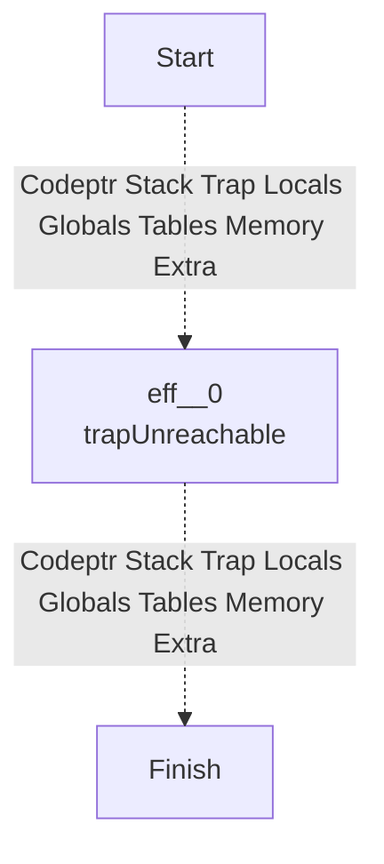
## NOP
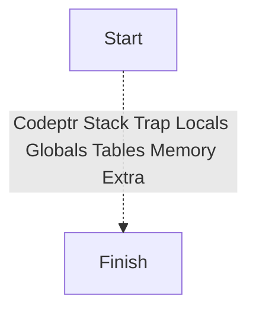
## LOCAL_GET
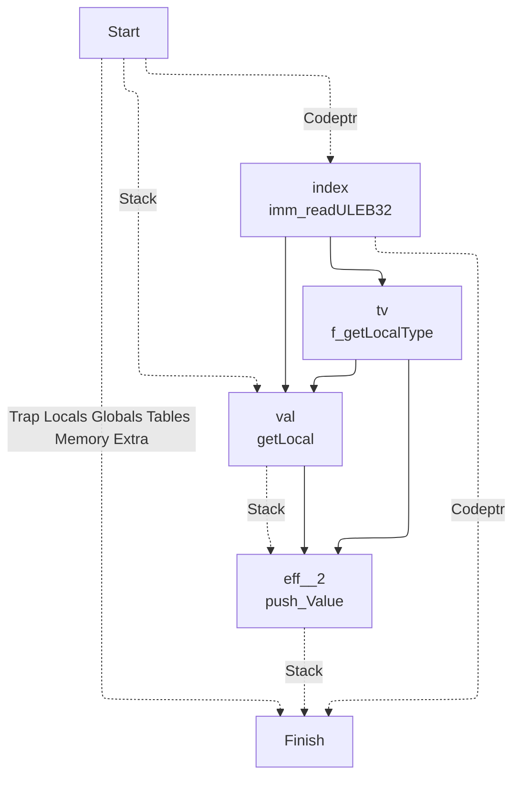
## LOCAL_SET
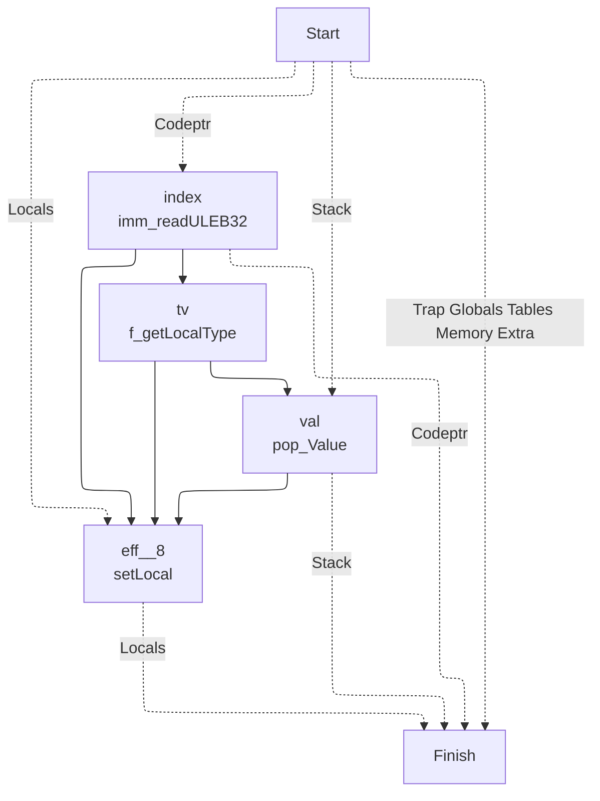
## LOCAL_TEE
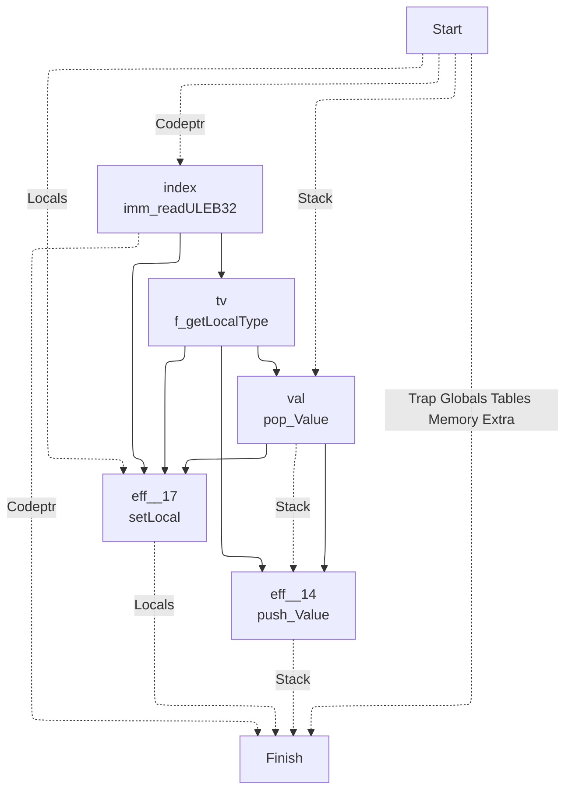
## GLOBAL_GET
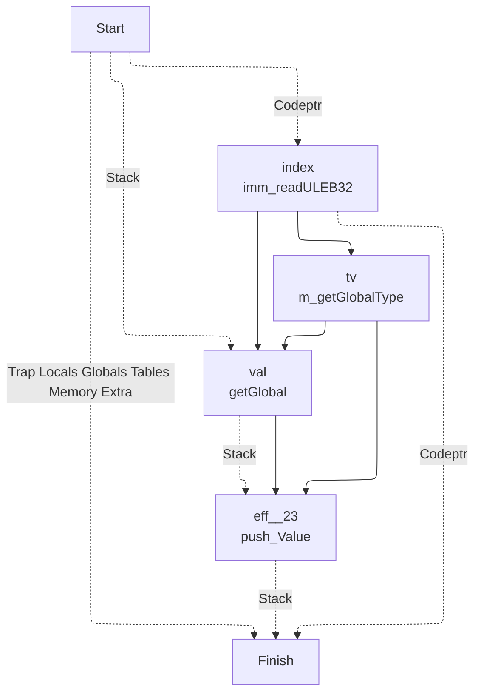
## GLOBAL_SET
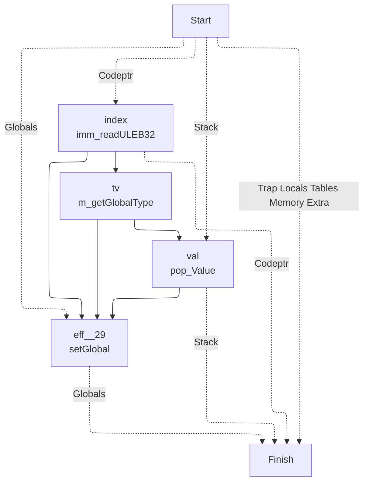
## TABLE_GET
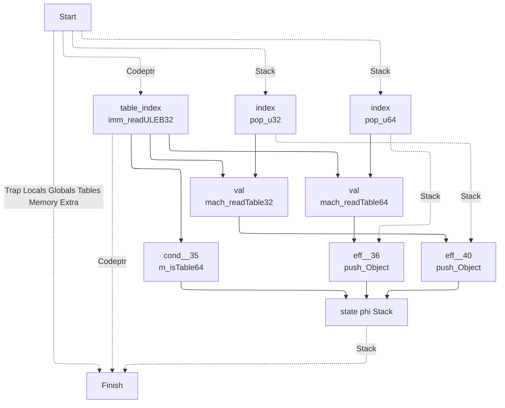
## TABLE_SET
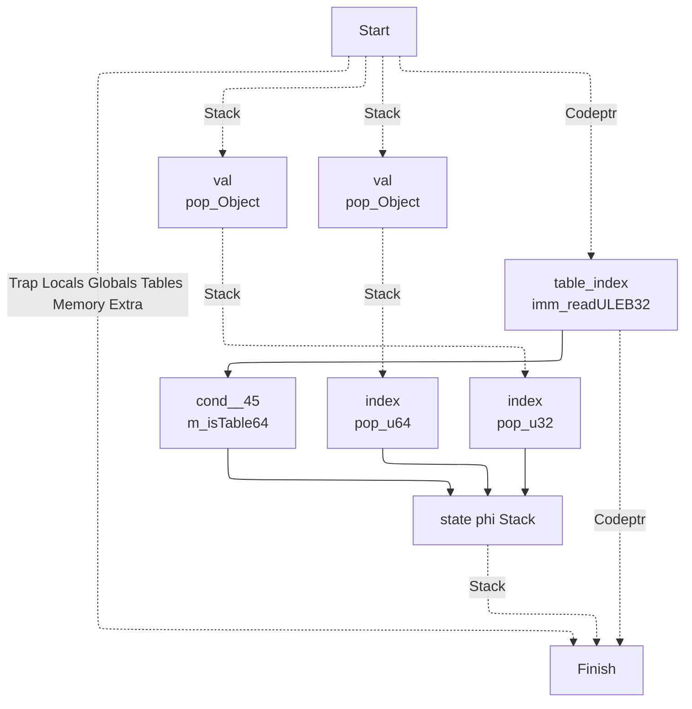
## CALL
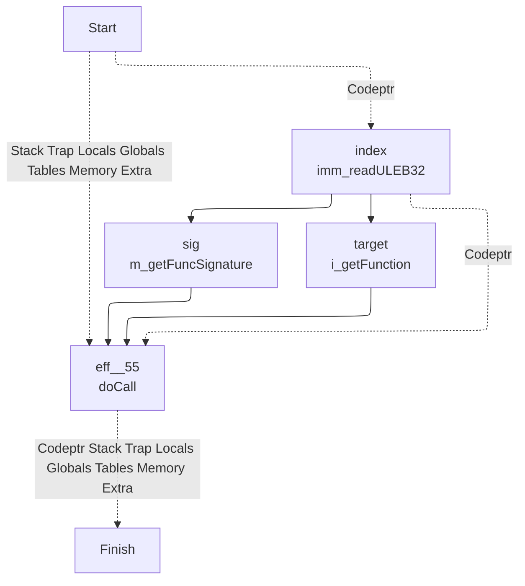
## CALL_INDIRECT

## RETURN_CALL

## DROP
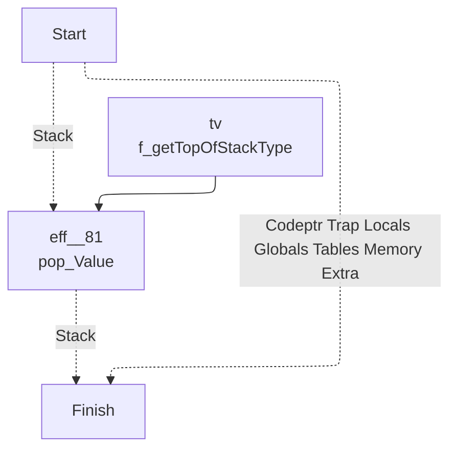
## SELECT
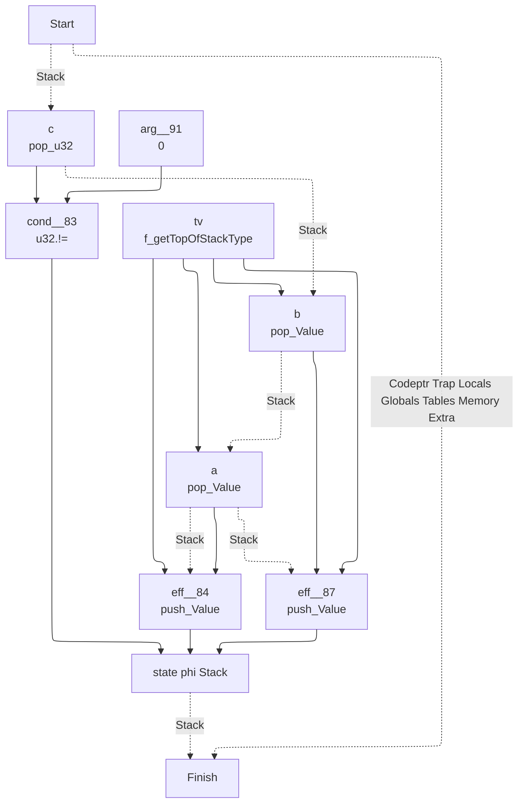
## I32_CONST

## I32_ADD

## I32_SUB
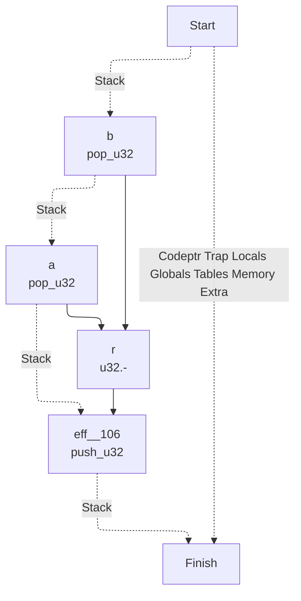
## I32_MUL

## I32_DIV_S
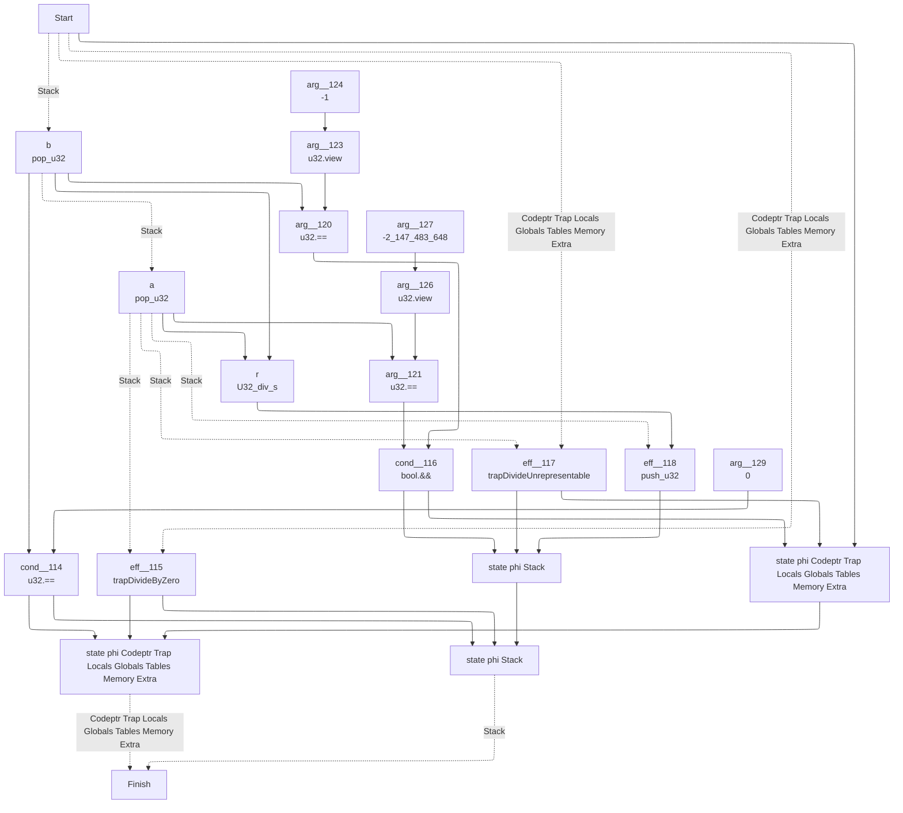
## I32_DIV_U
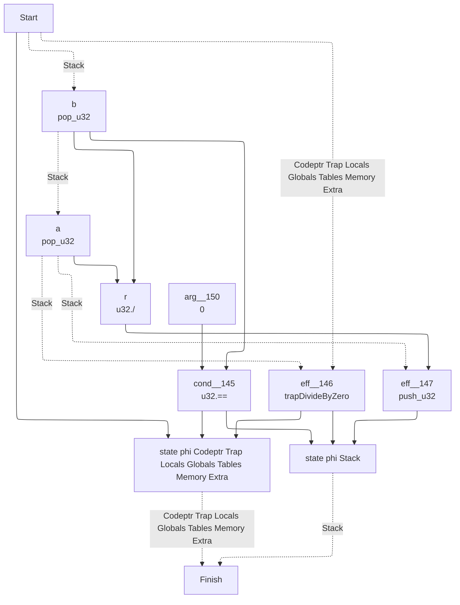
## I32_EQZ
```mermaid
---
config:
  layout: elk
---
graph TD
	1["
	Finish
	"]
	0 -. Codeptr Trap Locals Globals Tables Memory Extra .-> 1
	9 -. Stack .-> 1
	9["
	state phi Stack 	"]
	5 --> 9
	8 --> 9
	6 --> 9
	6["
	eff__162
	push_u32
	"]
	4 --> 6
	3 -. Stack .-> 6
	3["
	a
	pop_u32
	"]
	0 -. Stack .-> 3
	0["
	Start
	"]
	4["
	arg__165
	0
	"]
	8["
	eff__160
	push_u32
	"]
	7 --> 8
	3 -. Stack .-> 8
	7["
	arg__161
	1
	"]
	5["
	cond__159
	u32.==
	"]
	3 --> 5
	4 --> 5
```
## I32_EQ
```mermaid
---
config:
  layout: elk
---
graph TD
	1["
	Finish
	"]
	0 -. Codeptr Trap Locals Globals Tables Memory Extra .-> 1
	10 -. Stack .-> 1
	10["
	state phi Stack 	"]
	5 --> 10
	9 --> 10
	7 --> 10
	7["
	eff__176
	push_u32
	"]
	6 --> 7
	4 -. Stack .-> 7
	4["
	a
	pop_u32
	"]
	3 -. Stack .-> 4
	3["
	b
	pop_u32
	"]
	0 -. Stack .-> 3
	0["
	Start
	"]
	6["
	arg__177
	0
	"]
	9["
	eff__174
	push_u32
	"]
	8 --> 9
	4 -. Stack .-> 9
	8["
	arg__175
	1
	"]
	5["
	cond__173
	u32.==
	"]
	4 --> 5
	3 --> 5
```
## I32_NE
```mermaid
---
config:
  layout: elk
---
graph TD
	1["
	Finish
	"]
	0 -. Codeptr Trap Locals Globals Tables Memory Extra .-> 1
	10 -. Stack .-> 1
	10["
	state phi Stack 	"]
	5 --> 10
	9 --> 10
	7 --> 10
	7["
	eff__189
	push_u32
	"]
	6 --> 7
	4 -. Stack .-> 7
	4["
	a
	pop_u32
	"]
	3 -. Stack .-> 4
	3["
	b
	pop_u32
	"]
	0 -. Stack .-> 3
	0["
	Start
	"]
	6["
	arg__190
	0
	"]
	9["
	eff__187
	push_u32
	"]
	8 --> 9
	4 -. Stack .-> 9
	8["
	arg__188
	1
	"]
	5["
	cond__186
	u32.!=
	"]
	4 --> 5
	3 --> 5
```
## I32_LT_U
```mermaid
---
config:
  layout: elk
---
graph TD
	1["
	Finish
	"]
	0 -. Codeptr Trap Locals Globals Tables Memory Extra .-> 1
	10 -. Stack .-> 1
	10["
	state phi Stack 	"]
	5 --> 10
	9 --> 10
	7 --> 10
	7["
	eff__202
	push_u32
	"]
	6 --> 7
	4 -. Stack .-> 7
	4["
	a
	pop_u32
	"]
	3 -. Stack .-> 4
	3["
	b
	pop_u32
	"]
	0 -. Stack .-> 3
	0["
	Start
	"]
	6["
	arg__203
	0
	"]
	9["
	eff__200
	push_u32
	"]
	8 --> 9
	4 -. Stack .-> 9
	8["
	arg__201
	1
	"]
	5["
	cond__199
	u32.<
	"]
	4 --> 5
	3 --> 5
```
## I32_LT_S
```mermaid
---
config:
  layout: elk
---
graph TD
	1["
	Finish
	"]
	0 -. Codeptr Trap Locals Globals Tables Memory Extra .-> 1
	10 -. Stack .-> 1
	10["
	state phi Stack 	"]
	5 --> 10
	9 --> 10
	7 --> 10
	7["
	eff__215
	push_u32
	"]
	6 --> 7
	4 -. Stack .-> 7
	4["
	a
	pop_u32
	"]
	3 -. Stack .-> 4
	3["
	b
	pop_u32
	"]
	0 -. Stack .-> 3
	0["
	Start
	"]
	6["
	arg__216
	0
	"]
	9["
	eff__213
	push_u32
	"]
	8 --> 9
	4 -. Stack .-> 9
	8["
	arg__214
	1
	"]
	5["
	cond__212
	U32_lt_s
	"]
	4 --> 5
	3 --> 5
```
## I32_LE_S
```mermaid
---
config:
  layout: elk
---
graph TD
	1["
	Finish
	"]
	0 -. Codeptr Trap Locals Globals Tables Memory Extra .-> 1
	10 -. Stack .-> 1
	10["
	state phi Stack 	"]
	5 --> 10
	9 --> 10
	7 --> 10
	7["
	eff__228
	push_u32
	"]
	6 --> 7
	4 -. Stack .-> 7
	4["
	a
	pop_u32
	"]
	3 -. Stack .-> 4
	3["
	b
	pop_u32
	"]
	0 -. Stack .-> 3
	0["
	Start
	"]
	6["
	arg__229
	0
	"]
	9["
	eff__226
	push_u32
	"]
	8 --> 9
	4 -. Stack .-> 9
	8["
	arg__227
	1
	"]
	5["
	cond__225
	U32_le_s
	"]
	4 --> 5
	3 --> 5
```
## I32_GT_U
```mermaid
---
config:
  layout: elk
---
graph TD
	1["
	Finish
	"]
	0 -. Codeptr Trap Locals Globals Tables Memory Extra .-> 1
	10 -. Stack .-> 1
	10["
	state phi Stack 	"]
	5 --> 10
	9 --> 10
	7 --> 10
	7["
	eff__241
	push_u32
	"]
	6 --> 7
	4 -. Stack .-> 7
	4["
	a
	pop_u32
	"]
	3 -. Stack .-> 4
	3["
	b
	pop_u32
	"]
	0 -. Stack .-> 3
	0["
	Start
	"]
	6["
	arg__242
	0
	"]
	9["
	eff__239
	push_u32
	"]
	8 --> 9
	4 -. Stack .-> 9
	8["
	arg__240
	1
	"]
	5["
	cond__238
	u32.>
	"]
	4 --> 5
	3 --> 5
```
## I32_LE_U
```mermaid
---
config:
  layout: elk
---
graph TD
	1["
	Finish
	"]
	0 -. Codeptr Trap Locals Globals Tables Memory Extra .-> 1
	10 -. Stack .-> 1
	10["
	state phi Stack 	"]
	5 --> 10
	9 --> 10
	7 --> 10
	7["
	eff__254
	push_u32
	"]
	6 --> 7
	4 -. Stack .-> 7
	4["
	a
	pop_u32
	"]
	3 -. Stack .-> 4
	3["
	b
	pop_u32
	"]
	0 -. Stack .-> 3
	0["
	Start
	"]
	6["
	arg__255
	0
	"]
	9["
	eff__252
	push_u32
	"]
	8 --> 9
	4 -. Stack .-> 9
	8["
	arg__253
	1
	"]
	5["
	cond__251
	u32.<=
	"]
	4 --> 5
	3 --> 5
```
## I32_GT_S
```mermaid
---
config:
  layout: elk
---
graph TD
	1["
	Finish
	"]
	0 -. Codeptr Trap Locals Globals Tables Memory Extra .-> 1
	10 -. Stack .-> 1
	10["
	state phi Stack 	"]
	5 --> 10
	9 --> 10
	7 --> 10
	7["
	eff__267
	push_u32
	"]
	6 --> 7
	4 -. Stack .-> 7
	4["
	a
	pop_u32
	"]
	3 -. Stack .-> 4
	3["
	b
	pop_u32
	"]
	0 -. Stack .-> 3
	0["
	Start
	"]
	6["
	arg__268
	0
	"]
	9["
	eff__265
	push_u32
	"]
	8 --> 9
	4 -. Stack .-> 9
	8["
	arg__266
	1
	"]
	5["
	cond__264
	U32_gt_s
	"]
	4 --> 5
	3 --> 5
```
## I32_GE_U
```mermaid
---
config:
  layout: elk
---
graph TD
	1["
	Finish
	"]
	0 -. Codeptr Trap Locals Globals Tables Memory Extra .-> 1
	10 -. Stack .-> 1
	10["
	state phi Stack 	"]
	5 --> 10
	9 --> 10
	7 --> 10
	7["
	eff__280
	push_u32
	"]
	6 --> 7
	4 -. Stack .-> 7
	4["
	a
	pop_u32
	"]
	3 -. Stack .-> 4
	3["
	b
	pop_u32
	"]
	0 -. Stack .-> 3
	0["
	Start
	"]
	6["
	arg__281
	0
	"]
	9["
	eff__278
	push_u32
	"]
	8 --> 9
	4 -. Stack .-> 9
	8["
	arg__279
	1
	"]
	5["
	cond__277
	U32_ge
	"]
	4 --> 5
	3 --> 5
```
## I32_GE_S
```mermaid
---
config:
  layout: elk
---
graph TD
	1["
	Finish
	"]
	0 -. Codeptr Trap Locals Globals Tables Memory Extra .-> 1
	10 -. Stack .-> 1
	10["
	state phi Stack 	"]
	5 --> 10
	9 --> 10
	7 --> 10
	7["
	eff__293
	push_u32
	"]
	6 --> 7
	4 -. Stack .-> 7
	4["
	a
	pop_u32
	"]
	3 -. Stack .-> 4
	3["
	b
	pop_u32
	"]
	0 -. Stack .-> 3
	0["
	Start
	"]
	6["
	arg__294
	0
	"]
	9["
	eff__291
	push_u32
	"]
	8 --> 9
	4 -. Stack .-> 9
	8["
	arg__292
	1
	"]
	5["
	cond__290
	U32_ge_s
	"]
	4 --> 5
	3 --> 5
```
## I32_AND
```mermaid
---
config:
  layout: elk
---
graph TD
	1["
	Finish
	"]
	0 -. Codeptr Trap Locals Globals Tables Memory Extra .-> 1
	6 -. Stack .-> 1
	6["
	eff__303
	push_u32
	"]
	5 --> 6
	4 -. Stack .-> 6
	4["
	a
	pop_u32
	"]
	3 -. Stack .-> 4
	3["
	b
	pop_u32
	"]
	0 -. Stack .-> 3
	0["
	Start
	"]
	5["
	r
	u32.&
	"]
	4 --> 5
	3 --> 5
```
## I32_OR
```mermaid
---
config:
  layout: elk
---
graph TD
	1["
	Finish
	"]
	0 -. Codeptr Trap Locals Globals Tables Memory Extra .-> 1
	6 -. Stack .-> 1
	6["
	eff__307
	push_u32
	"]
	5 --> 6
	4 -. Stack .-> 6
	4["
	a
	pop_u32
	"]
	3 -. Stack .-> 4
	3["
	b
	pop_u32
	"]
	0 -. Stack .-> 3
	0["
	Start
	"]
	5["
	r
	u32.|
	"]
	4 --> 5
	3 --> 5
```
## I32_XOR
```mermaid
---
config:
  layout: elk
---
graph TD
	1["
	Finish
	"]
	0 -. Codeptr Trap Locals Globals Tables Memory Extra .-> 1
	6 -. Stack .-> 1
	6["
	eff__311
	push_u32
	"]
	5 --> 6
	4 -. Stack .-> 6
	4["
	a
	pop_u32
	"]
	3 -. Stack .-> 4
	3["
	b
	pop_u32
	"]
	0 -. Stack .-> 3
	0["
	Start
	"]
	5["
	r
	u32.^
	"]
	4 --> 5
	3 --> 5
```
## I32_SHL
```mermaid
---
config:
  layout: elk
---
graph TD
	1["
	Finish
	"]
	0 -. Codeptr Trap Locals Globals Tables Memory Extra .-> 1
	6 -. Stack .-> 1
	6["
	eff__315
	push_u32
	"]
	5 --> 6
	4 -. Stack .-> 6
	4["
	a
	pop_u32
	"]
	3 -. Stack .-> 4
	3["
	b
	pop_u32
	"]
	0 -. Stack .-> 3
	0["
	Start
	"]
	5["
	r
	U32_shl
	"]
	4 --> 5
	3 --> 5
```
## I32_SHR_U
```mermaid
---
config:
  layout: elk
---
graph TD
	1["
	Finish
	"]
	0 -. Codeptr Trap Locals Globals Tables Memory Extra .-> 1
	6 -. Stack .-> 1
	6["
	eff__319
	push_u32
	"]
	5 --> 6
	4 -. Stack .-> 6
	4["
	a
	pop_u32
	"]
	3 -. Stack .-> 4
	3["
	b
	pop_u32
	"]
	0 -. Stack .-> 3
	0["
	Start
	"]
	5["
	r
	U32_shr_u
	"]
	4 --> 5
	3 --> 5
```
## I32_SHR_S
```mermaid
---
config:
  layout: elk
---
graph TD
	1["
	Finish
	"]
	0 -. Codeptr Trap Locals Globals Tables Memory Extra .-> 1
	6 -. Stack .-> 1
	6["
	eff__323
	push_u32
	"]
	5 --> 6
	4 -. Stack .-> 6
	4["
	a
	pop_u32
	"]
	3 -. Stack .-> 4
	3["
	b
	pop_u32
	"]
	0 -. Stack .-> 3
	0["
	Start
	"]
	5["
	r
	U32_shr_s
	"]
	4 --> 5
	3 --> 5
```
## I32_ROTL
```mermaid
---
config:
  layout: elk
---
graph TD
	1["
	Finish
	"]
	0 -. Codeptr Trap Locals Globals Tables Memory Extra .-> 1
	6 -. Stack .-> 1
	6["
	eff__327
	push_u32
	"]
	5 --> 6
	4 -. Stack .-> 6
	4["
	a
	pop_u32
	"]
	3 -. Stack .-> 4
	3["
	b
	pop_u32
	"]
	0 -. Stack .-> 3
	0["
	Start
	"]
	5["
	r
	U32_rotl
	"]
	4 --> 5
	3 --> 5
```
## I32_ROTR
```mermaid
---
config:
  layout: elk
---
graph TD
	1["
	Finish
	"]
	0 -. Codeptr Trap Locals Globals Tables Memory Extra .-> 1
	6 -. Stack .-> 1
	6["
	eff__331
	push_u32
	"]
	5 --> 6
	4 -. Stack .-> 6
	4["
	a
	pop_u32
	"]
	3 -. Stack .-> 4
	3["
	b
	pop_u32
	"]
	0 -. Stack .-> 3
	0["
	Start
	"]
	5["
	r
	U32_rotr
	"]
	4 --> 5
	3 --> 5
```
## I32_CLZ
```mermaid
---
config:
  layout: elk
---
graph TD
	1["
	Finish
	"]
	0 -. Codeptr Trap Locals Globals Tables Memory Extra .-> 1
	5 -. Stack .-> 1
	5["
	eff__335
	push_u32
	"]
	4 --> 5
	3 -. Stack .-> 5
	3["
	a
	pop_u32
	"]
	0 -. Stack .-> 3
	0["
	Start
	"]
	4["
	r
	U32_clz
	"]
	3 --> 4
```
## I32_CTZ
```mermaid
---
config:
  layout: elk
---
graph TD
	1["
	Finish
	"]
	0 -. Codeptr Trap Locals Globals Tables Memory Extra .-> 1
	5 -. Stack .-> 1
	5["
	eff__338
	push_u32
	"]
	4 --> 5
	3 -. Stack .-> 5
	3["
	a
	pop_u32
	"]
	0 -. Stack .-> 3
	0["
	Start
	"]
	4["
	r
	U32_ctz
	"]
	3 --> 4
```
## I32_POPCNT
```mermaid
---
config:
  layout: elk
---
graph TD
	1["
	Finish
	"]
	0 -. Codeptr Trap Locals Globals Tables Memory Extra .-> 1
	5 -. Stack .-> 1
	5["
	eff__341
	push_u32
	"]
	4 --> 5
	3 -. Stack .-> 5
	3["
	a
	pop_u32
	"]
	0 -. Stack .-> 3
	0["
	Start
	"]
	4["
	r
	U32_popcnt
	"]
	3 --> 4
```
## I32_REM_S
```mermaid
---
config:
  layout: elk
---
graph TD
	1["
	Finish
	"]
	10 -. Codeptr Trap Locals Globals Tables Memory Extra .-> 1
	11 -. Stack .-> 1
	11["
	state phi Stack 	"]
	7 --> 11
	9 --> 11
	8 --> 11
	8["
	eff__346
	push_u32
	"]
	5 --> 8
	4 -. Stack .-> 8
	4["
	a
	pop_u32
	"]
	3 -. Stack .-> 4
	3["
	b
	pop_u32
	"]
	0 -. Stack .-> 3
	0["
	Start
	"]
	5["
	r
	U32_rem_s
	"]
	4 --> 5
	3 --> 5
	9["
	eff__345
	trapDivideByZero
	"]
	0 -. Codeptr Trap Locals Globals Tables Memory Extra .-> 9
	4 -. Stack .-> 9
	7["
	cond__344
	u32.==
	"]
	3 --> 7
	6 --> 7
	6["
	arg__349
	0
	"]
	10["
	state phi Codeptr Trap Locals Globals Tables Memory Extra 	"]
	7 --> 10
	9 --> 10
	0 --> 10
```
## I32_REM_U
```mermaid
---
config:
  layout: elk
---
graph TD
	1["
	Finish
	"]
	10 -. Codeptr Trap Locals Globals Tables Memory Extra .-> 1
	11 -. Stack .-> 1
	11["
	state phi Stack 	"]
	7 --> 11
	9 --> 11
	8 --> 11
	8["
	eff__360
	push_u32
	"]
	5 --> 8
	4 -. Stack .-> 8
	4["
	a
	pop_u32
	"]
	3 -. Stack .-> 4
	3["
	b
	pop_u32
	"]
	0 -. Stack .-> 3
	0["
	Start
	"]
	5["
	r
	U32_rem_u
	"]
	4 --> 5
	3 --> 5
	9["
	eff__359
	trapDivideByZero
	"]
	0 -. Codeptr Trap Locals Globals Tables Memory Extra .-> 9
	4 -. Stack .-> 9
	7["
	cond__358
	u32.==
	"]
	3 --> 7
	6 --> 7
	6["
	arg__363
	0
	"]
	10["
	state phi Codeptr Trap Locals Globals Tables Memory Extra 	"]
	7 --> 10
	9 --> 10
	0 --> 10
```
## I32_EXTEND8_S
```mermaid
---
config:
  layout: elk
---
graph TD
	1["
	Finish
	"]
	0 -. Codeptr Trap Locals Globals Tables Memory Extra .-> 1
	5 -. Stack .-> 1
	5["
	eff__372
	push_u32
	"]
	4 --> 5
	3 -. Stack .-> 5
	3["
	a
	pop_u32
	"]
	0 -. Stack .-> 3
	0["
	Start
	"]
	4["
	r
	U32_extend8_s
	"]
	3 --> 4
```
## I32_EXTEND16_S
```mermaid
---
config:
  layout: elk
---
graph TD
	1["
	Finish
	"]
	0 -. Codeptr Trap Locals Globals Tables Memory Extra .-> 1
	5 -. Stack .-> 1
	5["
	eff__375
	push_u32
	"]
	4 --> 5
	3 -. Stack .-> 5
	3["
	a
	pop_u32
	"]
	0 -. Stack .-> 3
	0["
	Start
	"]
	4["
	r
	U32_extend16_s
	"]
	3 --> 4
```
## I64_CONST
```mermaid
---
config:
  layout: elk
---
graph TD
	1["
	Finish
	"]
	3 -. Codeptr .-> 1
	4 -. Stack .-> 1
	0 -. Trap Locals Globals Tables Memory Extra .-> 1
	0["
	Start
	"]
	4["
	eff__378
	push_u64
	"]
	3 --> 4
	0 -. Stack .-> 4
	3["
	x
	imm_readILEB64
	"]
	0 -. Codeptr .-> 3
```
## I64_ADD
```mermaid
---
config:
  layout: elk
---
graph TD
	1["
	Finish
	"]
	0 -. Codeptr Trap Locals Globals Tables Memory Extra .-> 1
	6 -. Stack .-> 1
	6["
	eff__381
	push_u64
	"]
	5 --> 6
	4 -. Stack .-> 6
	4["
	a
	pop_u64
	"]
	3 -. Stack .-> 4
	3["
	b
	pop_u64
	"]
	0 -. Stack .-> 3
	0["
	Start
	"]
	5["
	r
	u64.+
	"]
	4 --> 5
	3 --> 5
```
## I64_SUB
```mermaid
---
config:
  layout: elk
---
graph TD
	1["
	Finish
	"]
	0 -. Codeptr Trap Locals Globals Tables Memory Extra .-> 1
	6 -. Stack .-> 1
	6["
	eff__385
	push_u64
	"]
	5 --> 6
	4 -. Stack .-> 6
	4["
	a
	pop_u64
	"]
	3 -. Stack .-> 4
	3["
	b
	pop_u64
	"]
	0 -. Stack .-> 3
	0["
	Start
	"]
	5["
	r
	u64.-
	"]
	4 --> 5
	3 --> 5
```
## I64_MUL
```mermaid
---
config:
  layout: elk
---
graph TD
	1["
	Finish
	"]
	0 -. Codeptr Trap Locals Globals Tables Memory Extra .-> 1
	6 -. Stack .-> 1
	6["
	eff__389
	push_u64
	"]
	5 --> 6
	4 -. Stack .-> 6
	4["
	a
	pop_u64
	"]
	3 -. Stack .-> 4
	3["
	b
	pop_u64
	"]
	0 -. Stack .-> 3
	0["
	Start
	"]
	5["
	r
	u64.*
	"]
	4 --> 5
	3 --> 5
```
## I64_DIV_S
```mermaid
---
config:
  layout: elk
---
graph TD
	1["
	Finish
	"]
	20 -. Codeptr Trap Locals Globals Tables Memory Extra .-> 1
	21 -. Stack .-> 1
	21["
	state phi Stack 	"]
	7 --> 21
	19 --> 21
	18 --> 21
	18["
	state phi Stack 	"]
	14 --> 18
	16 --> 18
	15 --> 18
	15["
	eff__397
	push_u64
	"]
	5 --> 15
	4 -. Stack .-> 15
	4["
	a
	pop_u64
	"]
	3 -. Stack .-> 4
	3["
	b
	pop_u64
	"]
	0 -. Stack .-> 3
	0["
	Start
	"]
	5["
	r
	U64_div_s
	"]
	4 --> 5
	3 --> 5
	16["
	eff__396
	trapDivideUnrepresentable
	"]
	0 -. Codeptr Trap Locals Globals Tables Memory Extra .-> 16
	4 -. Stack .-> 16
	14["
	cond__395
	bool.&&
	"]
	13 --> 14
	10 --> 14
	10["
	arg__400
	u64.==
	"]
	4 --> 10
	9 --> 10
	9["
	arg__405
	u64.view
	"]
	8 --> 9
	8["
	arg__406
	-9223372036854775808L
	"]
	13["
	arg__399
	u64.==
	"]
	3 --> 13
	12 --> 13
	12["
	arg__402
	u64.view
	"]
	11 --> 12
	11["
	arg__403
	-1
	"]
	19["
	eff__394
	trapDivideByZero
	"]
	0 -. Codeptr Trap Locals Globals Tables Memory Extra .-> 19
	4 -. Stack .-> 19
	7["
	cond__393
	u64.==
	"]
	3 --> 7
	6 --> 7
	6["
	arg__408
	0
	"]
	20["
	state phi Codeptr Trap Locals Globals Tables Memory Extra 	"]
	7 --> 20
	19 --> 20
	17 --> 20
	17["
	state phi Codeptr Trap Locals Globals Tables Memory Extra 	"]
	14 --> 17
	16 --> 17
	0 --> 17
```
## I64_DIV_U
```mermaid
---
config:
  layout: elk
---
graph TD
	1["
	Finish
	"]
	10 -. Codeptr Trap Locals Globals Tables Memory Extra .-> 1
	11 -. Stack .-> 1
	11["
	state phi Stack 	"]
	7 --> 11
	9 --> 11
	8 --> 11
	8["
	eff__426
	push_u64
	"]
	5 --> 8
	4 -. Stack .-> 8
	4["
	a
	pop_u64
	"]
	3 -. Stack .-> 4
	3["
	b
	pop_u64
	"]
	0 -. Stack .-> 3
	0["
	Start
	"]
	5["
	r
	u64./
	"]
	4 --> 5
	3 --> 5
	9["
	eff__425
	trapDivideByZero
	"]
	0 -. Codeptr Trap Locals Globals Tables Memory Extra .-> 9
	4 -. Stack .-> 9
	7["
	cond__424
	u64.==
	"]
	3 --> 7
	6 --> 7
	6["
	arg__429
	0
	"]
	10["
	state phi Codeptr Trap Locals Globals Tables Memory Extra 	"]
	7 --> 10
	9 --> 10
	0 --> 10
```
## I64_REM_S
```mermaid
---
config:
  layout: elk
---
graph TD
	1["
	Finish
	"]
	10 -. Codeptr Trap Locals Globals Tables Memory Extra .-> 1
	11 -. Stack .-> 1
	11["
	state phi Stack 	"]
	7 --> 11
	9 --> 11
	8 --> 11
	8["
	eff__440
	push_u64
	"]
	5 --> 8
	4 -. Stack .-> 8
	4["
	a
	pop_u64
	"]
	3 -. Stack .-> 4
	3["
	b
	pop_u64
	"]
	0 -. Stack .-> 3
	0["
	Start
	"]
	5["
	r
	U64_rem_s
	"]
	4 --> 5
	3 --> 5
	9["
	eff__439
	trapDivideByZero
	"]
	0 -. Codeptr Trap Locals Globals Tables Memory Extra .-> 9
	4 -. Stack .-> 9
	7["
	cond__438
	u64.==
	"]
	3 --> 7
	6 --> 7
	6["
	arg__443
	0
	"]
	10["
	state phi Codeptr Trap Locals Globals Tables Memory Extra 	"]
	7 --> 10
	9 --> 10
	0 --> 10
```
## I64_REM_U
```mermaid
---
config:
  layout: elk
---
graph TD
	1["
	Finish
	"]
	10 -. Codeptr Trap Locals Globals Tables Memory Extra .-> 1
	11 -. Stack .-> 1
	11["
	state phi Stack 	"]
	7 --> 11
	9 --> 11
	8 --> 11
	8["
	eff__454
	push_u64
	"]
	5 --> 8
	4 -. Stack .-> 8
	4["
	a
	pop_u64
	"]
	3 -. Stack .-> 4
	3["
	b
	pop_u64
	"]
	0 -. Stack .-> 3
	0["
	Start
	"]
	5["
	r
	U64_rem_u
	"]
	4 --> 5
	3 --> 5
	9["
	eff__453
	trapDivideByZero
	"]
	0 -. Codeptr Trap Locals Globals Tables Memory Extra .-> 9
	4 -. Stack .-> 9
	7["
	cond__452
	u64.==
	"]
	3 --> 7
	6 --> 7
	6["
	arg__457
	0
	"]
	10["
	state phi Codeptr Trap Locals Globals Tables Memory Extra 	"]
	7 --> 10
	9 --> 10
	0 --> 10
```
## I64_AND
```mermaid
---
config:
  layout: elk
---
graph TD
	1["
	Finish
	"]
	0 -. Codeptr Trap Locals Globals Tables Memory Extra .-> 1
	6 -. Stack .-> 1
	6["
	eff__466
	push_u64
	"]
	5 --> 6
	4 -. Stack .-> 6
	4["
	a
	pop_u64
	"]
	3 -. Stack .-> 4
	3["
	b
	pop_u64
	"]
	0 -. Stack .-> 3
	0["
	Start
	"]
	5["
	r
	u64.&
	"]
	4 --> 5
	3 --> 5
```
## I64_OR
```mermaid
---
config:
  layout: elk
---
graph TD
	1["
	Finish
	"]
	0 -. Codeptr Trap Locals Globals Tables Memory Extra .-> 1
	6 -. Stack .-> 1
	6["
	eff__470
	push_u64
	"]
	5 --> 6
	4 -. Stack .-> 6
	4["
	a
	pop_u64
	"]
	3 -. Stack .-> 4
	3["
	b
	pop_u64
	"]
	0 -. Stack .-> 3
	0["
	Start
	"]
	5["
	r
	u64.|
	"]
	4 --> 5
	3 --> 5
```
## I64_XOR
```mermaid
---
config:
  layout: elk
---
graph TD
	1["
	Finish
	"]
	0 -. Codeptr Trap Locals Globals Tables Memory Extra .-> 1
	6 -. Stack .-> 1
	6["
	eff__474
	push_u64
	"]
	5 --> 6
	4 -. Stack .-> 6
	4["
	a
	pop_u64
	"]
	3 -. Stack .-> 4
	3["
	b
	pop_u64
	"]
	0 -. Stack .-> 3
	0["
	Start
	"]
	5["
	r
	u64.^
	"]
	4 --> 5
	3 --> 5
```
## I64_SHL
```mermaid
---
config:
  layout: elk
---
graph TD
	1["
	Finish
	"]
	0 -. Codeptr Trap Locals Globals Tables Memory Extra .-> 1
	6 -. Stack .-> 1
	6["
	eff__478
	push_u64
	"]
	5 --> 6
	4 -. Stack .-> 6
	4["
	a
	pop_u64
	"]
	3 -. Stack .-> 4
	3["
	b
	pop_u64
	"]
	0 -. Stack .-> 3
	0["
	Start
	"]
	5["
	r
	U64_shl
	"]
	4 --> 5
	3 --> 5
```
## I64_SHR_U
```mermaid
---
config:
  layout: elk
---
graph TD
	1["
	Finish
	"]
	0 -. Codeptr Trap Locals Globals Tables Memory Extra .-> 1
	6 -. Stack .-> 1
	6["
	eff__482
	push_u64
	"]
	5 --> 6
	4 -. Stack .-> 6
	4["
	a
	pop_u64
	"]
	3 -. Stack .-> 4
	3["
	b
	pop_u64
	"]
	0 -. Stack .-> 3
	0["
	Start
	"]
	5["
	r
	U64_shr_u
	"]
	4 --> 5
	3 --> 5
```
## I64_SHR_S
```mermaid
---
config:
  layout: elk
---
graph TD
	1["
	Finish
	"]
	0 -. Codeptr Trap Locals Globals Tables Memory Extra .-> 1
	6 -. Stack .-> 1
	6["
	eff__486
	push_u64
	"]
	5 --> 6
	4 -. Stack .-> 6
	4["
	a
	pop_u64
	"]
	3 -. Stack .-> 4
	3["
	b
	pop_u64
	"]
	0 -. Stack .-> 3
	0["
	Start
	"]
	5["
	r
	U64_shr_s
	"]
	4 --> 5
	3 --> 5
```
## I64_ROTL
```mermaid
---
config:
  layout: elk
---
graph TD
	1["
	Finish
	"]
	0 -. Codeptr Trap Locals Globals Tables Memory Extra .-> 1
	6 -. Stack .-> 1
	6["
	eff__490
	push_u64
	"]
	5 --> 6
	4 -. Stack .-> 6
	4["
	a
	pop_u64
	"]
	3 -. Stack .-> 4
	3["
	b
	pop_u64
	"]
	0 -. Stack .-> 3
	0["
	Start
	"]
	5["
	r
	U64_rotl
	"]
	4 --> 5
	3 --> 5
```
## I64_ROTR
```mermaid
---
config:
  layout: elk
---
graph TD
	1["
	Finish
	"]
	0 -. Codeptr Trap Locals Globals Tables Memory Extra .-> 1
	6 -. Stack .-> 1
	6["
	eff__494
	push_u64
	"]
	5 --> 6
	4 -. Stack .-> 6
	4["
	a
	pop_u64
	"]
	3 -. Stack .-> 4
	3["
	b
	pop_u64
	"]
	0 -. Stack .-> 3
	0["
	Start
	"]
	5["
	r
	U64_rotr
	"]
	4 --> 5
	3 --> 5
```
## I64_CLZ
```mermaid
---
config:
  layout: elk
---
graph TD
	1["
	Finish
	"]
	0 -. Codeptr Trap Locals Globals Tables Memory Extra .-> 1
	5 -. Stack .-> 1
	5["
	eff__498
	push_u64
	"]
	4 --> 5
	3 -. Stack .-> 5
	3["
	a
	pop_u64
	"]
	0 -. Stack .-> 3
	0["
	Start
	"]
	4["
	r
	U64_clz
	"]
	3 --> 4
```
## I64_CTZ
```mermaid
---
config:
  layout: elk
---
graph TD
	1["
	Finish
	"]
	0 -. Codeptr Trap Locals Globals Tables Memory Extra .-> 1
	5 -. Stack .-> 1
	5["
	eff__501
	push_u64
	"]
	4 --> 5
	3 -. Stack .-> 5
	3["
	a
	pop_u64
	"]
	0 -. Stack .-> 3
	0["
	Start
	"]
	4["
	r
	U64_ctz
	"]
	3 --> 4
```
## I64_POPCNT
```mermaid
---
config:
  layout: elk
---
graph TD
	1["
	Finish
	"]
	0 -. Codeptr Trap Locals Globals Tables Memory Extra .-> 1
	5 -. Stack .-> 1
	5["
	eff__504
	push_u64
	"]
	4 --> 5
	3 -. Stack .-> 5
	3["
	a
	pop_u64
	"]
	0 -. Stack .-> 3
	0["
	Start
	"]
	4["
	r
	U64_popcnt
	"]
	3 --> 4
```
## I64_EQZ
```mermaid
---
config:
  layout: elk
---
graph TD
	1["
	Finish
	"]
	0 -. Codeptr Trap Locals Globals Tables Memory Extra .-> 1
	9 -. Stack .-> 1
	9["
	state phi Stack 	"]
	5 --> 9
	8 --> 9
	6 --> 9
	6["
	eff__510
	push_u32
	"]
	4 --> 6
	3 -. Stack .-> 6
	3["
	a
	pop_u64
	"]
	0 -. Stack .-> 3
	0["
	Start
	"]
	4["
	arg__513
	0
	"]
	8["
	eff__508
	push_u32
	"]
	7 --> 8
	3 -. Stack .-> 8
	7["
	arg__509
	1
	"]
	5["
	cond__507
	u64.==
	"]
	3 --> 5
	4 --> 5
```
## I64_EQ
```mermaid
---
config:
  layout: elk
---
graph TD
	1["
	Finish
	"]
	0 -. Codeptr Trap Locals Globals Tables Memory Extra .-> 1
	10 -. Stack .-> 1
	10["
	state phi Stack 	"]
	5 --> 10
	9 --> 10
	7 --> 10
	7["
	eff__524
	push_u32
	"]
	6 --> 7
	4 -. Stack .-> 7
	4["
	a
	pop_u64
	"]
	3 -. Stack .-> 4
	3["
	b
	pop_u64
	"]
	0 -. Stack .-> 3
	0["
	Start
	"]
	6["
	arg__525
	0
	"]
	9["
	eff__522
	push_u32
	"]
	8 --> 9
	4 -. Stack .-> 9
	8["
	arg__523
	1
	"]
	5["
	cond__521
	u64.==
	"]
	4 --> 5
	3 --> 5
```
## I64_NE
```mermaid
---
config:
  layout: elk
---
graph TD
	1["
	Finish
	"]
	0 -. Codeptr Trap Locals Globals Tables Memory Extra .-> 1
	10 -. Stack .-> 1
	10["
	state phi Stack 	"]
	5 --> 10
	9 --> 10
	7 --> 10
	7["
	eff__537
	push_u32
	"]
	6 --> 7
	4 -. Stack .-> 7
	4["
	a
	pop_u64
	"]
	3 -. Stack .-> 4
	3["
	b
	pop_u64
	"]
	0 -. Stack .-> 3
	0["
	Start
	"]
	6["
	arg__538
	0
	"]
	9["
	eff__535
	push_u32
	"]
	8 --> 9
	4 -. Stack .-> 9
	8["
	arg__536
	1
	"]
	5["
	cond__534
	u64.!=
	"]
	4 --> 5
	3 --> 5
```
## I64_LT_S
```mermaid
---
config:
  layout: elk
---
graph TD
	1["
	Finish
	"]
	0 -. Codeptr Trap Locals Globals Tables Memory Extra .-> 1
	10 -. Stack .-> 1
	10["
	state phi Stack 	"]
	5 --> 10
	9 --> 10
	7 --> 10
	7["
	eff__550
	push_u32
	"]
	6 --> 7
	4 -. Stack .-> 7
	4["
	a
	pop_u64
	"]
	3 -. Stack .-> 4
	3["
	b
	pop_u64
	"]
	0 -. Stack .-> 3
	0["
	Start
	"]
	6["
	arg__551
	0
	"]
	9["
	eff__548
	push_u32
	"]
	8 --> 9
	4 -. Stack .-> 9
	8["
	arg__549
	1
	"]
	5["
	cond__547
	U64_lt_s
	"]
	4 --> 5
	3 --> 5
```
## I64_LT_U
```mermaid
---
config:
  layout: elk
---
graph TD
	1["
	Finish
	"]
	0 -. Codeptr Trap Locals Globals Tables Memory Extra .-> 1
	10 -. Stack .-> 1
	10["
	state phi Stack 	"]
	5 --> 10
	9 --> 10
	7 --> 10
	7["
	eff__563
	push_u32
	"]
	6 --> 7
	4 -. Stack .-> 7
	4["
	a
	pop_u64
	"]
	3 -. Stack .-> 4
	3["
	b
	pop_u64
	"]
	0 -. Stack .-> 3
	0["
	Start
	"]
	6["
	arg__564
	0
	"]
	9["
	eff__561
	push_u32
	"]
	8 --> 9
	4 -. Stack .-> 9
	8["
	arg__562
	1
	"]
	5["
	cond__560
	u64.<
	"]
	4 --> 5
	3 --> 5
```
## I64_LE_S
```mermaid
---
config:
  layout: elk
---
graph TD
	1["
	Finish
	"]
	0 -. Codeptr Trap Locals Globals Tables Memory Extra .-> 1
	10 -. Stack .-> 1
	10["
	state phi Stack 	"]
	5 --> 10
	9 --> 10
	7 --> 10
	7["
	eff__576
	push_u32
	"]
	6 --> 7
	4 -. Stack .-> 7
	4["
	a
	pop_u64
	"]
	3 -. Stack .-> 4
	3["
	b
	pop_u64
	"]
	0 -. Stack .-> 3
	0["
	Start
	"]
	6["
	arg__577
	0
	"]
	9["
	eff__574
	push_u32
	"]
	8 --> 9
	4 -. Stack .-> 9
	8["
	arg__575
	1
	"]
	5["
	cond__573
	U64_le_s
	"]
	4 --> 5
	3 --> 5
```
## I64_LE_U
```mermaid
---
config:
  layout: elk
---
graph TD
	1["
	Finish
	"]
	0 -. Codeptr Trap Locals Globals Tables Memory Extra .-> 1
	10 -. Stack .-> 1
	10["
	state phi Stack 	"]
	5 --> 10
	9 --> 10
	7 --> 10
	7["
	eff__589
	push_u32
	"]
	6 --> 7
	4 -. Stack .-> 7
	4["
	a
	pop_u64
	"]
	3 -. Stack .-> 4
	3["
	b
	pop_u64
	"]
	0 -. Stack .-> 3
	0["
	Start
	"]
	6["
	arg__590
	0
	"]
	9["
	eff__587
	push_u32
	"]
	8 --> 9
	4 -. Stack .-> 9
	8["
	arg__588
	1
	"]
	5["
	cond__586
	u64.<=
	"]
	4 --> 5
	3 --> 5
```
## I64_GT_S
```mermaid
---
config:
  layout: elk
---
graph TD
	1["
	Finish
	"]
	0 -. Codeptr Trap Locals Globals Tables Memory Extra .-> 1
	10 -. Stack .-> 1
	10["
	state phi Stack 	"]
	5 --> 10
	9 --> 10
	7 --> 10
	7["
	eff__602
	push_u32
	"]
	6 --> 7
	4 -. Stack .-> 7
	4["
	a
	pop_u64
	"]
	3 -. Stack .-> 4
	3["
	b
	pop_u64
	"]
	0 -. Stack .-> 3
	0["
	Start
	"]
	6["
	arg__603
	0
	"]
	9["
	eff__600
	push_u32
	"]
	8 --> 9
	4 -. Stack .-> 9
	8["
	arg__601
	1
	"]
	5["
	cond__599
	U64_gt_s
	"]
	4 --> 5
	3 --> 5
```
## I64_GT_U
```mermaid
---
config:
  layout: elk
---
graph TD
	1["
	Finish
	"]
	0 -. Codeptr Trap Locals Globals Tables Memory Extra .-> 1
	10 -. Stack .-> 1
	10["
	state phi Stack 	"]
	5 --> 10
	9 --> 10
	7 --> 10
	7["
	eff__615
	push_u32
	"]
	6 --> 7
	4 -. Stack .-> 7
	4["
	a
	pop_u64
	"]
	3 -. Stack .-> 4
	3["
	b
	pop_u64
	"]
	0 -. Stack .-> 3
	0["
	Start
	"]
	6["
	arg__616
	0
	"]
	9["
	eff__613
	push_u32
	"]
	8 --> 9
	4 -. Stack .-> 9
	8["
	arg__614
	1
	"]
	5["
	cond__612
	u64.>
	"]
	4 --> 5
	3 --> 5
```
## I64_GE_S
```mermaid
---
config:
  layout: elk
---
graph TD
	1["
	Finish
	"]
	0 -. Codeptr Trap Locals Globals Tables Memory Extra .-> 1
	10 -. Stack .-> 1
	10["
	state phi Stack 	"]
	5 --> 10
	9 --> 10
	7 --> 10
	7["
	eff__628
	push_u32
	"]
	6 --> 7
	4 -. Stack .-> 7
	4["
	a
	pop_u64
	"]
	3 -. Stack .-> 4
	3["
	b
	pop_u64
	"]
	0 -. Stack .-> 3
	0["
	Start
	"]
	6["
	arg__629
	0
	"]
	9["
	eff__626
	push_u32
	"]
	8 --> 9
	4 -. Stack .-> 9
	8["
	arg__627
	1
	"]
	5["
	cond__625
	U64_ge_s
	"]
	4 --> 5
	3 --> 5
```
## I64_GE_U
```mermaid
---
config:
  layout: elk
---
graph TD
	1["
	Finish
	"]
	0 -. Codeptr Trap Locals Globals Tables Memory Extra .-> 1
	10 -. Stack .-> 1
	10["
	state phi Stack 	"]
	5 --> 10
	9 --> 10
	7 --> 10
	7["
	eff__641
	push_u32
	"]
	6 --> 7
	4 -. Stack .-> 7
	4["
	a
	pop_u64
	"]
	3 -. Stack .-> 4
	3["
	b
	pop_u64
	"]
	0 -. Stack .-> 3
	0["
	Start
	"]
	6["
	arg__642
	0
	"]
	9["
	eff__639
	push_u32
	"]
	8 --> 9
	4 -. Stack .-> 9
	8["
	arg__640
	1
	"]
	5["
	cond__638
	U64_ge
	"]
	4 --> 5
	3 --> 5
```
## I64_EXTEND8_S
```mermaid
---
config:
  layout: elk
---
graph TD
	1["
	Finish
	"]
	0 -. Codeptr Trap Locals Globals Tables Memory Extra .-> 1
	5 -. Stack .-> 1
	5["
	eff__651
	push_u64
	"]
	4 --> 5
	3 -. Stack .-> 5
	3["
	a
	pop_u64
	"]
	0 -. Stack .-> 3
	0["
	Start
	"]
	4["
	r
	U64_extend8_s
	"]
	3 --> 4
```
## I64_EXTEND16_S
```mermaid
---
config:
  layout: elk
---
graph TD
	1["
	Finish
	"]
	0 -. Codeptr Trap Locals Globals Tables Memory Extra .-> 1
	5 -. Stack .-> 1
	5["
	eff__654
	push_u64
	"]
	4 --> 5
	3 -. Stack .-> 5
	3["
	a
	pop_u64
	"]
	0 -. Stack .-> 3
	0["
	Start
	"]
	4["
	r
	U64_extend16_s
	"]
	3 --> 4
```
## I64_EXTEND32_S
```mermaid
---
config:
  layout: elk
---
graph TD
	1["
	Finish
	"]
	0 -. Codeptr Trap Locals Globals Tables Memory Extra .-> 1
	5 -. Stack .-> 1
	5["
	eff__657
	push_u64
	"]
	4 --> 5
	3 -. Stack .-> 5
	3["
	a
	pop_u64
	"]
	0 -. Stack .-> 3
	0["
	Start
	"]
	4["
	r
	U64_extend32_s
	"]
	3 --> 4
```
## F32_CONST
```mermaid
---
config:
  layout: elk
---
graph TD
	1["
	Finish
	"]
	3 -. Codeptr .-> 1
	5 -. Stack .-> 1
	0 -. Trap Locals Globals Tables Memory Extra .-> 1
	0["
	Start
	"]
	5["
	eff__660
	push_f32
	"]
	4 --> 5
	0 -. Stack .-> 5
	4["
	arg__661
	f32_reinterpret_u32
	"]
	3 --> 4
	3["
	x
	imm_readULEB32
	"]
	0 -. Codeptr .-> 3
```
## F32_ADD
```mermaid
---
config:
  layout: elk
---
graph TD
	1["
	Finish
	"]
	0 -. Codeptr Trap Locals Globals Tables Memory Extra .-> 1
	6 -. Stack .-> 1
	6["
	eff__664
	push_f32
	"]
	5 --> 6
	4 -. Stack .-> 6
	4["
	a
	pop_f32
	"]
	3 -. Stack .-> 4
	3["
	b
	pop_f32
	"]
	0 -. Stack .-> 3
	0["
	Start
	"]
	5["
	r
	float.+
	"]
	4 --> 5
	3 --> 5
```
## F32_SUB
```mermaid
---
config:
  layout: elk
---
graph TD
	1["
	Finish
	"]
	0 -. Codeptr Trap Locals Globals Tables Memory Extra .-> 1
	6 -. Stack .-> 1
	6["
	eff__668
	push_f32
	"]
	5 --> 6
	4 -. Stack .-> 6
	4["
	a
	pop_f32
	"]
	3 -. Stack .-> 4
	3["
	b
	pop_f32
	"]
	0 -. Stack .-> 3
	0["
	Start
	"]
	5["
	r
	float.-
	"]
	4 --> 5
	3 --> 5
```
## F32_MUL
```mermaid
---
config:
  layout: elk
---
graph TD
	1["
	Finish
	"]
	0 -. Codeptr Trap Locals Globals Tables Memory Extra .-> 1
	6 -. Stack .-> 1
	6["
	eff__672
	push_f32
	"]
	5 --> 6
	4 -. Stack .-> 6
	4["
	a
	pop_f32
	"]
	3 -. Stack .-> 4
	3["
	b
	pop_f32
	"]
	0 -. Stack .-> 3
	0["
	Start
	"]
	5["
	r
	float.*
	"]
	4 --> 5
	3 --> 5
```
## F32_DIV
```mermaid
---
config:
  layout: elk
---
graph TD
	1["
	Finish
	"]
	10 -. Codeptr Trap Locals Globals Tables Memory Extra .-> 1
	11 -. Stack .-> 1
	11["
	state phi Stack 	"]
	7 --> 11
	9 --> 11
	8 --> 11
	8["
	eff__678
	push_f32
	"]
	5 --> 8
	4 -. Stack .-> 8
	4["
	a
	pop_f32
	"]
	3 -. Stack .-> 4
	3["
	b
	pop_f32
	"]
	0 -. Stack .-> 3
	0["
	Start
	"]
	5["
	r
	float./
	"]
	4 --> 5
	3 --> 5
	9["
	eff__677
	trapDivideByZero
	"]
	0 -. Codeptr Trap Locals Globals Tables Memory Extra .-> 9
	4 -. Stack .-> 9
	7["
	cond__676
	float.==
	"]
	3 --> 7
	6 --> 7
	6["
	arg__681
	0.0f
	"]
	10["
	state phi Codeptr Trap Locals Globals Tables Memory Extra 	"]
	7 --> 10
	9 --> 10
	0 --> 10
```
## F32_SQRT
```mermaid
---
config:
  layout: elk
---
graph TD
	1["
	Finish
	"]
	0 -. Codeptr Trap Locals Globals Tables Memory Extra .-> 1
	5 -. Stack .-> 1
	5["
	eff__690
	push_f32
	"]
	4 --> 5
	3 -. Stack .-> 5
	3["
	a
	pop_f32
	"]
	0 -. Stack .-> 3
	0["
	Start
	"]
	4["
	r
	float.sqrt
	"]
	3 --> 4
```
## F32_EQ
```mermaid
---
config:
  layout: elk
---
graph TD
	1["
	Finish
	"]
	0 -. Codeptr Trap Locals Globals Tables Memory Extra .-> 1
	10 -. Stack .-> 1
	10["
	state phi Stack 	"]
	5 --> 10
	9 --> 10
	7 --> 10
	7["
	eff__696
	push_u32
	"]
	6 --> 7
	4 -. Stack .-> 7
	4["
	a
	pop_f32
	"]
	3 -. Stack .-> 4
	3["
	b
	pop_f32
	"]
	0 -. Stack .-> 3
	0["
	Start
	"]
	6["
	arg__697
	0
	"]
	9["
	eff__694
	push_u32
	"]
	8 --> 9
	4 -. Stack .-> 9
	8["
	arg__695
	1
	"]
	5["
	cond__693
	float.==
	"]
	4 --> 5
	3 --> 5
```
## F32_NE
```mermaid
---
config:
  layout: elk
---
graph TD
	1["
	Finish
	"]
	0 -. Codeptr Trap Locals Globals Tables Memory Extra .-> 1
	10 -. Stack .-> 1
	10["
	state phi Stack 	"]
	5 --> 10
	9 --> 10
	7 --> 10
	7["
	eff__709
	push_u32
	"]
	6 --> 7
	4 -. Stack .-> 7
	4["
	a
	pop_f32
	"]
	3 -. Stack .-> 4
	3["
	b
	pop_f32
	"]
	0 -. Stack .-> 3
	0["
	Start
	"]
	6["
	arg__710
	0
	"]
	9["
	eff__707
	push_u32
	"]
	8 --> 9
	4 -. Stack .-> 9
	8["
	arg__708
	1
	"]
	5["
	cond__706
	float.!=
	"]
	4 --> 5
	3 --> 5
```
## F32_LT
```mermaid
---
config:
  layout: elk
---
graph TD
	1["
	Finish
	"]
	0 -. Codeptr Trap Locals Globals Tables Memory Extra .-> 1
	10 -. Stack .-> 1
	10["
	state phi Stack 	"]
	5 --> 10
	9 --> 10
	7 --> 10
	7["
	eff__722
	push_u32
	"]
	6 --> 7
	4 -. Stack .-> 7
	4["
	a
	pop_f32
	"]
	3 -. Stack .-> 4
	3["
	b
	pop_f32
	"]
	0 -. Stack .-> 3
	0["
	Start
	"]
	6["
	arg__723
	0
	"]
	9["
	eff__720
	push_u32
	"]
	8 --> 9
	4 -. Stack .-> 9
	8["
	arg__721
	1
	"]
	5["
	cond__719
	float.<
	"]
	4 --> 5
	3 --> 5
```
## F32_LE
```mermaid
---
config:
  layout: elk
---
graph TD
	1["
	Finish
	"]
	0 -. Codeptr Trap Locals Globals Tables Memory Extra .-> 1
	10 -. Stack .-> 1
	10["
	state phi Stack 	"]
	5 --> 10
	9 --> 10
	7 --> 10
	7["
	eff__735
	push_u32
	"]
	6 --> 7
	4 -. Stack .-> 7
	4["
	a
	pop_f32
	"]
	3 -. Stack .-> 4
	3["
	b
	pop_f32
	"]
	0 -. Stack .-> 3
	0["
	Start
	"]
	6["
	arg__736
	0
	"]
	9["
	eff__733
	push_u32
	"]
	8 --> 9
	4 -. Stack .-> 9
	8["
	arg__734
	1
	"]
	5["
	cond__732
	float.<=
	"]
	4 --> 5
	3 --> 5
```
## F32_GT
```mermaid
---
config:
  layout: elk
---
graph TD
	1["
	Finish
	"]
	0 -. Codeptr Trap Locals Globals Tables Memory Extra .-> 1
	10 -. Stack .-> 1
	10["
	state phi Stack 	"]
	5 --> 10
	9 --> 10
	7 --> 10
	7["
	eff__748
	push_u32
	"]
	6 --> 7
	4 -. Stack .-> 7
	4["
	a
	pop_f32
	"]
	3 -. Stack .-> 4
	3["
	b
	pop_f32
	"]
	0 -. Stack .-> 3
	0["
	Start
	"]
	6["
	arg__749
	0
	"]
	9["
	eff__746
	push_u32
	"]
	8 --> 9
	4 -. Stack .-> 9
	8["
	arg__747
	1
	"]
	5["
	cond__745
	float.>
	"]
	4 --> 5
	3 --> 5
```
## BR
```mermaid
---
config:
  layout: elk
---
graph TD
	1["
	Finish
	"]
	5 -. Codeptr Stack Trap Locals Globals Tables Memory Extra .-> 1
	5["
	eff__758
	doBranch
	"]
	4 --> 5
	3 -. Codeptr .-> 5
	0 -. Stack Trap Locals Globals Tables Memory Extra .-> 5
	0["
	Start
	"]
	3["
	depth
	imm_readULEB32
	"]
	0 -. Codeptr .-> 3
	4["
	label
	f_getLabel
	"]
	3 --> 4
```
## BR_IF
```mermaid
---
config:
  layout: elk
---
graph TD
	1["
	Finish
	"]
	10 -. Codeptr Stack Trap Locals Globals Tables Memory Extra .-> 1
	10["
	state phi Codeptr Stack Trap Locals Globals Tables Memory Extra 	"]
	7 --> 10
	9 --> 10
	8 --> 10
	8["
	eff__765
	doFallthru
	"]
	3 -. Codeptr .-> 8
	5 -. Stack .-> 8
	0 -. Trap Locals Globals Tables Memory Extra .-> 8
	0["
	Start
	"]
	5["
	cond
	pop_u32
	"]
	0 -. Stack .-> 5
	3["
	depth
	imm_readULEB32
	"]
	0 -. Codeptr .-> 3
	9["
	eff__763
	doBranch
	"]
	4 --> 9
	3 -. Codeptr .-> 9
	5 -. Stack .-> 9
	0 -. Trap Locals Globals Tables Memory Extra .-> 9
	4["
	label
	f_getLabel
	"]
	3 --> 4
	7["
	cond__762
	u32.!=
	"]
	5 --> 7
	6 --> 7
	6["
	arg__767
	0
	"]
```
## BR_TABLE
```mermaid
---
config:
  layout: elk
---
graph TD
	1["
	Finish
	"]
	5 -. Codeptr Stack Trap Locals Globals Tables Memory Extra .-> 1
	5["
	eff__775
	doSwitch
	"]
	3 --> 5
	4 --> 5
	3 -. Codeptr .-> 5
	4 -. Stack .-> 5
	0 -. Trap Locals Globals Tables Memory Extra .-> 5
	0["
	Start
	"]
	4["
	key
	pop_u32
	"]
	0 -. Stack .-> 4
	3["
	labels
	imm_readLabels
	"]
	0 -. Codeptr .-> 3
```
## BLOCK
```mermaid
---
config:
  layout: elk
---
graph TD
	1["
	Finish
	"]
	4 -. Codeptr Stack Trap Locals Globals Tables Memory Extra .-> 1
	4["
	eff__779
	doBlock
	"]
	3 --> 4
	3 -. Codeptr .-> 4
	0 -. Stack Trap Locals Globals Tables Memory Extra .-> 4
	0["
	Start
	"]
	3["
	bt
	imm_readBlockType
	"]
	0 -. Codeptr .-> 3
```
## LOOP
```mermaid
---
config:
  layout: elk
---
graph TD
	1["
	Finish
	"]
	4 -. Codeptr Stack Trap Locals Globals Tables Memory Extra .-> 1
	4["
	eff__781
	doLoop
	"]
	3 --> 4
	3 -. Codeptr .-> 4
	0 -. Stack Trap Locals Globals Tables Memory Extra .-> 4
	0["
	Start
	"]
	3["
	bt
	imm_readBlockType
	"]
	0 -. Codeptr .-> 3
```
## TRY
```mermaid
---
config:
  layout: elk
---
graph TD
	1["
	Finish
	"]
	4 -. Codeptr Stack Trap Locals Globals Tables Memory Extra .-> 1
	4["
	eff__783
	doTry
	"]
	3 --> 4
	3 -. Codeptr .-> 4
	0 -. Stack Trap Locals Globals Tables Memory Extra .-> 4
	0["
	Start
	"]
	3["
	bt
	imm_readBlockType
	"]
	0 -. Codeptr .-> 3
```
## IF
```mermaid
---
config:
  layout: elk
---
graph TD
	1["
	Finish
	"]
	10 -. Codeptr Stack Trap Locals Globals Tables Memory Extra .-> 1
	10["
	state phi Codeptr Stack Trap Locals Globals Tables Memory Extra 	"]
	7 --> 10
	9 --> 10
	8 --> 10
	8["
	eff__788
	doFallthru
	"]
	5 -. Codeptr Stack Trap Locals Globals Tables Memory Extra .-> 8
	5["
	label
	doIf
	"]
	3 --> 5
	3 -. Codeptr .-> 5
	4 -. Stack .-> 5
	0 -. Trap Locals Globals Tables Memory Extra .-> 5
	0["
	Start
	"]
	4["
	cond
	pop_u32
	"]
	0 -. Stack .-> 4
	3["
	bt
	imm_readBlockType
	"]
	0 -. Codeptr .-> 3
	9["
	eff__786
	doBranch
	"]
	5 --> 9
	5 -. Codeptr Stack Trap Locals Globals Tables Memory Extra .-> 9
	7["
	cond__785
	u32.==
	"]
	4 --> 7
	6 --> 7
	6["
	arg__790
	0
	"]
```
## ELSE
```mermaid
---
config:
  layout: elk
---
graph TD
	1["
	Finish
	"]
	4 -. Codeptr Stack Trap Locals Globals Tables Memory Extra .-> 1
	4["
	eff__798
	doBranch
	"]
	3 --> 4
	3 -. Codeptr Stack Trap Locals Globals Tables Memory Extra .-> 4
	3["
	label
	doElse
	"]
	0 -. Codeptr Stack Trap Locals Globals Tables Memory Extra .-> 3
	0["
	Start
	"]
```
## END
```mermaid
---
config:
  layout: elk
---
graph TD
	1["
	Finish
	"]
	6 -. Codeptr Stack Trap Locals Globals Tables Memory Extra .-> 1
	6["
	state phi Codeptr Stack Trap Locals Globals Tables Memory Extra 	"]
	4 --> 6
	5 --> 6
	3 --> 6
	3["
	eff__803
	doEnd
	"]
	0 -. Codeptr Stack Trap Locals Globals Tables Memory Extra .-> 3
	0["
	Start
	"]
	5["
	eff__802
	doReturn
	"]
	3 -. Codeptr Stack Trap Locals Globals Tables Memory Extra .-> 5
	4["
	cond__801
	f_isAtEnd
	"]
```
## RETURN
```mermaid
---
config:
  layout: elk
---
graph TD
	1["
	Finish
	"]
	3 -. Codeptr Stack Trap Locals Globals Tables Memory Extra .-> 1
	3["
	eff__804
	doReturn
	"]
	0 -. Codeptr Stack Trap Locals Globals Tables Memory Extra .-> 3
	0["
	Start
	"]
```
## REF_NULL
```mermaid
---
config:
  layout: elk
---
graph TD
	1["
	Finish
	"]
	3 -. Codeptr .-> 1
	5 -. Stack .-> 1
	0 -. Trap Locals Globals Tables Memory Extra .-> 1
	0["
	Start
	"]
	5["
	eff__805
	push_Object
	"]
	4 --> 5
	0 -. Stack .-> 5
	4["
	arg__806
	object_Null
	"]
	3["
	idx
	imm_readULEB32
	"]
	0 -. Codeptr .-> 3
```
## REF_IS_NULL
```mermaid
---
config:
  layout: elk
---
graph TD
	1["
	Finish
	"]
	0 -. Codeptr Trap Locals Globals Tables Memory Extra .-> 1
	9 -. Stack .-> 1
	9["
	state phi Stack 	"]
	4 --> 9
	8 --> 9
	6 --> 9
	6["
	eff__810
	push_u32
	"]
	5 --> 6
	3 -. Stack .-> 6
	3["
	obj
	pop_Object
	"]
	0 -. Stack .-> 3
	0["
	Start
	"]
	5["
	arg__811
	0
	"]
	8["
	eff__808
	push_u32
	"]
	7 --> 8
	3 -. Stack .-> 8
	7["
	arg__809
	1
	"]
	4["
	cond__807
	object_isNull
	"]
	3 --> 4
```
## REF_AS_NON_NULL
```mermaid
---
config:
  layout: elk
---
graph TD
	1["
	Finish
	"]
	6 -. Codeptr Trap Locals Globals Tables Memory Extra .-> 1
	8 -. Stack .-> 1
	8["
	eff__819
	push_Object
	"]
	3 --> 8
	7 -. Stack .-> 8
	7["
	state phi Stack 	"]
	4 --> 7
	5 --> 7
	3 --> 7
	3["
	obj
	pop_Object
	"]
	0 -. Stack .-> 3
	0["
	Start
	"]
	5["
	eff__822
	trapNull
	"]
	0 -. Codeptr Trap Locals Globals Tables Memory Extra .-> 5
	3 -. Stack .-> 5
	4["
	cond__821
	object_isNull
	"]
	3 --> 4
	6["
	state phi Codeptr Trap Locals Globals Tables Memory Extra 	"]
	4 --> 6
	5 --> 6
	0 --> 6
```
## STRUCT_NEW
```mermaid
---
config:
  layout: elk
---
graph TD
	1["
	Finish
	"]
	3 -. Codeptr .-> 1
	6 -. Stack .-> 1
	0 -. Trap Locals Globals Tables Memory Extra .-> 1
	0["
	Start
	"]
	6["
	eff__829
	push_Object
	"]
	5 --> 6
	0 -. Stack .-> 6
	5["
	obj
	object_New
	"]
	4 --> 5
	4["
	sig
	m_getSignature
	"]
	3 --> 4
	3["
	struct_idx
	imm_readULEB32
	"]
	0 -. Codeptr .-> 3
```
## STRUCT_GET
```mermaid
---
config:
  layout: elk
---
graph TD
	1["
	Finish
	"]
	10 -. Codeptr .-> 1
	11 -. Stack .-> 1
	12 -. Trap Locals Globals Tables Memory Extra .-> 1
	12["
	state phi Trap Locals Globals Tables Memory Extra 	"]
	8 --> 12
	9 --> 12
	0 --> 12
	0["
	Start
	"]
	9["
	ret__859
	trapNull
	"]
	4 -. Codeptr .-> 9
	7 -. Stack .-> 9
	0 -. Trap Locals Globals Tables Memory Extra .-> 9
	7["
	obj
	pop_Object
	"]
	0 -. Stack .-> 7
	4["
	field_index
	imm_readULEB32
	"]
	3 -. Codeptr .-> 4
	3["
	struct_index
	imm_readULEB32
	"]
	0 -. Codeptr .-> 3
	8["
	cond__858
	object_isNull
	"]
	7 --> 8
	11["
	state phi Stack 	"]
	8 --> 11
	9 --> 11
	7 --> 11
	10["
	state phi Codeptr 	"]
	8 --> 10
	9 --> 10
	4 --> 10
```
## STRUCT_GET_S
```mermaid
---
config:
  layout: elk
---
graph TD
	1["
	Finish
	"]
	10 -. Codeptr .-> 1
	11 -. Stack .-> 1
	12 -. Trap Locals Globals Tables Memory Extra .-> 1
	12["
	state phi Trap Locals Globals Tables Memory Extra 	"]
	8 --> 12
	9 --> 12
	0 --> 12
	0["
	Start
	"]
	9["
	ret__884
	trapNull
	"]
	4 -. Codeptr .-> 9
	7 -. Stack .-> 9
	0 -. Trap Locals Globals Tables Memory Extra .-> 9
	7["
	obj
	pop_Object
	"]
	0 -. Stack .-> 7
	4["
	field_index
	imm_readULEB32
	"]
	3 -. Codeptr .-> 4
	3["
	struct_index
	imm_readULEB32
	"]
	0 -. Codeptr .-> 3
	8["
	cond__883
	object_isNull
	"]
	7 --> 8
	11["
	state phi Stack 	"]
	8 --> 11
	9 --> 11
	7 --> 11
	10["
	state phi Codeptr 	"]
	8 --> 10
	9 --> 10
	4 --> 10
```
## STRUCT_GET_U
```mermaid
---
config:
  layout: elk
---
graph TD
	1["
	Finish
	"]
	10 -. Codeptr .-> 1
	11 -. Stack .-> 1
	12 -. Trap Locals Globals Tables Memory Extra .-> 1
	12["
	state phi Trap Locals Globals Tables Memory Extra 	"]
	8 --> 12
	9 --> 12
	0 --> 12
	0["
	Start
	"]
	9["
	ret__909
	trapNull
	"]
	4 -. Codeptr .-> 9
	7 -. Stack .-> 9
	0 -. Trap Locals Globals Tables Memory Extra .-> 9
	7["
	obj
	pop_Object
	"]
	0 -. Stack .-> 7
	4["
	field_index
	imm_readULEB32
	"]
	3 -. Codeptr .-> 4
	3["
	struct_index
	imm_readULEB32
	"]
	0 -. Codeptr .-> 3
	8["
	cond__908
	object_isNull
	"]
	7 --> 8
	11["
	state phi Stack 	"]
	8 --> 11
	9 --> 11
	7 --> 11
	10["
	state phi Codeptr 	"]
	8 --> 10
	9 --> 10
	4 --> 10
```
## I32_LOAD
```mermaid
---
config:
  layout: elk
---
graph TD
	1["
	Finish
	"]
	21 -. Codeptr .-> 1
	22 -. Stack .-> 1
	0 -. Trap Locals Globals Tables Memory Extra .-> 1
	0["
	Start
	"]
	22["
	state phi Stack 	"]
	12 --> 22
	20 --> 22
	16 --> 22
	16["
	eff__928
	push_u32
	"]
	15 --> 16
	14 -. Stack .-> 16
	14["
	index
	pop_u32
	"]
	0 -. Stack .-> 14
	15["
	val
	mach_readMemory32_u32
	"]
	10 --> 15
	14 --> 15
	13 --> 15
	13["
	offset
	imm_readULEB32
	"]
	11 -. Codeptr .-> 13
	11["
	state phi Codeptr 	"]
	8 --> 11
	9 --> 11
	3 --> 11
	3["
	flags
	imm_readU8
	"]
	0 -. Codeptr .-> 3
	9["
	memindex__935
	imm_readULEB32
	"]
	3 -. Codeptr .-> 9
	8["
	cond__934
	u8.!=
	"]
	7 --> 8
	5 --> 8
	5["
	arg__937
	0
	"]
	7["
	arg__936
	u8.&
	"]
	3 --> 7
	6 --> 7
	6["
	arg__939
	0x40u8
	"]
	10["
	memindex
	phi
	"]
	8 --> 10
	9 --> 10
	4 --> 10
	4["
	memindex__940
	0u
	"]
	20["
	eff__923
	push_u32
	"]
	19 --> 20
	18 -. Stack .-> 20
	18["
	index
	pop_u64
	"]
	0 -. Stack .-> 18
	19["
	val
	mach_readMemory64_u32
	"]
	10 --> 19
	18 --> 19
	17 --> 19
	17["
	offset
	imm_readULEB64
	"]
	11 -. Codeptr .-> 17
	12["
	cond__922
	m_isMemory64
	"]
	10 --> 12
	21["
	state phi Codeptr 	"]
	12 --> 21
	17 --> 21
	13 --> 21
```
## I32_LOAD8_U
```mermaid
---
config:
  layout: elk
---
graph TD
	1["
	Finish
	"]
	21 -. Codeptr .-> 1
	22 -. Stack .-> 1
	0 -. Trap Locals Globals Tables Memory Extra .-> 1
	0["
	Start
	"]
	22["
	state phi Stack 	"]
	12 --> 22
	20 --> 22
	16 --> 22
	16["
	eff__947
	push_u32
	"]
	15 --> 16
	14 -. Stack .-> 16
	14["
	index
	pop_u32
	"]
	0 -. Stack .-> 14
	15["
	val
	mach_readMemory32_u8
	"]
	10 --> 15
	14 --> 15
	13 --> 15
	13["
	offset
	imm_readULEB32
	"]
	11 -. Codeptr .-> 13
	11["
	state phi Codeptr 	"]
	8 --> 11
	9 --> 11
	3 --> 11
	3["
	flags
	imm_readU8
	"]
	0 -. Codeptr .-> 3
	9["
	memindex__954
	imm_readULEB32
	"]
	3 -. Codeptr .-> 9
	8["
	cond__953
	u8.!=
	"]
	7 --> 8
	5 --> 8
	5["
	arg__956
	0
	"]
	7["
	arg__955
	u8.&
	"]
	3 --> 7
	6 --> 7
	6["
	arg__958
	0x40u8
	"]
	10["
	memindex
	phi
	"]
	8 --> 10
	9 --> 10
	4 --> 10
	4["
	memindex__959
	0u
	"]
	20["
	eff__942
	push_u32
	"]
	19 --> 20
	18 -. Stack .-> 20
	18["
	index
	pop_u64
	"]
	0 -. Stack .-> 18
	19["
	val
	mach_readMemory64_u8
	"]
	10 --> 19
	18 --> 19
	17 --> 19
	17["
	offset
	imm_readULEB64
	"]
	11 -. Codeptr .-> 17
	12["
	cond__941
	m_isMemory64
	"]
	10 --> 12
	21["
	state phi Codeptr 	"]
	12 --> 21
	17 --> 21
	13 --> 21
```
## I32_LOAD16_S
```mermaid
---
config:
  layout: elk
---
graph TD
	1["
	Finish
	"]
	21 -. Codeptr .-> 1
	22 -. Stack .-> 1
	0 -. Trap Locals Globals Tables Memory Extra .-> 1
	0["
	Start
	"]
	22["
	state phi Stack 	"]
	12 --> 22
	20 --> 22
	16 --> 22
	16["
	eff__966
	push_u32
	"]
	15 --> 16
	14 -. Stack .-> 16
	14["
	index
	pop_u32
	"]
	0 -. Stack .-> 14
	15["
	val
	mach_readMemory32_u16
	"]
	10 --> 15
	14 --> 15
	13 --> 15
	13["
	offset
	imm_readULEB32
	"]
	11 -. Codeptr .-> 13
	11["
	state phi Codeptr 	"]
	8 --> 11
	9 --> 11
	3 --> 11
	3["
	flags
	imm_readU8
	"]
	0 -. Codeptr .-> 3
	9["
	memindex__973
	imm_readULEB32
	"]
	3 -. Codeptr .-> 9
	8["
	cond__972
	u8.!=
	"]
	7 --> 8
	5 --> 8
	5["
	arg__975
	0
	"]
	7["
	arg__974
	u8.&
	"]
	3 --> 7
	6 --> 7
	6["
	arg__977
	0x40u8
	"]
	10["
	memindex
	phi
	"]
	8 --> 10
	9 --> 10
	4 --> 10
	4["
	memindex__978
	0u
	"]
	20["
	eff__961
	push_u32
	"]
	19 --> 20
	18 -. Stack .-> 20
	18["
	index
	pop_u64
	"]
	0 -. Stack .-> 18
	19["
	val
	mach_readMemory64_u16
	"]
	10 --> 19
	18 --> 19
	17 --> 19
	17["
	offset
	imm_readULEB64
	"]
	11 -. Codeptr .-> 17
	12["
	cond__960
	m_isMemory64
	"]
	10 --> 12
	21["
	state phi Codeptr 	"]
	12 --> 21
	17 --> 21
	13 --> 21
```
## I64_LOAD
```mermaid
---
config:
  layout: elk
---
graph TD
	1["
	Finish
	"]
	21 -. Codeptr .-> 1
	22 -. Stack .-> 1
	0 -. Trap Locals Globals Tables Memory Extra .-> 1
	0["
	Start
	"]
	22["
	state phi Stack 	"]
	12 --> 22
	20 --> 22
	16 --> 22
	16["
	eff__985
	push_u64
	"]
	15 --> 16
	14 -. Stack .-> 16
	14["
	index
	pop_u32
	"]
	0 -. Stack .-> 14
	15["
	val
	mach_readMemory32_u64
	"]
	10 --> 15
	14 --> 15
	13 --> 15
	13["
	offset
	imm_readULEB32
	"]
	11 -. Codeptr .-> 13
	11["
	state phi Codeptr 	"]
	8 --> 11
	9 --> 11
	3 --> 11
	3["
	flags
	imm_readU8
	"]
	0 -. Codeptr .-> 3
	9["
	memindex__992
	imm_readULEB32
	"]
	3 -. Codeptr .-> 9
	8["
	cond__991
	u8.!=
	"]
	7 --> 8
	5 --> 8
	5["
	arg__994
	0
	"]
	7["
	arg__993
	u8.&
	"]
	3 --> 7
	6 --> 7
	6["
	arg__996
	0x40u8
	"]
	10["
	memindex
	phi
	"]
	8 --> 10
	9 --> 10
	4 --> 10
	4["
	memindex__997
	0u
	"]
	20["
	eff__980
	push_u64
	"]
	19 --> 20
	18 -. Stack .-> 20
	18["
	index
	pop_u64
	"]
	0 -. Stack .-> 18
	19["
	val
	mach_readMemory64_u64
	"]
	10 --> 19
	18 --> 19
	17 --> 19
	17["
	offset
	imm_readULEB64
	"]
	11 -. Codeptr .-> 17
	12["
	cond__979
	m_isMemory64
	"]
	10 --> 12
	21["
	state phi Codeptr 	"]
	12 --> 21
	17 --> 21
	13 --> 21
```
## F32_LOAD
```mermaid
---
config:
  layout: elk
---
graph TD
	1["
	Finish
	"]
	21 -. Codeptr .-> 1
	22 -. Stack .-> 1
	0 -. Trap Locals Globals Tables Memory Extra .-> 1
	0["
	Start
	"]
	22["
	state phi Stack 	"]
	12 --> 22
	20 --> 22
	16 --> 22
	16["
	eff__1004
	push_f32
	"]
	15 --> 16
	14 -. Stack .-> 16
	14["
	index
	pop_u32
	"]
	0 -. Stack .-> 14
	15["
	val
	mach_readMemory32_f32
	"]
	10 --> 15
	14 --> 15
	13 --> 15
	13["
	offset
	imm_readULEB32
	"]
	11 -. Codeptr .-> 13
	11["
	state phi Codeptr 	"]
	8 --> 11
	9 --> 11
	3 --> 11
	3["
	flags
	imm_readU8
	"]
	0 -. Codeptr .-> 3
	9["
	memindex__1011
	imm_readULEB32
	"]
	3 -. Codeptr .-> 9
	8["
	cond__1010
	u8.!=
	"]
	7 --> 8
	5 --> 8
	5["
	arg__1013
	0
	"]
	7["
	arg__1012
	u8.&
	"]
	3 --> 7
	6 --> 7
	6["
	arg__1015
	0x40u8
	"]
	10["
	memindex
	phi
	"]
	8 --> 10
	9 --> 10
	4 --> 10
	4["
	memindex__1016
	0u
	"]
	20["
	eff__999
	push_f32
	"]
	19 --> 20
	18 -. Stack .-> 20
	18["
	index
	pop_u64
	"]
	0 -. Stack .-> 18
	19["
	val
	mach_readMemory64_f32
	"]
	10 --> 19
	18 --> 19
	17 --> 19
	17["
	offset
	imm_readULEB64
	"]
	11 -. Codeptr .-> 17
	12["
	cond__998
	m_isMemory64
	"]
	10 --> 12
	21["
	state phi Codeptr 	"]
	12 --> 21
	17 --> 21
	13 --> 21
```
## F64_LOAD
```mermaid
---
config:
  layout: elk
---
graph TD
	1["
	Finish
	"]
	21 -. Codeptr .-> 1
	22 -. Stack .-> 1
	0 -. Trap Locals Globals Tables Memory Extra .-> 1
	0["
	Start
	"]
	22["
	state phi Stack 	"]
	12 --> 22
	20 --> 22
	16 --> 22
	16["
	eff__1023
	push_f64
	"]
	15 --> 16
	14 -. Stack .-> 16
	14["
	index
	pop_u32
	"]
	0 -. Stack .-> 14
	15["
	val
	mach_readMemory32_f64
	"]
	10 --> 15
	14 --> 15
	13 --> 15
	13["
	offset
	imm_readULEB32
	"]
	11 -. Codeptr .-> 13
	11["
	state phi Codeptr 	"]
	8 --> 11
	9 --> 11
	3 --> 11
	3["
	flags
	imm_readU8
	"]
	0 -. Codeptr .-> 3
	9["
	memindex__1030
	imm_readULEB32
	"]
	3 -. Codeptr .-> 9
	8["
	cond__1029
	u8.!=
	"]
	7 --> 8
	5 --> 8
	5["
	arg__1032
	0
	"]
	7["
	arg__1031
	u8.&
	"]
	3 --> 7
	6 --> 7
	6["
	arg__1034
	0x40u8
	"]
	10["
	memindex
	phi
	"]
	8 --> 10
	9 --> 10
	4 --> 10
	4["
	memindex__1035
	0u
	"]
	20["
	eff__1018
	push_f64
	"]
	19 --> 20
	18 -. Stack .-> 20
	18["
	index
	pop_u64
	"]
	0 -. Stack .-> 18
	19["
	val
	mach_readMemory64_f64
	"]
	10 --> 19
	18 --> 19
	17 --> 19
	17["
	offset
	imm_readULEB64
	"]
	11 -. Codeptr .-> 17
	12["
	cond__1017
	m_isMemory64
	"]
	10 --> 12
	21["
	state phi Codeptr 	"]
	12 --> 21
	17 --> 21
	13 --> 21
```
## I32_STORE
```mermaid
---
config:
  layout: elk
---
graph TD
	1["
	Finish
	"]
	20 -. Codeptr .-> 1
	21 -. Stack .-> 1
	0 -. Trap Locals Globals Tables Extra .-> 1
	22 -. Memory .-> 1
	22["
	state phi Memory 	"]
	13 --> 22
	19 --> 22
	16 --> 22
	16["
	eff__1042
	mach_writeMemory32_u32
	"]
	10 --> 16
	15 --> 16
	14 --> 16
	12 --> 16
	0 -. Memory .-> 16
	0["
	Start
	"]
	12["
	val
	pop_u32
	"]
	0 -. Stack .-> 12
	14["
	offset
	imm_readULEB32
	"]
	11 -. Codeptr .-> 14
	11["
	state phi Codeptr 	"]
	8 --> 11
	9 --> 11
	3 --> 11
	3["
	flags
	imm_readU8
	"]
	0 -. Codeptr .-> 3
	9["
	memindex__1049
	imm_readULEB32
	"]
	3 -. Codeptr .-> 9
	8["
	cond__1048
	u8.!=
	"]
	7 --> 8
	5 --> 8
	5["
	arg__1051
	0
	"]
	7["
	arg__1050
	u8.&
	"]
	3 --> 7
	6 --> 7
	6["
	arg__1053
	0x40u8
	"]
	15["
	index
	pop_u32
	"]
	12 -. Stack .-> 15
	10["
	memindex
	phi
	"]
	8 --> 10
	9 --> 10
	4 --> 10
	4["
	memindex__1054
	0u
	"]
	19["
	eff__1037
	mach_writeMemory64_u32
	"]
	10 --> 19
	18 --> 19
	17 --> 19
	12 --> 19
	0 -. Memory .-> 19
	17["
	offset
	imm_readULEB64
	"]
	11 -. Codeptr .-> 17
	18["
	index
	pop_u64
	"]
	12 -. Stack .-> 18
	13["
	cond__1036
	m_isMemory64
	"]
	10 --> 13
	21["
	state phi Stack 	"]
	13 --> 21
	18 --> 21
	15 --> 21
	20["
	state phi Codeptr 	"]
	13 --> 20
	17 --> 20
	14 --> 20
```
## I32_STORE8
```mermaid
---
config:
  layout: elk
---
graph TD
	1["
	Finish
	"]
	20 -. Codeptr .-> 1
	21 -. Stack .-> 1
	0 -. Trap Locals Globals Tables Extra .-> 1
	22 -. Memory .-> 1
	22["
	state phi Memory 	"]
	13 --> 22
	19 --> 22
	16 --> 22
	16["
	eff__1061
	mach_writeMemory32_u8
	"]
	10 --> 16
	15 --> 16
	14 --> 16
	12 --> 16
	0 -. Memory .-> 16
	0["
	Start
	"]
	12["
	val
	pop_u32
	"]
	0 -. Stack .-> 12
	14["
	offset
	imm_readULEB32
	"]
	11 -. Codeptr .-> 14
	11["
	state phi Codeptr 	"]
	8 --> 11
	9 --> 11
	3 --> 11
	3["
	flags
	imm_readU8
	"]
	0 -. Codeptr .-> 3
	9["
	memindex__1068
	imm_readULEB32
	"]
	3 -. Codeptr .-> 9
	8["
	cond__1067
	u8.!=
	"]
	7 --> 8
	5 --> 8
	5["
	arg__1070
	0
	"]
	7["
	arg__1069
	u8.&
	"]
	3 --> 7
	6 --> 7
	6["
	arg__1072
	0x40u8
	"]
	15["
	index
	pop_u32
	"]
	12 -. Stack .-> 15
	10["
	memindex
	phi
	"]
	8 --> 10
	9 --> 10
	4 --> 10
	4["
	memindex__1073
	0u
	"]
	19["
	eff__1056
	mach_writeMemory64_u8
	"]
	10 --> 19
	18 --> 19
	17 --> 19
	12 --> 19
	0 -. Memory .-> 19
	17["
	offset
	imm_readULEB64
	"]
	11 -. Codeptr .-> 17
	18["
	index
	pop_u64
	"]
	12 -. Stack .-> 18
	13["
	cond__1055
	m_isMemory64
	"]
	10 --> 13
	21["
	state phi Stack 	"]
	13 --> 21
	18 --> 21
	15 --> 21
	20["
	state phi Codeptr 	"]
	13 --> 20
	17 --> 20
	14 --> 20
```
## I32_STORE16
```mermaid
---
config:
  layout: elk
---
graph TD
	1["
	Finish
	"]
	20 -. Codeptr .-> 1
	21 -. Stack .-> 1
	0 -. Trap Locals Globals Tables Extra .-> 1
	22 -. Memory .-> 1
	22["
	state phi Memory 	"]
	13 --> 22
	19 --> 22
	16 --> 22
	16["
	eff__1080
	mach_writeMemory32_u16
	"]
	10 --> 16
	15 --> 16
	14 --> 16
	12 --> 16
	0 -. Memory .-> 16
	0["
	Start
	"]
	12["
	val
	pop_u32
	"]
	0 -. Stack .-> 12
	14["
	offset
	imm_readULEB32
	"]
	11 -. Codeptr .-> 14
	11["
	state phi Codeptr 	"]
	8 --> 11
	9 --> 11
	3 --> 11
	3["
	flags
	imm_readU8
	"]
	0 -. Codeptr .-> 3
	9["
	memindex__1087
	imm_readULEB32
	"]
	3 -. Codeptr .-> 9
	8["
	cond__1086
	u8.!=
	"]
	7 --> 8
	5 --> 8
	5["
	arg__1089
	0
	"]
	7["
	arg__1088
	u8.&
	"]
	3 --> 7
	6 --> 7
	6["
	arg__1091
	0x40u8
	"]
	15["
	index
	pop_u32
	"]
	12 -. Stack .-> 15
	10["
	memindex
	phi
	"]
	8 --> 10
	9 --> 10
	4 --> 10
	4["
	memindex__1092
	0u
	"]
	19["
	eff__1075
	mach_writeMemory64_u16
	"]
	10 --> 19
	18 --> 19
	17 --> 19
	12 --> 19
	0 -. Memory .-> 19
	17["
	offset
	imm_readULEB64
	"]
	11 -. Codeptr .-> 17
	18["
	index
	pop_u64
	"]
	12 -. Stack .-> 18
	13["
	cond__1074
	m_isMemory64
	"]
	10 --> 13
	21["
	state phi Stack 	"]
	13 --> 21
	18 --> 21
	15 --> 21
	20["
	state phi Codeptr 	"]
	13 --> 20
	17 --> 20
	14 --> 20
```
## I64_STORE
```mermaid
---
config:
  layout: elk
---
graph TD
	1["
	Finish
	"]
	20 -. Codeptr .-> 1
	21 -. Stack .-> 1
	0 -. Trap Locals Globals Tables Extra .-> 1
	22 -. Memory .-> 1
	22["
	state phi Memory 	"]
	13 --> 22
	19 --> 22
	16 --> 22
	16["
	eff__1099
	mach_writeMemory32_u64
	"]
	10 --> 16
	15 --> 16
	14 --> 16
	12 --> 16
	0 -. Memory .-> 16
	0["
	Start
	"]
	12["
	val
	pop_u64
	"]
	0 -. Stack .-> 12
	14["
	offset
	imm_readULEB32
	"]
	11 -. Codeptr .-> 14
	11["
	state phi Codeptr 	"]
	8 --> 11
	9 --> 11
	3 --> 11
	3["
	flags
	imm_readU8
	"]
	0 -. Codeptr .-> 3
	9["
	memindex__1106
	imm_readULEB32
	"]
	3 -. Codeptr .-> 9
	8["
	cond__1105
	u8.!=
	"]
	7 --> 8
	5 --> 8
	5["
	arg__1108
	0
	"]
	7["
	arg__1107
	u8.&
	"]
	3 --> 7
	6 --> 7
	6["
	arg__1110
	0x40u8
	"]
	15["
	index
	pop_u32
	"]
	12 -. Stack .-> 15
	10["
	memindex
	phi
	"]
	8 --> 10
	9 --> 10
	4 --> 10
	4["
	memindex__1111
	0u
	"]
	19["
	eff__1094
	mach_writeMemory64_u64
	"]
	10 --> 19
	18 --> 19
	17 --> 19
	12 --> 19
	0 -. Memory .-> 19
	17["
	offset
	imm_readULEB64
	"]
	11 -. Codeptr .-> 17
	18["
	index
	pop_u64
	"]
	12 -. Stack .-> 18
	13["
	cond__1093
	m_isMemory64
	"]
	10 --> 13
	21["
	state phi Stack 	"]
	13 --> 21
	18 --> 21
	15 --> 21
	20["
	state phi Codeptr 	"]
	13 --> 20
	17 --> 20
	14 --> 20
```
## F32_STORE
```mermaid
---
config:
  layout: elk
---
graph TD
	1["
	Finish
	"]
	20 -. Codeptr .-> 1
	21 -. Stack .-> 1
	0 -. Trap Locals Globals Tables Memory Extra .-> 1
	0["
	Start
	"]
	21["
	state phi Stack 	"]
	13 --> 21
	18 --> 21
	15 --> 21
	15["
	index
	pop_u32
	"]
	12 -. Stack .-> 15
	12["
	val
	pop_f32
	"]
	0 -. Stack .-> 12
	18["
	index
	pop_u64
	"]
	12 -. Stack .-> 18
	13["
	cond__1112
	m_isMemory64
	"]
	10 --> 13
	10["
	memindex
	phi
	"]
	8 --> 10
	9 --> 10
	4 --> 10
	4["
	memindex__1130
	0u
	"]
	9["
	memindex__1125
	imm_readULEB32
	"]
	3 -. Codeptr .-> 9
	3["
	flags
	imm_readU8
	"]
	0 -. Codeptr .-> 3
	8["
	cond__1124
	u8.!=
	"]
	7 --> 8
	5 --> 8
	5["
	arg__1127
	0
	"]
	7["
	arg__1126
	u8.&
	"]
	3 --> 7
	6 --> 7
	6["
	arg__1129
	0x40u8
	"]
	20["
	state phi Codeptr 	"]
	13 --> 20
	17 --> 20
	14 --> 20
	14["
	offset
	imm_readULEB32
	"]
	11 -. Codeptr .-> 14
	11["
	state phi Codeptr 	"]
	8 --> 11
	9 --> 11
	3 --> 11
	17["
	offset
	imm_readULEB64
	"]
	11 -. Codeptr .-> 17
```
## F64_STORE
```mermaid
---
config:
  layout: elk
---
graph TD
	1["
	Finish
	"]
	20 -. Codeptr .-> 1
	21 -. Stack .-> 1
	0 -. Trap Locals Globals Tables Extra .-> 1
	22 -. Memory .-> 1
	22["
	state phi Memory 	"]
	13 --> 22
	19 --> 22
	16 --> 22
	16["
	eff__1137
	mach_writeMemory32_f64
	"]
	10 --> 16
	15 --> 16
	14 --> 16
	12 --> 16
	0 -. Memory .-> 16
	0["
	Start
	"]
	12["
	val
	pop_f64
	"]
	0 -. Stack .-> 12
	14["
	offset
	imm_readULEB32
	"]
	11 -. Codeptr .-> 14
	11["
	state phi Codeptr 	"]
	8 --> 11
	9 --> 11
	3 --> 11
	3["
	flags
	imm_readU8
	"]
	0 -. Codeptr .-> 3
	9["
	memindex__1144
	imm_readULEB32
	"]
	3 -. Codeptr .-> 9
	8["
	cond__1143
	u8.!=
	"]
	7 --> 8
	5 --> 8
	5["
	arg__1146
	0
	"]
	7["
	arg__1145
	u8.&
	"]
	3 --> 7
	6 --> 7
	6["
	arg__1148
	0x40u8
	"]
	15["
	index
	pop_u32
	"]
	12 -. Stack .-> 15
	10["
	memindex
	phi
	"]
	8 --> 10
	9 --> 10
	4 --> 10
	4["
	memindex__1149
	0u
	"]
	19["
	eff__1132
	mach_writeMemory64_f64
	"]
	10 --> 19
	18 --> 19
	17 --> 19
	12 --> 19
	0 -. Memory .-> 19
	17["
	offset
	imm_readULEB64
	"]
	11 -. Codeptr .-> 17
	18["
	index
	pop_u64
	"]
	12 -. Stack .-> 18
	13["
	cond__1131
	m_isMemory64
	"]
	10 --> 13
	21["
	state phi Stack 	"]
	13 --> 21
	18 --> 21
	15 --> 21
	20["
	state phi Codeptr 	"]
	13 --> 20
	17 --> 20
	14 --> 20
```
