## UNREACHABLE
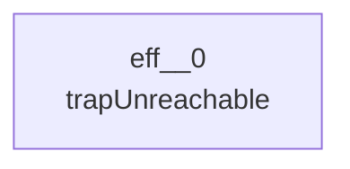
## NOP
```mermaid
---
config:
  layout: elk
---
graph TD
```
## LOCAL_GET
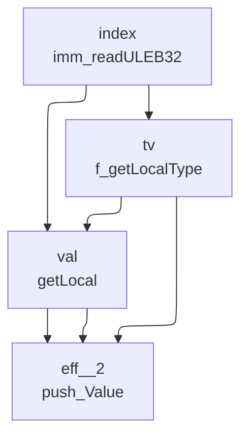
## LOCAL_SET
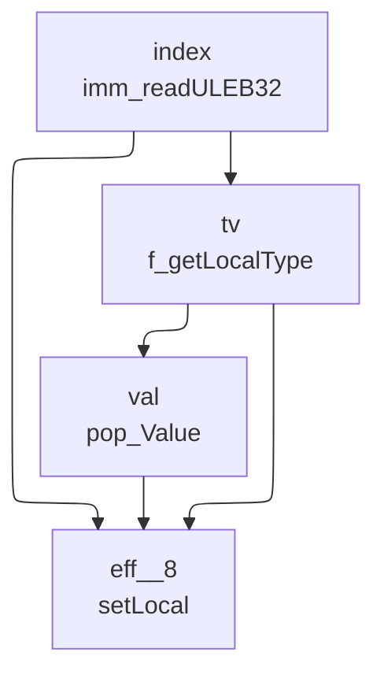
## LOCAL_TEE
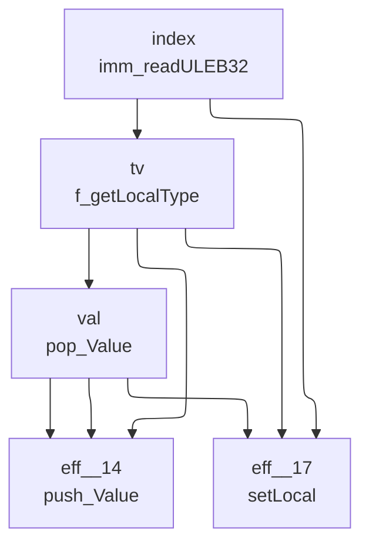
## GLOBAL_GET
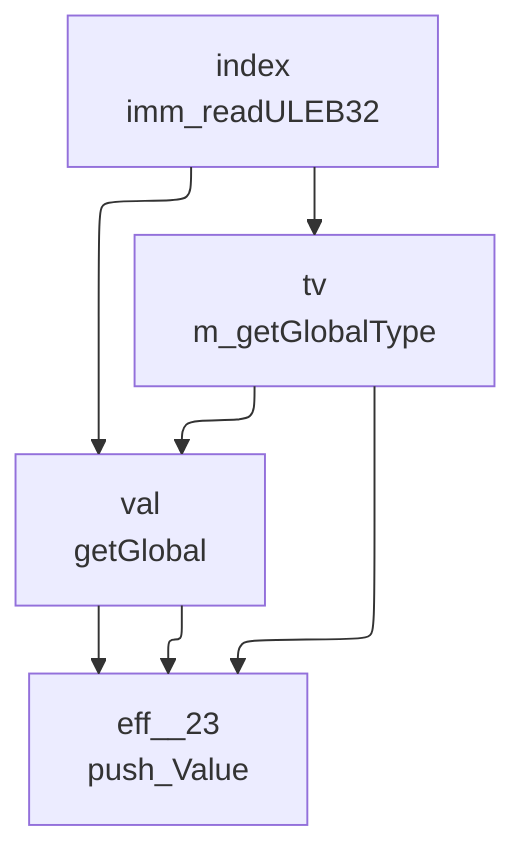
## GLOBAL_SET
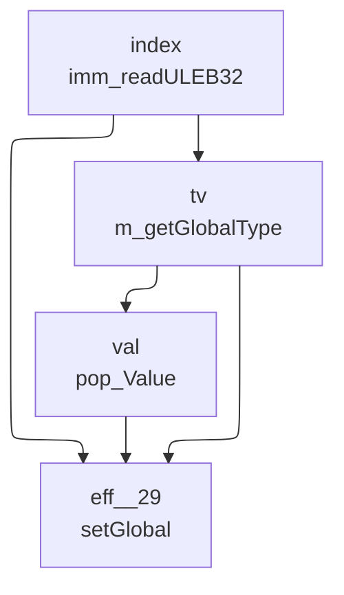
## TABLE_GET
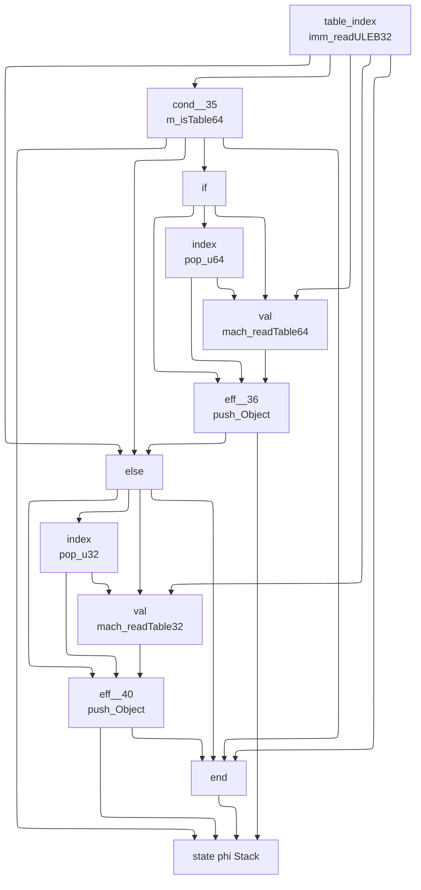
## TABLE_SET
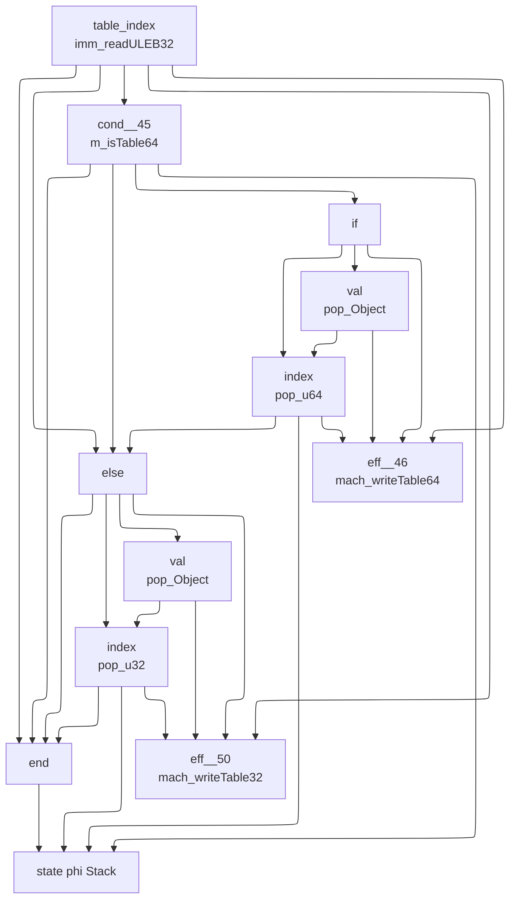
## CALL
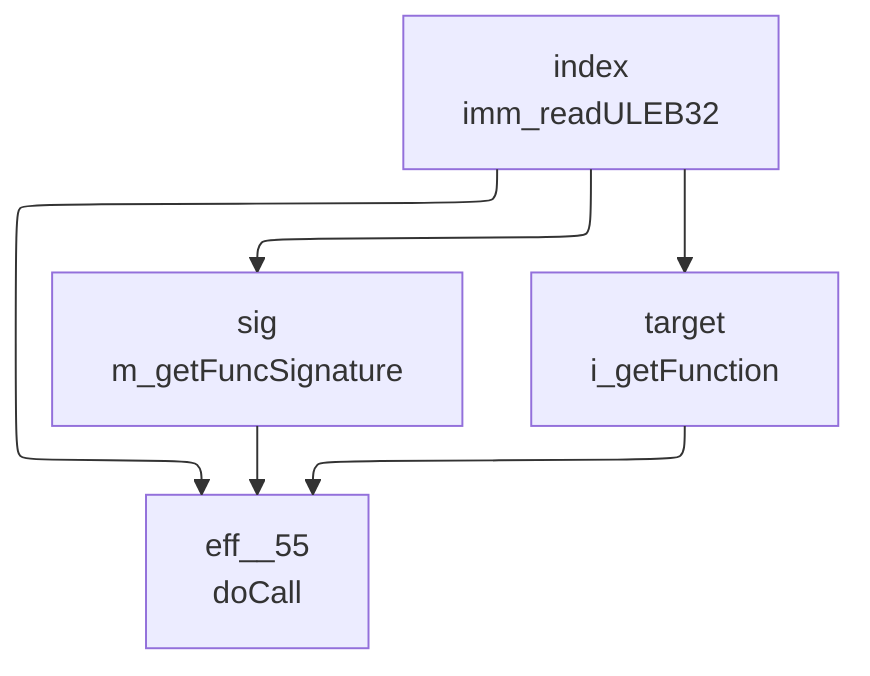
## CALL_INDIRECT
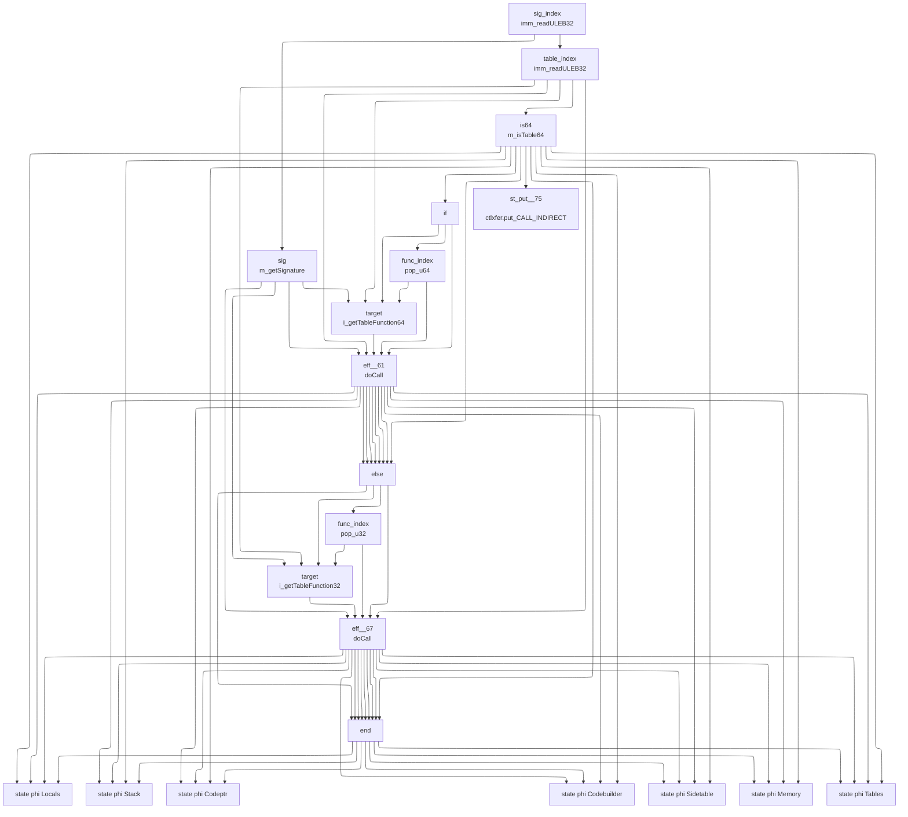
## RETURN_CALL
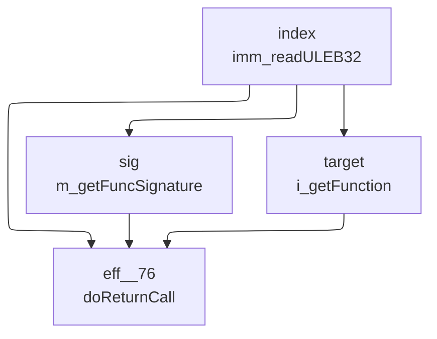
## DROP
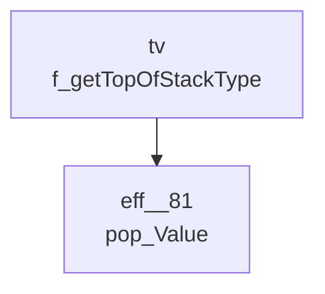
## SELECT
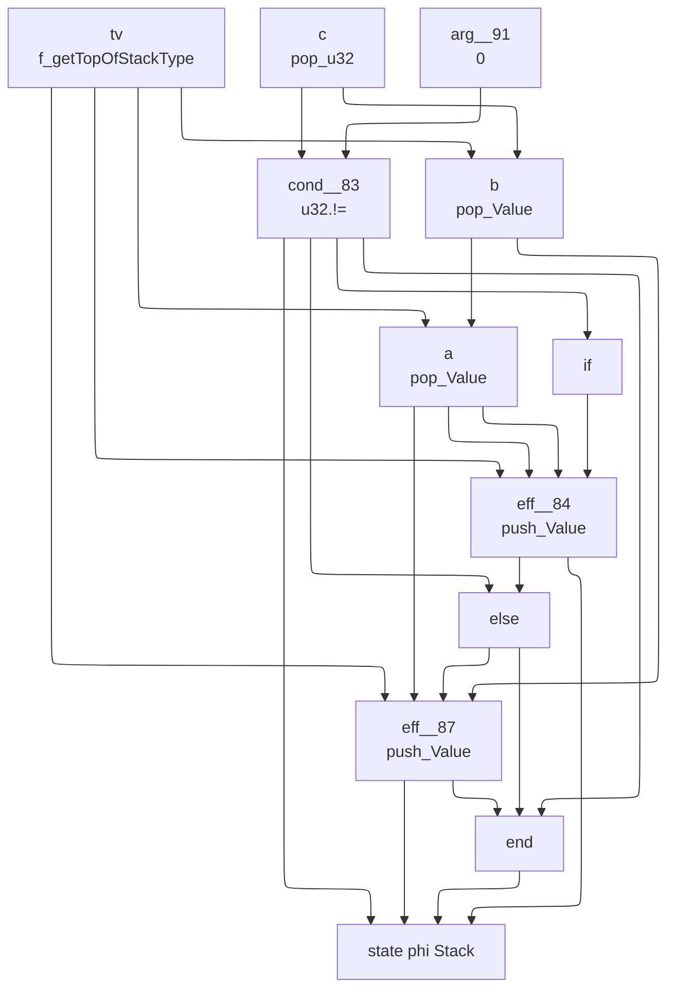
## I32_CONST
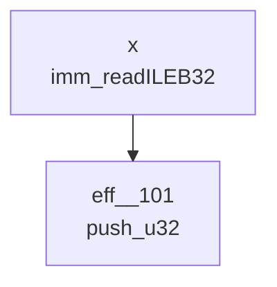
## I32_ADD
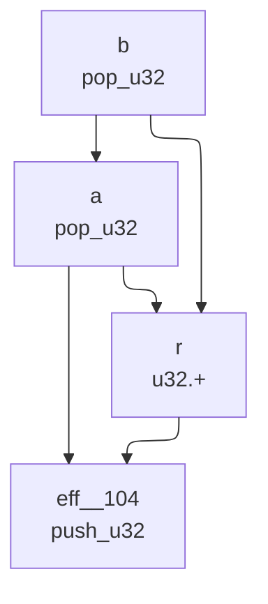
## I32_SUB
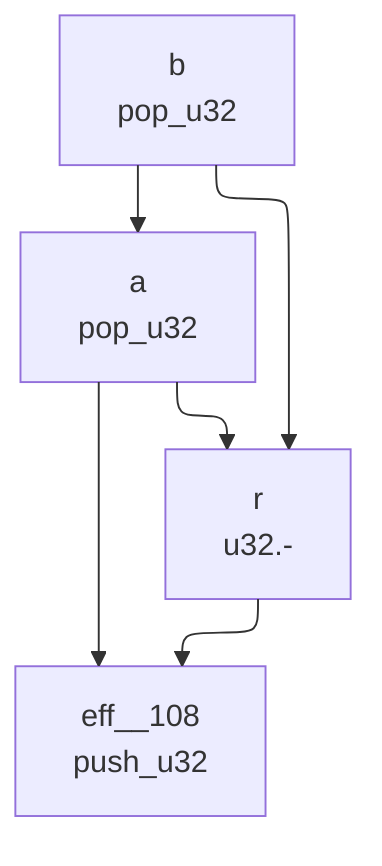
## I32_MUL
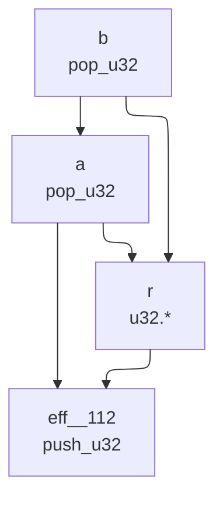
## I32_DIV_S

## I32_DIV_U
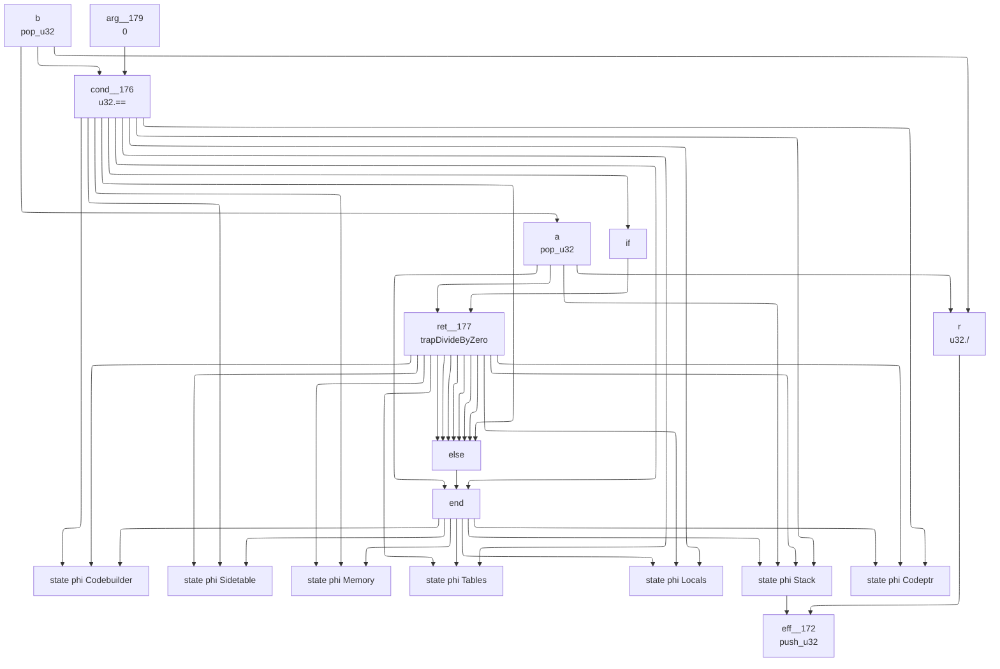
## I32_EQZ
```mermaid
---
config:
  layout: elk
---
graph TD
	9["
	state phi Stack
	"]
	2 --> 9
	5 --> 9
	8 --> 9
	6 --> 9
	6["
	eff__202
	push_u32
	"]
	1 --> 6
	0 --> 6
	4 --> 6
	4["
	else
	"]
	2 --> 4
	8 --> 4
	8["
	eff__200
	push_u32
	"]
	7 --> 8
	0 --> 8
	3 --> 8
	3["
	if
	"]
	2 --> 3
	2["
	cond__199
	u32.==
	"]
	0 --> 2
	1 --> 2
	1["
	arg__205
	0
	"]
	0["
	a
	pop_u32
	"]
	7["
	arg__201
	1
	"]
	5["
	end
	"]
	2 --> 5
	4 --> 5
	6 --> 5
```
## I32_EQ
```mermaid
---
config:
  layout: elk
---
graph TD
	10["
	state phi Stack
	"]
	2 --> 10
	5 --> 10
	9 --> 10
	7 --> 10
	7["
	eff__218
	push_u32
	"]
	6 --> 7
	1 --> 7
	4 --> 7
	4["
	else
	"]
	2 --> 4
	9 --> 4
	9["
	eff__216
	push_u32
	"]
	8 --> 9
	1 --> 9
	3 --> 9
	3["
	if
	"]
	2 --> 3
	2["
	cond__215
	u32.==
	"]
	1 --> 2
	0 --> 2
	0["
	b
	pop_u32
	"]
	1["
	a
	pop_u32
	"]
	0 --> 1
	8["
	arg__217
	1
	"]
	6["
	arg__219
	0
	"]
	5["
	end
	"]
	2 --> 5
	4 --> 5
	7 --> 5
```
## I32_NE
```mermaid
---
config:
  layout: elk
---
graph TD
	10["
	state phi Stack
	"]
	2 --> 10
	5 --> 10
	9 --> 10
	7 --> 10
	7["
	eff__233
	push_u32
	"]
	6 --> 7
	1 --> 7
	4 --> 7
	4["
	else
	"]
	2 --> 4
	9 --> 4
	9["
	eff__231
	push_u32
	"]
	8 --> 9
	1 --> 9
	3 --> 9
	3["
	if
	"]
	2 --> 3
	2["
	cond__230
	u32.!=
	"]
	1 --> 2
	0 --> 2
	0["
	b
	pop_u32
	"]
	1["
	a
	pop_u32
	"]
	0 --> 1
	8["
	arg__232
	1
	"]
	6["
	arg__234
	0
	"]
	5["
	end
	"]
	2 --> 5
	4 --> 5
	7 --> 5
```
## I32_LT_U
```mermaid
---
config:
  layout: elk
---
graph TD
	10["
	state phi Stack
	"]
	2 --> 10
	5 --> 10
	9 --> 10
	7 --> 10
	7["
	eff__248
	push_u32
	"]
	6 --> 7
	1 --> 7
	4 --> 7
	4["
	else
	"]
	2 --> 4
	9 --> 4
	9["
	eff__246
	push_u32
	"]
	8 --> 9
	1 --> 9
	3 --> 9
	3["
	if
	"]
	2 --> 3
	2["
	cond__245
	u32.<
	"]
	1 --> 2
	0 --> 2
	0["
	b
	pop_u32
	"]
	1["
	a
	pop_u32
	"]
	0 --> 1
	8["
	arg__247
	1
	"]
	6["
	arg__249
	0
	"]
	5["
	end
	"]
	2 --> 5
	4 --> 5
	7 --> 5
```
## I32_LT_S
```mermaid
---
config:
  layout: elk
---
graph TD
	10["
	state phi Stack
	"]
	2 --> 10
	5 --> 10
	9 --> 10
	7 --> 10
	7["
	eff__263
	push_u32
	"]
	6 --> 7
	1 --> 7
	4 --> 7
	4["
	else
	"]
	2 --> 4
	9 --> 4
	9["
	eff__261
	push_u32
	"]
	8 --> 9
	1 --> 9
	3 --> 9
	3["
	if
	"]
	2 --> 3
	2["
	cond__260
	U32_lt_s
	"]
	1 --> 2
	0 --> 2
	0["
	b
	pop_u32
	"]
	1["
	a
	pop_u32
	"]
	0 --> 1
	8["
	arg__262
	1
	"]
	6["
	arg__264
	0
	"]
	5["
	end
	"]
	2 --> 5
	4 --> 5
	7 --> 5
```
## I32_LE_S
```mermaid
---
config:
  layout: elk
---
graph TD
	10["
	state phi Stack
	"]
	2 --> 10
	5 --> 10
	9 --> 10
	7 --> 10
	7["
	eff__278
	push_u32
	"]
	6 --> 7
	1 --> 7
	4 --> 7
	4["
	else
	"]
	2 --> 4
	9 --> 4
	9["
	eff__276
	push_u32
	"]
	8 --> 9
	1 --> 9
	3 --> 9
	3["
	if
	"]
	2 --> 3
	2["
	cond__275
	U32_le_s
	"]
	1 --> 2
	0 --> 2
	0["
	b
	pop_u32
	"]
	1["
	a
	pop_u32
	"]
	0 --> 1
	8["
	arg__277
	1
	"]
	6["
	arg__279
	0
	"]
	5["
	end
	"]
	2 --> 5
	4 --> 5
	7 --> 5
```
## I32_GT_U
```mermaid
---
config:
  layout: elk
---
graph TD
	10["
	state phi Stack
	"]
	2 --> 10
	5 --> 10
	9 --> 10
	7 --> 10
	7["
	eff__293
	push_u32
	"]
	6 --> 7
	1 --> 7
	4 --> 7
	4["
	else
	"]
	2 --> 4
	9 --> 4
	9["
	eff__291
	push_u32
	"]
	8 --> 9
	1 --> 9
	3 --> 9
	3["
	if
	"]
	2 --> 3
	2["
	cond__290
	u32.>
	"]
	1 --> 2
	0 --> 2
	0["
	b
	pop_u32
	"]
	1["
	a
	pop_u32
	"]
	0 --> 1
	8["
	arg__292
	1
	"]
	6["
	arg__294
	0
	"]
	5["
	end
	"]
	2 --> 5
	4 --> 5
	7 --> 5
```
## I32_AND
```mermaid
---
config:
  layout: elk
---
graph TD
	3["
	eff__305
	push_u32
	"]
	2 --> 3
	1 --> 3
	1["
	a
	pop_u32
	"]
	0 --> 1
	0["
	b
	pop_u32
	"]
	2["
	r
	u32.&
	"]
	1 --> 2
	0 --> 2
```
## F32_CONST
```mermaid
---
config:
  layout: elk
---
graph TD
	2["
	eff__309
	push_f32
	"]
	1 --> 2
	1["
	arg__310
	f32_reinterpret_u32
	"]
	0 --> 1
	0["
	x
	imm_readULEB32
	"]
```
## F32_ADD
```mermaid
---
config:
  layout: elk
---
graph TD
	3["
	eff__313
	push_f32
	"]
	2 --> 3
	1 --> 3
	1["
	a
	pop_f32
	"]
	0 --> 1
	0["
	b
	pop_f32
	"]
	2["
	r
	float.+
	"]
	1 --> 2
	0 --> 2
```
## F32_SUB
```mermaid
---
config:
  layout: elk
---
graph TD
	3["
	eff__317
	push_f32
	"]
	2 --> 3
	1 --> 3
	1["
	a
	pop_f32
	"]
	0 --> 1
	0["
	b
	pop_f32
	"]
	2["
	r
	float.-
	"]
	1 --> 2
	0 --> 2
```
## F32_MUL
```mermaid
---
config:
  layout: elk
---
graph TD
	3["
	eff__321
	push_f32
	"]
	2 --> 3
	1 --> 3
	1["
	a
	pop_f32
	"]
	0 --> 1
	0["
	b
	pop_f32
	"]
	2["
	r
	float.*
	"]
	1 --> 2
	0 --> 2
```
## F32_DIV
```mermaid
---
config:
  layout: elk
---
graph TD
	14["
	state phi Codebuilder
	"]
	3 --> 14
	6 --> 14
	7 --> 14
	7["
	ret__330
	trapDivideByZero
	"]
	1 --> 7
	4 --> 7
	4["
	if
	"]
	3 --> 4
	3["
	cond__329
	float.==
	"]
	0 --> 3
	2 --> 3
	2["
	arg__332
	0.0f
	"]
	0["
	b
	pop_f32
	"]
	1["
	a
	pop_f32
	"]
	0 --> 1
	6["
	end
	"]
	3 --> 6
	5 --> 6
	1 --> 6
	5["
	else
	"]
	3 --> 5
	7 --> 5
	7 --> 5
	7 --> 5
	7 --> 5
	7 --> 5
	7 --> 5
	7 --> 5
	13["
	state phi Sidetable
	"]
	3 --> 13
	6 --> 13
	7 --> 13
	12["
	state phi Memory
	"]
	3 --> 12
	6 --> 12
	7 --> 12
	11["
	state phi Tables
	"]
	3 --> 11
	6 --> 11
	7 --> 11
	10["
	state phi Locals
	"]
	3 --> 10
	6 --> 10
	7 --> 10
	9["
	state phi Stack
	"]
	3 --> 9
	6 --> 9
	7 --> 9
	1 --> 9
	8["
	state phi Codeptr
	"]
	3 --> 8
	6 --> 8
	7 --> 8
	16["
	eff__325
	push_f32
	"]
	15 --> 16
	9 --> 16
	15["
	r
	float./
	"]
	1 --> 15
	0 --> 15
```
## F32_SQRT
```mermaid
---
config:
  layout: elk
---
graph TD
	2["
	eff__352
	push_f32
	"]
	1 --> 2
	0 --> 2
	0["
	a
	pop_f32
	"]
	1["
	r
	float.sqrt
	"]
	0 --> 1
```
## F32_EQ
```mermaid
---
config:
  layout: elk
---
graph TD
	10["
	state phi Stack
	"]
	2 --> 10
	5 --> 10
	9 --> 10
	7 --> 10
	7["
	eff__358
	push_u32
	"]
	6 --> 7
	1 --> 7
	4 --> 7
	4["
	else
	"]
	2 --> 4
	9 --> 4
	9["
	eff__356
	push_u32
	"]
	8 --> 9
	1 --> 9
	3 --> 9
	3["
	if
	"]
	2 --> 3
	2["
	cond__355
	float.==
	"]
	1 --> 2
	0 --> 2
	0["
	b
	pop_f32
	"]
	1["
	a
	pop_f32
	"]
	0 --> 1
	8["
	arg__357
	1
	"]
	6["
	arg__359
	0
	"]
	5["
	end
	"]
	2 --> 5
	4 --> 5
	7 --> 5
```
## F32_NE
```mermaid
---
config:
  layout: elk
---
graph TD
	10["
	state phi Stack
	"]
	2 --> 10
	5 --> 10
	9 --> 10
	7 --> 10
	7["
	eff__373
	push_u32
	"]
	6 --> 7
	1 --> 7
	4 --> 7
	4["
	else
	"]
	2 --> 4
	9 --> 4
	9["
	eff__371
	push_u32
	"]
	8 --> 9
	1 --> 9
	3 --> 9
	3["
	if
	"]
	2 --> 3
	2["
	cond__370
	float.!=
	"]
	1 --> 2
	0 --> 2
	0["
	b
	pop_f32
	"]
	1["
	a
	pop_f32
	"]
	0 --> 1
	8["
	arg__372
	1
	"]
	6["
	arg__374
	0
	"]
	5["
	end
	"]
	2 --> 5
	4 --> 5
	7 --> 5
```
## F32_LT
```mermaid
---
config:
  layout: elk
---
graph TD
	10["
	state phi Stack
	"]
	2 --> 10
	5 --> 10
	9 --> 10
	7 --> 10
	7["
	eff__388
	push_u32
	"]
	6 --> 7
	1 --> 7
	4 --> 7
	4["
	else
	"]
	2 --> 4
	9 --> 4
	9["
	eff__386
	push_u32
	"]
	8 --> 9
	1 --> 9
	3 --> 9
	3["
	if
	"]
	2 --> 3
	2["
	cond__385
	float.<
	"]
	1 --> 2
	0 --> 2
	0["
	b
	pop_f32
	"]
	1["
	a
	pop_f32
	"]
	0 --> 1
	8["
	arg__387
	1
	"]
	6["
	arg__389
	0
	"]
	5["
	end
	"]
	2 --> 5
	4 --> 5
	7 --> 5
```
## F32_LE
```mermaid
---
config:
  layout: elk
---
graph TD
	10["
	state phi Stack
	"]
	2 --> 10
	5 --> 10
	9 --> 10
	7 --> 10
	7["
	eff__403
	push_u32
	"]
	6 --> 7
	1 --> 7
	4 --> 7
	4["
	else
	"]
	2 --> 4
	9 --> 4
	9["
	eff__401
	push_u32
	"]
	8 --> 9
	1 --> 9
	3 --> 9
	3["
	if
	"]
	2 --> 3
	2["
	cond__400
	float.<=
	"]
	1 --> 2
	0 --> 2
	0["
	b
	pop_f32
	"]
	1["
	a
	pop_f32
	"]
	0 --> 1
	8["
	arg__402
	1
	"]
	6["
	arg__404
	0
	"]
	5["
	end
	"]
	2 --> 5
	4 --> 5
	7 --> 5
```
## F32_GT
```mermaid
---
config:
  layout: elk
---
graph TD
	10["
	state phi Stack
	"]
	2 --> 10
	5 --> 10
	9 --> 10
	7 --> 10
	7["
	eff__418
	push_u32
	"]
	6 --> 7
	1 --> 7
	4 --> 7
	4["
	else
	"]
	2 --> 4
	9 --> 4
	9["
	eff__416
	push_u32
	"]
	8 --> 9
	1 --> 9
	3 --> 9
	3["
	if
	"]
	2 --> 3
	2["
	cond__415
	float.>
	"]
	1 --> 2
	0 --> 2
	0["
	b
	pop_f32
	"]
	1["
	a
	pop_f32
	"]
	0 --> 1
	8["
	arg__417
	1
	"]
	6["
	arg__419
	0
	"]
	5["
	end
	"]
	2 --> 5
	4 --> 5
	7 --> 5
```
## BR
```mermaid
---
config:
  layout: elk
---
graph TD
	3["
	st_put__433
	ctlxfer.put_BR
	"]
	1 --> 3
	1["
	label
	f_getLabel
	"]
	0 --> 1
	0["
	depth
	imm_readULEB32
	"]
	2["
	ret__430
	doBranch
	"]
	1 --> 2
	0 --> 2
```
## BR_IF
```mermaid
---
config:
  layout: elk
---
graph TD
	15["
	state phi Sidetable
	"]
	4 --> 15
	7 --> 15
	9 --> 15
	8 --> 15
	8["
	ret__437
	doFallthru
	"]
	2 --> 8
	0 --> 8
	6 --> 8
	6["
	else
	"]
	4 --> 6
	9 --> 6
	9 --> 6
	9 --> 6
	9 --> 6
	9 --> 6
	9 --> 6
	9 --> 6
	9["
	ret__435
	doBranch
	"]
	1 --> 9
	2 --> 9
	0 --> 9
	5 --> 9
	5["
	if
	"]
	4 --> 5
	4["
	cond__434
	u32.!=
	"]
	2 --> 4
	3 --> 4
	3["
	arg__439
	0
	"]
	2["
	cond
	pop_u32
	"]
	0["
	depth
	imm_readULEB32
	"]
	1["
	label
	f_getLabel
	"]
	0 --> 1
	7["
	end
	"]
	4 --> 7
	6 --> 7
	8 --> 7
	8 --> 7
	8 --> 7
	8 --> 7
	8 --> 7
	8 --> 7
	8 --> 7
	14["
	state phi Memory
	"]
	4 --> 14
	7 --> 14
	9 --> 14
	8 --> 14
	13["
	state phi Tables
	"]
	4 --> 13
	7 --> 13
	9 --> 13
	8 --> 13
	12["
	state phi Locals
	"]
	4 --> 12
	7 --> 12
	9 --> 12
	8 --> 12
	11["
	state phi Stack
	"]
	4 --> 11
	7 --> 11
	9 --> 11
	8 --> 11
	10["
	state phi Codeptr
	"]
	4 --> 10
	7 --> 10
	9 --> 10
	8 --> 10
	17["
	st_put__441
	ctlxfer.put_BR_IF
	"]
	1 --> 17
	16["
	state phi Codebuilder
	"]
	4 --> 16
	7 --> 16
	9 --> 16
	8 --> 16
```
## BR_TABLE
```mermaid
---
config:
  layout: elk
---
graph TD
	3["
	st_put__470
	ctlxfer.put_BR_TABLE
	"]
	0 --> 3
	0["
	labels
	imm_readLabels
	"]
	2["
	eff__467
	doSwitch
	"]
	0 --> 2
	1 --> 2
	1 --> 2
	0 --> 2
	1["
	key
	pop_u32
	"]
```
## BLOCK
```mermaid
---
config:
  layout: elk
---
graph TD
	1["
	eff__471
	doBlock
	"]
	0 --> 1
	0 --> 1
	0["
	bt
	imm_readBlockType
	"]
```
## LOOP
```mermaid
---
config:
  layout: elk
---
graph TD
	1["
	eff__473
	doLoop
	"]
	0 --> 1
	0 --> 1
	0["
	bt
	imm_readBlockType
	"]
```
## TRY
```mermaid
---
config:
  layout: elk
---
graph TD
	1["
	eff__475
	doTry
	"]
	0 --> 1
	0 --> 1
	0["
	bt
	imm_readBlockType
	"]
```
## IF
```mermaid
---
config:
  layout: elk
---
graph TD
	15["
	state phi Sidetable
	"]
	4 --> 15
	7 --> 15
	9 --> 15
	8 --> 15
	8["
	ret__480
	doFallthru
	"]
	2 --> 8
	2 --> 8
	2 --> 8
	2 --> 8
	2 --> 8
	2 --> 8
	2 --> 8
	6 --> 8
	6["
	else
	"]
	4 --> 6
	9 --> 6
	9 --> 6
	9 --> 6
	9 --> 6
	9 --> 6
	9 --> 6
	9 --> 6
	9["
	ret__478
	doBranch
	"]
	2 --> 9
	2 --> 9
	2 --> 9
	2 --> 9
	2 --> 9
	2 --> 9
	2 --> 9
	2 --> 9
	5 --> 9
	5["
	if
	"]
	4 --> 5
	4["
	cond__477
	u32.==
	"]
	1 --> 4
	3 --> 4
	3["
	arg__482
	0
	"]
	1["
	cond
	pop_u32
	"]
	2["
	label
	doIf
	"]
	0 --> 2
	1 --> 2
	0 --> 2
	0["
	bt
	imm_readBlockType
	"]
	7["
	end
	"]
	4 --> 7
	6 --> 7
	8 --> 7
	8 --> 7
	8 --> 7
	8 --> 7
	8 --> 7
	8 --> 7
	8 --> 7
	14["
	state phi Memory
	"]
	4 --> 14
	7 --> 14
	9 --> 14
	8 --> 14
	13["
	state phi Tables
	"]
	4 --> 13
	7 --> 13
	9 --> 13
	8 --> 13
	12["
	state phi Locals
	"]
	4 --> 12
	7 --> 12
	9 --> 12
	8 --> 12
	11["
	state phi Stack
	"]
	4 --> 11
	7 --> 11
	9 --> 11
	8 --> 11
	10["
	state phi Codeptr
	"]
	4 --> 10
	7 --> 10
	9 --> 10
	8 --> 10
	17["
	st_put__484
	ctlxfer.put_IF
	"]
	2 --> 17
	16["
	state phi Codebuilder
	"]
	4 --> 16
	7 --> 16
	9 --> 16
	8 --> 16
```
## ELSE
```mermaid
---
config:
  layout: elk
---
graph TD
	2["
	st_put__512
	ctlxfer.put_ELSE
	"]
	0 --> 2
	0["
	label
	doElse
	"]
	1["
	ret__510
	doBranch
	"]
	0 --> 1
	0 --> 1
	0 --> 1
	0 --> 1
	0 --> 1
	0 --> 1
	0 --> 1
	0 --> 1
```
## END
```mermaid
---
config:
  layout: elk
---
graph TD
	12["
	state phi Codebuilder
	"]
	1 --> 12
	4 --> 12
	5 --> 12
	0 --> 12
	0["
	eff__515
	doEnd
	"]
	5["
	ret__514
	doReturn
	"]
	0 --> 5
	0 --> 5
	0 --> 5
	0 --> 5
	0 --> 5
	0 --> 5
	0 --> 5
	2 --> 5
	2["
	if
	"]
	1 --> 2
	1["
	cond__513
	f_isAtEnd
	"]
	4["
	end
	"]
	1 --> 4
	3 --> 4
	0 --> 4
	0 --> 4
	0 --> 4
	0 --> 4
	0 --> 4
	0 --> 4
	0 --> 4
	3["
	else
	"]
	1 --> 3
	5 --> 3
	5 --> 3
	5 --> 3
	5 --> 3
	5 --> 3
	5 --> 3
	5 --> 3
	11["
	state phi Sidetable
	"]
	1 --> 11
	4 --> 11
	5 --> 11
	0 --> 11
	10["
	state phi Memory
	"]
	1 --> 10
	4 --> 10
	5 --> 10
	0 --> 10
	9["
	state phi Tables
	"]
	1 --> 9
	4 --> 9
	5 --> 9
	0 --> 9
	8["
	state phi Locals
	"]
	1 --> 8
	4 --> 8
	5 --> 8
	0 --> 8
	7["
	state phi Stack
	"]
	1 --> 7
	4 --> 7
	5 --> 7
	0 --> 7
	6["
	state phi Codeptr
	"]
	1 --> 6
	4 --> 6
	5 --> 6
	0 --> 6
```
## RETURN
```mermaid
---
config:
  layout: elk
---
graph TD
	0["
	ret__516
	doReturn
	"]
```
## REF_NULL
```mermaid
---
config:
  layout: elk
---
graph TD
	2["
	eff__517
	push_Object
	"]
	1 --> 2
	1["
	arg__518
	object_Null
	"]
	0["
	idx
	imm_readULEB32
	"]
```
## REF_IS_NULL
```mermaid
---
config:
  layout: elk
---
graph TD
	9["
	state phi Stack
	"]
	1 --> 9
	4 --> 9
	8 --> 9
	6 --> 9
	6["
	eff__522
	push_u32
	"]
	5 --> 6
	0 --> 6
	3 --> 6
	3["
	else
	"]
	1 --> 3
	8 --> 3
	8["
	eff__520
	push_u32
	"]
	7 --> 8
	0 --> 8
	2 --> 8
	2["
	if
	"]
	1 --> 2
	1["
	cond__519
	object_isNull
	"]
	0 --> 1
	0["
	obj
	pop_Object
	"]
	7["
	arg__521
	1
	"]
	5["
	arg__523
	0
	"]
	4["
	end
	"]
	1 --> 4
	3 --> 4
	6 --> 4
```
## REF_AS_NON_NULL
```mermaid
---
config:
  layout: elk
---
graph TD
	13["
	eff__533
	push_Object
	"]
	0 --> 13
	7 --> 13
	7["
	state phi Stack
	"]
	1 --> 7
	4 --> 7
	5 --> 7
	0 --> 7
	0["
	obj
	pop_Object
	"]
	5["
	eff__536
	trapNull
	"]
	0 --> 5
	2 --> 5
	2["
	if
	"]
	1 --> 2
	1["
	cond__535
	object_isNull
	"]
	0 --> 1
	4["
	end
	"]
	1 --> 4
	3 --> 4
	0 --> 4
	3["
	else
	"]
	1 --> 3
	5 --> 3
	5 --> 3
	5 --> 3
	5 --> 3
	5 --> 3
	5 --> 3
	5 --> 3
	12["
	state phi Codebuilder
	"]
	1 --> 12
	4 --> 12
	5 --> 12
	11["
	state phi Sidetable
	"]
	1 --> 11
	4 --> 11
	5 --> 11
	10["
	state phi Memory
	"]
	1 --> 10
	4 --> 10
	5 --> 10
	9["
	state phi Tables
	"]
	1 --> 9
	4 --> 9
	5 --> 9
	8["
	state phi Locals
	"]
	1 --> 8
	4 --> 8
	5 --> 8
	6["
	state phi Codeptr
	"]
	1 --> 6
	4 --> 6
	5 --> 6
```
## STRUCT_NEW
```mermaid
---
config:
  layout: elk
---
graph TD
	3["
	eff__556
	push_Object
	"]
	2 --> 3
	2["
	obj
	object_New
	"]
	1 --> 2
	1["
	sig
	m_getSignature
	"]
	0 --> 1
	0["
	struct_idx
	imm_readULEB32
	"]
```
## STRUCT_GET
```mermaid
---
config:
  layout: elk
---
graph TD
	15["
	state phi Sidetable
	"]
	5 --> 15
	8 --> 15
	9 --> 15
	9["
	ret__586
	trapNull
	"]
	4 --> 9
	1 --> 9
	6 --> 9
	6["
	if
	"]
	5 --> 6
	5["
	cond__585
	object_isNull
	"]
	4 --> 5
	4["
	obj
	pop_Object
	"]
	1["
	field_index
	imm_readULEB32
	"]
	0 --> 1
	0["
	struct_index
	imm_readULEB32
	"]
	8["
	end
	"]
	5 --> 8
	7 --> 8
	1 --> 8
	4 --> 8
	7["
	else
	"]
	5 --> 7
	9 --> 7
	9 --> 7
	9 --> 7
	9 --> 7
	9 --> 7
	9 --> 7
	9 --> 7
	14["
	state phi Memory
	"]
	5 --> 14
	8 --> 14
	9 --> 14
	13["
	state phi Tables
	"]
	5 --> 13
	8 --> 13
	9 --> 13
	12["
	state phi Locals
	"]
	5 --> 12
	8 --> 12
	9 --> 12
	11["
	state phi Stack
	"]
	5 --> 11
	8 --> 11
	9 --> 11
	4 --> 11
	10["
	state phi Codeptr
	"]
	5 --> 10
	8 --> 10
	9 --> 10
	1 --> 10
	3["
	offset
	m_getFieldOffset
	"]
	0 --> 3
	1 --> 3
	2["
	kind
	m_getFieldKind
	"]
	0 --> 2
	1 --> 2
	16["
	state phi Codebuilder
	"]
	5 --> 16
	8 --> 16
	9 --> 16
```
## STRUCT_GET_S
```mermaid
---
config:
  layout: elk
---
graph TD
	15["
	state phi Sidetable
	"]
	5 --> 15
	8 --> 15
	9 --> 15
	9["
	ret__624
	trapNull
	"]
	4 --> 9
	1 --> 9
	6 --> 9
	6["
	if
	"]
	5 --> 6
	5["
	cond__623
	object_isNull
	"]
	4 --> 5
	4["
	obj
	pop_Object
	"]
	1["
	field_index
	imm_readULEB32
	"]
	0 --> 1
	0["
	struct_index
	imm_readULEB32
	"]
	8["
	end
	"]
	5 --> 8
	7 --> 8
	1 --> 8
	4 --> 8
	7["
	else
	"]
	5 --> 7
	9 --> 7
	9 --> 7
	9 --> 7
	9 --> 7
	9 --> 7
	9 --> 7
	9 --> 7
	14["
	state phi Memory
	"]
	5 --> 14
	8 --> 14
	9 --> 14
	13["
	state phi Tables
	"]
	5 --> 13
	8 --> 13
	9 --> 13
	12["
	state phi Locals
	"]
	5 --> 12
	8 --> 12
	9 --> 12
	11["
	state phi Stack
	"]
	5 --> 11
	8 --> 11
	9 --> 11
	4 --> 11
	10["
	state phi Codeptr
	"]
	5 --> 10
	8 --> 10
	9 --> 10
	1 --> 10
	3["
	offset
	m_getFieldOffset
	"]
	0 --> 3
	1 --> 3
	2["
	kind
	m_getFieldKind
	"]
	0 --> 2
	1 --> 2
	16["
	state phi Codebuilder
	"]
	5 --> 16
	8 --> 16
	9 --> 16
```
## STRUCT_GET_U
```mermaid
---
config:
  layout: elk
---
graph TD
	15["
	state phi Sidetable
	"]
	5 --> 15
	8 --> 15
	9 --> 15
	9["
	ret__662
	trapNull
	"]
	4 --> 9
	1 --> 9
	6 --> 9
	6["
	if
	"]
	5 --> 6
	5["
	cond__661
	object_isNull
	"]
	4 --> 5
	4["
	obj
	pop_Object
	"]
	1["
	field_index
	imm_readULEB32
	"]
	0 --> 1
	0["
	struct_index
	imm_readULEB32
	"]
	8["
	end
	"]
	5 --> 8
	7 --> 8
	1 --> 8
	4 --> 8
	7["
	else
	"]
	5 --> 7
	9 --> 7
	9 --> 7
	9 --> 7
	9 --> 7
	9 --> 7
	9 --> 7
	9 --> 7
	14["
	state phi Memory
	"]
	5 --> 14
	8 --> 14
	9 --> 14
	13["
	state phi Tables
	"]
	5 --> 13
	8 --> 13
	9 --> 13
	12["
	state phi Locals
	"]
	5 --> 12
	8 --> 12
	9 --> 12
	11["
	state phi Stack
	"]
	5 --> 11
	8 --> 11
	9 --> 11
	4 --> 11
	10["
	state phi Codeptr
	"]
	5 --> 10
	8 --> 10
	9 --> 10
	1 --> 10
	3["
	offset
	m_getFieldOffset
	"]
	0 --> 3
	1 --> 3
	2["
	kind
	m_getFieldKind
	"]
	0 --> 2
	1 --> 2
	16["
	state phi Codebuilder
	"]
	5 --> 16
	8 --> 16
	9 --> 16
```
## I32_LOAD
```mermaid
---
config:
  layout: elk
---
graph TD
	13["
	if
	"]
	12 --> 13
	12["
	cond__688
	m_isMemory64
	"]
	10 --> 12
	10["
	memindex
	phi
	"]
	5 --> 10
	8 --> 10
	9 --> 10
	1 --> 10
	1["
	memindex
	0u
	"]
	9["
	memindex__701
	imm_readULEB32
	"]
	0 --> 9
	6 --> 9
	6["
	if
	"]
	5 --> 6
	5["
	cond__700
	u8.!=
	"]
	4 --> 5
	2 --> 5
	2["
	arg__703
	0
	"]
	4["
	arg__702
	u8.&
	"]
	0 --> 4
	3 --> 4
	3["
	arg__705
	0x40u8
	"]
	0["
	flags
	imm_readU8
	"]
	8["
	end
	"]
	5 --> 8
	7 --> 8
	1 --> 8
	0 --> 8
	7["
	else
	"]
	5 --> 7
	9 --> 7
	9 --> 7
	11["
	state phi Codeptr
	"]
	5 --> 11
	8 --> 11
	9 --> 11
	0 --> 11
	25["
	state phi Stack
	"]
	12 --> 25
	15 --> 25
	23 --> 25
	19 --> 25
	19["
	eff__694
	push_u32
	"]
	18 --> 19
	17 --> 19
	14 --> 19
	14["
	else
	"]
	12 --> 14
	20 --> 14
	23 --> 14
	23["
	eff__689
	push_u32
	"]
	22 --> 23
	21 --> 23
	13 --> 23
	21["
	index
	pop_u64
	"]
	13 --> 21
	22["
	val
	mach_readMemory64_u32
	"]
	10 --> 22
	21 --> 22
	20 --> 22
	13 --> 22
	20["
	offset
	imm_readULEB64
	"]
	11 --> 20
	13 --> 20
	17["
	index
	pop_u32
	"]
	14 --> 17
	18["
	val
	mach_readMemory32_u32
	"]
	10 --> 18
	17 --> 18
	16 --> 18
	14 --> 18
	16["
	offset
	imm_readULEB32
	"]
	11 --> 16
	14 --> 16
	15["
	end
	"]
	12 --> 15
	14 --> 15
	16 --> 15
	19 --> 15
	24["
	state phi Codeptr
	"]
	12 --> 24
	15 --> 24
	20 --> 24
	16 --> 24
```
## I32_LOAD8_U
```mermaid
---
config:
  layout: elk
---
graph TD
	13["
	if
	"]
	12 --> 13
	12["
	cond__706
	m_isMemory64
	"]
	10 --> 12
	10["
	memindex
	phi
	"]
	5 --> 10
	8 --> 10
	9 --> 10
	1 --> 10
	1["
	memindex
	0u
	"]
	9["
	memindex__719
	imm_readULEB32
	"]
	0 --> 9
	6 --> 9
	6["
	if
	"]
	5 --> 6
	5["
	cond__718
	u8.!=
	"]
	4 --> 5
	2 --> 5
	2["
	arg__721
	0
	"]
	4["
	arg__720
	u8.&
	"]
	0 --> 4
	3 --> 4
	3["
	arg__723
	0x40u8
	"]
	0["
	flags
	imm_readU8
	"]
	8["
	end
	"]
	5 --> 8
	7 --> 8
	1 --> 8
	0 --> 8
	7["
	else
	"]
	5 --> 7
	9 --> 7
	9 --> 7
	11["
	state phi Codeptr
	"]
	5 --> 11
	8 --> 11
	9 --> 11
	0 --> 11
	25["
	state phi Stack
	"]
	12 --> 25
	15 --> 25
	23 --> 25
	19 --> 25
	19["
	eff__712
	push_u32
	"]
	18 --> 19
	17 --> 19
	14 --> 19
	14["
	else
	"]
	12 --> 14
	20 --> 14
	23 --> 14
	23["
	eff__707
	push_u32
	"]
	22 --> 23
	21 --> 23
	13 --> 23
	21["
	index
	pop_u64
	"]
	13 --> 21
	22["
	val
	mach_readMemory64_u8
	"]
	10 --> 22
	21 --> 22
	20 --> 22
	13 --> 22
	20["
	offset
	imm_readULEB64
	"]
	11 --> 20
	13 --> 20
	17["
	index
	pop_u32
	"]
	14 --> 17
	18["
	val
	mach_readMemory32_u8
	"]
	10 --> 18
	17 --> 18
	16 --> 18
	14 --> 18
	16["
	offset
	imm_readULEB32
	"]
	11 --> 16
	14 --> 16
	15["
	end
	"]
	12 --> 15
	14 --> 15
	16 --> 15
	19 --> 15
	24["
	state phi Codeptr
	"]
	12 --> 24
	15 --> 24
	20 --> 24
	16 --> 24
```
## I32_LOAD16_S
```mermaid
---
config:
  layout: elk
---
graph TD
	13["
	if
	"]
	12 --> 13
	12["
	cond__724
	m_isMemory64
	"]
	10 --> 12
	10["
	memindex
	phi
	"]
	5 --> 10
	8 --> 10
	9 --> 10
	1 --> 10
	1["
	memindex
	0u
	"]
	9["
	memindex__737
	imm_readULEB32
	"]
	0 --> 9
	6 --> 9
	6["
	if
	"]
	5 --> 6
	5["
	cond__736
	u8.!=
	"]
	4 --> 5
	2 --> 5
	2["
	arg__739
	0
	"]
	4["
	arg__738
	u8.&
	"]
	0 --> 4
	3 --> 4
	3["
	arg__741
	0x40u8
	"]
	0["
	flags
	imm_readU8
	"]
	8["
	end
	"]
	5 --> 8
	7 --> 8
	1 --> 8
	0 --> 8
	7["
	else
	"]
	5 --> 7
	9 --> 7
	9 --> 7
	11["
	state phi Codeptr
	"]
	5 --> 11
	8 --> 11
	9 --> 11
	0 --> 11
	25["
	state phi Stack
	"]
	12 --> 25
	15 --> 25
	23 --> 25
	19 --> 25
	19["
	eff__730
	push_u32
	"]
	18 --> 19
	17 --> 19
	14 --> 19
	14["
	else
	"]
	12 --> 14
	20 --> 14
	23 --> 14
	23["
	eff__725
	push_u32
	"]
	22 --> 23
	21 --> 23
	13 --> 23
	21["
	index
	pop_u64
	"]
	13 --> 21
	22["
	val
	mach_readMemory64_u16
	"]
	10 --> 22
	21 --> 22
	20 --> 22
	13 --> 22
	20["
	offset
	imm_readULEB64
	"]
	11 --> 20
	13 --> 20
	17["
	index
	pop_u32
	"]
	14 --> 17
	18["
	val
	mach_readMemory32_u16
	"]
	10 --> 18
	17 --> 18
	16 --> 18
	14 --> 18
	16["
	offset
	imm_readULEB32
	"]
	11 --> 16
	14 --> 16
	15["
	end
	"]
	12 --> 15
	14 --> 15
	16 --> 15
	19 --> 15
	24["
	state phi Codeptr
	"]
	12 --> 24
	15 --> 24
	20 --> 24
	16 --> 24
```
## I64_LOAD
```mermaid
---
config:
  layout: elk
---
graph TD
	13["
	if
	"]
	12 --> 13
	12["
	cond__742
	m_isMemory64
	"]
	10 --> 12
	10["
	memindex
	phi
	"]
	5 --> 10
	8 --> 10
	9 --> 10
	1 --> 10
	1["
	memindex
	0u
	"]
	9["
	memindex__755
	imm_readULEB32
	"]
	0 --> 9
	6 --> 9
	6["
	if
	"]
	5 --> 6
	5["
	cond__754
	u8.!=
	"]
	4 --> 5
	2 --> 5
	2["
	arg__757
	0
	"]
	4["
	arg__756
	u8.&
	"]
	0 --> 4
	3 --> 4
	3["
	arg__759
	0x40u8
	"]
	0["
	flags
	imm_readU8
	"]
	8["
	end
	"]
	5 --> 8
	7 --> 8
	1 --> 8
	0 --> 8
	7["
	else
	"]
	5 --> 7
	9 --> 7
	9 --> 7
	11["
	state phi Codeptr
	"]
	5 --> 11
	8 --> 11
	9 --> 11
	0 --> 11
	25["
	state phi Stack
	"]
	12 --> 25
	15 --> 25
	23 --> 25
	19 --> 25
	19["
	eff__748
	push_u64
	"]
	18 --> 19
	17 --> 19
	14 --> 19
	14["
	else
	"]
	12 --> 14
	20 --> 14
	23 --> 14
	23["
	eff__743
	push_u64
	"]
	22 --> 23
	21 --> 23
	13 --> 23
	21["
	index
	pop_u64
	"]
	13 --> 21
	22["
	val
	mach_readMemory64_u64
	"]
	10 --> 22
	21 --> 22
	20 --> 22
	13 --> 22
	20["
	offset
	imm_readULEB64
	"]
	11 --> 20
	13 --> 20
	17["
	index
	pop_u32
	"]
	14 --> 17
	18["
	val
	mach_readMemory32_u64
	"]
	10 --> 18
	17 --> 18
	16 --> 18
	14 --> 18
	16["
	offset
	imm_readULEB32
	"]
	11 --> 16
	14 --> 16
	15["
	end
	"]
	12 --> 15
	14 --> 15
	16 --> 15
	19 --> 15
	24["
	state phi Codeptr
	"]
	12 --> 24
	15 --> 24
	20 --> 24
	16 --> 24
```
## F32_LOAD
```mermaid
---
config:
  layout: elk
---
graph TD
	13["
	if
	"]
	12 --> 13
	12["
	cond__760
	m_isMemory64
	"]
	10 --> 12
	10["
	memindex
	phi
	"]
	5 --> 10
	8 --> 10
	9 --> 10
	1 --> 10
	1["
	memindex
	0u
	"]
	9["
	memindex__773
	imm_readULEB32
	"]
	0 --> 9
	6 --> 9
	6["
	if
	"]
	5 --> 6
	5["
	cond__772
	u8.!=
	"]
	4 --> 5
	2 --> 5
	2["
	arg__775
	0
	"]
	4["
	arg__774
	u8.&
	"]
	0 --> 4
	3 --> 4
	3["
	arg__777
	0x40u8
	"]
	0["
	flags
	imm_readU8
	"]
	8["
	end
	"]
	5 --> 8
	7 --> 8
	1 --> 8
	0 --> 8
	7["
	else
	"]
	5 --> 7
	9 --> 7
	9 --> 7
	11["
	state phi Codeptr
	"]
	5 --> 11
	8 --> 11
	9 --> 11
	0 --> 11
	25["
	state phi Stack
	"]
	12 --> 25
	15 --> 25
	23 --> 25
	19 --> 25
	19["
	eff__766
	push_f32
	"]
	18 --> 19
	17 --> 19
	14 --> 19
	14["
	else
	"]
	12 --> 14
	20 --> 14
	23 --> 14
	23["
	eff__761
	push_f32
	"]
	22 --> 23
	21 --> 23
	13 --> 23
	21["
	index
	pop_u64
	"]
	13 --> 21
	22["
	val
	mach_readMemory64_f32
	"]
	10 --> 22
	21 --> 22
	20 --> 22
	13 --> 22
	20["
	offset
	imm_readULEB64
	"]
	11 --> 20
	13 --> 20
	17["
	index
	pop_u32
	"]
	14 --> 17
	18["
	val
	mach_readMemory32_f32
	"]
	10 --> 18
	17 --> 18
	16 --> 18
	14 --> 18
	16["
	offset
	imm_readULEB32
	"]
	11 --> 16
	14 --> 16
	15["
	end
	"]
	12 --> 15
	14 --> 15
	16 --> 15
	19 --> 15
	24["
	state phi Codeptr
	"]
	12 --> 24
	15 --> 24
	20 --> 24
	16 --> 24
```
## F64_LOAD
```mermaid
---
config:
  layout: elk
---
graph TD
	13["
	if
	"]
	12 --> 13
	12["
	cond__778
	m_isMemory64
	"]
	10 --> 12
	10["
	memindex
	phi
	"]
	5 --> 10
	8 --> 10
	9 --> 10
	1 --> 10
	1["
	memindex
	0u
	"]
	9["
	memindex__791
	imm_readULEB32
	"]
	0 --> 9
	6 --> 9
	6["
	if
	"]
	5 --> 6
	5["
	cond__790
	u8.!=
	"]
	4 --> 5
	2 --> 5
	2["
	arg__793
	0
	"]
	4["
	arg__792
	u8.&
	"]
	0 --> 4
	3 --> 4
	3["
	arg__795
	0x40u8
	"]
	0["
	flags
	imm_readU8
	"]
	8["
	end
	"]
	5 --> 8
	7 --> 8
	1 --> 8
	0 --> 8
	7["
	else
	"]
	5 --> 7
	9 --> 7
	9 --> 7
	11["
	state phi Codeptr
	"]
	5 --> 11
	8 --> 11
	9 --> 11
	0 --> 11
	25["
	state phi Stack
	"]
	12 --> 25
	15 --> 25
	23 --> 25
	19 --> 25
	19["
	eff__784
	push_f64
	"]
	18 --> 19
	17 --> 19
	14 --> 19
	14["
	else
	"]
	12 --> 14
	20 --> 14
	23 --> 14
	23["
	eff__779
	push_f64
	"]
	22 --> 23
	21 --> 23
	13 --> 23
	21["
	index
	pop_u64
	"]
	13 --> 21
	22["
	val
	mach_readMemory64_f64
	"]
	10 --> 22
	21 --> 22
	20 --> 22
	13 --> 22
	20["
	offset
	imm_readULEB64
	"]
	11 --> 20
	13 --> 20
	17["
	index
	pop_u32
	"]
	14 --> 17
	18["
	val
	mach_readMemory32_f64
	"]
	10 --> 18
	17 --> 18
	16 --> 18
	14 --> 18
	16["
	offset
	imm_readULEB32
	"]
	11 --> 16
	14 --> 16
	15["
	end
	"]
	12 --> 15
	14 --> 15
	16 --> 15
	19 --> 15
	24["
	state phi Codeptr
	"]
	12 --> 24
	15 --> 24
	20 --> 24
	16 --> 24
```
## I32_STORE
```mermaid
---
config:
  layout: elk
---
graph TD
	14["
	if
	"]
	13 --> 14
	13["
	cond__796
	m_isMemory64
	"]
	10 --> 13
	10["
	memindex
	phi
	"]
	5 --> 10
	8 --> 10
	9 --> 10
	1 --> 10
	1["
	memindex
	0u
	"]
	9["
	memindex__809
	imm_readULEB32
	"]
	0 --> 9
	6 --> 9
	6["
	if
	"]
	5 --> 6
	5["
	cond__808
	u8.!=
	"]
	4 --> 5
	2 --> 5
	2["
	arg__811
	0
	"]
	4["
	arg__810
	u8.&
	"]
	0 --> 4
	3 --> 4
	3["
	arg__813
	0x40u8
	"]
	0["
	flags
	imm_readU8
	"]
	8["
	end
	"]
	5 --> 8
	7 --> 8
	1 --> 8
	0 --> 8
	7["
	else
	"]
	5 --> 7
	9 --> 7
	9 --> 7
	11["
	state phi Codeptr
	"]
	5 --> 11
	8 --> 11
	9 --> 11
	0 --> 11
	25["
	state phi Memory
	"]
	13 --> 25
	16 --> 25
	22 --> 25
	19 --> 25
	19["
	eff__802
	mach_writeMemory32_u32
	"]
	10 --> 19
	18 --> 19
	17 --> 19
	12 --> 19
	15 --> 19
	15["
	else
	"]
	13 --> 15
	20 --> 15
	21 --> 15
	22 --> 15
	22["
	eff__797
	mach_writeMemory64_u32
	"]
	10 --> 22
	21 --> 22
	20 --> 22
	12 --> 22
	14 --> 22
	12["
	val
	pop_u32
	"]
	20["
	offset
	imm_readULEB64
	"]
	11 --> 20
	14 --> 20
	21["
	index
	pop_u64
	"]
	12 --> 21
	14 --> 21
	17["
	offset
	imm_readULEB32
	"]
	11 --> 17
	15 --> 17
	18["
	index
	pop_u32
	"]
	12 --> 18
	15 --> 18
	16["
	end
	"]
	13 --> 16
	15 --> 16
	17 --> 16
	18 --> 16
	19 --> 16
	24["
	state phi Stack
	"]
	13 --> 24
	16 --> 24
	21 --> 24
	18 --> 24
	23["
	state phi Codeptr
	"]
	13 --> 23
	16 --> 23
	20 --> 23
	17 --> 23
```
## I32_STORE8
```mermaid
---
config:
  layout: elk
---
graph TD
	14["
	if
	"]
	13 --> 14
	13["
	cond__814
	m_isMemory64
	"]
	10 --> 13
	10["
	memindex
	phi
	"]
	5 --> 10
	8 --> 10
	9 --> 10
	1 --> 10
	1["
	memindex
	0u
	"]
	9["
	memindex__827
	imm_readULEB32
	"]
	0 --> 9
	6 --> 9
	6["
	if
	"]
	5 --> 6
	5["
	cond__826
	u8.!=
	"]
	4 --> 5
	2 --> 5
	2["
	arg__829
	0
	"]
	4["
	arg__828
	u8.&
	"]
	0 --> 4
	3 --> 4
	3["
	arg__831
	0x40u8
	"]
	0["
	flags
	imm_readU8
	"]
	8["
	end
	"]
	5 --> 8
	7 --> 8
	1 --> 8
	0 --> 8
	7["
	else
	"]
	5 --> 7
	9 --> 7
	9 --> 7
	11["
	state phi Codeptr
	"]
	5 --> 11
	8 --> 11
	9 --> 11
	0 --> 11
	25["
	state phi Memory
	"]
	13 --> 25
	16 --> 25
	22 --> 25
	19 --> 25
	19["
	eff__820
	mach_writeMemory32_u8
	"]
	10 --> 19
	18 --> 19
	17 --> 19
	12 --> 19
	15 --> 19
	15["
	else
	"]
	13 --> 15
	20 --> 15
	21 --> 15
	22 --> 15
	22["
	eff__815
	mach_writeMemory64_u8
	"]
	10 --> 22
	21 --> 22
	20 --> 22
	12 --> 22
	14 --> 22
	12["
	val
	pop_u32
	"]
	20["
	offset
	imm_readULEB64
	"]
	11 --> 20
	14 --> 20
	21["
	index
	pop_u64
	"]
	12 --> 21
	14 --> 21
	17["
	offset
	imm_readULEB32
	"]
	11 --> 17
	15 --> 17
	18["
	index
	pop_u32
	"]
	12 --> 18
	15 --> 18
	16["
	end
	"]
	13 --> 16
	15 --> 16
	17 --> 16
	18 --> 16
	19 --> 16
	24["
	state phi Stack
	"]
	13 --> 24
	16 --> 24
	21 --> 24
	18 --> 24
	23["
	state phi Codeptr
	"]
	13 --> 23
	16 --> 23
	20 --> 23
	17 --> 23
```
## I32_STORE16
```mermaid
---
config:
  layout: elk
---
graph TD
	14["
	if
	"]
	13 --> 14
	13["
	cond__832
	m_isMemory64
	"]
	10 --> 13
	10["
	memindex
	phi
	"]
	5 --> 10
	8 --> 10
	9 --> 10
	1 --> 10
	1["
	memindex
	0u
	"]
	9["
	memindex__845
	imm_readULEB32
	"]
	0 --> 9
	6 --> 9
	6["
	if
	"]
	5 --> 6
	5["
	cond__844
	u8.!=
	"]
	4 --> 5
	2 --> 5
	2["
	arg__847
	0
	"]
	4["
	arg__846
	u8.&
	"]
	0 --> 4
	3 --> 4
	3["
	arg__849
	0x40u8
	"]
	0["
	flags
	imm_readU8
	"]
	8["
	end
	"]
	5 --> 8
	7 --> 8
	1 --> 8
	0 --> 8
	7["
	else
	"]
	5 --> 7
	9 --> 7
	9 --> 7
	11["
	state phi Codeptr
	"]
	5 --> 11
	8 --> 11
	9 --> 11
	0 --> 11
	25["
	state phi Memory
	"]
	13 --> 25
	16 --> 25
	22 --> 25
	19 --> 25
	19["
	eff__838
	mach_writeMemory32_u16
	"]
	10 --> 19
	18 --> 19
	17 --> 19
	12 --> 19
	15 --> 19
	15["
	else
	"]
	13 --> 15
	20 --> 15
	21 --> 15
	22 --> 15
	22["
	eff__833
	mach_writeMemory64_u16
	"]
	10 --> 22
	21 --> 22
	20 --> 22
	12 --> 22
	14 --> 22
	12["
	val
	pop_u32
	"]
	20["
	offset
	imm_readULEB64
	"]
	11 --> 20
	14 --> 20
	21["
	index
	pop_u64
	"]
	12 --> 21
	14 --> 21
	17["
	offset
	imm_readULEB32
	"]
	11 --> 17
	15 --> 17
	18["
	index
	pop_u32
	"]
	12 --> 18
	15 --> 18
	16["
	end
	"]
	13 --> 16
	15 --> 16
	17 --> 16
	18 --> 16
	19 --> 16
	24["
	state phi Stack
	"]
	13 --> 24
	16 --> 24
	21 --> 24
	18 --> 24
	23["
	state phi Codeptr
	"]
	13 --> 23
	16 --> 23
	20 --> 23
	17 --> 23
```
## I64_STORE
```mermaid
---
config:
  layout: elk
---
graph TD
	14["
	if
	"]
	13 --> 14
	13["
	cond__850
	m_isMemory64
	"]
	10 --> 13
	10["
	memindex
	phi
	"]
	5 --> 10
	8 --> 10
	9 --> 10
	1 --> 10
	1["
	memindex
	0u
	"]
	9["
	memindex__863
	imm_readULEB32
	"]
	0 --> 9
	6 --> 9
	6["
	if
	"]
	5 --> 6
	5["
	cond__862
	u8.!=
	"]
	4 --> 5
	2 --> 5
	2["
	arg__865
	0
	"]
	4["
	arg__864
	u8.&
	"]
	0 --> 4
	3 --> 4
	3["
	arg__867
	0x40u8
	"]
	0["
	flags
	imm_readU8
	"]
	8["
	end
	"]
	5 --> 8
	7 --> 8
	1 --> 8
	0 --> 8
	7["
	else
	"]
	5 --> 7
	9 --> 7
	9 --> 7
	11["
	state phi Codeptr
	"]
	5 --> 11
	8 --> 11
	9 --> 11
	0 --> 11
	25["
	state phi Memory
	"]
	13 --> 25
	16 --> 25
	22 --> 25
	19 --> 25
	19["
	eff__856
	mach_writeMemory32_u64
	"]
	10 --> 19
	18 --> 19
	17 --> 19
	12 --> 19
	15 --> 19
	15["
	else
	"]
	13 --> 15
	20 --> 15
	21 --> 15
	22 --> 15
	22["
	eff__851
	mach_writeMemory64_u64
	"]
	10 --> 22
	21 --> 22
	20 --> 22
	12 --> 22
	14 --> 22
	12["
	val
	pop_u64
	"]
	20["
	offset
	imm_readULEB64
	"]
	11 --> 20
	14 --> 20
	21["
	index
	pop_u64
	"]
	12 --> 21
	14 --> 21
	17["
	offset
	imm_readULEB32
	"]
	11 --> 17
	15 --> 17
	18["
	index
	pop_u32
	"]
	12 --> 18
	15 --> 18
	16["
	end
	"]
	13 --> 16
	15 --> 16
	17 --> 16
	18 --> 16
	19 --> 16
	24["
	state phi Stack
	"]
	13 --> 24
	16 --> 24
	21 --> 24
	18 --> 24
	23["
	state phi Codeptr
	"]
	13 --> 23
	16 --> 23
	20 --> 23
	17 --> 23
```
## F32_STORE
```mermaid
---
config:
  layout: elk
---
graph TD
	14["
	if
	"]
	13 --> 14
	13["
	cond__868
	m_isMemory64
	"]
	10 --> 13
	10["
	memindex
	phi
	"]
	5 --> 10
	8 --> 10
	9 --> 10
	1 --> 10
	1["
	memindex
	0u
	"]
	9["
	memindex__881
	imm_readULEB32
	"]
	0 --> 9
	6 --> 9
	6["
	if
	"]
	5 --> 6
	5["
	cond__880
	u8.!=
	"]
	4 --> 5
	2 --> 5
	2["
	arg__883
	0
	"]
	4["
	arg__882
	u8.&
	"]
	0 --> 4
	3 --> 4
	3["
	arg__885
	0x40u8
	"]
	0["
	flags
	imm_readU8
	"]
	8["
	end
	"]
	5 --> 8
	7 --> 8
	1 --> 8
	0 --> 8
	7["
	else
	"]
	5 --> 7
	9 --> 7
	9 --> 7
	11["
	state phi Codeptr
	"]
	5 --> 11
	8 --> 11
	9 --> 11
	0 --> 11
	24["
	state phi Stack
	"]
	13 --> 24
	16 --> 24
	21 --> 24
	18 --> 24
	18["
	index
	pop_u32
	"]
	12 --> 18
	15 --> 18
	15["
	else
	"]
	13 --> 15
	20 --> 15
	21 --> 15
	21["
	index
	pop_u64
	"]
	12 --> 21
	14 --> 21
	12["
	val
	pop_f32
	"]
	20["
	offset
	imm_readULEB64
	"]
	11 --> 20
	14 --> 20
	16["
	end
	"]
	13 --> 16
	15 --> 16
	17 --> 16
	18 --> 16
	17["
	offset
	imm_readULEB32
	"]
	11 --> 17
	15 --> 17
	23["
	state phi Codeptr
	"]
	13 --> 23
	16 --> 23
	20 --> 23
	17 --> 23
	22["
	eff__869
	mach_writeMemory64_f32
	"]
	10 --> 22
	21 --> 22
	20 --> 22
	12 --> 22
	14 --> 22
	19["
	eff__874
	mach_writeMemory32_f32
	"]
	10 --> 19
	18 --> 19
	17 --> 19
	12 --> 19
	15 --> 19
```
## F64_STORE
```mermaid
---
config:
  layout: elk
---
graph TD
	14["
	if
	"]
	13 --> 14
	13["
	cond__886
	m_isMemory64
	"]
	10 --> 13
	10["
	memindex
	phi
	"]
	5 --> 10
	8 --> 10
	9 --> 10
	1 --> 10
	1["
	memindex
	0u
	"]
	9["
	memindex__899
	imm_readULEB32
	"]
	0 --> 9
	6 --> 9
	6["
	if
	"]
	5 --> 6
	5["
	cond__898
	u8.!=
	"]
	4 --> 5
	2 --> 5
	2["
	arg__901
	0
	"]
	4["
	arg__900
	u8.&
	"]
	0 --> 4
	3 --> 4
	3["
	arg__903
	0x40u8
	"]
	0["
	flags
	imm_readU8
	"]
	8["
	end
	"]
	5 --> 8
	7 --> 8
	1 --> 8
	0 --> 8
	7["
	else
	"]
	5 --> 7
	9 --> 7
	9 --> 7
	11["
	state phi Codeptr
	"]
	5 --> 11
	8 --> 11
	9 --> 11
	0 --> 11
	25["
	state phi Memory
	"]
	13 --> 25
	16 --> 25
	22 --> 25
	19 --> 25
	19["
	eff__892
	mach_writeMemory32_f64
	"]
	10 --> 19
	18 --> 19
	17 --> 19
	12 --> 19
	15 --> 19
	15["
	else
	"]
	13 --> 15
	20 --> 15
	21 --> 15
	22 --> 15
	22["
	eff__887
	mach_writeMemory64_f64
	"]
	10 --> 22
	21 --> 22
	20 --> 22
	12 --> 22
	14 --> 22
	12["
	val
	pop_f64
	"]
	20["
	offset
	imm_readULEB64
	"]
	11 --> 20
	14 --> 20
	21["
	index
	pop_u64
	"]
	12 --> 21
	14 --> 21
	17["
	offset
	imm_readULEB32
	"]
	11 --> 17
	15 --> 17
	18["
	index
	pop_u32
	"]
	12 --> 18
	15 --> 18
	16["
	end
	"]
	13 --> 16
	15 --> 16
	17 --> 16
	18 --> 16
	19 --> 16
	24["
	state phi Stack
	"]
	13 --> 24
	16 --> 24
	21 --> 24
	18 --> 24
	23["
	state phi Codeptr
	"]
	13 --> 23
	16 --> 23
	20 --> 23
	17 --> 23
```
