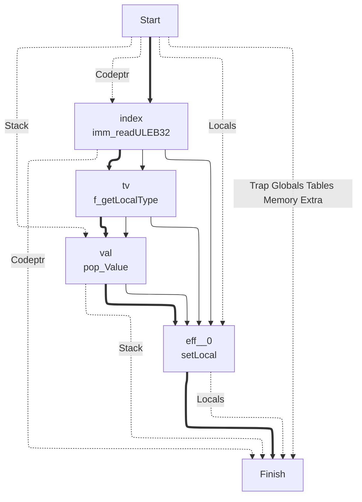

## LOCAL_SET

```mermaid
---
config:
  layout: elk
---
graph TD
	1["
	Finish
	"]
	3 -. Codeptr .-> 1
	7 -. Stack .-> 1
	0 -. Trap Globals Tables Memory Extra .-> 1
	11 -. Locals .-> 1
	11["
	eff__0
	setLocal
	"]
	5 --> 11
	3 --> 11
	7 --> 11
	0 -. Locals .-> 11
	11 ==> 1
	0["
	Start
	"]
	0 ==> 3
	7["
	val
	pop_Value
	"]
	5 --> 7
	0 -. Stack .-> 7
	7 ==> 11
	5["
	tv
	f_getLocalType
	"]
	3 --> 5
	5 ==> 7
	3["
	index
	imm_readULEB32
	"]
	0 -. Codeptr .-> 3
	3 ==> 5
```
