## UNREACHABLE
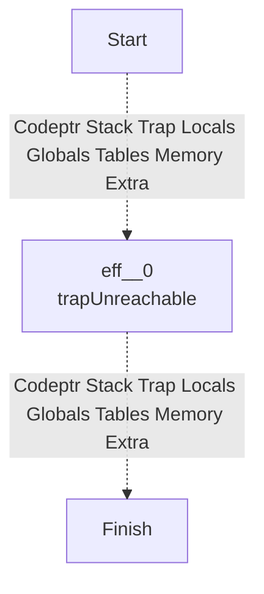
## NOP
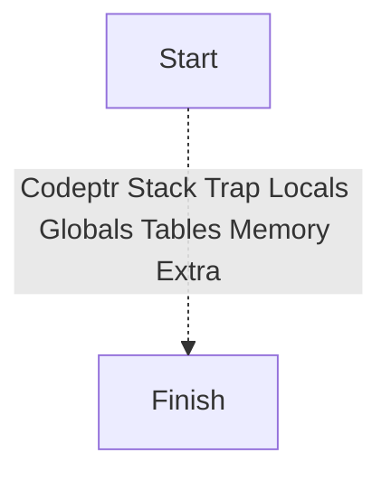
## BLOCK

## LOOP
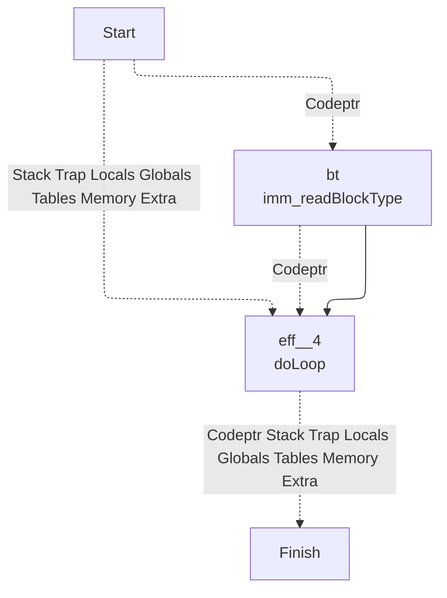
## IF
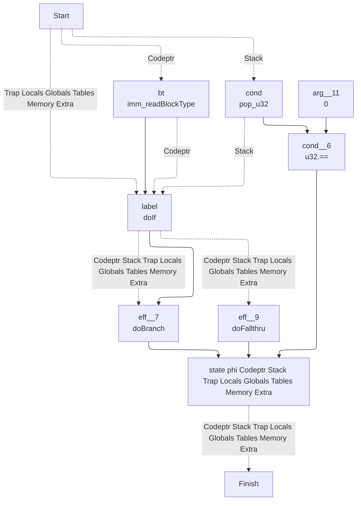
## ELSE
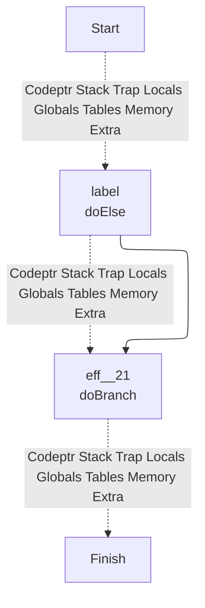
## TRY

## END
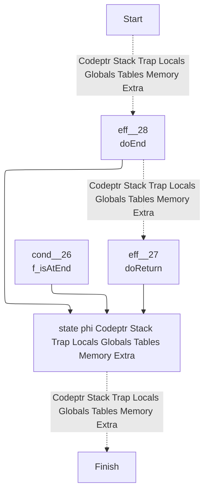
## BR
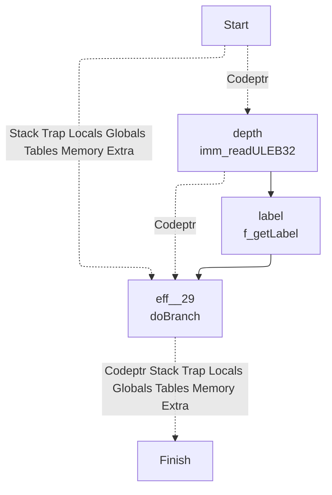
## BR_IF
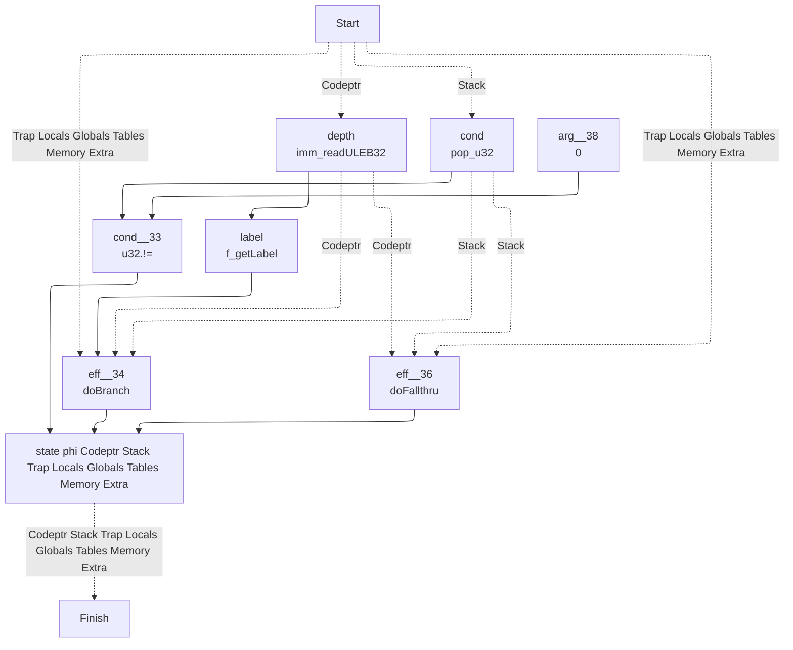
## BR_TABLE
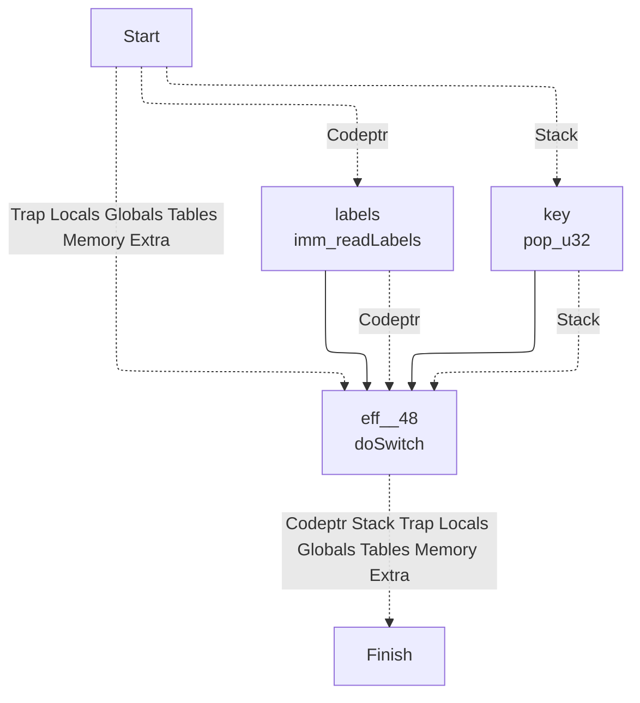
## RETURN
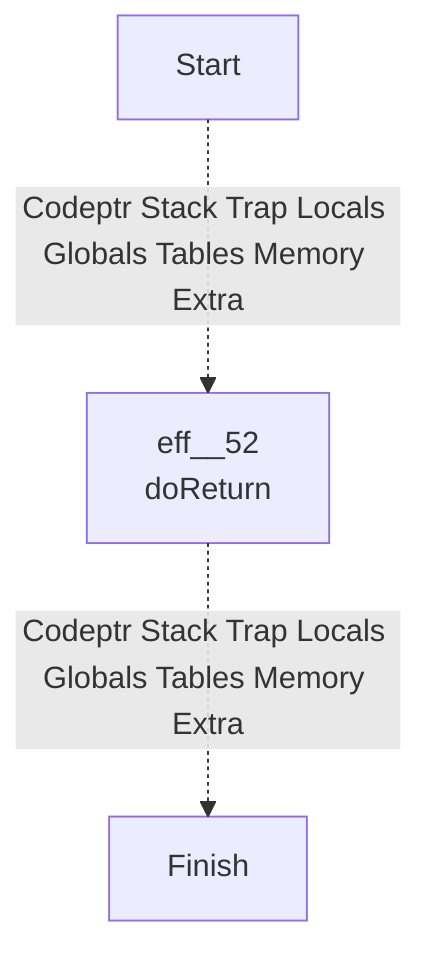
## CALL

## CALL_INDIRECT

## RETURN_CALL
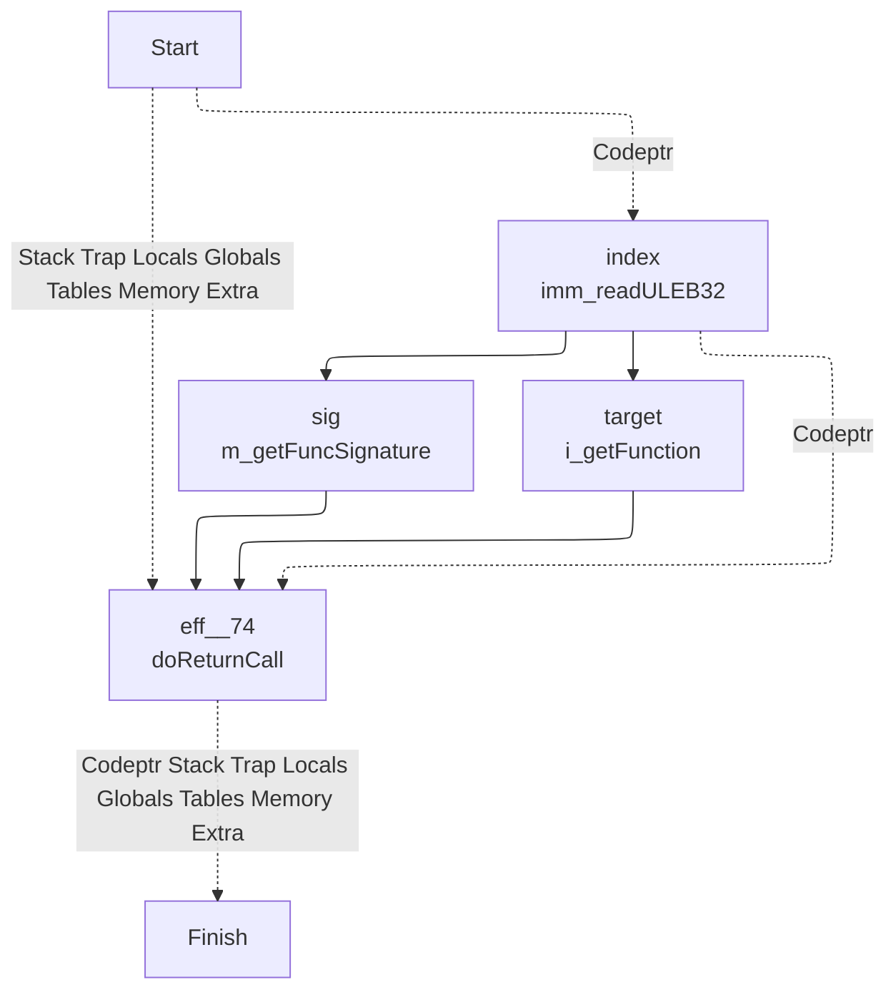
## DROP
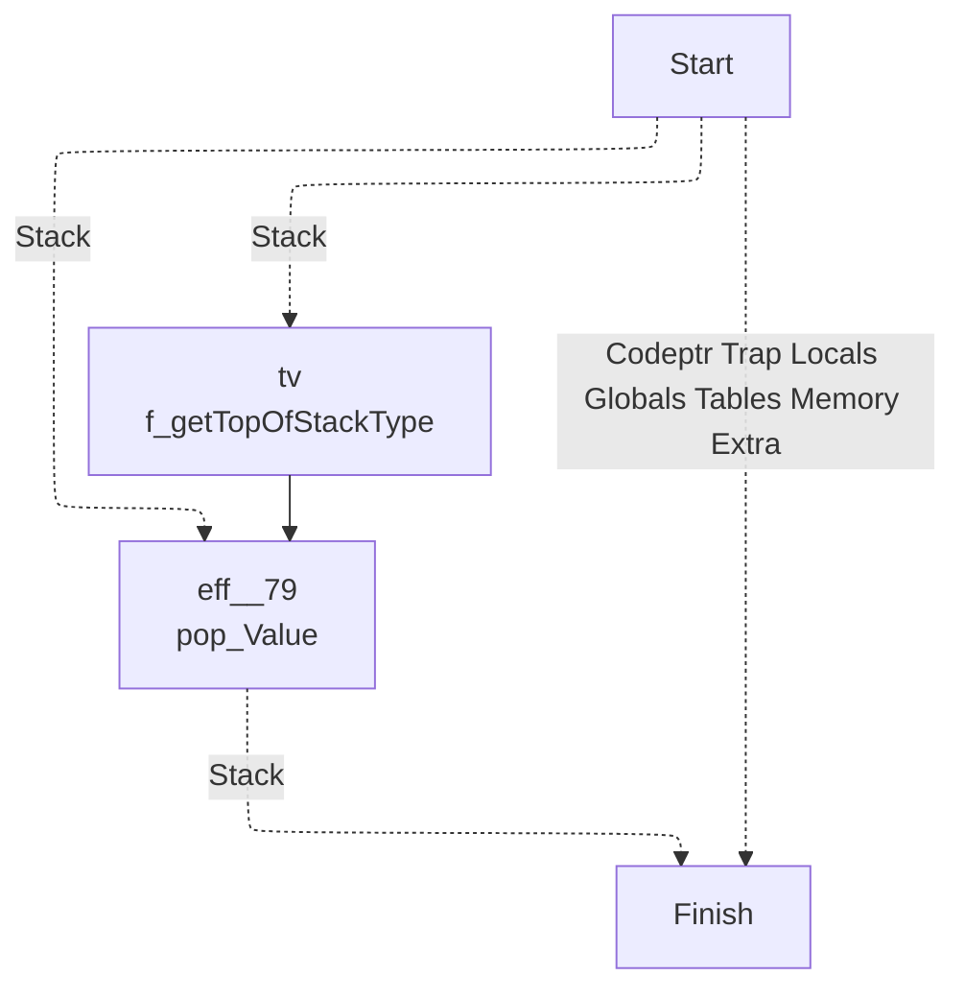
## SELECT
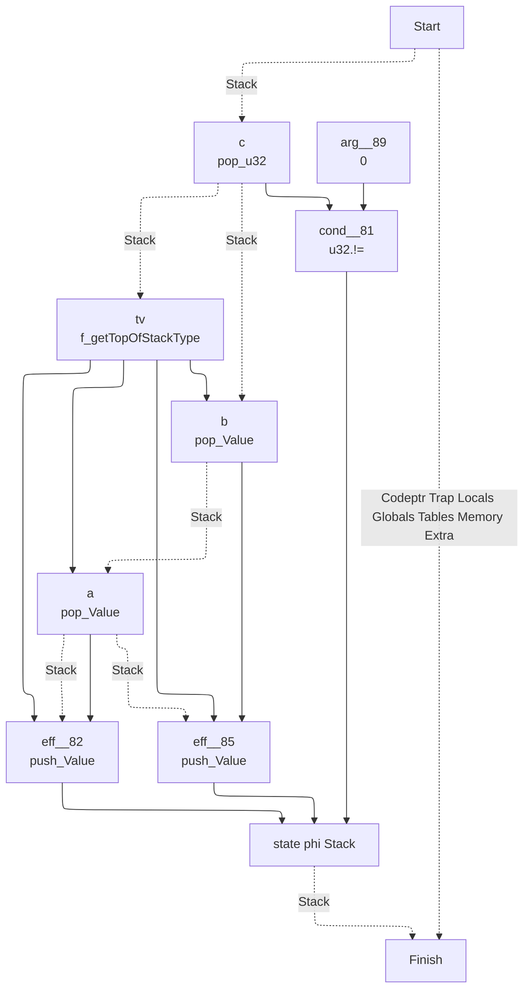
## LOCAL_GET
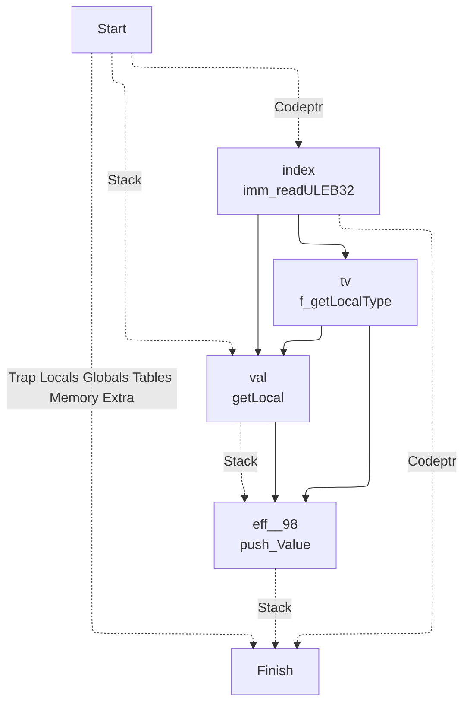
## LOCAL_SET

## LOCAL_TEE

## GLOBAL_GET
```mermaid
---
config:
  layout: elk
---
graph TD
	1["
	Finish
	"]
	3 -. Codeptr .-> 1
	11 -. Stack .-> 1
	0 -. Trap Locals Globals Tables Memory Extra .-> 1
	0["
	Start
	"]
	11["
	eff__119
	push_Value
	"]
	5 --> 11
	8 --> 11
	8 -. Stack .-> 11
	8["
	val
	getGlobal
	"]
	5 --> 8
	3 --> 8
	0 -. Stack .-> 8
	3["
	index
	imm_readULEB32
	"]
	0 -. Codeptr .-> 3
	5["
	tv
	m_getGlobalType
	"]
	3 --> 5
```
## GLOBAL_SET
```mermaid
---
config:
  layout: elk
---
graph TD
	1["
	Finish
	"]
	3 -. Codeptr .-> 1
	7 -. Stack .-> 1
	0 -. Trap Locals Tables Memory Extra .-> 1
	11 -. Globals .-> 1
	11["
	eff__125
	setGlobal
	"]
	5 --> 11
	3 --> 11
	7 --> 11
	0 -. Globals .-> 11
	0["
	Start
	"]
	7["
	val
	pop_Value
	"]
	5 --> 7
	0 -. Stack .-> 7
	5["
	tv
	m_getGlobalType
	"]
	3 --> 5
	3["
	index
	imm_readULEB32
	"]
	0 -. Codeptr .-> 3
```
## TABLE_GET
```mermaid
---
config:
  layout: elk
---
graph TD
	1["
	Finish
	"]
	3 -. Codeptr .-> 1
	18 -. Stack .-> 1
	0 -. Trap Locals Globals Tables Memory Extra .-> 1
	0["
	Start
	"]
	18["
	state phi Stack 	"]
	5 --> 18
	17 --> 18
	11 --> 18
	11["
	eff__136
	push_Object
	"]
	9 --> 11
	6 -. Stack .-> 11
	6["
	index
	pop_u32
	"]
	0 -. Stack .-> 6
	9["
	val
	mach_readTable32
	"]
	3 --> 9
	6 --> 9
	3["
	table_index
	imm_readULEB32
	"]
	0 -. Codeptr .-> 3
	17["
	eff__132
	push_Object
	"]
	15 --> 17
	12 -. Stack .-> 17
	12["
	index
	pop_u64
	"]
	0 -. Stack .-> 12
	15["
	val
	mach_readTable64
	"]
	3 --> 15
	12 --> 15
	5["
	cond__131
	m_isTable64
	"]
	3 --> 5
```
## TABLE_SET
```mermaid
---
config:
  layout: elk
---
graph TD
	1["
	Finish
	"]
	3 -. Codeptr .-> 1
	18 -. Stack .-> 1
	0 -. Trap Locals Globals Tables Memory Extra .-> 1
	0["
	Start
	"]
	18["
	state phi Stack 	"]
	5 --> 18
	13 --> 18
	7 --> 18
	7["
	index
	pop_u32
	"]
	6 -. Stack .-> 7
	6["
	val
	pop_Object
	"]
	0 -. Stack .-> 6
	13["
	index
	pop_u64
	"]
	12 -. Stack .-> 13
	12["
	val
	pop_Object
	"]
	0 -. Stack .-> 12
	5["
	cond__141
	m_isTable64
	"]
	3 --> 5
	3["
	table_index
	imm_readULEB32
	"]
	0 -. Codeptr .-> 3
```
## I32_LOAD
```mermaid
---
config:
  layout: elk
---
graph TD
	1["
	Finish
	"]
	31 -. Codeptr .-> 1
	32 -. Stack .-> 1
	0 -. Trap Locals Globals Tables Memory Extra .-> 1
	0["
	Start
	"]
	32["
	state phi Stack 	"]
	14 --> 32
	30 --> 32
	22 --> 32
	22["
	eff__157
	push_u32
	"]
	20 --> 22
	16 -. Stack .-> 22
	16["
	index
	pop_u32
	"]
	0 -. Stack .-> 16
	20["
	val
	mach_readMemory32_u32
	"]
	11 --> 20
	16 --> 20
	15 --> 20
	15["
	offset
	imm_readULEB32
	"]
	12 -. Codeptr .-> 15
	12["
	state phi Codeptr 	"]
	9 --> 12
	10 --> 12
	3 --> 12
	3["
	flags
	imm_readU8
	"]
	0 -. Codeptr .-> 3
	10["
	memindex__164
	imm_readULEB32
	"]
	3 -. Codeptr .-> 10
	9["
	cond__163
	u8.!=
	"]
	8 --> 9
	5 --> 9
	5["
	arg__166
	0
	"]
	8["
	arg__165
	u8.&
	"]
	3 --> 8
	6 --> 8
	6["
	arg__168
	0x40u8
	"]
	11["
	memindex
	phi
	"]
	9 --> 11
	10 --> 11
	4 --> 11
	4["
	memindex__169
	0u
	"]
	30["
	eff__152
	push_u32
	"]
	28 --> 30
	24 -. Stack .-> 30
	24["
	index
	pop_u64
	"]
	0 -. Stack .-> 24
	28["
	val
	mach_readMemory64_u32
	"]
	11 --> 28
	24 --> 28
	23 --> 28
	23["
	offset
	imm_readULEB64
	"]
	12 -. Codeptr .-> 23
	14["
	cond__151
	m_isMemory64
	"]
	11 --> 14
	31["
	state phi Codeptr 	"]
	14 --> 31
	23 --> 31
	15 --> 31
```
## I64_LOAD
```mermaid
---
config:
  layout: elk
---
graph TD
	1["
	Finish
	"]
	31 -. Codeptr .-> 1
	32 -. Stack .-> 1
	0 -. Trap Locals Globals Tables Memory Extra .-> 1
	0["
	Start
	"]
	32["
	state phi Stack 	"]
	14 --> 32
	30 --> 32
	22 --> 32
	22["
	eff__177
	push_u64
	"]
	20 --> 22
	16 -. Stack .-> 22
	16["
	index
	pop_u32
	"]
	0 -. Stack .-> 16
	20["
	val
	mach_readMemory32_u64
	"]
	11 --> 20
	16 --> 20
	15 --> 20
	15["
	offset
	imm_readULEB32
	"]
	12 -. Codeptr .-> 15
	12["
	state phi Codeptr 	"]
	9 --> 12
	10 --> 12
	3 --> 12
	3["
	flags
	imm_readU8
	"]
	0 -. Codeptr .-> 3
	10["
	memindex__184
	imm_readULEB32
	"]
	3 -. Codeptr .-> 10
	9["
	cond__183
	u8.!=
	"]
	8 --> 9
	5 --> 9
	5["
	arg__186
	0
	"]
	8["
	arg__185
	u8.&
	"]
	3 --> 8
	6 --> 8
	6["
	arg__188
	0x40u8
	"]
	11["
	memindex
	phi
	"]
	9 --> 11
	10 --> 11
	4 --> 11
	4["
	memindex__189
	0u
	"]
	30["
	eff__172
	push_u64
	"]
	28 --> 30
	24 -. Stack .-> 30
	24["
	index
	pop_u64
	"]
	0 -. Stack .-> 24
	28["
	val
	mach_readMemory64_u64
	"]
	11 --> 28
	24 --> 28
	23 --> 28
	23["
	offset
	imm_readULEB64
	"]
	12 -. Codeptr .-> 23
	14["
	cond__171
	m_isMemory64
	"]
	11 --> 14
	31["
	state phi Codeptr 	"]
	14 --> 31
	23 --> 31
	15 --> 31
```
## F32_LOAD
```mermaid
---
config:
  layout: elk
---
graph TD
	1["
	Finish
	"]
	31 -. Codeptr .-> 1
	32 -. Stack .-> 1
	0 -. Trap Locals Globals Tables Memory Extra .-> 1
	0["
	Start
	"]
	32["
	state phi Stack 	"]
	14 --> 32
	30 --> 32
	22 --> 32
	22["
	eff__197
	push_f32
	"]
	20 --> 22
	16 -. Stack .-> 22
	16["
	index
	pop_u32
	"]
	0 -. Stack .-> 16
	20["
	val
	mach_readMemory32_f32
	"]
	11 --> 20
	16 --> 20
	15 --> 20
	15["
	offset
	imm_readULEB32
	"]
	12 -. Codeptr .-> 15
	12["
	state phi Codeptr 	"]
	9 --> 12
	10 --> 12
	3 --> 12
	3["
	flags
	imm_readU8
	"]
	0 -. Codeptr .-> 3
	10["
	memindex__204
	imm_readULEB32
	"]
	3 -. Codeptr .-> 10
	9["
	cond__203
	u8.!=
	"]
	8 --> 9
	5 --> 9
	5["
	arg__206
	0
	"]
	8["
	arg__205
	u8.&
	"]
	3 --> 8
	6 --> 8
	6["
	arg__208
	0x40u8
	"]
	11["
	memindex
	phi
	"]
	9 --> 11
	10 --> 11
	4 --> 11
	4["
	memindex__209
	0u
	"]
	30["
	eff__192
	push_f32
	"]
	28 --> 30
	24 -. Stack .-> 30
	24["
	index
	pop_u64
	"]
	0 -. Stack .-> 24
	28["
	val
	mach_readMemory64_f32
	"]
	11 --> 28
	24 --> 28
	23 --> 28
	23["
	offset
	imm_readULEB64
	"]
	12 -. Codeptr .-> 23
	14["
	cond__191
	m_isMemory64
	"]
	11 --> 14
	31["
	state phi Codeptr 	"]
	14 --> 31
	23 --> 31
	15 --> 31
```
## F64_LOAD
```mermaid
---
config:
  layout: elk
---
graph TD
	1["
	Finish
	"]
	31 -. Codeptr .-> 1
	32 -. Stack .-> 1
	0 -. Trap Locals Globals Tables Memory Extra .-> 1
	0["
	Start
	"]
	32["
	state phi Stack 	"]
	14 --> 32
	30 --> 32
	22 --> 32
	22["
	eff__217
	push_f64
	"]
	20 --> 22
	16 -. Stack .-> 22
	16["
	index
	pop_u32
	"]
	0 -. Stack .-> 16
	20["
	val
	mach_readMemory32_f64
	"]
	11 --> 20
	16 --> 20
	15 --> 20
	15["
	offset
	imm_readULEB32
	"]
	12 -. Codeptr .-> 15
	12["
	state phi Codeptr 	"]
	9 --> 12
	10 --> 12
	3 --> 12
	3["
	flags
	imm_readU8
	"]
	0 -. Codeptr .-> 3
	10["
	memindex__224
	imm_readULEB32
	"]
	3 -. Codeptr .-> 10
	9["
	cond__223
	u8.!=
	"]
	8 --> 9
	5 --> 9
	5["
	arg__226
	0
	"]
	8["
	arg__225
	u8.&
	"]
	3 --> 8
	6 --> 8
	6["
	arg__228
	0x40u8
	"]
	11["
	memindex
	phi
	"]
	9 --> 11
	10 --> 11
	4 --> 11
	4["
	memindex__229
	0u
	"]
	30["
	eff__212
	push_f64
	"]
	28 --> 30
	24 -. Stack .-> 30
	24["
	index
	pop_u64
	"]
	0 -. Stack .-> 24
	28["
	val
	mach_readMemory64_f64
	"]
	11 --> 28
	24 --> 28
	23 --> 28
	23["
	offset
	imm_readULEB64
	"]
	12 -. Codeptr .-> 23
	14["
	cond__211
	m_isMemory64
	"]
	11 --> 14
	31["
	state phi Codeptr 	"]
	14 --> 31
	23 --> 31
	15 --> 31
```
## I32_LOAD8_S
```mermaid
---
config:
  layout: elk
---
graph TD
	1["
	Finish
	"]
	35 -. Codeptr .-> 1
	36 -. Stack .-> 1
	0 -. Trap Locals Globals Tables Memory Extra .-> 1
	0["
	Start
	"]
	36["
	state phi Stack 	"]
	14 --> 36
	34 --> 36
	24 --> 36
	24["
	eff__238
	push_u32
	"]
	22 --> 24
	16 -. Stack .-> 24
	16["
	index
	pop_u32
	"]
	0 -. Stack .-> 16
	22["
	extend
	U32_extend8_s
	"]
	20 --> 22
	20["
	val
	mach_readMemory32_u8
	"]
	11 --> 20
	16 --> 20
	15 --> 20
	15["
	offset
	imm_readULEB32
	"]
	12 -. Codeptr .-> 15
	12["
	state phi Codeptr 	"]
	9 --> 12
	10 --> 12
	3 --> 12
	3["
	flags
	imm_readU8
	"]
	0 -. Codeptr .-> 3
	10["
	memindex__246
	imm_readULEB32
	"]
	3 -. Codeptr .-> 10
	9["
	cond__245
	u8.!=
	"]
	8 --> 9
	5 --> 9
	5["
	arg__248
	0
	"]
	8["
	arg__247
	u8.&
	"]
	3 --> 8
	6 --> 8
	6["
	arg__250
	0x40u8
	"]
	11["
	memindex
	phi
	"]
	9 --> 11
	10 --> 11
	4 --> 11
	4["
	memindex__251
	0u
	"]
	34["
	eff__232
	push_u32
	"]
	32 --> 34
	26 -. Stack .-> 34
	26["
	index
	pop_u64
	"]
	0 -. Stack .-> 26
	32["
	extend
	U32_extend8_s
	"]
	30 --> 32
	30["
	val
	mach_readMemory64_u8
	"]
	11 --> 30
	26 --> 30
	25 --> 30
	25["
	offset
	imm_readULEB64
	"]
	12 -. Codeptr .-> 25
	14["
	cond__231
	m_isMemory64
	"]
	11 --> 14
	35["
	state phi Codeptr 	"]
	14 --> 35
	25 --> 35
	15 --> 35
```
## I32_LOAD8_U
```mermaid
---
config:
  layout: elk
---
graph TD
	1["
	Finish
	"]
	31 -. Codeptr .-> 1
	32 -. Stack .-> 1
	0 -. Trap Locals Globals Tables Memory Extra .-> 1
	0["
	Start
	"]
	32["
	state phi Stack 	"]
	14 --> 32
	30 --> 32
	22 --> 32
	22["
	eff__259
	push_u32
	"]
	20 --> 22
	16 -. Stack .-> 22
	16["
	index
	pop_u32
	"]
	0 -. Stack .-> 16
	20["
	val
	mach_readMemory32_u8
	"]
	11 --> 20
	16 --> 20
	15 --> 20
	15["
	offset
	imm_readULEB32
	"]
	12 -. Codeptr .-> 15
	12["
	state phi Codeptr 	"]
	9 --> 12
	10 --> 12
	3 --> 12
	3["
	flags
	imm_readU8
	"]
	0 -. Codeptr .-> 3
	10["
	memindex__266
	imm_readULEB32
	"]
	3 -. Codeptr .-> 10
	9["
	cond__265
	u8.!=
	"]
	8 --> 9
	5 --> 9
	5["
	arg__268
	0
	"]
	8["
	arg__267
	u8.&
	"]
	3 --> 8
	6 --> 8
	6["
	arg__270
	0x40u8
	"]
	11["
	memindex
	phi
	"]
	9 --> 11
	10 --> 11
	4 --> 11
	4["
	memindex__271
	0u
	"]
	30["
	eff__254
	push_u32
	"]
	28 --> 30
	24 -. Stack .-> 30
	24["
	index
	pop_u64
	"]
	0 -. Stack .-> 24
	28["
	val
	mach_readMemory64_u8
	"]
	11 --> 28
	24 --> 28
	23 --> 28
	23["
	offset
	imm_readULEB64
	"]
	12 -. Codeptr .-> 23
	14["
	cond__253
	m_isMemory64
	"]
	11 --> 14
	31["
	state phi Codeptr 	"]
	14 --> 31
	23 --> 31
	15 --> 31
```
## I32_LOAD16_S
```mermaid
---
config:
  layout: elk
---
graph TD
	1["
	Finish
	"]
	35 -. Codeptr .-> 1
	36 -. Stack .-> 1
	0 -. Trap Locals Globals Tables Memory Extra .-> 1
	0["
	Start
	"]
	36["
	state phi Stack 	"]
	14 --> 36
	34 --> 36
	24 --> 36
	24["
	eff__280
	push_u32
	"]
	22 --> 24
	16 -. Stack .-> 24
	16["
	index
	pop_u32
	"]
	0 -. Stack .-> 16
	22["
	extend
	U32_extend16_s
	"]
	20 --> 22
	20["
	val
	mach_readMemory32_u16
	"]
	11 --> 20
	16 --> 20
	15 --> 20
	15["
	offset
	imm_readULEB32
	"]
	12 -. Codeptr .-> 15
	12["
	state phi Codeptr 	"]
	9 --> 12
	10 --> 12
	3 --> 12
	3["
	flags
	imm_readU8
	"]
	0 -. Codeptr .-> 3
	10["
	memindex__288
	imm_readULEB32
	"]
	3 -. Codeptr .-> 10
	9["
	cond__287
	u8.!=
	"]
	8 --> 9
	5 --> 9
	5["
	arg__290
	0
	"]
	8["
	arg__289
	u8.&
	"]
	3 --> 8
	6 --> 8
	6["
	arg__292
	0x40u8
	"]
	11["
	memindex
	phi
	"]
	9 --> 11
	10 --> 11
	4 --> 11
	4["
	memindex__293
	0u
	"]
	34["
	eff__274
	push_u32
	"]
	32 --> 34
	26 -. Stack .-> 34
	26["
	index
	pop_u64
	"]
	0 -. Stack .-> 26
	32["
	extend
	U32_extend16_s
	"]
	30 --> 32
	30["
	val
	mach_readMemory64_u16
	"]
	11 --> 30
	26 --> 30
	25 --> 30
	25["
	offset
	imm_readULEB64
	"]
	12 -. Codeptr .-> 25
	14["
	cond__273
	m_isMemory64
	"]
	11 --> 14
	35["
	state phi Codeptr 	"]
	14 --> 35
	25 --> 35
	15 --> 35
```
## I32_LOAD16_U
```mermaid
---
config:
  layout: elk
---
graph TD
	1["
	Finish
	"]
	31 -. Codeptr .-> 1
	32 -. Stack .-> 1
	0 -. Trap Locals Globals Tables Memory Extra .-> 1
	0["
	Start
	"]
	32["
	state phi Stack 	"]
	14 --> 32
	30 --> 32
	22 --> 32
	22["
	eff__301
	push_u32
	"]
	20 --> 22
	16 -. Stack .-> 22
	16["
	index
	pop_u32
	"]
	0 -. Stack .-> 16
	20["
	val
	mach_readMemory32_u16
	"]
	11 --> 20
	16 --> 20
	15 --> 20
	15["
	offset
	imm_readULEB32
	"]
	12 -. Codeptr .-> 15
	12["
	state phi Codeptr 	"]
	9 --> 12
	10 --> 12
	3 --> 12
	3["
	flags
	imm_readU8
	"]
	0 -. Codeptr .-> 3
	10["
	memindex__308
	imm_readULEB32
	"]
	3 -. Codeptr .-> 10
	9["
	cond__307
	u8.!=
	"]
	8 --> 9
	5 --> 9
	5["
	arg__310
	0
	"]
	8["
	arg__309
	u8.&
	"]
	3 --> 8
	6 --> 8
	6["
	arg__312
	0x40u8
	"]
	11["
	memindex
	phi
	"]
	9 --> 11
	10 --> 11
	4 --> 11
	4["
	memindex__313
	0u
	"]
	30["
	eff__296
	push_u32
	"]
	28 --> 30
	24 -. Stack .-> 30
	24["
	index
	pop_u64
	"]
	0 -. Stack .-> 24
	28["
	val
	mach_readMemory64_u16
	"]
	11 --> 28
	24 --> 28
	23 --> 28
	23["
	offset
	imm_readULEB64
	"]
	12 -. Codeptr .-> 23
	14["
	cond__295
	m_isMemory64
	"]
	11 --> 14
	31["
	state phi Codeptr 	"]
	14 --> 31
	23 --> 31
	15 --> 31
```
## I64_LOAD8_S
```mermaid
---
config:
  layout: elk
---
graph TD
	1["
	Finish
	"]
	35 -. Codeptr .-> 1
	36 -. Stack .-> 1
	0 -. Trap Locals Globals Tables Memory Extra .-> 1
	0["
	Start
	"]
	36["
	state phi Stack 	"]
	14 --> 36
	34 --> 36
	24 --> 36
	24["
	eff__322
	push_u64
	"]
	22 --> 24
	16 -. Stack .-> 24
	16["
	index
	pop_u32
	"]
	0 -. Stack .-> 16
	22["
	extend
	U64_extend8_s
	"]
	20 --> 22
	20["
	val
	mach_readMemory32_u8_64
	"]
	11 --> 20
	16 --> 20
	15 --> 20
	15["
	offset
	imm_readULEB32
	"]
	12 -. Codeptr .-> 15
	12["
	state phi Codeptr 	"]
	9 --> 12
	10 --> 12
	3 --> 12
	3["
	flags
	imm_readU8
	"]
	0 -. Codeptr .-> 3
	10["
	memindex__330
	imm_readULEB32
	"]
	3 -. Codeptr .-> 10
	9["
	cond__329
	u8.!=
	"]
	8 --> 9
	5 --> 9
	5["
	arg__332
	0
	"]
	8["
	arg__331
	u8.&
	"]
	3 --> 8
	6 --> 8
	6["
	arg__334
	0x40u8
	"]
	11["
	memindex
	phi
	"]
	9 --> 11
	10 --> 11
	4 --> 11
	4["
	memindex__335
	0u
	"]
	34["
	eff__316
	push_u64
	"]
	32 --> 34
	26 -. Stack .-> 34
	26["
	index
	pop_u64
	"]
	0 -. Stack .-> 26
	32["
	extend
	U64_extend8_s
	"]
	30 --> 32
	30["
	val
	mach_readMemory64_u8_64
	"]
	11 --> 30
	26 --> 30
	25 --> 30
	25["
	offset
	imm_readULEB64
	"]
	12 -. Codeptr .-> 25
	14["
	cond__315
	m_isMemory64
	"]
	11 --> 14
	35["
	state phi Codeptr 	"]
	14 --> 35
	25 --> 35
	15 --> 35
```
## I64_LOAD8_U
```mermaid
---
config:
  layout: elk
---
graph TD
	1["
	Finish
	"]
	31 -. Codeptr .-> 1
	32 -. Stack .-> 1
	0 -. Trap Locals Globals Tables Memory Extra .-> 1
	0["
	Start
	"]
	32["
	state phi Stack 	"]
	14 --> 32
	30 --> 32
	22 --> 32
	22["
	eff__343
	push_u64
	"]
	20 --> 22
	16 -. Stack .-> 22
	16["
	index
	pop_u32
	"]
	0 -. Stack .-> 16
	20["
	val
	mach_readMemory32_u8_64
	"]
	11 --> 20
	16 --> 20
	15 --> 20
	15["
	offset
	imm_readULEB32
	"]
	12 -. Codeptr .-> 15
	12["
	state phi Codeptr 	"]
	9 --> 12
	10 --> 12
	3 --> 12
	3["
	flags
	imm_readU8
	"]
	0 -. Codeptr .-> 3
	10["
	memindex__350
	imm_readULEB32
	"]
	3 -. Codeptr .-> 10
	9["
	cond__349
	u8.!=
	"]
	8 --> 9
	5 --> 9
	5["
	arg__352
	0
	"]
	8["
	arg__351
	u8.&
	"]
	3 --> 8
	6 --> 8
	6["
	arg__354
	0x40u8
	"]
	11["
	memindex
	phi
	"]
	9 --> 11
	10 --> 11
	4 --> 11
	4["
	memindex__355
	0u
	"]
	30["
	eff__338
	push_u64
	"]
	28 --> 30
	24 -. Stack .-> 30
	24["
	index
	pop_u64
	"]
	0 -. Stack .-> 24
	28["
	val
	mach_readMemory64_u8_64
	"]
	11 --> 28
	24 --> 28
	23 --> 28
	23["
	offset
	imm_readULEB64
	"]
	12 -. Codeptr .-> 23
	14["
	cond__337
	m_isMemory64
	"]
	11 --> 14
	31["
	state phi Codeptr 	"]
	14 --> 31
	23 --> 31
	15 --> 31
```
## I64_LOAD16_S
```mermaid
---
config:
  layout: elk
---
graph TD
	1["
	Finish
	"]
	35 -. Codeptr .-> 1
	36 -. Stack .-> 1
	0 -. Trap Locals Globals Tables Memory Extra .-> 1
	0["
	Start
	"]
	36["
	state phi Stack 	"]
	14 --> 36
	34 --> 36
	24 --> 36
	24["
	eff__364
	push_u64
	"]
	22 --> 24
	16 -. Stack .-> 24
	16["
	index
	pop_u32
	"]
	0 -. Stack .-> 16
	22["
	extend
	U64_extend16_s
	"]
	20 --> 22
	20["
	val
	mach_readMemory32_u16_64
	"]
	11 --> 20
	16 --> 20
	15 --> 20
	15["
	offset
	imm_readULEB32
	"]
	12 -. Codeptr .-> 15
	12["
	state phi Codeptr 	"]
	9 --> 12
	10 --> 12
	3 --> 12
	3["
	flags
	imm_readU8
	"]
	0 -. Codeptr .-> 3
	10["
	memindex__372
	imm_readULEB32
	"]
	3 -. Codeptr .-> 10
	9["
	cond__371
	u8.!=
	"]
	8 --> 9
	5 --> 9
	5["
	arg__374
	0
	"]
	8["
	arg__373
	u8.&
	"]
	3 --> 8
	6 --> 8
	6["
	arg__376
	0x40u8
	"]
	11["
	memindex
	phi
	"]
	9 --> 11
	10 --> 11
	4 --> 11
	4["
	memindex__377
	0u
	"]
	34["
	eff__358
	push_u64
	"]
	32 --> 34
	26 -. Stack .-> 34
	26["
	index
	pop_u64
	"]
	0 -. Stack .-> 26
	32["
	extend
	U64_extend16_s
	"]
	30 --> 32
	30["
	val
	mach_readMemory64_u16_64
	"]
	11 --> 30
	26 --> 30
	25 --> 30
	25["
	offset
	imm_readULEB64
	"]
	12 -. Codeptr .-> 25
	14["
	cond__357
	m_isMemory64
	"]
	11 --> 14
	35["
	state phi Codeptr 	"]
	14 --> 35
	25 --> 35
	15 --> 35
```
## I64_LOAD16_U
```mermaid
---
config:
  layout: elk
---
graph TD
	1["
	Finish
	"]
	31 -. Codeptr .-> 1
	32 -. Stack .-> 1
	0 -. Trap Locals Globals Tables Memory Extra .-> 1
	0["
	Start
	"]
	32["
	state phi Stack 	"]
	14 --> 32
	30 --> 32
	22 --> 32
	22["
	eff__385
	push_u64
	"]
	20 --> 22
	16 -. Stack .-> 22
	16["
	index
	pop_u32
	"]
	0 -. Stack .-> 16
	20["
	val
	mach_readMemory32_u16_64
	"]
	11 --> 20
	16 --> 20
	15 --> 20
	15["
	offset
	imm_readULEB32
	"]
	12 -. Codeptr .-> 15
	12["
	state phi Codeptr 	"]
	9 --> 12
	10 --> 12
	3 --> 12
	3["
	flags
	imm_readU8
	"]
	0 -. Codeptr .-> 3
	10["
	memindex__392
	imm_readULEB32
	"]
	3 -. Codeptr .-> 10
	9["
	cond__391
	u8.!=
	"]
	8 --> 9
	5 --> 9
	5["
	arg__394
	0
	"]
	8["
	arg__393
	u8.&
	"]
	3 --> 8
	6 --> 8
	6["
	arg__396
	0x40u8
	"]
	11["
	memindex
	phi
	"]
	9 --> 11
	10 --> 11
	4 --> 11
	4["
	memindex__397
	0u
	"]
	30["
	eff__380
	push_u64
	"]
	28 --> 30
	24 -. Stack .-> 30
	24["
	index
	pop_u64
	"]
	0 -. Stack .-> 24
	28["
	val
	mach_readMemory64_u16_64
	"]
	11 --> 28
	24 --> 28
	23 --> 28
	23["
	offset
	imm_readULEB64
	"]
	12 -. Codeptr .-> 23
	14["
	cond__379
	m_isMemory64
	"]
	11 --> 14
	31["
	state phi Codeptr 	"]
	14 --> 31
	23 --> 31
	15 --> 31
```
## I64_LOAD32_S
```mermaid
---
config:
  layout: elk
---
graph TD
	1["
	Finish
	"]
	35 -. Codeptr .-> 1
	36 -. Stack .-> 1
	0 -. Trap Locals Globals Tables Memory Extra .-> 1
	0["
	Start
	"]
	36["
	state phi Stack 	"]
	14 --> 36
	34 --> 36
	24 --> 36
	24["
	eff__406
	push_u64
	"]
	22 --> 24
	16 -. Stack .-> 24
	16["
	index
	pop_u32
	"]
	0 -. Stack .-> 16
	22["
	extend
	U64_extend32_s
	"]
	20 --> 22
	20["
	val
	mach_readMemory32_u32_64
	"]
	11 --> 20
	16 --> 20
	15 --> 20
	15["
	offset
	imm_readULEB32
	"]
	12 -. Codeptr .-> 15
	12["
	state phi Codeptr 	"]
	9 --> 12
	10 --> 12
	3 --> 12
	3["
	flags
	imm_readU8
	"]
	0 -. Codeptr .-> 3
	10["
	memindex__414
	imm_readULEB32
	"]
	3 -. Codeptr .-> 10
	9["
	cond__413
	u8.!=
	"]
	8 --> 9
	5 --> 9
	5["
	arg__416
	0
	"]
	8["
	arg__415
	u8.&
	"]
	3 --> 8
	6 --> 8
	6["
	arg__418
	0x40u8
	"]
	11["
	memindex
	phi
	"]
	9 --> 11
	10 --> 11
	4 --> 11
	4["
	memindex__419
	0u
	"]
	34["
	eff__400
	push_u64
	"]
	32 --> 34
	26 -. Stack .-> 34
	26["
	index
	pop_u64
	"]
	0 -. Stack .-> 26
	32["
	extend
	U64_extend32_s
	"]
	30 --> 32
	30["
	val
	mach_readMemory64_u32_64
	"]
	11 --> 30
	26 --> 30
	25 --> 30
	25["
	offset
	imm_readULEB64
	"]
	12 -. Codeptr .-> 25
	14["
	cond__399
	m_isMemory64
	"]
	11 --> 14
	35["
	state phi Codeptr 	"]
	14 --> 35
	25 --> 35
	15 --> 35
```
## I64_LOAD32_U
```mermaid
---
config:
  layout: elk
---
graph TD
	1["
	Finish
	"]
	31 -. Codeptr .-> 1
	32 -. Stack .-> 1
	0 -. Trap Locals Globals Tables Memory Extra .-> 1
	0["
	Start
	"]
	32["
	state phi Stack 	"]
	14 --> 32
	30 --> 32
	22 --> 32
	22["
	eff__427
	push_u64
	"]
	20 --> 22
	16 -. Stack .-> 22
	16["
	index
	pop_u32
	"]
	0 -. Stack .-> 16
	20["
	val
	mach_readMemory32_u32_64
	"]
	11 --> 20
	16 --> 20
	15 --> 20
	15["
	offset
	imm_readULEB32
	"]
	12 -. Codeptr .-> 15
	12["
	state phi Codeptr 	"]
	9 --> 12
	10 --> 12
	3 --> 12
	3["
	flags
	imm_readU8
	"]
	0 -. Codeptr .-> 3
	10["
	memindex__434
	imm_readULEB32
	"]
	3 -. Codeptr .-> 10
	9["
	cond__433
	u8.!=
	"]
	8 --> 9
	5 --> 9
	5["
	arg__436
	0
	"]
	8["
	arg__435
	u8.&
	"]
	3 --> 8
	6 --> 8
	6["
	arg__438
	0x40u8
	"]
	11["
	memindex
	phi
	"]
	9 --> 11
	10 --> 11
	4 --> 11
	4["
	memindex__439
	0u
	"]
	30["
	eff__422
	push_u64
	"]
	28 --> 30
	24 -. Stack .-> 30
	24["
	index
	pop_u64
	"]
	0 -. Stack .-> 24
	28["
	val
	mach_readMemory64_u32_64
	"]
	11 --> 28
	24 --> 28
	23 --> 28
	23["
	offset
	imm_readULEB64
	"]
	12 -. Codeptr .-> 23
	14["
	cond__421
	m_isMemory64
	"]
	11 --> 14
	31["
	state phi Codeptr 	"]
	14 --> 31
	23 --> 31
	15 --> 31
```
## I32_STORE
```mermaid
---
config:
  layout: elk
---
graph TD
	1["
	Finish
	"]
	30 -. Codeptr .-> 1
	31 -. Stack .-> 1
	0 -. Trap Locals Globals Tables Extra .-> 1
	32 -. Memory .-> 1
	32["
	state phi Memory 	"]
	15 --> 32
	29 --> 32
	22 --> 32
	22["
	eff__447
	mach_writeMemory32_u32
	"]
	11 --> 22
	17 --> 22
	16 --> 22
	13 --> 22
	0 -. Memory .-> 22
	0["
	Start
	"]
	13["
	val
	pop_u32
	"]
	0 -. Stack .-> 13
	16["
	offset
	imm_readULEB32
	"]
	12 -. Codeptr .-> 16
	12["
	state phi Codeptr 	"]
	9 --> 12
	10 --> 12
	3 --> 12
	3["
	flags
	imm_readU8
	"]
	0 -. Codeptr .-> 3
	10["
	memindex__454
	imm_readULEB32
	"]
	3 -. Codeptr .-> 10
	9["
	cond__453
	u8.!=
	"]
	8 --> 9
	5 --> 9
	5["
	arg__456
	0
	"]
	8["
	arg__455
	u8.&
	"]
	3 --> 8
	6 --> 8
	6["
	arg__458
	0x40u8
	"]
	17["
	index
	pop_u32
	"]
	13 -. Stack .-> 17
	11["
	memindex
	phi
	"]
	9 --> 11
	10 --> 11
	4 --> 11
	4["
	memindex__459
	0u
	"]
	29["
	eff__442
	mach_writeMemory64_u32
	"]
	11 --> 29
	24 --> 29
	23 --> 29
	13 --> 29
	0 -. Memory .-> 29
	23["
	offset
	imm_readULEB64
	"]
	12 -. Codeptr .-> 23
	24["
	index
	pop_u64
	"]
	13 -. Stack .-> 24
	15["
	cond__441
	m_isMemory64
	"]
	11 --> 15
	31["
	state phi Stack 	"]
	15 --> 31
	24 --> 31
	17 --> 31
	30["
	state phi Codeptr 	"]
	15 --> 30
	23 --> 30
	16 --> 30
```
## I64_STORE
```mermaid
---
config:
  layout: elk
---
graph TD
	1["
	Finish
	"]
	30 -. Codeptr .-> 1
	31 -. Stack .-> 1
	0 -. Trap Locals Globals Tables Extra .-> 1
	32 -. Memory .-> 1
	32["
	state phi Memory 	"]
	15 --> 32
	29 --> 32
	22 --> 32
	22["
	eff__467
	mach_writeMemory32_u64
	"]
	11 --> 22
	17 --> 22
	16 --> 22
	13 --> 22
	0 -. Memory .-> 22
	0["
	Start
	"]
	13["
	val
	pop_u64
	"]
	0 -. Stack .-> 13
	16["
	offset
	imm_readULEB32
	"]
	12 -. Codeptr .-> 16
	12["
	state phi Codeptr 	"]
	9 --> 12
	10 --> 12
	3 --> 12
	3["
	flags
	imm_readU8
	"]
	0 -. Codeptr .-> 3
	10["
	memindex__474
	imm_readULEB32
	"]
	3 -. Codeptr .-> 10
	9["
	cond__473
	u8.!=
	"]
	8 --> 9
	5 --> 9
	5["
	arg__476
	0
	"]
	8["
	arg__475
	u8.&
	"]
	3 --> 8
	6 --> 8
	6["
	arg__478
	0x40u8
	"]
	17["
	index
	pop_u32
	"]
	13 -. Stack .-> 17
	11["
	memindex
	phi
	"]
	9 --> 11
	10 --> 11
	4 --> 11
	4["
	memindex__479
	0u
	"]
	29["
	eff__462
	mach_writeMemory64_u64
	"]
	11 --> 29
	24 --> 29
	23 --> 29
	13 --> 29
	0 -. Memory .-> 29
	23["
	offset
	imm_readULEB64
	"]
	12 -. Codeptr .-> 23
	24["
	index
	pop_u64
	"]
	13 -. Stack .-> 24
	15["
	cond__461
	m_isMemory64
	"]
	11 --> 15
	31["
	state phi Stack 	"]
	15 --> 31
	24 --> 31
	17 --> 31
	30["
	state phi Codeptr 	"]
	15 --> 30
	23 --> 30
	16 --> 30
```
## F32_STORE
```mermaid
---
config:
  layout: elk
---
graph TD
	1["
	Finish
	"]
	30 -. Codeptr .-> 1
	31 -. Stack .-> 1
	0 -. Trap Locals Globals Tables Memory Extra .-> 1
	0["
	Start
	"]
	31["
	state phi Stack 	"]
	15 --> 31
	24 --> 31
	17 --> 31
	17["
	index
	pop_u32
	"]
	13 -. Stack .-> 17
	13["
	val
	pop_f32
	"]
	0 -. Stack .-> 13
	24["
	index
	pop_u64
	"]
	13 -. Stack .-> 24
	15["
	cond__481
	m_isMemory64
	"]
	11 --> 15
	11["
	memindex
	phi
	"]
	9 --> 11
	10 --> 11
	4 --> 11
	4["
	memindex__499
	0u
	"]
	10["
	memindex__494
	imm_readULEB32
	"]
	3 -. Codeptr .-> 10
	3["
	flags
	imm_readU8
	"]
	0 -. Codeptr .-> 3
	9["
	cond__493
	u8.!=
	"]
	8 --> 9
	5 --> 9
	5["
	arg__496
	0
	"]
	8["
	arg__495
	u8.&
	"]
	3 --> 8
	6 --> 8
	6["
	arg__498
	0x40u8
	"]
	30["
	state phi Codeptr 	"]
	15 --> 30
	23 --> 30
	16 --> 30
	16["
	offset
	imm_readULEB32
	"]
	12 -. Codeptr .-> 16
	12["
	state phi Codeptr 	"]
	9 --> 12
	10 --> 12
	3 --> 12
	23["
	offset
	imm_readULEB64
	"]
	12 -. Codeptr .-> 23
```
## F64_STORE
```mermaid
---
config:
  layout: elk
---
graph TD
	1["
	Finish
	"]
	30 -. Codeptr .-> 1
	31 -. Stack .-> 1
	0 -. Trap Locals Globals Tables Extra .-> 1
	32 -. Memory .-> 1
	32["
	state phi Memory 	"]
	15 --> 32
	29 --> 32
	22 --> 32
	22["
	eff__507
	mach_writeMemory32_f64
	"]
	11 --> 22
	17 --> 22
	16 --> 22
	13 --> 22
	0 -. Memory .-> 22
	0["
	Start
	"]
	13["
	val
	pop_f64
	"]
	0 -. Stack .-> 13
	16["
	offset
	imm_readULEB32
	"]
	12 -. Codeptr .-> 16
	12["
	state phi Codeptr 	"]
	9 --> 12
	10 --> 12
	3 --> 12
	3["
	flags
	imm_readU8
	"]
	0 -. Codeptr .-> 3
	10["
	memindex__514
	imm_readULEB32
	"]
	3 -. Codeptr .-> 10
	9["
	cond__513
	u8.!=
	"]
	8 --> 9
	5 --> 9
	5["
	arg__516
	0
	"]
	8["
	arg__515
	u8.&
	"]
	3 --> 8
	6 --> 8
	6["
	arg__518
	0x40u8
	"]
	17["
	index
	pop_u32
	"]
	13 -. Stack .-> 17
	11["
	memindex
	phi
	"]
	9 --> 11
	10 --> 11
	4 --> 11
	4["
	memindex__519
	0u
	"]
	29["
	eff__502
	mach_writeMemory64_f64
	"]
	11 --> 29
	24 --> 29
	23 --> 29
	13 --> 29
	0 -. Memory .-> 29
	23["
	offset
	imm_readULEB64
	"]
	12 -. Codeptr .-> 23
	24["
	index
	pop_u64
	"]
	13 -. Stack .-> 24
	15["
	cond__501
	m_isMemory64
	"]
	11 --> 15
	31["
	state phi Stack 	"]
	15 --> 31
	24 --> 31
	17 --> 31
	30["
	state phi Codeptr 	"]
	15 --> 30
	23 --> 30
	16 --> 30
```
## I32_STORE8
```mermaid
---
config:
  layout: elk
---
graph TD
	1["
	Finish
	"]
	30 -. Codeptr .-> 1
	31 -. Stack .-> 1
	0 -. Trap Locals Globals Tables Extra .-> 1
	32 -. Memory .-> 1
	32["
	state phi Memory 	"]
	15 --> 32
	29 --> 32
	22 --> 32
	22["
	eff__527
	mach_writeMemory32_u8
	"]
	11 --> 22
	17 --> 22
	16 --> 22
	13 --> 22
	0 -. Memory .-> 22
	0["
	Start
	"]
	13["
	val
	pop_u32
	"]
	0 -. Stack .-> 13
	16["
	offset
	imm_readULEB32
	"]
	12 -. Codeptr .-> 16
	12["
	state phi Codeptr 	"]
	9 --> 12
	10 --> 12
	3 --> 12
	3["
	flags
	imm_readU8
	"]
	0 -. Codeptr .-> 3
	10["
	memindex__534
	imm_readULEB32
	"]
	3 -. Codeptr .-> 10
	9["
	cond__533
	u8.!=
	"]
	8 --> 9
	5 --> 9
	5["
	arg__536
	0
	"]
	8["
	arg__535
	u8.&
	"]
	3 --> 8
	6 --> 8
	6["
	arg__538
	0x40u8
	"]
	17["
	index
	pop_u32
	"]
	13 -. Stack .-> 17
	11["
	memindex
	phi
	"]
	9 --> 11
	10 --> 11
	4 --> 11
	4["
	memindex__539
	0u
	"]
	29["
	eff__522
	mach_writeMemory64_u8
	"]
	11 --> 29
	24 --> 29
	23 --> 29
	13 --> 29
	0 -. Memory .-> 29
	23["
	offset
	imm_readULEB64
	"]
	12 -. Codeptr .-> 23
	24["
	index
	pop_u64
	"]
	13 -. Stack .-> 24
	15["
	cond__521
	m_isMemory64
	"]
	11 --> 15
	31["
	state phi Stack 	"]
	15 --> 31
	24 --> 31
	17 --> 31
	30["
	state phi Codeptr 	"]
	15 --> 30
	23 --> 30
	16 --> 30
```
## I32_STORE16
```mermaid
---
config:
  layout: elk
---
graph TD
	1["
	Finish
	"]
	30 -. Codeptr .-> 1
	31 -. Stack .-> 1
	0 -. Trap Locals Globals Tables Extra .-> 1
	32 -. Memory .-> 1
	32["
	state phi Memory 	"]
	15 --> 32
	29 --> 32
	22 --> 32
	22["
	eff__547
	mach_writeMemory32_u16
	"]
	11 --> 22
	17 --> 22
	16 --> 22
	13 --> 22
	0 -. Memory .-> 22
	0["
	Start
	"]
	13["
	val
	pop_u32
	"]
	0 -. Stack .-> 13
	16["
	offset
	imm_readULEB32
	"]
	12 -. Codeptr .-> 16
	12["
	state phi Codeptr 	"]
	9 --> 12
	10 --> 12
	3 --> 12
	3["
	flags
	imm_readU8
	"]
	0 -. Codeptr .-> 3
	10["
	memindex__554
	imm_readULEB32
	"]
	3 -. Codeptr .-> 10
	9["
	cond__553
	u8.!=
	"]
	8 --> 9
	5 --> 9
	5["
	arg__556
	0
	"]
	8["
	arg__555
	u8.&
	"]
	3 --> 8
	6 --> 8
	6["
	arg__558
	0x40u8
	"]
	17["
	index
	pop_u32
	"]
	13 -. Stack .-> 17
	11["
	memindex
	phi
	"]
	9 --> 11
	10 --> 11
	4 --> 11
	4["
	memindex__559
	0u
	"]
	29["
	eff__542
	mach_writeMemory64_u16
	"]
	11 --> 29
	24 --> 29
	23 --> 29
	13 --> 29
	0 -. Memory .-> 29
	23["
	offset
	imm_readULEB64
	"]
	12 -. Codeptr .-> 23
	24["
	index
	pop_u64
	"]
	13 -. Stack .-> 24
	15["
	cond__541
	m_isMemory64
	"]
	11 --> 15
	31["
	state phi Stack 	"]
	15 --> 31
	24 --> 31
	17 --> 31
	30["
	state phi Codeptr 	"]
	15 --> 30
	23 --> 30
	16 --> 30
```
## I64_STORE8
```mermaid
---
config:
  layout: elk
---
graph TD
	1["
	Finish
	"]
	30 -. Codeptr .-> 1
	31 -. Stack .-> 1
	0 -. Trap Locals Globals Tables Extra .-> 1
	32 -. Memory .-> 1
	32["
	state phi Memory 	"]
	15 --> 32
	29 --> 32
	22 --> 32
	22["
	eff__567
	mach_writeMemory32_u8_64
	"]
	11 --> 22
	17 --> 22
	16 --> 22
	13 --> 22
	0 -. Memory .-> 22
	0["
	Start
	"]
	13["
	val
	pop_u64
	"]
	0 -. Stack .-> 13
	16["
	offset
	imm_readULEB32
	"]
	12 -. Codeptr .-> 16
	12["
	state phi Codeptr 	"]
	9 --> 12
	10 --> 12
	3 --> 12
	3["
	flags
	imm_readU8
	"]
	0 -. Codeptr .-> 3
	10["
	memindex__574
	imm_readULEB32
	"]
	3 -. Codeptr .-> 10
	9["
	cond__573
	u8.!=
	"]
	8 --> 9
	5 --> 9
	5["
	arg__576
	0
	"]
	8["
	arg__575
	u8.&
	"]
	3 --> 8
	6 --> 8
	6["
	arg__578
	0x40u8
	"]
	17["
	index
	pop_u32
	"]
	13 -. Stack .-> 17
	11["
	memindex
	phi
	"]
	9 --> 11
	10 --> 11
	4 --> 11
	4["
	memindex__579
	0u
	"]
	29["
	eff__562
	mach_writeMemory64_u8_64
	"]
	11 --> 29
	24 --> 29
	23 --> 29
	13 --> 29
	0 -. Memory .-> 29
	23["
	offset
	imm_readULEB64
	"]
	12 -. Codeptr .-> 23
	24["
	index
	pop_u64
	"]
	13 -. Stack .-> 24
	15["
	cond__561
	m_isMemory64
	"]
	11 --> 15
	31["
	state phi Stack 	"]
	15 --> 31
	24 --> 31
	17 --> 31
	30["
	state phi Codeptr 	"]
	15 --> 30
	23 --> 30
	16 --> 30
```
## I64_STORE16
```mermaid
---
config:
  layout: elk
---
graph TD
	1["
	Finish
	"]
	30 -. Codeptr .-> 1
	31 -. Stack .-> 1
	0 -. Trap Locals Globals Tables Extra .-> 1
	32 -. Memory .-> 1
	32["
	state phi Memory 	"]
	15 --> 32
	29 --> 32
	22 --> 32
	22["
	eff__587
	mach_writeMemory32_u16_64
	"]
	11 --> 22
	17 --> 22
	16 --> 22
	13 --> 22
	0 -. Memory .-> 22
	0["
	Start
	"]
	13["
	val
	pop_u64
	"]
	0 -. Stack .-> 13
	16["
	offset
	imm_readULEB32
	"]
	12 -. Codeptr .-> 16
	12["
	state phi Codeptr 	"]
	9 --> 12
	10 --> 12
	3 --> 12
	3["
	flags
	imm_readU8
	"]
	0 -. Codeptr .-> 3
	10["
	memindex__594
	imm_readULEB32
	"]
	3 -. Codeptr .-> 10
	9["
	cond__593
	u8.!=
	"]
	8 --> 9
	5 --> 9
	5["
	arg__596
	0
	"]
	8["
	arg__595
	u8.&
	"]
	3 --> 8
	6 --> 8
	6["
	arg__598
	0x40u8
	"]
	17["
	index
	pop_u32
	"]
	13 -. Stack .-> 17
	11["
	memindex
	phi
	"]
	9 --> 11
	10 --> 11
	4 --> 11
	4["
	memindex__599
	0u
	"]
	29["
	eff__582
	mach_writeMemory64_u16_64
	"]
	11 --> 29
	24 --> 29
	23 --> 29
	13 --> 29
	0 -. Memory .-> 29
	23["
	offset
	imm_readULEB64
	"]
	12 -. Codeptr .-> 23
	24["
	index
	pop_u64
	"]
	13 -. Stack .-> 24
	15["
	cond__581
	m_isMemory64
	"]
	11 --> 15
	31["
	state phi Stack 	"]
	15 --> 31
	24 --> 31
	17 --> 31
	30["
	state phi Codeptr 	"]
	15 --> 30
	23 --> 30
	16 --> 30
```
## I64_STORE32
```mermaid
---
config:
  layout: elk
---
graph TD
	1["
	Finish
	"]
	30 -. Codeptr .-> 1
	31 -. Stack .-> 1
	0 -. Trap Locals Globals Tables Extra .-> 1
	32 -. Memory .-> 1
	32["
	state phi Memory 	"]
	15 --> 32
	29 --> 32
	22 --> 32
	22["
	eff__607
	mach_writeMemory32_u32_64
	"]
	11 --> 22
	17 --> 22
	16 --> 22
	13 --> 22
	0 -. Memory .-> 22
	0["
	Start
	"]
	13["
	val
	pop_u64
	"]
	0 -. Stack .-> 13
	16["
	offset
	imm_readULEB32
	"]
	12 -. Codeptr .-> 16
	12["
	state phi Codeptr 	"]
	9 --> 12
	10 --> 12
	3 --> 12
	3["
	flags
	imm_readU8
	"]
	0 -. Codeptr .-> 3
	10["
	memindex__614
	imm_readULEB32
	"]
	3 -. Codeptr .-> 10
	9["
	cond__613
	u8.!=
	"]
	8 --> 9
	5 --> 9
	5["
	arg__616
	0
	"]
	8["
	arg__615
	u8.&
	"]
	3 --> 8
	6 --> 8
	6["
	arg__618
	0x40u8
	"]
	17["
	index
	pop_u32
	"]
	13 -. Stack .-> 17
	11["
	memindex
	phi
	"]
	9 --> 11
	10 --> 11
	4 --> 11
	4["
	memindex__619
	0u
	"]
	29["
	eff__602
	mach_writeMemory64_u32_64
	"]
	11 --> 29
	24 --> 29
	23 --> 29
	13 --> 29
	0 -. Memory .-> 29
	23["
	offset
	imm_readULEB64
	"]
	12 -. Codeptr .-> 23
	24["
	index
	pop_u64
	"]
	13 -. Stack .-> 24
	15["
	cond__601
	m_isMemory64
	"]
	11 --> 15
	31["
	state phi Stack 	"]
	15 --> 31
	24 --> 31
	17 --> 31
	30["
	state phi Codeptr 	"]
	15 --> 30
	23 --> 30
	16 --> 30
```
## MEMORY_SIZE
```mermaid
---
config:
  layout: elk
---
graph TD
	1["
	Finish
	"]
	12 -. Codeptr .-> 1
	23 -. Stack .-> 1
	0 -. Trap Locals Globals Tables Memory Extra .-> 1
	0["
	Start
	"]
	23["
	state phi Stack 	"]
	14 --> 23
	22 --> 23
	18 --> 23
	18["
	eff__625
	push_u32
	"]
	16 --> 18
	0 -. Stack .-> 18
	16["
	r
	mach_memorySize32
	"]
	11 --> 16
	11["
	memindex
	phi
	"]
	9 --> 11
	10 --> 11
	4 --> 11
	4["
	memindex__635
	0u
	"]
	10["
	memindex__630
	imm_readULEB32
	"]
	3 -. Codeptr .-> 10
	3["
	flags
	imm_readU8
	"]
	0 -. Codeptr .-> 3
	9["
	cond__629
	u8.!=
	"]
	8 --> 9
	5 --> 9
	5["
	arg__632
	0
	"]
	8["
	arg__631
	u8.&
	"]
	3 --> 8
	6 --> 8
	6["
	arg__634
	0x40u8
	"]
	22["
	eff__622
	push_u64
	"]
	20 --> 22
	0 -. Stack .-> 22
	20["
	r
	mach_memorySize64
	"]
	11 --> 20
	14["
	cond__621
	m_isMemory64
	"]
	11 --> 14
	12["
	state phi Codeptr 	"]
	9 --> 12
	10 --> 12
	3 --> 12
```
## MEMORY_GROW
```mermaid
---
config:
  layout: elk
---
graph TD
	1["
	Finish
	"]
	12 -. Codeptr .-> 1
	27 -. Stack .-> 1
	0 -. Trap Locals Globals Tables Memory Extra .-> 1
	0["
	Start
	"]
	27["
	state phi Stack 	"]
	14 --> 27
	26 --> 27
	20 --> 27
	20["
	eff__642
	push_u32
	"]
	18 --> 20
	15 -. Stack .-> 20
	15["
	val
	pop_u32
	"]
	0 -. Stack .-> 15
	18["
	r
	mach_memoryGrow32
	"]
	11 --> 18
	15 --> 18
	11["
	memindex
	phi
	"]
	9 --> 11
	10 --> 11
	4 --> 11
	4["
	memindex__653
	0u
	"]
	10["
	memindex__648
	imm_readULEB32
	"]
	3 -. Codeptr .-> 10
	3["
	flags
	imm_readU8
	"]
	0 -. Codeptr .-> 3
	9["
	cond__647
	u8.!=
	"]
	8 --> 9
	5 --> 9
	5["
	arg__650
	0
	"]
	8["
	arg__649
	u8.&
	"]
	3 --> 8
	6 --> 8
	6["
	arg__652
	0x40u8
	"]
	26["
	eff__638
	push_u64
	"]
	24 --> 26
	21 -. Stack .-> 26
	21["
	val
	pop_u64
	"]
	0 -. Stack .-> 21
	24["
	r
	mach_memoryGrow64
	"]
	11 --> 24
	21 --> 24
	14["
	cond__637
	m_isMemory64
	"]
	11 --> 14
	12["
	state phi Codeptr 	"]
	9 --> 12
	10 --> 12
	3 --> 12
```
## I32_CONST
```mermaid
---
config:
  layout: elk
---
graph TD
	1["
	Finish
	"]
	3 -. Codeptr .-> 1
	5 -. Stack .-> 1
	0 -. Trap Locals Globals Tables Memory Extra .-> 1
	0["
	Start
	"]
	5["
	eff__655
	push_u32
	"]
	3 --> 5
	0 -. Stack .-> 5
	3["
	x
	imm_readILEB32
	"]
	0 -. Codeptr .-> 3
```
## I64_CONST
```mermaid
---
config:
  layout: elk
---
graph TD
	1["
	Finish
	"]
	3 -. Codeptr .-> 1
	5 -. Stack .-> 1
	0 -. Trap Locals Globals Tables Memory Extra .-> 1
	0["
	Start
	"]
	5["
	eff__658
	push_u64
	"]
	3 --> 5
	0 -. Stack .-> 5
	3["
	x
	imm_readILEB64
	"]
	0 -. Codeptr .-> 3
```
## F32_CONST
```mermaid
---
config:
  layout: elk
---
graph TD
	1["
	Finish
	"]
	0 -. Codeptr Trap Locals Globals Tables Memory Extra .-> 1
	6 -. Stack .-> 1
	6["
	eff__661
	push_f32
	"]
	5 --> 6
	0 -. Stack .-> 6
	0["
	Start
	"]
	5["
	arg__662
	f32_reinterpret_u32
	"]
	3 --> 5
	3["
	x
	imm_readU32
	"]
```
## F64_CONST
```mermaid
---
config:
  layout: elk
---
graph TD
	1["
	Finish
	"]
	0 -. Codeptr Trap Locals Globals Tables Memory Extra .-> 1
	6 -. Stack .-> 1
	6["
	eff__665
	push_f64
	"]
	5 --> 6
	0 -. Stack .-> 6
	0["
	Start
	"]
	5["
	arg__666
	f64_reinterpret_u64
	"]
	3 --> 5
	3["
	x
	imm_readU64
	"]
```
## I32_EQZ
```mermaid
---
config:
  layout: elk
---
graph TD
	1["
	Finish
	"]
	0 -. Codeptr Trap Locals Globals Tables Memory Extra .-> 1
	10 -. Stack .-> 1
	10["
	state phi Stack 	"]
	6 --> 10
	9 --> 10
	7 --> 10
	7["
	eff__672
	push_u32
	"]
	4 --> 7
	3 -. Stack .-> 7
	3["
	a
	pop_u32
	"]
	0 -. Stack .-> 3
	0["
	Start
	"]
	4["
	arg__675
	0
	"]
	9["
	eff__670
	push_u32
	"]
	8 --> 9
	3 -. Stack .-> 9
	8["
	arg__671
	1
	"]
	6["
	cond__669
	u32.==
	"]
	3 --> 6
	4 --> 6
```
## I32_EQ
```mermaid
---
config:
  layout: elk
---
graph TD
	1["
	Finish
	"]
	0 -. Codeptr Trap Locals Globals Tables Memory Extra .-> 1
	12 -. Stack .-> 1
	12["
	state phi Stack 	"]
	7 --> 12
	11 --> 12
	9 --> 12
	9["
	eff__687
	push_u32
	"]
	8 --> 9
	4 -. Stack .-> 9
	4["
	a
	pop_u32
	"]
	3 -. Stack .-> 4
	3["
	b
	pop_u32
	"]
	0 -. Stack .-> 3
	0["
	Start
	"]
	8["
	arg__688
	0
	"]
	11["
	eff__685
	push_u32
	"]
	10 --> 11
	4 -. Stack .-> 11
	10["
	arg__686
	1
	"]
	7["
	cond__684
	u32.==
	"]
	4 --> 7
	3 --> 7
```
## I32_NE
```mermaid
---
config:
  layout: elk
---
graph TD
	1["
	Finish
	"]
	0 -. Codeptr Trap Locals Globals Tables Memory Extra .-> 1
	12 -. Stack .-> 1
	12["
	state phi Stack 	"]
	7 --> 12
	11 --> 12
	9 --> 12
	9["
	eff__701
	push_u32
	"]
	8 --> 9
	4 -. Stack .-> 9
	4["
	a
	pop_u32
	"]
	3 -. Stack .-> 4
	3["
	b
	pop_u32
	"]
	0 -. Stack .-> 3
	0["
	Start
	"]
	8["
	arg__702
	0
	"]
	11["
	eff__699
	push_u32
	"]
	10 --> 11
	4 -. Stack .-> 11
	10["
	arg__700
	1
	"]
	7["
	cond__698
	u32.!=
	"]
	4 --> 7
	3 --> 7
```
## I32_LT_S
```mermaid
---
config:
  layout: elk
---
graph TD
	1["
	Finish
	"]
	0 -. Codeptr Trap Locals Globals Tables Memory Extra .-> 1
	12 -. Stack .-> 1
	12["
	state phi Stack 	"]
	7 --> 12
	11 --> 12
	9 --> 12
	9["
	eff__715
	push_u32
	"]
	8 --> 9
	4 -. Stack .-> 9
	4["
	a
	pop_u32
	"]
	3 -. Stack .-> 4
	3["
	b
	pop_u32
	"]
	0 -. Stack .-> 3
	0["
	Start
	"]
	8["
	arg__716
	0
	"]
	11["
	eff__713
	push_u32
	"]
	10 --> 11
	4 -. Stack .-> 11
	10["
	arg__714
	1
	"]
	7["
	cond__712
	U32_lt_s
	"]
	4 --> 7
	3 --> 7
```
## I32_LT_U
```mermaid
---
config:
  layout: elk
---
graph TD
	1["
	Finish
	"]
	0 -. Codeptr Trap Locals Globals Tables Memory Extra .-> 1
	12 -. Stack .-> 1
	12["
	state phi Stack 	"]
	7 --> 12
	11 --> 12
	9 --> 12
	9["
	eff__729
	push_u32
	"]
	8 --> 9
	4 -. Stack .-> 9
	4["
	a
	pop_u32
	"]
	3 -. Stack .-> 4
	3["
	b
	pop_u32
	"]
	0 -. Stack .-> 3
	0["
	Start
	"]
	8["
	arg__730
	0
	"]
	11["
	eff__727
	push_u32
	"]
	10 --> 11
	4 -. Stack .-> 11
	10["
	arg__728
	1
	"]
	7["
	cond__726
	u32.<
	"]
	4 --> 7
	3 --> 7
```
## I32_GT_S
```mermaid
---
config:
  layout: elk
---
graph TD
	1["
	Finish
	"]
	0 -. Codeptr Trap Locals Globals Tables Memory Extra .-> 1
	12 -. Stack .-> 1
	12["
	state phi Stack 	"]
	7 --> 12
	11 --> 12
	9 --> 12
	9["
	eff__743
	push_u32
	"]
	8 --> 9
	4 -. Stack .-> 9
	4["
	a
	pop_u32
	"]
	3 -. Stack .-> 4
	3["
	b
	pop_u32
	"]
	0 -. Stack .-> 3
	0["
	Start
	"]
	8["
	arg__744
	0
	"]
	11["
	eff__741
	push_u32
	"]
	10 --> 11
	4 -. Stack .-> 11
	10["
	arg__742
	1
	"]
	7["
	cond__740
	U32_gt_s
	"]
	4 --> 7
	3 --> 7
```
## I32_GT_U
```mermaid
---
config:
  layout: elk
---
graph TD
	1["
	Finish
	"]
	0 -. Codeptr Trap Locals Globals Tables Memory Extra .-> 1
	12 -. Stack .-> 1
	12["
	state phi Stack 	"]
	7 --> 12
	11 --> 12
	9 --> 12
	9["
	eff__757
	push_u32
	"]
	8 --> 9
	4 -. Stack .-> 9
	4["
	a
	pop_u32
	"]
	3 -. Stack .-> 4
	3["
	b
	pop_u32
	"]
	0 -. Stack .-> 3
	0["
	Start
	"]
	8["
	arg__758
	0
	"]
	11["
	eff__755
	push_u32
	"]
	10 --> 11
	4 -. Stack .-> 11
	10["
	arg__756
	1
	"]
	7["
	cond__754
	u32.>
	"]
	4 --> 7
	3 --> 7
```
## I32_LE_S
```mermaid
---
config:
  layout: elk
---
graph TD
	1["
	Finish
	"]
	0 -. Codeptr Trap Locals Globals Tables Memory Extra .-> 1
	12 -. Stack .-> 1
	12["
	state phi Stack 	"]
	7 --> 12
	11 --> 12
	9 --> 12
	9["
	eff__771
	push_u32
	"]
	8 --> 9
	4 -. Stack .-> 9
	4["
	a
	pop_u32
	"]
	3 -. Stack .-> 4
	3["
	b
	pop_u32
	"]
	0 -. Stack .-> 3
	0["
	Start
	"]
	8["
	arg__772
	0
	"]
	11["
	eff__769
	push_u32
	"]
	10 --> 11
	4 -. Stack .-> 11
	10["
	arg__770
	1
	"]
	7["
	cond__768
	U32_le_s
	"]
	4 --> 7
	3 --> 7
```
## I32_LE_U
```mermaid
---
config:
  layout: elk
---
graph TD
	1["
	Finish
	"]
	0 -. Codeptr Trap Locals Globals Tables Memory Extra .-> 1
	12 -. Stack .-> 1
	12["
	state phi Stack 	"]
	7 --> 12
	11 --> 12
	9 --> 12
	9["
	eff__785
	push_u32
	"]
	8 --> 9
	4 -. Stack .-> 9
	4["
	a
	pop_u32
	"]
	3 -. Stack .-> 4
	3["
	b
	pop_u32
	"]
	0 -. Stack .-> 3
	0["
	Start
	"]
	8["
	arg__786
	0
	"]
	11["
	eff__783
	push_u32
	"]
	10 --> 11
	4 -. Stack .-> 11
	10["
	arg__784
	1
	"]
	7["
	cond__782
	u32.<=
	"]
	4 --> 7
	3 --> 7
```
## I32_GE_S
```mermaid
---
config:
  layout: elk
---
graph TD
	1["
	Finish
	"]
	0 -. Codeptr Trap Locals Globals Tables Memory Extra .-> 1
	12 -. Stack .-> 1
	12["
	state phi Stack 	"]
	7 --> 12
	11 --> 12
	9 --> 12
	9["
	eff__799
	push_u32
	"]
	8 --> 9
	4 -. Stack .-> 9
	4["
	a
	pop_u32
	"]
	3 -. Stack .-> 4
	3["
	b
	pop_u32
	"]
	0 -. Stack .-> 3
	0["
	Start
	"]
	8["
	arg__800
	0
	"]
	11["
	eff__797
	push_u32
	"]
	10 --> 11
	4 -. Stack .-> 11
	10["
	arg__798
	1
	"]
	7["
	cond__796
	U32_ge_s
	"]
	4 --> 7
	3 --> 7
```
## I32_GE_U
```mermaid
---
config:
  layout: elk
---
graph TD
	1["
	Finish
	"]
	0 -. Codeptr Trap Locals Globals Tables Memory Extra .-> 1
	12 -. Stack .-> 1
	12["
	state phi Stack 	"]
	7 --> 12
	11 --> 12
	9 --> 12
	9["
	eff__813
	push_u32
	"]
	8 --> 9
	4 -. Stack .-> 9
	4["
	a
	pop_u32
	"]
	3 -. Stack .-> 4
	3["
	b
	pop_u32
	"]
	0 -. Stack .-> 3
	0["
	Start
	"]
	8["
	arg__814
	0
	"]
	11["
	eff__811
	push_u32
	"]
	10 --> 11
	4 -. Stack .-> 11
	10["
	arg__812
	1
	"]
	7["
	cond__810
	u32.>=
	"]
	4 --> 7
	3 --> 7
```
## I64_EQZ
```mermaid
---
config:
  layout: elk
---
graph TD
	1["
	Finish
	"]
	0 -. Codeptr Trap Locals Globals Tables Memory Extra .-> 1
	10 -. Stack .-> 1
	10["
	state phi Stack 	"]
	6 --> 10
	9 --> 10
	7 --> 10
	7["
	eff__827
	push_u32
	"]
	4 --> 7
	3 -. Stack .-> 7
	3["
	a
	pop_u64
	"]
	0 -. Stack .-> 3
	0["
	Start
	"]
	4["
	arg__830
	0
	"]
	9["
	eff__825
	push_u32
	"]
	8 --> 9
	3 -. Stack .-> 9
	8["
	arg__826
	1
	"]
	6["
	cond__824
	u64.==
	"]
	3 --> 6
	4 --> 6
```
## I64_EQ
```mermaid
---
config:
  layout: elk
---
graph TD
	1["
	Finish
	"]
	0 -. Codeptr Trap Locals Globals Tables Memory Extra .-> 1
	12 -. Stack .-> 1
	12["
	state phi Stack 	"]
	7 --> 12
	11 --> 12
	9 --> 12
	9["
	eff__842
	push_u32
	"]
	8 --> 9
	4 -. Stack .-> 9
	4["
	a
	pop_u64
	"]
	3 -. Stack .-> 4
	3["
	b
	pop_u64
	"]
	0 -. Stack .-> 3
	0["
	Start
	"]
	8["
	arg__843
	0
	"]
	11["
	eff__840
	push_u32
	"]
	10 --> 11
	4 -. Stack .-> 11
	10["
	arg__841
	1
	"]
	7["
	cond__839
	u64.==
	"]
	4 --> 7
	3 --> 7
```
## I64_NE
```mermaid
---
config:
  layout: elk
---
graph TD
	1["
	Finish
	"]
	0 -. Codeptr Trap Locals Globals Tables Memory Extra .-> 1
	12 -. Stack .-> 1
	12["
	state phi Stack 	"]
	7 --> 12
	11 --> 12
	9 --> 12
	9["
	eff__856
	push_u32
	"]
	8 --> 9
	4 -. Stack .-> 9
	4["
	a
	pop_u64
	"]
	3 -. Stack .-> 4
	3["
	b
	pop_u64
	"]
	0 -. Stack .-> 3
	0["
	Start
	"]
	8["
	arg__857
	0
	"]
	11["
	eff__854
	push_u32
	"]
	10 --> 11
	4 -. Stack .-> 11
	10["
	arg__855
	1
	"]
	7["
	cond__853
	u64.!=
	"]
	4 --> 7
	3 --> 7
```
## I64_LT_S
```mermaid
---
config:
  layout: elk
---
graph TD
	1["
	Finish
	"]
	0 -. Codeptr Trap Locals Globals Tables Memory Extra .-> 1
	12 -. Stack .-> 1
	12["
	state phi Stack 	"]
	7 --> 12
	11 --> 12
	9 --> 12
	9["
	eff__870
	push_u32
	"]
	8 --> 9
	4 -. Stack .-> 9
	4["
	a
	pop_u64
	"]
	3 -. Stack .-> 4
	3["
	b
	pop_u64
	"]
	0 -. Stack .-> 3
	0["
	Start
	"]
	8["
	arg__871
	0
	"]
	11["
	eff__868
	push_u32
	"]
	10 --> 11
	4 -. Stack .-> 11
	10["
	arg__869
	1
	"]
	7["
	cond__867
	U64_lt_s
	"]
	4 --> 7
	3 --> 7
```
## I64_LT_U
```mermaid
---
config:
  layout: elk
---
graph TD
	1["
	Finish
	"]
	0 -. Codeptr Trap Locals Globals Tables Memory Extra .-> 1
	12 -. Stack .-> 1
	12["
	state phi Stack 	"]
	7 --> 12
	11 --> 12
	9 --> 12
	9["
	eff__884
	push_u32
	"]
	8 --> 9
	4 -. Stack .-> 9
	4["
	a
	pop_u64
	"]
	3 -. Stack .-> 4
	3["
	b
	pop_u64
	"]
	0 -. Stack .-> 3
	0["
	Start
	"]
	8["
	arg__885
	0
	"]
	11["
	eff__882
	push_u32
	"]
	10 --> 11
	4 -. Stack .-> 11
	10["
	arg__883
	1
	"]
	7["
	cond__881
	u64.<
	"]
	4 --> 7
	3 --> 7
```
## I64_GT_S
```mermaid
---
config:
  layout: elk
---
graph TD
	1["
	Finish
	"]
	0 -. Codeptr Trap Locals Globals Tables Memory Extra .-> 1
	12 -. Stack .-> 1
	12["
	state phi Stack 	"]
	7 --> 12
	11 --> 12
	9 --> 12
	9["
	eff__898
	push_u32
	"]
	8 --> 9
	4 -. Stack .-> 9
	4["
	a
	pop_u64
	"]
	3 -. Stack .-> 4
	3["
	b
	pop_u64
	"]
	0 -. Stack .-> 3
	0["
	Start
	"]
	8["
	arg__899
	0
	"]
	11["
	eff__896
	push_u32
	"]
	10 --> 11
	4 -. Stack .-> 11
	10["
	arg__897
	1
	"]
	7["
	cond__895
	U64_gt_s
	"]
	4 --> 7
	3 --> 7
```
## I64_GT_U
```mermaid
---
config:
  layout: elk
---
graph TD
	1["
	Finish
	"]
	0 -. Codeptr Trap Locals Globals Tables Memory Extra .-> 1
	12 -. Stack .-> 1
	12["
	state phi Stack 	"]
	7 --> 12
	11 --> 12
	9 --> 12
	9["
	eff__912
	push_u32
	"]
	8 --> 9
	4 -. Stack .-> 9
	4["
	a
	pop_u64
	"]
	3 -. Stack .-> 4
	3["
	b
	pop_u64
	"]
	0 -. Stack .-> 3
	0["
	Start
	"]
	8["
	arg__913
	0
	"]
	11["
	eff__910
	push_u32
	"]
	10 --> 11
	4 -. Stack .-> 11
	10["
	arg__911
	1
	"]
	7["
	cond__909
	u64.>
	"]
	4 --> 7
	3 --> 7
```
## I64_LE_S
```mermaid
---
config:
  layout: elk
---
graph TD
	1["
	Finish
	"]
	0 -. Codeptr Trap Locals Globals Tables Memory Extra .-> 1
	12 -. Stack .-> 1
	12["
	state phi Stack 	"]
	7 --> 12
	11 --> 12
	9 --> 12
	9["
	eff__926
	push_u32
	"]
	8 --> 9
	4 -. Stack .-> 9
	4["
	a
	pop_u64
	"]
	3 -. Stack .-> 4
	3["
	b
	pop_u64
	"]
	0 -. Stack .-> 3
	0["
	Start
	"]
	8["
	arg__927
	0
	"]
	11["
	eff__924
	push_u32
	"]
	10 --> 11
	4 -. Stack .-> 11
	10["
	arg__925
	1
	"]
	7["
	cond__923
	U64_le_s
	"]
	4 --> 7
	3 --> 7
```
## I64_LE_U
```mermaid
---
config:
  layout: elk
---
graph TD
	1["
	Finish
	"]
	0 -. Codeptr Trap Locals Globals Tables Memory Extra .-> 1
	12 -. Stack .-> 1
	12["
	state phi Stack 	"]
	7 --> 12
	11 --> 12
	9 --> 12
	9["
	eff__940
	push_u32
	"]
	8 --> 9
	4 -. Stack .-> 9
	4["
	a
	pop_u64
	"]
	3 -. Stack .-> 4
	3["
	b
	pop_u64
	"]
	0 -. Stack .-> 3
	0["
	Start
	"]
	8["
	arg__941
	0
	"]
	11["
	eff__938
	push_u32
	"]
	10 --> 11
	4 -. Stack .-> 11
	10["
	arg__939
	1
	"]
	7["
	cond__937
	u64.<=
	"]
	4 --> 7
	3 --> 7
```
## I64_GE_S
```mermaid
---
config:
  layout: elk
---
graph TD
	1["
	Finish
	"]
	0 -. Codeptr Trap Locals Globals Tables Memory Extra .-> 1
	12 -. Stack .-> 1
	12["
	state phi Stack 	"]
	7 --> 12
	11 --> 12
	9 --> 12
	9["
	eff__954
	push_u32
	"]
	8 --> 9
	4 -. Stack .-> 9
	4["
	a
	pop_u64
	"]
	3 -. Stack .-> 4
	3["
	b
	pop_u64
	"]
	0 -. Stack .-> 3
	0["
	Start
	"]
	8["
	arg__955
	0
	"]
	11["
	eff__952
	push_u32
	"]
	10 --> 11
	4 -. Stack .-> 11
	10["
	arg__953
	1
	"]
	7["
	cond__951
	U64_ge_s
	"]
	4 --> 7
	3 --> 7
```
## I64_GE_U
```mermaid
---
config:
  layout: elk
---
graph TD
	1["
	Finish
	"]
	0 -. Codeptr Trap Locals Globals Tables Memory Extra .-> 1
	12 -. Stack .-> 1
	12["
	state phi Stack 	"]
	7 --> 12
	11 --> 12
	9 --> 12
	9["
	eff__968
	push_u32
	"]
	8 --> 9
	4 -. Stack .-> 9
	4["
	a
	pop_u64
	"]
	3 -. Stack .-> 4
	3["
	b
	pop_u64
	"]
	0 -. Stack .-> 3
	0["
	Start
	"]
	8["
	arg__969
	0
	"]
	11["
	eff__966
	push_u32
	"]
	10 --> 11
	4 -. Stack .-> 11
	10["
	arg__967
	1
	"]
	7["
	cond__965
	u64.>=
	"]
	4 --> 7
	3 --> 7
```
## F32_EQ
```mermaid
---
config:
  layout: elk
---
graph TD
	1["
	Finish
	"]
	0 -. Codeptr Trap Locals Globals Tables Memory Extra .-> 1
	12 -. Stack .-> 1
	12["
	state phi Stack 	"]
	7 --> 12
	11 --> 12
	9 --> 12
	9["
	eff__982
	push_u32
	"]
	8 --> 9
	4 -. Stack .-> 9
	4["
	a
	pop_f32
	"]
	3 -. Stack .-> 4
	3["
	b
	pop_f32
	"]
	0 -. Stack .-> 3
	0["
	Start
	"]
	8["
	arg__983
	0
	"]
	11["
	eff__980
	push_u32
	"]
	10 --> 11
	4 -. Stack .-> 11
	10["
	arg__981
	1
	"]
	7["
	cond__979
	float.==
	"]
	4 --> 7
	3 --> 7
```
## F32_NE
```mermaid
---
config:
  layout: elk
---
graph TD
	1["
	Finish
	"]
	0 -. Codeptr Trap Locals Globals Tables Memory Extra .-> 1
	12 -. Stack .-> 1
	12["
	state phi Stack 	"]
	7 --> 12
	11 --> 12
	9 --> 12
	9["
	eff__996
	push_u32
	"]
	8 --> 9
	4 -. Stack .-> 9
	4["
	a
	pop_f32
	"]
	3 -. Stack .-> 4
	3["
	b
	pop_f32
	"]
	0 -. Stack .-> 3
	0["
	Start
	"]
	8["
	arg__997
	0
	"]
	11["
	eff__994
	push_u32
	"]
	10 --> 11
	4 -. Stack .-> 11
	10["
	arg__995
	1
	"]
	7["
	cond__993
	float.!=
	"]
	4 --> 7
	3 --> 7
```
## F32_LT
```mermaid
---
config:
  layout: elk
---
graph TD
	1["
	Finish
	"]
	0 -. Codeptr Trap Locals Globals Tables Memory Extra .-> 1
	12 -. Stack .-> 1
	12["
	state phi Stack 	"]
	7 --> 12
	11 --> 12
	9 --> 12
	9["
	eff__1010
	push_u32
	"]
	8 --> 9
	4 -. Stack .-> 9
	4["
	a
	pop_f32
	"]
	3 -. Stack .-> 4
	3["
	b
	pop_f32
	"]
	0 -. Stack .-> 3
	0["
	Start
	"]
	8["
	arg__1011
	0
	"]
	11["
	eff__1008
	push_u32
	"]
	10 --> 11
	4 -. Stack .-> 11
	10["
	arg__1009
	1
	"]
	7["
	cond__1007
	float.<
	"]
	4 --> 7
	3 --> 7
```
## F32_GT
```mermaid
---
config:
  layout: elk
---
graph TD
	1["
	Finish
	"]
	0 -. Codeptr Trap Locals Globals Tables Memory Extra .-> 1
	12 -. Stack .-> 1
	12["
	state phi Stack 	"]
	7 --> 12
	11 --> 12
	9 --> 12
	9["
	eff__1024
	push_u32
	"]
	8 --> 9
	4 -. Stack .-> 9
	4["
	a
	pop_f32
	"]
	3 -. Stack .-> 4
	3["
	b
	pop_f32
	"]
	0 -. Stack .-> 3
	0["
	Start
	"]
	8["
	arg__1025
	0
	"]
	11["
	eff__1022
	push_u32
	"]
	10 --> 11
	4 -. Stack .-> 11
	10["
	arg__1023
	1
	"]
	7["
	cond__1021
	float.>
	"]
	4 --> 7
	3 --> 7
```
## F32_LE
```mermaid
---
config:
  layout: elk
---
graph TD
	1["
	Finish
	"]
	0 -. Codeptr Trap Locals Globals Tables Memory Extra .-> 1
	12 -. Stack .-> 1
	12["
	state phi Stack 	"]
	7 --> 12
	11 --> 12
	9 --> 12
	9["
	eff__1038
	push_u32
	"]
	8 --> 9
	4 -. Stack .-> 9
	4["
	a
	pop_f32
	"]
	3 -. Stack .-> 4
	3["
	b
	pop_f32
	"]
	0 -. Stack .-> 3
	0["
	Start
	"]
	8["
	arg__1039
	0
	"]
	11["
	eff__1036
	push_u32
	"]
	10 --> 11
	4 -. Stack .-> 11
	10["
	arg__1037
	1
	"]
	7["
	cond__1035
	float.<=
	"]
	4 --> 7
	3 --> 7
```
## F32_GE
```mermaid
---
config:
  layout: elk
---
graph TD
	1["
	Finish
	"]
	0 -. Codeptr Trap Locals Globals Tables Memory Extra .-> 1
	12 -. Stack .-> 1
	12["
	state phi Stack 	"]
	7 --> 12
	11 --> 12
	9 --> 12
	9["
	eff__1052
	push_u32
	"]
	8 --> 9
	4 -. Stack .-> 9
	4["
	a
	pop_f32
	"]
	3 -. Stack .-> 4
	3["
	b
	pop_f32
	"]
	0 -. Stack .-> 3
	0["
	Start
	"]
	8["
	arg__1053
	0
	"]
	11["
	eff__1050
	push_u32
	"]
	10 --> 11
	4 -. Stack .-> 11
	10["
	arg__1051
	1
	"]
	7["
	cond__1049
	float.>=
	"]
	4 --> 7
	3 --> 7
```
## F64_EQ
```mermaid
---
config:
  layout: elk
---
graph TD
	1["
	Finish
	"]
	0 -. Codeptr Trap Locals Globals Tables Memory Extra .-> 1
	12 -. Stack .-> 1
	12["
	state phi Stack 	"]
	7 --> 12
	11 --> 12
	9 --> 12
	9["
	eff__1066
	push_u32
	"]
	8 --> 9
	4 -. Stack .-> 9
	4["
	a
	pop_f64
	"]
	3 -. Stack .-> 4
	3["
	b
	pop_f64
	"]
	0 -. Stack .-> 3
	0["
	Start
	"]
	8["
	arg__1067
	0
	"]
	11["
	eff__1064
	push_u32
	"]
	10 --> 11
	4 -. Stack .-> 11
	10["
	arg__1065
	1
	"]
	7["
	cond__1063
	double.==
	"]
	4 --> 7
	3 --> 7
```
## F64_NE
```mermaid
---
config:
  layout: elk
---
graph TD
	1["
	Finish
	"]
	0 -. Codeptr Trap Locals Globals Tables Memory Extra .-> 1
	12 -. Stack .-> 1
	12["
	state phi Stack 	"]
	7 --> 12
	11 --> 12
	9 --> 12
	9["
	eff__1080
	push_u32
	"]
	8 --> 9
	4 -. Stack .-> 9
	4["
	a
	pop_f64
	"]
	3 -. Stack .-> 4
	3["
	b
	pop_f64
	"]
	0 -. Stack .-> 3
	0["
	Start
	"]
	8["
	arg__1081
	0
	"]
	11["
	eff__1078
	push_u32
	"]
	10 --> 11
	4 -. Stack .-> 11
	10["
	arg__1079
	1
	"]
	7["
	cond__1077
	double.!=
	"]
	4 --> 7
	3 --> 7
```
## F64_LT
```mermaid
---
config:
  layout: elk
---
graph TD
	1["
	Finish
	"]
	0 -. Codeptr Trap Locals Globals Tables Memory Extra .-> 1
	12 -. Stack .-> 1
	12["
	state phi Stack 	"]
	7 --> 12
	11 --> 12
	9 --> 12
	9["
	eff__1094
	push_u32
	"]
	8 --> 9
	4 -. Stack .-> 9
	4["
	a
	pop_f64
	"]
	3 -. Stack .-> 4
	3["
	b
	pop_f64
	"]
	0 -. Stack .-> 3
	0["
	Start
	"]
	8["
	arg__1095
	0
	"]
	11["
	eff__1092
	push_u32
	"]
	10 --> 11
	4 -. Stack .-> 11
	10["
	arg__1093
	1
	"]
	7["
	cond__1091
	double.<
	"]
	4 --> 7
	3 --> 7
```
## F64_GT
```mermaid
---
config:
  layout: elk
---
graph TD
	1["
	Finish
	"]
	0 -. Codeptr Trap Locals Globals Tables Memory Extra .-> 1
	12 -. Stack .-> 1
	12["
	state phi Stack 	"]
	7 --> 12
	11 --> 12
	9 --> 12
	9["
	eff__1108
	push_u32
	"]
	8 --> 9
	4 -. Stack .-> 9
	4["
	a
	pop_f64
	"]
	3 -. Stack .-> 4
	3["
	b
	pop_f64
	"]
	0 -. Stack .-> 3
	0["
	Start
	"]
	8["
	arg__1109
	0
	"]
	11["
	eff__1106
	push_u32
	"]
	10 --> 11
	4 -. Stack .-> 11
	10["
	arg__1107
	1
	"]
	7["
	cond__1105
	double.>
	"]
	4 --> 7
	3 --> 7
```
## F64_LE
```mermaid
---
config:
  layout: elk
---
graph TD
	1["
	Finish
	"]
	0 -. Codeptr Trap Locals Globals Tables Memory Extra .-> 1
	12 -. Stack .-> 1
	12["
	state phi Stack 	"]
	7 --> 12
	11 --> 12
	9 --> 12
	9["
	eff__1122
	push_u32
	"]
	8 --> 9
	4 -. Stack .-> 9
	4["
	a
	pop_f64
	"]
	3 -. Stack .-> 4
	3["
	b
	pop_f64
	"]
	0 -. Stack .-> 3
	0["
	Start
	"]
	8["
	arg__1123
	0
	"]
	11["
	eff__1120
	push_u32
	"]
	10 --> 11
	4 -. Stack .-> 11
	10["
	arg__1121
	1
	"]
	7["
	cond__1119
	double.<=
	"]
	4 --> 7
	3 --> 7
```
## F64_GE
```mermaid
---
config:
  layout: elk
---
graph TD
	1["
	Finish
	"]
	0 -. Codeptr Trap Locals Globals Tables Memory Extra .-> 1
	12 -. Stack .-> 1
	12["
	state phi Stack 	"]
	7 --> 12
	11 --> 12
	9 --> 12
	9["
	eff__1136
	push_u32
	"]
	8 --> 9
	4 -. Stack .-> 9
	4["
	a
	pop_f64
	"]
	3 -. Stack .-> 4
	3["
	b
	pop_f64
	"]
	0 -. Stack .-> 3
	0["
	Start
	"]
	8["
	arg__1137
	0
	"]
	11["
	eff__1134
	push_u32
	"]
	10 --> 11
	4 -. Stack .-> 11
	10["
	arg__1135
	1
	"]
	7["
	cond__1133
	double.>=
	"]
	4 --> 7
	3 --> 7
```
## I32_CLZ
```mermaid
---
config:
  layout: elk
---
graph TD
	1["
	Finish
	"]
	0 -. Codeptr Trap Locals Globals Tables Memory Extra .-> 1
	7 -. Stack .-> 1
	7["
	eff__1147
	push_u32
	"]
	5 --> 7
	3 -. Stack .-> 7
	3["
	a
	pop_u32
	"]
	0 -. Stack .-> 3
	0["
	Start
	"]
	5["
	r
	U32_clz
	"]
	3 --> 5
```
## I32_CTZ
```mermaid
---
config:
  layout: elk
---
graph TD
	1["
	Finish
	"]
	0 -. Codeptr Trap Locals Globals Tables Memory Extra .-> 1
	7 -. Stack .-> 1
	7["
	eff__1150
	push_u32
	"]
	5 --> 7
	3 -. Stack .-> 7
	3["
	a
	pop_u32
	"]
	0 -. Stack .-> 3
	0["
	Start
	"]
	5["
	r
	U32_ctz
	"]
	3 --> 5
```
## I32_POPCNT
```mermaid
---
config:
  layout: elk
---
graph TD
	1["
	Finish
	"]
	0 -. Codeptr Trap Locals Globals Tables Memory Extra .-> 1
	7 -. Stack .-> 1
	7["
	eff__1153
	push_u32
	"]
	5 --> 7
	3 -. Stack .-> 7
	3["
	a
	pop_u32
	"]
	0 -. Stack .-> 3
	0["
	Start
	"]
	5["
	r
	U32_popcnt
	"]
	3 --> 5
```
## I32_ADD
```mermaid
---
config:
  layout: elk
---
graph TD
	1["
	Finish
	"]
	0 -. Codeptr Trap Locals Globals Tables Memory Extra .-> 1
	9 -. Stack .-> 1
	9["
	eff__1156
	push_u32
	"]
	7 --> 9
	4 -. Stack .-> 9
	4["
	a
	pop_u32
	"]
	3 -. Stack .-> 4
	3["
	b
	pop_u32
	"]
	0 -. Stack .-> 3
	0["
	Start
	"]
	7["
	r
	u32.+
	"]
	4 --> 7
	3 --> 7
```
## I32_SUB
```mermaid
---
config:
  layout: elk
---
graph TD
	1["
	Finish
	"]
	0 -. Codeptr Trap Locals Globals Tables Memory Extra .-> 1
	9 -. Stack .-> 1
	9["
	eff__1160
	push_u32
	"]
	7 --> 9
	4 -. Stack .-> 9
	4["
	a
	pop_u32
	"]
	3 -. Stack .-> 4
	3["
	b
	pop_u32
	"]
	0 -. Stack .-> 3
	0["
	Start
	"]
	7["
	r
	u32.-
	"]
	4 --> 7
	3 --> 7
```
## I32_MUL
```mermaid
---
config:
  layout: elk
---
graph TD
	1["
	Finish
	"]
	0 -. Codeptr Trap Locals Globals Tables Memory Extra .-> 1
	9 -. Stack .-> 1
	9["
	eff__1164
	push_u32
	"]
	7 --> 9
	4 -. Stack .-> 9
	4["
	a
	pop_u32
	"]
	3 -. Stack .-> 4
	3["
	b
	pop_u32
	"]
	0 -. Stack .-> 3
	0["
	Start
	"]
	7["
	r
	u32.*
	"]
	4 --> 7
	3 --> 7
```
## I32_DIV_S
```mermaid
---
config:
  layout: elk
---
graph TD
	1["
	Finish
	"]
	26 -. Codeptr Trap Locals Globals Tables Memory Extra .-> 1
	27 -. Stack .-> 1
	27["
	state phi Stack 	"]
	10 --> 27
	25 --> 27
	24 --> 27
	24["
	state phi Stack 	"]
	19 --> 24
	22 --> 24
	21 --> 24
	21["
	eff__1172
	push_u32
	"]
	7 --> 21
	4 -. Stack .-> 21
	4["
	a
	pop_u32
	"]
	3 -. Stack .-> 4
	3["
	b
	pop_u32
	"]
	0 -. Stack .-> 3
	0["
	Start
	"]
	7["
	r
	U32_div_s
	"]
	4 --> 7
	3 --> 7
	22["
	eff__1171
	trapDivideUnrepresentable
	"]
	0 -. Codeptr Trap Locals Globals Tables Memory Extra .-> 22
	4 -. Stack .-> 22
	19["
	cond__1170
	bool.&&
	"]
	18 --> 19
	14 --> 19
	14["
	arg__1175
	u32.==
	"]
	4 --> 14
	12 --> 14
	12["
	arg__1180
	u32.view
	"]
	11 --> 12
	11["
	arg__1181
	-2_147_483_648
	"]
	18["
	arg__1174
	u32.==
	"]
	3 --> 18
	16 --> 18
	16["
	arg__1177
	u32.view
	"]
	15 --> 16
	15["
	arg__1178
	-1
	"]
	25["
	eff__1169
	trapDivideByZero
	"]
	0 -. Codeptr Trap Locals Globals Tables Memory Extra .-> 25
	4 -. Stack .-> 25
	10["
	cond__1168
	u32.==
	"]
	3 --> 10
	8 --> 10
	8["
	arg__1183
	0
	"]
	26["
	state phi Codeptr Trap Locals Globals Tables Memory Extra 	"]
	10 --> 26
	25 --> 26
	23 --> 26
	23["
	state phi Codeptr Trap Locals Globals Tables Memory Extra 	"]
	19 --> 23
	22 --> 23
	0 --> 23
```
## I32_DIV_U
```mermaid
---
config:
  layout: elk
---
graph TD
	1["
	Finish
	"]
	14 -. Codeptr Trap Locals Globals Tables Memory Extra .-> 1
	15 -. Stack .-> 1
	15["
	state phi Stack 	"]
	10 --> 15
	13 --> 15
	12 --> 15
	12["
	eff__1209
	push_u32
	"]
	7 --> 12
	4 -. Stack .-> 12
	4["
	a
	pop_u32
	"]
	3 -. Stack .-> 4
	3["
	b
	pop_u32
	"]
	0 -. Stack .-> 3
	0["
	Start
	"]
	7["
	r
	u32./
	"]
	4 --> 7
	3 --> 7
	13["
	eff__1208
	trapDivideByZero
	"]
	0 -. Codeptr Trap Locals Globals Tables Memory Extra .-> 13
	4 -. Stack .-> 13
	10["
	cond__1207
	u32.==
	"]
	3 --> 10
	8 --> 10
	8["
	arg__1212
	0
	"]
	14["
	state phi Codeptr Trap Locals Globals Tables Memory Extra 	"]
	10 --> 14
	13 --> 14
	0 --> 14
```
## I32_REM_S
```mermaid
---
config:
  layout: elk
---
graph TD
	1["
	Finish
	"]
	14 -. Codeptr Trap Locals Globals Tables Memory Extra .-> 1
	15 -. Stack .-> 1
	15["
	state phi Stack 	"]
	10 --> 15
	13 --> 15
	12 --> 15
	12["
	eff__1227
	push_u32
	"]
	7 --> 12
	4 -. Stack .-> 12
	4["
	a
	pop_u32
	"]
	3 -. Stack .-> 4
	3["
	b
	pop_u32
	"]
	0 -. Stack .-> 3
	0["
	Start
	"]
	7["
	r
	U32_rem_s
	"]
	4 --> 7
	3 --> 7
	13["
	eff__1226
	trapDivideByZero
	"]
	0 -. Codeptr Trap Locals Globals Tables Memory Extra .-> 13
	4 -. Stack .-> 13
	10["
	cond__1225
	u32.==
	"]
	3 --> 10
	8 --> 10
	8["
	arg__1230
	0
	"]
	14["
	state phi Codeptr Trap Locals Globals Tables Memory Extra 	"]
	10 --> 14
	13 --> 14
	0 --> 14
```
## I32_REM_U
```mermaid
---
config:
  layout: elk
---
graph TD
	1["
	Finish
	"]
	14 -. Codeptr Trap Locals Globals Tables Memory Extra .-> 1
	15 -. Stack .-> 1
	15["
	state phi Stack 	"]
	10 --> 15
	13 --> 15
	12 --> 15
	12["
	eff__1245
	push_u32
	"]
	7 --> 12
	4 -. Stack .-> 12
	4["
	a
	pop_u32
	"]
	3 -. Stack .-> 4
	3["
	b
	pop_u32
	"]
	0 -. Stack .-> 3
	0["
	Start
	"]
	7["
	r
	U32_rem_u
	"]
	4 --> 7
	3 --> 7
	13["
	eff__1244
	trapDivideByZero
	"]
	0 -. Codeptr Trap Locals Globals Tables Memory Extra .-> 13
	4 -. Stack .-> 13
	10["
	cond__1243
	u32.==
	"]
	3 --> 10
	8 --> 10
	8["
	arg__1248
	0
	"]
	14["
	state phi Codeptr Trap Locals Globals Tables Memory Extra 	"]
	10 --> 14
	13 --> 14
	0 --> 14
```
## I32_AND
```mermaid
---
config:
  layout: elk
---
graph TD
	1["
	Finish
	"]
	0 -. Codeptr Trap Locals Globals Tables Memory Extra .-> 1
	9 -. Stack .-> 1
	9["
	eff__1261
	push_u32
	"]
	7 --> 9
	4 -. Stack .-> 9
	4["
	a
	pop_u32
	"]
	3 -. Stack .-> 4
	3["
	b
	pop_u32
	"]
	0 -. Stack .-> 3
	0["
	Start
	"]
	7["
	r
	u32.&
	"]
	4 --> 7
	3 --> 7
```
## I32_OR
```mermaid
---
config:
  layout: elk
---
graph TD
	1["
	Finish
	"]
	0 -. Codeptr Trap Locals Globals Tables Memory Extra .-> 1
	9 -. Stack .-> 1
	9["
	eff__1265
	push_u32
	"]
	7 --> 9
	4 -. Stack .-> 9
	4["
	a
	pop_u32
	"]
	3 -. Stack .-> 4
	3["
	b
	pop_u32
	"]
	0 -. Stack .-> 3
	0["
	Start
	"]
	7["
	r
	u32.|
	"]
	4 --> 7
	3 --> 7
```
## I32_XOR
```mermaid
---
config:
  layout: elk
---
graph TD
	1["
	Finish
	"]
	0 -. Codeptr Trap Locals Globals Tables Memory Extra .-> 1
	9 -. Stack .-> 1
	9["
	eff__1269
	push_u32
	"]
	7 --> 9
	4 -. Stack .-> 9
	4["
	a
	pop_u32
	"]
	3 -. Stack .-> 4
	3["
	b
	pop_u32
	"]
	0 -. Stack .-> 3
	0["
	Start
	"]
	7["
	r
	u32.^
	"]
	4 --> 7
	3 --> 7
```
## I32_SHL
```mermaid
---
config:
  layout: elk
---
graph TD
	1["
	Finish
	"]
	0 -. Codeptr Trap Locals Globals Tables Memory Extra .-> 1
	9 -. Stack .-> 1
	9["
	eff__1273
	push_u32
	"]
	7 --> 9
	4 -. Stack .-> 9
	4["
	a
	pop_u32
	"]
	3 -. Stack .-> 4
	3["
	b
	pop_u32
	"]
	0 -. Stack .-> 3
	0["
	Start
	"]
	7["
	r
	U32_shl
	"]
	4 --> 7
	3 --> 7
```
## I32_SHR_S
```mermaid
---
config:
  layout: elk
---
graph TD
	1["
	Finish
	"]
	0 -. Codeptr Trap Locals Globals Tables Memory Extra .-> 1
	9 -. Stack .-> 1
	9["
	eff__1277
	push_u32
	"]
	7 --> 9
	4 -. Stack .-> 9
	4["
	a
	pop_u32
	"]
	3 -. Stack .-> 4
	3["
	b
	pop_u32
	"]
	0 -. Stack .-> 3
	0["
	Start
	"]
	7["
	r
	U32_shr_s
	"]
	4 --> 7
	3 --> 7
```
## I32_SHR_U
```mermaid
---
config:
  layout: elk
---
graph TD
	1["
	Finish
	"]
	0 -. Codeptr Trap Locals Globals Tables Memory Extra .-> 1
	9 -. Stack .-> 1
	9["
	eff__1281
	push_u32
	"]
	7 --> 9
	4 -. Stack .-> 9
	4["
	a
	pop_u32
	"]
	3 -. Stack .-> 4
	3["
	b
	pop_u32
	"]
	0 -. Stack .-> 3
	0["
	Start
	"]
	7["
	r
	U32_shr_u
	"]
	4 --> 7
	3 --> 7
```
## I32_ROTL
```mermaid
---
config:
  layout: elk
---
graph TD
	1["
	Finish
	"]
	0 -. Codeptr Trap Locals Globals Tables Memory Extra .-> 1
	9 -. Stack .-> 1
	9["
	eff__1285
	push_u32
	"]
	7 --> 9
	4 -. Stack .-> 9
	4["
	a
	pop_u32
	"]
	3 -. Stack .-> 4
	3["
	b
	pop_u32
	"]
	0 -. Stack .-> 3
	0["
	Start
	"]
	7["
	r
	U32_rotl
	"]
	4 --> 7
	3 --> 7
```
## I32_ROTR
```mermaid
---
config:
  layout: elk
---
graph TD
	1["
	Finish
	"]
	0 -. Codeptr Trap Locals Globals Tables Memory Extra .-> 1
	9 -. Stack .-> 1
	9["
	eff__1289
	push_u32
	"]
	7 --> 9
	4 -. Stack .-> 9
	4["
	a
	pop_u32
	"]
	3 -. Stack .-> 4
	3["
	b
	pop_u32
	"]
	0 -. Stack .-> 3
	0["
	Start
	"]
	7["
	r
	U32_rotr
	"]
	4 --> 7
	3 --> 7
```
## I64_CLZ
```mermaid
---
config:
  layout: elk
---
graph TD
	1["
	Finish
	"]
	0 -. Codeptr Trap Locals Globals Tables Memory Extra .-> 1
	7 -. Stack .-> 1
	7["
	eff__1293
	push_u64
	"]
	5 --> 7
	3 -. Stack .-> 7
	3["
	a
	pop_u64
	"]
	0 -. Stack .-> 3
	0["
	Start
	"]
	5["
	r
	U64_clz
	"]
	3 --> 5
```
## I64_CTZ
```mermaid
---
config:
  layout: elk
---
graph TD
	1["
	Finish
	"]
	0 -. Codeptr Trap Locals Globals Tables Memory Extra .-> 1
	7 -. Stack .-> 1
	7["
	eff__1296
	push_u64
	"]
	5 --> 7
	3 -. Stack .-> 7
	3["
	a
	pop_u64
	"]
	0 -. Stack .-> 3
	0["
	Start
	"]
	5["
	r
	U64_ctz
	"]
	3 --> 5
```
## I64_POPCNT
```mermaid
---
config:
  layout: elk
---
graph TD
	1["
	Finish
	"]
	0 -. Codeptr Trap Locals Globals Tables Memory Extra .-> 1
	7 -. Stack .-> 1
	7["
	eff__1299
	push_u64
	"]
	5 --> 7
	3 -. Stack .-> 7
	3["
	a
	pop_u64
	"]
	0 -. Stack .-> 3
	0["
	Start
	"]
	5["
	r
	U64_popcnt
	"]
	3 --> 5
```
## I64_ADD
```mermaid
---
config:
  layout: elk
---
graph TD
	1["
	Finish
	"]
	0 -. Codeptr Trap Locals Globals Tables Memory Extra .-> 1
	9 -. Stack .-> 1
	9["
	eff__1302
	push_u64
	"]
	7 --> 9
	4 -. Stack .-> 9
	4["
	a
	pop_u64
	"]
	3 -. Stack .-> 4
	3["
	b
	pop_u64
	"]
	0 -. Stack .-> 3
	0["
	Start
	"]
	7["
	r
	u64.+
	"]
	4 --> 7
	3 --> 7
```
## I64_SUB
```mermaid
---
config:
  layout: elk
---
graph TD
	1["
	Finish
	"]
	0 -. Codeptr Trap Locals Globals Tables Memory Extra .-> 1
	9 -. Stack .-> 1
	9["
	eff__1306
	push_u64
	"]
	7 --> 9
	4 -. Stack .-> 9
	4["
	a
	pop_u64
	"]
	3 -. Stack .-> 4
	3["
	b
	pop_u64
	"]
	0 -. Stack .-> 3
	0["
	Start
	"]
	7["
	r
	u64.-
	"]
	4 --> 7
	3 --> 7
```
## I64_MUL
```mermaid
---
config:
  layout: elk
---
graph TD
	1["
	Finish
	"]
	0 -. Codeptr Trap Locals Globals Tables Memory Extra .-> 1
	9 -. Stack .-> 1
	9["
	eff__1310
	push_u64
	"]
	7 --> 9
	4 -. Stack .-> 9
	4["
	a
	pop_u64
	"]
	3 -. Stack .-> 4
	3["
	b
	pop_u64
	"]
	0 -. Stack .-> 3
	0["
	Start
	"]
	7["
	r
	u64.*
	"]
	4 --> 7
	3 --> 7
```
## I64_DIV_S
```mermaid
---
config:
  layout: elk
---
graph TD
	1["
	Finish
	"]
	26 -. Codeptr Trap Locals Globals Tables Memory Extra .-> 1
	27 -. Stack .-> 1
	27["
	state phi Stack 	"]
	10 --> 27
	25 --> 27
	24 --> 27
	24["
	state phi Stack 	"]
	19 --> 24
	22 --> 24
	21 --> 24
	21["
	eff__1318
	push_u64
	"]
	7 --> 21
	4 -. Stack .-> 21
	4["
	a
	pop_u64
	"]
	3 -. Stack .-> 4
	3["
	b
	pop_u64
	"]
	0 -. Stack .-> 3
	0["
	Start
	"]
	7["
	r
	U64_div_s
	"]
	4 --> 7
	3 --> 7
	22["
	eff__1317
	trapDivideUnrepresentable
	"]
	0 -. Codeptr Trap Locals Globals Tables Memory Extra .-> 22
	4 -. Stack .-> 22
	19["
	cond__1316
	bool.&&
	"]
	18 --> 19
	14 --> 19
	14["
	arg__1321
	u64.==
	"]
	4 --> 14
	12 --> 14
	12["
	arg__1326
	u64.view
	"]
	11 --> 12
	11["
	arg__1327
	-9223372036854775808L
	"]
	18["
	arg__1320
	u64.==
	"]
	3 --> 18
	16 --> 18
	16["
	arg__1323
	u64.view
	"]
	15 --> 16
	15["
	arg__1324
	-1
	"]
	25["
	eff__1315
	trapDivideByZero
	"]
	0 -. Codeptr Trap Locals Globals Tables Memory Extra .-> 25
	4 -. Stack .-> 25
	10["
	cond__1314
	u64.==
	"]
	3 --> 10
	8 --> 10
	8["
	arg__1329
	0
	"]
	26["
	state phi Codeptr Trap Locals Globals Tables Memory Extra 	"]
	10 --> 26
	25 --> 26
	23 --> 26
	23["
	state phi Codeptr Trap Locals Globals Tables Memory Extra 	"]
	19 --> 23
	22 --> 23
	0 --> 23
```
## I64_DIV_U
```mermaid
---
config:
  layout: elk
---
graph TD
	1["
	Finish
	"]
	14 -. Codeptr Trap Locals Globals Tables Memory Extra .-> 1
	15 -. Stack .-> 1
	15["
	state phi Stack 	"]
	10 --> 15
	13 --> 15
	12 --> 15
	12["
	eff__1355
	push_u64
	"]
	7 --> 12
	4 -. Stack .-> 12
	4["
	a
	pop_u64
	"]
	3 -. Stack .-> 4
	3["
	b
	pop_u64
	"]
	0 -. Stack .-> 3
	0["
	Start
	"]
	7["
	r
	u64./
	"]
	4 --> 7
	3 --> 7
	13["
	eff__1354
	trapDivideByZero
	"]
	0 -. Codeptr Trap Locals Globals Tables Memory Extra .-> 13
	4 -. Stack .-> 13
	10["
	cond__1353
	u64.==
	"]
	3 --> 10
	8 --> 10
	8["
	arg__1358
	0
	"]
	14["
	state phi Codeptr Trap Locals Globals Tables Memory Extra 	"]
	10 --> 14
	13 --> 14
	0 --> 14
```
## I64_REM_S
```mermaid
---
config:
  layout: elk
---
graph TD
	1["
	Finish
	"]
	14 -. Codeptr Trap Locals Globals Tables Memory Extra .-> 1
	15 -. Stack .-> 1
	15["
	state phi Stack 	"]
	10 --> 15
	13 --> 15
	12 --> 15
	12["
	eff__1373
	push_u64
	"]
	7 --> 12
	4 -. Stack .-> 12
	4["
	a
	pop_u64
	"]
	3 -. Stack .-> 4
	3["
	b
	pop_u64
	"]
	0 -. Stack .-> 3
	0["
	Start
	"]
	7["
	r
	U64_rem_s
	"]
	4 --> 7
	3 --> 7
	13["
	eff__1372
	trapDivideByZero
	"]
	0 -. Codeptr Trap Locals Globals Tables Memory Extra .-> 13
	4 -. Stack .-> 13
	10["
	cond__1371
	u64.==
	"]
	3 --> 10
	8 --> 10
	8["
	arg__1376
	0
	"]
	14["
	state phi Codeptr Trap Locals Globals Tables Memory Extra 	"]
	10 --> 14
	13 --> 14
	0 --> 14
```
## I64_REM_U
```mermaid
---
config:
  layout: elk
---
graph TD
	1["
	Finish
	"]
	14 -. Codeptr Trap Locals Globals Tables Memory Extra .-> 1
	15 -. Stack .-> 1
	15["
	state phi Stack 	"]
	10 --> 15
	13 --> 15
	12 --> 15
	12["
	eff__1391
	push_u64
	"]
	7 --> 12
	4 -. Stack .-> 12
	4["
	a
	pop_u64
	"]
	3 -. Stack .-> 4
	3["
	b
	pop_u64
	"]
	0 -. Stack .-> 3
	0["
	Start
	"]
	7["
	r
	U64_rem_u
	"]
	4 --> 7
	3 --> 7
	13["
	eff__1390
	trapDivideByZero
	"]
	0 -. Codeptr Trap Locals Globals Tables Memory Extra .-> 13
	4 -. Stack .-> 13
	10["
	cond__1389
	u64.==
	"]
	3 --> 10
	8 --> 10
	8["
	arg__1394
	0
	"]
	14["
	state phi Codeptr Trap Locals Globals Tables Memory Extra 	"]
	10 --> 14
	13 --> 14
	0 --> 14
```
## I64_AND
```mermaid
---
config:
  layout: elk
---
graph TD
	1["
	Finish
	"]
	0 -. Codeptr Trap Locals Globals Tables Memory Extra .-> 1
	9 -. Stack .-> 1
	9["
	eff__1407
	push_u64
	"]
	7 --> 9
	4 -. Stack .-> 9
	4["
	a
	pop_u64
	"]
	3 -. Stack .-> 4
	3["
	b
	pop_u64
	"]
	0 -. Stack .-> 3
	0["
	Start
	"]
	7["
	r
	u64.&
	"]
	4 --> 7
	3 --> 7
```
## I64_OR
```mermaid
---
config:
  layout: elk
---
graph TD
	1["
	Finish
	"]
	0 -. Codeptr Trap Locals Globals Tables Memory Extra .-> 1
	9 -. Stack .-> 1
	9["
	eff__1411
	push_u64
	"]
	7 --> 9
	4 -. Stack .-> 9
	4["
	a
	pop_u64
	"]
	3 -. Stack .-> 4
	3["
	b
	pop_u64
	"]
	0 -. Stack .-> 3
	0["
	Start
	"]
	7["
	r
	u64.|
	"]
	4 --> 7
	3 --> 7
```
## I64_XOR
```mermaid
---
config:
  layout: elk
---
graph TD
	1["
	Finish
	"]
	0 -. Codeptr Trap Locals Globals Tables Memory Extra .-> 1
	9 -. Stack .-> 1
	9["
	eff__1415
	push_u64
	"]
	7 --> 9
	4 -. Stack .-> 9
	4["
	a
	pop_u64
	"]
	3 -. Stack .-> 4
	3["
	b
	pop_u64
	"]
	0 -. Stack .-> 3
	0["
	Start
	"]
	7["
	r
	u64.^
	"]
	4 --> 7
	3 --> 7
```
## I64_SHL
```mermaid
---
config:
  layout: elk
---
graph TD
	1["
	Finish
	"]
	0 -. Codeptr Trap Locals Globals Tables Memory Extra .-> 1
	9 -. Stack .-> 1
	9["
	eff__1419
	push_u64
	"]
	7 --> 9
	4 -. Stack .-> 9
	4["
	a
	pop_u64
	"]
	3 -. Stack .-> 4
	3["
	b
	pop_u64
	"]
	0 -. Stack .-> 3
	0["
	Start
	"]
	7["
	r
	U64_shl
	"]
	4 --> 7
	3 --> 7
```
## I64_SHR_S
```mermaid
---
config:
  layout: elk
---
graph TD
	1["
	Finish
	"]
	0 -. Codeptr Trap Locals Globals Tables Memory Extra .-> 1
	9 -. Stack .-> 1
	9["
	eff__1423
	push_u64
	"]
	7 --> 9
	4 -. Stack .-> 9
	4["
	a
	pop_u64
	"]
	3 -. Stack .-> 4
	3["
	b
	pop_u64
	"]
	0 -. Stack .-> 3
	0["
	Start
	"]
	7["
	r
	U64_shr_s
	"]
	4 --> 7
	3 --> 7
```
## I64_SHR_U
```mermaid
---
config:
  layout: elk
---
graph TD
	1["
	Finish
	"]
	0 -. Codeptr Trap Locals Globals Tables Memory Extra .-> 1
	9 -. Stack .-> 1
	9["
	eff__1427
	push_u64
	"]
	7 --> 9
	4 -. Stack .-> 9
	4["
	a
	pop_u64
	"]
	3 -. Stack .-> 4
	3["
	b
	pop_u64
	"]
	0 -. Stack .-> 3
	0["
	Start
	"]
	7["
	r
	U64_shr_u
	"]
	4 --> 7
	3 --> 7
```
## I64_ROTL
```mermaid
---
config:
  layout: elk
---
graph TD
	1["
	Finish
	"]
	0 -. Codeptr Trap Locals Globals Tables Memory Extra .-> 1
	9 -. Stack .-> 1
	9["
	eff__1431
	push_u64
	"]
	7 --> 9
	4 -. Stack .-> 9
	4["
	a
	pop_u64
	"]
	3 -. Stack .-> 4
	3["
	b
	pop_u64
	"]
	0 -. Stack .-> 3
	0["
	Start
	"]
	7["
	r
	U64_rotl
	"]
	4 --> 7
	3 --> 7
```
## I64_ROTR
```mermaid
---
config:
  layout: elk
---
graph TD
	1["
	Finish
	"]
	0 -. Codeptr Trap Locals Globals Tables Memory Extra .-> 1
	9 -. Stack .-> 1
	9["
	eff__1435
	push_u64
	"]
	7 --> 9
	4 -. Stack .-> 9
	4["
	a
	pop_u64
	"]
	3 -. Stack .-> 4
	3["
	b
	pop_u64
	"]
	0 -. Stack .-> 3
	0["
	Start
	"]
	7["
	r
	U64_rotr
	"]
	4 --> 7
	3 --> 7
```
## F32_ABS
```mermaid
---
config:
  layout: elk
---
graph TD
	1["
	Finish
	"]
	0 -. Codeptr Trap Locals Globals Tables Memory Extra .-> 1
	7 -. Stack .-> 1
	7["
	eff__1439
	push_f32
	"]
	5 --> 7
	3 -. Stack .-> 7
	3["
	a
	pop_f32
	"]
	0 -. Stack .-> 3
	0["
	Start
	"]
	5["
	r
	float.abs
	"]
	3 --> 5
```
## F32_NEG
```mermaid
---
config:
  layout: elk
---
graph TD
	1["
	Finish
	"]
	0 -. Codeptr Trap Locals Globals Tables Memory Extra .-> 1
	7 -. Stack .-> 1
	7["
	eff__1442
	push_f32
	"]
	5 --> 7
	3 -. Stack .-> 7
	3["
	a
	pop_f32
	"]
	0 -. Stack .-> 3
	0["
	Start
	"]
	5["
	r
	F32_neg
	"]
	3 --> 5
```
## F32_CEIL
```mermaid
---
config:
  layout: elk
---
graph TD
	1["
	Finish
	"]
	0 -. Codeptr Trap Locals Globals Tables Memory Extra .-> 1
	7 -. Stack .-> 1
	7["
	eff__1445
	push_f32
	"]
	5 --> 7
	3 -. Stack .-> 7
	3["
	a
	pop_f32
	"]
	0 -. Stack .-> 3
	0["
	Start
	"]
	5["
	r
	F32_ceil
	"]
	3 --> 5
```
## F32_FLOOR
```mermaid
---
config:
  layout: elk
---
graph TD
	1["
	Finish
	"]
	0 -. Codeptr Trap Locals Globals Tables Memory Extra .-> 1
	7 -. Stack .-> 1
	7["
	eff__1448
	push_f32
	"]
	5 --> 7
	3 -. Stack .-> 7
	3["
	a
	pop_f32
	"]
	0 -. Stack .-> 3
	0["
	Start
	"]
	5["
	r
	F32_floor
	"]
	3 --> 5
```
## F32_TRUNC
```mermaid
---
config:
  layout: elk
---
graph TD
	1["
	Finish
	"]
	0 -. Codeptr Trap Locals Globals Tables Memory Extra .-> 1
	7 -. Stack .-> 1
	7["
	eff__1451
	push_f32
	"]
	5 --> 7
	3 -. Stack .-> 7
	3["
	a
	pop_f32
	"]
	0 -. Stack .-> 3
	0["
	Start
	"]
	5["
	r
	F32_trunc
	"]
	3 --> 5
```
## F32_NEAREST
```mermaid
---
config:
  layout: elk
---
graph TD
	1["
	Finish
	"]
	0 -. Codeptr Trap Locals Globals Tables Memory Extra .-> 1
	7 -. Stack .-> 1
	7["
	eff__1454
	push_f32
	"]
	5 --> 7
	3 -. Stack .-> 7
	3["
	a
	pop_f32
	"]
	0 -. Stack .-> 3
	0["
	Start
	"]
	5["
	r
	float.round
	"]
	3 --> 5
```
## F32_SQRT
```mermaid
---
config:
  layout: elk
---
graph TD
	1["
	Finish
	"]
	0 -. Codeptr Trap Locals Globals Tables Memory Extra .-> 1
	7 -. Stack .-> 1
	7["
	eff__1457
	push_f32
	"]
	5 --> 7
	3 -. Stack .-> 7
	3["
	a
	pop_f32
	"]
	0 -. Stack .-> 3
	0["
	Start
	"]
	5["
	r
	float.sqrt
	"]
	3 --> 5
```
## F32_ADD
```mermaid
---
config:
  layout: elk
---
graph TD
	1["
	Finish
	"]
	0 -. Codeptr Trap Locals Globals Tables Memory Extra .-> 1
	9 -. Stack .-> 1
	9["
	eff__1460
	push_f32
	"]
	7 --> 9
	4 -. Stack .-> 9
	4["
	a
	pop_f32
	"]
	3 -. Stack .-> 4
	3["
	b
	pop_f32
	"]
	0 -. Stack .-> 3
	0["
	Start
	"]
	7["
	r
	float.+
	"]
	4 --> 7
	3 --> 7
```
## F32_SUB
```mermaid
---
config:
  layout: elk
---
graph TD
	1["
	Finish
	"]
	0 -. Codeptr Trap Locals Globals Tables Memory Extra .-> 1
	9 -. Stack .-> 1
	9["
	eff__1464
	push_f32
	"]
	7 --> 9
	4 -. Stack .-> 9
	4["
	a
	pop_f32
	"]
	3 -. Stack .-> 4
	3["
	b
	pop_f32
	"]
	0 -. Stack .-> 3
	0["
	Start
	"]
	7["
	r
	float.-
	"]
	4 --> 7
	3 --> 7
```
## F32_MUL
```mermaid
---
config:
  layout: elk
---
graph TD
	1["
	Finish
	"]
	0 -. Codeptr Trap Locals Globals Tables Memory Extra .-> 1
	9 -. Stack .-> 1
	9["
	eff__1468
	push_f32
	"]
	7 --> 9
	4 -. Stack .-> 9
	4["
	a
	pop_f32
	"]
	3 -. Stack .-> 4
	3["
	b
	pop_f32
	"]
	0 -. Stack .-> 3
	0["
	Start
	"]
	7["
	r
	float.*
	"]
	4 --> 7
	3 --> 7
```
## F32_DIV
```mermaid
---
config:
  layout: elk
---
graph TD
	1["
	Finish
	"]
	14 -. Codeptr Trap Locals Globals Tables Memory Extra .-> 1
	15 -. Stack .-> 1
	15["
	state phi Stack 	"]
	10 --> 15
	13 --> 15
	12 --> 15
	12["
	eff__1474
	push_f32
	"]
	7 --> 12
	4 -. Stack .-> 12
	4["
	a
	pop_f32
	"]
	3 -. Stack .-> 4
	3["
	b
	pop_f32
	"]
	0 -. Stack .-> 3
	0["
	Start
	"]
	7["
	r
	float./
	"]
	4 --> 7
	3 --> 7
	13["
	eff__1473
	trapDivideByZero
	"]
	0 -. Codeptr Trap Locals Globals Tables Memory Extra .-> 13
	4 -. Stack .-> 13
	10["
	cond__1472
	float.==
	"]
	3 --> 10
	8 --> 10
	8["
	arg__1477
	0.0f
	"]
	14["
	state phi Codeptr Trap Locals Globals Tables Memory Extra 	"]
	10 --> 14
	13 --> 14
	0 --> 14
```
## F64_ABS
```mermaid
---
config:
  layout: elk
---
graph TD
	1["
	Finish
	"]
	0 -. Codeptr Trap Locals Globals Tables Memory Extra .-> 1
	7 -. Stack .-> 1
	7["
	eff__1490
	push_f64
	"]
	5 --> 7
	3 -. Stack .-> 7
	3["
	a
	pop_f64
	"]
	0 -. Stack .-> 3
	0["
	Start
	"]
	5["
	r
	double.abs
	"]
	3 --> 5
```
## F64_NEG
```mermaid
---
config:
  layout: elk
---
graph TD
	1["
	Finish
	"]
	0 -. Codeptr Trap Locals Globals Tables Memory Extra .-> 1
	7 -. Stack .-> 1
	7["
	eff__1493
	push_f64
	"]
	5 --> 7
	3 -. Stack .-> 7
	3["
	a
	pop_f64
	"]
	0 -. Stack .-> 3
	0["
	Start
	"]
	5["
	r
	F64_neg
	"]
	3 --> 5
```
## F64_CEIL
```mermaid
---
config:
  layout: elk
---
graph TD
	1["
	Finish
	"]
	0 -. Codeptr Trap Locals Globals Tables Memory Extra .-> 1
	7 -. Stack .-> 1
	7["
	eff__1496
	push_f64
	"]
	5 --> 7
	3 -. Stack .-> 7
	3["
	a
	pop_f64
	"]
	0 -. Stack .-> 3
	0["
	Start
	"]
	5["
	r
	F64_ceil
	"]
	3 --> 5
```
## F64_FLOOR
```mermaid
---
config:
  layout: elk
---
graph TD
	1["
	Finish
	"]
	0 -. Codeptr Trap Locals Globals Tables Memory Extra .-> 1
	7 -. Stack .-> 1
	7["
	eff__1499
	push_f64
	"]
	5 --> 7
	3 -. Stack .-> 7
	3["
	a
	pop_f64
	"]
	0 -. Stack .-> 3
	0["
	Start
	"]
	5["
	r
	F64_floor
	"]
	3 --> 5
```
## F64_TRUNC
```mermaid
---
config:
  layout: elk
---
graph TD
	1["
	Finish
	"]
	0 -. Codeptr Trap Locals Globals Tables Memory Extra .-> 1
	7 -. Stack .-> 1
	7["
	eff__1502
	push_f64
	"]
	5 --> 7
	3 -. Stack .-> 7
	3["
	a
	pop_f64
	"]
	0 -. Stack .-> 3
	0["
	Start
	"]
	5["
	r
	F64_trunc
	"]
	3 --> 5
```
## F64_NEAREST
```mermaid
---
config:
  layout: elk
---
graph TD
	1["
	Finish
	"]
	0 -. Codeptr Trap Locals Globals Tables Memory Extra .-> 1
	7 -. Stack .-> 1
	7["
	eff__1505
	push_f64
	"]
	5 --> 7
	3 -. Stack .-> 7
	3["
	a
	pop_f64
	"]
	0 -. Stack .-> 3
	0["
	Start
	"]
	5["
	r
	double.round
	"]
	3 --> 5
```
## F64_SQRT
```mermaid
---
config:
  layout: elk
---
graph TD
	1["
	Finish
	"]
	0 -. Codeptr Trap Locals Globals Tables Memory Extra .-> 1
	7 -. Stack .-> 1
	7["
	eff__1508
	push_f64
	"]
	5 --> 7
	3 -. Stack .-> 7
	3["
	a
	pop_f64
	"]
	0 -. Stack .-> 3
	0["
	Start
	"]
	5["
	r
	double.sqrt
	"]
	3 --> 5
```
## F64_ADD
```mermaid
---
config:
  layout: elk
---
graph TD
	1["
	Finish
	"]
	0 -. Codeptr Trap Locals Globals Tables Memory Extra .-> 1
	9 -. Stack .-> 1
	9["
	eff__1511
	push_f64
	"]
	7 --> 9
	4 -. Stack .-> 9
	4["
	a
	pop_f64
	"]
	3 -. Stack .-> 4
	3["
	b
	pop_f64
	"]
	0 -. Stack .-> 3
	0["
	Start
	"]
	7["
	r
	double.+
	"]
	4 --> 7
	3 --> 7
```
## F64_SUB
```mermaid
---
config:
  layout: elk
---
graph TD
	1["
	Finish
	"]
	0 -. Codeptr Trap Locals Globals Tables Memory Extra .-> 1
	9 -. Stack .-> 1
	9["
	eff__1515
	push_f64
	"]
	7 --> 9
	4 -. Stack .-> 9
	4["
	a
	pop_f64
	"]
	3 -. Stack .-> 4
	3["
	b
	pop_f64
	"]
	0 -. Stack .-> 3
	0["
	Start
	"]
	7["
	r
	double.-
	"]
	4 --> 7
	3 --> 7
```
## F64_MUL
```mermaid
---
config:
  layout: elk
---
graph TD
	1["
	Finish
	"]
	0 -. Codeptr Trap Locals Globals Tables Memory Extra .-> 1
	9 -. Stack .-> 1
	9["
	eff__1519
	push_f64
	"]
	7 --> 9
	4 -. Stack .-> 9
	4["
	a
	pop_f64
	"]
	3 -. Stack .-> 4
	3["
	b
	pop_f64
	"]
	0 -. Stack .-> 3
	0["
	Start
	"]
	7["
	r
	double.*
	"]
	4 --> 7
	3 --> 7
```
## F64_DIV
```mermaid
---
config:
  layout: elk
---
graph TD
	1["
	Finish
	"]
	14 -. Codeptr Trap Locals Globals Tables Memory Extra .-> 1
	15 -. Stack .-> 1
	15["
	state phi Stack 	"]
	10 --> 15
	13 --> 15
	12 --> 15
	12["
	eff__1525
	push_f64
	"]
	7 --> 12
	4 -. Stack .-> 12
	4["
	a
	pop_f64
	"]
	3 -. Stack .-> 4
	3["
	b
	pop_f64
	"]
	0 -. Stack .-> 3
	0["
	Start
	"]
	7["
	r
	double./
	"]
	4 --> 7
	3 --> 7
	13["
	eff__1524
	trapDivideByZero
	"]
	0 -. Codeptr Trap Locals Globals Tables Memory Extra .-> 13
	4 -. Stack .-> 13
	10["
	cond__1523
	double.==
	"]
	3 --> 10
	8 --> 10
	8["
	arg__1528
	0.0f
	"]
	14["
	state phi Codeptr Trap Locals Globals Tables Memory Extra 	"]
	10 --> 14
	13 --> 14
	0 --> 14
```
## I32_WRAP_I64
```mermaid
---
config:
  layout: elk
---
graph TD
	1["
	Finish
	"]
	0 -. Codeptr Trap Locals Globals Tables Memory Extra .-> 1
	7 -. Stack .-> 1
	7["
	eff__1541
	push_u32
	"]
	5 --> 7
	3 -. Stack .-> 7
	3["
	a
	pop_u64
	"]
	0 -. Stack .-> 3
	0["
	Start
	"]
	5["
	r
	U32_wrap_u64
	"]
	3 --> 5
```
## I32_TRUNC_F32_S
```mermaid
---
config:
  layout: elk
---
graph TD
	1["
	Finish
	"]
	0 -. Codeptr Trap Locals Globals Tables Memory Extra .-> 1
	7 -. Stack .-> 1
	7["
	eff__1544
	push_u32
	"]
	5 --> 7
	3 -. Stack .-> 7
	3["
	a
	pop_f32
	"]
	0 -. Stack .-> 3
	0["
	Start
	"]
	5["
	r
	U32_trunc_f32_s
	"]
	3 --> 5
```
## I32_TRUNC_F32_U
```mermaid
---
config:
  layout: elk
---
graph TD
	1["
	Finish
	"]
	0 -. Codeptr Trap Locals Globals Tables Memory Extra .-> 1
	7 -. Stack .-> 1
	7["
	eff__1547
	push_u32
	"]
	5 --> 7
	3 -. Stack .-> 7
	3["
	a
	pop_f32
	"]
	0 -. Stack .-> 3
	0["
	Start
	"]
	5["
	r
	U32_trunc_f32_u
	"]
	3 --> 5
```
## I32_TRUNC_F64_S
```mermaid
---
config:
  layout: elk
---
graph TD
	1["
	Finish
	"]
	0 -. Codeptr Trap Locals Globals Tables Memory Extra .-> 1
	7 -. Stack .-> 1
	7["
	eff__1550
	push_u32
	"]
	5 --> 7
	3 -. Stack .-> 7
	3["
	a
	pop_f64
	"]
	0 -. Stack .-> 3
	0["
	Start
	"]
	5["
	r
	U32_trunc_f64_s
	"]
	3 --> 5
```
## I32_TRUNC_F64_U
```mermaid
---
config:
  layout: elk
---
graph TD
	1["
	Finish
	"]
	0 -. Codeptr Trap Locals Globals Tables Memory Extra .-> 1
	7 -. Stack .-> 1
	7["
	eff__1553
	push_u32
	"]
	5 --> 7
	3 -. Stack .-> 7
	3["
	a
	pop_f64
	"]
	0 -. Stack .-> 3
	0["
	Start
	"]
	5["
	r
	U32_trunc_f64_u
	"]
	3 --> 5
```
## I64_EXTEND_I32_S
```mermaid
---
config:
  layout: elk
---
graph TD
	1["
	Finish
	"]
	0 -. Codeptr Trap Locals Globals Tables Memory Extra .-> 1
	7 -. Stack .-> 1
	7["
	eff__1556
	push_u64
	"]
	5 --> 7
	3 -. Stack .-> 7
	3["
	a
	pop_u32
	"]
	0 -. Stack .-> 3
	0["
	Start
	"]
	5["
	r
	U64_extend_i32_s
	"]
	3 --> 5
```
## I64_EXTEND_I32_U
```mermaid
---
config:
  layout: elk
---
graph TD
	1["
	Finish
	"]
	0 -. Codeptr Trap Locals Globals Tables Memory Extra .-> 1
	7 -. Stack .-> 1
	7["
	eff__1559
	push_u64
	"]
	5 --> 7
	3 -. Stack .-> 7
	3["
	a
	pop_u32
	"]
	0 -. Stack .-> 3
	0["
	Start
	"]
	5["
	r
	U64_extend_i32_u
	"]
	3 --> 5
```
## I64_TRUNC_F32_S
```mermaid
---
config:
  layout: elk
---
graph TD
	1["
	Finish
	"]
	0 -. Codeptr Trap Locals Globals Tables Memory Extra .-> 1
	7 -. Stack .-> 1
	7["
	eff__1562
	push_u64
	"]
	5 --> 7
	3 -. Stack .-> 7
	3["
	a
	pop_f32
	"]
	0 -. Stack .-> 3
	0["
	Start
	"]
	5["
	r
	U64_trunc_f32_s
	"]
	3 --> 5
```
## I64_TRUNC_F32_U
```mermaid
---
config:
  layout: elk
---
graph TD
	1["
	Finish
	"]
	0 -. Codeptr Trap Locals Globals Tables Memory Extra .-> 1
	7 -. Stack .-> 1
	7["
	eff__1565
	push_u64
	"]
	5 --> 7
	3 -. Stack .-> 7
	3["
	a
	pop_f32
	"]
	0 -. Stack .-> 3
	0["
	Start
	"]
	5["
	r
	U64_trunc_f32_u
	"]
	3 --> 5
```
## I64_TRUNC_F64_S
```mermaid
---
config:
  layout: elk
---
graph TD
	1["
	Finish
	"]
	0 -. Codeptr Trap Locals Globals Tables Memory Extra .-> 1
	7 -. Stack .-> 1
	7["
	eff__1568
	push_u64
	"]
	5 --> 7
	3 -. Stack .-> 7
	3["
	a
	pop_f64
	"]
	0 -. Stack .-> 3
	0["
	Start
	"]
	5["
	r
	U64_trunc_f64_s
	"]
	3 --> 5
```
## I64_TRUNC_F64_U
```mermaid
---
config:
  layout: elk
---
graph TD
	1["
	Finish
	"]
	0 -. Codeptr Trap Locals Globals Tables Memory Extra .-> 1
	7 -. Stack .-> 1
	7["
	eff__1571
	push_u64
	"]
	5 --> 7
	3 -. Stack .-> 7
	3["
	a
	pop_f64
	"]
	0 -. Stack .-> 3
	0["
	Start
	"]
	5["
	r
	U64_trunc_f64_u
	"]
	3 --> 5
```
## F32_CONVERT_I32_S
```mermaid
---
config:
  layout: elk
---
graph TD
	1["
	Finish
	"]
	0 -. Codeptr Trap Locals Globals Tables Memory Extra .-> 1
	7 -. Stack .-> 1
	7["
	eff__1574
	push_f32
	"]
	5 --> 7
	3 -. Stack .-> 7
	3["
	b
	pop_u32
	"]
	0 -. Stack .-> 3
	0["
	Start
	"]
	5["
	r
	F32_convert_i32_s
	"]
	3 --> 5
```
## F32_CONVERT_I32_U
```mermaid
---
config:
  layout: elk
---
graph TD
	1["
	Finish
	"]
	0 -. Codeptr Trap Locals Globals Tables Memory Extra .-> 1
	7 -. Stack .-> 1
	7["
	eff__1577
	push_f32
	"]
	5 --> 7
	3 -. Stack .-> 7
	3["
	b
	pop_u32
	"]
	0 -. Stack .-> 3
	0["
	Start
	"]
	5["
	r
	F32_convert_i32_u
	"]
	3 --> 5
```
## F32_CONVERT_I64_S
```mermaid
---
config:
  layout: elk
---
graph TD
	1["
	Finish
	"]
	0 -. Codeptr Trap Locals Globals Tables Memory Extra .-> 1
	7 -. Stack .-> 1
	7["
	eff__1580
	push_f32
	"]
	5 --> 7
	3 -. Stack .-> 7
	3["
	b
	pop_u64
	"]
	0 -. Stack .-> 3
	0["
	Start
	"]
	5["
	r
	F32_convert_i64_s
	"]
	3 --> 5
```
## F32_CONVERT_I64_U
```mermaid
---
config:
  layout: elk
---
graph TD
	1["
	Finish
	"]
	0 -. Codeptr Trap Locals Globals Tables Memory Extra .-> 1
	7 -. Stack .-> 1
	7["
	eff__1583
	push_f32
	"]
	5 --> 7
	3 -. Stack .-> 7
	3["
	b
	pop_u64
	"]
	0 -. Stack .-> 3
	0["
	Start
	"]
	5["
	r
	F32_convert_i64_u
	"]
	3 --> 5
```
## F64_CONVERT_I32_S
```mermaid
---
config:
  layout: elk
---
graph TD
	1["
	Finish
	"]
	0 -. Codeptr Trap Locals Globals Tables Memory Extra .-> 1
	7 -. Stack .-> 1
	7["
	eff__1586
	push_f64
	"]
	5 --> 7
	3 -. Stack .-> 7
	3["
	b
	pop_u32
	"]
	0 -. Stack .-> 3
	0["
	Start
	"]
	5["
	r
	F64_convert_i32_s
	"]
	3 --> 5
```
## F64_CONVERT_I32_U
```mermaid
---
config:
  layout: elk
---
graph TD
	1["
	Finish
	"]
	0 -. Codeptr Trap Locals Globals Tables Memory Extra .-> 1
	7 -. Stack .-> 1
	7["
	eff__1589
	push_f64
	"]
	5 --> 7
	3 -. Stack .-> 7
	3["
	b
	pop_u32
	"]
	0 -. Stack .-> 3
	0["
	Start
	"]
	5["
	r
	F64_convert_i32_u
	"]
	3 --> 5
```
## F64_CONVERT_I64_S
```mermaid
---
config:
  layout: elk
---
graph TD
	1["
	Finish
	"]
	0 -. Codeptr Trap Locals Globals Tables Memory Extra .-> 1
	7 -. Stack .-> 1
	7["
	eff__1592
	push_f64
	"]
	5 --> 7
	3 -. Stack .-> 7
	3["
	b
	pop_u64
	"]
	0 -. Stack .-> 3
	0["
	Start
	"]
	5["
	r
	F64_convert_i64_s
	"]
	3 --> 5
```
## F64_CONVERT_I64_U
```mermaid
---
config:
  layout: elk
---
graph TD
	1["
	Finish
	"]
	0 -. Codeptr Trap Locals Globals Tables Memory Extra .-> 1
	7 -. Stack .-> 1
	7["
	eff__1595
	push_f64
	"]
	5 --> 7
	3 -. Stack .-> 7
	3["
	b
	pop_u64
	"]
	0 -. Stack .-> 3
	0["
	Start
	"]
	5["
	r
	F64_convert_i64_u
	"]
	3 --> 5
```
## I32_REINTERPRET_F32
```mermaid
---
config:
  layout: elk
---
graph TD
	1["
	Finish
	"]
	0 -. Codeptr Trap Locals Globals Tables Memory Extra .-> 1
	7 -. Stack .-> 1
	7["
	eff__1598
	push_u32
	"]
	5 --> 7
	3 -. Stack .-> 7
	3["
	a
	pop_f32
	"]
	0 -. Stack .-> 3
	0["
	Start
	"]
	5["
	r
	u32_reinterpret_f32
	"]
	3 --> 5
```
## I64_REINTERPRET_F64
```mermaid
---
config:
  layout: elk
---
graph TD
	1["
	Finish
	"]
	0 -. Codeptr Trap Locals Globals Tables Memory Extra .-> 1
	7 -. Stack .-> 1
	7["
	eff__1601
	push_u64
	"]
	5 --> 7
	3 -. Stack .-> 7
	3["
	a
	pop_f64
	"]
	0 -. Stack .-> 3
	0["
	Start
	"]
	5["
	r
	u64_reinterpret_f64
	"]
	3 --> 5
```
## F32_REINTERPRET_I32
```mermaid
---
config:
  layout: elk
---
graph TD
	1["
	Finish
	"]
	0 -. Codeptr Trap Locals Globals Tables Memory Extra .-> 1
	7 -. Stack .-> 1
	7["
	eff__1604
	push_f32
	"]
	5 --> 7
	3 -. Stack .-> 7
	3["
	a
	pop_u32
	"]
	0 -. Stack .-> 3
	0["
	Start
	"]
	5["
	r
	f32_reinterpret_u32
	"]
	3 --> 5
```
## F64_REINTERPRET_I64
```mermaid
---
config:
  layout: elk
---
graph TD
	1["
	Finish
	"]
	0 -. Codeptr Trap Locals Globals Tables Memory Extra .-> 1
	7 -. Stack .-> 1
	7["
	eff__1607
	push_f64
	"]
	5 --> 7
	3 -. Stack .-> 7
	3["
	a
	pop_u64
	"]
	0 -. Stack .-> 3
	0["
	Start
	"]
	5["
	r
	f64_reinterpret_u64
	"]
	3 --> 5
```
## I32_EXTEND8_S
```mermaid
---
config:
  layout: elk
---
graph TD
	1["
	Finish
	"]
	0 -. Codeptr Trap Locals Globals Tables Memory Extra .-> 1
	7 -. Stack .-> 1
	7["
	eff__1610
	push_u32
	"]
	5 --> 7
	3 -. Stack .-> 7
	3["
	a
	pop_u32
	"]
	0 -. Stack .-> 3
	0["
	Start
	"]
	5["
	r
	U32_extend8_s
	"]
	3 --> 5
```
## I32_EXTEND16_S
```mermaid
---
config:
  layout: elk
---
graph TD
	1["
	Finish
	"]
	0 -. Codeptr Trap Locals Globals Tables Memory Extra .-> 1
	7 -. Stack .-> 1
	7["
	eff__1613
	push_u32
	"]
	5 --> 7
	3 -. Stack .-> 7
	3["
	a
	pop_u32
	"]
	0 -. Stack .-> 3
	0["
	Start
	"]
	5["
	r
	U32_extend16_s
	"]
	3 --> 5
```
## I64_EXTEND8_S
```mermaid
---
config:
  layout: elk
---
graph TD
	1["
	Finish
	"]
	0 -. Codeptr Trap Locals Globals Tables Memory Extra .-> 1
	7 -. Stack .-> 1
	7["
	eff__1616
	push_u64
	"]
	5 --> 7
	3 -. Stack .-> 7
	3["
	a
	pop_u64
	"]
	0 -. Stack .-> 3
	0["
	Start
	"]
	5["
	r
	U64_extend8_s
	"]
	3 --> 5
```
## I64_EXTEND16_S
```mermaid
---
config:
  layout: elk
---
graph TD
	1["
	Finish
	"]
	0 -. Codeptr Trap Locals Globals Tables Memory Extra .-> 1
	7 -. Stack .-> 1
	7["
	eff__1619
	push_u64
	"]
	5 --> 7
	3 -. Stack .-> 7
	3["
	a
	pop_u64
	"]
	0 -. Stack .-> 3
	0["
	Start
	"]
	5["
	r
	U64_extend16_s
	"]
	3 --> 5
```
## I64_EXTEND32_S
```mermaid
---
config:
  layout: elk
---
graph TD
	1["
	Finish
	"]
	0 -. Codeptr Trap Locals Globals Tables Memory Extra .-> 1
	7 -. Stack .-> 1
	7["
	eff__1622
	push_u64
	"]
	5 --> 7
	3 -. Stack .-> 7
	3["
	a
	pop_u64
	"]
	0 -. Stack .-> 3
	0["
	Start
	"]
	5["
	r
	U64_extend32_s
	"]
	3 --> 5
```
## REF_NULL
```mermaid
---
config:
  layout: elk
---
graph TD
	1["
	Finish
	"]
	3 -. Codeptr .-> 1
	5 -. Stack .-> 1
	0 -. Trap Locals Globals Tables Memory Extra .-> 1
	0["
	Start
	"]
	5["
	eff__1625
	push_Object
	"]
	4 --> 5
	0 -. Stack .-> 5
	4["
	arg__1626
	object_Null
	"]
	3["
	idx
	imm_readULEB32
	"]
	0 -. Codeptr .-> 3
```
## REF_IS_NULL
```mermaid
---
config:
  layout: elk
---
graph TD
	1["
	Finish
	"]
	0 -. Codeptr Trap Locals Globals Tables Memory Extra .-> 1
	10 -. Stack .-> 1
	10["
	state phi Stack 	"]
	5 --> 10
	9 --> 10
	7 --> 10
	7["
	eff__1630
	push_u32
	"]
	6 --> 7
	3 -. Stack .-> 7
	3["
	obj
	pop_Object
	"]
	0 -. Stack .-> 3
	0["
	Start
	"]
	6["
	arg__1631
	0
	"]
	9["
	eff__1628
	push_u32
	"]
	8 --> 9
	3 -. Stack .-> 9
	8["
	arg__1629
	1
	"]
	5["
	cond__1627
	object_isNull
	"]
	3 --> 5
```
## REF_AS_NON_NULL
```mermaid
---
config:
  layout: elk
---
graph TD
	1["
	Finish
	"]
	7 -. Codeptr Trap Locals Globals Tables Memory Extra .-> 1
	10 -. Stack .-> 1
	10["
	eff__1640
	push_Object
	"]
	3 --> 10
	8 -. Stack .-> 10
	8["
	state phi Stack 	"]
	5 --> 8
	6 --> 8
	3 --> 8
	3["
	obj
	pop_Object
	"]
	0 -. Stack .-> 3
	0["
	Start
	"]
	6["
	eff__1643
	trapNull
	"]
	0 -. Codeptr Trap Locals Globals Tables Memory Extra .-> 6
	3 -. Stack .-> 6
	5["
	cond__1642
	object_isNull
	"]
	3 --> 5
	7["
	state phi Codeptr Trap Locals Globals Tables Memory Extra 	"]
	5 --> 7
	6 --> 7
	0 --> 7
```
## STRUCT_NEW
```mermaid
---
config:
  layout: elk
---
graph TD
	1["
	Finish
	"]
	3 -. Codeptr .-> 1
	9 -. Stack .-> 1
	0 -. Trap Locals Globals Tables Memory Extra .-> 1
	0["
	Start
	"]
	9["
	eff__1654
	push_Object
	"]
	7 --> 9
	0 -. Stack .-> 9
	7["
	obj
	object_New
	"]
	5 --> 7
	5["
	sig
	m_getSignature
	"]
	3 --> 5
	3["
	struct_idx
	imm_readULEB32
	"]
	0 -. Codeptr .-> 3
```
## STRUCT_GET
```mermaid
---
config:
  layout: elk
---
graph TD
	1["
	Finish
	"]
	15 -. Codeptr .-> 1
	16 -. Stack .-> 1
	17 -. Trap Locals Globals Tables Memory Extra .-> 1
	17["
	state phi Trap Locals Globals Tables Memory Extra 	"]
	13 --> 17
	14 --> 17
	0 --> 17
	0["
	Start
	"]
	14["
	ret__1684
	trapNull
	"]
	4 -. Codeptr .-> 14
	11 -. Stack .-> 14
	0 -. Trap Locals Globals Tables Memory Extra .-> 14
	11["
	obj
	pop_Object
	"]
	0 -. Stack .-> 11
	4["
	field_index
	imm_readULEB32
	"]
	3 -. Codeptr .-> 4
	3["
	struct_index
	imm_readULEB32
	"]
	0 -. Codeptr .-> 3
	13["
	cond__1683
	object_isNull
	"]
	11 --> 13
	16["
	state phi Stack 	"]
	13 --> 16
	14 --> 16
	11 --> 16
	15["
	state phi Codeptr 	"]
	13 --> 15
	14 --> 15
	4 --> 15
```
## STRUCT_GET_S
```mermaid
---
config:
  layout: elk
---
graph TD
	1["
	Finish
	"]
	15 -. Codeptr .-> 1
	16 -. Stack .-> 1
	17 -. Trap Locals Globals Tables Memory Extra .-> 1
	17["
	state phi Trap Locals Globals Tables Memory Extra 	"]
	13 --> 17
	14 --> 17
	0 --> 17
	0["
	Start
	"]
	14["
	ret__1715
	trapNull
	"]
	4 -. Codeptr .-> 14
	11 -. Stack .-> 14
	0 -. Trap Locals Globals Tables Memory Extra .-> 14
	11["
	obj
	pop_Object
	"]
	0 -. Stack .-> 11
	4["
	field_index
	imm_readULEB32
	"]
	3 -. Codeptr .-> 4
	3["
	struct_index
	imm_readULEB32
	"]
	0 -. Codeptr .-> 3
	13["
	cond__1714
	object_isNull
	"]
	11 --> 13
	16["
	state phi Stack 	"]
	13 --> 16
	14 --> 16
	11 --> 16
	15["
	state phi Codeptr 	"]
	13 --> 15
	14 --> 15
	4 --> 15
```
## STRUCT_GET_U
```mermaid
---
config:
  layout: elk
---
graph TD
	1["
	Finish
	"]
	15 -. Codeptr .-> 1
	16 -. Stack .-> 1
	17 -. Trap Locals Globals Tables Memory Extra .-> 1
	17["
	state phi Trap Locals Globals Tables Memory Extra 	"]
	13 --> 17
	14 --> 17
	0 --> 17
	0["
	Start
	"]
	14["
	ret__1746
	trapNull
	"]
	4 -. Codeptr .-> 14
	11 -. Stack .-> 14
	0 -. Trap Locals Globals Tables Memory Extra .-> 14
	11["
	obj
	pop_Object
	"]
	0 -. Stack .-> 11
	4["
	field_index
	imm_readULEB32
	"]
	3 -. Codeptr .-> 4
	3["
	struct_index
	imm_readULEB32
	"]
	0 -. Codeptr .-> 3
	13["
	cond__1745
	object_isNull
	"]
	11 --> 13
	16["
	state phi Stack 	"]
	13 --> 16
	14 --> 16
	11 --> 16
	15["
	state phi Codeptr 	"]
	13 --> 15
	14 --> 15
	4 --> 15
```
