## UNREACHABLE
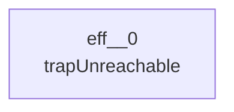
## NOP
```mermaid
---
config:
  layout: elk
---
graph TD
```
## LOCAL_GET
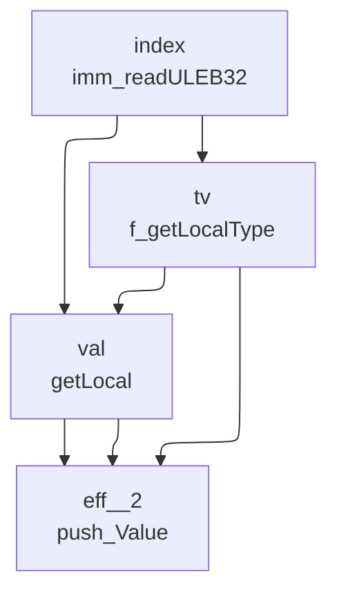
## LOCAL_SET
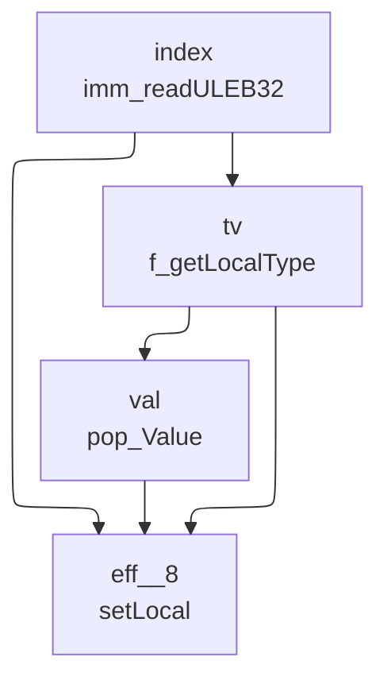
## LOCAL_TEE
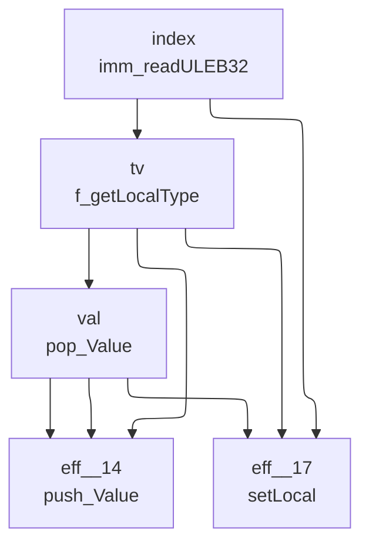
## GLOBAL_GET
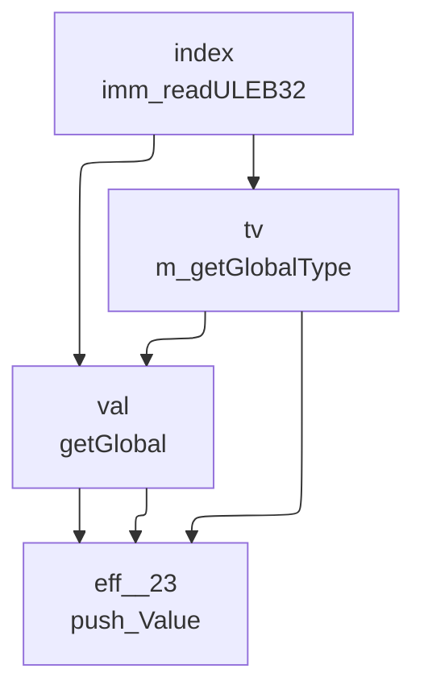
## GLOBAL_SET
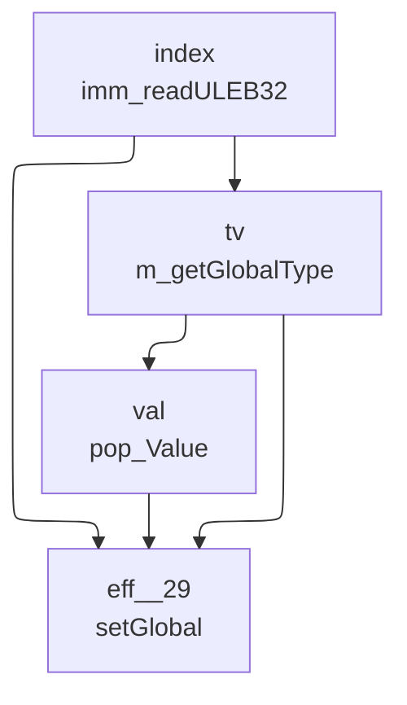
## TABLE_GET
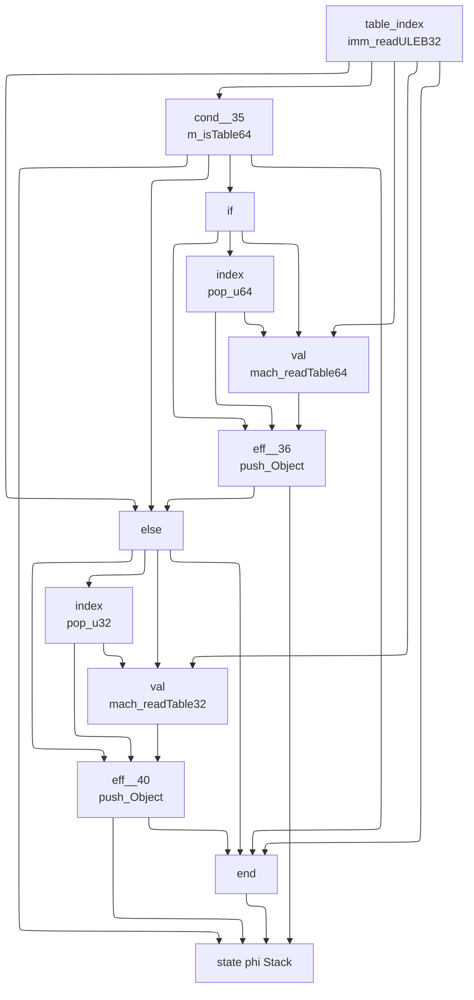
## TABLE_SET
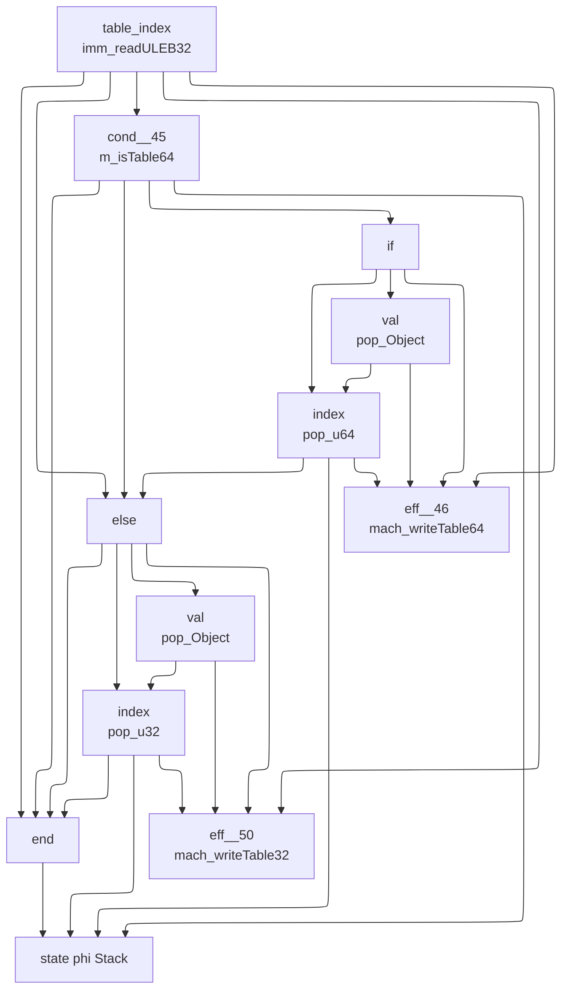
## CALL
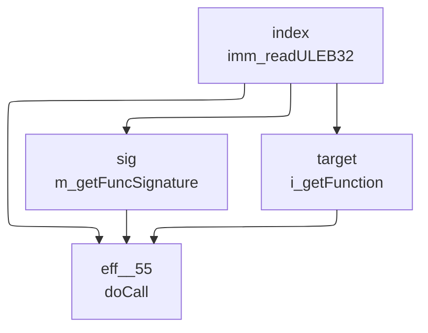
## CALL_INDIRECT
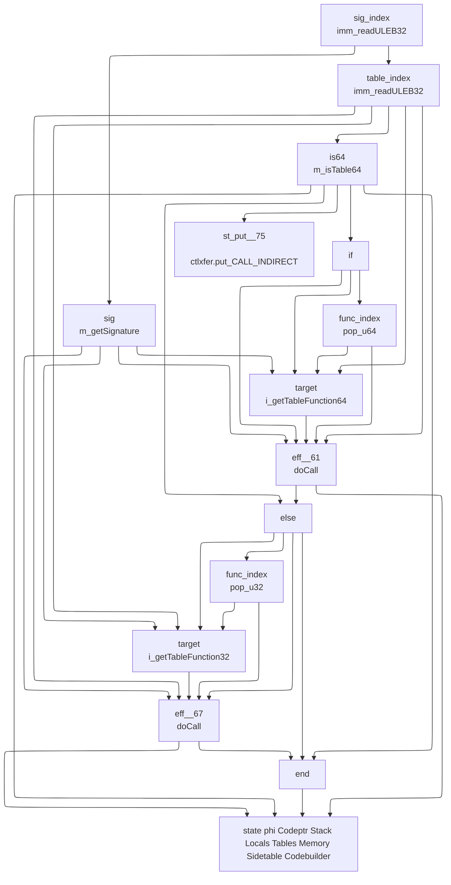
## RETURN_CALL
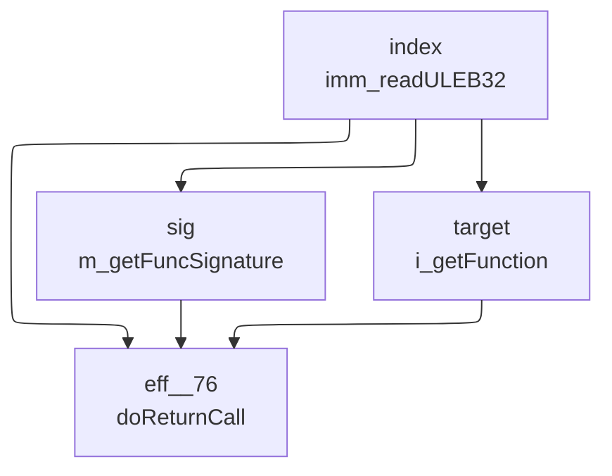
## DROP
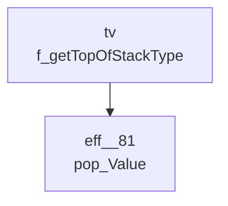
## SELECT
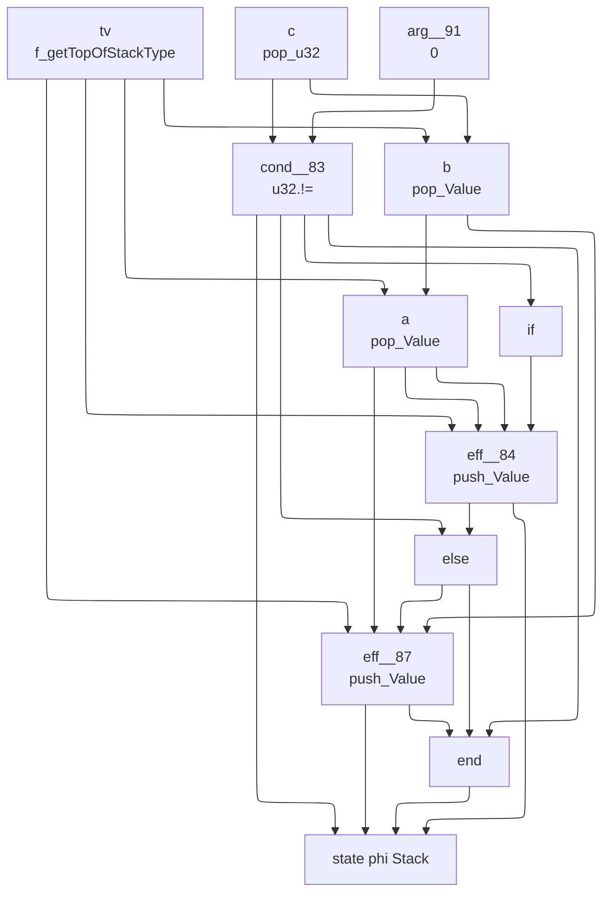
## I32_CONST
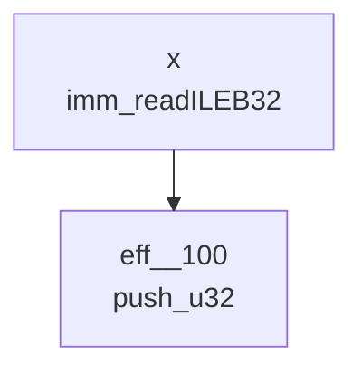
## I32_ADD

## I32_SUB

## I32_MUL

## I32_DIV_S
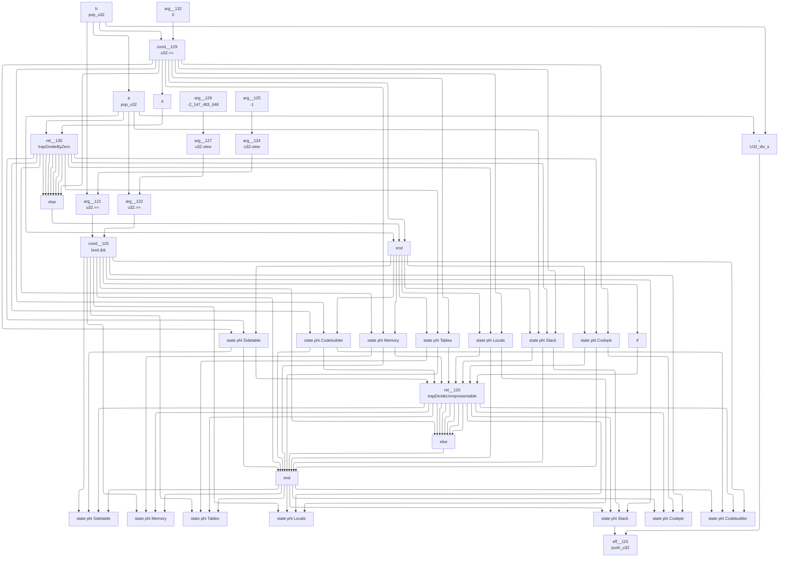
## I32_DIV_U

## I32_EQZ
```mermaid
---
config:
  layout: elk
---
graph TD
	9["
	state phi Stack 	"]
	2 --> 9
	5 --> 9
	8 --> 9
	6 --> 9
	6["
	eff__162
	push_u32
	"]
	1 --> 6
	0 --> 6
	4 --> 6
	4["
	else
	"]
	2 --> 4
	8 --> 4
	8["
	eff__160
	push_u32
	"]
	7 --> 8
	0 --> 8
	3 --> 8
	3["
	if
	"]
	2 --> 3
	2["
	cond__159
	u32.==
	"]
	0 --> 2
	1 --> 2
	1["
	arg__165
	0
	"]
	0["
	a
	pop_u32
	"]
	7["
	arg__161
	1
	"]
	5["
	end
	"]
	2 --> 5
	4 --> 5
	6 --> 5
```
## I32_EQ
```mermaid
---
config:
  layout: elk
---
graph TD
	10["
	state phi Stack 	"]
	2 --> 10
	5 --> 10
	9 --> 10
	7 --> 10
	7["
	eff__177
	push_u32
	"]
	6 --> 7
	1 --> 7
	4 --> 7
	4["
	else
	"]
	2 --> 4
	9 --> 4
	9["
	eff__175
	push_u32
	"]
	8 --> 9
	1 --> 9
	3 --> 9
	3["
	if
	"]
	2 --> 3
	2["
	cond__174
	u32.==
	"]
	1 --> 2
	0 --> 2
	0["
	b
	pop_u32
	"]
	1["
	a
	pop_u32
	"]
	0 --> 1
	8["
	arg__176
	1
	"]
	6["
	arg__178
	0
	"]
	5["
	end
	"]
	2 --> 5
	4 --> 5
	7 --> 5
```
## I32_NE
```mermaid
---
config:
  layout: elk
---
graph TD
	10["
	state phi Stack 	"]
	2 --> 10
	5 --> 10
	9 --> 10
	7 --> 10
	7["
	eff__191
	push_u32
	"]
	6 --> 7
	1 --> 7
	4 --> 7
	4["
	else
	"]
	2 --> 4
	9 --> 4
	9["
	eff__189
	push_u32
	"]
	8 --> 9
	1 --> 9
	3 --> 9
	3["
	if
	"]
	2 --> 3
	2["
	cond__188
	u32.!=
	"]
	1 --> 2
	0 --> 2
	0["
	b
	pop_u32
	"]
	1["
	a
	pop_u32
	"]
	0 --> 1
	8["
	arg__190
	1
	"]
	6["
	arg__192
	0
	"]
	5["
	end
	"]
	2 --> 5
	4 --> 5
	7 --> 5
```
## I32_LT_U
```mermaid
---
config:
  layout: elk
---
graph TD
	10["
	state phi Stack 	"]
	2 --> 10
	5 --> 10
	9 --> 10
	7 --> 10
	7["
	eff__205
	push_u32
	"]
	6 --> 7
	1 --> 7
	4 --> 7
	4["
	else
	"]
	2 --> 4
	9 --> 4
	9["
	eff__203
	push_u32
	"]
	8 --> 9
	1 --> 9
	3 --> 9
	3["
	if
	"]
	2 --> 3
	2["
	cond__202
	u32.<
	"]
	1 --> 2
	0 --> 2
	0["
	b
	pop_u32
	"]
	1["
	a
	pop_u32
	"]
	0 --> 1
	8["
	arg__204
	1
	"]
	6["
	arg__206
	0
	"]
	5["
	end
	"]
	2 --> 5
	4 --> 5
	7 --> 5
```
## I32_LT_S
```mermaid
---
config:
  layout: elk
---
graph TD
	10["
	state phi Stack 	"]
	2 --> 10
	5 --> 10
	9 --> 10
	7 --> 10
	7["
	eff__219
	push_u32
	"]
	6 --> 7
	1 --> 7
	4 --> 7
	4["
	else
	"]
	2 --> 4
	9 --> 4
	9["
	eff__217
	push_u32
	"]
	8 --> 9
	1 --> 9
	3 --> 9
	3["
	if
	"]
	2 --> 3
	2["
	cond__216
	U32_lt_s
	"]
	1 --> 2
	0 --> 2
	0["
	b
	pop_u32
	"]
	1["
	a
	pop_u32
	"]
	0 --> 1
	8["
	arg__218
	1
	"]
	6["
	arg__220
	0
	"]
	5["
	end
	"]
	2 --> 5
	4 --> 5
	7 --> 5
```
## I32_LE_S
```mermaid
---
config:
  layout: elk
---
graph TD
	10["
	state phi Stack 	"]
	2 --> 10
	5 --> 10
	9 --> 10
	7 --> 10
	7["
	eff__233
	push_u32
	"]
	6 --> 7
	1 --> 7
	4 --> 7
	4["
	else
	"]
	2 --> 4
	9 --> 4
	9["
	eff__231
	push_u32
	"]
	8 --> 9
	1 --> 9
	3 --> 9
	3["
	if
	"]
	2 --> 3
	2["
	cond__230
	U32_le_s
	"]
	1 --> 2
	0 --> 2
	0["
	b
	pop_u32
	"]
	1["
	a
	pop_u32
	"]
	0 --> 1
	8["
	arg__232
	1
	"]
	6["
	arg__234
	0
	"]
	5["
	end
	"]
	2 --> 5
	4 --> 5
	7 --> 5
```
## I32_GT_U
```mermaid
---
config:
  layout: elk
---
graph TD
	10["
	state phi Stack 	"]
	2 --> 10
	5 --> 10
	9 --> 10
	7 --> 10
	7["
	eff__247
	push_u32
	"]
	6 --> 7
	1 --> 7
	4 --> 7
	4["
	else
	"]
	2 --> 4
	9 --> 4
	9["
	eff__245
	push_u32
	"]
	8 --> 9
	1 --> 9
	3 --> 9
	3["
	if
	"]
	2 --> 3
	2["
	cond__244
	u32.>
	"]
	1 --> 2
	0 --> 2
	0["
	b
	pop_u32
	"]
	1["
	a
	pop_u32
	"]
	0 --> 1
	8["
	arg__246
	1
	"]
	6["
	arg__248
	0
	"]
	5["
	end
	"]
	2 --> 5
	4 --> 5
	7 --> 5
```
## I32_AND
```mermaid
---
config:
  layout: elk
---
graph TD
	3["
	eff__258
	push_u32
	"]
	2 --> 3
	1 --> 3
	1["
	a
	pop_u32
	"]
	0 --> 1
	0["
	b
	pop_u32
	"]
	2["
	r
	u32.&
	"]
	1 --> 2
	0 --> 2
```
## F32_CONST
```mermaid
---
config:
  layout: elk
---
graph TD
	2["
	eff__262
	push_f32
	"]
	1 --> 2
	1["
	arg__263
	f32_reinterpret_u32
	"]
	0 --> 1
	0["
	x
	imm_readULEB32
	"]
```
## F32_ADD
```mermaid
---
config:
  layout: elk
---
graph TD
	3["
	eff__266
	push_f32
	"]
	2 --> 3
	1 --> 3
	1["
	a
	pop_f32
	"]
	0 --> 1
	0["
	b
	pop_f32
	"]
	2["
	r
	float.+
	"]
	1 --> 2
	0 --> 2
```
## F32_SUB
```mermaid
---
config:
  layout: elk
---
graph TD
	3["
	eff__270
	push_f32
	"]
	2 --> 3
	1 --> 3
	1["
	a
	pop_f32
	"]
	0 --> 1
	0["
	b
	pop_f32
	"]
	2["
	r
	float.-
	"]
	1 --> 2
	0 --> 2
```
## F32_MUL
```mermaid
---
config:
  layout: elk
---
graph TD
	3["
	eff__274
	push_f32
	"]
	2 --> 3
	1 --> 3
	1["
	a
	pop_f32
	"]
	0 --> 1
	0["
	b
	pop_f32
	"]
	2["
	r
	float.*
	"]
	1 --> 2
	0 --> 2
```
## F32_DIV
```mermaid
---
config:
  layout: elk
---
graph TD
	14["
	state phi Codebuilder 	"]
	3 --> 14
	6 --> 14
	7 --> 14
	7["
	ret__283
	trapDivideByZero
	"]
	1 --> 7
	4 --> 7
	4["
	if
	"]
	3 --> 4
	3["
	cond__282
	float.==
	"]
	0 --> 3
	2 --> 3
	2["
	arg__285
	0.0f
	"]
	0["
	b
	pop_f32
	"]
	1["
	a
	pop_f32
	"]
	0 --> 1
	6["
	end
	"]
	3 --> 6
	5 --> 6
	1 --> 6
	5["
	else
	"]
	3 --> 5
	7 --> 5
	7 --> 5
	7 --> 5
	7 --> 5
	7 --> 5
	7 --> 5
	7 --> 5
	13["
	state phi Sidetable 	"]
	3 --> 13
	6 --> 13
	7 --> 13
	12["
	state phi Memory 	"]
	3 --> 12
	6 --> 12
	7 --> 12
	11["
	state phi Tables 	"]
	3 --> 11
	6 --> 11
	7 --> 11
	10["
	state phi Locals 	"]
	3 --> 10
	6 --> 10
	7 --> 10
	9["
	state phi Stack 	"]
	3 --> 9
	6 --> 9
	7 --> 9
	1 --> 9
	8["
	state phi Codeptr 	"]
	3 --> 8
	6 --> 8
	7 --> 8
	16["
	eff__278
	push_f32
	"]
	15 --> 16
	9 --> 16
	15["
	r
	float./
	"]
	1 --> 15
	0 --> 15
```
## F32_SQRT
```mermaid
---
config:
  layout: elk
---
graph TD
	2["
	eff__292
	push_f32
	"]
	1 --> 2
	0 --> 2
	0["
	a
	pop_f32
	"]
	1["
	r
	float.sqrt
	"]
	0 --> 1
```
## F32_EQ
```mermaid
---
config:
  layout: elk
---
graph TD
	10["
	state phi Stack 	"]
	2 --> 10
	5 --> 10
	9 --> 10
	7 --> 10
	7["
	eff__298
	push_u32
	"]
	6 --> 7
	1 --> 7
	4 --> 7
	4["
	else
	"]
	2 --> 4
	9 --> 4
	9["
	eff__296
	push_u32
	"]
	8 --> 9
	1 --> 9
	3 --> 9
	3["
	if
	"]
	2 --> 3
	2["
	cond__295
	float.==
	"]
	1 --> 2
	0 --> 2
	0["
	b
	pop_f32
	"]
	1["
	a
	pop_f32
	"]
	0 --> 1
	8["
	arg__297
	1
	"]
	6["
	arg__299
	0
	"]
	5["
	end
	"]
	2 --> 5
	4 --> 5
	7 --> 5
```
## F32_NE
```mermaid
---
config:
  layout: elk
---
graph TD
	10["
	state phi Stack 	"]
	2 --> 10
	5 --> 10
	9 --> 10
	7 --> 10
	7["
	eff__312
	push_u32
	"]
	6 --> 7
	1 --> 7
	4 --> 7
	4["
	else
	"]
	2 --> 4
	9 --> 4
	9["
	eff__310
	push_u32
	"]
	8 --> 9
	1 --> 9
	3 --> 9
	3["
	if
	"]
	2 --> 3
	2["
	cond__309
	float.!=
	"]
	1 --> 2
	0 --> 2
	0["
	b
	pop_f32
	"]
	1["
	a
	pop_f32
	"]
	0 --> 1
	8["
	arg__311
	1
	"]
	6["
	arg__313
	0
	"]
	5["
	end
	"]
	2 --> 5
	4 --> 5
	7 --> 5
```
## F32_LT
```mermaid
---
config:
  layout: elk
---
graph TD
	10["
	state phi Stack 	"]
	2 --> 10
	5 --> 10
	9 --> 10
	7 --> 10
	7["
	eff__326
	push_u32
	"]
	6 --> 7
	1 --> 7
	4 --> 7
	4["
	else
	"]
	2 --> 4
	9 --> 4
	9["
	eff__324
	push_u32
	"]
	8 --> 9
	1 --> 9
	3 --> 9
	3["
	if
	"]
	2 --> 3
	2["
	cond__323
	float.<
	"]
	1 --> 2
	0 --> 2
	0["
	b
	pop_f32
	"]
	1["
	a
	pop_f32
	"]
	0 --> 1
	8["
	arg__325
	1
	"]
	6["
	arg__327
	0
	"]
	5["
	end
	"]
	2 --> 5
	4 --> 5
	7 --> 5
```
## F32_LE
```mermaid
---
config:
  layout: elk
---
graph TD
	10["
	state phi Stack 	"]
	2 --> 10
	5 --> 10
	9 --> 10
	7 --> 10
	7["
	eff__340
	push_u32
	"]
	6 --> 7
	1 --> 7
	4 --> 7
	4["
	else
	"]
	2 --> 4
	9 --> 4
	9["
	eff__338
	push_u32
	"]
	8 --> 9
	1 --> 9
	3 --> 9
	3["
	if
	"]
	2 --> 3
	2["
	cond__337
	float.<=
	"]
	1 --> 2
	0 --> 2
	0["
	b
	pop_f32
	"]
	1["
	a
	pop_f32
	"]
	0 --> 1
	8["
	arg__339
	1
	"]
	6["
	arg__341
	0
	"]
	5["
	end
	"]
	2 --> 5
	4 --> 5
	7 --> 5
```
## F32_GT
```mermaid
---
config:
  layout: elk
---
graph TD
	10["
	state phi Stack 	"]
	2 --> 10
	5 --> 10
	9 --> 10
	7 --> 10
	7["
	eff__354
	push_u32
	"]
	6 --> 7
	1 --> 7
	4 --> 7
	4["
	else
	"]
	2 --> 4
	9 --> 4
	9["
	eff__352
	push_u32
	"]
	8 --> 9
	1 --> 9
	3 --> 9
	3["
	if
	"]
	2 --> 3
	2["
	cond__351
	float.>
	"]
	1 --> 2
	0 --> 2
	0["
	b
	pop_f32
	"]
	1["
	a
	pop_f32
	"]
	0 --> 1
	8["
	arg__353
	1
	"]
	6["
	arg__355
	0
	"]
	5["
	end
	"]
	2 --> 5
	4 --> 5
	7 --> 5
```
## BR
```mermaid
---
config:
  layout: elk
---
graph TD
	3["
	st_put__368
	ctlxfer.put_BR
	"]
	1 --> 3
	1["
	label
	f_getLabel
	"]
	0 --> 1
	0["
	depth
	imm_readULEB32
	"]
	2["
	ret__365
	doBranch
	"]
	1 --> 2
	0 --> 2
```
## BR_IF
```mermaid
---
config:
  layout: elk
---
graph TD
	11["
	st_put__376
	ctlxfer.put_BR_IF
	"]
	1 --> 11
	1["
	label
	f_getLabel
	"]
	0 --> 1
	0["
	depth
	imm_readULEB32
	"]
	10["
	state phi Codeptr Stack Locals Tables Memory Sidetable Codebuilder 	"]
	4 --> 10
	7 --> 10
	9 --> 10
	8 --> 10
	8["
	ret__372
	doFallthru
	"]
	2 --> 8
	0 --> 8
	6 --> 8
	6["
	else
	"]
	4 --> 6
	9 --> 6
	9["
	ret__370
	doBranch
	"]
	1 --> 9
	2 --> 9
	0 --> 9
	5 --> 9
	5["
	if
	"]
	4 --> 5
	4["
	cond__369
	u32.!=
	"]
	2 --> 4
	3 --> 4
	3["
	arg__374
	0
	"]
	2["
	cond
	pop_u32
	"]
	7["
	end
	"]
	4 --> 7
	6 --> 7
	8 --> 7
```
## BR_TABLE
```mermaid
---
config:
  layout: elk
---
graph TD
	3["
	st_put__386
	ctlxfer.put_BR_TABLE
	"]
	0 --> 3
	0["
	labels
	imm_readLabels
	"]
	2["
	eff__383
	doSwitch
	"]
	0 --> 2
	1 --> 2
	1 --> 2
	0 --> 2
	1["
	key
	pop_u32
	"]
```
## BLOCK
```mermaid
---
config:
  layout: elk
---
graph TD
	1["
	eff__387
	doBlock
	"]
	0 --> 1
	0 --> 1
	0["
	bt
	imm_readBlockType
	"]
```
## LOOP
```mermaid
---
config:
  layout: elk
---
graph TD
	1["
	eff__389
	doLoop
	"]
	0 --> 1
	0 --> 1
	0["
	bt
	imm_readBlockType
	"]
```
## TRY
```mermaid
---
config:
  layout: elk
---
graph TD
	1["
	eff__391
	doTry
	"]
	0 --> 1
	0 --> 1
	0["
	bt
	imm_readBlockType
	"]
```
## IF
```mermaid
---
config:
  layout: elk
---
graph TD
	11["
	st_put__400
	ctlxfer.put_IF
	"]
	2 --> 11
	2["
	label
	doIf
	"]
	0 --> 2
	1 --> 2
	0 --> 2
	0["
	bt
	imm_readBlockType
	"]
	1["
	cond
	pop_u32
	"]
	10["
	state phi Codeptr Stack Locals Tables Memory Sidetable Codebuilder 	"]
	4 --> 10
	7 --> 10
	9 --> 10
	8 --> 10
	8["
	ret__396
	doFallthru
	"]
	2 --> 8
	2 --> 8
	2 --> 8
	2 --> 8
	2 --> 8
	2 --> 8
	2 --> 8
	6 --> 8
	6["
	else
	"]
	4 --> 6
	9 --> 6
	9["
	ret__394
	doBranch
	"]
	2 --> 9
	2 --> 9
	2 --> 9
	2 --> 9
	2 --> 9
	2 --> 9
	2 --> 9
	2 --> 9
	5 --> 9
	5["
	if
	"]
	4 --> 5
	4["
	cond__393
	u32.==
	"]
	1 --> 4
	3 --> 4
	3["
	arg__398
	0
	"]
	7["
	end
	"]
	4 --> 7
	6 --> 7
	8 --> 7
```
## ELSE
```mermaid
---
config:
  layout: elk
---
graph TD
	2["
	st_put__409
	ctlxfer.put_ELSE
	"]
	0 --> 2
	0["
	label
	doElse
	"]
	1["
	ret__407
	doBranch
	"]
	0 --> 1
	0 --> 1
	0 --> 1
	0 --> 1
	0 --> 1
	0 --> 1
	0 --> 1
	0 --> 1
```
## END
```mermaid
---
config:
  layout: elk
---
graph TD
	6["
	state phi Codeptr Stack Locals Tables Memory Sidetable Codebuilder 	"]
	1 --> 6
	4 --> 6
	5 --> 6
	0 --> 6
	0["
	eff__412
	doEnd
	"]
	5["
	ret__411
	doReturn
	"]
	0 --> 5
	0 --> 5
	0 --> 5
	0 --> 5
	0 --> 5
	0 --> 5
	0 --> 5
	2 --> 5
	2["
	if
	"]
	1 --> 2
	1["
	cond__410
	f_isAtEnd
	"]
	4["
	end
	"]
	1 --> 4
	3 --> 4
	0 --> 4
	3["
	else
	"]
	1 --> 3
	5 --> 3
```
## RETURN
```mermaid
---
config:
  layout: elk
---
graph TD
	0["
	ret__413
	doReturn
	"]
```
## REF_NULL
```mermaid
---
config:
  layout: elk
---
graph TD
	2["
	eff__414
	push_Object
	"]
	1 --> 2
	1["
	arg__415
	object_Null
	"]
	0["
	idx
	imm_readULEB32
	"]
```
## REF_IS_NULL
```mermaid
---
config:
  layout: elk
---
graph TD
	9["
	state phi Stack 	"]
	1 --> 9
	4 --> 9
	8 --> 9
	6 --> 9
	6["
	eff__419
	push_u32
	"]
	5 --> 6
	0 --> 6
	3 --> 6
	3["
	else
	"]
	1 --> 3
	8 --> 3
	8["
	eff__417
	push_u32
	"]
	7 --> 8
	0 --> 8
	2 --> 8
	2["
	if
	"]
	1 --> 2
	1["
	cond__416
	object_isNull
	"]
	0 --> 1
	0["
	obj
	pop_Object
	"]
	7["
	arg__418
	1
	"]
	5["
	arg__420
	0
	"]
	4["
	end
	"]
	1 --> 4
	3 --> 4
	6 --> 4
```
## REF_AS_NON_NULL
```mermaid
---
config:
  layout: elk
---
graph TD
	13["
	eff__429
	push_Object
	"]
	0 --> 13
	7 --> 13
	7["
	state phi Stack 	"]
	1 --> 7
	4 --> 7
	5 --> 7
	0 --> 7
	0["
	obj
	pop_Object
	"]
	5["
	eff__432
	trapNull
	"]
	0 --> 5
	2 --> 5
	2["
	if
	"]
	1 --> 2
	1["
	cond__431
	object_isNull
	"]
	0 --> 1
	4["
	end
	"]
	1 --> 4
	3 --> 4
	0 --> 4
	3["
	else
	"]
	1 --> 3
	5 --> 3
	5 --> 3
	5 --> 3
	5 --> 3
	5 --> 3
	5 --> 3
	5 --> 3
	12["
	state phi Codebuilder 	"]
	1 --> 12
	4 --> 12
	5 --> 12
	11["
	state phi Sidetable 	"]
	1 --> 11
	4 --> 11
	5 --> 11
	10["
	state phi Memory 	"]
	1 --> 10
	4 --> 10
	5 --> 10
	9["
	state phi Tables 	"]
	1 --> 9
	4 --> 9
	5 --> 9
	8["
	state phi Locals 	"]
	1 --> 8
	4 --> 8
	5 --> 8
	6["
	state phi Codeptr 	"]
	1 --> 6
	4 --> 6
	5 --> 6
```
## STRUCT_NEW
```mermaid
---
config:
  layout: elk
---
graph TD
	3["
	eff__439
	push_Object
	"]
	2 --> 3
	2["
	obj
	object_New
	"]
	1 --> 2
	1["
	sig
	m_getSignature
	"]
	0 --> 1
	0["
	struct_idx
	imm_readULEB32
	"]
```
## STRUCT_GET
```mermaid
---
config:
  layout: elk
---
graph TD
	15["
	state phi Sidetable 	"]
	5 --> 15
	8 --> 15
	9 --> 15
	9["
	ret__469
	trapNull
	"]
	4 --> 9
	1 --> 9
	6 --> 9
	6["
	if
	"]
	5 --> 6
	5["
	cond__468
	object_isNull
	"]
	4 --> 5
	4["
	obj
	pop_Object
	"]
	1["
	field_index
	imm_readULEB32
	"]
	0 --> 1
	0["
	struct_index
	imm_readULEB32
	"]
	8["
	end
	"]
	5 --> 8
	7 --> 8
	1 --> 8
	4 --> 8
	7["
	else
	"]
	5 --> 7
	9 --> 7
	9 --> 7
	9 --> 7
	9 --> 7
	9 --> 7
	9 --> 7
	9 --> 7
	14["
	state phi Memory 	"]
	5 --> 14
	8 --> 14
	9 --> 14
	13["
	state phi Tables 	"]
	5 --> 13
	8 --> 13
	9 --> 13
	12["
	state phi Locals 	"]
	5 --> 12
	8 --> 12
	9 --> 12
	11["
	state phi Stack 	"]
	5 --> 11
	8 --> 11
	9 --> 11
	4 --> 11
	10["
	state phi Codeptr 	"]
	5 --> 10
	8 --> 10
	9 --> 10
	1 --> 10
	3["
	offset
	m_getFieldOffset
	"]
	0 --> 3
	1 --> 3
	2["
	kind
	m_getFieldKind
	"]
	0 --> 2
	1 --> 2
	16["
	state phi Codebuilder 	"]
	5 --> 16
	8 --> 16
	9 --> 16
```
## STRUCT_GET_S
```mermaid
---
config:
  layout: elk
---
graph TD
	15["
	state phi Sidetable 	"]
	5 --> 15
	8 --> 15
	9 --> 15
	9["
	ret__494
	trapNull
	"]
	4 --> 9
	1 --> 9
	6 --> 9
	6["
	if
	"]
	5 --> 6
	5["
	cond__493
	object_isNull
	"]
	4 --> 5
	4["
	obj
	pop_Object
	"]
	1["
	field_index
	imm_readULEB32
	"]
	0 --> 1
	0["
	struct_index
	imm_readULEB32
	"]
	8["
	end
	"]
	5 --> 8
	7 --> 8
	1 --> 8
	4 --> 8
	7["
	else
	"]
	5 --> 7
	9 --> 7
	9 --> 7
	9 --> 7
	9 --> 7
	9 --> 7
	9 --> 7
	9 --> 7
	14["
	state phi Memory 	"]
	5 --> 14
	8 --> 14
	9 --> 14
	13["
	state phi Tables 	"]
	5 --> 13
	8 --> 13
	9 --> 13
	12["
	state phi Locals 	"]
	5 --> 12
	8 --> 12
	9 --> 12
	11["
	state phi Stack 	"]
	5 --> 11
	8 --> 11
	9 --> 11
	4 --> 11
	10["
	state phi Codeptr 	"]
	5 --> 10
	8 --> 10
	9 --> 10
	1 --> 10
	3["
	offset
	m_getFieldOffset
	"]
	0 --> 3
	1 --> 3
	2["
	kind
	m_getFieldKind
	"]
	0 --> 2
	1 --> 2
	16["
	state phi Codebuilder 	"]
	5 --> 16
	8 --> 16
	9 --> 16
```
## STRUCT_GET_U
```mermaid
---
config:
  layout: elk
---
graph TD
	15["
	state phi Sidetable 	"]
	5 --> 15
	8 --> 15
	9 --> 15
	9["
	ret__519
	trapNull
	"]
	4 --> 9
	1 --> 9
	6 --> 9
	6["
	if
	"]
	5 --> 6
	5["
	cond__518
	object_isNull
	"]
	4 --> 5
	4["
	obj
	pop_Object
	"]
	1["
	field_index
	imm_readULEB32
	"]
	0 --> 1
	0["
	struct_index
	imm_readULEB32
	"]
	8["
	end
	"]
	5 --> 8
	7 --> 8
	1 --> 8
	4 --> 8
	7["
	else
	"]
	5 --> 7
	9 --> 7
	9 --> 7
	9 --> 7
	9 --> 7
	9 --> 7
	9 --> 7
	9 --> 7
	14["
	state phi Memory 	"]
	5 --> 14
	8 --> 14
	9 --> 14
	13["
	state phi Tables 	"]
	5 --> 13
	8 --> 13
	9 --> 13
	12["
	state phi Locals 	"]
	5 --> 12
	8 --> 12
	9 --> 12
	11["
	state phi Stack 	"]
	5 --> 11
	8 --> 11
	9 --> 11
	4 --> 11
	10["
	state phi Codeptr 	"]
	5 --> 10
	8 --> 10
	9 --> 10
	1 --> 10
	3["
	offset
	m_getFieldOffset
	"]
	0 --> 3
	1 --> 3
	2["
	kind
	m_getFieldKind
	"]
	0 --> 2
	1 --> 2
	16["
	state phi Codebuilder 	"]
	5 --> 16
	8 --> 16
	9 --> 16
```
## I32_LOAD
```mermaid
---
config:
  layout: elk
---
graph TD
	13["
	if
	"]
	12 --> 13
	12["
	cond__532
	m_isMemory64
	"]
	10 --> 12
	10["
	memindex
	phi
	"]
	5 --> 10
	8 --> 10
	9 --> 10
	1 --> 10
	1["
	memindex
	0u
	"]
	9["
	memindex__545
	imm_readULEB32
	"]
	0 --> 9
	6 --> 9
	6["
	if
	"]
	5 --> 6
	5["
	cond__544
	u8.!=
	"]
	4 --> 5
	2 --> 5
	2["
	arg__547
	0
	"]
	4["
	arg__546
	u8.&
	"]
	0 --> 4
	3 --> 4
	3["
	arg__549
	0x40u8
	"]
	0["
	flags
	imm_readU8
	"]
	8["
	end
	"]
	5 --> 8
	7 --> 8
	1 --> 8
	0 --> 8
	7["
	else
	"]
	5 --> 7
	9 --> 7
	9 --> 7
	11["
	state phi Codeptr 	"]
	5 --> 11
	8 --> 11
	9 --> 11
	0 --> 11
	25["
	state phi Stack 	"]
	12 --> 25
	15 --> 25
	23 --> 25
	19 --> 25
	19["
	eff__538
	push_u32
	"]
	18 --> 19
	17 --> 19
	14 --> 19
	14["
	else
	"]
	12 --> 14
	20 --> 14
	23 --> 14
	23["
	eff__533
	push_u32
	"]
	22 --> 23
	21 --> 23
	13 --> 23
	21["
	index
	pop_u64
	"]
	13 --> 21
	22["
	val
	mach_readMemory64_u32
	"]
	10 --> 22
	21 --> 22
	20 --> 22
	13 --> 22
	20["
	offset
	imm_readULEB64
	"]
	11 --> 20
	13 --> 20
	17["
	index
	pop_u32
	"]
	14 --> 17
	18["
	val
	mach_readMemory32_u32
	"]
	10 --> 18
	17 --> 18
	16 --> 18
	14 --> 18
	16["
	offset
	imm_readULEB32
	"]
	11 --> 16
	14 --> 16
	15["
	end
	"]
	12 --> 15
	14 --> 15
	16 --> 15
	19 --> 15
	24["
	state phi Codeptr 	"]
	12 --> 24
	15 --> 24
	20 --> 24
	16 --> 24
```
## I32_LOAD8_U
```mermaid
---
config:
  layout: elk
---
graph TD
	13["
	if
	"]
	12 --> 13
	12["
	cond__550
	m_isMemory64
	"]
	10 --> 12
	10["
	memindex
	phi
	"]
	5 --> 10
	8 --> 10
	9 --> 10
	1 --> 10
	1["
	memindex
	0u
	"]
	9["
	memindex__563
	imm_readULEB32
	"]
	0 --> 9
	6 --> 9
	6["
	if
	"]
	5 --> 6
	5["
	cond__562
	u8.!=
	"]
	4 --> 5
	2 --> 5
	2["
	arg__565
	0
	"]
	4["
	arg__564
	u8.&
	"]
	0 --> 4
	3 --> 4
	3["
	arg__567
	0x40u8
	"]
	0["
	flags
	imm_readU8
	"]
	8["
	end
	"]
	5 --> 8
	7 --> 8
	1 --> 8
	0 --> 8
	7["
	else
	"]
	5 --> 7
	9 --> 7
	9 --> 7
	11["
	state phi Codeptr 	"]
	5 --> 11
	8 --> 11
	9 --> 11
	0 --> 11
	25["
	state phi Stack 	"]
	12 --> 25
	15 --> 25
	23 --> 25
	19 --> 25
	19["
	eff__556
	push_u32
	"]
	18 --> 19
	17 --> 19
	14 --> 19
	14["
	else
	"]
	12 --> 14
	20 --> 14
	23 --> 14
	23["
	eff__551
	push_u32
	"]
	22 --> 23
	21 --> 23
	13 --> 23
	21["
	index
	pop_u64
	"]
	13 --> 21
	22["
	val
	mach_readMemory64_u8
	"]
	10 --> 22
	21 --> 22
	20 --> 22
	13 --> 22
	20["
	offset
	imm_readULEB64
	"]
	11 --> 20
	13 --> 20
	17["
	index
	pop_u32
	"]
	14 --> 17
	18["
	val
	mach_readMemory32_u8
	"]
	10 --> 18
	17 --> 18
	16 --> 18
	14 --> 18
	16["
	offset
	imm_readULEB32
	"]
	11 --> 16
	14 --> 16
	15["
	end
	"]
	12 --> 15
	14 --> 15
	16 --> 15
	19 --> 15
	24["
	state phi Codeptr 	"]
	12 --> 24
	15 --> 24
	20 --> 24
	16 --> 24
```
## I32_LOAD16_S
```mermaid
---
config:
  layout: elk
---
graph TD
	13["
	if
	"]
	12 --> 13
	12["
	cond__568
	m_isMemory64
	"]
	10 --> 12
	10["
	memindex
	phi
	"]
	5 --> 10
	8 --> 10
	9 --> 10
	1 --> 10
	1["
	memindex
	0u
	"]
	9["
	memindex__581
	imm_readULEB32
	"]
	0 --> 9
	6 --> 9
	6["
	if
	"]
	5 --> 6
	5["
	cond__580
	u8.!=
	"]
	4 --> 5
	2 --> 5
	2["
	arg__583
	0
	"]
	4["
	arg__582
	u8.&
	"]
	0 --> 4
	3 --> 4
	3["
	arg__585
	0x40u8
	"]
	0["
	flags
	imm_readU8
	"]
	8["
	end
	"]
	5 --> 8
	7 --> 8
	1 --> 8
	0 --> 8
	7["
	else
	"]
	5 --> 7
	9 --> 7
	9 --> 7
	11["
	state phi Codeptr 	"]
	5 --> 11
	8 --> 11
	9 --> 11
	0 --> 11
	25["
	state phi Stack 	"]
	12 --> 25
	15 --> 25
	23 --> 25
	19 --> 25
	19["
	eff__574
	push_u32
	"]
	18 --> 19
	17 --> 19
	14 --> 19
	14["
	else
	"]
	12 --> 14
	20 --> 14
	23 --> 14
	23["
	eff__569
	push_u32
	"]
	22 --> 23
	21 --> 23
	13 --> 23
	21["
	index
	pop_u64
	"]
	13 --> 21
	22["
	val
	mach_readMemory64_u16
	"]
	10 --> 22
	21 --> 22
	20 --> 22
	13 --> 22
	20["
	offset
	imm_readULEB64
	"]
	11 --> 20
	13 --> 20
	17["
	index
	pop_u32
	"]
	14 --> 17
	18["
	val
	mach_readMemory32_u16
	"]
	10 --> 18
	17 --> 18
	16 --> 18
	14 --> 18
	16["
	offset
	imm_readULEB32
	"]
	11 --> 16
	14 --> 16
	15["
	end
	"]
	12 --> 15
	14 --> 15
	16 --> 15
	19 --> 15
	24["
	state phi Codeptr 	"]
	12 --> 24
	15 --> 24
	20 --> 24
	16 --> 24
```
## I64_LOAD
```mermaid
---
config:
  layout: elk
---
graph TD
	13["
	if
	"]
	12 --> 13
	12["
	cond__586
	m_isMemory64
	"]
	10 --> 12
	10["
	memindex
	phi
	"]
	5 --> 10
	8 --> 10
	9 --> 10
	1 --> 10
	1["
	memindex
	0u
	"]
	9["
	memindex__599
	imm_readULEB32
	"]
	0 --> 9
	6 --> 9
	6["
	if
	"]
	5 --> 6
	5["
	cond__598
	u8.!=
	"]
	4 --> 5
	2 --> 5
	2["
	arg__601
	0
	"]
	4["
	arg__600
	u8.&
	"]
	0 --> 4
	3 --> 4
	3["
	arg__603
	0x40u8
	"]
	0["
	flags
	imm_readU8
	"]
	8["
	end
	"]
	5 --> 8
	7 --> 8
	1 --> 8
	0 --> 8
	7["
	else
	"]
	5 --> 7
	9 --> 7
	9 --> 7
	11["
	state phi Codeptr 	"]
	5 --> 11
	8 --> 11
	9 --> 11
	0 --> 11
	25["
	state phi Stack 	"]
	12 --> 25
	15 --> 25
	23 --> 25
	19 --> 25
	19["
	eff__592
	push_u64
	"]
	18 --> 19
	17 --> 19
	14 --> 19
	14["
	else
	"]
	12 --> 14
	20 --> 14
	23 --> 14
	23["
	eff__587
	push_u64
	"]
	22 --> 23
	21 --> 23
	13 --> 23
	21["
	index
	pop_u64
	"]
	13 --> 21
	22["
	val
	mach_readMemory64_u64
	"]
	10 --> 22
	21 --> 22
	20 --> 22
	13 --> 22
	20["
	offset
	imm_readULEB64
	"]
	11 --> 20
	13 --> 20
	17["
	index
	pop_u32
	"]
	14 --> 17
	18["
	val
	mach_readMemory32_u64
	"]
	10 --> 18
	17 --> 18
	16 --> 18
	14 --> 18
	16["
	offset
	imm_readULEB32
	"]
	11 --> 16
	14 --> 16
	15["
	end
	"]
	12 --> 15
	14 --> 15
	16 --> 15
	19 --> 15
	24["
	state phi Codeptr 	"]
	12 --> 24
	15 --> 24
	20 --> 24
	16 --> 24
```
## F32_LOAD
```mermaid
---
config:
  layout: elk
---
graph TD
	13["
	if
	"]
	12 --> 13
	12["
	cond__604
	m_isMemory64
	"]
	10 --> 12
	10["
	memindex
	phi
	"]
	5 --> 10
	8 --> 10
	9 --> 10
	1 --> 10
	1["
	memindex
	0u
	"]
	9["
	memindex__617
	imm_readULEB32
	"]
	0 --> 9
	6 --> 9
	6["
	if
	"]
	5 --> 6
	5["
	cond__616
	u8.!=
	"]
	4 --> 5
	2 --> 5
	2["
	arg__619
	0
	"]
	4["
	arg__618
	u8.&
	"]
	0 --> 4
	3 --> 4
	3["
	arg__621
	0x40u8
	"]
	0["
	flags
	imm_readU8
	"]
	8["
	end
	"]
	5 --> 8
	7 --> 8
	1 --> 8
	0 --> 8
	7["
	else
	"]
	5 --> 7
	9 --> 7
	9 --> 7
	11["
	state phi Codeptr 	"]
	5 --> 11
	8 --> 11
	9 --> 11
	0 --> 11
	25["
	state phi Stack 	"]
	12 --> 25
	15 --> 25
	23 --> 25
	19 --> 25
	19["
	eff__610
	push_f32
	"]
	18 --> 19
	17 --> 19
	14 --> 19
	14["
	else
	"]
	12 --> 14
	20 --> 14
	23 --> 14
	23["
	eff__605
	push_f32
	"]
	22 --> 23
	21 --> 23
	13 --> 23
	21["
	index
	pop_u64
	"]
	13 --> 21
	22["
	val
	mach_readMemory64_f32
	"]
	10 --> 22
	21 --> 22
	20 --> 22
	13 --> 22
	20["
	offset
	imm_readULEB64
	"]
	11 --> 20
	13 --> 20
	17["
	index
	pop_u32
	"]
	14 --> 17
	18["
	val
	mach_readMemory32_f32
	"]
	10 --> 18
	17 --> 18
	16 --> 18
	14 --> 18
	16["
	offset
	imm_readULEB32
	"]
	11 --> 16
	14 --> 16
	15["
	end
	"]
	12 --> 15
	14 --> 15
	16 --> 15
	19 --> 15
	24["
	state phi Codeptr 	"]
	12 --> 24
	15 --> 24
	20 --> 24
	16 --> 24
```
## F64_LOAD
```mermaid
---
config:
  layout: elk
---
graph TD
	13["
	if
	"]
	12 --> 13
	12["
	cond__622
	m_isMemory64
	"]
	10 --> 12
	10["
	memindex
	phi
	"]
	5 --> 10
	8 --> 10
	9 --> 10
	1 --> 10
	1["
	memindex
	0u
	"]
	9["
	memindex__635
	imm_readULEB32
	"]
	0 --> 9
	6 --> 9
	6["
	if
	"]
	5 --> 6
	5["
	cond__634
	u8.!=
	"]
	4 --> 5
	2 --> 5
	2["
	arg__637
	0
	"]
	4["
	arg__636
	u8.&
	"]
	0 --> 4
	3 --> 4
	3["
	arg__639
	0x40u8
	"]
	0["
	flags
	imm_readU8
	"]
	8["
	end
	"]
	5 --> 8
	7 --> 8
	1 --> 8
	0 --> 8
	7["
	else
	"]
	5 --> 7
	9 --> 7
	9 --> 7
	11["
	state phi Codeptr 	"]
	5 --> 11
	8 --> 11
	9 --> 11
	0 --> 11
	25["
	state phi Stack 	"]
	12 --> 25
	15 --> 25
	23 --> 25
	19 --> 25
	19["
	eff__628
	push_f64
	"]
	18 --> 19
	17 --> 19
	14 --> 19
	14["
	else
	"]
	12 --> 14
	20 --> 14
	23 --> 14
	23["
	eff__623
	push_f64
	"]
	22 --> 23
	21 --> 23
	13 --> 23
	21["
	index
	pop_u64
	"]
	13 --> 21
	22["
	val
	mach_readMemory64_f64
	"]
	10 --> 22
	21 --> 22
	20 --> 22
	13 --> 22
	20["
	offset
	imm_readULEB64
	"]
	11 --> 20
	13 --> 20
	17["
	index
	pop_u32
	"]
	14 --> 17
	18["
	val
	mach_readMemory32_f64
	"]
	10 --> 18
	17 --> 18
	16 --> 18
	14 --> 18
	16["
	offset
	imm_readULEB32
	"]
	11 --> 16
	14 --> 16
	15["
	end
	"]
	12 --> 15
	14 --> 15
	16 --> 15
	19 --> 15
	24["
	state phi Codeptr 	"]
	12 --> 24
	15 --> 24
	20 --> 24
	16 --> 24
```
## I32_STORE
```mermaid
---
config:
  layout: elk
---
graph TD
	14["
	if
	"]
	13 --> 14
	13["
	cond__640
	m_isMemory64
	"]
	10 --> 13
	10["
	memindex
	phi
	"]
	5 --> 10
	8 --> 10
	9 --> 10
	1 --> 10
	1["
	memindex
	0u
	"]
	9["
	memindex__653
	imm_readULEB32
	"]
	0 --> 9
	6 --> 9
	6["
	if
	"]
	5 --> 6
	5["
	cond__652
	u8.!=
	"]
	4 --> 5
	2 --> 5
	2["
	arg__655
	0
	"]
	4["
	arg__654
	u8.&
	"]
	0 --> 4
	3 --> 4
	3["
	arg__657
	0x40u8
	"]
	0["
	flags
	imm_readU8
	"]
	8["
	end
	"]
	5 --> 8
	7 --> 8
	1 --> 8
	0 --> 8
	7["
	else
	"]
	5 --> 7
	9 --> 7
	9 --> 7
	11["
	state phi Codeptr 	"]
	5 --> 11
	8 --> 11
	9 --> 11
	0 --> 11
	25["
	state phi Memory 	"]
	13 --> 25
	16 --> 25
	22 --> 25
	19 --> 25
	19["
	eff__646
	mach_writeMemory32_u32
	"]
	10 --> 19
	18 --> 19
	17 --> 19
	12 --> 19
	15 --> 19
	15["
	else
	"]
	13 --> 15
	20 --> 15
	21 --> 15
	22 --> 15
	22["
	eff__641
	mach_writeMemory64_u32
	"]
	10 --> 22
	21 --> 22
	20 --> 22
	12 --> 22
	14 --> 22
	12["
	val
	pop_u32
	"]
	20["
	offset
	imm_readULEB64
	"]
	11 --> 20
	14 --> 20
	21["
	index
	pop_u64
	"]
	12 --> 21
	14 --> 21
	17["
	offset
	imm_readULEB32
	"]
	11 --> 17
	15 --> 17
	18["
	index
	pop_u32
	"]
	12 --> 18
	15 --> 18
	16["
	end
	"]
	13 --> 16
	15 --> 16
	17 --> 16
	18 --> 16
	19 --> 16
	24["
	state phi Stack 	"]
	13 --> 24
	16 --> 24
	21 --> 24
	18 --> 24
	23["
	state phi Codeptr 	"]
	13 --> 23
	16 --> 23
	20 --> 23
	17 --> 23
```
## I32_STORE8
```mermaid
---
config:
  layout: elk
---
graph TD
	14["
	if
	"]
	13 --> 14
	13["
	cond__658
	m_isMemory64
	"]
	10 --> 13
	10["
	memindex
	phi
	"]
	5 --> 10
	8 --> 10
	9 --> 10
	1 --> 10
	1["
	memindex
	0u
	"]
	9["
	memindex__671
	imm_readULEB32
	"]
	0 --> 9
	6 --> 9
	6["
	if
	"]
	5 --> 6
	5["
	cond__670
	u8.!=
	"]
	4 --> 5
	2 --> 5
	2["
	arg__673
	0
	"]
	4["
	arg__672
	u8.&
	"]
	0 --> 4
	3 --> 4
	3["
	arg__675
	0x40u8
	"]
	0["
	flags
	imm_readU8
	"]
	8["
	end
	"]
	5 --> 8
	7 --> 8
	1 --> 8
	0 --> 8
	7["
	else
	"]
	5 --> 7
	9 --> 7
	9 --> 7
	11["
	state phi Codeptr 	"]
	5 --> 11
	8 --> 11
	9 --> 11
	0 --> 11
	25["
	state phi Memory 	"]
	13 --> 25
	16 --> 25
	22 --> 25
	19 --> 25
	19["
	eff__664
	mach_writeMemory32_u8
	"]
	10 --> 19
	18 --> 19
	17 --> 19
	12 --> 19
	15 --> 19
	15["
	else
	"]
	13 --> 15
	20 --> 15
	21 --> 15
	22 --> 15
	22["
	eff__659
	mach_writeMemory64_u8
	"]
	10 --> 22
	21 --> 22
	20 --> 22
	12 --> 22
	14 --> 22
	12["
	val
	pop_u32
	"]
	20["
	offset
	imm_readULEB64
	"]
	11 --> 20
	14 --> 20
	21["
	index
	pop_u64
	"]
	12 --> 21
	14 --> 21
	17["
	offset
	imm_readULEB32
	"]
	11 --> 17
	15 --> 17
	18["
	index
	pop_u32
	"]
	12 --> 18
	15 --> 18
	16["
	end
	"]
	13 --> 16
	15 --> 16
	17 --> 16
	18 --> 16
	19 --> 16
	24["
	state phi Stack 	"]
	13 --> 24
	16 --> 24
	21 --> 24
	18 --> 24
	23["
	state phi Codeptr 	"]
	13 --> 23
	16 --> 23
	20 --> 23
	17 --> 23
```
## I32_STORE16
```mermaid
---
config:
  layout: elk
---
graph TD
	14["
	if
	"]
	13 --> 14
	13["
	cond__676
	m_isMemory64
	"]
	10 --> 13
	10["
	memindex
	phi
	"]
	5 --> 10
	8 --> 10
	9 --> 10
	1 --> 10
	1["
	memindex
	0u
	"]
	9["
	memindex__689
	imm_readULEB32
	"]
	0 --> 9
	6 --> 9
	6["
	if
	"]
	5 --> 6
	5["
	cond__688
	u8.!=
	"]
	4 --> 5
	2 --> 5
	2["
	arg__691
	0
	"]
	4["
	arg__690
	u8.&
	"]
	0 --> 4
	3 --> 4
	3["
	arg__693
	0x40u8
	"]
	0["
	flags
	imm_readU8
	"]
	8["
	end
	"]
	5 --> 8
	7 --> 8
	1 --> 8
	0 --> 8
	7["
	else
	"]
	5 --> 7
	9 --> 7
	9 --> 7
	11["
	state phi Codeptr 	"]
	5 --> 11
	8 --> 11
	9 --> 11
	0 --> 11
	25["
	state phi Memory 	"]
	13 --> 25
	16 --> 25
	22 --> 25
	19 --> 25
	19["
	eff__682
	mach_writeMemory32_u16
	"]
	10 --> 19
	18 --> 19
	17 --> 19
	12 --> 19
	15 --> 19
	15["
	else
	"]
	13 --> 15
	20 --> 15
	21 --> 15
	22 --> 15
	22["
	eff__677
	mach_writeMemory64_u16
	"]
	10 --> 22
	21 --> 22
	20 --> 22
	12 --> 22
	14 --> 22
	12["
	val
	pop_u32
	"]
	20["
	offset
	imm_readULEB64
	"]
	11 --> 20
	14 --> 20
	21["
	index
	pop_u64
	"]
	12 --> 21
	14 --> 21
	17["
	offset
	imm_readULEB32
	"]
	11 --> 17
	15 --> 17
	18["
	index
	pop_u32
	"]
	12 --> 18
	15 --> 18
	16["
	end
	"]
	13 --> 16
	15 --> 16
	17 --> 16
	18 --> 16
	19 --> 16
	24["
	state phi Stack 	"]
	13 --> 24
	16 --> 24
	21 --> 24
	18 --> 24
	23["
	state phi Codeptr 	"]
	13 --> 23
	16 --> 23
	20 --> 23
	17 --> 23
```
## I64_STORE
```mermaid
---
config:
  layout: elk
---
graph TD
	14["
	if
	"]
	13 --> 14
	13["
	cond__694
	m_isMemory64
	"]
	10 --> 13
	10["
	memindex
	phi
	"]
	5 --> 10
	8 --> 10
	9 --> 10
	1 --> 10
	1["
	memindex
	0u
	"]
	9["
	memindex__707
	imm_readULEB32
	"]
	0 --> 9
	6 --> 9
	6["
	if
	"]
	5 --> 6
	5["
	cond__706
	u8.!=
	"]
	4 --> 5
	2 --> 5
	2["
	arg__709
	0
	"]
	4["
	arg__708
	u8.&
	"]
	0 --> 4
	3 --> 4
	3["
	arg__711
	0x40u8
	"]
	0["
	flags
	imm_readU8
	"]
	8["
	end
	"]
	5 --> 8
	7 --> 8
	1 --> 8
	0 --> 8
	7["
	else
	"]
	5 --> 7
	9 --> 7
	9 --> 7
	11["
	state phi Codeptr 	"]
	5 --> 11
	8 --> 11
	9 --> 11
	0 --> 11
	25["
	state phi Memory 	"]
	13 --> 25
	16 --> 25
	22 --> 25
	19 --> 25
	19["
	eff__700
	mach_writeMemory32_u64
	"]
	10 --> 19
	18 --> 19
	17 --> 19
	12 --> 19
	15 --> 19
	15["
	else
	"]
	13 --> 15
	20 --> 15
	21 --> 15
	22 --> 15
	22["
	eff__695
	mach_writeMemory64_u64
	"]
	10 --> 22
	21 --> 22
	20 --> 22
	12 --> 22
	14 --> 22
	12["
	val
	pop_u64
	"]
	20["
	offset
	imm_readULEB64
	"]
	11 --> 20
	14 --> 20
	21["
	index
	pop_u64
	"]
	12 --> 21
	14 --> 21
	17["
	offset
	imm_readULEB32
	"]
	11 --> 17
	15 --> 17
	18["
	index
	pop_u32
	"]
	12 --> 18
	15 --> 18
	16["
	end
	"]
	13 --> 16
	15 --> 16
	17 --> 16
	18 --> 16
	19 --> 16
	24["
	state phi Stack 	"]
	13 --> 24
	16 --> 24
	21 --> 24
	18 --> 24
	23["
	state phi Codeptr 	"]
	13 --> 23
	16 --> 23
	20 --> 23
	17 --> 23
```
## F32_STORE
```mermaid
---
config:
  layout: elk
---
graph TD
	14["
	if
	"]
	13 --> 14
	13["
	cond__712
	m_isMemory64
	"]
	10 --> 13
	10["
	memindex
	phi
	"]
	5 --> 10
	8 --> 10
	9 --> 10
	1 --> 10
	1["
	memindex
	0u
	"]
	9["
	memindex__725
	imm_readULEB32
	"]
	0 --> 9
	6 --> 9
	6["
	if
	"]
	5 --> 6
	5["
	cond__724
	u8.!=
	"]
	4 --> 5
	2 --> 5
	2["
	arg__727
	0
	"]
	4["
	arg__726
	u8.&
	"]
	0 --> 4
	3 --> 4
	3["
	arg__729
	0x40u8
	"]
	0["
	flags
	imm_readU8
	"]
	8["
	end
	"]
	5 --> 8
	7 --> 8
	1 --> 8
	0 --> 8
	7["
	else
	"]
	5 --> 7
	9 --> 7
	9 --> 7
	11["
	state phi Codeptr 	"]
	5 --> 11
	8 --> 11
	9 --> 11
	0 --> 11
	24["
	state phi Stack 	"]
	13 --> 24
	16 --> 24
	21 --> 24
	18 --> 24
	18["
	index
	pop_u32
	"]
	12 --> 18
	15 --> 18
	15["
	else
	"]
	13 --> 15
	20 --> 15
	21 --> 15
	21["
	index
	pop_u64
	"]
	12 --> 21
	14 --> 21
	12["
	val
	pop_f32
	"]
	20["
	offset
	imm_readULEB64
	"]
	11 --> 20
	14 --> 20
	16["
	end
	"]
	13 --> 16
	15 --> 16
	17 --> 16
	18 --> 16
	17["
	offset
	imm_readULEB32
	"]
	11 --> 17
	15 --> 17
	23["
	state phi Codeptr 	"]
	13 --> 23
	16 --> 23
	20 --> 23
	17 --> 23
	22["
	eff__713
	mach_writeMemory64_f32
	"]
	10 --> 22
	21 --> 22
	20 --> 22
	12 --> 22
	14 --> 22
	19["
	eff__718
	mach_writeMemory32_f32
	"]
	10 --> 19
	18 --> 19
	17 --> 19
	12 --> 19
	15 --> 19
```
## F64_STORE
```mermaid
---
config:
  layout: elk
---
graph TD
	14["
	if
	"]
	13 --> 14
	13["
	cond__730
	m_isMemory64
	"]
	10 --> 13
	10["
	memindex
	phi
	"]
	5 --> 10
	8 --> 10
	9 --> 10
	1 --> 10
	1["
	memindex
	0u
	"]
	9["
	memindex__743
	imm_readULEB32
	"]
	0 --> 9
	6 --> 9
	6["
	if
	"]
	5 --> 6
	5["
	cond__742
	u8.!=
	"]
	4 --> 5
	2 --> 5
	2["
	arg__745
	0
	"]
	4["
	arg__744
	u8.&
	"]
	0 --> 4
	3 --> 4
	3["
	arg__747
	0x40u8
	"]
	0["
	flags
	imm_readU8
	"]
	8["
	end
	"]
	5 --> 8
	7 --> 8
	1 --> 8
	0 --> 8
	7["
	else
	"]
	5 --> 7
	9 --> 7
	9 --> 7
	11["
	state phi Codeptr 	"]
	5 --> 11
	8 --> 11
	9 --> 11
	0 --> 11
	25["
	state phi Memory 	"]
	13 --> 25
	16 --> 25
	22 --> 25
	19 --> 25
	19["
	eff__736
	mach_writeMemory32_f64
	"]
	10 --> 19
	18 --> 19
	17 --> 19
	12 --> 19
	15 --> 19
	15["
	else
	"]
	13 --> 15
	20 --> 15
	21 --> 15
	22 --> 15
	22["
	eff__731
	mach_writeMemory64_f64
	"]
	10 --> 22
	21 --> 22
	20 --> 22
	12 --> 22
	14 --> 22
	12["
	val
	pop_f64
	"]
	20["
	offset
	imm_readULEB64
	"]
	11 --> 20
	14 --> 20
	21["
	index
	pop_u64
	"]
	12 --> 21
	14 --> 21
	17["
	offset
	imm_readULEB32
	"]
	11 --> 17
	15 --> 17
	18["
	index
	pop_u32
	"]
	12 --> 18
	15 --> 18
	16["
	end
	"]
	13 --> 16
	15 --> 16
	17 --> 16
	18 --> 16
	19 --> 16
	24["
	state phi Stack 	"]
	13 --> 24
	16 --> 24
	21 --> 24
	18 --> 24
	23["
	state phi Codeptr 	"]
	13 --> 23
	16 --> 23
	20 --> 23
	17 --> 23
```
