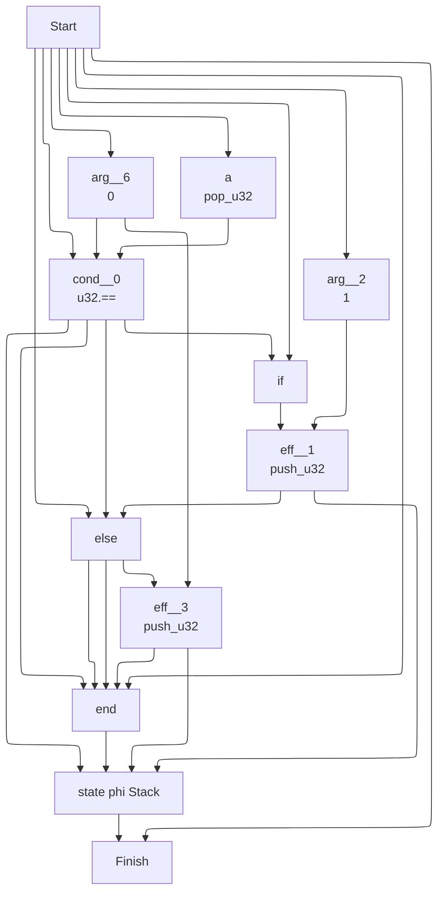

## I32_EQZ

```mermaid
---
config:
  layout: elk
---
graph TD
	1["
	Finish
	"]
	0 --> 1
	11 --> 1
	11["
	state phi Stack 	"]
	4 --> 11
	7 --> 11
	10 --> 11
	8 --> 11
	8["
	eff__3
	push_u32
	"]
	3 --> 8
	6 --> 8
	6["
	else
	"]
	4 --> 6
	0 --> 6
	10 --> 6
	10["
	eff__1
	push_u32
	"]
	9 --> 10
	5 --> 10
	5["
	if
	"]
	4 --> 5
	0 --> 5
	0["
	Start
	"]
	4["
	cond__0
	u32.==
	"]
	2 --> 4
	3 --> 4
	0 --> 4
	3["
	arg__6
	0
	"]
	0 --> 3
	2["
	a
	pop_u32
	"]
	0 --> 2
	9["
	arg__2
	1
	"]
	0 --> 9
	7["
	end
	"]
	4 --> 7
	6 --> 7
	0 --> 7
	8 --> 7
	6 --> 7
```
