## UNREACHABLE
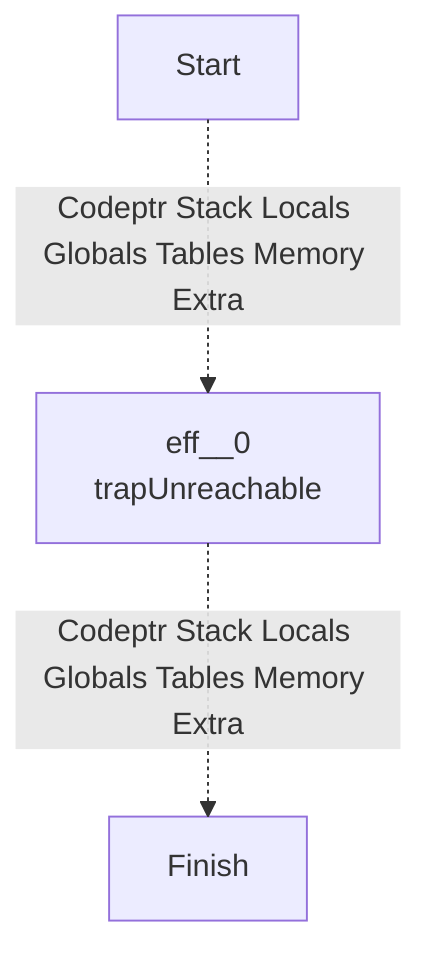
## NOP
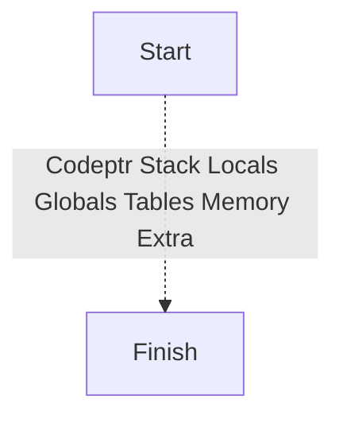
## LOCAL_GET

## LOCAL_SET
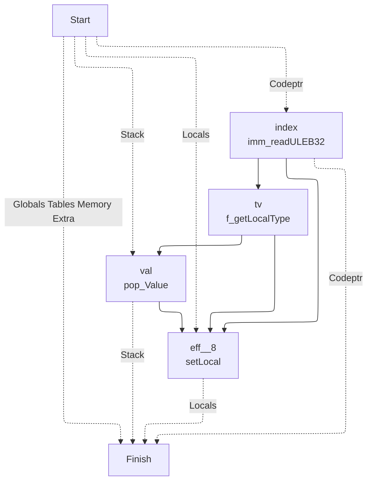
## LOCAL_TEE
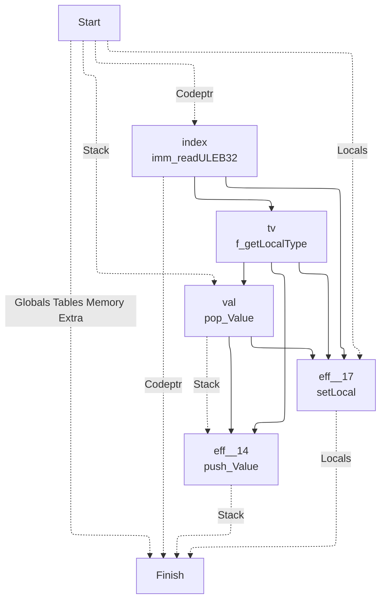
## GLOBAL_GET
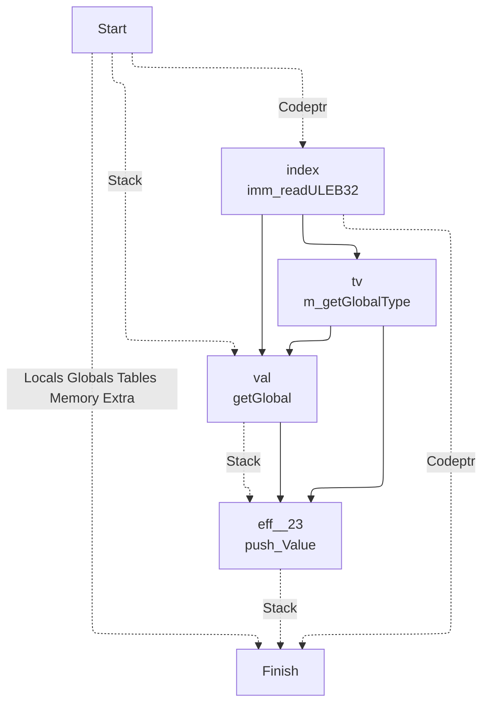
## GLOBAL_SET
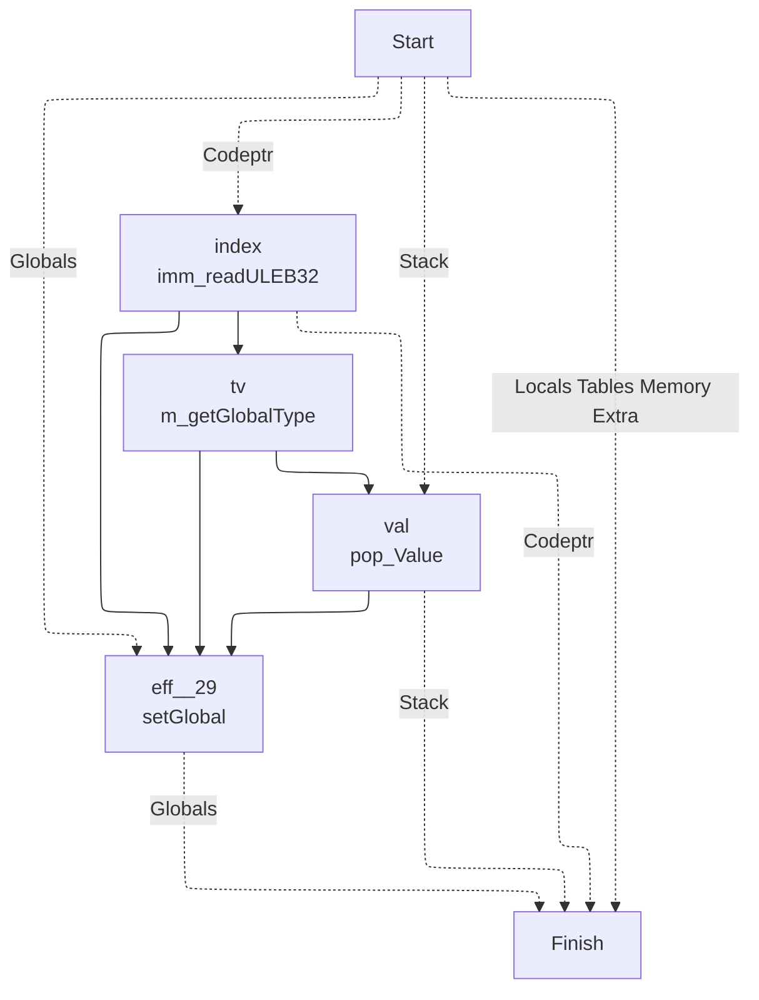
## TABLE_GET

## TABLE_SET
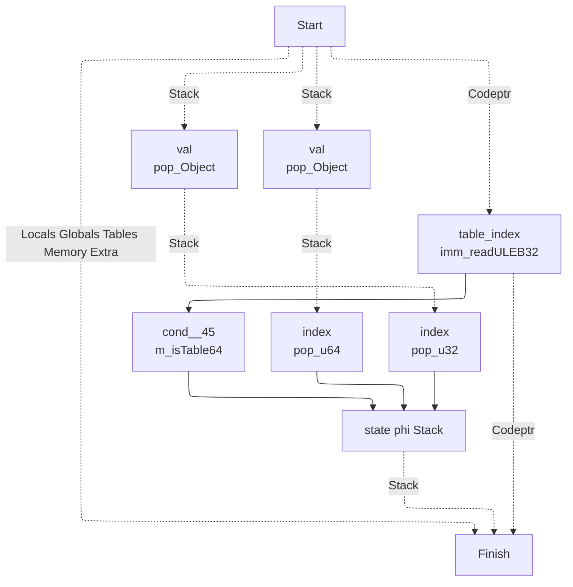
## CALL

## CALL_INDIRECT
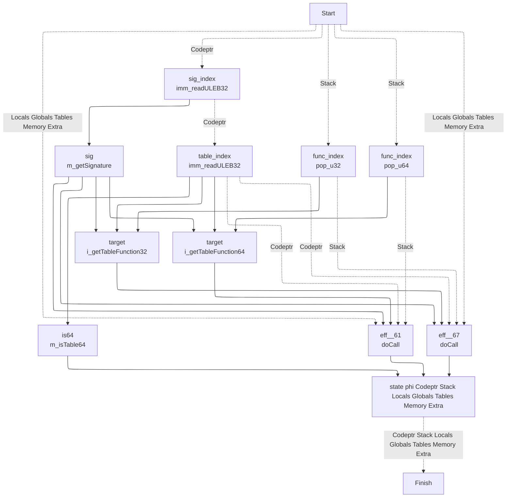
## RETURN_CALL

## DROP
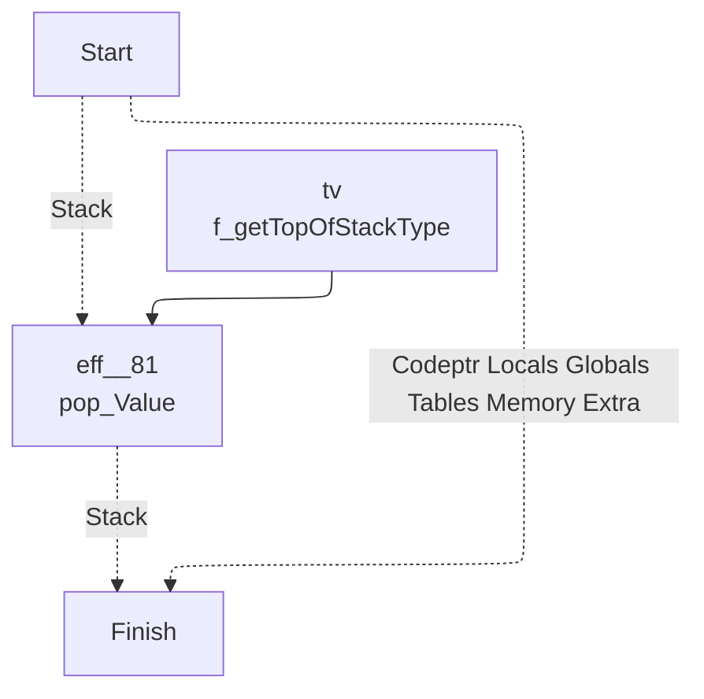
## SELECT
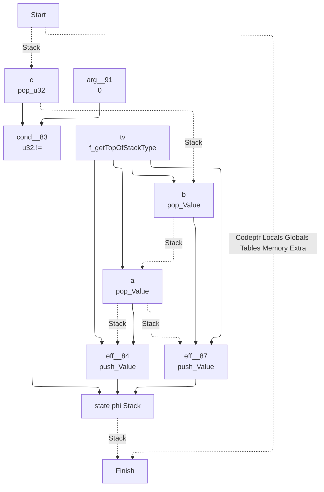
## I32_CONST
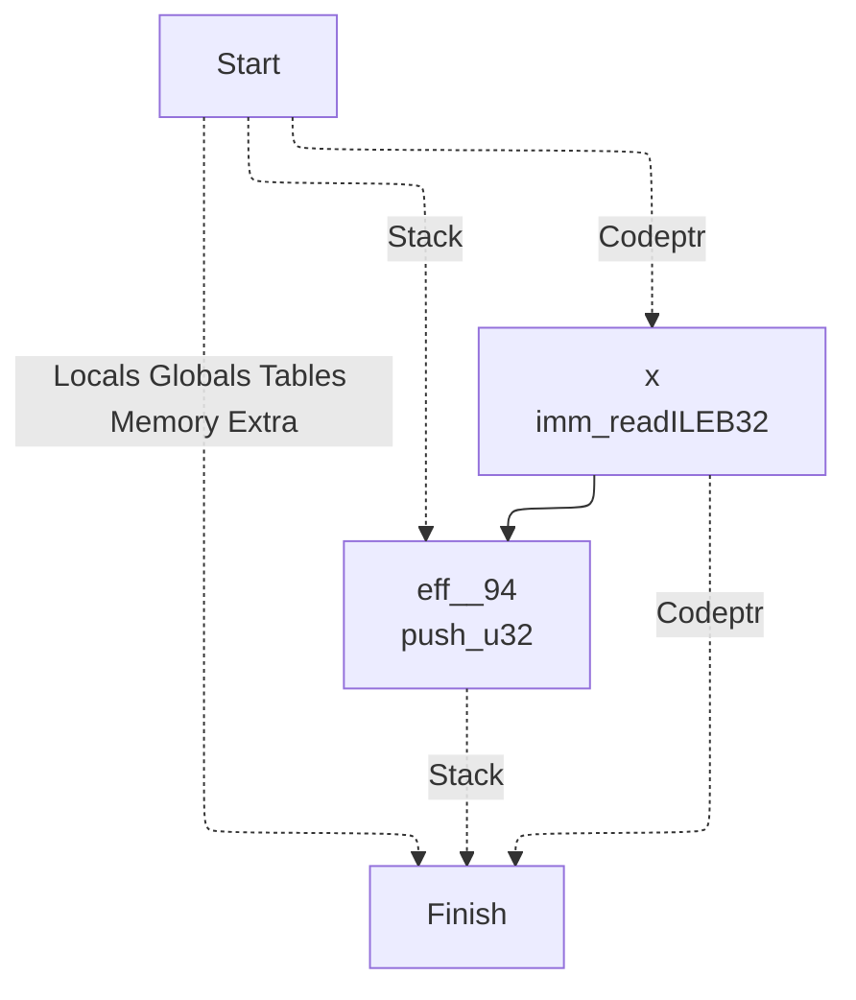
## I32_ADD
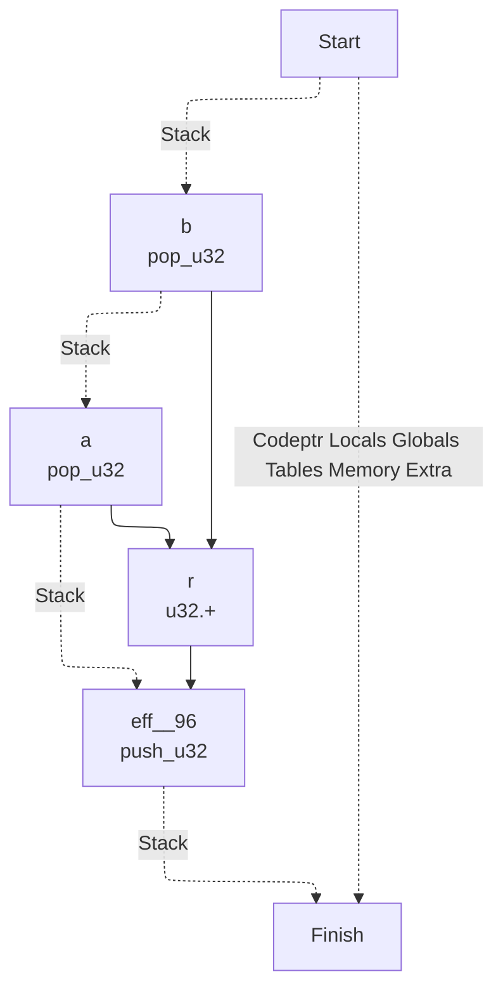
## I32_SUB

## I32_MUL

## I32_DIV_S
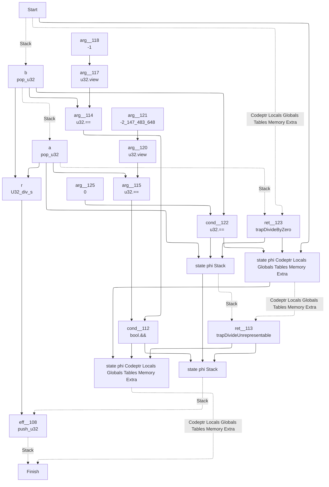
## I32_DIV_U
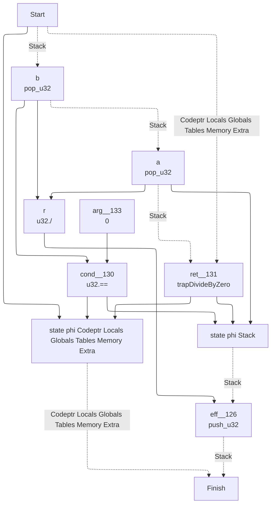
## I32_EQZ
```mermaid
---
config:
  layout: elk
---
graph TD
	1["
	Finish
	"]
	0 -. Codeptr Locals Globals Tables Memory Extra .-> 1
	9 -. Stack .-> 1
	9["
	state phi Stack 	"]
	5 --> 9
	8 --> 9
	6 --> 9
	6["
	eff__137
	push_u32
	"]
	4 --> 6
	3 -. Stack .-> 6
	3["
	a
	pop_u32
	"]
	0 -. Stack .-> 3
	0["
	Start
	"]
	4["
	arg__140
	0
	"]
	8["
	eff__135
	push_u32
	"]
	7 --> 8
	3 -. Stack .-> 8
	7["
	arg__136
	1
	"]
	5["
	cond__134
	u32.==
	"]
	3 --> 5
	4 --> 5
```
## I32_EQ
```mermaid
---
config:
  layout: elk
---
graph TD
	1["
	Finish
	"]
	0 -. Codeptr Locals Globals Tables Memory Extra .-> 1
	10 -. Stack .-> 1
	10["
	state phi Stack 	"]
	5 --> 10
	9 --> 10
	7 --> 10
	7["
	eff__144
	push_u32
	"]
	6 --> 7
	4 -. Stack .-> 7
	4["
	a
	pop_u32
	"]
	3 -. Stack .-> 4
	3["
	b
	pop_u32
	"]
	0 -. Stack .-> 3
	0["
	Start
	"]
	6["
	arg__145
	0
	"]
	9["
	eff__142
	push_u32
	"]
	8 --> 9
	4 -. Stack .-> 9
	8["
	arg__143
	1
	"]
	5["
	cond__141
	u32.==
	"]
	4 --> 5
	3 --> 5
```
## I32_NE
```mermaid
---
config:
  layout: elk
---
graph TD
	1["
	Finish
	"]
	0 -. Codeptr Locals Globals Tables Memory Extra .-> 1
	10 -. Stack .-> 1
	10["
	state phi Stack 	"]
	5 --> 10
	9 --> 10
	7 --> 10
	7["
	eff__151
	push_u32
	"]
	6 --> 7
	4 -. Stack .-> 7
	4["
	a
	pop_u32
	"]
	3 -. Stack .-> 4
	3["
	b
	pop_u32
	"]
	0 -. Stack .-> 3
	0["
	Start
	"]
	6["
	arg__152
	0
	"]
	9["
	eff__149
	push_u32
	"]
	8 --> 9
	4 -. Stack .-> 9
	8["
	arg__150
	1
	"]
	5["
	cond__148
	u32.!=
	"]
	4 --> 5
	3 --> 5
```
## I32_LT_U
```mermaid
---
config:
  layout: elk
---
graph TD
	1["
	Finish
	"]
	0 -. Codeptr Locals Globals Tables Memory Extra .-> 1
	10 -. Stack .-> 1
	10["
	state phi Stack 	"]
	5 --> 10
	9 --> 10
	7 --> 10
	7["
	eff__158
	push_u32
	"]
	6 --> 7
	4 -. Stack .-> 7
	4["
	a
	pop_u32
	"]
	3 -. Stack .-> 4
	3["
	b
	pop_u32
	"]
	0 -. Stack .-> 3
	0["
	Start
	"]
	6["
	arg__159
	0
	"]
	9["
	eff__156
	push_u32
	"]
	8 --> 9
	4 -. Stack .-> 9
	8["
	arg__157
	1
	"]
	5["
	cond__155
	u32.<
	"]
	4 --> 5
	3 --> 5
```
## I32_LT_S
```mermaid
---
config:
  layout: elk
---
graph TD
	1["
	Finish
	"]
	0 -. Codeptr Locals Globals Tables Memory Extra .-> 1
	10 -. Stack .-> 1
	10["
	state phi Stack 	"]
	5 --> 10
	9 --> 10
	7 --> 10
	7["
	eff__165
	push_u32
	"]
	6 --> 7
	4 -. Stack .-> 7
	4["
	a
	pop_u32
	"]
	3 -. Stack .-> 4
	3["
	b
	pop_u32
	"]
	0 -. Stack .-> 3
	0["
	Start
	"]
	6["
	arg__166
	0
	"]
	9["
	eff__163
	push_u32
	"]
	8 --> 9
	4 -. Stack .-> 9
	8["
	arg__164
	1
	"]
	5["
	cond__162
	U32_lt_s
	"]
	4 --> 5
	3 --> 5
```
## I32_LE_S
```mermaid
---
config:
  layout: elk
---
graph TD
	1["
	Finish
	"]
	0 -. Codeptr Locals Globals Tables Memory Extra .-> 1
	10 -. Stack .-> 1
	10["
	state phi Stack 	"]
	5 --> 10
	9 --> 10
	7 --> 10
	7["
	eff__172
	push_u32
	"]
	6 --> 7
	4 -. Stack .-> 7
	4["
	a
	pop_u32
	"]
	3 -. Stack .-> 4
	3["
	b
	pop_u32
	"]
	0 -. Stack .-> 3
	0["
	Start
	"]
	6["
	arg__173
	0
	"]
	9["
	eff__170
	push_u32
	"]
	8 --> 9
	4 -. Stack .-> 9
	8["
	arg__171
	1
	"]
	5["
	cond__169
	U32_le_s
	"]
	4 --> 5
	3 --> 5
```
## I32_GT_U
```mermaid
---
config:
  layout: elk
---
graph TD
	1["
	Finish
	"]
	0 -. Codeptr Locals Globals Tables Memory Extra .-> 1
	10 -. Stack .-> 1
	10["
	state phi Stack 	"]
	5 --> 10
	9 --> 10
	7 --> 10
	7["
	eff__179
	push_u32
	"]
	6 --> 7
	4 -. Stack .-> 7
	4["
	a
	pop_u32
	"]
	3 -. Stack .-> 4
	3["
	b
	pop_u32
	"]
	0 -. Stack .-> 3
	0["
	Start
	"]
	6["
	arg__180
	0
	"]
	9["
	eff__177
	push_u32
	"]
	8 --> 9
	4 -. Stack .-> 9
	8["
	arg__178
	1
	"]
	5["
	cond__176
	u32.>
	"]
	4 --> 5
	3 --> 5
```
## I32_LE_U
```mermaid
---
config:
  layout: elk
---
graph TD
	1["
	Finish
	"]
	0 -. Codeptr Locals Globals Tables Memory Extra .-> 1
	10 -. Stack .-> 1
	10["
	state phi Stack 	"]
	5 --> 10
	9 --> 10
	7 --> 10
	7["
	eff__186
	push_u32
	"]
	6 --> 7
	4 -. Stack .-> 7
	4["
	a
	pop_u32
	"]
	3 -. Stack .-> 4
	3["
	b
	pop_u32
	"]
	0 -. Stack .-> 3
	0["
	Start
	"]
	6["
	arg__187
	0
	"]
	9["
	eff__184
	push_u32
	"]
	8 --> 9
	4 -. Stack .-> 9
	8["
	arg__185
	1
	"]
	5["
	cond__183
	u32.<=
	"]
	4 --> 5
	3 --> 5
```
## I32_GT_S
```mermaid
---
config:
  layout: elk
---
graph TD
	1["
	Finish
	"]
	0 -. Codeptr Locals Globals Tables Memory Extra .-> 1
	10 -. Stack .-> 1
	10["
	state phi Stack 	"]
	5 --> 10
	9 --> 10
	7 --> 10
	7["
	eff__193
	push_u32
	"]
	6 --> 7
	4 -. Stack .-> 7
	4["
	a
	pop_u32
	"]
	3 -. Stack .-> 4
	3["
	b
	pop_u32
	"]
	0 -. Stack .-> 3
	0["
	Start
	"]
	6["
	arg__194
	0
	"]
	9["
	eff__191
	push_u32
	"]
	8 --> 9
	4 -. Stack .-> 9
	8["
	arg__192
	1
	"]
	5["
	cond__190
	U32_gt_s
	"]
	4 --> 5
	3 --> 5
```
## I32_GE_U
```mermaid
---
config:
  layout: elk
---
graph TD
	1["
	Finish
	"]
	0 -. Codeptr Locals Globals Tables Memory Extra .-> 1
	10 -. Stack .-> 1
	10["
	state phi Stack 	"]
	5 --> 10
	9 --> 10
	7 --> 10
	7["
	eff__200
	push_u32
	"]
	6 --> 7
	4 -. Stack .-> 7
	4["
	a
	pop_u32
	"]
	3 -. Stack .-> 4
	3["
	b
	pop_u32
	"]
	0 -. Stack .-> 3
	0["
	Start
	"]
	6["
	arg__201
	0
	"]
	9["
	eff__198
	push_u32
	"]
	8 --> 9
	4 -. Stack .-> 9
	8["
	arg__199
	1
	"]
	5["
	cond__197
	U32_ge_u
	"]
	4 --> 5
	3 --> 5
```
## I32_GE_S
```mermaid
---
config:
  layout: elk
---
graph TD
	1["
	Finish
	"]
	0 -. Codeptr Locals Globals Tables Memory Extra .-> 1
	10 -. Stack .-> 1
	10["
	state phi Stack 	"]
	5 --> 10
	9 --> 10
	7 --> 10
	7["
	eff__207
	push_u32
	"]
	6 --> 7
	4 -. Stack .-> 7
	4["
	a
	pop_u32
	"]
	3 -. Stack .-> 4
	3["
	b
	pop_u32
	"]
	0 -. Stack .-> 3
	0["
	Start
	"]
	6["
	arg__208
	0
	"]
	9["
	eff__205
	push_u32
	"]
	8 --> 9
	4 -. Stack .-> 9
	8["
	arg__206
	1
	"]
	5["
	cond__204
	U32_ge_s
	"]
	4 --> 5
	3 --> 5
```
## I32_AND
```mermaid
---
config:
  layout: elk
---
graph TD
	1["
	Finish
	"]
	0 -. Codeptr Locals Globals Tables Memory Extra .-> 1
	6 -. Stack .-> 1
	6["
	eff__211
	push_u32
	"]
	5 --> 6
	4 -. Stack .-> 6
	4["
	a
	pop_u32
	"]
	3 -. Stack .-> 4
	3["
	b
	pop_u32
	"]
	0 -. Stack .-> 3
	0["
	Start
	"]
	5["
	r
	u32.&
	"]
	4 --> 5
	3 --> 5
```
## I32_OR
```mermaid
---
config:
  layout: elk
---
graph TD
	1["
	Finish
	"]
	0 -. Codeptr Locals Globals Tables Memory Extra .-> 1
	6 -. Stack .-> 1
	6["
	eff__215
	push_u32
	"]
	5 --> 6
	4 -. Stack .-> 6
	4["
	a
	pop_u32
	"]
	3 -. Stack .-> 4
	3["
	b
	pop_u32
	"]
	0 -. Stack .-> 3
	0["
	Start
	"]
	5["
	r
	u32.|
	"]
	4 --> 5
	3 --> 5
```
## I32_XOR
```mermaid
---
config:
  layout: elk
---
graph TD
	1["
	Finish
	"]
	0 -. Codeptr Locals Globals Tables Memory Extra .-> 1
	6 -. Stack .-> 1
	6["
	eff__219
	push_u32
	"]
	5 --> 6
	4 -. Stack .-> 6
	4["
	a
	pop_u32
	"]
	3 -. Stack .-> 4
	3["
	b
	pop_u32
	"]
	0 -. Stack .-> 3
	0["
	Start
	"]
	5["
	r
	u32.^
	"]
	4 --> 5
	3 --> 5
```
## I32_SHL
```mermaid
---
config:
  layout: elk
---
graph TD
	1["
	Finish
	"]
	0 -. Codeptr Locals Globals Tables Memory Extra .-> 1
	6 -. Stack .-> 1
	6["
	eff__223
	push_u32
	"]
	5 --> 6
	4 -. Stack .-> 6
	4["
	a
	pop_u32
	"]
	3 -. Stack .-> 4
	3["
	b
	pop_u32
	"]
	0 -. Stack .-> 3
	0["
	Start
	"]
	5["
	r
	U32_shl
	"]
	4 --> 5
	3 --> 5
```
## I32_SHR_U
```mermaid
---
config:
  layout: elk
---
graph TD
	1["
	Finish
	"]
	0 -. Codeptr Locals Globals Tables Memory Extra .-> 1
	6 -. Stack .-> 1
	6["
	eff__227
	push_u32
	"]
	5 --> 6
	4 -. Stack .-> 6
	4["
	a
	pop_u32
	"]
	3 -. Stack .-> 4
	3["
	b
	pop_u32
	"]
	0 -. Stack .-> 3
	0["
	Start
	"]
	5["
	r
	U32_shr_u
	"]
	4 --> 5
	3 --> 5
```
## I32_SHR_S
```mermaid
---
config:
  layout: elk
---
graph TD
	1["
	Finish
	"]
	0 -. Codeptr Locals Globals Tables Memory Extra .-> 1
	6 -. Stack .-> 1
	6["
	eff__231
	push_u32
	"]
	5 --> 6
	4 -. Stack .-> 6
	4["
	a
	pop_u32
	"]
	3 -. Stack .-> 4
	3["
	b
	pop_u32
	"]
	0 -. Stack .-> 3
	0["
	Start
	"]
	5["
	r
	U32_shr_s
	"]
	4 --> 5
	3 --> 5
```
## I32_ROTL
```mermaid
---
config:
  layout: elk
---
graph TD
	1["
	Finish
	"]
	0 -. Codeptr Locals Globals Tables Memory Extra .-> 1
	6 -. Stack .-> 1
	6["
	eff__235
	push_u32
	"]
	5 --> 6
	4 -. Stack .-> 6
	4["
	a
	pop_u32
	"]
	3 -. Stack .-> 4
	3["
	b
	pop_u32
	"]
	0 -. Stack .-> 3
	0["
	Start
	"]
	5["
	r
	U32_rotl
	"]
	4 --> 5
	3 --> 5
```
## I32_ROTR
```mermaid
---
config:
  layout: elk
---
graph TD
	1["
	Finish
	"]
	0 -. Codeptr Locals Globals Tables Memory Extra .-> 1
	6 -. Stack .-> 1
	6["
	eff__239
	push_u32
	"]
	5 --> 6
	4 -. Stack .-> 6
	4["
	a
	pop_u32
	"]
	3 -. Stack .-> 4
	3["
	b
	pop_u32
	"]
	0 -. Stack .-> 3
	0["
	Start
	"]
	5["
	r
	U32_rotr
	"]
	4 --> 5
	3 --> 5
```
## I32_CLZ
```mermaid
---
config:
  layout: elk
---
graph TD
	1["
	Finish
	"]
	0 -. Codeptr Locals Globals Tables Memory Extra .-> 1
	5 -. Stack .-> 1
	5["
	eff__243
	push_u32
	"]
	4 --> 5
	3 -. Stack .-> 5
	3["
	a
	pop_u32
	"]
	0 -. Stack .-> 3
	0["
	Start
	"]
	4["
	r
	U32_clz
	"]
	3 --> 4
```
## I32_CTZ
```mermaid
---
config:
  layout: elk
---
graph TD
	1["
	Finish
	"]
	0 -. Codeptr Locals Globals Tables Memory Extra .-> 1
	5 -. Stack .-> 1
	5["
	eff__246
	push_u32
	"]
	4 --> 5
	3 -. Stack .-> 5
	3["
	a
	pop_u32
	"]
	0 -. Stack .-> 3
	0["
	Start
	"]
	4["
	r
	U32_ctz
	"]
	3 --> 4
```
## I32_POPCNT
```mermaid
---
config:
  layout: elk
---
graph TD
	1["
	Finish
	"]
	0 -. Codeptr Locals Globals Tables Memory Extra .-> 1
	5 -. Stack .-> 1
	5["
	eff__249
	push_u32
	"]
	4 --> 5
	3 -. Stack .-> 5
	3["
	a
	pop_u32
	"]
	0 -. Stack .-> 3
	0["
	Start
	"]
	4["
	r
	U32_popcnt
	"]
	3 --> 4
```
## I32_REM_S
```mermaid
---
config:
  layout: elk
---
graph TD
	1["
	Finish
	"]
	8 -. Codeptr Locals Globals Tables Memory Extra .-> 1
	11 -. Stack .-> 1
	11["
	eff__252
	push_u32
	"]
	10 --> 11
	9 -. Stack .-> 11
	9["
	state phi Stack 	"]
	6 --> 9
	7 --> 9
	4 --> 9
	4["
	a
	pop_u32
	"]
	3 -. Stack .-> 4
	3["
	b
	pop_u32
	"]
	0 -. Stack .-> 3
	0["
	Start
	"]
	7["
	ret__257
	trapDivideByZero
	"]
	0 -. Codeptr Locals Globals Tables Memory Extra .-> 7
	4 -. Stack .-> 7
	6["
	cond__256
	u32.==
	"]
	3 --> 6
	5 --> 6
	5["
	arg__259
	0
	"]
	10["
	r
	U32_rem_s
	"]
	4 --> 10
	3 --> 10
	8["
	state phi Codeptr Locals Globals Tables Memory Extra 	"]
	6 --> 8
	7 --> 8
	0 --> 8
```
## I32_REM_U
```mermaid
---
config:
  layout: elk
---
graph TD
	1["
	Finish
	"]
	8 -. Codeptr Locals Globals Tables Memory Extra .-> 1
	11 -. Stack .-> 1
	11["
	eff__260
	push_u32
	"]
	10 --> 11
	9 -. Stack .-> 11
	9["
	state phi Stack 	"]
	6 --> 9
	7 --> 9
	4 --> 9
	4["
	a
	pop_u32
	"]
	3 -. Stack .-> 4
	3["
	b
	pop_u32
	"]
	0 -. Stack .-> 3
	0["
	Start
	"]
	7["
	ret__265
	trapDivideByZero
	"]
	0 -. Codeptr Locals Globals Tables Memory Extra .-> 7
	4 -. Stack .-> 7
	6["
	cond__264
	u32.==
	"]
	3 --> 6
	5 --> 6
	5["
	arg__267
	0
	"]
	10["
	r
	U32_rem_u
	"]
	4 --> 10
	3 --> 10
	8["
	state phi Codeptr Locals Globals Tables Memory Extra 	"]
	6 --> 8
	7 --> 8
	0 --> 8
```
## I32_EXTEND8_S
```mermaid
---
config:
  layout: elk
---
graph TD
	1["
	Finish
	"]
	0 -. Codeptr Locals Globals Tables Memory Extra .-> 1
	5 -. Stack .-> 1
	5["
	eff__268
	push_u32
	"]
	4 --> 5
	3 -. Stack .-> 5
	3["
	a
	pop_u32
	"]
	0 -. Stack .-> 3
	0["
	Start
	"]
	4["
	r
	U32_extend8_s
	"]
	3 --> 4
```
## I32_EXTEND16_S
```mermaid
---
config:
  layout: elk
---
graph TD
	1["
	Finish
	"]
	0 -. Codeptr Locals Globals Tables Memory Extra .-> 1
	5 -. Stack .-> 1
	5["
	eff__271
	push_u32
	"]
	4 --> 5
	3 -. Stack .-> 5
	3["
	a
	pop_u32
	"]
	0 -. Stack .-> 3
	0["
	Start
	"]
	4["
	r
	U32_extend16_s
	"]
	3 --> 4
```
## I64_CONST
```mermaid
---
config:
  layout: elk
---
graph TD
	1["
	Finish
	"]
	3 -. Codeptr .-> 1
	4 -. Stack .-> 1
	0 -. Locals Globals Tables Memory Extra .-> 1
	0["
	Start
	"]
	4["
	eff__274
	push_u64
	"]
	3 --> 4
	0 -. Stack .-> 4
	3["
	x
	imm_readILEB64
	"]
	0 -. Codeptr .-> 3
```
## I64_ADD
```mermaid
---
config:
  layout: elk
---
graph TD
	1["
	Finish
	"]
	0 -. Codeptr Locals Globals Tables Memory Extra .-> 1
	6 -. Stack .-> 1
	6["
	eff__276
	push_u64
	"]
	5 --> 6
	4 -. Stack .-> 6
	4["
	a
	pop_u64
	"]
	3 -. Stack .-> 4
	3["
	b
	pop_u64
	"]
	0 -. Stack .-> 3
	0["
	Start
	"]
	5["
	r
	u64.+
	"]
	4 --> 5
	3 --> 5
```
## I64_SUB
```mermaid
---
config:
  layout: elk
---
graph TD
	1["
	Finish
	"]
	0 -. Codeptr Locals Globals Tables Memory Extra .-> 1
	6 -. Stack .-> 1
	6["
	eff__280
	push_u64
	"]
	5 --> 6
	4 -. Stack .-> 6
	4["
	a
	pop_u64
	"]
	3 -. Stack .-> 4
	3["
	b
	pop_u64
	"]
	0 -. Stack .-> 3
	0["
	Start
	"]
	5["
	r
	u64.-
	"]
	4 --> 5
	3 --> 5
```
## I64_MUL
```mermaid
---
config:
  layout: elk
---
graph TD
	1["
	Finish
	"]
	0 -. Codeptr Locals Globals Tables Memory Extra .-> 1
	6 -. Stack .-> 1
	6["
	eff__284
	push_u64
	"]
	5 --> 6
	4 -. Stack .-> 6
	4["
	a
	pop_u64
	"]
	3 -. Stack .-> 4
	3["
	b
	pop_u64
	"]
	0 -. Stack .-> 3
	0["
	Start
	"]
	5["
	r
	u64.*
	"]
	4 --> 5
	3 --> 5
```
## I64_DIV_S
```mermaid
---
config:
  layout: elk
---
graph TD
	1["
	Finish
	"]
	18 -. Codeptr Locals Globals Tables Memory Extra .-> 1
	21 -. Stack .-> 1
	21["
	eff__288
	push_u64
	"]
	20 --> 21
	19 -. Stack .-> 21
	19["
	state phi Stack 	"]
	16 --> 19
	17 --> 19
	9 --> 19
	9["
	state phi Stack 	"]
	6 --> 9
	7 --> 9
	4 --> 9
	4["
	a
	pop_u64
	"]
	3 -. Stack .-> 4
	3["
	b
	pop_u64
	"]
	0 -. Stack .-> 3
	0["
	Start
	"]
	7["
	ret__303
	trapDivideByZero
	"]
	0 -. Codeptr Locals Globals Tables Memory Extra .-> 7
	4 -. Stack .-> 7
	6["
	cond__302
	u64.==
	"]
	3 --> 6
	5 --> 6
	5["
	arg__305
	0
	"]
	17["
	ret__293
	trapDivideUnrepresentable
	"]
	8 -. Codeptr Locals Globals Tables Memory Extra .-> 17
	9 -. Stack .-> 17
	8["
	state phi Codeptr Locals Globals Tables Memory Extra 	"]
	6 --> 8
	7 --> 8
	0 --> 8
	16["
	cond__292
	bool.&&
	"]
	15 --> 16
	12 --> 16
	12["
	arg__295
	u64.==
	"]
	4 --> 12
	11 --> 12
	11["
	arg__300
	u64.view
	"]
	10 --> 11
	10["
	arg__301
	-9223372036854775808L
	"]
	15["
	arg__294
	u64.==
	"]
	3 --> 15
	14 --> 15
	14["
	arg__297
	u64.view
	"]
	13 --> 14
	13["
	arg__298
	-1
	"]
	20["
	r
	U64_div_s
	"]
	4 --> 20
	3 --> 20
	18["
	state phi Codeptr Locals Globals Tables Memory Extra 	"]
	16 --> 18
	17 --> 18
	8 --> 18
```
## I64_DIV_U
```mermaid
---
config:
  layout: elk
---
graph TD
	1["
	Finish
	"]
	8 -. Codeptr Locals Globals Tables Memory Extra .-> 1
	11 -. Stack .-> 1
	11["
	eff__306
	push_u64
	"]
	10 --> 11
	9 -. Stack .-> 11
	9["
	state phi Stack 	"]
	6 --> 9
	7 --> 9
	4 --> 9
	4["
	a
	pop_u64
	"]
	3 -. Stack .-> 4
	3["
	b
	pop_u64
	"]
	0 -. Stack .-> 3
	0["
	Start
	"]
	7["
	ret__311
	trapDivideByZero
	"]
	0 -. Codeptr Locals Globals Tables Memory Extra .-> 7
	4 -. Stack .-> 7
	6["
	cond__310
	u64.==
	"]
	3 --> 6
	5 --> 6
	5["
	arg__313
	0
	"]
	10["
	r
	u64./
	"]
	4 --> 10
	3 --> 10
	8["
	state phi Codeptr Locals Globals Tables Memory Extra 	"]
	6 --> 8
	7 --> 8
	0 --> 8
```
## I64_REM_S
```mermaid
---
config:
  layout: elk
---
graph TD
	1["
	Finish
	"]
	8 -. Codeptr Locals Globals Tables Memory Extra .-> 1
	11 -. Stack .-> 1
	11["
	eff__314
	push_u64
	"]
	10 --> 11
	9 -. Stack .-> 11
	9["
	state phi Stack 	"]
	6 --> 9
	7 --> 9
	4 --> 9
	4["
	a
	pop_u64
	"]
	3 -. Stack .-> 4
	3["
	b
	pop_u64
	"]
	0 -. Stack .-> 3
	0["
	Start
	"]
	7["
	ret__319
	trapDivideByZero
	"]
	0 -. Codeptr Locals Globals Tables Memory Extra .-> 7
	4 -. Stack .-> 7
	6["
	cond__318
	u64.==
	"]
	3 --> 6
	5 --> 6
	5["
	arg__321
	0
	"]
	10["
	r
	U64_rem_s
	"]
	4 --> 10
	3 --> 10
	8["
	state phi Codeptr Locals Globals Tables Memory Extra 	"]
	6 --> 8
	7 --> 8
	0 --> 8
```
## I64_REM_U
```mermaid
---
config:
  layout: elk
---
graph TD
	1["
	Finish
	"]
	8 -. Codeptr Locals Globals Tables Memory Extra .-> 1
	11 -. Stack .-> 1
	11["
	eff__322
	push_u64
	"]
	10 --> 11
	9 -. Stack .-> 11
	9["
	state phi Stack 	"]
	6 --> 9
	7 --> 9
	4 --> 9
	4["
	a
	pop_u64
	"]
	3 -. Stack .-> 4
	3["
	b
	pop_u64
	"]
	0 -. Stack .-> 3
	0["
	Start
	"]
	7["
	ret__327
	trapDivideByZero
	"]
	0 -. Codeptr Locals Globals Tables Memory Extra .-> 7
	4 -. Stack .-> 7
	6["
	cond__326
	u64.==
	"]
	3 --> 6
	5 --> 6
	5["
	arg__329
	0
	"]
	10["
	r
	U64_rem_u
	"]
	4 --> 10
	3 --> 10
	8["
	state phi Codeptr Locals Globals Tables Memory Extra 	"]
	6 --> 8
	7 --> 8
	0 --> 8
```
## I64_AND
```mermaid
---
config:
  layout: elk
---
graph TD
	1["
	Finish
	"]
	0 -. Codeptr Locals Globals Tables Memory Extra .-> 1
	6 -. Stack .-> 1
	6["
	eff__330
	push_u64
	"]
	5 --> 6
	4 -. Stack .-> 6
	4["
	a
	pop_u64
	"]
	3 -. Stack .-> 4
	3["
	b
	pop_u64
	"]
	0 -. Stack .-> 3
	0["
	Start
	"]
	5["
	r
	u64.&
	"]
	4 --> 5
	3 --> 5
```
## I64_OR
```mermaid
---
config:
  layout: elk
---
graph TD
	1["
	Finish
	"]
	0 -. Codeptr Locals Globals Tables Memory Extra .-> 1
	6 -. Stack .-> 1
	6["
	eff__334
	push_u64
	"]
	5 --> 6
	4 -. Stack .-> 6
	4["
	a
	pop_u64
	"]
	3 -. Stack .-> 4
	3["
	b
	pop_u64
	"]
	0 -. Stack .-> 3
	0["
	Start
	"]
	5["
	r
	u64.|
	"]
	4 --> 5
	3 --> 5
```
## I64_XOR
```mermaid
---
config:
  layout: elk
---
graph TD
	1["
	Finish
	"]
	0 -. Codeptr Locals Globals Tables Memory Extra .-> 1
	6 -. Stack .-> 1
	6["
	eff__338
	push_u64
	"]
	5 --> 6
	4 -. Stack .-> 6
	4["
	a
	pop_u64
	"]
	3 -. Stack .-> 4
	3["
	b
	pop_u64
	"]
	0 -. Stack .-> 3
	0["
	Start
	"]
	5["
	r
	u64.^
	"]
	4 --> 5
	3 --> 5
```
## I64_SHL
```mermaid
---
config:
  layout: elk
---
graph TD
	1["
	Finish
	"]
	0 -. Codeptr Locals Globals Tables Memory Extra .-> 1
	6 -. Stack .-> 1
	6["
	eff__342
	push_u64
	"]
	5 --> 6
	4 -. Stack .-> 6
	4["
	a
	pop_u64
	"]
	3 -. Stack .-> 4
	3["
	b
	pop_u64
	"]
	0 -. Stack .-> 3
	0["
	Start
	"]
	5["
	r
	U64_shl
	"]
	4 --> 5
	3 --> 5
```
## I64_SHR_U
```mermaid
---
config:
  layout: elk
---
graph TD
	1["
	Finish
	"]
	0 -. Codeptr Locals Globals Tables Memory Extra .-> 1
	6 -. Stack .-> 1
	6["
	eff__346
	push_u64
	"]
	5 --> 6
	4 -. Stack .-> 6
	4["
	a
	pop_u64
	"]
	3 -. Stack .-> 4
	3["
	b
	pop_u64
	"]
	0 -. Stack .-> 3
	0["
	Start
	"]
	5["
	r
	U64_shr_u
	"]
	4 --> 5
	3 --> 5
```
## I64_SHR_S
```mermaid
---
config:
  layout: elk
---
graph TD
	1["
	Finish
	"]
	0 -. Codeptr Locals Globals Tables Memory Extra .-> 1
	6 -. Stack .-> 1
	6["
	eff__350
	push_u64
	"]
	5 --> 6
	4 -. Stack .-> 6
	4["
	a
	pop_u64
	"]
	3 -. Stack .-> 4
	3["
	b
	pop_u64
	"]
	0 -. Stack .-> 3
	0["
	Start
	"]
	5["
	r
	U64_shr_s
	"]
	4 --> 5
	3 --> 5
```
## I64_ROTL
```mermaid
---
config:
  layout: elk
---
graph TD
	1["
	Finish
	"]
	0 -. Codeptr Locals Globals Tables Memory Extra .-> 1
	6 -. Stack .-> 1
	6["
	eff__354
	push_u64
	"]
	5 --> 6
	4 -. Stack .-> 6
	4["
	a
	pop_u64
	"]
	3 -. Stack .-> 4
	3["
	b
	pop_u64
	"]
	0 -. Stack .-> 3
	0["
	Start
	"]
	5["
	r
	U64_rotl
	"]
	4 --> 5
	3 --> 5
```
## I64_ROTR
```mermaid
---
config:
  layout: elk
---
graph TD
	1["
	Finish
	"]
	0 -. Codeptr Locals Globals Tables Memory Extra .-> 1
	6 -. Stack .-> 1
	6["
	eff__358
	push_u64
	"]
	5 --> 6
	4 -. Stack .-> 6
	4["
	a
	pop_u64
	"]
	3 -. Stack .-> 4
	3["
	b
	pop_u64
	"]
	0 -. Stack .-> 3
	0["
	Start
	"]
	5["
	r
	U64_rotr
	"]
	4 --> 5
	3 --> 5
```
## I64_CLZ
```mermaid
---
config:
  layout: elk
---
graph TD
	1["
	Finish
	"]
	0 -. Codeptr Locals Globals Tables Memory Extra .-> 1
	5 -. Stack .-> 1
	5["
	eff__362
	push_u64
	"]
	4 --> 5
	3 -. Stack .-> 5
	3["
	a
	pop_u64
	"]
	0 -. Stack .-> 3
	0["
	Start
	"]
	4["
	r
	U64_clz
	"]
	3 --> 4
```
## I64_CTZ
```mermaid
---
config:
  layout: elk
---
graph TD
	1["
	Finish
	"]
	0 -. Codeptr Locals Globals Tables Memory Extra .-> 1
	5 -. Stack .-> 1
	5["
	eff__365
	push_u64
	"]
	4 --> 5
	3 -. Stack .-> 5
	3["
	a
	pop_u64
	"]
	0 -. Stack .-> 3
	0["
	Start
	"]
	4["
	r
	U64_ctz
	"]
	3 --> 4
```
## I64_POPCNT
```mermaid
---
config:
  layout: elk
---
graph TD
	1["
	Finish
	"]
	0 -. Codeptr Locals Globals Tables Memory Extra .-> 1
	5 -. Stack .-> 1
	5["
	eff__368
	push_u64
	"]
	4 --> 5
	3 -. Stack .-> 5
	3["
	a
	pop_u64
	"]
	0 -. Stack .-> 3
	0["
	Start
	"]
	4["
	r
	U64_popcnt
	"]
	3 --> 4
```
## I64_EQZ
```mermaid
---
config:
  layout: elk
---
graph TD
	1["
	Finish
	"]
	0 -. Codeptr Locals Globals Tables Memory Extra .-> 1
	9 -. Stack .-> 1
	9["
	state phi Stack 	"]
	5 --> 9
	8 --> 9
	6 --> 9
	6["
	eff__374
	push_u32
	"]
	4 --> 6
	3 -. Stack .-> 6
	3["
	a
	pop_u64
	"]
	0 -. Stack .-> 3
	0["
	Start
	"]
	4["
	arg__377
	0
	"]
	8["
	eff__372
	push_u32
	"]
	7 --> 8
	3 -. Stack .-> 8
	7["
	arg__373
	1
	"]
	5["
	cond__371
	u64.==
	"]
	3 --> 5
	4 --> 5
```
## I64_EQ
```mermaid
---
config:
  layout: elk
---
graph TD
	1["
	Finish
	"]
	0 -. Codeptr Locals Globals Tables Memory Extra .-> 1
	10 -. Stack .-> 1
	10["
	state phi Stack 	"]
	5 --> 10
	9 --> 10
	7 --> 10
	7["
	eff__381
	push_u32
	"]
	6 --> 7
	4 -. Stack .-> 7
	4["
	a
	pop_u64
	"]
	3 -. Stack .-> 4
	3["
	b
	pop_u64
	"]
	0 -. Stack .-> 3
	0["
	Start
	"]
	6["
	arg__382
	0
	"]
	9["
	eff__379
	push_u32
	"]
	8 --> 9
	4 -. Stack .-> 9
	8["
	arg__380
	1
	"]
	5["
	cond__378
	u64.==
	"]
	4 --> 5
	3 --> 5
```
## I64_NE
```mermaid
---
config:
  layout: elk
---
graph TD
	1["
	Finish
	"]
	0 -. Codeptr Locals Globals Tables Memory Extra .-> 1
	10 -. Stack .-> 1
	10["
	state phi Stack 	"]
	5 --> 10
	9 --> 10
	7 --> 10
	7["
	eff__388
	push_u32
	"]
	6 --> 7
	4 -. Stack .-> 7
	4["
	a
	pop_u64
	"]
	3 -. Stack .-> 4
	3["
	b
	pop_u64
	"]
	0 -. Stack .-> 3
	0["
	Start
	"]
	6["
	arg__389
	0
	"]
	9["
	eff__386
	push_u32
	"]
	8 --> 9
	4 -. Stack .-> 9
	8["
	arg__387
	1
	"]
	5["
	cond__385
	u64.!=
	"]
	4 --> 5
	3 --> 5
```
## I64_LT_S
```mermaid
---
config:
  layout: elk
---
graph TD
	1["
	Finish
	"]
	0 -. Codeptr Locals Globals Tables Memory Extra .-> 1
	10 -. Stack .-> 1
	10["
	state phi Stack 	"]
	5 --> 10
	9 --> 10
	7 --> 10
	7["
	eff__395
	push_u32
	"]
	6 --> 7
	4 -. Stack .-> 7
	4["
	a
	pop_u64
	"]
	3 -. Stack .-> 4
	3["
	b
	pop_u64
	"]
	0 -. Stack .-> 3
	0["
	Start
	"]
	6["
	arg__396
	0
	"]
	9["
	eff__393
	push_u32
	"]
	8 --> 9
	4 -. Stack .-> 9
	8["
	arg__394
	1
	"]
	5["
	cond__392
	U64_lt_s
	"]
	4 --> 5
	3 --> 5
```
## I64_LT_U
```mermaid
---
config:
  layout: elk
---
graph TD
	1["
	Finish
	"]
	0 -. Codeptr Locals Globals Tables Memory Extra .-> 1
	10 -. Stack .-> 1
	10["
	state phi Stack 	"]
	5 --> 10
	9 --> 10
	7 --> 10
	7["
	eff__402
	push_u32
	"]
	6 --> 7
	4 -. Stack .-> 7
	4["
	a
	pop_u64
	"]
	3 -. Stack .-> 4
	3["
	b
	pop_u64
	"]
	0 -. Stack .-> 3
	0["
	Start
	"]
	6["
	arg__403
	0
	"]
	9["
	eff__400
	push_u32
	"]
	8 --> 9
	4 -. Stack .-> 9
	8["
	arg__401
	1
	"]
	5["
	cond__399
	u64.<
	"]
	4 --> 5
	3 --> 5
```
## I64_LE_S
```mermaid
---
config:
  layout: elk
---
graph TD
	1["
	Finish
	"]
	0 -. Codeptr Locals Globals Tables Memory Extra .-> 1
	10 -. Stack .-> 1
	10["
	state phi Stack 	"]
	5 --> 10
	9 --> 10
	7 --> 10
	7["
	eff__409
	push_u32
	"]
	6 --> 7
	4 -. Stack .-> 7
	4["
	a
	pop_u64
	"]
	3 -. Stack .-> 4
	3["
	b
	pop_u64
	"]
	0 -. Stack .-> 3
	0["
	Start
	"]
	6["
	arg__410
	0
	"]
	9["
	eff__407
	push_u32
	"]
	8 --> 9
	4 -. Stack .-> 9
	8["
	arg__408
	1
	"]
	5["
	cond__406
	U64_le_s
	"]
	4 --> 5
	3 --> 5
```
## I64_LE_U
```mermaid
---
config:
  layout: elk
---
graph TD
	1["
	Finish
	"]
	0 -. Codeptr Locals Globals Tables Memory Extra .-> 1
	10 -. Stack .-> 1
	10["
	state phi Stack 	"]
	5 --> 10
	9 --> 10
	7 --> 10
	7["
	eff__416
	push_u32
	"]
	6 --> 7
	4 -. Stack .-> 7
	4["
	a
	pop_u64
	"]
	3 -. Stack .-> 4
	3["
	b
	pop_u64
	"]
	0 -. Stack .-> 3
	0["
	Start
	"]
	6["
	arg__417
	0
	"]
	9["
	eff__414
	push_u32
	"]
	8 --> 9
	4 -. Stack .-> 9
	8["
	arg__415
	1
	"]
	5["
	cond__413
	u64.<=
	"]
	4 --> 5
	3 --> 5
```
## I64_GT_S
```mermaid
---
config:
  layout: elk
---
graph TD
	1["
	Finish
	"]
	0 -. Codeptr Locals Globals Tables Memory Extra .-> 1
	10 -. Stack .-> 1
	10["
	state phi Stack 	"]
	5 --> 10
	9 --> 10
	7 --> 10
	7["
	eff__423
	push_u32
	"]
	6 --> 7
	4 -. Stack .-> 7
	4["
	a
	pop_u64
	"]
	3 -. Stack .-> 4
	3["
	b
	pop_u64
	"]
	0 -. Stack .-> 3
	0["
	Start
	"]
	6["
	arg__424
	0
	"]
	9["
	eff__421
	push_u32
	"]
	8 --> 9
	4 -. Stack .-> 9
	8["
	arg__422
	1
	"]
	5["
	cond__420
	U64_gt_s
	"]
	4 --> 5
	3 --> 5
```
## I64_GT_U
```mermaid
---
config:
  layout: elk
---
graph TD
	1["
	Finish
	"]
	0 -. Codeptr Locals Globals Tables Memory Extra .-> 1
	10 -. Stack .-> 1
	10["
	state phi Stack 	"]
	5 --> 10
	9 --> 10
	7 --> 10
	7["
	eff__430
	push_u32
	"]
	6 --> 7
	4 -. Stack .-> 7
	4["
	a
	pop_u64
	"]
	3 -. Stack .-> 4
	3["
	b
	pop_u64
	"]
	0 -. Stack .-> 3
	0["
	Start
	"]
	6["
	arg__431
	0
	"]
	9["
	eff__428
	push_u32
	"]
	8 --> 9
	4 -. Stack .-> 9
	8["
	arg__429
	1
	"]
	5["
	cond__427
	u64.>
	"]
	4 --> 5
	3 --> 5
```
## I64_GE_S
```mermaid
---
config:
  layout: elk
---
graph TD
	1["
	Finish
	"]
	0 -. Codeptr Locals Globals Tables Memory Extra .-> 1
	10 -. Stack .-> 1
	10["
	state phi Stack 	"]
	5 --> 10
	9 --> 10
	7 --> 10
	7["
	eff__437
	push_u32
	"]
	6 --> 7
	4 -. Stack .-> 7
	4["
	a
	pop_u64
	"]
	3 -. Stack .-> 4
	3["
	b
	pop_u64
	"]
	0 -. Stack .-> 3
	0["
	Start
	"]
	6["
	arg__438
	0
	"]
	9["
	eff__435
	push_u32
	"]
	8 --> 9
	4 -. Stack .-> 9
	8["
	arg__436
	1
	"]
	5["
	cond__434
	U64_ge_s
	"]
	4 --> 5
	3 --> 5
```
## I64_GE_U
```mermaid
---
config:
  layout: elk
---
graph TD
	1["
	Finish
	"]
	0 -. Codeptr Locals Globals Tables Memory Extra .-> 1
	10 -. Stack .-> 1
	10["
	state phi Stack 	"]
	5 --> 10
	9 --> 10
	7 --> 10
	7["
	eff__444
	push_u32
	"]
	6 --> 7
	4 -. Stack .-> 7
	4["
	a
	pop_u64
	"]
	3 -. Stack .-> 4
	3["
	b
	pop_u64
	"]
	0 -. Stack .-> 3
	0["
	Start
	"]
	6["
	arg__445
	0
	"]
	9["
	eff__442
	push_u32
	"]
	8 --> 9
	4 -. Stack .-> 9
	8["
	arg__443
	1
	"]
	5["
	cond__441
	U64_ge_u
	"]
	4 --> 5
	3 --> 5
```
## I64_EXTEND8_S
```mermaid
---
config:
  layout: elk
---
graph TD
	1["
	Finish
	"]
	0 -. Codeptr Locals Globals Tables Memory Extra .-> 1
	5 -. Stack .-> 1
	5["
	eff__448
	push_u64
	"]
	4 --> 5
	3 -. Stack .-> 5
	3["
	a
	pop_u64
	"]
	0 -. Stack .-> 3
	0["
	Start
	"]
	4["
	r
	U64_extend8_s
	"]
	3 --> 4
```
## I64_EXTEND16_S
```mermaid
---
config:
  layout: elk
---
graph TD
	1["
	Finish
	"]
	0 -. Codeptr Locals Globals Tables Memory Extra .-> 1
	5 -. Stack .-> 1
	5["
	eff__451
	push_u64
	"]
	4 --> 5
	3 -. Stack .-> 5
	3["
	a
	pop_u64
	"]
	0 -. Stack .-> 3
	0["
	Start
	"]
	4["
	r
	U64_extend16_s
	"]
	3 --> 4
```
## I64_EXTEND32_S
```mermaid
---
config:
  layout: elk
---
graph TD
	1["
	Finish
	"]
	0 -. Codeptr Locals Globals Tables Memory Extra .-> 1
	5 -. Stack .-> 1
	5["
	eff__454
	push_u64
	"]
	4 --> 5
	3 -. Stack .-> 5
	3["
	a
	pop_u64
	"]
	0 -. Stack .-> 3
	0["
	Start
	"]
	4["
	r
	U64_extend32_s
	"]
	3 --> 4
```
## F32_CONST
```mermaid
---
config:
  layout: elk
---
graph TD
	1["
	Finish
	"]
	3 -. Codeptr .-> 1
	5 -. Stack .-> 1
	0 -. Locals Globals Tables Memory Extra .-> 1
	0["
	Start
	"]
	5["
	eff__457
	push_f32
	"]
	4 --> 5
	0 -. Stack .-> 5
	4["
	arg__458
	f32_reinterpret_u32
	"]
	3 --> 4
	3["
	x
	imm_readULEB32
	"]
	0 -. Codeptr .-> 3
```
## F32_ADD
```mermaid
---
config:
  layout: elk
---
graph TD
	1["
	Finish
	"]
	0 -. Codeptr Locals Globals Tables Memory Extra .-> 1
	6 -. Stack .-> 1
	6["
	eff__460
	push_f32
	"]
	5 --> 6
	4 -. Stack .-> 6
	4["
	a
	pop_f32
	"]
	3 -. Stack .-> 4
	3["
	b
	pop_f32
	"]
	0 -. Stack .-> 3
	0["
	Start
	"]
	5["
	r
	float.+
	"]
	4 --> 5
	3 --> 5
```
## F32_SUB
```mermaid
---
config:
  layout: elk
---
graph TD
	1["
	Finish
	"]
	0 -. Codeptr Locals Globals Tables Memory Extra .-> 1
	6 -. Stack .-> 1
	6["
	eff__464
	push_f32
	"]
	5 --> 6
	4 -. Stack .-> 6
	4["
	a
	pop_f32
	"]
	3 -. Stack .-> 4
	3["
	b
	pop_f32
	"]
	0 -. Stack .-> 3
	0["
	Start
	"]
	5["
	r
	float.-
	"]
	4 --> 5
	3 --> 5
```
## F32_MUL
```mermaid
---
config:
  layout: elk
---
graph TD
	1["
	Finish
	"]
	0 -. Codeptr Locals Globals Tables Memory Extra .-> 1
	6 -. Stack .-> 1
	6["
	eff__468
	push_f32
	"]
	5 --> 6
	4 -. Stack .-> 6
	4["
	a
	pop_f32
	"]
	3 -. Stack .-> 4
	3["
	b
	pop_f32
	"]
	0 -. Stack .-> 3
	0["
	Start
	"]
	5["
	r
	float.*
	"]
	4 --> 5
	3 --> 5
```
## F32_DIV
```mermaid
---
config:
  layout: elk
---
graph TD
	1["
	Finish
	"]
	8 -. Codeptr Locals Globals Tables Memory Extra .-> 1
	11 -. Stack .-> 1
	11["
	eff__472
	push_f32
	"]
	10 --> 11
	9 -. Stack .-> 11
	9["
	state phi Stack 	"]
	6 --> 9
	7 --> 9
	4 --> 9
	4["
	a
	pop_f32
	"]
	3 -. Stack .-> 4
	3["
	b
	pop_f32
	"]
	0 -. Stack .-> 3
	0["
	Start
	"]
	7["
	ret__477
	trapDivideByZero
	"]
	0 -. Codeptr Locals Globals Tables Memory Extra .-> 7
	4 -. Stack .-> 7
	6["
	cond__476
	float.==
	"]
	3 --> 6
	5 --> 6
	5["
	arg__479
	0.0f
	"]
	10["
	r
	float./
	"]
	4 --> 10
	3 --> 10
	8["
	state phi Codeptr Locals Globals Tables Memory Extra 	"]
	6 --> 8
	7 --> 8
	0 --> 8
```
## F32_SQRT
```mermaid
---
config:
  layout: elk
---
graph TD
	1["
	Finish
	"]
	0 -. Codeptr Locals Globals Tables Memory Extra .-> 1
	5 -. Stack .-> 1
	5["
	eff__480
	push_f32
	"]
	4 --> 5
	3 -. Stack .-> 5
	3["
	a
	pop_f32
	"]
	0 -. Stack .-> 3
	0["
	Start
	"]
	4["
	r
	float.sqrt
	"]
	3 --> 4
```
## F32_EQ
```mermaid
---
config:
  layout: elk
---
graph TD
	1["
	Finish
	"]
	0 -. Codeptr Locals Globals Tables Memory Extra .-> 1
	10 -. Stack .-> 1
	10["
	state phi Stack 	"]
	5 --> 10
	9 --> 10
	7 --> 10
	7["
	eff__486
	push_u32
	"]
	6 --> 7
	4 -. Stack .-> 7
	4["
	a
	pop_f32
	"]
	3 -. Stack .-> 4
	3["
	b
	pop_f32
	"]
	0 -. Stack .-> 3
	0["
	Start
	"]
	6["
	arg__487
	0
	"]
	9["
	eff__484
	push_u32
	"]
	8 --> 9
	4 -. Stack .-> 9
	8["
	arg__485
	1
	"]
	5["
	cond__483
	float.==
	"]
	4 --> 5
	3 --> 5
```
## F32_NE
```mermaid
---
config:
  layout: elk
---
graph TD
	1["
	Finish
	"]
	0 -. Codeptr Locals Globals Tables Memory Extra .-> 1
	10 -. Stack .-> 1
	10["
	state phi Stack 	"]
	5 --> 10
	9 --> 10
	7 --> 10
	7["
	eff__493
	push_u32
	"]
	6 --> 7
	4 -. Stack .-> 7
	4["
	a
	pop_f32
	"]
	3 -. Stack .-> 4
	3["
	b
	pop_f32
	"]
	0 -. Stack .-> 3
	0["
	Start
	"]
	6["
	arg__494
	0
	"]
	9["
	eff__491
	push_u32
	"]
	8 --> 9
	4 -. Stack .-> 9
	8["
	arg__492
	1
	"]
	5["
	cond__490
	float.!=
	"]
	4 --> 5
	3 --> 5
```
## F32_LT
```mermaid
---
config:
  layout: elk
---
graph TD
	1["
	Finish
	"]
	0 -. Codeptr Locals Globals Tables Memory Extra .-> 1
	10 -. Stack .-> 1
	10["
	state phi Stack 	"]
	5 --> 10
	9 --> 10
	7 --> 10
	7["
	eff__500
	push_u32
	"]
	6 --> 7
	4 -. Stack .-> 7
	4["
	a
	pop_f32
	"]
	3 -. Stack .-> 4
	3["
	b
	pop_f32
	"]
	0 -. Stack .-> 3
	0["
	Start
	"]
	6["
	arg__501
	0
	"]
	9["
	eff__498
	push_u32
	"]
	8 --> 9
	4 -. Stack .-> 9
	8["
	arg__499
	1
	"]
	5["
	cond__497
	float.<
	"]
	4 --> 5
	3 --> 5
```
## F32_LE
```mermaid
---
config:
  layout: elk
---
graph TD
	1["
	Finish
	"]
	0 -. Codeptr Locals Globals Tables Memory Extra .-> 1
	10 -. Stack .-> 1
	10["
	state phi Stack 	"]
	5 --> 10
	9 --> 10
	7 --> 10
	7["
	eff__507
	push_u32
	"]
	6 --> 7
	4 -. Stack .-> 7
	4["
	a
	pop_f32
	"]
	3 -. Stack .-> 4
	3["
	b
	pop_f32
	"]
	0 -. Stack .-> 3
	0["
	Start
	"]
	6["
	arg__508
	0
	"]
	9["
	eff__505
	push_u32
	"]
	8 --> 9
	4 -. Stack .-> 9
	8["
	arg__506
	1
	"]
	5["
	cond__504
	float.<=
	"]
	4 --> 5
	3 --> 5
```
## F32_GT
```mermaid
---
config:
  layout: elk
---
graph TD
	1["
	Finish
	"]
	0 -. Codeptr Locals Globals Tables Memory Extra .-> 1
	10 -. Stack .-> 1
	10["
	state phi Stack 	"]
	5 --> 10
	9 --> 10
	7 --> 10
	7["
	eff__514
	push_u32
	"]
	6 --> 7
	4 -. Stack .-> 7
	4["
	a
	pop_f32
	"]
	3 -. Stack .-> 4
	3["
	b
	pop_f32
	"]
	0 -. Stack .-> 3
	0["
	Start
	"]
	6["
	arg__515
	0
	"]
	9["
	eff__512
	push_u32
	"]
	8 --> 9
	4 -. Stack .-> 9
	8["
	arg__513
	1
	"]
	5["
	cond__511
	float.>
	"]
	4 --> 5
	3 --> 5
```
## BR
```mermaid
---
config:
  layout: elk
---
graph TD
	1["
	Finish
	"]
	5 -. Codeptr Stack Locals Globals Tables Memory Extra .-> 1
	5["
	ret__518
	doBranch
	"]
	4 --> 5
	3 -. Codeptr .-> 5
	0 -. Stack Locals Globals Tables Memory Extra .-> 5
	0["
	Start
	"]
	3["
	depth
	imm_readULEB32
	"]
	0 -. Codeptr .-> 3
	4["
	label
	f_getLabel
	"]
	3 --> 4
```
## BR_IF
```mermaid
---
config:
  layout: elk
---
graph TD
	1["
	Finish
	"]
	10 -. Codeptr Stack Locals Globals Tables Memory Extra .-> 1
	10["
	state phi Codeptr Stack Locals Globals Tables Memory Extra 	"]
	7 --> 10
	9 --> 10
	8 --> 10
	8["
	ret__525
	doFallthru
	"]
	3 -. Codeptr .-> 8
	5 -. Stack .-> 8
	0 -. Locals Globals Tables Memory Extra .-> 8
	0["
	Start
	"]
	5["
	cond
	pop_u32
	"]
	0 -. Stack .-> 5
	3["
	depth
	imm_readULEB32
	"]
	0 -. Codeptr .-> 3
	9["
	ret__523
	doBranch
	"]
	4 --> 9
	3 -. Codeptr .-> 9
	5 -. Stack .-> 9
	0 -. Locals Globals Tables Memory Extra .-> 9
	4["
	label
	f_getLabel
	"]
	3 --> 4
	7["
	cond__522
	u32.!=
	"]
	5 --> 7
	6 --> 7
	6["
	arg__527
	0
	"]
```
## BR_TABLE
```mermaid
---
config:
  layout: elk
---
graph TD
	1["
	Finish
	"]
	5 -. Codeptr Stack Locals Globals Tables Memory Extra .-> 1
	5["
	eff__530
	doSwitch
	"]
	3 --> 5
	4 --> 5
	3 -. Codeptr .-> 5
	4 -. Stack .-> 5
	0 -. Locals Globals Tables Memory Extra .-> 5
	0["
	Start
	"]
	4["
	key
	pop_u32
	"]
	0 -. Stack .-> 4
	3["
	labels
	imm_readLabels
	"]
	0 -. Codeptr .-> 3
```
## BLOCK
```mermaid
---
config:
  layout: elk
---
graph TD
	1["
	Finish
	"]
	4 -. Codeptr Stack Locals Globals Tables Memory Extra .-> 1
	4["
	eff__534
	doBlock
	"]
	3 --> 4
	3 -. Codeptr .-> 4
	0 -. Stack Locals Globals Tables Memory Extra .-> 4
	0["
	Start
	"]
	3["
	bt
	imm_readBlockType
	"]
	0 -. Codeptr .-> 3
```
## LOOP
```mermaid
---
config:
  layout: elk
---
graph TD
	1["
	Finish
	"]
	4 -. Codeptr Stack Locals Globals Tables Memory Extra .-> 1
	4["
	eff__536
	doLoop
	"]
	3 --> 4
	3 -. Codeptr .-> 4
	0 -. Stack Locals Globals Tables Memory Extra .-> 4
	0["
	Start
	"]
	3["
	bt
	imm_readBlockType
	"]
	0 -. Codeptr .-> 3
```
## TRY
```mermaid
---
config:
  layout: elk
---
graph TD
	1["
	Finish
	"]
	4 -. Codeptr Stack Locals Globals Tables Memory Extra .-> 1
	4["
	eff__538
	doTry
	"]
	3 --> 4
	3 -. Codeptr .-> 4
	0 -. Stack Locals Globals Tables Memory Extra .-> 4
	0["
	Start
	"]
	3["
	bt
	imm_readBlockType
	"]
	0 -. Codeptr .-> 3
```
## IF
```mermaid
---
config:
  layout: elk
---
graph TD
	1["
	Finish
	"]
	10 -. Codeptr Stack Locals Globals Tables Memory Extra .-> 1
	10["
	state phi Codeptr Stack Locals Globals Tables Memory Extra 	"]
	7 --> 10
	9 --> 10
	8 --> 10
	8["
	ret__543
	doFallthru
	"]
	5 -. Codeptr Stack Locals Globals Tables Memory Extra .-> 8
	5["
	label
	doIf
	"]
	3 --> 5
	3 -. Codeptr .-> 5
	4 -. Stack .-> 5
	0 -. Locals Globals Tables Memory Extra .-> 5
	0["
	Start
	"]
	4["
	cond
	pop_u32
	"]
	0 -. Stack .-> 4
	3["
	bt
	imm_readBlockType
	"]
	0 -. Codeptr .-> 3
	9["
	ret__541
	doBranch
	"]
	5 --> 9
	5 -. Codeptr Stack Locals Globals Tables Memory Extra .-> 9
	7["
	cond__540
	u32.==
	"]
	4 --> 7
	6 --> 7
	6["
	arg__545
	0
	"]
```
## ELSE
```mermaid
---
config:
  layout: elk
---
graph TD
	1["
	Finish
	"]
	4 -. Codeptr Stack Locals Globals Tables Memory Extra .-> 1
	4["
	ret__548
	doBranch
	"]
	3 --> 4
	3 -. Codeptr Stack Locals Globals Tables Memory Extra .-> 4
	3["
	label
	doElse
	"]
	0 -. Codeptr Stack Locals Globals Tables Memory Extra .-> 3
	0["
	Start
	"]
```
## END
```mermaid
---
config:
  layout: elk
---
graph TD
	1["
	Finish
	"]
	6 -. Codeptr Stack Locals Globals Tables Memory Extra .-> 1
	6["
	state phi Codeptr Stack Locals Globals Tables Memory Extra 	"]
	4 --> 6
	5 --> 6
	3 --> 6
	3["
	eff__553
	doEnd
	"]
	0 -. Codeptr Stack Locals Globals Tables Memory Extra .-> 3
	0["
	Start
	"]
	5["
	ret__552
	doReturn
	"]
	3 -. Codeptr Stack Locals Globals Tables Memory Extra .-> 5
	4["
	cond__551
	f_isAtEnd
	"]
```
## RETURN
```mermaid
---
config:
  layout: elk
---
graph TD
	1["
	Finish
	"]
	3 -. Codeptr Stack Locals Globals Tables Memory Extra .-> 1
	3["
	ret__554
	doReturn
	"]
	0 -. Codeptr Stack Locals Globals Tables Memory Extra .-> 3
	0["
	Start
	"]
```
## REF_NULL
```mermaid
---
config:
  layout: elk
---
graph TD
	1["
	Finish
	"]
	3 -. Codeptr .-> 1
	5 -. Stack .-> 1
	0 -. Locals Globals Tables Memory Extra .-> 1
	0["
	Start
	"]
	5["
	eff__555
	push_Object
	"]
	4 --> 5
	0 -. Stack .-> 5
	4["
	arg__556
	object_Null
	"]
	3["
	idx
	imm_readULEB32
	"]
	0 -. Codeptr .-> 3
```
## REF_IS_NULL
```mermaid
---
config:
  layout: elk
---
graph TD
	1["
	Finish
	"]
	0 -. Codeptr Locals Globals Tables Memory Extra .-> 1
	9 -. Stack .-> 1
	9["
	state phi Stack 	"]
	4 --> 9
	8 --> 9
	6 --> 9
	6["
	eff__560
	push_u32
	"]
	5 --> 6
	3 -. Stack .-> 6
	3["
	obj
	pop_Object
	"]
	0 -. Stack .-> 3
	0["
	Start
	"]
	5["
	arg__561
	0
	"]
	8["
	eff__558
	push_u32
	"]
	7 --> 8
	3 -. Stack .-> 8
	7["
	arg__559
	1
	"]
	4["
	cond__557
	object_isNull
	"]
	3 --> 4
```
## REF_AS_NON_NULL
```mermaid
---
config:
  layout: elk
---
graph TD
	1["
	Finish
	"]
	6 -. Codeptr Locals Globals Tables Memory Extra .-> 1
	8 -. Stack .-> 1
	8["
	eff__563
	push_Object
	"]
	3 --> 8
	7 -. Stack .-> 8
	7["
	state phi Stack 	"]
	4 --> 7
	5 --> 7
	3 --> 7
	3["
	obj
	pop_Object
	"]
	0 -. Stack .-> 3
	0["
	Start
	"]
	5["
	eff__566
	trapNull
	"]
	0 -. Codeptr Locals Globals Tables Memory Extra .-> 5
	3 -. Stack .-> 5
	4["
	cond__565
	object_isNull
	"]
	3 --> 4
	6["
	state phi Codeptr Locals Globals Tables Memory Extra 	"]
	4 --> 6
	5 --> 6
	0 --> 6
```
## STRUCT_NEW
```mermaid
---
config:
  layout: elk
---
graph TD
	1["
	Finish
	"]
	3 -. Codeptr .-> 1
	6 -. Stack .-> 1
	0 -. Locals Globals Tables Memory Extra .-> 1
	0["
	Start
	"]
	6["
	eff__568
	push_Object
	"]
	5 --> 6
	0 -. Stack .-> 6
	5["
	obj
	object_New
	"]
	4 --> 5
	4["
	sig
	m_getSignature
	"]
	3 --> 4
	3["
	struct_idx
	imm_readULEB32
	"]
	0 -. Codeptr .-> 3
```
## STRUCT_GET
```mermaid
---
config:
  layout: elk
---
graph TD
	1["
	Finish
	"]
	10 -. Codeptr .-> 1
	11 -. Stack .-> 1
	12 -. Locals Globals Tables Memory Extra .-> 1
	12["
	state phi Locals Globals Tables Memory Extra 	"]
	8 --> 12
	9 --> 12
	0 --> 12
	0["
	Start
	"]
	9["
	ret__598
	trapNull
	"]
	4 -. Codeptr .-> 9
	7 -. Stack .-> 9
	0 -. Locals Globals Tables Memory Extra .-> 9
	7["
	obj
	pop_Object
	"]
	0 -. Stack .-> 7
	4["
	field_index
	imm_readULEB32
	"]
	3 -. Codeptr .-> 4
	3["
	struct_index
	imm_readULEB32
	"]
	0 -. Codeptr .-> 3
	8["
	cond__597
	object_isNull
	"]
	7 --> 8
	11["
	state phi Stack 	"]
	8 --> 11
	9 --> 11
	7 --> 11
	10["
	state phi Codeptr 	"]
	8 --> 10
	9 --> 10
	4 --> 10
```
## STRUCT_GET_S
```mermaid
---
config:
  layout: elk
---
graph TD
	1["
	Finish
	"]
	10 -. Codeptr .-> 1
	11 -. Stack .-> 1
	12 -. Locals Globals Tables Memory Extra .-> 1
	12["
	state phi Locals Globals Tables Memory Extra 	"]
	8 --> 12
	9 --> 12
	0 --> 12
	0["
	Start
	"]
	9["
	ret__617
	trapNull
	"]
	4 -. Codeptr .-> 9
	7 -. Stack .-> 9
	0 -. Locals Globals Tables Memory Extra .-> 9
	7["
	obj
	pop_Object
	"]
	0 -. Stack .-> 7
	4["
	field_index
	imm_readULEB32
	"]
	3 -. Codeptr .-> 4
	3["
	struct_index
	imm_readULEB32
	"]
	0 -. Codeptr .-> 3
	8["
	cond__616
	object_isNull
	"]
	7 --> 8
	11["
	state phi Stack 	"]
	8 --> 11
	9 --> 11
	7 --> 11
	10["
	state phi Codeptr 	"]
	8 --> 10
	9 --> 10
	4 --> 10
```
## STRUCT_GET_U
```mermaid
---
config:
  layout: elk
---
graph TD
	1["
	Finish
	"]
	10 -. Codeptr .-> 1
	11 -. Stack .-> 1
	12 -. Locals Globals Tables Memory Extra .-> 1
	12["
	state phi Locals Globals Tables Memory Extra 	"]
	8 --> 12
	9 --> 12
	0 --> 12
	0["
	Start
	"]
	9["
	ret__636
	trapNull
	"]
	4 -. Codeptr .-> 9
	7 -. Stack .-> 9
	0 -. Locals Globals Tables Memory Extra .-> 9
	7["
	obj
	pop_Object
	"]
	0 -. Stack .-> 7
	4["
	field_index
	imm_readULEB32
	"]
	3 -. Codeptr .-> 4
	3["
	struct_index
	imm_readULEB32
	"]
	0 -. Codeptr .-> 3
	8["
	cond__635
	object_isNull
	"]
	7 --> 8
	11["
	state phi Stack 	"]
	8 --> 11
	9 --> 11
	7 --> 11
	10["
	state phi Codeptr 	"]
	8 --> 10
	9 --> 10
	4 --> 10
```
## I32_LOAD
```mermaid
---
config:
  layout: elk
---
graph TD
	1["
	Finish
	"]
	21 -. Codeptr .-> 1
	22 -. Stack .-> 1
	0 -. Locals Globals Tables Memory Extra .-> 1
	0["
	Start
	"]
	22["
	state phi Stack 	"]
	12 --> 22
	20 --> 22
	16 --> 22
	16["
	eff__649
	push_u32
	"]
	15 --> 16
	14 -. Stack .-> 16
	14["
	index
	pop_u32
	"]
	0 -. Stack .-> 14
	15["
	val
	mach_readMemory32_u32
	"]
	10 --> 15
	14 --> 15
	13 --> 15
	13["
	offset
	imm_readULEB32
	"]
	11 -. Codeptr .-> 13
	11["
	state phi Codeptr 	"]
	8 --> 11
	9 --> 11
	3 --> 11
	3["
	flags
	imm_readU8
	"]
	0 -. Codeptr .-> 3
	9["
	memindex__656
	imm_readULEB32
	"]
	3 -. Codeptr .-> 9
	8["
	cond__655
	u8.!=
	"]
	7 --> 8
	5 --> 8
	5["
	arg__658
	0
	"]
	7["
	arg__657
	u8.&
	"]
	3 --> 7
	6 --> 7
	6["
	arg__660
	0x40u8
	"]
	10["
	memindex
	phi
	"]
	8 --> 10
	9 --> 10
	4 --> 10
	4["
	memindex__661
	0u
	"]
	20["
	eff__644
	push_u32
	"]
	19 --> 20
	18 -. Stack .-> 20
	18["
	index
	pop_u64
	"]
	0 -. Stack .-> 18
	19["
	val
	mach_readMemory64_u32
	"]
	10 --> 19
	18 --> 19
	17 --> 19
	17["
	offset
	imm_readULEB64
	"]
	11 -. Codeptr .-> 17
	12["
	cond__643
	m_isMemory64
	"]
	10 --> 12
	21["
	state phi Codeptr 	"]
	12 --> 21
	17 --> 21
	13 --> 21
```
## I32_LOAD8_U
```mermaid
---
config:
  layout: elk
---
graph TD
	1["
	Finish
	"]
	21 -. Codeptr .-> 1
	22 -. Stack .-> 1
	0 -. Locals Globals Tables Memory Extra .-> 1
	0["
	Start
	"]
	22["
	state phi Stack 	"]
	12 --> 22
	20 --> 22
	16 --> 22
	16["
	eff__668
	push_u32
	"]
	15 --> 16
	14 -. Stack .-> 16
	14["
	index
	pop_u32
	"]
	0 -. Stack .-> 14
	15["
	val
	mach_readMemory32_u8
	"]
	10 --> 15
	14 --> 15
	13 --> 15
	13["
	offset
	imm_readULEB32
	"]
	11 -. Codeptr .-> 13
	11["
	state phi Codeptr 	"]
	8 --> 11
	9 --> 11
	3 --> 11
	3["
	flags
	imm_readU8
	"]
	0 -. Codeptr .-> 3
	9["
	memindex__675
	imm_readULEB32
	"]
	3 -. Codeptr .-> 9
	8["
	cond__674
	u8.!=
	"]
	7 --> 8
	5 --> 8
	5["
	arg__677
	0
	"]
	7["
	arg__676
	u8.&
	"]
	3 --> 7
	6 --> 7
	6["
	arg__679
	0x40u8
	"]
	10["
	memindex
	phi
	"]
	8 --> 10
	9 --> 10
	4 --> 10
	4["
	memindex__680
	0u
	"]
	20["
	eff__663
	push_u32
	"]
	19 --> 20
	18 -. Stack .-> 20
	18["
	index
	pop_u64
	"]
	0 -. Stack .-> 18
	19["
	val
	mach_readMemory64_u8
	"]
	10 --> 19
	18 --> 19
	17 --> 19
	17["
	offset
	imm_readULEB64
	"]
	11 -. Codeptr .-> 17
	12["
	cond__662
	m_isMemory64
	"]
	10 --> 12
	21["
	state phi Codeptr 	"]
	12 --> 21
	17 --> 21
	13 --> 21
```
## I32_LOAD16_S
```mermaid
---
config:
  layout: elk
---
graph TD
	1["
	Finish
	"]
	21 -. Codeptr .-> 1
	22 -. Stack .-> 1
	0 -. Locals Globals Tables Memory Extra .-> 1
	0["
	Start
	"]
	22["
	state phi Stack 	"]
	12 --> 22
	20 --> 22
	16 --> 22
	16["
	eff__687
	push_u32
	"]
	15 --> 16
	14 -. Stack .-> 16
	14["
	index
	pop_u32
	"]
	0 -. Stack .-> 14
	15["
	val
	mach_readMemory32_u16
	"]
	10 --> 15
	14 --> 15
	13 --> 15
	13["
	offset
	imm_readULEB32
	"]
	11 -. Codeptr .-> 13
	11["
	state phi Codeptr 	"]
	8 --> 11
	9 --> 11
	3 --> 11
	3["
	flags
	imm_readU8
	"]
	0 -. Codeptr .-> 3
	9["
	memindex__694
	imm_readULEB32
	"]
	3 -. Codeptr .-> 9
	8["
	cond__693
	u8.!=
	"]
	7 --> 8
	5 --> 8
	5["
	arg__696
	0
	"]
	7["
	arg__695
	u8.&
	"]
	3 --> 7
	6 --> 7
	6["
	arg__698
	0x40u8
	"]
	10["
	memindex
	phi
	"]
	8 --> 10
	9 --> 10
	4 --> 10
	4["
	memindex__699
	0u
	"]
	20["
	eff__682
	push_u32
	"]
	19 --> 20
	18 -. Stack .-> 20
	18["
	index
	pop_u64
	"]
	0 -. Stack .-> 18
	19["
	val
	mach_readMemory64_u16
	"]
	10 --> 19
	18 --> 19
	17 --> 19
	17["
	offset
	imm_readULEB64
	"]
	11 -. Codeptr .-> 17
	12["
	cond__681
	m_isMemory64
	"]
	10 --> 12
	21["
	state phi Codeptr 	"]
	12 --> 21
	17 --> 21
	13 --> 21
```
## I64_LOAD
```mermaid
---
config:
  layout: elk
---
graph TD
	1["
	Finish
	"]
	21 -. Codeptr .-> 1
	22 -. Stack .-> 1
	0 -. Locals Globals Tables Memory Extra .-> 1
	0["
	Start
	"]
	22["
	state phi Stack 	"]
	12 --> 22
	20 --> 22
	16 --> 22
	16["
	eff__706
	push_u64
	"]
	15 --> 16
	14 -. Stack .-> 16
	14["
	index
	pop_u32
	"]
	0 -. Stack .-> 14
	15["
	val
	mach_readMemory32_u64
	"]
	10 --> 15
	14 --> 15
	13 --> 15
	13["
	offset
	imm_readULEB32
	"]
	11 -. Codeptr .-> 13
	11["
	state phi Codeptr 	"]
	8 --> 11
	9 --> 11
	3 --> 11
	3["
	flags
	imm_readU8
	"]
	0 -. Codeptr .-> 3
	9["
	memindex__713
	imm_readULEB32
	"]
	3 -. Codeptr .-> 9
	8["
	cond__712
	u8.!=
	"]
	7 --> 8
	5 --> 8
	5["
	arg__715
	0
	"]
	7["
	arg__714
	u8.&
	"]
	3 --> 7
	6 --> 7
	6["
	arg__717
	0x40u8
	"]
	10["
	memindex
	phi
	"]
	8 --> 10
	9 --> 10
	4 --> 10
	4["
	memindex__718
	0u
	"]
	20["
	eff__701
	push_u64
	"]
	19 --> 20
	18 -. Stack .-> 20
	18["
	index
	pop_u64
	"]
	0 -. Stack .-> 18
	19["
	val
	mach_readMemory64_u64
	"]
	10 --> 19
	18 --> 19
	17 --> 19
	17["
	offset
	imm_readULEB64
	"]
	11 -. Codeptr .-> 17
	12["
	cond__700
	m_isMemory64
	"]
	10 --> 12
	21["
	state phi Codeptr 	"]
	12 --> 21
	17 --> 21
	13 --> 21
```
## F32_LOAD
```mermaid
---
config:
  layout: elk
---
graph TD
	1["
	Finish
	"]
	21 -. Codeptr .-> 1
	22 -. Stack .-> 1
	0 -. Locals Globals Tables Memory Extra .-> 1
	0["
	Start
	"]
	22["
	state phi Stack 	"]
	12 --> 22
	20 --> 22
	16 --> 22
	16["
	eff__725
	push_f32
	"]
	15 --> 16
	14 -. Stack .-> 16
	14["
	index
	pop_u32
	"]
	0 -. Stack .-> 14
	15["
	val
	mach_readMemory32_f32
	"]
	10 --> 15
	14 --> 15
	13 --> 15
	13["
	offset
	imm_readULEB32
	"]
	11 -. Codeptr .-> 13
	11["
	state phi Codeptr 	"]
	8 --> 11
	9 --> 11
	3 --> 11
	3["
	flags
	imm_readU8
	"]
	0 -. Codeptr .-> 3
	9["
	memindex__732
	imm_readULEB32
	"]
	3 -. Codeptr .-> 9
	8["
	cond__731
	u8.!=
	"]
	7 --> 8
	5 --> 8
	5["
	arg__734
	0
	"]
	7["
	arg__733
	u8.&
	"]
	3 --> 7
	6 --> 7
	6["
	arg__736
	0x40u8
	"]
	10["
	memindex
	phi
	"]
	8 --> 10
	9 --> 10
	4 --> 10
	4["
	memindex__737
	0u
	"]
	20["
	eff__720
	push_f32
	"]
	19 --> 20
	18 -. Stack .-> 20
	18["
	index
	pop_u64
	"]
	0 -. Stack .-> 18
	19["
	val
	mach_readMemory64_f32
	"]
	10 --> 19
	18 --> 19
	17 --> 19
	17["
	offset
	imm_readULEB64
	"]
	11 -. Codeptr .-> 17
	12["
	cond__719
	m_isMemory64
	"]
	10 --> 12
	21["
	state phi Codeptr 	"]
	12 --> 21
	17 --> 21
	13 --> 21
```
## F64_LOAD
```mermaid
---
config:
  layout: elk
---
graph TD
	1["
	Finish
	"]
	21 -. Codeptr .-> 1
	22 -. Stack .-> 1
	0 -. Locals Globals Tables Memory Extra .-> 1
	0["
	Start
	"]
	22["
	state phi Stack 	"]
	12 --> 22
	20 --> 22
	16 --> 22
	16["
	eff__744
	push_f64
	"]
	15 --> 16
	14 -. Stack .-> 16
	14["
	index
	pop_u32
	"]
	0 -. Stack .-> 14
	15["
	val
	mach_readMemory32_f64
	"]
	10 --> 15
	14 --> 15
	13 --> 15
	13["
	offset
	imm_readULEB32
	"]
	11 -. Codeptr .-> 13
	11["
	state phi Codeptr 	"]
	8 --> 11
	9 --> 11
	3 --> 11
	3["
	flags
	imm_readU8
	"]
	0 -. Codeptr .-> 3
	9["
	memindex__751
	imm_readULEB32
	"]
	3 -. Codeptr .-> 9
	8["
	cond__750
	u8.!=
	"]
	7 --> 8
	5 --> 8
	5["
	arg__753
	0
	"]
	7["
	arg__752
	u8.&
	"]
	3 --> 7
	6 --> 7
	6["
	arg__755
	0x40u8
	"]
	10["
	memindex
	phi
	"]
	8 --> 10
	9 --> 10
	4 --> 10
	4["
	memindex__756
	0u
	"]
	20["
	eff__739
	push_f64
	"]
	19 --> 20
	18 -. Stack .-> 20
	18["
	index
	pop_u64
	"]
	0 -. Stack .-> 18
	19["
	val
	mach_readMemory64_f64
	"]
	10 --> 19
	18 --> 19
	17 --> 19
	17["
	offset
	imm_readULEB64
	"]
	11 -. Codeptr .-> 17
	12["
	cond__738
	m_isMemory64
	"]
	10 --> 12
	21["
	state phi Codeptr 	"]
	12 --> 21
	17 --> 21
	13 --> 21
```
## I32_STORE
```mermaid
---
config:
  layout: elk
---
graph TD
	1["
	Finish
	"]
	20 -. Codeptr .-> 1
	21 -. Stack .-> 1
	0 -. Locals Globals Tables Extra .-> 1
	22 -. Memory .-> 1
	22["
	state phi Memory 	"]
	13 --> 22
	19 --> 22
	16 --> 22
	16["
	eff__763
	mach_writeMemory32_u32
	"]
	10 --> 16
	15 --> 16
	14 --> 16
	12 --> 16
	0 -. Memory .-> 16
	0["
	Start
	"]
	12["
	val
	pop_u32
	"]
	0 -. Stack .-> 12
	14["
	offset
	imm_readULEB32
	"]
	11 -. Codeptr .-> 14
	11["
	state phi Codeptr 	"]
	8 --> 11
	9 --> 11
	3 --> 11
	3["
	flags
	imm_readU8
	"]
	0 -. Codeptr .-> 3
	9["
	memindex__770
	imm_readULEB32
	"]
	3 -. Codeptr .-> 9
	8["
	cond__769
	u8.!=
	"]
	7 --> 8
	5 --> 8
	5["
	arg__772
	0
	"]
	7["
	arg__771
	u8.&
	"]
	3 --> 7
	6 --> 7
	6["
	arg__774
	0x40u8
	"]
	15["
	index
	pop_u32
	"]
	12 -. Stack .-> 15
	10["
	memindex
	phi
	"]
	8 --> 10
	9 --> 10
	4 --> 10
	4["
	memindex__775
	0u
	"]
	19["
	eff__758
	mach_writeMemory64_u32
	"]
	10 --> 19
	18 --> 19
	17 --> 19
	12 --> 19
	0 -. Memory .-> 19
	17["
	offset
	imm_readULEB64
	"]
	11 -. Codeptr .-> 17
	18["
	index
	pop_u64
	"]
	12 -. Stack .-> 18
	13["
	cond__757
	m_isMemory64
	"]
	10 --> 13
	21["
	state phi Stack 	"]
	13 --> 21
	18 --> 21
	15 --> 21
	20["
	state phi Codeptr 	"]
	13 --> 20
	17 --> 20
	14 --> 20
```
## I32_STORE8
```mermaid
---
config:
  layout: elk
---
graph TD
	1["
	Finish
	"]
	20 -. Codeptr .-> 1
	21 -. Stack .-> 1
	0 -. Locals Globals Tables Extra .-> 1
	22 -. Memory .-> 1
	22["
	state phi Memory 	"]
	13 --> 22
	19 --> 22
	16 --> 22
	16["
	eff__782
	mach_writeMemory32_u8
	"]
	10 --> 16
	15 --> 16
	14 --> 16
	12 --> 16
	0 -. Memory .-> 16
	0["
	Start
	"]
	12["
	val
	pop_u32
	"]
	0 -. Stack .-> 12
	14["
	offset
	imm_readULEB32
	"]
	11 -. Codeptr .-> 14
	11["
	state phi Codeptr 	"]
	8 --> 11
	9 --> 11
	3 --> 11
	3["
	flags
	imm_readU8
	"]
	0 -. Codeptr .-> 3
	9["
	memindex__789
	imm_readULEB32
	"]
	3 -. Codeptr .-> 9
	8["
	cond__788
	u8.!=
	"]
	7 --> 8
	5 --> 8
	5["
	arg__791
	0
	"]
	7["
	arg__790
	u8.&
	"]
	3 --> 7
	6 --> 7
	6["
	arg__793
	0x40u8
	"]
	15["
	index
	pop_u32
	"]
	12 -. Stack .-> 15
	10["
	memindex
	phi
	"]
	8 --> 10
	9 --> 10
	4 --> 10
	4["
	memindex__794
	0u
	"]
	19["
	eff__777
	mach_writeMemory64_u8
	"]
	10 --> 19
	18 --> 19
	17 --> 19
	12 --> 19
	0 -. Memory .-> 19
	17["
	offset
	imm_readULEB64
	"]
	11 -. Codeptr .-> 17
	18["
	index
	pop_u64
	"]
	12 -. Stack .-> 18
	13["
	cond__776
	m_isMemory64
	"]
	10 --> 13
	21["
	state phi Stack 	"]
	13 --> 21
	18 --> 21
	15 --> 21
	20["
	state phi Codeptr 	"]
	13 --> 20
	17 --> 20
	14 --> 20
```
## I32_STORE16
```mermaid
---
config:
  layout: elk
---
graph TD
	1["
	Finish
	"]
	20 -. Codeptr .-> 1
	21 -. Stack .-> 1
	0 -. Locals Globals Tables Extra .-> 1
	22 -. Memory .-> 1
	22["
	state phi Memory 	"]
	13 --> 22
	19 --> 22
	16 --> 22
	16["
	eff__801
	mach_writeMemory32_u16
	"]
	10 --> 16
	15 --> 16
	14 --> 16
	12 --> 16
	0 -. Memory .-> 16
	0["
	Start
	"]
	12["
	val
	pop_u32
	"]
	0 -. Stack .-> 12
	14["
	offset
	imm_readULEB32
	"]
	11 -. Codeptr .-> 14
	11["
	state phi Codeptr 	"]
	8 --> 11
	9 --> 11
	3 --> 11
	3["
	flags
	imm_readU8
	"]
	0 -. Codeptr .-> 3
	9["
	memindex__808
	imm_readULEB32
	"]
	3 -. Codeptr .-> 9
	8["
	cond__807
	u8.!=
	"]
	7 --> 8
	5 --> 8
	5["
	arg__810
	0
	"]
	7["
	arg__809
	u8.&
	"]
	3 --> 7
	6 --> 7
	6["
	arg__812
	0x40u8
	"]
	15["
	index
	pop_u32
	"]
	12 -. Stack .-> 15
	10["
	memindex
	phi
	"]
	8 --> 10
	9 --> 10
	4 --> 10
	4["
	memindex__813
	0u
	"]
	19["
	eff__796
	mach_writeMemory64_u16
	"]
	10 --> 19
	18 --> 19
	17 --> 19
	12 --> 19
	0 -. Memory .-> 19
	17["
	offset
	imm_readULEB64
	"]
	11 -. Codeptr .-> 17
	18["
	index
	pop_u64
	"]
	12 -. Stack .-> 18
	13["
	cond__795
	m_isMemory64
	"]
	10 --> 13
	21["
	state phi Stack 	"]
	13 --> 21
	18 --> 21
	15 --> 21
	20["
	state phi Codeptr 	"]
	13 --> 20
	17 --> 20
	14 --> 20
```
## I64_STORE
```mermaid
---
config:
  layout: elk
---
graph TD
	1["
	Finish
	"]
	20 -. Codeptr .-> 1
	21 -. Stack .-> 1
	0 -. Locals Globals Tables Extra .-> 1
	22 -. Memory .-> 1
	22["
	state phi Memory 	"]
	13 --> 22
	19 --> 22
	16 --> 22
	16["
	eff__820
	mach_writeMemory32_u64
	"]
	10 --> 16
	15 --> 16
	14 --> 16
	12 --> 16
	0 -. Memory .-> 16
	0["
	Start
	"]
	12["
	val
	pop_u64
	"]
	0 -. Stack .-> 12
	14["
	offset
	imm_readULEB32
	"]
	11 -. Codeptr .-> 14
	11["
	state phi Codeptr 	"]
	8 --> 11
	9 --> 11
	3 --> 11
	3["
	flags
	imm_readU8
	"]
	0 -. Codeptr .-> 3
	9["
	memindex__827
	imm_readULEB32
	"]
	3 -. Codeptr .-> 9
	8["
	cond__826
	u8.!=
	"]
	7 --> 8
	5 --> 8
	5["
	arg__829
	0
	"]
	7["
	arg__828
	u8.&
	"]
	3 --> 7
	6 --> 7
	6["
	arg__831
	0x40u8
	"]
	15["
	index
	pop_u32
	"]
	12 -. Stack .-> 15
	10["
	memindex
	phi
	"]
	8 --> 10
	9 --> 10
	4 --> 10
	4["
	memindex__832
	0u
	"]
	19["
	eff__815
	mach_writeMemory64_u64
	"]
	10 --> 19
	18 --> 19
	17 --> 19
	12 --> 19
	0 -. Memory .-> 19
	17["
	offset
	imm_readULEB64
	"]
	11 -. Codeptr .-> 17
	18["
	index
	pop_u64
	"]
	12 -. Stack .-> 18
	13["
	cond__814
	m_isMemory64
	"]
	10 --> 13
	21["
	state phi Stack 	"]
	13 --> 21
	18 --> 21
	15 --> 21
	20["
	state phi Codeptr 	"]
	13 --> 20
	17 --> 20
	14 --> 20
```
## F32_STORE
```mermaid
---
config:
  layout: elk
---
graph TD
	1["
	Finish
	"]
	20 -. Codeptr .-> 1
	21 -. Stack .-> 1
	0 -. Locals Globals Tables Memory Extra .-> 1
	0["
	Start
	"]
	21["
	state phi Stack 	"]
	13 --> 21
	18 --> 21
	15 --> 21
	15["
	index
	pop_u32
	"]
	12 -. Stack .-> 15
	12["
	val
	pop_f32
	"]
	0 -. Stack .-> 12
	18["
	index
	pop_u64
	"]
	12 -. Stack .-> 18
	13["
	cond__833
	m_isMemory64
	"]
	10 --> 13
	10["
	memindex
	phi
	"]
	8 --> 10
	9 --> 10
	4 --> 10
	4["
	memindex__851
	0u
	"]
	9["
	memindex__846
	imm_readULEB32
	"]
	3 -. Codeptr .-> 9
	3["
	flags
	imm_readU8
	"]
	0 -. Codeptr .-> 3
	8["
	cond__845
	u8.!=
	"]
	7 --> 8
	5 --> 8
	5["
	arg__848
	0
	"]
	7["
	arg__847
	u8.&
	"]
	3 --> 7
	6 --> 7
	6["
	arg__850
	0x40u8
	"]
	20["
	state phi Codeptr 	"]
	13 --> 20
	17 --> 20
	14 --> 20
	14["
	offset
	imm_readULEB32
	"]
	11 -. Codeptr .-> 14
	11["
	state phi Codeptr 	"]
	8 --> 11
	9 --> 11
	3 --> 11
	17["
	offset
	imm_readULEB64
	"]
	11 -. Codeptr .-> 17
```
## F64_STORE
```mermaid
---
config:
  layout: elk
---
graph TD
	1["
	Finish
	"]
	20 -. Codeptr .-> 1
	21 -. Stack .-> 1
	0 -. Locals Globals Tables Extra .-> 1
	22 -. Memory .-> 1
	22["
	state phi Memory 	"]
	13 --> 22
	19 --> 22
	16 --> 22
	16["
	eff__858
	mach_writeMemory32_f64
	"]
	10 --> 16
	15 --> 16
	14 --> 16
	12 --> 16
	0 -. Memory .-> 16
	0["
	Start
	"]
	12["
	val
	pop_f64
	"]
	0 -. Stack .-> 12
	14["
	offset
	imm_readULEB32
	"]
	11 -. Codeptr .-> 14
	11["
	state phi Codeptr 	"]
	8 --> 11
	9 --> 11
	3 --> 11
	3["
	flags
	imm_readU8
	"]
	0 -. Codeptr .-> 3
	9["
	memindex__865
	imm_readULEB32
	"]
	3 -. Codeptr .-> 9
	8["
	cond__864
	u8.!=
	"]
	7 --> 8
	5 --> 8
	5["
	arg__867
	0
	"]
	7["
	arg__866
	u8.&
	"]
	3 --> 7
	6 --> 7
	6["
	arg__869
	0x40u8
	"]
	15["
	index
	pop_u32
	"]
	12 -. Stack .-> 15
	10["
	memindex
	phi
	"]
	8 --> 10
	9 --> 10
	4 --> 10
	4["
	memindex__870
	0u
	"]
	19["
	eff__853
	mach_writeMemory64_f64
	"]
	10 --> 19
	18 --> 19
	17 --> 19
	12 --> 19
	0 -. Memory .-> 19
	17["
	offset
	imm_readULEB64
	"]
	11 -. Codeptr .-> 17
	18["
	index
	pop_u64
	"]
	12 -. Stack .-> 18
	13["
	cond__852
	m_isMemory64
	"]
	10 --> 13
	21["
	state phi Stack 	"]
	13 --> 21
	18 --> 21
	15 --> 21
	20["
	state phi Codeptr 	"]
	13 --> 20
	17 --> 20
	14 --> 20
```
