## UNREACHABLE
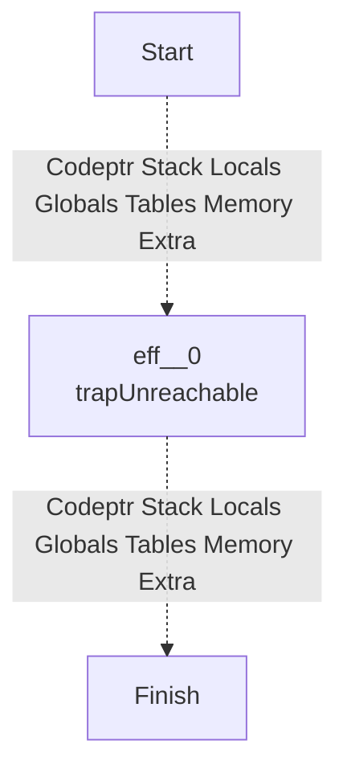
## NOP
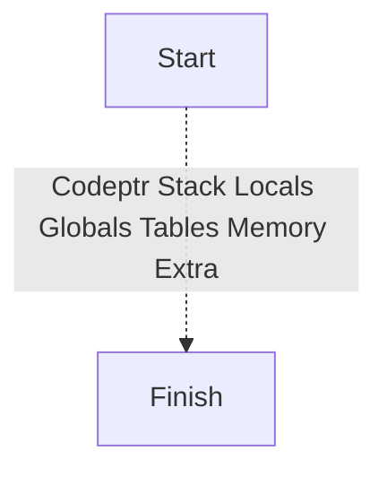
## LOCAL_GET

## LOCAL_SET
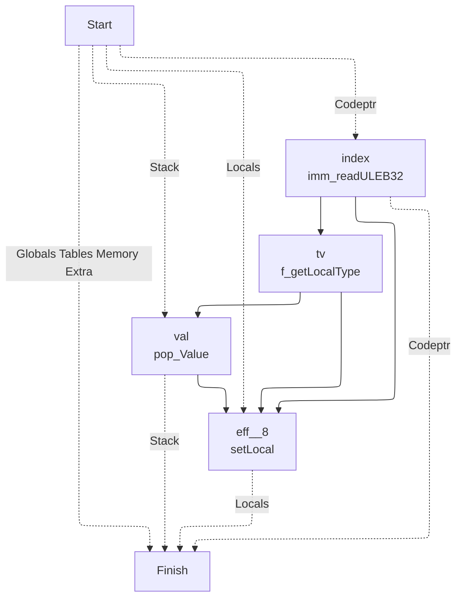
## LOCAL_TEE
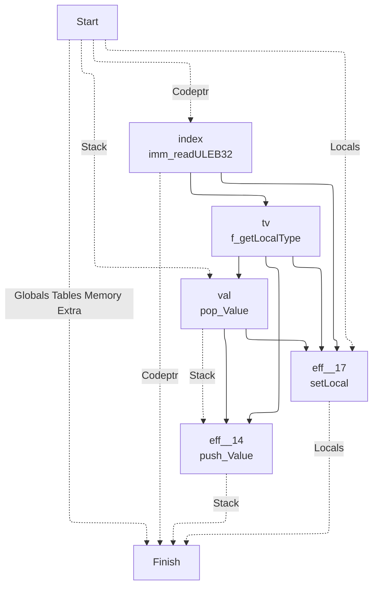
## GLOBAL_GET
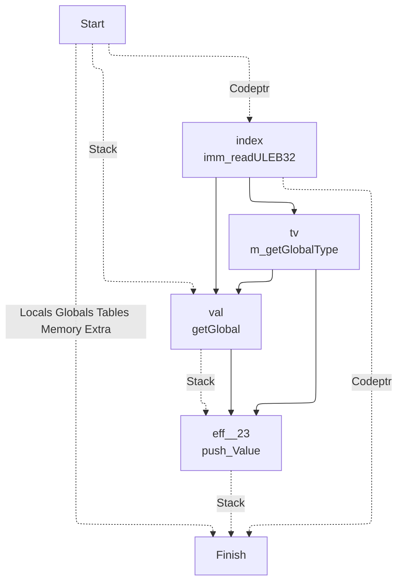
## GLOBAL_SET
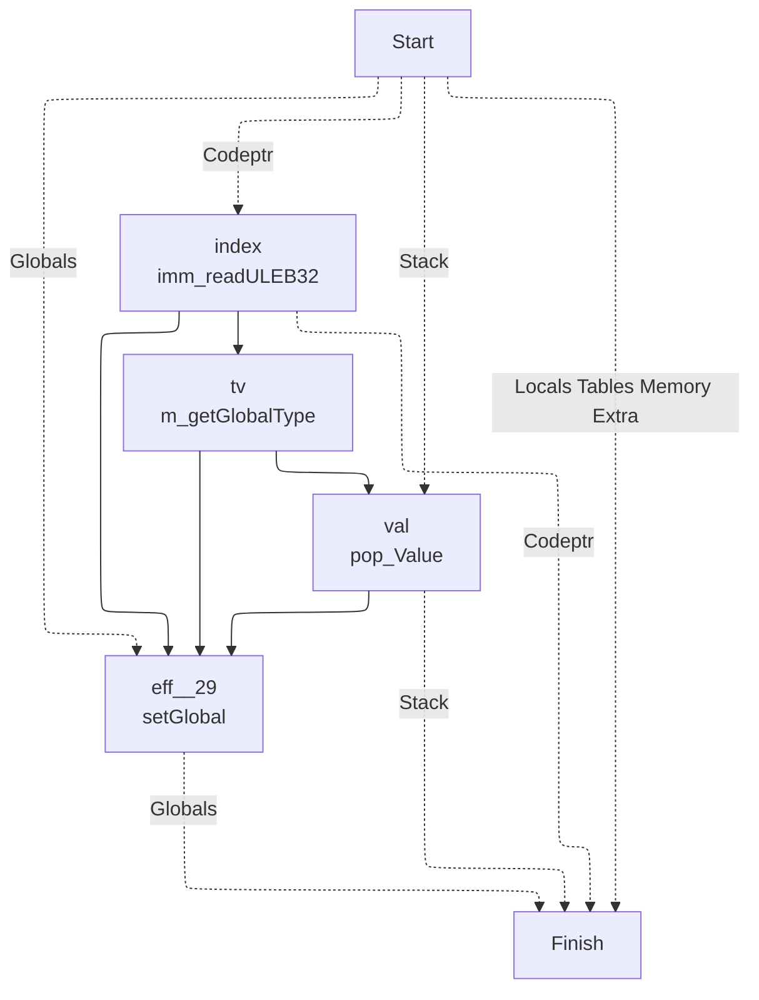
## TABLE_GET

## TABLE_SET
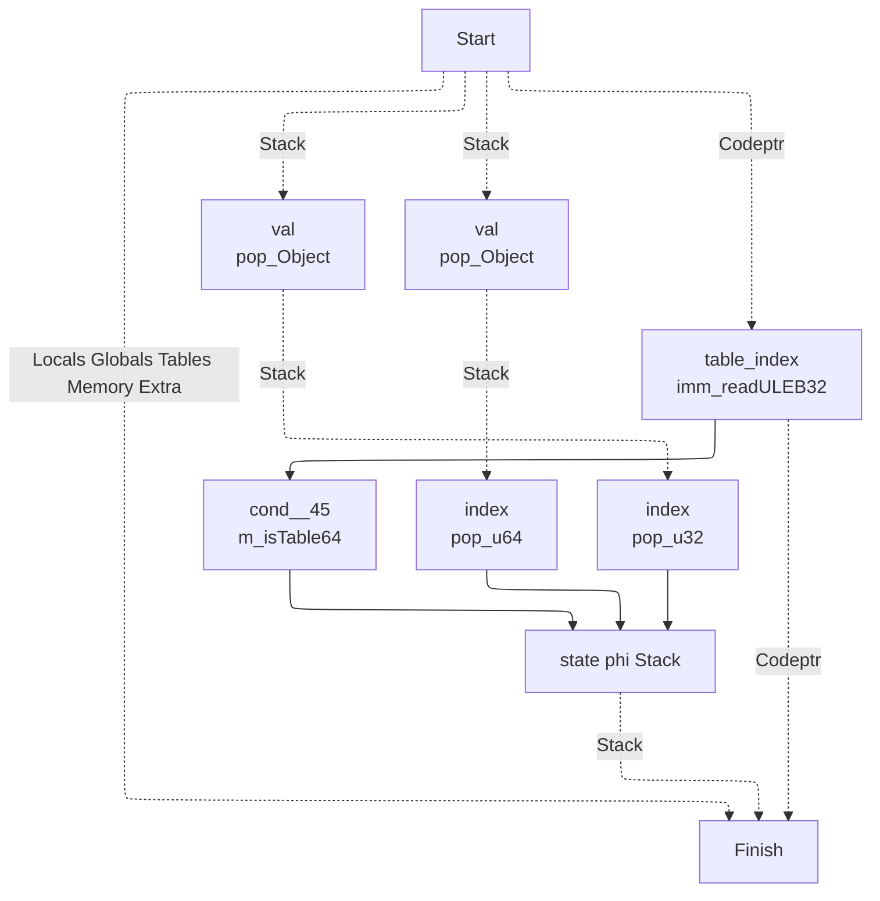
## CALL

## CALL_INDIRECT
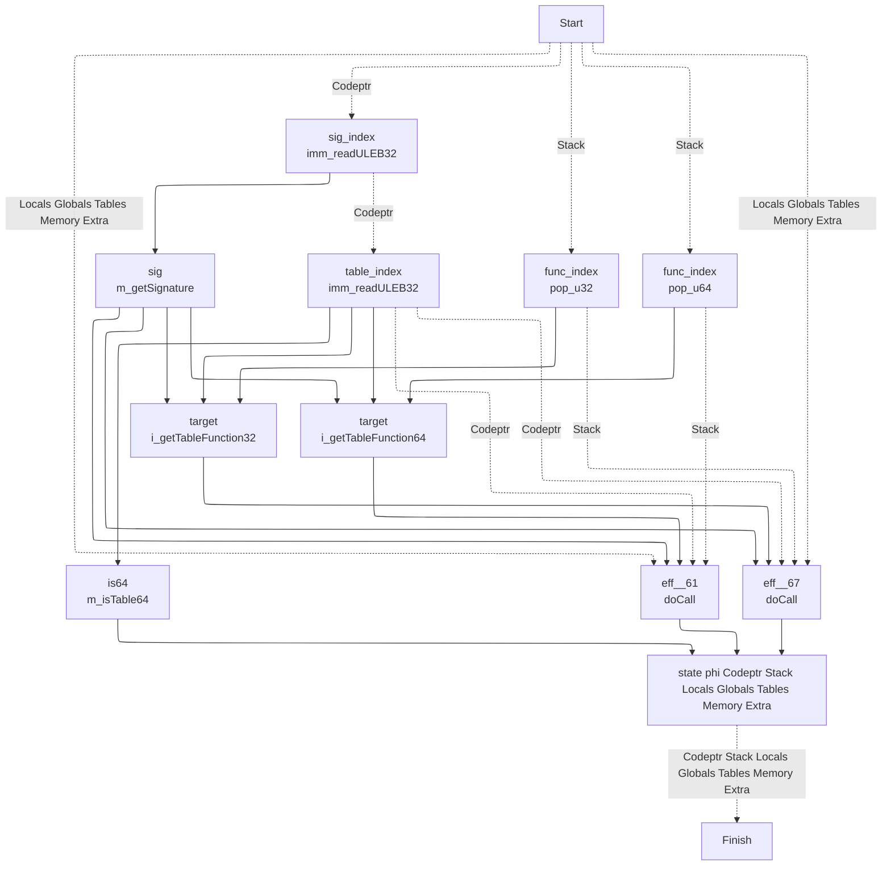
## RETURN_CALL

## DROP
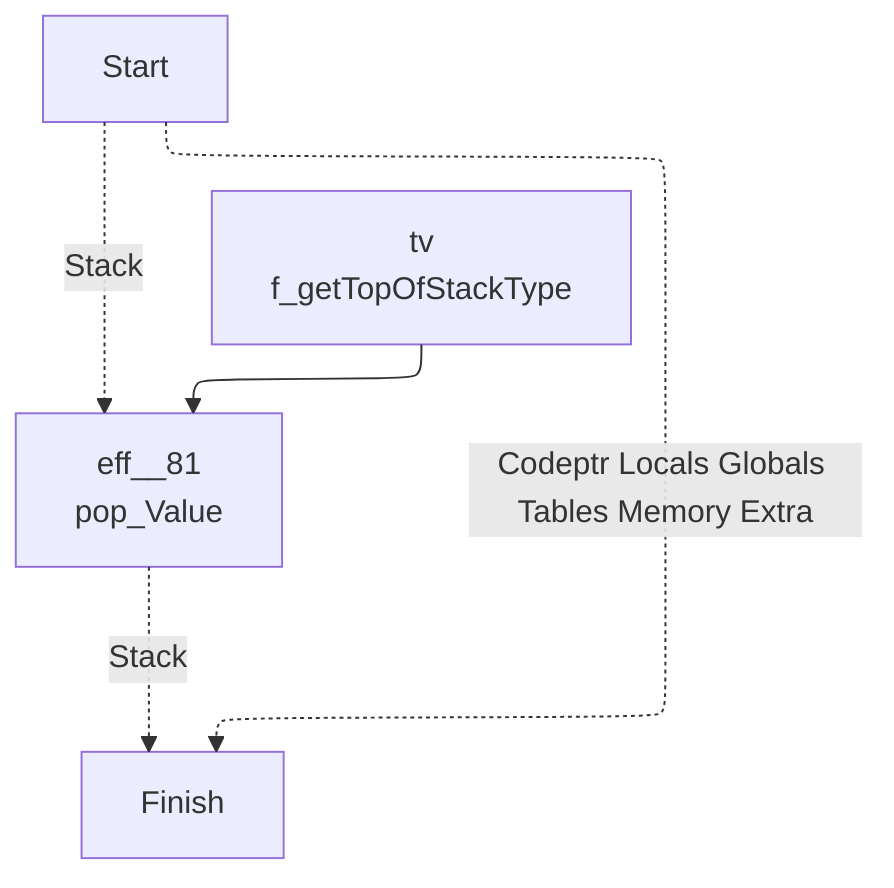
## SELECT
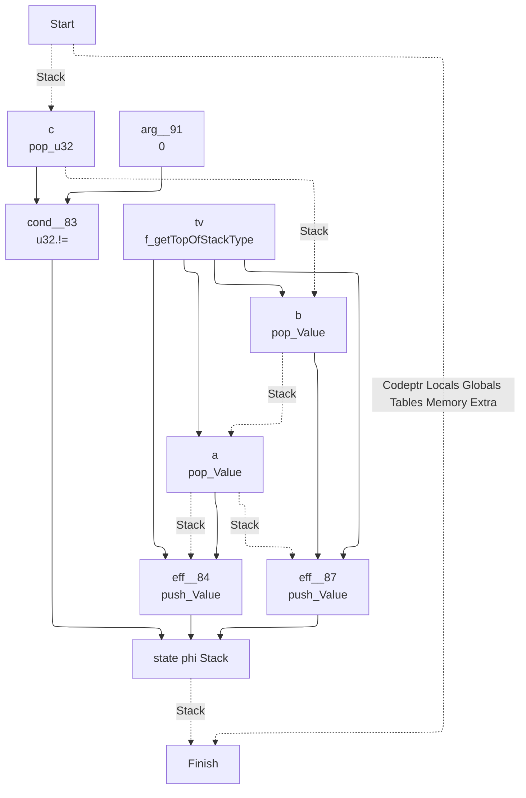
## I32_CONST

## I32_ADD

## I32_SUB
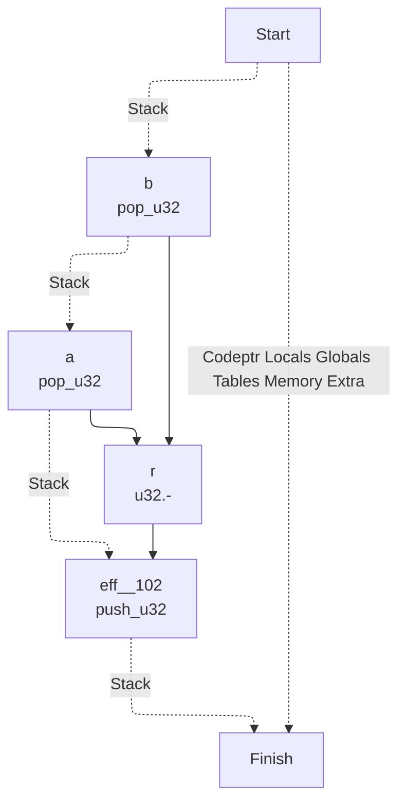
## I32_MUL

## I32_DIV_S
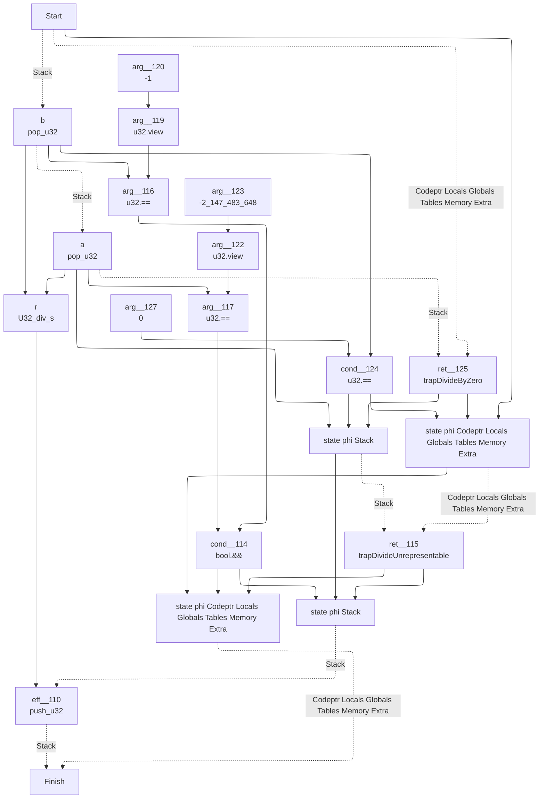
## I32_DIV_U
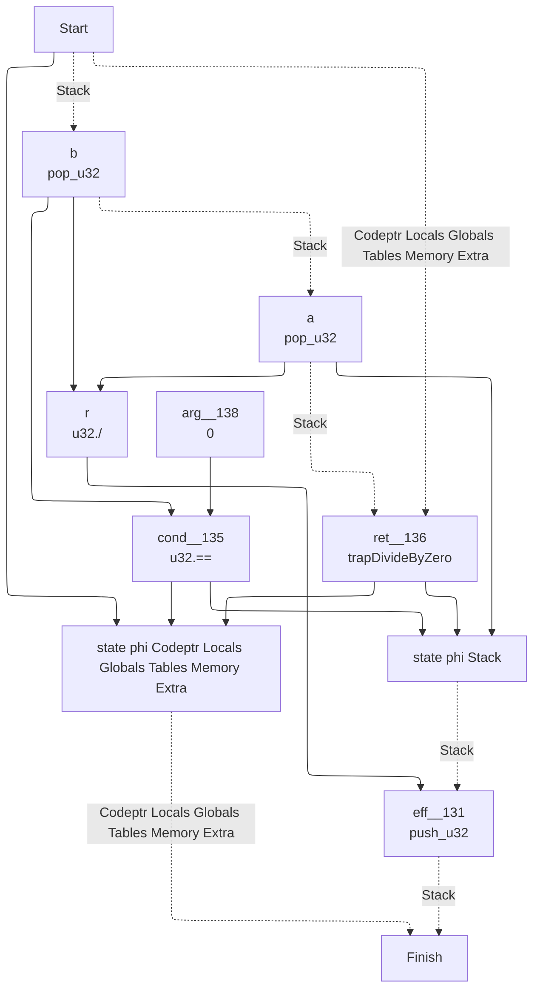
## I32_EQZ
```mermaid
---
config:
  layout: elk
---
graph TD
	1["
	Finish
	"]
	0 -. Codeptr Locals Globals Tables Memory Extra .-> 1
	9 -. Stack .-> 1
	9["
	state phi Stack 	"]
	5 --> 9
	8 --> 9
	6 --> 9
	6["
	eff__143
	push_u32
	"]
	4 --> 6
	3 -. Stack .-> 6
	3["
	a
	pop_u32
	"]
	0 -. Stack .-> 3
	0["
	Start
	"]
	4["
	arg__146
	0
	"]
	8["
	eff__141
	push_u32
	"]
	7 --> 8
	3 -. Stack .-> 8
	7["
	arg__142
	1
	"]
	5["
	cond__140
	u32.==
	"]
	3 --> 5
	4 --> 5
```
## I32_EQ
```mermaid
---
config:
  layout: elk
---
graph TD
	1["
	Finish
	"]
	0 -. Codeptr Locals Globals Tables Memory Extra .-> 1
	10 -. Stack .-> 1
	10["
	state phi Stack 	"]
	5 --> 10
	9 --> 10
	7 --> 10
	7["
	eff__153
	push_u32
	"]
	6 --> 7
	4 -. Stack .-> 7
	4["
	a
	pop_u32
	"]
	3 -. Stack .-> 4
	3["
	b
	pop_u32
	"]
	0 -. Stack .-> 3
	0["
	Start
	"]
	6["
	arg__154
	0
	"]
	9["
	eff__151
	push_u32
	"]
	8 --> 9
	4 -. Stack .-> 9
	8["
	arg__152
	1
	"]
	5["
	cond__150
	u32.==
	"]
	4 --> 5
	3 --> 5
```
## I32_NE
```mermaid
---
config:
  layout: elk
---
graph TD
	1["
	Finish
	"]
	0 -. Codeptr Locals Globals Tables Memory Extra .-> 1
	10 -. Stack .-> 1
	10["
	state phi Stack 	"]
	5 --> 10
	9 --> 10
	7 --> 10
	7["
	eff__162
	push_u32
	"]
	6 --> 7
	4 -. Stack .-> 7
	4["
	a
	pop_u32
	"]
	3 -. Stack .-> 4
	3["
	b
	pop_u32
	"]
	0 -. Stack .-> 3
	0["
	Start
	"]
	6["
	arg__163
	0
	"]
	9["
	eff__160
	push_u32
	"]
	8 --> 9
	4 -. Stack .-> 9
	8["
	arg__161
	1
	"]
	5["
	cond__159
	u32.!=
	"]
	4 --> 5
	3 --> 5
```
## I32_LT_U
```mermaid
---
config:
  layout: elk
---
graph TD
	1["
	Finish
	"]
	0 -. Codeptr Locals Globals Tables Memory Extra .-> 1
	10 -. Stack .-> 1
	10["
	state phi Stack 	"]
	5 --> 10
	9 --> 10
	7 --> 10
	7["
	eff__171
	push_u32
	"]
	6 --> 7
	4 -. Stack .-> 7
	4["
	a
	pop_u32
	"]
	3 -. Stack .-> 4
	3["
	b
	pop_u32
	"]
	0 -. Stack .-> 3
	0["
	Start
	"]
	6["
	arg__172
	0
	"]
	9["
	eff__169
	push_u32
	"]
	8 --> 9
	4 -. Stack .-> 9
	8["
	arg__170
	1
	"]
	5["
	cond__168
	u32.<
	"]
	4 --> 5
	3 --> 5
```
## I32_LT_S
```mermaid
---
config:
  layout: elk
---
graph TD
	1["
	Finish
	"]
	0 -. Codeptr Locals Globals Tables Memory Extra .-> 1
	10 -. Stack .-> 1
	10["
	state phi Stack 	"]
	5 --> 10
	9 --> 10
	7 --> 10
	7["
	eff__180
	push_u32
	"]
	6 --> 7
	4 -. Stack .-> 7
	4["
	a
	pop_u32
	"]
	3 -. Stack .-> 4
	3["
	b
	pop_u32
	"]
	0 -. Stack .-> 3
	0["
	Start
	"]
	6["
	arg__181
	0
	"]
	9["
	eff__178
	push_u32
	"]
	8 --> 9
	4 -. Stack .-> 9
	8["
	arg__179
	1
	"]
	5["
	cond__177
	U32_lt_s
	"]
	4 --> 5
	3 --> 5
```
## I32_LE_S
```mermaid
---
config:
  layout: elk
---
graph TD
	1["
	Finish
	"]
	0 -. Codeptr Locals Globals Tables Memory Extra .-> 1
	10 -. Stack .-> 1
	10["
	state phi Stack 	"]
	5 --> 10
	9 --> 10
	7 --> 10
	7["
	eff__189
	push_u32
	"]
	6 --> 7
	4 -. Stack .-> 7
	4["
	a
	pop_u32
	"]
	3 -. Stack .-> 4
	3["
	b
	pop_u32
	"]
	0 -. Stack .-> 3
	0["
	Start
	"]
	6["
	arg__190
	0
	"]
	9["
	eff__187
	push_u32
	"]
	8 --> 9
	4 -. Stack .-> 9
	8["
	arg__188
	1
	"]
	5["
	cond__186
	U32_le_s
	"]
	4 --> 5
	3 --> 5
```
## I32_GT_U
```mermaid
---
config:
  layout: elk
---
graph TD
	1["
	Finish
	"]
	0 -. Codeptr Locals Globals Tables Memory Extra .-> 1
	10 -. Stack .-> 1
	10["
	state phi Stack 	"]
	5 --> 10
	9 --> 10
	7 --> 10
	7["
	eff__198
	push_u32
	"]
	6 --> 7
	4 -. Stack .-> 7
	4["
	a
	pop_u32
	"]
	3 -. Stack .-> 4
	3["
	b
	pop_u32
	"]
	0 -. Stack .-> 3
	0["
	Start
	"]
	6["
	arg__199
	0
	"]
	9["
	eff__196
	push_u32
	"]
	8 --> 9
	4 -. Stack .-> 9
	8["
	arg__197
	1
	"]
	5["
	cond__195
	u32.>
	"]
	4 --> 5
	3 --> 5
```
## I32_LE_U
```mermaid
---
config:
  layout: elk
---
graph TD
	1["
	Finish
	"]
	0 -. Codeptr Locals Globals Tables Memory Extra .-> 1
	10 -. Stack .-> 1
	10["
	state phi Stack 	"]
	5 --> 10
	9 --> 10
	7 --> 10
	7["
	eff__207
	push_u32
	"]
	6 --> 7
	4 -. Stack .-> 7
	4["
	a
	pop_u32
	"]
	3 -. Stack .-> 4
	3["
	b
	pop_u32
	"]
	0 -. Stack .-> 3
	0["
	Start
	"]
	6["
	arg__208
	0
	"]
	9["
	eff__205
	push_u32
	"]
	8 --> 9
	4 -. Stack .-> 9
	8["
	arg__206
	1
	"]
	5["
	cond__204
	u32.<=
	"]
	4 --> 5
	3 --> 5
```
## I32_GT_S
```mermaid
---
config:
  layout: elk
---
graph TD
	1["
	Finish
	"]
	0 -. Codeptr Locals Globals Tables Memory Extra .-> 1
	10 -. Stack .-> 1
	10["
	state phi Stack 	"]
	5 --> 10
	9 --> 10
	7 --> 10
	7["
	eff__216
	push_u32
	"]
	6 --> 7
	4 -. Stack .-> 7
	4["
	a
	pop_u32
	"]
	3 -. Stack .-> 4
	3["
	b
	pop_u32
	"]
	0 -. Stack .-> 3
	0["
	Start
	"]
	6["
	arg__217
	0
	"]
	9["
	eff__214
	push_u32
	"]
	8 --> 9
	4 -. Stack .-> 9
	8["
	arg__215
	1
	"]
	5["
	cond__213
	U32_gt_s
	"]
	4 --> 5
	3 --> 5
```
## I32_GE_U
```mermaid
---
config:
  layout: elk
---
graph TD
	1["
	Finish
	"]
	0 -. Codeptr Locals Globals Tables Memory Extra .-> 1
	10 -. Stack .-> 1
	10["
	state phi Stack 	"]
	5 --> 10
	9 --> 10
	7 --> 10
	7["
	eff__225
	push_u32
	"]
	6 --> 7
	4 -. Stack .-> 7
	4["
	a
	pop_u32
	"]
	3 -. Stack .-> 4
	3["
	b
	pop_u32
	"]
	0 -. Stack .-> 3
	0["
	Start
	"]
	6["
	arg__226
	0
	"]
	9["
	eff__223
	push_u32
	"]
	8 --> 9
	4 -. Stack .-> 9
	8["
	arg__224
	1
	"]
	5["
	cond__222
	U32_ge_u
	"]
	4 --> 5
	3 --> 5
```
## I32_GE_S
```mermaid
---
config:
  layout: elk
---
graph TD
	1["
	Finish
	"]
	0 -. Codeptr Locals Globals Tables Memory Extra .-> 1
	10 -. Stack .-> 1
	10["
	state phi Stack 	"]
	5 --> 10
	9 --> 10
	7 --> 10
	7["
	eff__234
	push_u32
	"]
	6 --> 7
	4 -. Stack .-> 7
	4["
	a
	pop_u32
	"]
	3 -. Stack .-> 4
	3["
	b
	pop_u32
	"]
	0 -. Stack .-> 3
	0["
	Start
	"]
	6["
	arg__235
	0
	"]
	9["
	eff__232
	push_u32
	"]
	8 --> 9
	4 -. Stack .-> 9
	8["
	arg__233
	1
	"]
	5["
	cond__231
	U32_ge_s
	"]
	4 --> 5
	3 --> 5
```
## I32_AND
```mermaid
---
config:
  layout: elk
---
graph TD
	1["
	Finish
	"]
	0 -. Codeptr Locals Globals Tables Memory Extra .-> 1
	6 -. Stack .-> 1
	6["
	eff__240
	push_u32
	"]
	5 --> 6
	4 -. Stack .-> 6
	4["
	a
	pop_u32
	"]
	3 -. Stack .-> 4
	3["
	b
	pop_u32
	"]
	0 -. Stack .-> 3
	0["
	Start
	"]
	5["
	r
	u32.&
	"]
	4 --> 5
	3 --> 5
```
## I32_OR
```mermaid
---
config:
  layout: elk
---
graph TD
	1["
	Finish
	"]
	0 -. Codeptr Locals Globals Tables Memory Extra .-> 1
	6 -. Stack .-> 1
	6["
	eff__244
	push_u32
	"]
	5 --> 6
	4 -. Stack .-> 6
	4["
	a
	pop_u32
	"]
	3 -. Stack .-> 4
	3["
	b
	pop_u32
	"]
	0 -. Stack .-> 3
	0["
	Start
	"]
	5["
	r
	u32.|
	"]
	4 --> 5
	3 --> 5
```
## I32_XOR
```mermaid
---
config:
  layout: elk
---
graph TD
	1["
	Finish
	"]
	0 -. Codeptr Locals Globals Tables Memory Extra .-> 1
	6 -. Stack .-> 1
	6["
	eff__248
	push_u32
	"]
	5 --> 6
	4 -. Stack .-> 6
	4["
	a
	pop_u32
	"]
	3 -. Stack .-> 4
	3["
	b
	pop_u32
	"]
	0 -. Stack .-> 3
	0["
	Start
	"]
	5["
	r
	u32.^
	"]
	4 --> 5
	3 --> 5
```
## I32_SHL
```mermaid
---
config:
  layout: elk
---
graph TD
	1["
	Finish
	"]
	0 -. Codeptr Locals Globals Tables Memory Extra .-> 1
	6 -. Stack .-> 1
	6["
	eff__252
	push_u32
	"]
	5 --> 6
	4 -. Stack .-> 6
	4["
	a
	pop_u32
	"]
	3 -. Stack .-> 4
	3["
	b
	pop_u32
	"]
	0 -. Stack .-> 3
	0["
	Start
	"]
	5["
	r
	U32_shl
	"]
	4 --> 5
	3 --> 5
```
## I32_SHR_U
```mermaid
---
config:
  layout: elk
---
graph TD
	1["
	Finish
	"]
	0 -. Codeptr Locals Globals Tables Memory Extra .-> 1
	6 -. Stack .-> 1
	6["
	eff__256
	push_u32
	"]
	5 --> 6
	4 -. Stack .-> 6
	4["
	a
	pop_u32
	"]
	3 -. Stack .-> 4
	3["
	b
	pop_u32
	"]
	0 -. Stack .-> 3
	0["
	Start
	"]
	5["
	r
	U32_shr_u
	"]
	4 --> 5
	3 --> 5
```
## I32_SHR_S
```mermaid
---
config:
  layout: elk
---
graph TD
	1["
	Finish
	"]
	0 -. Codeptr Locals Globals Tables Memory Extra .-> 1
	6 -. Stack .-> 1
	6["
	eff__260
	push_u32
	"]
	5 --> 6
	4 -. Stack .-> 6
	4["
	a
	pop_u32
	"]
	3 -. Stack .-> 4
	3["
	b
	pop_u32
	"]
	0 -. Stack .-> 3
	0["
	Start
	"]
	5["
	r
	U32_shr_s
	"]
	4 --> 5
	3 --> 5
```
## I32_ROTL
```mermaid
---
config:
  layout: elk
---
graph TD
	1["
	Finish
	"]
	0 -. Codeptr Locals Globals Tables Memory Extra .-> 1
	6 -. Stack .-> 1
	6["
	eff__264
	push_u32
	"]
	5 --> 6
	4 -. Stack .-> 6
	4["
	a
	pop_u32
	"]
	3 -. Stack .-> 4
	3["
	b
	pop_u32
	"]
	0 -. Stack .-> 3
	0["
	Start
	"]
	5["
	r
	U32_rotl
	"]
	4 --> 5
	3 --> 5
```
## I32_ROTR
```mermaid
---
config:
  layout: elk
---
graph TD
	1["
	Finish
	"]
	0 -. Codeptr Locals Globals Tables Memory Extra .-> 1
	6 -. Stack .-> 1
	6["
	eff__268
	push_u32
	"]
	5 --> 6
	4 -. Stack .-> 6
	4["
	a
	pop_u32
	"]
	3 -. Stack .-> 4
	3["
	b
	pop_u32
	"]
	0 -. Stack .-> 3
	0["
	Start
	"]
	5["
	r
	U32_rotr
	"]
	4 --> 5
	3 --> 5
```
## I32_CLZ
```mermaid
---
config:
  layout: elk
---
graph TD
	1["
	Finish
	"]
	0 -. Codeptr Locals Globals Tables Memory Extra .-> 1
	5 -. Stack .-> 1
	5["
	eff__272
	push_u32
	"]
	4 --> 5
	3 -. Stack .-> 5
	3["
	a
	pop_u32
	"]
	0 -. Stack .-> 3
	0["
	Start
	"]
	4["
	r
	U32_clz
	"]
	3 --> 4
```
## I32_CTZ
```mermaid
---
config:
  layout: elk
---
graph TD
	1["
	Finish
	"]
	0 -. Codeptr Locals Globals Tables Memory Extra .-> 1
	5 -. Stack .-> 1
	5["
	eff__275
	push_u32
	"]
	4 --> 5
	3 -. Stack .-> 5
	3["
	a
	pop_u32
	"]
	0 -. Stack .-> 3
	0["
	Start
	"]
	4["
	r
	U32_ctz
	"]
	3 --> 4
```
## I32_POPCNT
```mermaid
---
config:
  layout: elk
---
graph TD
	1["
	Finish
	"]
	0 -. Codeptr Locals Globals Tables Memory Extra .-> 1
	5 -. Stack .-> 1
	5["
	eff__278
	push_u32
	"]
	4 --> 5
	3 -. Stack .-> 5
	3["
	a
	pop_u32
	"]
	0 -. Stack .-> 3
	0["
	Start
	"]
	4["
	r
	U32_popcnt
	"]
	3 --> 4
```
## I32_REM_S
```mermaid
---
config:
  layout: elk
---
graph TD
	1["
	Finish
	"]
	8 -. Codeptr Locals Globals Tables Memory Extra .-> 1
	11 -. Stack .-> 1
	11["
	eff__281
	push_u32
	"]
	10 --> 11
	9 -. Stack .-> 11
	9["
	state phi Stack 	"]
	6 --> 9
	7 --> 9
	4 --> 9
	4["
	a
	pop_u32
	"]
	3 -. Stack .-> 4
	3["
	b
	pop_u32
	"]
	0 -. Stack .-> 3
	0["
	Start
	"]
	7["
	ret__286
	trapDivideByZero
	"]
	0 -. Codeptr Locals Globals Tables Memory Extra .-> 7
	4 -. Stack .-> 7
	6["
	cond__285
	u32.==
	"]
	3 --> 6
	5 --> 6
	5["
	arg__288
	0
	"]
	10["
	r
	U32_rem_s
	"]
	4 --> 10
	3 --> 10
	8["
	state phi Codeptr Locals Globals Tables Memory Extra 	"]
	6 --> 8
	7 --> 8
	0 --> 8
```
## I32_REM_U
```mermaid
---
config:
  layout: elk
---
graph TD
	1["
	Finish
	"]
	8 -. Codeptr Locals Globals Tables Memory Extra .-> 1
	11 -. Stack .-> 1
	11["
	eff__290
	push_u32
	"]
	10 --> 11
	9 -. Stack .-> 11
	9["
	state phi Stack 	"]
	6 --> 9
	7 --> 9
	4 --> 9
	4["
	a
	pop_u32
	"]
	3 -. Stack .-> 4
	3["
	b
	pop_u32
	"]
	0 -. Stack .-> 3
	0["
	Start
	"]
	7["
	ret__295
	trapDivideByZero
	"]
	0 -. Codeptr Locals Globals Tables Memory Extra .-> 7
	4 -. Stack .-> 7
	6["
	cond__294
	u32.==
	"]
	3 --> 6
	5 --> 6
	5["
	arg__297
	0
	"]
	10["
	r
	U32_rem_u
	"]
	4 --> 10
	3 --> 10
	8["
	state phi Codeptr Locals Globals Tables Memory Extra 	"]
	6 --> 8
	7 --> 8
	0 --> 8
```
## I32_EXTEND8_S
```mermaid
---
config:
  layout: elk
---
graph TD
	1["
	Finish
	"]
	0 -. Codeptr Locals Globals Tables Memory Extra .-> 1
	5 -. Stack .-> 1
	5["
	eff__299
	push_u32
	"]
	4 --> 5
	3 -. Stack .-> 5
	3["
	a
	pop_u32
	"]
	0 -. Stack .-> 3
	0["
	Start
	"]
	4["
	r
	U32_extend8_s
	"]
	3 --> 4
```
## I32_EXTEND16_S
```mermaid
---
config:
  layout: elk
---
graph TD
	1["
	Finish
	"]
	0 -. Codeptr Locals Globals Tables Memory Extra .-> 1
	5 -. Stack .-> 1
	5["
	eff__302
	push_u32
	"]
	4 --> 5
	3 -. Stack .-> 5
	3["
	a
	pop_u32
	"]
	0 -. Stack .-> 3
	0["
	Start
	"]
	4["
	r
	U32_extend16_s
	"]
	3 --> 4
```
## I64_CONST
```mermaid
---
config:
  layout: elk
---
graph TD
	1["
	Finish
	"]
	3 -. Codeptr .-> 1
	4 -. Stack .-> 1
	0 -. Locals Globals Tables Memory Extra .-> 1
	0["
	Start
	"]
	4["
	eff__305
	push_u64
	"]
	3 --> 4
	0 -. Stack .-> 4
	3["
	x
	imm_readILEB64
	"]
	0 -. Codeptr .-> 3
```
## I64_ADD
```mermaid
---
config:
  layout: elk
---
graph TD
	1["
	Finish
	"]
	0 -. Codeptr Locals Globals Tables Memory Extra .-> 1
	6 -. Stack .-> 1
	6["
	eff__308
	push_u64
	"]
	5 --> 6
	4 -. Stack .-> 6
	4["
	a
	pop_u64
	"]
	3 -. Stack .-> 4
	3["
	b
	pop_u64
	"]
	0 -. Stack .-> 3
	0["
	Start
	"]
	5["
	r
	u64.+
	"]
	4 --> 5
	3 --> 5
```
## I64_SUB
```mermaid
---
config:
  layout: elk
---
graph TD
	1["
	Finish
	"]
	0 -. Codeptr Locals Globals Tables Memory Extra .-> 1
	6 -. Stack .-> 1
	6["
	eff__312
	push_u64
	"]
	5 --> 6
	4 -. Stack .-> 6
	4["
	a
	pop_u64
	"]
	3 -. Stack .-> 4
	3["
	b
	pop_u64
	"]
	0 -. Stack .-> 3
	0["
	Start
	"]
	5["
	r
	u64.-
	"]
	4 --> 5
	3 --> 5
```
## I64_MUL
```mermaid
---
config:
  layout: elk
---
graph TD
	1["
	Finish
	"]
	0 -. Codeptr Locals Globals Tables Memory Extra .-> 1
	6 -. Stack .-> 1
	6["
	eff__316
	push_u64
	"]
	5 --> 6
	4 -. Stack .-> 6
	4["
	a
	pop_u64
	"]
	3 -. Stack .-> 4
	3["
	b
	pop_u64
	"]
	0 -. Stack .-> 3
	0["
	Start
	"]
	5["
	r
	u64.*
	"]
	4 --> 5
	3 --> 5
```
## I64_DIV_S
```mermaid
---
config:
  layout: elk
---
graph TD
	1["
	Finish
	"]
	18 -. Codeptr Locals Globals Tables Memory Extra .-> 1
	21 -. Stack .-> 1
	21["
	eff__320
	push_u64
	"]
	20 --> 21
	19 -. Stack .-> 21
	19["
	state phi Stack 	"]
	16 --> 19
	17 --> 19
	9 --> 19
	9["
	state phi Stack 	"]
	6 --> 9
	7 --> 9
	4 --> 9
	4["
	a
	pop_u64
	"]
	3 -. Stack .-> 4
	3["
	b
	pop_u64
	"]
	0 -. Stack .-> 3
	0["
	Start
	"]
	7["
	ret__335
	trapDivideByZero
	"]
	0 -. Codeptr Locals Globals Tables Memory Extra .-> 7
	4 -. Stack .-> 7
	6["
	cond__334
	u64.==
	"]
	3 --> 6
	5 --> 6
	5["
	arg__337
	0
	"]
	17["
	ret__325
	trapDivideUnrepresentable
	"]
	8 -. Codeptr Locals Globals Tables Memory Extra .-> 17
	9 -. Stack .-> 17
	8["
	state phi Codeptr Locals Globals Tables Memory Extra 	"]
	6 --> 8
	7 --> 8
	0 --> 8
	16["
	cond__324
	bool.&&
	"]
	15 --> 16
	12 --> 16
	12["
	arg__327
	u64.==
	"]
	4 --> 12
	11 --> 12
	11["
	arg__332
	u64.view
	"]
	10 --> 11
	10["
	arg__333
	-9223372036854775808L
	"]
	15["
	arg__326
	u64.==
	"]
	3 --> 15
	14 --> 15
	14["
	arg__329
	u64.view
	"]
	13 --> 14
	13["
	arg__330
	-1
	"]
	20["
	r
	U64_div_s
	"]
	4 --> 20
	3 --> 20
	18["
	state phi Codeptr Locals Globals Tables Memory Extra 	"]
	16 --> 18
	17 --> 18
	8 --> 18
```
## I64_DIV_U
```mermaid
---
config:
  layout: elk
---
graph TD
	1["
	Finish
	"]
	8 -. Codeptr Locals Globals Tables Memory Extra .-> 1
	11 -. Stack .-> 1
	11["
	eff__338
	push_u64
	"]
	10 --> 11
	9 -. Stack .-> 11
	9["
	state phi Stack 	"]
	6 --> 9
	7 --> 9
	4 --> 9
	4["
	a
	pop_u64
	"]
	3 -. Stack .-> 4
	3["
	b
	pop_u64
	"]
	0 -. Stack .-> 3
	0["
	Start
	"]
	7["
	ret__343
	trapDivideByZero
	"]
	0 -. Codeptr Locals Globals Tables Memory Extra .-> 7
	4 -. Stack .-> 7
	6["
	cond__342
	u64.==
	"]
	3 --> 6
	5 --> 6
	5["
	arg__345
	0
	"]
	10["
	r
	u64./
	"]
	4 --> 10
	3 --> 10
	8["
	state phi Codeptr Locals Globals Tables Memory Extra 	"]
	6 --> 8
	7 --> 8
	0 --> 8
```
## I64_REM_S
```mermaid
---
config:
  layout: elk
---
graph TD
	1["
	Finish
	"]
	8 -. Codeptr Locals Globals Tables Memory Extra .-> 1
	11 -. Stack .-> 1
	11["
	eff__346
	push_u64
	"]
	10 --> 11
	9 -. Stack .-> 11
	9["
	state phi Stack 	"]
	6 --> 9
	7 --> 9
	4 --> 9
	4["
	a
	pop_u64
	"]
	3 -. Stack .-> 4
	3["
	b
	pop_u64
	"]
	0 -. Stack .-> 3
	0["
	Start
	"]
	7["
	ret__351
	trapDivideByZero
	"]
	0 -. Codeptr Locals Globals Tables Memory Extra .-> 7
	4 -. Stack .-> 7
	6["
	cond__350
	u64.==
	"]
	3 --> 6
	5 --> 6
	5["
	arg__353
	0
	"]
	10["
	r
	U64_rem_s
	"]
	4 --> 10
	3 --> 10
	8["
	state phi Codeptr Locals Globals Tables Memory Extra 	"]
	6 --> 8
	7 --> 8
	0 --> 8
```
## I64_REM_U
```mermaid
---
config:
  layout: elk
---
graph TD
	1["
	Finish
	"]
	8 -. Codeptr Locals Globals Tables Memory Extra .-> 1
	11 -. Stack .-> 1
	11["
	eff__354
	push_u64
	"]
	10 --> 11
	9 -. Stack .-> 11
	9["
	state phi Stack 	"]
	6 --> 9
	7 --> 9
	4 --> 9
	4["
	a
	pop_u64
	"]
	3 -. Stack .-> 4
	3["
	b
	pop_u64
	"]
	0 -. Stack .-> 3
	0["
	Start
	"]
	7["
	ret__359
	trapDivideByZero
	"]
	0 -. Codeptr Locals Globals Tables Memory Extra .-> 7
	4 -. Stack .-> 7
	6["
	cond__358
	u64.==
	"]
	3 --> 6
	5 --> 6
	5["
	arg__361
	0
	"]
	10["
	r
	U64_rem_u
	"]
	4 --> 10
	3 --> 10
	8["
	state phi Codeptr Locals Globals Tables Memory Extra 	"]
	6 --> 8
	7 --> 8
	0 --> 8
```
## I64_AND
```mermaid
---
config:
  layout: elk
---
graph TD
	1["
	Finish
	"]
	0 -. Codeptr Locals Globals Tables Memory Extra .-> 1
	6 -. Stack .-> 1
	6["
	eff__362
	push_u64
	"]
	5 --> 6
	4 -. Stack .-> 6
	4["
	a
	pop_u64
	"]
	3 -. Stack .-> 4
	3["
	b
	pop_u64
	"]
	0 -. Stack .-> 3
	0["
	Start
	"]
	5["
	r
	u64.&
	"]
	4 --> 5
	3 --> 5
```
## I64_OR
```mermaid
---
config:
  layout: elk
---
graph TD
	1["
	Finish
	"]
	0 -. Codeptr Locals Globals Tables Memory Extra .-> 1
	6 -. Stack .-> 1
	6["
	eff__366
	push_u64
	"]
	5 --> 6
	4 -. Stack .-> 6
	4["
	a
	pop_u64
	"]
	3 -. Stack .-> 4
	3["
	b
	pop_u64
	"]
	0 -. Stack .-> 3
	0["
	Start
	"]
	5["
	r
	u64.|
	"]
	4 --> 5
	3 --> 5
```
## I64_XOR
```mermaid
---
config:
  layout: elk
---
graph TD
	1["
	Finish
	"]
	0 -. Codeptr Locals Globals Tables Memory Extra .-> 1
	6 -. Stack .-> 1
	6["
	eff__370
	push_u64
	"]
	5 --> 6
	4 -. Stack .-> 6
	4["
	a
	pop_u64
	"]
	3 -. Stack .-> 4
	3["
	b
	pop_u64
	"]
	0 -. Stack .-> 3
	0["
	Start
	"]
	5["
	r
	u64.^
	"]
	4 --> 5
	3 --> 5
```
## I64_SHL
```mermaid
---
config:
  layout: elk
---
graph TD
	1["
	Finish
	"]
	0 -. Codeptr Locals Globals Tables Memory Extra .-> 1
	6 -. Stack .-> 1
	6["
	eff__374
	push_u64
	"]
	5 --> 6
	4 -. Stack .-> 6
	4["
	a
	pop_u64
	"]
	3 -. Stack .-> 4
	3["
	b
	pop_u64
	"]
	0 -. Stack .-> 3
	0["
	Start
	"]
	5["
	r
	U64_shl
	"]
	4 --> 5
	3 --> 5
```
## I64_SHR_U
```mermaid
---
config:
  layout: elk
---
graph TD
	1["
	Finish
	"]
	0 -. Codeptr Locals Globals Tables Memory Extra .-> 1
	6 -. Stack .-> 1
	6["
	eff__378
	push_u64
	"]
	5 --> 6
	4 -. Stack .-> 6
	4["
	a
	pop_u64
	"]
	3 -. Stack .-> 4
	3["
	b
	pop_u64
	"]
	0 -. Stack .-> 3
	0["
	Start
	"]
	5["
	r
	U64_shr_u
	"]
	4 --> 5
	3 --> 5
```
## I64_SHR_S
```mermaid
---
config:
  layout: elk
---
graph TD
	1["
	Finish
	"]
	0 -. Codeptr Locals Globals Tables Memory Extra .-> 1
	6 -. Stack .-> 1
	6["
	eff__382
	push_u64
	"]
	5 --> 6
	4 -. Stack .-> 6
	4["
	a
	pop_u64
	"]
	3 -. Stack .-> 4
	3["
	b
	pop_u64
	"]
	0 -. Stack .-> 3
	0["
	Start
	"]
	5["
	r
	U64_shr_s
	"]
	4 --> 5
	3 --> 5
```
## I64_ROTL
```mermaid
---
config:
  layout: elk
---
graph TD
	1["
	Finish
	"]
	0 -. Codeptr Locals Globals Tables Memory Extra .-> 1
	6 -. Stack .-> 1
	6["
	eff__386
	push_u64
	"]
	5 --> 6
	4 -. Stack .-> 6
	4["
	a
	pop_u64
	"]
	3 -. Stack .-> 4
	3["
	b
	pop_u64
	"]
	0 -. Stack .-> 3
	0["
	Start
	"]
	5["
	r
	U64_rotl
	"]
	4 --> 5
	3 --> 5
```
## I64_ROTR
```mermaid
---
config:
  layout: elk
---
graph TD
	1["
	Finish
	"]
	0 -. Codeptr Locals Globals Tables Memory Extra .-> 1
	6 -. Stack .-> 1
	6["
	eff__390
	push_u64
	"]
	5 --> 6
	4 -. Stack .-> 6
	4["
	a
	pop_u64
	"]
	3 -. Stack .-> 4
	3["
	b
	pop_u64
	"]
	0 -. Stack .-> 3
	0["
	Start
	"]
	5["
	r
	U64_rotr
	"]
	4 --> 5
	3 --> 5
```
## I64_CLZ
```mermaid
---
config:
  layout: elk
---
graph TD
	1["
	Finish
	"]
	0 -. Codeptr Locals Globals Tables Memory Extra .-> 1
	5 -. Stack .-> 1
	5["
	eff__394
	push_u64
	"]
	4 --> 5
	3 -. Stack .-> 5
	3["
	a
	pop_u64
	"]
	0 -. Stack .-> 3
	0["
	Start
	"]
	4["
	r
	U64_clz
	"]
	3 --> 4
```
## I64_CTZ
```mermaid
---
config:
  layout: elk
---
graph TD
	1["
	Finish
	"]
	0 -. Codeptr Locals Globals Tables Memory Extra .-> 1
	5 -. Stack .-> 1
	5["
	eff__397
	push_u64
	"]
	4 --> 5
	3 -. Stack .-> 5
	3["
	a
	pop_u64
	"]
	0 -. Stack .-> 3
	0["
	Start
	"]
	4["
	r
	U64_ctz
	"]
	3 --> 4
```
## I64_POPCNT
```mermaid
---
config:
  layout: elk
---
graph TD
	1["
	Finish
	"]
	0 -. Codeptr Locals Globals Tables Memory Extra .-> 1
	5 -. Stack .-> 1
	5["
	eff__400
	push_u64
	"]
	4 --> 5
	3 -. Stack .-> 5
	3["
	a
	pop_u64
	"]
	0 -. Stack .-> 3
	0["
	Start
	"]
	4["
	r
	U64_popcnt
	"]
	3 --> 4
```
## I64_EQZ
```mermaid
---
config:
  layout: elk
---
graph TD
	1["
	Finish
	"]
	0 -. Codeptr Locals Globals Tables Memory Extra .-> 1
	9 -. Stack .-> 1
	9["
	state phi Stack 	"]
	5 --> 9
	8 --> 9
	6 --> 9
	6["
	eff__406
	push_u32
	"]
	4 --> 6
	3 -. Stack .-> 6
	3["
	a
	pop_u64
	"]
	0 -. Stack .-> 3
	0["
	Start
	"]
	4["
	arg__409
	0
	"]
	8["
	eff__404
	push_u32
	"]
	7 --> 8
	3 -. Stack .-> 8
	7["
	arg__405
	1
	"]
	5["
	cond__403
	u64.==
	"]
	3 --> 5
	4 --> 5
```
## I64_EQ
```mermaid
---
config:
  layout: elk
---
graph TD
	1["
	Finish
	"]
	0 -. Codeptr Locals Globals Tables Memory Extra .-> 1
	10 -. Stack .-> 1
	10["
	state phi Stack 	"]
	5 --> 10
	9 --> 10
	7 --> 10
	7["
	eff__415
	push_u32
	"]
	6 --> 7
	4 -. Stack .-> 7
	4["
	a
	pop_u64
	"]
	3 -. Stack .-> 4
	3["
	b
	pop_u64
	"]
	0 -. Stack .-> 3
	0["
	Start
	"]
	6["
	arg__416
	0
	"]
	9["
	eff__413
	push_u32
	"]
	8 --> 9
	4 -. Stack .-> 9
	8["
	arg__414
	1
	"]
	5["
	cond__412
	u64.==
	"]
	4 --> 5
	3 --> 5
```
## I64_NE
```mermaid
---
config:
  layout: elk
---
graph TD
	1["
	Finish
	"]
	0 -. Codeptr Locals Globals Tables Memory Extra .-> 1
	10 -. Stack .-> 1
	10["
	state phi Stack 	"]
	5 --> 10
	9 --> 10
	7 --> 10
	7["
	eff__424
	push_u32
	"]
	6 --> 7
	4 -. Stack .-> 7
	4["
	a
	pop_u64
	"]
	3 -. Stack .-> 4
	3["
	b
	pop_u64
	"]
	0 -. Stack .-> 3
	0["
	Start
	"]
	6["
	arg__425
	0
	"]
	9["
	eff__422
	push_u32
	"]
	8 --> 9
	4 -. Stack .-> 9
	8["
	arg__423
	1
	"]
	5["
	cond__421
	u64.!=
	"]
	4 --> 5
	3 --> 5
```
## I64_LT_S
```mermaid
---
config:
  layout: elk
---
graph TD
	1["
	Finish
	"]
	0 -. Codeptr Locals Globals Tables Memory Extra .-> 1
	10 -. Stack .-> 1
	10["
	state phi Stack 	"]
	5 --> 10
	9 --> 10
	7 --> 10
	7["
	eff__433
	push_u32
	"]
	6 --> 7
	4 -. Stack .-> 7
	4["
	a
	pop_u64
	"]
	3 -. Stack .-> 4
	3["
	b
	pop_u64
	"]
	0 -. Stack .-> 3
	0["
	Start
	"]
	6["
	arg__434
	0
	"]
	9["
	eff__431
	push_u32
	"]
	8 --> 9
	4 -. Stack .-> 9
	8["
	arg__432
	1
	"]
	5["
	cond__430
	U64_lt_s
	"]
	4 --> 5
	3 --> 5
```
## I64_LT_U
```mermaid
---
config:
  layout: elk
---
graph TD
	1["
	Finish
	"]
	0 -. Codeptr Locals Globals Tables Memory Extra .-> 1
	10 -. Stack .-> 1
	10["
	state phi Stack 	"]
	5 --> 10
	9 --> 10
	7 --> 10
	7["
	eff__442
	push_u32
	"]
	6 --> 7
	4 -. Stack .-> 7
	4["
	a
	pop_u64
	"]
	3 -. Stack .-> 4
	3["
	b
	pop_u64
	"]
	0 -. Stack .-> 3
	0["
	Start
	"]
	6["
	arg__443
	0
	"]
	9["
	eff__440
	push_u32
	"]
	8 --> 9
	4 -. Stack .-> 9
	8["
	arg__441
	1
	"]
	5["
	cond__439
	u64.<
	"]
	4 --> 5
	3 --> 5
```
## I64_LE_S
```mermaid
---
config:
  layout: elk
---
graph TD
	1["
	Finish
	"]
	0 -. Codeptr Locals Globals Tables Memory Extra .-> 1
	10 -. Stack .-> 1
	10["
	state phi Stack 	"]
	5 --> 10
	9 --> 10
	7 --> 10
	7["
	eff__451
	push_u32
	"]
	6 --> 7
	4 -. Stack .-> 7
	4["
	a
	pop_u64
	"]
	3 -. Stack .-> 4
	3["
	b
	pop_u64
	"]
	0 -. Stack .-> 3
	0["
	Start
	"]
	6["
	arg__452
	0
	"]
	9["
	eff__449
	push_u32
	"]
	8 --> 9
	4 -. Stack .-> 9
	8["
	arg__450
	1
	"]
	5["
	cond__448
	U64_le_s
	"]
	4 --> 5
	3 --> 5
```
## I64_LE_U
```mermaid
---
config:
  layout: elk
---
graph TD
	1["
	Finish
	"]
	0 -. Codeptr Locals Globals Tables Memory Extra .-> 1
	10 -. Stack .-> 1
	10["
	state phi Stack 	"]
	5 --> 10
	9 --> 10
	7 --> 10
	7["
	eff__460
	push_u32
	"]
	6 --> 7
	4 -. Stack .-> 7
	4["
	a
	pop_u64
	"]
	3 -. Stack .-> 4
	3["
	b
	pop_u64
	"]
	0 -. Stack .-> 3
	0["
	Start
	"]
	6["
	arg__461
	0
	"]
	9["
	eff__458
	push_u32
	"]
	8 --> 9
	4 -. Stack .-> 9
	8["
	arg__459
	1
	"]
	5["
	cond__457
	u64.<=
	"]
	4 --> 5
	3 --> 5
```
## I64_GT_S
```mermaid
---
config:
  layout: elk
---
graph TD
	1["
	Finish
	"]
	0 -. Codeptr Locals Globals Tables Memory Extra .-> 1
	10 -. Stack .-> 1
	10["
	state phi Stack 	"]
	5 --> 10
	9 --> 10
	7 --> 10
	7["
	eff__469
	push_u32
	"]
	6 --> 7
	4 -. Stack .-> 7
	4["
	a
	pop_u64
	"]
	3 -. Stack .-> 4
	3["
	b
	pop_u64
	"]
	0 -. Stack .-> 3
	0["
	Start
	"]
	6["
	arg__470
	0
	"]
	9["
	eff__467
	push_u32
	"]
	8 --> 9
	4 -. Stack .-> 9
	8["
	arg__468
	1
	"]
	5["
	cond__466
	U64_gt_s
	"]
	4 --> 5
	3 --> 5
```
## I64_GT_U
```mermaid
---
config:
  layout: elk
---
graph TD
	1["
	Finish
	"]
	0 -. Codeptr Locals Globals Tables Memory Extra .-> 1
	10 -. Stack .-> 1
	10["
	state phi Stack 	"]
	5 --> 10
	9 --> 10
	7 --> 10
	7["
	eff__478
	push_u32
	"]
	6 --> 7
	4 -. Stack .-> 7
	4["
	a
	pop_u64
	"]
	3 -. Stack .-> 4
	3["
	b
	pop_u64
	"]
	0 -. Stack .-> 3
	0["
	Start
	"]
	6["
	arg__479
	0
	"]
	9["
	eff__476
	push_u32
	"]
	8 --> 9
	4 -. Stack .-> 9
	8["
	arg__477
	1
	"]
	5["
	cond__475
	u64.>
	"]
	4 --> 5
	3 --> 5
```
## I64_GE_S
```mermaid
---
config:
  layout: elk
---
graph TD
	1["
	Finish
	"]
	0 -. Codeptr Locals Globals Tables Memory Extra .-> 1
	10 -. Stack .-> 1
	10["
	state phi Stack 	"]
	5 --> 10
	9 --> 10
	7 --> 10
	7["
	eff__487
	push_u32
	"]
	6 --> 7
	4 -. Stack .-> 7
	4["
	a
	pop_u64
	"]
	3 -. Stack .-> 4
	3["
	b
	pop_u64
	"]
	0 -. Stack .-> 3
	0["
	Start
	"]
	6["
	arg__488
	0
	"]
	9["
	eff__485
	push_u32
	"]
	8 --> 9
	4 -. Stack .-> 9
	8["
	arg__486
	1
	"]
	5["
	cond__484
	U64_ge_s
	"]
	4 --> 5
	3 --> 5
```
## I64_GE_U
```mermaid
---
config:
  layout: elk
---
graph TD
	1["
	Finish
	"]
	0 -. Codeptr Locals Globals Tables Memory Extra .-> 1
	10 -. Stack .-> 1
	10["
	state phi Stack 	"]
	5 --> 10
	9 --> 10
	7 --> 10
	7["
	eff__496
	push_u32
	"]
	6 --> 7
	4 -. Stack .-> 7
	4["
	a
	pop_u64
	"]
	3 -. Stack .-> 4
	3["
	b
	pop_u64
	"]
	0 -. Stack .-> 3
	0["
	Start
	"]
	6["
	arg__497
	0
	"]
	9["
	eff__494
	push_u32
	"]
	8 --> 9
	4 -. Stack .-> 9
	8["
	arg__495
	1
	"]
	5["
	cond__493
	U64_ge_u
	"]
	4 --> 5
	3 --> 5
```
## I64_EXTEND8_S
```mermaid
---
config:
  layout: elk
---
graph TD
	1["
	Finish
	"]
	0 -. Codeptr Locals Globals Tables Memory Extra .-> 1
	5 -. Stack .-> 1
	5["
	eff__502
	push_u64
	"]
	4 --> 5
	3 -. Stack .-> 5
	3["
	a
	pop_u64
	"]
	0 -. Stack .-> 3
	0["
	Start
	"]
	4["
	r
	U64_extend8_s
	"]
	3 --> 4
```
## I64_EXTEND16_S
```mermaid
---
config:
  layout: elk
---
graph TD
	1["
	Finish
	"]
	0 -. Codeptr Locals Globals Tables Memory Extra .-> 1
	5 -. Stack .-> 1
	5["
	eff__505
	push_u64
	"]
	4 --> 5
	3 -. Stack .-> 5
	3["
	a
	pop_u64
	"]
	0 -. Stack .-> 3
	0["
	Start
	"]
	4["
	r
	U64_extend16_s
	"]
	3 --> 4
```
## I64_EXTEND32_S
```mermaid
---
config:
  layout: elk
---
graph TD
	1["
	Finish
	"]
	0 -. Codeptr Locals Globals Tables Memory Extra .-> 1
	5 -. Stack .-> 1
	5["
	eff__508
	push_u64
	"]
	4 --> 5
	3 -. Stack .-> 5
	3["
	a
	pop_u64
	"]
	0 -. Stack .-> 3
	0["
	Start
	"]
	4["
	r
	U64_extend32_s
	"]
	3 --> 4
```
## F32_CONST
```mermaid
---
config:
  layout: elk
---
graph TD
	1["
	Finish
	"]
	3 -. Codeptr .-> 1
	5 -. Stack .-> 1
	0 -. Locals Globals Tables Memory Extra .-> 1
	0["
	Start
	"]
	5["
	eff__511
	push_f32
	"]
	4 --> 5
	0 -. Stack .-> 5
	4["
	arg__512
	f32_reinterpret_u32
	"]
	3 --> 4
	3["
	x
	imm_readULEB32
	"]
	0 -. Codeptr .-> 3
```
## F32_ADD
```mermaid
---
config:
  layout: elk
---
graph TD
	1["
	Finish
	"]
	0 -. Codeptr Locals Globals Tables Memory Extra .-> 1
	6 -. Stack .-> 1
	6["
	eff__515
	push_f32
	"]
	5 --> 6
	4 -. Stack .-> 6
	4["
	a
	pop_f32
	"]
	3 -. Stack .-> 4
	3["
	b
	pop_f32
	"]
	0 -. Stack .-> 3
	0["
	Start
	"]
	5["
	r
	float.+
	"]
	4 --> 5
	3 --> 5
```
## F32_SUB
```mermaid
---
config:
  layout: elk
---
graph TD
	1["
	Finish
	"]
	0 -. Codeptr Locals Globals Tables Memory Extra .-> 1
	6 -. Stack .-> 1
	6["
	eff__519
	push_f32
	"]
	5 --> 6
	4 -. Stack .-> 6
	4["
	a
	pop_f32
	"]
	3 -. Stack .-> 4
	3["
	b
	pop_f32
	"]
	0 -. Stack .-> 3
	0["
	Start
	"]
	5["
	r
	float.-
	"]
	4 --> 5
	3 --> 5
```
## F32_MUL
```mermaid
---
config:
  layout: elk
---
graph TD
	1["
	Finish
	"]
	0 -. Codeptr Locals Globals Tables Memory Extra .-> 1
	6 -. Stack .-> 1
	6["
	eff__523
	push_f32
	"]
	5 --> 6
	4 -. Stack .-> 6
	4["
	a
	pop_f32
	"]
	3 -. Stack .-> 4
	3["
	b
	pop_f32
	"]
	0 -. Stack .-> 3
	0["
	Start
	"]
	5["
	r
	float.*
	"]
	4 --> 5
	3 --> 5
```
## F32_DIV
```mermaid
---
config:
  layout: elk
---
graph TD
	1["
	Finish
	"]
	8 -. Codeptr Locals Globals Tables Memory Extra .-> 1
	11 -. Stack .-> 1
	11["
	eff__527
	push_f32
	"]
	10 --> 11
	9 -. Stack .-> 11
	9["
	state phi Stack 	"]
	6 --> 9
	7 --> 9
	4 --> 9
	4["
	a
	pop_f32
	"]
	3 -. Stack .-> 4
	3["
	b
	pop_f32
	"]
	0 -. Stack .-> 3
	0["
	Start
	"]
	7["
	ret__532
	trapDivideByZero
	"]
	0 -. Codeptr Locals Globals Tables Memory Extra .-> 7
	4 -. Stack .-> 7
	6["
	cond__531
	float.==
	"]
	3 --> 6
	5 --> 6
	5["
	arg__534
	0.0f
	"]
	10["
	r
	float./
	"]
	4 --> 10
	3 --> 10
	8["
	state phi Codeptr Locals Globals Tables Memory Extra 	"]
	6 --> 8
	7 --> 8
	0 --> 8
```
## F32_SQRT
```mermaid
---
config:
  layout: elk
---
graph TD
	1["
	Finish
	"]
	0 -. Codeptr Locals Globals Tables Memory Extra .-> 1
	5 -. Stack .-> 1
	5["
	eff__536
	push_f32
	"]
	4 --> 5
	3 -. Stack .-> 5
	3["
	a
	pop_f32
	"]
	0 -. Stack .-> 3
	0["
	Start
	"]
	4["
	r
	float.sqrt
	"]
	3 --> 4
```
## F32_EQ
```mermaid
---
config:
  layout: elk
---
graph TD
	1["
	Finish
	"]
	0 -. Codeptr Locals Globals Tables Memory Extra .-> 1
	10 -. Stack .-> 1
	10["
	state phi Stack 	"]
	5 --> 10
	9 --> 10
	7 --> 10
	7["
	eff__542
	push_u32
	"]
	6 --> 7
	4 -. Stack .-> 7
	4["
	a
	pop_f32
	"]
	3 -. Stack .-> 4
	3["
	b
	pop_f32
	"]
	0 -. Stack .-> 3
	0["
	Start
	"]
	6["
	arg__543
	0
	"]
	9["
	eff__540
	push_u32
	"]
	8 --> 9
	4 -. Stack .-> 9
	8["
	arg__541
	1
	"]
	5["
	cond__539
	float.==
	"]
	4 --> 5
	3 --> 5
```
## F32_NE
```mermaid
---
config:
  layout: elk
---
graph TD
	1["
	Finish
	"]
	0 -. Codeptr Locals Globals Tables Memory Extra .-> 1
	10 -. Stack .-> 1
	10["
	state phi Stack 	"]
	5 --> 10
	9 --> 10
	7 --> 10
	7["
	eff__551
	push_u32
	"]
	6 --> 7
	4 -. Stack .-> 7
	4["
	a
	pop_f32
	"]
	3 -. Stack .-> 4
	3["
	b
	pop_f32
	"]
	0 -. Stack .-> 3
	0["
	Start
	"]
	6["
	arg__552
	0
	"]
	9["
	eff__549
	push_u32
	"]
	8 --> 9
	4 -. Stack .-> 9
	8["
	arg__550
	1
	"]
	5["
	cond__548
	float.!=
	"]
	4 --> 5
	3 --> 5
```
## F32_LT
```mermaid
---
config:
  layout: elk
---
graph TD
	1["
	Finish
	"]
	0 -. Codeptr Locals Globals Tables Memory Extra .-> 1
	10 -. Stack .-> 1
	10["
	state phi Stack 	"]
	5 --> 10
	9 --> 10
	7 --> 10
	7["
	eff__560
	push_u32
	"]
	6 --> 7
	4 -. Stack .-> 7
	4["
	a
	pop_f32
	"]
	3 -. Stack .-> 4
	3["
	b
	pop_f32
	"]
	0 -. Stack .-> 3
	0["
	Start
	"]
	6["
	arg__561
	0
	"]
	9["
	eff__558
	push_u32
	"]
	8 --> 9
	4 -. Stack .-> 9
	8["
	arg__559
	1
	"]
	5["
	cond__557
	float.<
	"]
	4 --> 5
	3 --> 5
```
## F32_LE
```mermaid
---
config:
  layout: elk
---
graph TD
	1["
	Finish
	"]
	0 -. Codeptr Locals Globals Tables Memory Extra .-> 1
	10 -. Stack .-> 1
	10["
	state phi Stack 	"]
	5 --> 10
	9 --> 10
	7 --> 10
	7["
	eff__569
	push_u32
	"]
	6 --> 7
	4 -. Stack .-> 7
	4["
	a
	pop_f32
	"]
	3 -. Stack .-> 4
	3["
	b
	pop_f32
	"]
	0 -. Stack .-> 3
	0["
	Start
	"]
	6["
	arg__570
	0
	"]
	9["
	eff__567
	push_u32
	"]
	8 --> 9
	4 -. Stack .-> 9
	8["
	arg__568
	1
	"]
	5["
	cond__566
	float.<=
	"]
	4 --> 5
	3 --> 5
```
## F32_GT
```mermaid
---
config:
  layout: elk
---
graph TD
	1["
	Finish
	"]
	0 -. Codeptr Locals Globals Tables Memory Extra .-> 1
	10 -. Stack .-> 1
	10["
	state phi Stack 	"]
	5 --> 10
	9 --> 10
	7 --> 10
	7["
	eff__578
	push_u32
	"]
	6 --> 7
	4 -. Stack .-> 7
	4["
	a
	pop_f32
	"]
	3 -. Stack .-> 4
	3["
	b
	pop_f32
	"]
	0 -. Stack .-> 3
	0["
	Start
	"]
	6["
	arg__579
	0
	"]
	9["
	eff__576
	push_u32
	"]
	8 --> 9
	4 -. Stack .-> 9
	8["
	arg__577
	1
	"]
	5["
	cond__575
	float.>
	"]
	4 --> 5
	3 --> 5
```
## BR
```mermaid
---
config:
  layout: elk
---
graph TD
	1["
	Finish
	"]
	5 -. Codeptr Stack Locals Globals Tables Memory Extra .-> 1
	5["
	ret__584
	doBranch
	"]
	4 --> 5
	3 -. Codeptr .-> 5
	0 -. Stack Locals Globals Tables Memory Extra .-> 5
	0["
	Start
	"]
	3["
	depth
	imm_readULEB32
	"]
	0 -. Codeptr .-> 3
	4["
	label
	f_getLabel
	"]
	3 --> 4
```
## BR_IF
```mermaid
---
config:
  layout: elk
---
graph TD
	1["
	Finish
	"]
	10 -. Codeptr Stack Locals Globals Tables Memory Extra .-> 1
	10["
	state phi Codeptr Stack Locals Globals Tables Memory Extra 	"]
	7 --> 10
	9 --> 10
	8 --> 10
	8["
	ret__591
	doFallthru
	"]
	3 -. Codeptr .-> 8
	5 -. Stack .-> 8
	0 -. Locals Globals Tables Memory Extra .-> 8
	0["
	Start
	"]
	5["
	cond
	pop_u32
	"]
	0 -. Stack .-> 5
	3["
	depth
	imm_readULEB32
	"]
	0 -. Codeptr .-> 3
	9["
	ret__589
	doBranch
	"]
	4 --> 9
	3 -. Codeptr .-> 9
	5 -. Stack .-> 9
	0 -. Locals Globals Tables Memory Extra .-> 9
	4["
	label
	f_getLabel
	"]
	3 --> 4
	7["
	cond__588
	u32.!=
	"]
	5 --> 7
	6 --> 7
	6["
	arg__593
	0
	"]
```
## BR_TABLE
```mermaid
---
config:
  layout: elk
---
graph TD
	1["
	Finish
	"]
	5 -. Codeptr Stack Locals Globals Tables Memory Extra .-> 1
	5["
	eff__597
	doSwitch
	"]
	3 --> 5
	4 --> 5
	3 -. Codeptr .-> 5
	4 -. Stack .-> 5
	0 -. Locals Globals Tables Memory Extra .-> 5
	0["
	Start
	"]
	4["
	key
	pop_u32
	"]
	0 -. Stack .-> 4
	3["
	labels
	imm_readLabels
	"]
	0 -. Codeptr .-> 3
```
## BLOCK
```mermaid
---
config:
  layout: elk
---
graph TD
	1["
	Finish
	"]
	4 -. Codeptr Stack Locals Globals Tables Memory Extra .-> 1
	4["
	eff__601
	doBlock
	"]
	3 --> 4
	3 -. Codeptr .-> 4
	0 -. Stack Locals Globals Tables Memory Extra .-> 4
	0["
	Start
	"]
	3["
	bt
	imm_readBlockType
	"]
	0 -. Codeptr .-> 3
```
## LOOP
```mermaid
---
config:
  layout: elk
---
graph TD
	1["
	Finish
	"]
	4 -. Codeptr Stack Locals Globals Tables Memory Extra .-> 1
	4["
	eff__603
	doLoop
	"]
	3 --> 4
	3 -. Codeptr .-> 4
	0 -. Stack Locals Globals Tables Memory Extra .-> 4
	0["
	Start
	"]
	3["
	bt
	imm_readBlockType
	"]
	0 -. Codeptr .-> 3
```
## TRY
```mermaid
---
config:
  layout: elk
---
graph TD
	1["
	Finish
	"]
	4 -. Codeptr Stack Locals Globals Tables Memory Extra .-> 1
	4["
	eff__605
	doTry
	"]
	3 --> 4
	3 -. Codeptr .-> 4
	0 -. Stack Locals Globals Tables Memory Extra .-> 4
	0["
	Start
	"]
	3["
	bt
	imm_readBlockType
	"]
	0 -. Codeptr .-> 3
```
## IF
```mermaid
---
config:
  layout: elk
---
graph TD
	1["
	Finish
	"]
	10 -. Codeptr Stack Locals Globals Tables Memory Extra .-> 1
	10["
	state phi Codeptr Stack Locals Globals Tables Memory Extra 	"]
	7 --> 10
	9 --> 10
	8 --> 10
	8["
	ret__610
	doFallthru
	"]
	5 -. Codeptr Stack Locals Globals Tables Memory Extra .-> 8
	5["
	label
	doIf
	"]
	3 --> 5
	3 -. Codeptr .-> 5
	4 -. Stack .-> 5
	0 -. Locals Globals Tables Memory Extra .-> 5
	0["
	Start
	"]
	4["
	cond
	pop_u32
	"]
	0 -. Stack .-> 4
	3["
	bt
	imm_readBlockType
	"]
	0 -. Codeptr .-> 3
	9["
	ret__608
	doBranch
	"]
	5 --> 9
	5 -. Codeptr Stack Locals Globals Tables Memory Extra .-> 9
	7["
	cond__607
	u32.==
	"]
	4 --> 7
	6 --> 7
	6["
	arg__612
	0
	"]
```
## ELSE
```mermaid
---
config:
  layout: elk
---
graph TD
	1["
	Finish
	"]
	4 -. Codeptr Stack Locals Globals Tables Memory Extra .-> 1
	4["
	ret__616
	doBranch
	"]
	3 --> 4
	3 -. Codeptr Stack Locals Globals Tables Memory Extra .-> 4
	3["
	label
	doElse
	"]
	0 -. Codeptr Stack Locals Globals Tables Memory Extra .-> 3
	0["
	Start
	"]
```
## END
```mermaid
---
config:
  layout: elk
---
graph TD
	1["
	Finish
	"]
	6 -. Codeptr Stack Locals Globals Tables Memory Extra .-> 1
	6["
	state phi Codeptr Stack Locals Globals Tables Memory Extra 	"]
	4 --> 6
	5 --> 6
	3 --> 6
	3["
	eff__621
	doEnd
	"]
	0 -. Codeptr Stack Locals Globals Tables Memory Extra .-> 3
	0["
	Start
	"]
	5["
	ret__620
	doReturn
	"]
	3 -. Codeptr Stack Locals Globals Tables Memory Extra .-> 5
	4["
	cond__619
	f_isAtEnd
	"]
```
## RETURN
```mermaid
---
config:
  layout: elk
---
graph TD
	1["
	Finish
	"]
	3 -. Codeptr Stack Locals Globals Tables Memory Extra .-> 1
	3["
	ret__622
	doReturn
	"]
	0 -. Codeptr Stack Locals Globals Tables Memory Extra .-> 3
	0["
	Start
	"]
```
## REF_NULL
```mermaid
---
config:
  layout: elk
---
graph TD
	1["
	Finish
	"]
	3 -. Codeptr .-> 1
	5 -. Stack .-> 1
	0 -. Locals Globals Tables Memory Extra .-> 1
	0["
	Start
	"]
	5["
	eff__623
	push_Object
	"]
	4 --> 5
	0 -. Stack .-> 5
	4["
	arg__624
	object_Null
	"]
	3["
	idx
	imm_readULEB32
	"]
	0 -. Codeptr .-> 3
```
## REF_IS_NULL
```mermaid
---
config:
  layout: elk
---
graph TD
	1["
	Finish
	"]
	0 -. Codeptr Locals Globals Tables Memory Extra .-> 1
	9 -. Stack .-> 1
	9["
	state phi Stack 	"]
	4 --> 9
	8 --> 9
	6 --> 9
	6["
	eff__628
	push_u32
	"]
	5 --> 6
	3 -. Stack .-> 6
	3["
	obj
	pop_Object
	"]
	0 -. Stack .-> 3
	0["
	Start
	"]
	5["
	arg__629
	0
	"]
	8["
	eff__626
	push_u32
	"]
	7 --> 8
	3 -. Stack .-> 8
	7["
	arg__627
	1
	"]
	4["
	cond__625
	object_isNull
	"]
	3 --> 4
```
## REF_AS_NON_NULL
```mermaid
---
config:
  layout: elk
---
graph TD
	1["
	Finish
	"]
	6 -. Codeptr Locals Globals Tables Memory Extra .-> 1
	8 -. Stack .-> 1
	8["
	eff__633
	push_Object
	"]
	3 --> 8
	7 -. Stack .-> 8
	7["
	state phi Stack 	"]
	4 --> 7
	5 --> 7
	3 --> 7
	3["
	obj
	pop_Object
	"]
	0 -. Stack .-> 3
	0["
	Start
	"]
	5["
	eff__636
	trapNull
	"]
	0 -. Codeptr Locals Globals Tables Memory Extra .-> 5
	3 -. Stack .-> 5
	4["
	cond__635
	object_isNull
	"]
	3 --> 4
	6["
	state phi Codeptr Locals Globals Tables Memory Extra 	"]
	4 --> 6
	5 --> 6
	0 --> 6
```
## STRUCT_NEW
```mermaid
---
config:
  layout: elk
---
graph TD
	1["
	Finish
	"]
	3 -. Codeptr .-> 1
	6 -. Stack .-> 1
	0 -. Locals Globals Tables Memory Extra .-> 1
	0["
	Start
	"]
	6["
	eff__638
	push_Object
	"]
	5 --> 6
	0 -. Stack .-> 6
	5["
	obj
	object_New
	"]
	4 --> 5
	4["
	sig
	m_getSignature
	"]
	3 --> 4
	3["
	struct_idx
	imm_readULEB32
	"]
	0 -. Codeptr .-> 3
```
## STRUCT_GET
```mermaid
---
config:
  layout: elk
---
graph TD
	1["
	Finish
	"]
	10 -. Codeptr .-> 1
	11 -. Stack .-> 1
	12 -. Locals Globals Tables Memory Extra .-> 1
	12["
	state phi Locals Globals Tables Memory Extra 	"]
	8 --> 12
	9 --> 12
	0 --> 12
	0["
	Start
	"]
	9["
	ret__668
	trapNull
	"]
	4 -. Codeptr .-> 9
	7 -. Stack .-> 9
	0 -. Locals Globals Tables Memory Extra .-> 9
	7["
	obj
	pop_Object
	"]
	0 -. Stack .-> 7
	4["
	field_index
	imm_readULEB32
	"]
	3 -. Codeptr .-> 4
	3["
	struct_index
	imm_readULEB32
	"]
	0 -. Codeptr .-> 3
	8["
	cond__667
	object_isNull
	"]
	7 --> 8
	11["
	state phi Stack 	"]
	8 --> 11
	9 --> 11
	7 --> 11
	10["
	state phi Codeptr 	"]
	8 --> 10
	9 --> 10
	4 --> 10
```
## STRUCT_GET_S
```mermaid
---
config:
  layout: elk
---
graph TD
	1["
	Finish
	"]
	10 -. Codeptr .-> 1
	11 -. Stack .-> 1
	12 -. Locals Globals Tables Memory Extra .-> 1
	12["
	state phi Locals Globals Tables Memory Extra 	"]
	8 --> 12
	9 --> 12
	0 --> 12
	0["
	Start
	"]
	9["
	ret__687
	trapNull
	"]
	4 -. Codeptr .-> 9
	7 -. Stack .-> 9
	0 -. Locals Globals Tables Memory Extra .-> 9
	7["
	obj
	pop_Object
	"]
	0 -. Stack .-> 7
	4["
	field_index
	imm_readULEB32
	"]
	3 -. Codeptr .-> 4
	3["
	struct_index
	imm_readULEB32
	"]
	0 -. Codeptr .-> 3
	8["
	cond__686
	object_isNull
	"]
	7 --> 8
	11["
	state phi Stack 	"]
	8 --> 11
	9 --> 11
	7 --> 11
	10["
	state phi Codeptr 	"]
	8 --> 10
	9 --> 10
	4 --> 10
```
## STRUCT_GET_U
```mermaid
---
config:
  layout: elk
---
graph TD
	1["
	Finish
	"]
	10 -. Codeptr .-> 1
	11 -. Stack .-> 1
	12 -. Locals Globals Tables Memory Extra .-> 1
	12["
	state phi Locals Globals Tables Memory Extra 	"]
	8 --> 12
	9 --> 12
	0 --> 12
	0["
	Start
	"]
	9["
	ret__706
	trapNull
	"]
	4 -. Codeptr .-> 9
	7 -. Stack .-> 9
	0 -. Locals Globals Tables Memory Extra .-> 9
	7["
	obj
	pop_Object
	"]
	0 -. Stack .-> 7
	4["
	field_index
	imm_readULEB32
	"]
	3 -. Codeptr .-> 4
	3["
	struct_index
	imm_readULEB32
	"]
	0 -. Codeptr .-> 3
	8["
	cond__705
	object_isNull
	"]
	7 --> 8
	11["
	state phi Stack 	"]
	8 --> 11
	9 --> 11
	7 --> 11
	10["
	state phi Codeptr 	"]
	8 --> 10
	9 --> 10
	4 --> 10
```
## I32_LOAD
```mermaid
---
config:
  layout: elk
---
graph TD
	1["
	Finish
	"]
	21 -. Codeptr .-> 1
	22 -. Stack .-> 1
	0 -. Locals Globals Tables Memory Extra .-> 1
	0["
	Start
	"]
	22["
	state phi Stack 	"]
	12 --> 22
	20 --> 22
	16 --> 22
	16["
	eff__719
	push_u32
	"]
	15 --> 16
	14 -. Stack .-> 16
	14["
	index
	pop_u32
	"]
	0 -. Stack .-> 14
	15["
	val
	mach_readMemory32_u32
	"]
	10 --> 15
	14 --> 15
	13 --> 15
	13["
	offset
	imm_readULEB32
	"]
	11 -. Codeptr .-> 13
	11["
	state phi Codeptr 	"]
	8 --> 11
	9 --> 11
	3 --> 11
	3["
	flags
	imm_readU8
	"]
	0 -. Codeptr .-> 3
	9["
	memindex__726
	imm_readULEB32
	"]
	3 -. Codeptr .-> 9
	8["
	cond__725
	u8.!=
	"]
	7 --> 8
	5 --> 8
	5["
	arg__728
	0
	"]
	7["
	arg__727
	u8.&
	"]
	3 --> 7
	6 --> 7
	6["
	arg__730
	0x40u8
	"]
	10["
	memindex
	phi
	"]
	8 --> 10
	9 --> 10
	4 --> 10
	4["
	memindex__731
	0u
	"]
	20["
	eff__714
	push_u32
	"]
	19 --> 20
	18 -. Stack .-> 20
	18["
	index
	pop_u64
	"]
	0 -. Stack .-> 18
	19["
	val
	mach_readMemory64_u32
	"]
	10 --> 19
	18 --> 19
	17 --> 19
	17["
	offset
	imm_readULEB64
	"]
	11 -. Codeptr .-> 17
	12["
	cond__713
	m_isMemory64
	"]
	10 --> 12
	21["
	state phi Codeptr 	"]
	12 --> 21
	17 --> 21
	13 --> 21
```
## I32_LOAD8_U
```mermaid
---
config:
  layout: elk
---
graph TD
	1["
	Finish
	"]
	21 -. Codeptr .-> 1
	22 -. Stack .-> 1
	0 -. Locals Globals Tables Memory Extra .-> 1
	0["
	Start
	"]
	22["
	state phi Stack 	"]
	12 --> 22
	20 --> 22
	16 --> 22
	16["
	eff__738
	push_u32
	"]
	15 --> 16
	14 -. Stack .-> 16
	14["
	index
	pop_u32
	"]
	0 -. Stack .-> 14
	15["
	val
	mach_readMemory32_u8
	"]
	10 --> 15
	14 --> 15
	13 --> 15
	13["
	offset
	imm_readULEB32
	"]
	11 -. Codeptr .-> 13
	11["
	state phi Codeptr 	"]
	8 --> 11
	9 --> 11
	3 --> 11
	3["
	flags
	imm_readU8
	"]
	0 -. Codeptr .-> 3
	9["
	memindex__745
	imm_readULEB32
	"]
	3 -. Codeptr .-> 9
	8["
	cond__744
	u8.!=
	"]
	7 --> 8
	5 --> 8
	5["
	arg__747
	0
	"]
	7["
	arg__746
	u8.&
	"]
	3 --> 7
	6 --> 7
	6["
	arg__749
	0x40u8
	"]
	10["
	memindex
	phi
	"]
	8 --> 10
	9 --> 10
	4 --> 10
	4["
	memindex__750
	0u
	"]
	20["
	eff__733
	push_u32
	"]
	19 --> 20
	18 -. Stack .-> 20
	18["
	index
	pop_u64
	"]
	0 -. Stack .-> 18
	19["
	val
	mach_readMemory64_u8
	"]
	10 --> 19
	18 --> 19
	17 --> 19
	17["
	offset
	imm_readULEB64
	"]
	11 -. Codeptr .-> 17
	12["
	cond__732
	m_isMemory64
	"]
	10 --> 12
	21["
	state phi Codeptr 	"]
	12 --> 21
	17 --> 21
	13 --> 21
```
## I32_LOAD16_S
```mermaid
---
config:
  layout: elk
---
graph TD
	1["
	Finish
	"]
	21 -. Codeptr .-> 1
	22 -. Stack .-> 1
	0 -. Locals Globals Tables Memory Extra .-> 1
	0["
	Start
	"]
	22["
	state phi Stack 	"]
	12 --> 22
	20 --> 22
	16 --> 22
	16["
	eff__757
	push_u32
	"]
	15 --> 16
	14 -. Stack .-> 16
	14["
	index
	pop_u32
	"]
	0 -. Stack .-> 14
	15["
	val
	mach_readMemory32_u16
	"]
	10 --> 15
	14 --> 15
	13 --> 15
	13["
	offset
	imm_readULEB32
	"]
	11 -. Codeptr .-> 13
	11["
	state phi Codeptr 	"]
	8 --> 11
	9 --> 11
	3 --> 11
	3["
	flags
	imm_readU8
	"]
	0 -. Codeptr .-> 3
	9["
	memindex__764
	imm_readULEB32
	"]
	3 -. Codeptr .-> 9
	8["
	cond__763
	u8.!=
	"]
	7 --> 8
	5 --> 8
	5["
	arg__766
	0
	"]
	7["
	arg__765
	u8.&
	"]
	3 --> 7
	6 --> 7
	6["
	arg__768
	0x40u8
	"]
	10["
	memindex
	phi
	"]
	8 --> 10
	9 --> 10
	4 --> 10
	4["
	memindex__769
	0u
	"]
	20["
	eff__752
	push_u32
	"]
	19 --> 20
	18 -. Stack .-> 20
	18["
	index
	pop_u64
	"]
	0 -. Stack .-> 18
	19["
	val
	mach_readMemory64_u16
	"]
	10 --> 19
	18 --> 19
	17 --> 19
	17["
	offset
	imm_readULEB64
	"]
	11 -. Codeptr .-> 17
	12["
	cond__751
	m_isMemory64
	"]
	10 --> 12
	21["
	state phi Codeptr 	"]
	12 --> 21
	17 --> 21
	13 --> 21
```
## I64_LOAD
```mermaid
---
config:
  layout: elk
---
graph TD
	1["
	Finish
	"]
	21 -. Codeptr .-> 1
	22 -. Stack .-> 1
	0 -. Locals Globals Tables Memory Extra .-> 1
	0["
	Start
	"]
	22["
	state phi Stack 	"]
	12 --> 22
	20 --> 22
	16 --> 22
	16["
	eff__776
	push_u64
	"]
	15 --> 16
	14 -. Stack .-> 16
	14["
	index
	pop_u32
	"]
	0 -. Stack .-> 14
	15["
	val
	mach_readMemory32_u64
	"]
	10 --> 15
	14 --> 15
	13 --> 15
	13["
	offset
	imm_readULEB32
	"]
	11 -. Codeptr .-> 13
	11["
	state phi Codeptr 	"]
	8 --> 11
	9 --> 11
	3 --> 11
	3["
	flags
	imm_readU8
	"]
	0 -. Codeptr .-> 3
	9["
	memindex__783
	imm_readULEB32
	"]
	3 -. Codeptr .-> 9
	8["
	cond__782
	u8.!=
	"]
	7 --> 8
	5 --> 8
	5["
	arg__785
	0
	"]
	7["
	arg__784
	u8.&
	"]
	3 --> 7
	6 --> 7
	6["
	arg__787
	0x40u8
	"]
	10["
	memindex
	phi
	"]
	8 --> 10
	9 --> 10
	4 --> 10
	4["
	memindex__788
	0u
	"]
	20["
	eff__771
	push_u64
	"]
	19 --> 20
	18 -. Stack .-> 20
	18["
	index
	pop_u64
	"]
	0 -. Stack .-> 18
	19["
	val
	mach_readMemory64_u64
	"]
	10 --> 19
	18 --> 19
	17 --> 19
	17["
	offset
	imm_readULEB64
	"]
	11 -. Codeptr .-> 17
	12["
	cond__770
	m_isMemory64
	"]
	10 --> 12
	21["
	state phi Codeptr 	"]
	12 --> 21
	17 --> 21
	13 --> 21
```
## F32_LOAD
```mermaid
---
config:
  layout: elk
---
graph TD
	1["
	Finish
	"]
	21 -. Codeptr .-> 1
	22 -. Stack .-> 1
	0 -. Locals Globals Tables Memory Extra .-> 1
	0["
	Start
	"]
	22["
	state phi Stack 	"]
	12 --> 22
	20 --> 22
	16 --> 22
	16["
	eff__795
	push_f32
	"]
	15 --> 16
	14 -. Stack .-> 16
	14["
	index
	pop_u32
	"]
	0 -. Stack .-> 14
	15["
	val
	mach_readMemory32_f32
	"]
	10 --> 15
	14 --> 15
	13 --> 15
	13["
	offset
	imm_readULEB32
	"]
	11 -. Codeptr .-> 13
	11["
	state phi Codeptr 	"]
	8 --> 11
	9 --> 11
	3 --> 11
	3["
	flags
	imm_readU8
	"]
	0 -. Codeptr .-> 3
	9["
	memindex__802
	imm_readULEB32
	"]
	3 -. Codeptr .-> 9
	8["
	cond__801
	u8.!=
	"]
	7 --> 8
	5 --> 8
	5["
	arg__804
	0
	"]
	7["
	arg__803
	u8.&
	"]
	3 --> 7
	6 --> 7
	6["
	arg__806
	0x40u8
	"]
	10["
	memindex
	phi
	"]
	8 --> 10
	9 --> 10
	4 --> 10
	4["
	memindex__807
	0u
	"]
	20["
	eff__790
	push_f32
	"]
	19 --> 20
	18 -. Stack .-> 20
	18["
	index
	pop_u64
	"]
	0 -. Stack .-> 18
	19["
	val
	mach_readMemory64_f32
	"]
	10 --> 19
	18 --> 19
	17 --> 19
	17["
	offset
	imm_readULEB64
	"]
	11 -. Codeptr .-> 17
	12["
	cond__789
	m_isMemory64
	"]
	10 --> 12
	21["
	state phi Codeptr 	"]
	12 --> 21
	17 --> 21
	13 --> 21
```
## F64_LOAD
```mermaid
---
config:
  layout: elk
---
graph TD
	1["
	Finish
	"]
	21 -. Codeptr .-> 1
	22 -. Stack .-> 1
	0 -. Locals Globals Tables Memory Extra .-> 1
	0["
	Start
	"]
	22["
	state phi Stack 	"]
	12 --> 22
	20 --> 22
	16 --> 22
	16["
	eff__814
	push_f64
	"]
	15 --> 16
	14 -. Stack .-> 16
	14["
	index
	pop_u32
	"]
	0 -. Stack .-> 14
	15["
	val
	mach_readMemory32_f64
	"]
	10 --> 15
	14 --> 15
	13 --> 15
	13["
	offset
	imm_readULEB32
	"]
	11 -. Codeptr .-> 13
	11["
	state phi Codeptr 	"]
	8 --> 11
	9 --> 11
	3 --> 11
	3["
	flags
	imm_readU8
	"]
	0 -. Codeptr .-> 3
	9["
	memindex__821
	imm_readULEB32
	"]
	3 -. Codeptr .-> 9
	8["
	cond__820
	u8.!=
	"]
	7 --> 8
	5 --> 8
	5["
	arg__823
	0
	"]
	7["
	arg__822
	u8.&
	"]
	3 --> 7
	6 --> 7
	6["
	arg__825
	0x40u8
	"]
	10["
	memindex
	phi
	"]
	8 --> 10
	9 --> 10
	4 --> 10
	4["
	memindex__826
	0u
	"]
	20["
	eff__809
	push_f64
	"]
	19 --> 20
	18 -. Stack .-> 20
	18["
	index
	pop_u64
	"]
	0 -. Stack .-> 18
	19["
	val
	mach_readMemory64_f64
	"]
	10 --> 19
	18 --> 19
	17 --> 19
	17["
	offset
	imm_readULEB64
	"]
	11 -. Codeptr .-> 17
	12["
	cond__808
	m_isMemory64
	"]
	10 --> 12
	21["
	state phi Codeptr 	"]
	12 --> 21
	17 --> 21
	13 --> 21
```
## I32_STORE
```mermaid
---
config:
  layout: elk
---
graph TD
	1["
	Finish
	"]
	20 -. Codeptr .-> 1
	21 -. Stack .-> 1
	0 -. Locals Globals Tables Extra .-> 1
	22 -. Memory .-> 1
	22["
	state phi Memory 	"]
	13 --> 22
	19 --> 22
	16 --> 22
	16["
	eff__833
	mach_writeMemory32_u32
	"]
	10 --> 16
	15 --> 16
	14 --> 16
	12 --> 16
	0 -. Memory .-> 16
	0["
	Start
	"]
	12["
	val
	pop_u32
	"]
	0 -. Stack .-> 12
	14["
	offset
	imm_readULEB32
	"]
	11 -. Codeptr .-> 14
	11["
	state phi Codeptr 	"]
	8 --> 11
	9 --> 11
	3 --> 11
	3["
	flags
	imm_readU8
	"]
	0 -. Codeptr .-> 3
	9["
	memindex__840
	imm_readULEB32
	"]
	3 -. Codeptr .-> 9
	8["
	cond__839
	u8.!=
	"]
	7 --> 8
	5 --> 8
	5["
	arg__842
	0
	"]
	7["
	arg__841
	u8.&
	"]
	3 --> 7
	6 --> 7
	6["
	arg__844
	0x40u8
	"]
	15["
	index
	pop_u32
	"]
	12 -. Stack .-> 15
	10["
	memindex
	phi
	"]
	8 --> 10
	9 --> 10
	4 --> 10
	4["
	memindex__845
	0u
	"]
	19["
	eff__828
	mach_writeMemory64_u32
	"]
	10 --> 19
	18 --> 19
	17 --> 19
	12 --> 19
	0 -. Memory .-> 19
	17["
	offset
	imm_readULEB64
	"]
	11 -. Codeptr .-> 17
	18["
	index
	pop_u64
	"]
	12 -. Stack .-> 18
	13["
	cond__827
	m_isMemory64
	"]
	10 --> 13
	21["
	state phi Stack 	"]
	13 --> 21
	18 --> 21
	15 --> 21
	20["
	state phi Codeptr 	"]
	13 --> 20
	17 --> 20
	14 --> 20
```
## I32_STORE8
```mermaid
---
config:
  layout: elk
---
graph TD
	1["
	Finish
	"]
	20 -. Codeptr .-> 1
	21 -. Stack .-> 1
	0 -. Locals Globals Tables Extra .-> 1
	22 -. Memory .-> 1
	22["
	state phi Memory 	"]
	13 --> 22
	19 --> 22
	16 --> 22
	16["
	eff__852
	mach_writeMemory32_u8
	"]
	10 --> 16
	15 --> 16
	14 --> 16
	12 --> 16
	0 -. Memory .-> 16
	0["
	Start
	"]
	12["
	val
	pop_u32
	"]
	0 -. Stack .-> 12
	14["
	offset
	imm_readULEB32
	"]
	11 -. Codeptr .-> 14
	11["
	state phi Codeptr 	"]
	8 --> 11
	9 --> 11
	3 --> 11
	3["
	flags
	imm_readU8
	"]
	0 -. Codeptr .-> 3
	9["
	memindex__859
	imm_readULEB32
	"]
	3 -. Codeptr .-> 9
	8["
	cond__858
	u8.!=
	"]
	7 --> 8
	5 --> 8
	5["
	arg__861
	0
	"]
	7["
	arg__860
	u8.&
	"]
	3 --> 7
	6 --> 7
	6["
	arg__863
	0x40u8
	"]
	15["
	index
	pop_u32
	"]
	12 -. Stack .-> 15
	10["
	memindex
	phi
	"]
	8 --> 10
	9 --> 10
	4 --> 10
	4["
	memindex__864
	0u
	"]
	19["
	eff__847
	mach_writeMemory64_u8
	"]
	10 --> 19
	18 --> 19
	17 --> 19
	12 --> 19
	0 -. Memory .-> 19
	17["
	offset
	imm_readULEB64
	"]
	11 -. Codeptr .-> 17
	18["
	index
	pop_u64
	"]
	12 -. Stack .-> 18
	13["
	cond__846
	m_isMemory64
	"]
	10 --> 13
	21["
	state phi Stack 	"]
	13 --> 21
	18 --> 21
	15 --> 21
	20["
	state phi Codeptr 	"]
	13 --> 20
	17 --> 20
	14 --> 20
```
## I32_STORE16
```mermaid
---
config:
  layout: elk
---
graph TD
	1["
	Finish
	"]
	20 -. Codeptr .-> 1
	21 -. Stack .-> 1
	0 -. Locals Globals Tables Extra .-> 1
	22 -. Memory .-> 1
	22["
	state phi Memory 	"]
	13 --> 22
	19 --> 22
	16 --> 22
	16["
	eff__871
	mach_writeMemory32_u16
	"]
	10 --> 16
	15 --> 16
	14 --> 16
	12 --> 16
	0 -. Memory .-> 16
	0["
	Start
	"]
	12["
	val
	pop_u32
	"]
	0 -. Stack .-> 12
	14["
	offset
	imm_readULEB32
	"]
	11 -. Codeptr .-> 14
	11["
	state phi Codeptr 	"]
	8 --> 11
	9 --> 11
	3 --> 11
	3["
	flags
	imm_readU8
	"]
	0 -. Codeptr .-> 3
	9["
	memindex__878
	imm_readULEB32
	"]
	3 -. Codeptr .-> 9
	8["
	cond__877
	u8.!=
	"]
	7 --> 8
	5 --> 8
	5["
	arg__880
	0
	"]
	7["
	arg__879
	u8.&
	"]
	3 --> 7
	6 --> 7
	6["
	arg__882
	0x40u8
	"]
	15["
	index
	pop_u32
	"]
	12 -. Stack .-> 15
	10["
	memindex
	phi
	"]
	8 --> 10
	9 --> 10
	4 --> 10
	4["
	memindex__883
	0u
	"]
	19["
	eff__866
	mach_writeMemory64_u16
	"]
	10 --> 19
	18 --> 19
	17 --> 19
	12 --> 19
	0 -. Memory .-> 19
	17["
	offset
	imm_readULEB64
	"]
	11 -. Codeptr .-> 17
	18["
	index
	pop_u64
	"]
	12 -. Stack .-> 18
	13["
	cond__865
	m_isMemory64
	"]
	10 --> 13
	21["
	state phi Stack 	"]
	13 --> 21
	18 --> 21
	15 --> 21
	20["
	state phi Codeptr 	"]
	13 --> 20
	17 --> 20
	14 --> 20
```
## I64_STORE
```mermaid
---
config:
  layout: elk
---
graph TD
	1["
	Finish
	"]
	20 -. Codeptr .-> 1
	21 -. Stack .-> 1
	0 -. Locals Globals Tables Extra .-> 1
	22 -. Memory .-> 1
	22["
	state phi Memory 	"]
	13 --> 22
	19 --> 22
	16 --> 22
	16["
	eff__890
	mach_writeMemory32_u64
	"]
	10 --> 16
	15 --> 16
	14 --> 16
	12 --> 16
	0 -. Memory .-> 16
	0["
	Start
	"]
	12["
	val
	pop_u64
	"]
	0 -. Stack .-> 12
	14["
	offset
	imm_readULEB32
	"]
	11 -. Codeptr .-> 14
	11["
	state phi Codeptr 	"]
	8 --> 11
	9 --> 11
	3 --> 11
	3["
	flags
	imm_readU8
	"]
	0 -. Codeptr .-> 3
	9["
	memindex__897
	imm_readULEB32
	"]
	3 -. Codeptr .-> 9
	8["
	cond__896
	u8.!=
	"]
	7 --> 8
	5 --> 8
	5["
	arg__899
	0
	"]
	7["
	arg__898
	u8.&
	"]
	3 --> 7
	6 --> 7
	6["
	arg__901
	0x40u8
	"]
	15["
	index
	pop_u32
	"]
	12 -. Stack .-> 15
	10["
	memindex
	phi
	"]
	8 --> 10
	9 --> 10
	4 --> 10
	4["
	memindex__902
	0u
	"]
	19["
	eff__885
	mach_writeMemory64_u64
	"]
	10 --> 19
	18 --> 19
	17 --> 19
	12 --> 19
	0 -. Memory .-> 19
	17["
	offset
	imm_readULEB64
	"]
	11 -. Codeptr .-> 17
	18["
	index
	pop_u64
	"]
	12 -. Stack .-> 18
	13["
	cond__884
	m_isMemory64
	"]
	10 --> 13
	21["
	state phi Stack 	"]
	13 --> 21
	18 --> 21
	15 --> 21
	20["
	state phi Codeptr 	"]
	13 --> 20
	17 --> 20
	14 --> 20
```
## F32_STORE
```mermaid
---
config:
  layout: elk
---
graph TD
	1["
	Finish
	"]
	20 -. Codeptr .-> 1
	21 -. Stack .-> 1
	0 -. Locals Globals Tables Memory Extra .-> 1
	0["
	Start
	"]
	21["
	state phi Stack 	"]
	13 --> 21
	18 --> 21
	15 --> 21
	15["
	index
	pop_u32
	"]
	12 -. Stack .-> 15
	12["
	val
	pop_f32
	"]
	0 -. Stack .-> 12
	18["
	index
	pop_u64
	"]
	12 -. Stack .-> 18
	13["
	cond__903
	m_isMemory64
	"]
	10 --> 13
	10["
	memindex
	phi
	"]
	8 --> 10
	9 --> 10
	4 --> 10
	4["
	memindex__921
	0u
	"]
	9["
	memindex__916
	imm_readULEB32
	"]
	3 -. Codeptr .-> 9
	3["
	flags
	imm_readU8
	"]
	0 -. Codeptr .-> 3
	8["
	cond__915
	u8.!=
	"]
	7 --> 8
	5 --> 8
	5["
	arg__918
	0
	"]
	7["
	arg__917
	u8.&
	"]
	3 --> 7
	6 --> 7
	6["
	arg__920
	0x40u8
	"]
	20["
	state phi Codeptr 	"]
	13 --> 20
	17 --> 20
	14 --> 20
	14["
	offset
	imm_readULEB32
	"]
	11 -. Codeptr .-> 14
	11["
	state phi Codeptr 	"]
	8 --> 11
	9 --> 11
	3 --> 11
	17["
	offset
	imm_readULEB64
	"]
	11 -. Codeptr .-> 17
```
## F64_STORE
```mermaid
---
config:
  layout: elk
---
graph TD
	1["
	Finish
	"]
	20 -. Codeptr .-> 1
	21 -. Stack .-> 1
	0 -. Locals Globals Tables Extra .-> 1
	22 -. Memory .-> 1
	22["
	state phi Memory 	"]
	13 --> 22
	19 --> 22
	16 --> 22
	16["
	eff__928
	mach_writeMemory32_f64
	"]
	10 --> 16
	15 --> 16
	14 --> 16
	12 --> 16
	0 -. Memory .-> 16
	0["
	Start
	"]
	12["
	val
	pop_f64
	"]
	0 -. Stack .-> 12
	14["
	offset
	imm_readULEB32
	"]
	11 -. Codeptr .-> 14
	11["
	state phi Codeptr 	"]
	8 --> 11
	9 --> 11
	3 --> 11
	3["
	flags
	imm_readU8
	"]
	0 -. Codeptr .-> 3
	9["
	memindex__935
	imm_readULEB32
	"]
	3 -. Codeptr .-> 9
	8["
	cond__934
	u8.!=
	"]
	7 --> 8
	5 --> 8
	5["
	arg__937
	0
	"]
	7["
	arg__936
	u8.&
	"]
	3 --> 7
	6 --> 7
	6["
	arg__939
	0x40u8
	"]
	15["
	index
	pop_u32
	"]
	12 -. Stack .-> 15
	10["
	memindex
	phi
	"]
	8 --> 10
	9 --> 10
	4 --> 10
	4["
	memindex__940
	0u
	"]
	19["
	eff__923
	mach_writeMemory64_f64
	"]
	10 --> 19
	18 --> 19
	17 --> 19
	12 --> 19
	0 -. Memory .-> 19
	17["
	offset
	imm_readULEB64
	"]
	11 -. Codeptr .-> 17
	18["
	index
	pop_u64
	"]
	12 -. Stack .-> 18
	13["
	cond__922
	m_isMemory64
	"]
	10 --> 13
	21["
	state phi Stack 	"]
	13 --> 21
	18 --> 21
	15 --> 21
	20["
	state phi Codeptr 	"]
	13 --> 20
	17 --> 20
	14 --> 20
```
