## UNREACHABLE
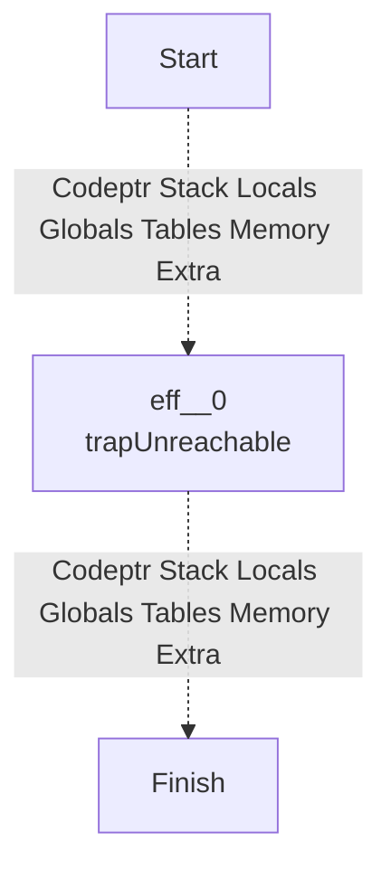
## NOP
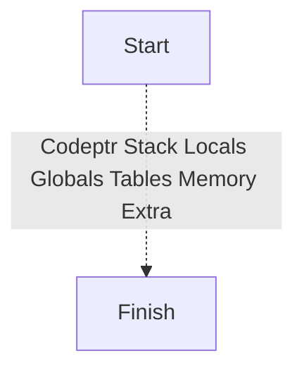
## LOCAL_GET

## LOCAL_SET
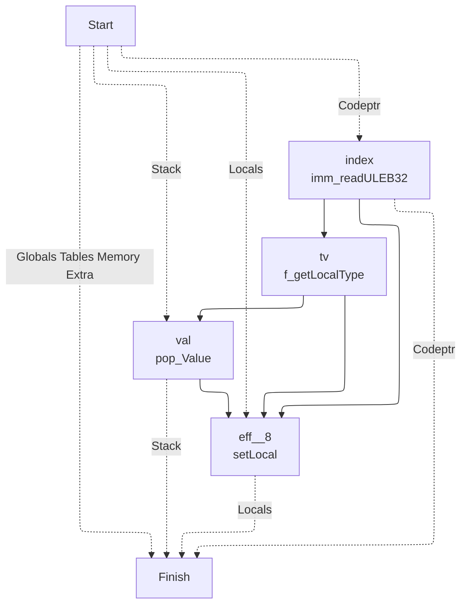
## LOCAL_TEE
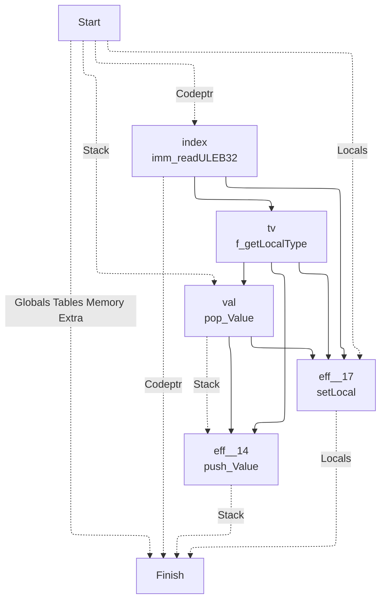
## GLOBAL_GET
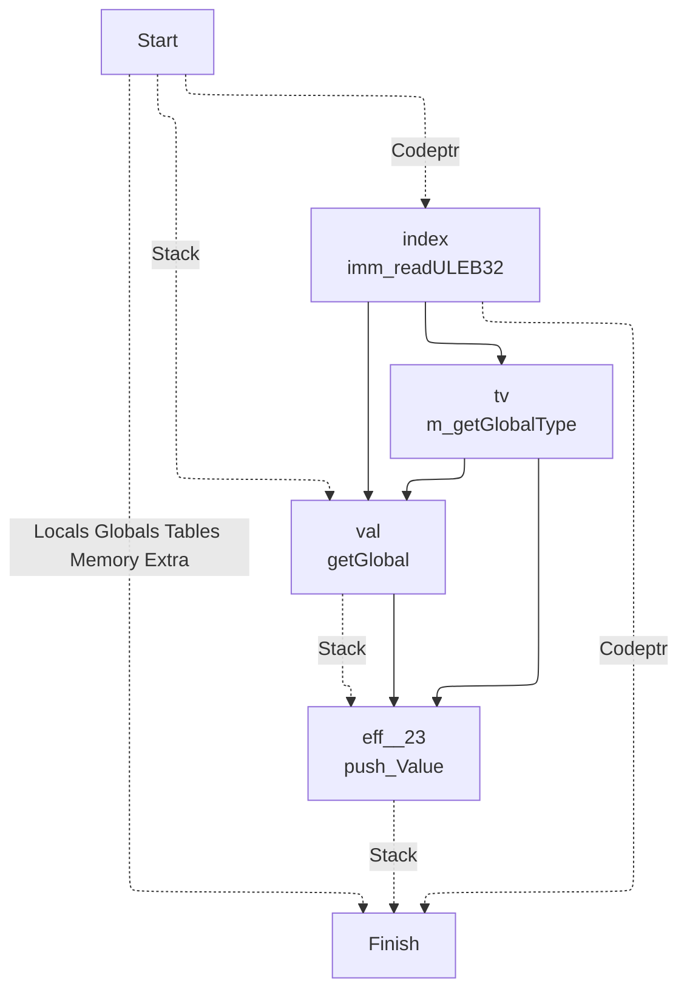
## GLOBAL_SET
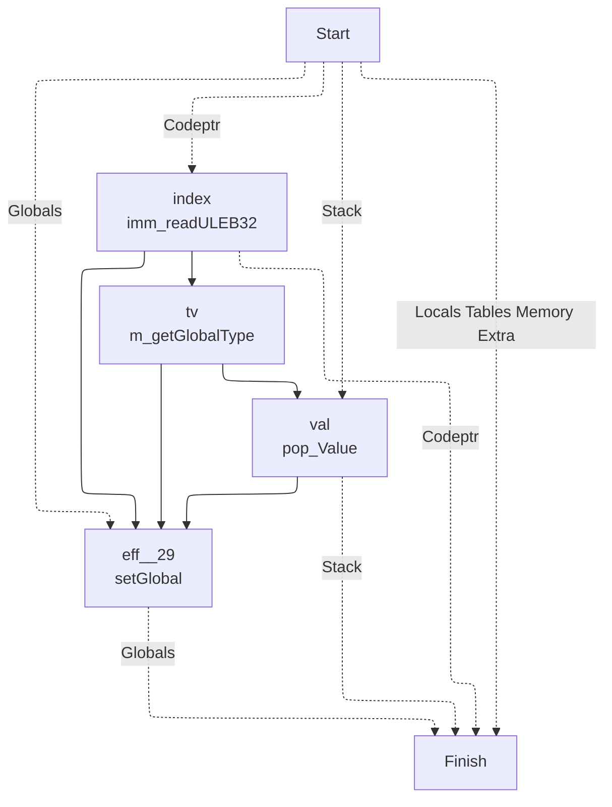
## TABLE_GET
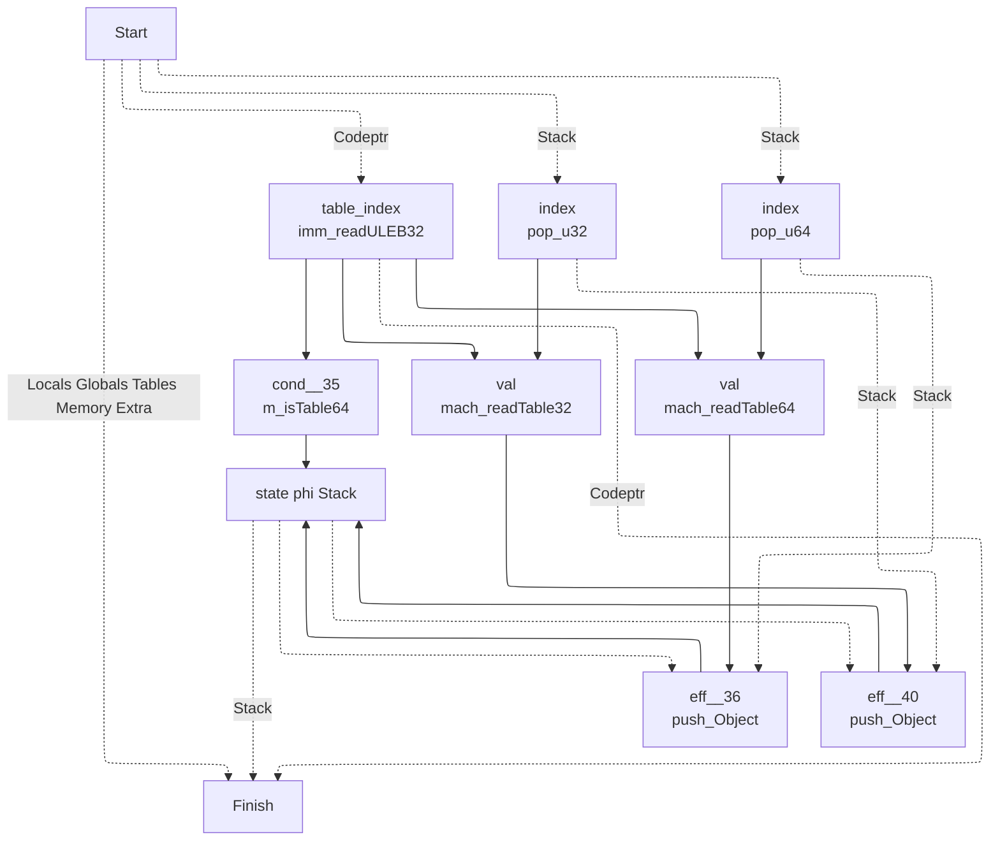
## TABLE_SET
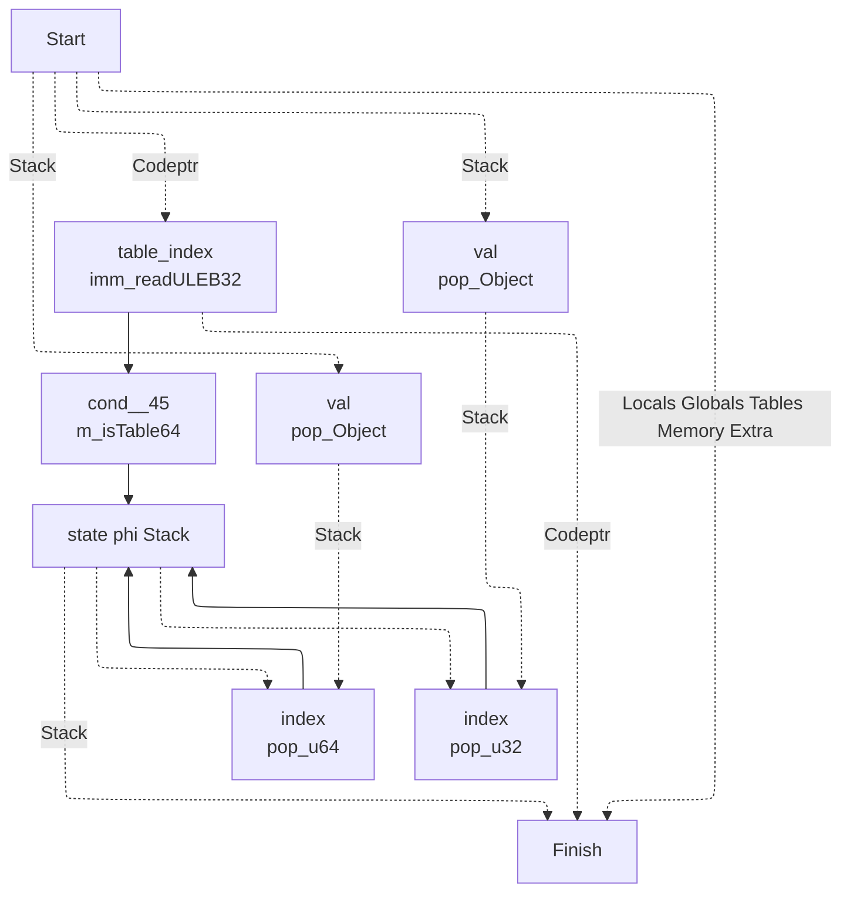
## CALL

## CALL_INDIRECT
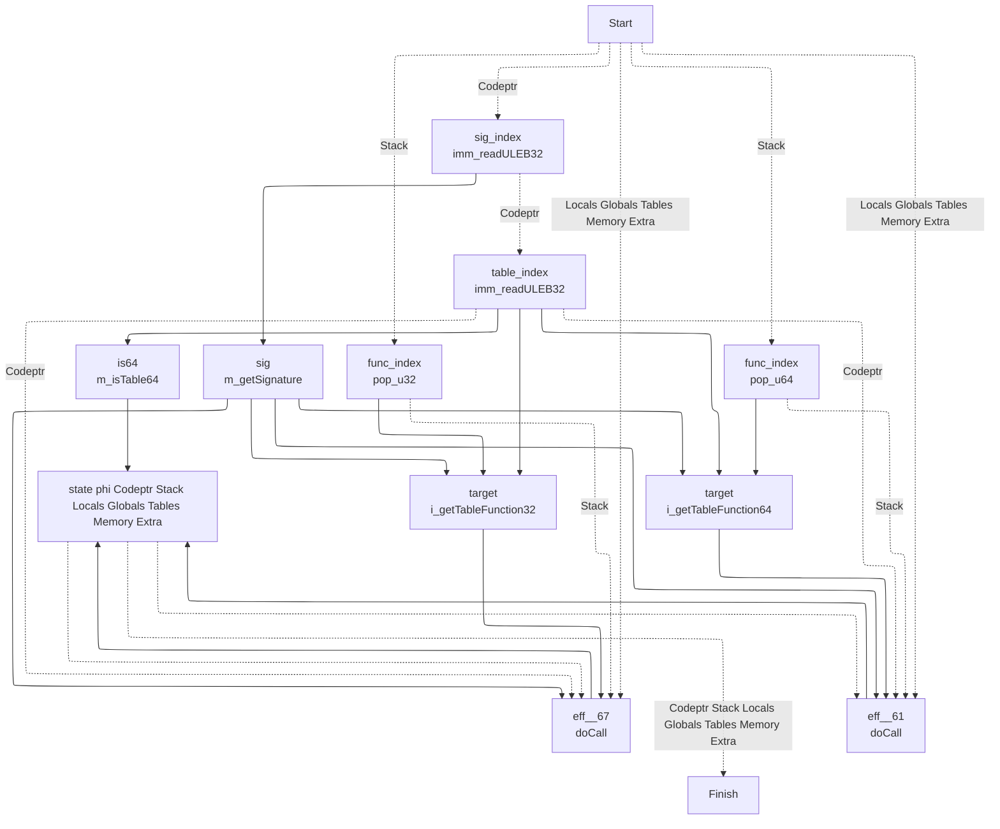
## RETURN_CALL

## DROP
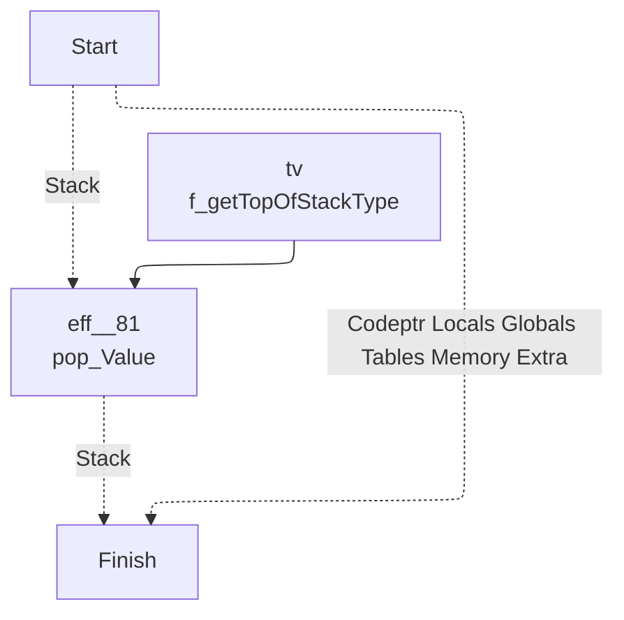
## SELECT
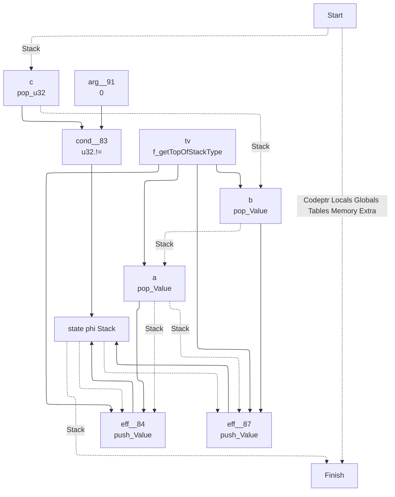
## I32_CONST

## I32_ADD

## I32_SUB

## I32_MUL

## I32_DIV_S
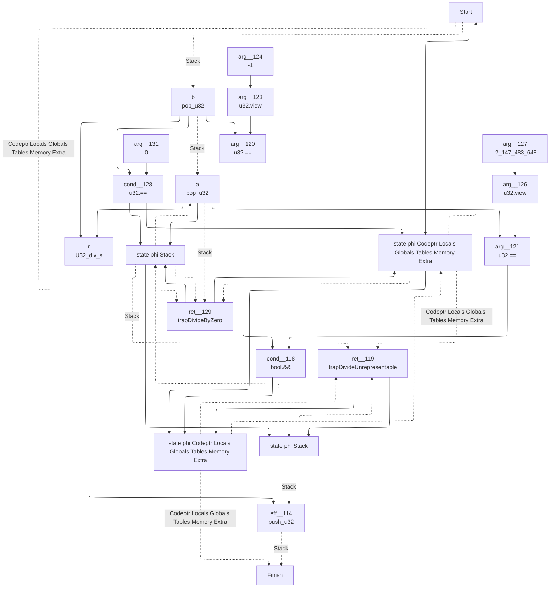
## I32_DIV_U
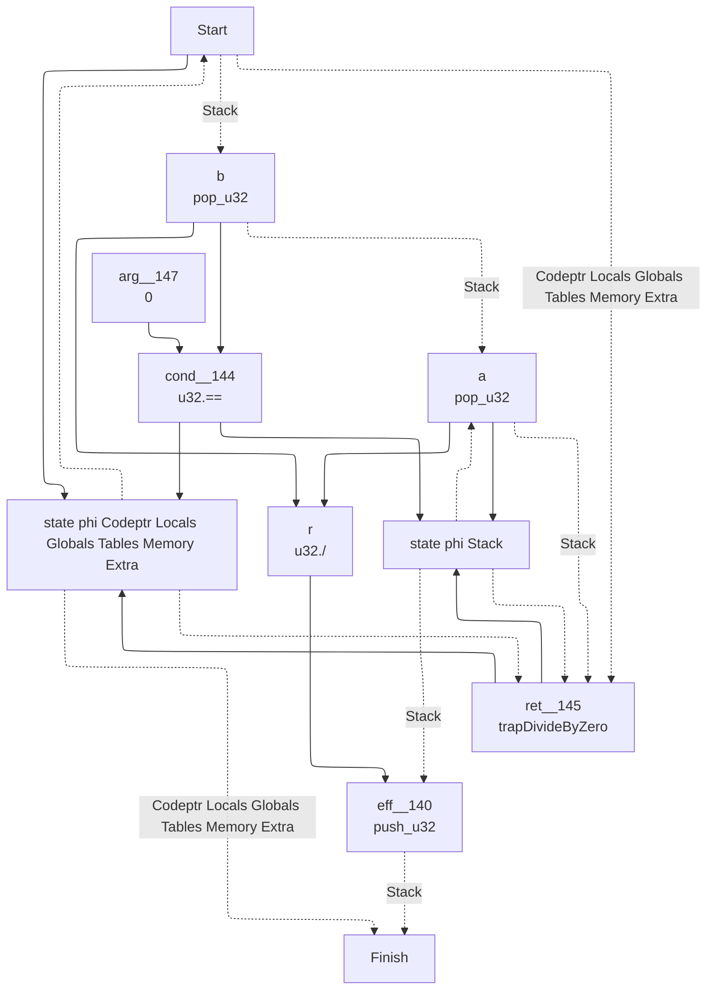
## I32_EQZ
```mermaid
---
config:
  layout: elk
---
graph TD
	1["
	Finish
	"]
	0 -. Codeptr Locals Globals Tables Memory Extra .-> 1
	9 -. Stack .-> 1
	9["
	state phi Stack 	"]
	5 --> 9
	8 --> 9
	6 --> 9
	6["
	eff__157
	push_u32
	"]
	4 --> 6
	3 -. Stack .-> 6
	9.-> 6
	3["
	a
	pop_u32
	"]
	0 -. Stack .-> 3
	0["
	Start
	"]
	4["
	arg__160
	0
	"]
	8["
	eff__155
	push_u32
	"]
	7 --> 8
	3 -. Stack .-> 8
	9.-> 8
	7["
	arg__156
	1
	"]
	5["
	cond__154
	u32.==
	"]
	3 --> 5
	4 --> 5
```
## I32_EQ
```mermaid
---
config:
  layout: elk
---
graph TD
	1["
	Finish
	"]
	0 -. Codeptr Locals Globals Tables Memory Extra .-> 1
	10 -. Stack .-> 1
	10["
	state phi Stack 	"]
	5 --> 10
	9 --> 10
	7 --> 10
	7["
	eff__171
	push_u32
	"]
	6 --> 7
	4 -. Stack .-> 7
	10.-> 7
	4["
	a
	pop_u32
	"]
	3 -. Stack .-> 4
	3["
	b
	pop_u32
	"]
	0 -. Stack .-> 3
	0["
	Start
	"]
	6["
	arg__172
	0
	"]
	9["
	eff__169
	push_u32
	"]
	8 --> 9
	4 -. Stack .-> 9
	10.-> 9
	8["
	arg__170
	1
	"]
	5["
	cond__168
	u32.==
	"]
	4 --> 5
	3 --> 5
```
## I32_NE
```mermaid
---
config:
  layout: elk
---
graph TD
	1["
	Finish
	"]
	0 -. Codeptr Locals Globals Tables Memory Extra .-> 1
	10 -. Stack .-> 1
	10["
	state phi Stack 	"]
	5 --> 10
	9 --> 10
	7 --> 10
	7["
	eff__184
	push_u32
	"]
	6 --> 7
	4 -. Stack .-> 7
	10.-> 7
	4["
	a
	pop_u32
	"]
	3 -. Stack .-> 4
	3["
	b
	pop_u32
	"]
	0 -. Stack .-> 3
	0["
	Start
	"]
	6["
	arg__185
	0
	"]
	9["
	eff__182
	push_u32
	"]
	8 --> 9
	4 -. Stack .-> 9
	10.-> 9
	8["
	arg__183
	1
	"]
	5["
	cond__181
	u32.!=
	"]
	4 --> 5
	3 --> 5
```
## I32_LT_U
```mermaid
---
config:
  layout: elk
---
graph TD
	1["
	Finish
	"]
	0 -. Codeptr Locals Globals Tables Memory Extra .-> 1
	10 -. Stack .-> 1
	10["
	state phi Stack 	"]
	5 --> 10
	9 --> 10
	7 --> 10
	7["
	eff__197
	push_u32
	"]
	6 --> 7
	4 -. Stack .-> 7
	10.-> 7
	4["
	a
	pop_u32
	"]
	3 -. Stack .-> 4
	3["
	b
	pop_u32
	"]
	0 -. Stack .-> 3
	0["
	Start
	"]
	6["
	arg__198
	0
	"]
	9["
	eff__195
	push_u32
	"]
	8 --> 9
	4 -. Stack .-> 9
	10.-> 9
	8["
	arg__196
	1
	"]
	5["
	cond__194
	u32.<
	"]
	4 --> 5
	3 --> 5
```
## I32_LT_S
```mermaid
---
config:
  layout: elk
---
graph TD
	1["
	Finish
	"]
	0 -. Codeptr Locals Globals Tables Memory Extra .-> 1
	10 -. Stack .-> 1
	10["
	state phi Stack 	"]
	5 --> 10
	9 --> 10
	7 --> 10
	7["
	eff__210
	push_u32
	"]
	6 --> 7
	4 -. Stack .-> 7
	10.-> 7
	4["
	a
	pop_u32
	"]
	3 -. Stack .-> 4
	3["
	b
	pop_u32
	"]
	0 -. Stack .-> 3
	0["
	Start
	"]
	6["
	arg__211
	0
	"]
	9["
	eff__208
	push_u32
	"]
	8 --> 9
	4 -. Stack .-> 9
	10.-> 9
	8["
	arg__209
	1
	"]
	5["
	cond__207
	U32_lt_s
	"]
	4 --> 5
	3 --> 5
```
## I32_LE_S
```mermaid
---
config:
  layout: elk
---
graph TD
	1["
	Finish
	"]
	0 -. Codeptr Locals Globals Tables Memory Extra .-> 1
	10 -. Stack .-> 1
	10["
	state phi Stack 	"]
	5 --> 10
	9 --> 10
	7 --> 10
	7["
	eff__223
	push_u32
	"]
	6 --> 7
	4 -. Stack .-> 7
	10.-> 7
	4["
	a
	pop_u32
	"]
	3 -. Stack .-> 4
	3["
	b
	pop_u32
	"]
	0 -. Stack .-> 3
	0["
	Start
	"]
	6["
	arg__224
	0
	"]
	9["
	eff__221
	push_u32
	"]
	8 --> 9
	4 -. Stack .-> 9
	10.-> 9
	8["
	arg__222
	1
	"]
	5["
	cond__220
	U32_le_s
	"]
	4 --> 5
	3 --> 5
```
## I32_GT_U
```mermaid
---
config:
  layout: elk
---
graph TD
	1["
	Finish
	"]
	0 -. Codeptr Locals Globals Tables Memory Extra .-> 1
	10 -. Stack .-> 1
	10["
	state phi Stack 	"]
	5 --> 10
	9 --> 10
	7 --> 10
	7["
	eff__236
	push_u32
	"]
	6 --> 7
	4 -. Stack .-> 7
	10.-> 7
	4["
	a
	pop_u32
	"]
	3 -. Stack .-> 4
	3["
	b
	pop_u32
	"]
	0 -. Stack .-> 3
	0["
	Start
	"]
	6["
	arg__237
	0
	"]
	9["
	eff__234
	push_u32
	"]
	8 --> 9
	4 -. Stack .-> 9
	10.-> 9
	8["
	arg__235
	1
	"]
	5["
	cond__233
	u32.>
	"]
	4 --> 5
	3 --> 5
```
## I32_LE_U
```mermaid
---
config:
  layout: elk
---
graph TD
	1["
	Finish
	"]
	0 -. Codeptr Locals Globals Tables Memory Extra .-> 1
	10 -. Stack .-> 1
	10["
	state phi Stack 	"]
	5 --> 10
	9 --> 10
	7 --> 10
	7["
	eff__249
	push_u32
	"]
	6 --> 7
	4 -. Stack .-> 7
	10.-> 7
	4["
	a
	pop_u32
	"]
	3 -. Stack .-> 4
	3["
	b
	pop_u32
	"]
	0 -. Stack .-> 3
	0["
	Start
	"]
	6["
	arg__250
	0
	"]
	9["
	eff__247
	push_u32
	"]
	8 --> 9
	4 -. Stack .-> 9
	10.-> 9
	8["
	arg__248
	1
	"]
	5["
	cond__246
	u32.<=
	"]
	4 --> 5
	3 --> 5
```
## I32_GT_S
```mermaid
---
config:
  layout: elk
---
graph TD
	1["
	Finish
	"]
	0 -. Codeptr Locals Globals Tables Memory Extra .-> 1
	10 -. Stack .-> 1
	10["
	state phi Stack 	"]
	5 --> 10
	9 --> 10
	7 --> 10
	7["
	eff__262
	push_u32
	"]
	6 --> 7
	4 -. Stack .-> 7
	10.-> 7
	4["
	a
	pop_u32
	"]
	3 -. Stack .-> 4
	3["
	b
	pop_u32
	"]
	0 -. Stack .-> 3
	0["
	Start
	"]
	6["
	arg__263
	0
	"]
	9["
	eff__260
	push_u32
	"]
	8 --> 9
	4 -. Stack .-> 9
	10.-> 9
	8["
	arg__261
	1
	"]
	5["
	cond__259
	U32_gt_s
	"]
	4 --> 5
	3 --> 5
```
## I32_GE_U
```mermaid
---
config:
  layout: elk
---
graph TD
	1["
	Finish
	"]
	0 -. Codeptr Locals Globals Tables Memory Extra .-> 1
	10 -. Stack .-> 1
	10["
	state phi Stack 	"]
	5 --> 10
	9 --> 10
	7 --> 10
	7["
	eff__275
	push_u32
	"]
	6 --> 7
	4 -. Stack .-> 7
	10.-> 7
	4["
	a
	pop_u32
	"]
	3 -. Stack .-> 4
	3["
	b
	pop_u32
	"]
	0 -. Stack .-> 3
	0["
	Start
	"]
	6["
	arg__276
	0
	"]
	9["
	eff__273
	push_u32
	"]
	8 --> 9
	4 -. Stack .-> 9
	10.-> 9
	8["
	arg__274
	1
	"]
	5["
	cond__272
	U32_ge_u
	"]
	4 --> 5
	3 --> 5
```
## I32_GE_S
```mermaid
---
config:
  layout: elk
---
graph TD
	1["
	Finish
	"]
	0 -. Codeptr Locals Globals Tables Memory Extra .-> 1
	10 -. Stack .-> 1
	10["
	state phi Stack 	"]
	5 --> 10
	9 --> 10
	7 --> 10
	7["
	eff__288
	push_u32
	"]
	6 --> 7
	4 -. Stack .-> 7
	10.-> 7
	4["
	a
	pop_u32
	"]
	3 -. Stack .-> 4
	3["
	b
	pop_u32
	"]
	0 -. Stack .-> 3
	0["
	Start
	"]
	6["
	arg__289
	0
	"]
	9["
	eff__286
	push_u32
	"]
	8 --> 9
	4 -. Stack .-> 9
	10.-> 9
	8["
	arg__287
	1
	"]
	5["
	cond__285
	U32_ge_s
	"]
	4 --> 5
	3 --> 5
```
## I32_AND
```mermaid
---
config:
  layout: elk
---
graph TD
	1["
	Finish
	"]
	0 -. Codeptr Locals Globals Tables Memory Extra .-> 1
	6 -. Stack .-> 1
	6["
	eff__298
	push_u32
	"]
	5 --> 6
	4 -. Stack .-> 6
	4["
	a
	pop_u32
	"]
	3 -. Stack .-> 4
	3["
	b
	pop_u32
	"]
	0 -. Stack .-> 3
	0["
	Start
	"]
	5["
	r
	u32.&
	"]
	4 --> 5
	3 --> 5
```
## I32_OR
```mermaid
---
config:
  layout: elk
---
graph TD
	1["
	Finish
	"]
	0 -. Codeptr Locals Globals Tables Memory Extra .-> 1
	6 -. Stack .-> 1
	6["
	eff__302
	push_u32
	"]
	5 --> 6
	4 -. Stack .-> 6
	4["
	a
	pop_u32
	"]
	3 -. Stack .-> 4
	3["
	b
	pop_u32
	"]
	0 -. Stack .-> 3
	0["
	Start
	"]
	5["
	r
	u32.|
	"]
	4 --> 5
	3 --> 5
```
## I32_XOR
```mermaid
---
config:
  layout: elk
---
graph TD
	1["
	Finish
	"]
	0 -. Codeptr Locals Globals Tables Memory Extra .-> 1
	6 -. Stack .-> 1
	6["
	eff__306
	push_u32
	"]
	5 --> 6
	4 -. Stack .-> 6
	4["
	a
	pop_u32
	"]
	3 -. Stack .-> 4
	3["
	b
	pop_u32
	"]
	0 -. Stack .-> 3
	0["
	Start
	"]
	5["
	r
	u32.^
	"]
	4 --> 5
	3 --> 5
```
## I32_SHL
```mermaid
---
config:
  layout: elk
---
graph TD
	1["
	Finish
	"]
	0 -. Codeptr Locals Globals Tables Memory Extra .-> 1
	6 -. Stack .-> 1
	6["
	eff__310
	push_u32
	"]
	5 --> 6
	4 -. Stack .-> 6
	4["
	a
	pop_u32
	"]
	3 -. Stack .-> 4
	3["
	b
	pop_u32
	"]
	0 -. Stack .-> 3
	0["
	Start
	"]
	5["
	r
	U32_shl
	"]
	4 --> 5
	3 --> 5
```
## I32_SHR_U
```mermaid
---
config:
  layout: elk
---
graph TD
	1["
	Finish
	"]
	0 -. Codeptr Locals Globals Tables Memory Extra .-> 1
	6 -. Stack .-> 1
	6["
	eff__314
	push_u32
	"]
	5 --> 6
	4 -. Stack .-> 6
	4["
	a
	pop_u32
	"]
	3 -. Stack .-> 4
	3["
	b
	pop_u32
	"]
	0 -. Stack .-> 3
	0["
	Start
	"]
	5["
	r
	U32_shr_u
	"]
	4 --> 5
	3 --> 5
```
## I32_SHR_S
```mermaid
---
config:
  layout: elk
---
graph TD
	1["
	Finish
	"]
	0 -. Codeptr Locals Globals Tables Memory Extra .-> 1
	6 -. Stack .-> 1
	6["
	eff__318
	push_u32
	"]
	5 --> 6
	4 -. Stack .-> 6
	4["
	a
	pop_u32
	"]
	3 -. Stack .-> 4
	3["
	b
	pop_u32
	"]
	0 -. Stack .-> 3
	0["
	Start
	"]
	5["
	r
	U32_shr_s
	"]
	4 --> 5
	3 --> 5
```
## I32_ROTL
```mermaid
---
config:
  layout: elk
---
graph TD
	1["
	Finish
	"]
	0 -. Codeptr Locals Globals Tables Memory Extra .-> 1
	6 -. Stack .-> 1
	6["
	eff__322
	push_u32
	"]
	5 --> 6
	4 -. Stack .-> 6
	4["
	a
	pop_u32
	"]
	3 -. Stack .-> 4
	3["
	b
	pop_u32
	"]
	0 -. Stack .-> 3
	0["
	Start
	"]
	5["
	r
	U32_rotl
	"]
	4 --> 5
	3 --> 5
```
## I32_ROTR
```mermaid
---
config:
  layout: elk
---
graph TD
	1["
	Finish
	"]
	0 -. Codeptr Locals Globals Tables Memory Extra .-> 1
	6 -. Stack .-> 1
	6["
	eff__326
	push_u32
	"]
	5 --> 6
	4 -. Stack .-> 6
	4["
	a
	pop_u32
	"]
	3 -. Stack .-> 4
	3["
	b
	pop_u32
	"]
	0 -. Stack .-> 3
	0["
	Start
	"]
	5["
	r
	U32_rotr
	"]
	4 --> 5
	3 --> 5
```
## I32_CLZ
```mermaid
---
config:
  layout: elk
---
graph TD
	1["
	Finish
	"]
	0 -. Codeptr Locals Globals Tables Memory Extra .-> 1
	5 -. Stack .-> 1
	5["
	eff__330
	push_u32
	"]
	4 --> 5
	3 -. Stack .-> 5
	3["
	a
	pop_u32
	"]
	0 -. Stack .-> 3
	0["
	Start
	"]
	4["
	r
	U32_clz
	"]
	3 --> 4
```
## I32_CTZ
```mermaid
---
config:
  layout: elk
---
graph TD
	1["
	Finish
	"]
	0 -. Codeptr Locals Globals Tables Memory Extra .-> 1
	5 -. Stack .-> 1
	5["
	eff__333
	push_u32
	"]
	4 --> 5
	3 -. Stack .-> 5
	3["
	a
	pop_u32
	"]
	0 -. Stack .-> 3
	0["
	Start
	"]
	4["
	r
	U32_ctz
	"]
	3 --> 4
```
## I32_POPCNT
```mermaid
---
config:
  layout: elk
---
graph TD
	1["
	Finish
	"]
	0 -. Codeptr Locals Globals Tables Memory Extra .-> 1
	5 -. Stack .-> 1
	5["
	eff__336
	push_u32
	"]
	4 --> 5
	3 -. Stack .-> 5
	3["
	a
	pop_u32
	"]
	0 -. Stack .-> 3
	0["
	Start
	"]
	4["
	r
	U32_popcnt
	"]
	3 --> 4
```
## I32_REM_S
```mermaid
---
config:
  layout: elk
---
graph TD
	1["
	Finish
	"]
	8 -. Codeptr Locals Globals Tables Memory Extra .-> 1
	11 -. Stack .-> 1
	11["
	eff__339
	push_u32
	"]
	10 --> 11
	9 -. Stack .-> 11
	9["
	state phi Stack 	"]
	6 --> 9
	7 --> 9
	4 --> 9
	4["
	a
	pop_u32
	"]
	3 -. Stack .-> 4
	9.-> 4
	3["
	b
	pop_u32
	"]
	0 -. Stack .-> 3
	0["
	Start
	"]
	8.-> 0
	7["
	ret__344
	trapDivideByZero
	"]
	0 -. Codeptr Locals Globals Tables Memory Extra .-> 7
	4 -. Stack .-> 7
	8.-> 7
	9.-> 7
	6["
	cond__343
	u32.==
	"]
	3 --> 6
	5 --> 6
	5["
	arg__346
	0
	"]
	10["
	r
	U32_rem_s
	"]
	4 --> 10
	3 --> 10
	8["
	state phi Codeptr Locals Globals Tables Memory Extra 	"]
	6 --> 8
	7 --> 8
	0 --> 8
```
## I32_REM_U
```mermaid
---
config:
  layout: elk
---
graph TD
	1["
	Finish
	"]
	8 -. Codeptr Locals Globals Tables Memory Extra .-> 1
	11 -. Stack .-> 1
	11["
	eff__353
	push_u32
	"]
	10 --> 11
	9 -. Stack .-> 11
	9["
	state phi Stack 	"]
	6 --> 9
	7 --> 9
	4 --> 9
	4["
	a
	pop_u32
	"]
	3 -. Stack .-> 4
	9.-> 4
	3["
	b
	pop_u32
	"]
	0 -. Stack .-> 3
	0["
	Start
	"]
	8.-> 0
	7["
	ret__358
	trapDivideByZero
	"]
	0 -. Codeptr Locals Globals Tables Memory Extra .-> 7
	4 -. Stack .-> 7
	8.-> 7
	9.-> 7
	6["
	cond__357
	u32.==
	"]
	3 --> 6
	5 --> 6
	5["
	arg__360
	0
	"]
	10["
	r
	U32_rem_u
	"]
	4 --> 10
	3 --> 10
	8["
	state phi Codeptr Locals Globals Tables Memory Extra 	"]
	6 --> 8
	7 --> 8
	0 --> 8
```
## I32_EXTEND8_S
```mermaid
---
config:
  layout: elk
---
graph TD
	1["
	Finish
	"]
	0 -. Codeptr Locals Globals Tables Memory Extra .-> 1
	5 -. Stack .-> 1
	5["
	eff__367
	push_u32
	"]
	4 --> 5
	3 -. Stack .-> 5
	3["
	a
	pop_u32
	"]
	0 -. Stack .-> 3
	0["
	Start
	"]
	4["
	r
	U32_extend8_s
	"]
	3 --> 4
```
## I32_EXTEND16_S
```mermaid
---
config:
  layout: elk
---
graph TD
	1["
	Finish
	"]
	0 -. Codeptr Locals Globals Tables Memory Extra .-> 1
	5 -. Stack .-> 1
	5["
	eff__370
	push_u32
	"]
	4 --> 5
	3 -. Stack .-> 5
	3["
	a
	pop_u32
	"]
	0 -. Stack .-> 3
	0["
	Start
	"]
	4["
	r
	U32_extend16_s
	"]
	3 --> 4
```
## I64_CONST
```mermaid
---
config:
  layout: elk
---
graph TD
	1["
	Finish
	"]
	3 -. Codeptr .-> 1
	4 -. Stack .-> 1
	0 -. Locals Globals Tables Memory Extra .-> 1
	0["
	Start
	"]
	4["
	eff__373
	push_u64
	"]
	3 --> 4
	0 -. Stack .-> 4
	3["
	x
	imm_readILEB64
	"]
	0 -. Codeptr .-> 3
```
## I64_ADD
```mermaid
---
config:
  layout: elk
---
graph TD
	1["
	Finish
	"]
	0 -. Codeptr Locals Globals Tables Memory Extra .-> 1
	6 -. Stack .-> 1
	6["
	eff__376
	push_u64
	"]
	5 --> 6
	4 -. Stack .-> 6
	4["
	a
	pop_u64
	"]
	3 -. Stack .-> 4
	3["
	b
	pop_u64
	"]
	0 -. Stack .-> 3
	0["
	Start
	"]
	5["
	r
	u64.+
	"]
	4 --> 5
	3 --> 5
```
## I64_SUB
```mermaid
---
config:
  layout: elk
---
graph TD
	1["
	Finish
	"]
	0 -. Codeptr Locals Globals Tables Memory Extra .-> 1
	6 -. Stack .-> 1
	6["
	eff__380
	push_u64
	"]
	5 --> 6
	4 -. Stack .-> 6
	4["
	a
	pop_u64
	"]
	3 -. Stack .-> 4
	3["
	b
	pop_u64
	"]
	0 -. Stack .-> 3
	0["
	Start
	"]
	5["
	r
	u64.-
	"]
	4 --> 5
	3 --> 5
```
## I64_MUL
```mermaid
---
config:
  layout: elk
---
graph TD
	1["
	Finish
	"]
	0 -. Codeptr Locals Globals Tables Memory Extra .-> 1
	6 -. Stack .-> 1
	6["
	eff__384
	push_u64
	"]
	5 --> 6
	4 -. Stack .-> 6
	4["
	a
	pop_u64
	"]
	3 -. Stack .-> 4
	3["
	b
	pop_u64
	"]
	0 -. Stack .-> 3
	0["
	Start
	"]
	5["
	r
	u64.*
	"]
	4 --> 5
	3 --> 5
```
## I64_DIV_S
```mermaid
---
config:
  layout: elk
---
graph TD
	1["
	Finish
	"]
	18 -. Codeptr Locals Globals Tables Memory Extra .-> 1
	21 -. Stack .-> 1
	21["
	eff__388
	push_u64
	"]
	20 --> 21
	19 -. Stack .-> 21
	19["
	state phi Stack 	"]
	16 --> 19
	17 --> 19
	9 --> 19
	9["
	state phi Stack 	"]
	6 --> 9
	7 --> 9
	4 --> 9
	19.-> 9
	4["
	a
	pop_u64
	"]
	3 -. Stack .-> 4
	9.-> 4
	3["
	b
	pop_u64
	"]
	0 -. Stack .-> 3
	0["
	Start
	"]
	8.-> 0
	7["
	ret__403
	trapDivideByZero
	"]
	0 -. Codeptr Locals Globals Tables Memory Extra .-> 7
	4 -. Stack .-> 7
	8.-> 7
	9.-> 7
	6["
	cond__402
	u64.==
	"]
	3 --> 6
	5 --> 6
	5["
	arg__405
	0
	"]
	17["
	ret__393
	trapDivideUnrepresentable
	"]
	8 -. Codeptr Locals Globals Tables Memory Extra .-> 17
	9 -. Stack .-> 17
	18.-> 17
	19.-> 17
	8["
	state phi Codeptr Locals Globals Tables Memory Extra 	"]
	6 --> 8
	7 --> 8
	0 --> 8
	18.-> 8
	16["
	cond__392
	bool.&&
	"]
	15 --> 16
	12 --> 16
	12["
	arg__395
	u64.==
	"]
	4 --> 12
	11 --> 12
	11["
	arg__400
	u64.view
	"]
	10 --> 11
	10["
	arg__401
	-9223372036854775808L
	"]
	15["
	arg__394
	u64.==
	"]
	3 --> 15
	14 --> 15
	14["
	arg__397
	u64.view
	"]
	13 --> 14
	13["
	arg__398
	-1
	"]
	20["
	r
	U64_div_s
	"]
	4 --> 20
	3 --> 20
	18["
	state phi Codeptr Locals Globals Tables Memory Extra 	"]
	16 --> 18
	17 --> 18
	8 --> 18
```
## I64_DIV_U
```mermaid
---
config:
  layout: elk
---
graph TD
	1["
	Finish
	"]
	8 -. Codeptr Locals Globals Tables Memory Extra .-> 1
	11 -. Stack .-> 1
	11["
	eff__411
	push_u64
	"]
	10 --> 11
	9 -. Stack .-> 11
	9["
	state phi Stack 	"]
	6 --> 9
	7 --> 9
	4 --> 9
	4["
	a
	pop_u64
	"]
	3 -. Stack .-> 4
	9.-> 4
	3["
	b
	pop_u64
	"]
	0 -. Stack .-> 3
	0["
	Start
	"]
	8.-> 0
	7["
	ret__416
	trapDivideByZero
	"]
	0 -. Codeptr Locals Globals Tables Memory Extra .-> 7
	4 -. Stack .-> 7
	8.-> 7
	9.-> 7
	6["
	cond__415
	u64.==
	"]
	3 --> 6
	5 --> 6
	5["
	arg__418
	0
	"]
	10["
	r
	u64./
	"]
	4 --> 10
	3 --> 10
	8["
	state phi Codeptr Locals Globals Tables Memory Extra 	"]
	6 --> 8
	7 --> 8
	0 --> 8
```
## I64_REM_S
```mermaid
---
config:
  layout: elk
---
graph TD
	1["
	Finish
	"]
	8 -. Codeptr Locals Globals Tables Memory Extra .-> 1
	11 -. Stack .-> 1
	11["
	eff__424
	push_u64
	"]
	10 --> 11
	9 -. Stack .-> 11
	9["
	state phi Stack 	"]
	6 --> 9
	7 --> 9
	4 --> 9
	4["
	a
	pop_u64
	"]
	3 -. Stack .-> 4
	9.-> 4
	3["
	b
	pop_u64
	"]
	0 -. Stack .-> 3
	0["
	Start
	"]
	8.-> 0
	7["
	ret__429
	trapDivideByZero
	"]
	0 -. Codeptr Locals Globals Tables Memory Extra .-> 7
	4 -. Stack .-> 7
	8.-> 7
	9.-> 7
	6["
	cond__428
	u64.==
	"]
	3 --> 6
	5 --> 6
	5["
	arg__431
	0
	"]
	10["
	r
	U64_rem_s
	"]
	4 --> 10
	3 --> 10
	8["
	state phi Codeptr Locals Globals Tables Memory Extra 	"]
	6 --> 8
	7 --> 8
	0 --> 8
```
## I64_REM_U
```mermaid
---
config:
  layout: elk
---
graph TD
	1["
	Finish
	"]
	8 -. Codeptr Locals Globals Tables Memory Extra .-> 1
	11 -. Stack .-> 1
	11["
	eff__437
	push_u64
	"]
	10 --> 11
	9 -. Stack .-> 11
	9["
	state phi Stack 	"]
	6 --> 9
	7 --> 9
	4 --> 9
	4["
	a
	pop_u64
	"]
	3 -. Stack .-> 4
	9.-> 4
	3["
	b
	pop_u64
	"]
	0 -. Stack .-> 3
	0["
	Start
	"]
	8.-> 0
	7["
	ret__442
	trapDivideByZero
	"]
	0 -. Codeptr Locals Globals Tables Memory Extra .-> 7
	4 -. Stack .-> 7
	8.-> 7
	9.-> 7
	6["
	cond__441
	u64.==
	"]
	3 --> 6
	5 --> 6
	5["
	arg__444
	0
	"]
	10["
	r
	U64_rem_u
	"]
	4 --> 10
	3 --> 10
	8["
	state phi Codeptr Locals Globals Tables Memory Extra 	"]
	6 --> 8
	7 --> 8
	0 --> 8
```
## I64_AND
```mermaid
---
config:
  layout: elk
---
graph TD
	1["
	Finish
	"]
	0 -. Codeptr Locals Globals Tables Memory Extra .-> 1
	6 -. Stack .-> 1
	6["
	eff__450
	push_u64
	"]
	5 --> 6
	4 -. Stack .-> 6
	4["
	a
	pop_u64
	"]
	3 -. Stack .-> 4
	3["
	b
	pop_u64
	"]
	0 -. Stack .-> 3
	0["
	Start
	"]
	5["
	r
	u64.&
	"]
	4 --> 5
	3 --> 5
```
## I64_OR
```mermaid
---
config:
  layout: elk
---
graph TD
	1["
	Finish
	"]
	0 -. Codeptr Locals Globals Tables Memory Extra .-> 1
	6 -. Stack .-> 1
	6["
	eff__454
	push_u64
	"]
	5 --> 6
	4 -. Stack .-> 6
	4["
	a
	pop_u64
	"]
	3 -. Stack .-> 4
	3["
	b
	pop_u64
	"]
	0 -. Stack .-> 3
	0["
	Start
	"]
	5["
	r
	u64.|
	"]
	4 --> 5
	3 --> 5
```
## I64_XOR
```mermaid
---
config:
  layout: elk
---
graph TD
	1["
	Finish
	"]
	0 -. Codeptr Locals Globals Tables Memory Extra .-> 1
	6 -. Stack .-> 1
	6["
	eff__458
	push_u64
	"]
	5 --> 6
	4 -. Stack .-> 6
	4["
	a
	pop_u64
	"]
	3 -. Stack .-> 4
	3["
	b
	pop_u64
	"]
	0 -. Stack .-> 3
	0["
	Start
	"]
	5["
	r
	u64.^
	"]
	4 --> 5
	3 --> 5
```
## I64_SHL
```mermaid
---
config:
  layout: elk
---
graph TD
	1["
	Finish
	"]
	0 -. Codeptr Locals Globals Tables Memory Extra .-> 1
	6 -. Stack .-> 1
	6["
	eff__462
	push_u64
	"]
	5 --> 6
	4 -. Stack .-> 6
	4["
	a
	pop_u64
	"]
	3 -. Stack .-> 4
	3["
	b
	pop_u64
	"]
	0 -. Stack .-> 3
	0["
	Start
	"]
	5["
	r
	U64_shl
	"]
	4 --> 5
	3 --> 5
```
## I64_SHR_U
```mermaid
---
config:
  layout: elk
---
graph TD
	1["
	Finish
	"]
	0 -. Codeptr Locals Globals Tables Memory Extra .-> 1
	6 -. Stack .-> 1
	6["
	eff__466
	push_u64
	"]
	5 --> 6
	4 -. Stack .-> 6
	4["
	a
	pop_u64
	"]
	3 -. Stack .-> 4
	3["
	b
	pop_u64
	"]
	0 -. Stack .-> 3
	0["
	Start
	"]
	5["
	r
	U64_shr_u
	"]
	4 --> 5
	3 --> 5
```
## I64_SHR_S
```mermaid
---
config:
  layout: elk
---
graph TD
	1["
	Finish
	"]
	0 -. Codeptr Locals Globals Tables Memory Extra .-> 1
	6 -. Stack .-> 1
	6["
	eff__470
	push_u64
	"]
	5 --> 6
	4 -. Stack .-> 6
	4["
	a
	pop_u64
	"]
	3 -. Stack .-> 4
	3["
	b
	pop_u64
	"]
	0 -. Stack .-> 3
	0["
	Start
	"]
	5["
	r
	U64_shr_s
	"]
	4 --> 5
	3 --> 5
```
## I64_ROTL
```mermaid
---
config:
  layout: elk
---
graph TD
	1["
	Finish
	"]
	0 -. Codeptr Locals Globals Tables Memory Extra .-> 1
	6 -. Stack .-> 1
	6["
	eff__474
	push_u64
	"]
	5 --> 6
	4 -. Stack .-> 6
	4["
	a
	pop_u64
	"]
	3 -. Stack .-> 4
	3["
	b
	pop_u64
	"]
	0 -. Stack .-> 3
	0["
	Start
	"]
	5["
	r
	U64_rotl
	"]
	4 --> 5
	3 --> 5
```
## I64_ROTR
```mermaid
---
config:
  layout: elk
---
graph TD
	1["
	Finish
	"]
	0 -. Codeptr Locals Globals Tables Memory Extra .-> 1
	6 -. Stack .-> 1
	6["
	eff__478
	push_u64
	"]
	5 --> 6
	4 -. Stack .-> 6
	4["
	a
	pop_u64
	"]
	3 -. Stack .-> 4
	3["
	b
	pop_u64
	"]
	0 -. Stack .-> 3
	0["
	Start
	"]
	5["
	r
	U64_rotr
	"]
	4 --> 5
	3 --> 5
```
## I64_CLZ
```mermaid
---
config:
  layout: elk
---
graph TD
	1["
	Finish
	"]
	0 -. Codeptr Locals Globals Tables Memory Extra .-> 1
	5 -. Stack .-> 1
	5["
	eff__482
	push_u64
	"]
	4 --> 5
	3 -. Stack .-> 5
	3["
	a
	pop_u64
	"]
	0 -. Stack .-> 3
	0["
	Start
	"]
	4["
	r
	U64_clz
	"]
	3 --> 4
```
## I64_CTZ
```mermaid
---
config:
  layout: elk
---
graph TD
	1["
	Finish
	"]
	0 -. Codeptr Locals Globals Tables Memory Extra .-> 1
	5 -. Stack .-> 1
	5["
	eff__485
	push_u64
	"]
	4 --> 5
	3 -. Stack .-> 5
	3["
	a
	pop_u64
	"]
	0 -. Stack .-> 3
	0["
	Start
	"]
	4["
	r
	U64_ctz
	"]
	3 --> 4
```
## I64_POPCNT
```mermaid
---
config:
  layout: elk
---
graph TD
	1["
	Finish
	"]
	0 -. Codeptr Locals Globals Tables Memory Extra .-> 1
	5 -. Stack .-> 1
	5["
	eff__488
	push_u64
	"]
	4 --> 5
	3 -. Stack .-> 5
	3["
	a
	pop_u64
	"]
	0 -. Stack .-> 3
	0["
	Start
	"]
	4["
	r
	U64_popcnt
	"]
	3 --> 4
```
## I64_EQZ
```mermaid
---
config:
  layout: elk
---
graph TD
	1["
	Finish
	"]
	0 -. Codeptr Locals Globals Tables Memory Extra .-> 1
	9 -. Stack .-> 1
	9["
	state phi Stack 	"]
	5 --> 9
	8 --> 9
	6 --> 9
	6["
	eff__494
	push_u32
	"]
	4 --> 6
	3 -. Stack .-> 6
	9.-> 6
	3["
	a
	pop_u64
	"]
	0 -. Stack .-> 3
	0["
	Start
	"]
	4["
	arg__497
	0
	"]
	8["
	eff__492
	push_u32
	"]
	7 --> 8
	3 -. Stack .-> 8
	9.-> 8
	7["
	arg__493
	1
	"]
	5["
	cond__491
	u64.==
	"]
	3 --> 5
	4 --> 5
```
## I64_EQ
```mermaid
---
config:
  layout: elk
---
graph TD
	1["
	Finish
	"]
	0 -. Codeptr Locals Globals Tables Memory Extra .-> 1
	10 -. Stack .-> 1
	10["
	state phi Stack 	"]
	5 --> 10
	9 --> 10
	7 --> 10
	7["
	eff__507
	push_u32
	"]
	6 --> 7
	4 -. Stack .-> 7
	10.-> 7
	4["
	a
	pop_u64
	"]
	3 -. Stack .-> 4
	3["
	b
	pop_u64
	"]
	0 -. Stack .-> 3
	0["
	Start
	"]
	6["
	arg__508
	0
	"]
	9["
	eff__505
	push_u32
	"]
	8 --> 9
	4 -. Stack .-> 9
	10.-> 9
	8["
	arg__506
	1
	"]
	5["
	cond__504
	u64.==
	"]
	4 --> 5
	3 --> 5
```
## I64_NE
```mermaid
---
config:
  layout: elk
---
graph TD
	1["
	Finish
	"]
	0 -. Codeptr Locals Globals Tables Memory Extra .-> 1
	10 -. Stack .-> 1
	10["
	state phi Stack 	"]
	5 --> 10
	9 --> 10
	7 --> 10
	7["
	eff__520
	push_u32
	"]
	6 --> 7
	4 -. Stack .-> 7
	10.-> 7
	4["
	a
	pop_u64
	"]
	3 -. Stack .-> 4
	3["
	b
	pop_u64
	"]
	0 -. Stack .-> 3
	0["
	Start
	"]
	6["
	arg__521
	0
	"]
	9["
	eff__518
	push_u32
	"]
	8 --> 9
	4 -. Stack .-> 9
	10.-> 9
	8["
	arg__519
	1
	"]
	5["
	cond__517
	u64.!=
	"]
	4 --> 5
	3 --> 5
```
## I64_LT_S
```mermaid
---
config:
  layout: elk
---
graph TD
	1["
	Finish
	"]
	0 -. Codeptr Locals Globals Tables Memory Extra .-> 1
	10 -. Stack .-> 1
	10["
	state phi Stack 	"]
	5 --> 10
	9 --> 10
	7 --> 10
	7["
	eff__533
	push_u32
	"]
	6 --> 7
	4 -. Stack .-> 7
	10.-> 7
	4["
	a
	pop_u64
	"]
	3 -. Stack .-> 4
	3["
	b
	pop_u64
	"]
	0 -. Stack .-> 3
	0["
	Start
	"]
	6["
	arg__534
	0
	"]
	9["
	eff__531
	push_u32
	"]
	8 --> 9
	4 -. Stack .-> 9
	10.-> 9
	8["
	arg__532
	1
	"]
	5["
	cond__530
	U64_lt_s
	"]
	4 --> 5
	3 --> 5
```
## I64_LT_U
```mermaid
---
config:
  layout: elk
---
graph TD
	1["
	Finish
	"]
	0 -. Codeptr Locals Globals Tables Memory Extra .-> 1
	10 -. Stack .-> 1
	10["
	state phi Stack 	"]
	5 --> 10
	9 --> 10
	7 --> 10
	7["
	eff__546
	push_u32
	"]
	6 --> 7
	4 -. Stack .-> 7
	10.-> 7
	4["
	a
	pop_u64
	"]
	3 -. Stack .-> 4
	3["
	b
	pop_u64
	"]
	0 -. Stack .-> 3
	0["
	Start
	"]
	6["
	arg__547
	0
	"]
	9["
	eff__544
	push_u32
	"]
	8 --> 9
	4 -. Stack .-> 9
	10.-> 9
	8["
	arg__545
	1
	"]
	5["
	cond__543
	u64.<
	"]
	4 --> 5
	3 --> 5
```
## I64_LE_S
```mermaid
---
config:
  layout: elk
---
graph TD
	1["
	Finish
	"]
	0 -. Codeptr Locals Globals Tables Memory Extra .-> 1
	10 -. Stack .-> 1
	10["
	state phi Stack 	"]
	5 --> 10
	9 --> 10
	7 --> 10
	7["
	eff__559
	push_u32
	"]
	6 --> 7
	4 -. Stack .-> 7
	10.-> 7
	4["
	a
	pop_u64
	"]
	3 -. Stack .-> 4
	3["
	b
	pop_u64
	"]
	0 -. Stack .-> 3
	0["
	Start
	"]
	6["
	arg__560
	0
	"]
	9["
	eff__557
	push_u32
	"]
	8 --> 9
	4 -. Stack .-> 9
	10.-> 9
	8["
	arg__558
	1
	"]
	5["
	cond__556
	U64_le_s
	"]
	4 --> 5
	3 --> 5
```
## I64_LE_U
```mermaid
---
config:
  layout: elk
---
graph TD
	1["
	Finish
	"]
	0 -. Codeptr Locals Globals Tables Memory Extra .-> 1
	10 -. Stack .-> 1
	10["
	state phi Stack 	"]
	5 --> 10
	9 --> 10
	7 --> 10
	7["
	eff__572
	push_u32
	"]
	6 --> 7
	4 -. Stack .-> 7
	10.-> 7
	4["
	a
	pop_u64
	"]
	3 -. Stack .-> 4
	3["
	b
	pop_u64
	"]
	0 -. Stack .-> 3
	0["
	Start
	"]
	6["
	arg__573
	0
	"]
	9["
	eff__570
	push_u32
	"]
	8 --> 9
	4 -. Stack .-> 9
	10.-> 9
	8["
	arg__571
	1
	"]
	5["
	cond__569
	u64.<=
	"]
	4 --> 5
	3 --> 5
```
## I64_GT_S
```mermaid
---
config:
  layout: elk
---
graph TD
	1["
	Finish
	"]
	0 -. Codeptr Locals Globals Tables Memory Extra .-> 1
	10 -. Stack .-> 1
	10["
	state phi Stack 	"]
	5 --> 10
	9 --> 10
	7 --> 10
	7["
	eff__585
	push_u32
	"]
	6 --> 7
	4 -. Stack .-> 7
	10.-> 7
	4["
	a
	pop_u64
	"]
	3 -. Stack .-> 4
	3["
	b
	pop_u64
	"]
	0 -. Stack .-> 3
	0["
	Start
	"]
	6["
	arg__586
	0
	"]
	9["
	eff__583
	push_u32
	"]
	8 --> 9
	4 -. Stack .-> 9
	10.-> 9
	8["
	arg__584
	1
	"]
	5["
	cond__582
	U64_gt_s
	"]
	4 --> 5
	3 --> 5
```
## I64_GT_U
```mermaid
---
config:
  layout: elk
---
graph TD
	1["
	Finish
	"]
	0 -. Codeptr Locals Globals Tables Memory Extra .-> 1
	10 -. Stack .-> 1
	10["
	state phi Stack 	"]
	5 --> 10
	9 --> 10
	7 --> 10
	7["
	eff__598
	push_u32
	"]
	6 --> 7
	4 -. Stack .-> 7
	10.-> 7
	4["
	a
	pop_u64
	"]
	3 -. Stack .-> 4
	3["
	b
	pop_u64
	"]
	0 -. Stack .-> 3
	0["
	Start
	"]
	6["
	arg__599
	0
	"]
	9["
	eff__596
	push_u32
	"]
	8 --> 9
	4 -. Stack .-> 9
	10.-> 9
	8["
	arg__597
	1
	"]
	5["
	cond__595
	u64.>
	"]
	4 --> 5
	3 --> 5
```
## I64_GE_S
```mermaid
---
config:
  layout: elk
---
graph TD
	1["
	Finish
	"]
	0 -. Codeptr Locals Globals Tables Memory Extra .-> 1
	10 -. Stack .-> 1
	10["
	state phi Stack 	"]
	5 --> 10
	9 --> 10
	7 --> 10
	7["
	eff__611
	push_u32
	"]
	6 --> 7
	4 -. Stack .-> 7
	10.-> 7
	4["
	a
	pop_u64
	"]
	3 -. Stack .-> 4
	3["
	b
	pop_u64
	"]
	0 -. Stack .-> 3
	0["
	Start
	"]
	6["
	arg__612
	0
	"]
	9["
	eff__609
	push_u32
	"]
	8 --> 9
	4 -. Stack .-> 9
	10.-> 9
	8["
	arg__610
	1
	"]
	5["
	cond__608
	U64_ge_s
	"]
	4 --> 5
	3 --> 5
```
## I64_GE_U
```mermaid
---
config:
  layout: elk
---
graph TD
	1["
	Finish
	"]
	0 -. Codeptr Locals Globals Tables Memory Extra .-> 1
	10 -. Stack .-> 1
	10["
	state phi Stack 	"]
	5 --> 10
	9 --> 10
	7 --> 10
	7["
	eff__624
	push_u32
	"]
	6 --> 7
	4 -. Stack .-> 7
	10.-> 7
	4["
	a
	pop_u64
	"]
	3 -. Stack .-> 4
	3["
	b
	pop_u64
	"]
	0 -. Stack .-> 3
	0["
	Start
	"]
	6["
	arg__625
	0
	"]
	9["
	eff__622
	push_u32
	"]
	8 --> 9
	4 -. Stack .-> 9
	10.-> 9
	8["
	arg__623
	1
	"]
	5["
	cond__621
	U64_ge_u
	"]
	4 --> 5
	3 --> 5
```
## I64_EXTEND8_S
```mermaid
---
config:
  layout: elk
---
graph TD
	1["
	Finish
	"]
	0 -. Codeptr Locals Globals Tables Memory Extra .-> 1
	5 -. Stack .-> 1
	5["
	eff__634
	push_u64
	"]
	4 --> 5
	3 -. Stack .-> 5
	3["
	a
	pop_u64
	"]
	0 -. Stack .-> 3
	0["
	Start
	"]
	4["
	r
	U64_extend8_s
	"]
	3 --> 4
```
## I64_EXTEND16_S
```mermaid
---
config:
  layout: elk
---
graph TD
	1["
	Finish
	"]
	0 -. Codeptr Locals Globals Tables Memory Extra .-> 1
	5 -. Stack .-> 1
	5["
	eff__637
	push_u64
	"]
	4 --> 5
	3 -. Stack .-> 5
	3["
	a
	pop_u64
	"]
	0 -. Stack .-> 3
	0["
	Start
	"]
	4["
	r
	U64_extend16_s
	"]
	3 --> 4
```
## I64_EXTEND32_S
```mermaid
---
config:
  layout: elk
---
graph TD
	1["
	Finish
	"]
	0 -. Codeptr Locals Globals Tables Memory Extra .-> 1
	5 -. Stack .-> 1
	5["
	eff__640
	push_u64
	"]
	4 --> 5
	3 -. Stack .-> 5
	3["
	a
	pop_u64
	"]
	0 -. Stack .-> 3
	0["
	Start
	"]
	4["
	r
	U64_extend32_s
	"]
	3 --> 4
```
## F32_CONST
```mermaid
---
config:
  layout: elk
---
graph TD
	1["
	Finish
	"]
	3 -. Codeptr .-> 1
	5 -. Stack .-> 1
	0 -. Locals Globals Tables Memory Extra .-> 1
	0["
	Start
	"]
	5["
	eff__643
	push_f32
	"]
	4 --> 5
	0 -. Stack .-> 5
	4["
	arg__644
	f32_reinterpret_u32
	"]
	3 --> 4
	3["
	x
	imm_readULEB32
	"]
	0 -. Codeptr .-> 3
```
## F32_ADD
```mermaid
---
config:
  layout: elk
---
graph TD
	1["
	Finish
	"]
	0 -. Codeptr Locals Globals Tables Memory Extra .-> 1
	6 -. Stack .-> 1
	6["
	eff__647
	push_f32
	"]
	5 --> 6
	4 -. Stack .-> 6
	4["
	a
	pop_f32
	"]
	3 -. Stack .-> 4
	3["
	b
	pop_f32
	"]
	0 -. Stack .-> 3
	0["
	Start
	"]
	5["
	r
	float.+
	"]
	4 --> 5
	3 --> 5
```
## F32_SUB
```mermaid
---
config:
  layout: elk
---
graph TD
	1["
	Finish
	"]
	0 -. Codeptr Locals Globals Tables Memory Extra .-> 1
	6 -. Stack .-> 1
	6["
	eff__651
	push_f32
	"]
	5 --> 6
	4 -. Stack .-> 6
	4["
	a
	pop_f32
	"]
	3 -. Stack .-> 4
	3["
	b
	pop_f32
	"]
	0 -. Stack .-> 3
	0["
	Start
	"]
	5["
	r
	float.-
	"]
	4 --> 5
	3 --> 5
```
## F32_MUL
```mermaid
---
config:
  layout: elk
---
graph TD
	1["
	Finish
	"]
	0 -. Codeptr Locals Globals Tables Memory Extra .-> 1
	6 -. Stack .-> 1
	6["
	eff__655
	push_f32
	"]
	5 --> 6
	4 -. Stack .-> 6
	4["
	a
	pop_f32
	"]
	3 -. Stack .-> 4
	3["
	b
	pop_f32
	"]
	0 -. Stack .-> 3
	0["
	Start
	"]
	5["
	r
	float.*
	"]
	4 --> 5
	3 --> 5
```
## F32_DIV
```mermaid
---
config:
  layout: elk
---
graph TD
	1["
	Finish
	"]
	8 -. Codeptr Locals Globals Tables Memory Extra .-> 1
	11 -. Stack .-> 1
	11["
	eff__659
	push_f32
	"]
	10 --> 11
	9 -. Stack .-> 11
	9["
	state phi Stack 	"]
	6 --> 9
	7 --> 9
	4 --> 9
	4["
	a
	pop_f32
	"]
	3 -. Stack .-> 4
	9.-> 4
	3["
	b
	pop_f32
	"]
	0 -. Stack .-> 3
	0["
	Start
	"]
	8.-> 0
	7["
	ret__664
	trapDivideByZero
	"]
	0 -. Codeptr Locals Globals Tables Memory Extra .-> 7
	4 -. Stack .-> 7
	8.-> 7
	9.-> 7
	6["
	cond__663
	float.==
	"]
	3 --> 6
	5 --> 6
	5["
	arg__666
	0.0f
	"]
	10["
	r
	float./
	"]
	4 --> 10
	3 --> 10
	8["
	state phi Codeptr Locals Globals Tables Memory Extra 	"]
	6 --> 8
	7 --> 8
	0 --> 8
```
## F32_SQRT
```mermaid
---
config:
  layout: elk
---
graph TD
	1["
	Finish
	"]
	0 -. Codeptr Locals Globals Tables Memory Extra .-> 1
	5 -. Stack .-> 1
	5["
	eff__673
	push_f32
	"]
	4 --> 5
	3 -. Stack .-> 5
	3["
	a
	pop_f32
	"]
	0 -. Stack .-> 3
	0["
	Start
	"]
	4["
	r
	float.sqrt
	"]
	3 --> 4
```
## F32_EQ
```mermaid
---
config:
  layout: elk
---
graph TD
	1["
	Finish
	"]
	0 -. Codeptr Locals Globals Tables Memory Extra .-> 1
	10 -. Stack .-> 1
	10["
	state phi Stack 	"]
	5 --> 10
	9 --> 10
	7 --> 10
	7["
	eff__679
	push_u32
	"]
	6 --> 7
	4 -. Stack .-> 7
	10.-> 7
	4["
	a
	pop_f32
	"]
	3 -. Stack .-> 4
	3["
	b
	pop_f32
	"]
	0 -. Stack .-> 3
	0["
	Start
	"]
	6["
	arg__680
	0
	"]
	9["
	eff__677
	push_u32
	"]
	8 --> 9
	4 -. Stack .-> 9
	10.-> 9
	8["
	arg__678
	1
	"]
	5["
	cond__676
	float.==
	"]
	4 --> 5
	3 --> 5
```
## F32_NE
```mermaid
---
config:
  layout: elk
---
graph TD
	1["
	Finish
	"]
	0 -. Codeptr Locals Globals Tables Memory Extra .-> 1
	10 -. Stack .-> 1
	10["
	state phi Stack 	"]
	5 --> 10
	9 --> 10
	7 --> 10
	7["
	eff__692
	push_u32
	"]
	6 --> 7
	4 -. Stack .-> 7
	10.-> 7
	4["
	a
	pop_f32
	"]
	3 -. Stack .-> 4
	3["
	b
	pop_f32
	"]
	0 -. Stack .-> 3
	0["
	Start
	"]
	6["
	arg__693
	0
	"]
	9["
	eff__690
	push_u32
	"]
	8 --> 9
	4 -. Stack .-> 9
	10.-> 9
	8["
	arg__691
	1
	"]
	5["
	cond__689
	float.!=
	"]
	4 --> 5
	3 --> 5
```
## F32_LT
```mermaid
---
config:
  layout: elk
---
graph TD
	1["
	Finish
	"]
	0 -. Codeptr Locals Globals Tables Memory Extra .-> 1
	10 -. Stack .-> 1
	10["
	state phi Stack 	"]
	5 --> 10
	9 --> 10
	7 --> 10
	7["
	eff__705
	push_u32
	"]
	6 --> 7
	4 -. Stack .-> 7
	10.-> 7
	4["
	a
	pop_f32
	"]
	3 -. Stack .-> 4
	3["
	b
	pop_f32
	"]
	0 -. Stack .-> 3
	0["
	Start
	"]
	6["
	arg__706
	0
	"]
	9["
	eff__703
	push_u32
	"]
	8 --> 9
	4 -. Stack .-> 9
	10.-> 9
	8["
	arg__704
	1
	"]
	5["
	cond__702
	float.<
	"]
	4 --> 5
	3 --> 5
```
## F32_LE
```mermaid
---
config:
  layout: elk
---
graph TD
	1["
	Finish
	"]
	0 -. Codeptr Locals Globals Tables Memory Extra .-> 1
	10 -. Stack .-> 1
	10["
	state phi Stack 	"]
	5 --> 10
	9 --> 10
	7 --> 10
	7["
	eff__718
	push_u32
	"]
	6 --> 7
	4 -. Stack .-> 7
	10.-> 7
	4["
	a
	pop_f32
	"]
	3 -. Stack .-> 4
	3["
	b
	pop_f32
	"]
	0 -. Stack .-> 3
	0["
	Start
	"]
	6["
	arg__719
	0
	"]
	9["
	eff__716
	push_u32
	"]
	8 --> 9
	4 -. Stack .-> 9
	10.-> 9
	8["
	arg__717
	1
	"]
	5["
	cond__715
	float.<=
	"]
	4 --> 5
	3 --> 5
```
## F32_GT
```mermaid
---
config:
  layout: elk
---
graph TD
	1["
	Finish
	"]
	0 -. Codeptr Locals Globals Tables Memory Extra .-> 1
	10 -. Stack .-> 1
	10["
	state phi Stack 	"]
	5 --> 10
	9 --> 10
	7 --> 10
	7["
	eff__731
	push_u32
	"]
	6 --> 7
	4 -. Stack .-> 7
	10.-> 7
	4["
	a
	pop_f32
	"]
	3 -. Stack .-> 4
	3["
	b
	pop_f32
	"]
	0 -. Stack .-> 3
	0["
	Start
	"]
	6["
	arg__732
	0
	"]
	9["
	eff__729
	push_u32
	"]
	8 --> 9
	4 -. Stack .-> 9
	10.-> 9
	8["
	arg__730
	1
	"]
	5["
	cond__728
	float.>
	"]
	4 --> 5
	3 --> 5
```
## BR
```mermaid
---
config:
  layout: elk
---
graph TD
	1["
	Finish
	"]
	5 -. Codeptr Stack Locals Globals Tables Memory Extra .-> 1
	5["
	ret__741
	doBranch
	"]
	4 --> 5
	3 -. Codeptr .-> 5
	0 -. Stack Locals Globals Tables Memory Extra .-> 5
	0["
	Start
	"]
	3["
	depth
	imm_readULEB32
	"]
	0 -. Codeptr .-> 3
	4["
	label
	f_getLabel
	"]
	3 --> 4
```
## BR_IF
```mermaid
---
config:
  layout: elk
---
graph TD
	1["
	Finish
	"]
	10 -. Codeptr Stack Locals Globals Tables Memory Extra .-> 1
	10["
	state phi Codeptr Stack Locals Globals Tables Memory Extra 	"]
	7 --> 10
	9 --> 10
	8 --> 10
	8["
	ret__748
	doFallthru
	"]
	3 -. Codeptr .-> 8
	5 -. Stack .-> 8
	0 -. Locals Globals Tables Memory Extra .-> 8
	10.-> 8
	0["
	Start
	"]
	5["
	cond
	pop_u32
	"]
	0 -. Stack .-> 5
	3["
	depth
	imm_readULEB32
	"]
	0 -. Codeptr .-> 3
	9["
	ret__746
	doBranch
	"]
	4 --> 9
	3 -. Codeptr .-> 9
	5 -. Stack .-> 9
	0 -. Locals Globals Tables Memory Extra .-> 9
	10.-> 9
	4["
	label
	f_getLabel
	"]
	3 --> 4
	7["
	cond__745
	u32.!=
	"]
	5 --> 7
	6 --> 7
	6["
	arg__750
	0
	"]
```
## BR_TABLE
```mermaid
---
config:
  layout: elk
---
graph TD
	1["
	Finish
	"]
	5 -. Codeptr Stack Locals Globals Tables Memory Extra .-> 1
	5["
	eff__758
	doSwitch
	"]
	3 --> 5
	4 --> 5
	3 -. Codeptr .-> 5
	4 -. Stack .-> 5
	0 -. Locals Globals Tables Memory Extra .-> 5
	0["
	Start
	"]
	4["
	key
	pop_u32
	"]
	0 -. Stack .-> 4
	3["
	labels
	imm_readLabels
	"]
	0 -. Codeptr .-> 3
```
## BLOCK
```mermaid
---
config:
  layout: elk
---
graph TD
	1["
	Finish
	"]
	4 -. Codeptr Stack Locals Globals Tables Memory Extra .-> 1
	4["
	eff__762
	doBlock
	"]
	3 --> 4
	3 -. Codeptr .-> 4
	0 -. Stack Locals Globals Tables Memory Extra .-> 4
	0["
	Start
	"]
	3["
	bt
	imm_readBlockType
	"]
	0 -. Codeptr .-> 3
```
## LOOP
```mermaid
---
config:
  layout: elk
---
graph TD
	1["
	Finish
	"]
	4 -. Codeptr Stack Locals Globals Tables Memory Extra .-> 1
	4["
	eff__764
	doLoop
	"]
	3 --> 4
	3 -. Codeptr .-> 4
	0 -. Stack Locals Globals Tables Memory Extra .-> 4
	0["
	Start
	"]
	3["
	bt
	imm_readBlockType
	"]
	0 -. Codeptr .-> 3
```
## TRY
```mermaid
---
config:
  layout: elk
---
graph TD
	1["
	Finish
	"]
	4 -. Codeptr Stack Locals Globals Tables Memory Extra .-> 1
	4["
	eff__766
	doTry
	"]
	3 --> 4
	3 -. Codeptr .-> 4
	0 -. Stack Locals Globals Tables Memory Extra .-> 4
	0["
	Start
	"]
	3["
	bt
	imm_readBlockType
	"]
	0 -. Codeptr .-> 3
```
## IF
```mermaid
---
config:
  layout: elk
---
graph TD
	1["
	Finish
	"]
	10 -. Codeptr Stack Locals Globals Tables Memory Extra .-> 1
	10["
	state phi Codeptr Stack Locals Globals Tables Memory Extra 	"]
	7 --> 10
	9 --> 10
	8 --> 10
	8["
	ret__771
	doFallthru
	"]
	5 -. Codeptr Stack Locals Globals Tables Memory Extra .-> 8
	10.-> 8
	5["
	label
	doIf
	"]
	3 --> 5
	3 -. Codeptr .-> 5
	4 -. Stack .-> 5
	0 -. Locals Globals Tables Memory Extra .-> 5
	0["
	Start
	"]
	4["
	cond
	pop_u32
	"]
	0 -. Stack .-> 4
	3["
	bt
	imm_readBlockType
	"]
	0 -. Codeptr .-> 3
	9["
	ret__769
	doBranch
	"]
	5 --> 9
	5 -. Codeptr Stack Locals Globals Tables Memory Extra .-> 9
	10.-> 9
	7["
	cond__768
	u32.==
	"]
	4 --> 7
	6 --> 7
	6["
	arg__773
	0
	"]
```
## ELSE
```mermaid
---
config:
  layout: elk
---
graph TD
	1["
	Finish
	"]
	4 -. Codeptr Stack Locals Globals Tables Memory Extra .-> 1
	4["
	ret__781
	doBranch
	"]
	3 --> 4
	3 -. Codeptr Stack Locals Globals Tables Memory Extra .-> 4
	3["
	label
	doElse
	"]
	0 -. Codeptr Stack Locals Globals Tables Memory Extra .-> 3
	0["
	Start
	"]
```
## END
```mermaid
---
config:
  layout: elk
---
graph TD
	1["
	Finish
	"]
	6 -. Codeptr Stack Locals Globals Tables Memory Extra .-> 1
	6["
	state phi Codeptr Stack Locals Globals Tables Memory Extra 	"]
	4 --> 6
	5 --> 6
	3 --> 6
	3["
	eff__786
	doEnd
	"]
	0 -. Codeptr Stack Locals Globals Tables Memory Extra .-> 3
	6.-> 3
	0["
	Start
	"]
	5["
	ret__785
	doReturn
	"]
	3 -. Codeptr Stack Locals Globals Tables Memory Extra .-> 5
	6.-> 5
	4["
	cond__784
	f_isAtEnd
	"]
```
## RETURN
```mermaid
---
config:
  layout: elk
---
graph TD
	1["
	Finish
	"]
	3 -. Codeptr Stack Locals Globals Tables Memory Extra .-> 1
	3["
	ret__787
	doReturn
	"]
	0 -. Codeptr Stack Locals Globals Tables Memory Extra .-> 3
	0["
	Start
	"]
```
## REF_NULL
```mermaid
---
config:
  layout: elk
---
graph TD
	1["
	Finish
	"]
	3 -. Codeptr .-> 1
	5 -. Stack .-> 1
	0 -. Locals Globals Tables Memory Extra .-> 1
	0["
	Start
	"]
	5["
	eff__788
	push_Object
	"]
	4 --> 5
	0 -. Stack .-> 5
	4["
	arg__789
	object_Null
	"]
	3["
	idx
	imm_readULEB32
	"]
	0 -. Codeptr .-> 3
```
## REF_IS_NULL
```mermaid
---
config:
  layout: elk
---
graph TD
	1["
	Finish
	"]
	0 -. Codeptr Locals Globals Tables Memory Extra .-> 1
	9 -. Stack .-> 1
	9["
	state phi Stack 	"]
	4 --> 9
	8 --> 9
	6 --> 9
	6["
	eff__793
	push_u32
	"]
	5 --> 6
	3 -. Stack .-> 6
	9.-> 6
	3["
	obj
	pop_Object
	"]
	0 -. Stack .-> 3
	0["
	Start
	"]
	5["
	arg__794
	0
	"]
	8["
	eff__791
	push_u32
	"]
	7 --> 8
	3 -. Stack .-> 8
	9.-> 8
	7["
	arg__792
	1
	"]
	4["
	cond__790
	object_isNull
	"]
	3 --> 4
```
## REF_AS_NON_NULL
```mermaid
---
config:
  layout: elk
---
graph TD
	1["
	Finish
	"]
	6 -. Codeptr Locals Globals Tables Memory Extra .-> 1
	8 -. Stack .-> 1
	8["
	eff__802
	push_Object
	"]
	3 --> 8
	7 -. Stack .-> 8
	7["
	state phi Stack 	"]
	4 --> 7
	5 --> 7
	3 --> 7
	3["
	obj
	pop_Object
	"]
	0 -. Stack .-> 3
	7.-> 3
	0["
	Start
	"]
	6.-> 0
	5["
	eff__805
	trapNull
	"]
	0 -. Codeptr Locals Globals Tables Memory Extra .-> 5
	3 -. Stack .-> 5
	6.-> 5
	7.-> 5
	4["
	cond__804
	object_isNull
	"]
	3 --> 4
	6["
	state phi Codeptr Locals Globals Tables Memory Extra 	"]
	4 --> 6
	5 --> 6
	0 --> 6
```
## STRUCT_NEW
```mermaid
---
config:
  layout: elk
---
graph TD
	1["
	Finish
	"]
	3 -. Codeptr .-> 1
	6 -. Stack .-> 1
	0 -. Locals Globals Tables Memory Extra .-> 1
	0["
	Start
	"]
	6["
	eff__812
	push_Object
	"]
	5 --> 6
	0 -. Stack .-> 6
	5["
	obj
	object_New
	"]
	4 --> 5
	4["
	sig
	m_getSignature
	"]
	3 --> 4
	3["
	struct_idx
	imm_readULEB32
	"]
	0 -. Codeptr .-> 3
```
## STRUCT_GET
```mermaid
---
config:
  layout: elk
---
graph TD
	1["
	Finish
	"]
	10 -. Codeptr .-> 1
	11 -. Stack .-> 1
	12 -. Locals Globals Tables Memory Extra .-> 1
	12["
	state phi Locals Globals Tables Memory Extra 	"]
	8 --> 12
	9 --> 12
	0 --> 12
	0["
	Start
	"]
	12.-> 0
	9["
	ret__842
	trapNull
	"]
	4 -. Codeptr .-> 9
	7 -. Stack .-> 9
	0 -. Locals Globals Tables Memory Extra .-> 9
	10.-> 9
	11.-> 9
	12.-> 9
	7["
	obj
	pop_Object
	"]
	0 -. Stack .-> 7
	11.-> 7
	4["
	field_index
	imm_readULEB32
	"]
	3 -. Codeptr .-> 4
	10.-> 4
	3["
	struct_index
	imm_readULEB32
	"]
	0 -. Codeptr .-> 3
	8["
	cond__841
	object_isNull
	"]
	7 --> 8
	11["
	state phi Stack 	"]
	8 --> 11
	9 --> 11
	7 --> 11
	10["
	state phi Codeptr 	"]
	8 --> 10
	9 --> 10
	4 --> 10
```
## STRUCT_GET_S
```mermaid
---
config:
  layout: elk
---
graph TD
	1["
	Finish
	"]
	10 -. Codeptr .-> 1
	11 -. Stack .-> 1
	12 -. Locals Globals Tables Memory Extra .-> 1
	12["
	state phi Locals Globals Tables Memory Extra 	"]
	8 --> 12
	9 --> 12
	0 --> 12
	0["
	Start
	"]
	12.-> 0
	9["
	ret__867
	trapNull
	"]
	4 -. Codeptr .-> 9
	7 -. Stack .-> 9
	0 -. Locals Globals Tables Memory Extra .-> 9
	10.-> 9
	11.-> 9
	12.-> 9
	7["
	obj
	pop_Object
	"]
	0 -. Stack .-> 7
	11.-> 7
	4["
	field_index
	imm_readULEB32
	"]
	3 -. Codeptr .-> 4
	10.-> 4
	3["
	struct_index
	imm_readULEB32
	"]
	0 -. Codeptr .-> 3
	8["
	cond__866
	object_isNull
	"]
	7 --> 8
	11["
	state phi Stack 	"]
	8 --> 11
	9 --> 11
	7 --> 11
	10["
	state phi Codeptr 	"]
	8 --> 10
	9 --> 10
	4 --> 10
```
## STRUCT_GET_U
```mermaid
---
config:
  layout: elk
---
graph TD
	1["
	Finish
	"]
	10 -. Codeptr .-> 1
	11 -. Stack .-> 1
	12 -. Locals Globals Tables Memory Extra .-> 1
	12["
	state phi Locals Globals Tables Memory Extra 	"]
	8 --> 12
	9 --> 12
	0 --> 12
	0["
	Start
	"]
	12.-> 0
	9["
	ret__892
	trapNull
	"]
	4 -. Codeptr .-> 9
	7 -. Stack .-> 9
	0 -. Locals Globals Tables Memory Extra .-> 9
	10.-> 9
	11.-> 9
	12.-> 9
	7["
	obj
	pop_Object
	"]
	0 -. Stack .-> 7
	11.-> 7
	4["
	field_index
	imm_readULEB32
	"]
	3 -. Codeptr .-> 4
	10.-> 4
	3["
	struct_index
	imm_readULEB32
	"]
	0 -. Codeptr .-> 3
	8["
	cond__891
	object_isNull
	"]
	7 --> 8
	11["
	state phi Stack 	"]
	8 --> 11
	9 --> 11
	7 --> 11
	10["
	state phi Codeptr 	"]
	8 --> 10
	9 --> 10
	4 --> 10
```
## I32_LOAD
```mermaid
---
config:
  layout: elk
---
graph TD
	1["
	Finish
	"]
	21 -. Codeptr .-> 1
	22 -. Stack .-> 1
	0 -. Locals Globals Tables Memory Extra .-> 1
	0["
	Start
	"]
	22["
	state phi Stack 	"]
	12 --> 22
	20 --> 22
	16 --> 22
	16["
	eff__911
	push_u32
	"]
	15 --> 16
	14 -. Stack .-> 16
	22.-> 16
	14["
	index
	pop_u32
	"]
	0 -. Stack .-> 14
	15["
	val
	mach_readMemory32_u32
	"]
	10 --> 15
	14 --> 15
	13 --> 15
	13["
	offset
	imm_readULEB32
	"]
	11 -. Codeptr .-> 13
	21.-> 13
	11["
	state phi Codeptr 	"]
	8 --> 11
	9 --> 11
	3 --> 11
	3["
	flags
	imm_readU8
	"]
	0 -. Codeptr .-> 3
	11.-> 3
	9["
	memindex__918
	imm_readULEB32
	"]
	3 -. Codeptr .-> 9
	10.-> 9
	11.-> 9
	8["
	cond__917
	u8.!=
	"]
	7 --> 8
	5 --> 8
	5["
	arg__920
	0
	"]
	7["
	arg__919
	u8.&
	"]
	3 --> 7
	6 --> 7
	6["
	arg__922
	0x40u8
	"]
	10["
	memindex
	phi
	"]
	8 --> 10
	9 --> 10
	4 --> 10
	4["
	memindex__923
	0u
	"]
	10.-> 4
	20["
	eff__906
	push_u32
	"]
	19 --> 20
	18 -. Stack .-> 20
	22.-> 20
	18["
	index
	pop_u64
	"]
	0 -. Stack .-> 18
	19["
	val
	mach_readMemory64_u32
	"]
	10 --> 19
	18 --> 19
	17 --> 19
	17["
	offset
	imm_readULEB64
	"]
	11 -. Codeptr .-> 17
	21.-> 17
	12["
	cond__905
	m_isMemory64
	"]
	10 --> 12
	21["
	state phi Codeptr 	"]
	12 --> 21
	17 --> 21
	13 --> 21
```
## I32_LOAD8_U
```mermaid
---
config:
  layout: elk
---
graph TD
	1["
	Finish
	"]
	21 -. Codeptr .-> 1
	22 -. Stack .-> 1
	0 -. Locals Globals Tables Memory Extra .-> 1
	0["
	Start
	"]
	22["
	state phi Stack 	"]
	12 --> 22
	20 --> 22
	16 --> 22
	16["
	eff__930
	push_u32
	"]
	15 --> 16
	14 -. Stack .-> 16
	22.-> 16
	14["
	index
	pop_u32
	"]
	0 -. Stack .-> 14
	15["
	val
	mach_readMemory32_u8
	"]
	10 --> 15
	14 --> 15
	13 --> 15
	13["
	offset
	imm_readULEB32
	"]
	11 -. Codeptr .-> 13
	21.-> 13
	11["
	state phi Codeptr 	"]
	8 --> 11
	9 --> 11
	3 --> 11
	3["
	flags
	imm_readU8
	"]
	0 -. Codeptr .-> 3
	11.-> 3
	9["
	memindex__937
	imm_readULEB32
	"]
	3 -. Codeptr .-> 9
	10.-> 9
	11.-> 9
	8["
	cond__936
	u8.!=
	"]
	7 --> 8
	5 --> 8
	5["
	arg__939
	0
	"]
	7["
	arg__938
	u8.&
	"]
	3 --> 7
	6 --> 7
	6["
	arg__941
	0x40u8
	"]
	10["
	memindex
	phi
	"]
	8 --> 10
	9 --> 10
	4 --> 10
	4["
	memindex__942
	0u
	"]
	10.-> 4
	20["
	eff__925
	push_u32
	"]
	19 --> 20
	18 -. Stack .-> 20
	22.-> 20
	18["
	index
	pop_u64
	"]
	0 -. Stack .-> 18
	19["
	val
	mach_readMemory64_u8
	"]
	10 --> 19
	18 --> 19
	17 --> 19
	17["
	offset
	imm_readULEB64
	"]
	11 -. Codeptr .-> 17
	21.-> 17
	12["
	cond__924
	m_isMemory64
	"]
	10 --> 12
	21["
	state phi Codeptr 	"]
	12 --> 21
	17 --> 21
	13 --> 21
```
## I32_LOAD16_S
```mermaid
---
config:
  layout: elk
---
graph TD
	1["
	Finish
	"]
	21 -. Codeptr .-> 1
	22 -. Stack .-> 1
	0 -. Locals Globals Tables Memory Extra .-> 1
	0["
	Start
	"]
	22["
	state phi Stack 	"]
	12 --> 22
	20 --> 22
	16 --> 22
	16["
	eff__949
	push_u32
	"]
	15 --> 16
	14 -. Stack .-> 16
	22.-> 16
	14["
	index
	pop_u32
	"]
	0 -. Stack .-> 14
	15["
	val
	mach_readMemory32_u16
	"]
	10 --> 15
	14 --> 15
	13 --> 15
	13["
	offset
	imm_readULEB32
	"]
	11 -. Codeptr .-> 13
	21.-> 13
	11["
	state phi Codeptr 	"]
	8 --> 11
	9 --> 11
	3 --> 11
	3["
	flags
	imm_readU8
	"]
	0 -. Codeptr .-> 3
	11.-> 3
	9["
	memindex__956
	imm_readULEB32
	"]
	3 -. Codeptr .-> 9
	10.-> 9
	11.-> 9
	8["
	cond__955
	u8.!=
	"]
	7 --> 8
	5 --> 8
	5["
	arg__958
	0
	"]
	7["
	arg__957
	u8.&
	"]
	3 --> 7
	6 --> 7
	6["
	arg__960
	0x40u8
	"]
	10["
	memindex
	phi
	"]
	8 --> 10
	9 --> 10
	4 --> 10
	4["
	memindex__961
	0u
	"]
	10.-> 4
	20["
	eff__944
	push_u32
	"]
	19 --> 20
	18 -. Stack .-> 20
	22.-> 20
	18["
	index
	pop_u64
	"]
	0 -. Stack .-> 18
	19["
	val
	mach_readMemory64_u16
	"]
	10 --> 19
	18 --> 19
	17 --> 19
	17["
	offset
	imm_readULEB64
	"]
	11 -. Codeptr .-> 17
	21.-> 17
	12["
	cond__943
	m_isMemory64
	"]
	10 --> 12
	21["
	state phi Codeptr 	"]
	12 --> 21
	17 --> 21
	13 --> 21
```
## I64_LOAD
```mermaid
---
config:
  layout: elk
---
graph TD
	1["
	Finish
	"]
	21 -. Codeptr .-> 1
	22 -. Stack .-> 1
	0 -. Locals Globals Tables Memory Extra .-> 1
	0["
	Start
	"]
	22["
	state phi Stack 	"]
	12 --> 22
	20 --> 22
	16 --> 22
	16["
	eff__968
	push_u64
	"]
	15 --> 16
	14 -. Stack .-> 16
	22.-> 16
	14["
	index
	pop_u32
	"]
	0 -. Stack .-> 14
	15["
	val
	mach_readMemory32_u64
	"]
	10 --> 15
	14 --> 15
	13 --> 15
	13["
	offset
	imm_readULEB32
	"]
	11 -. Codeptr .-> 13
	21.-> 13
	11["
	state phi Codeptr 	"]
	8 --> 11
	9 --> 11
	3 --> 11
	3["
	flags
	imm_readU8
	"]
	0 -. Codeptr .-> 3
	11.-> 3
	9["
	memindex__975
	imm_readULEB32
	"]
	3 -. Codeptr .-> 9
	10.-> 9
	11.-> 9
	8["
	cond__974
	u8.!=
	"]
	7 --> 8
	5 --> 8
	5["
	arg__977
	0
	"]
	7["
	arg__976
	u8.&
	"]
	3 --> 7
	6 --> 7
	6["
	arg__979
	0x40u8
	"]
	10["
	memindex
	phi
	"]
	8 --> 10
	9 --> 10
	4 --> 10
	4["
	memindex__980
	0u
	"]
	10.-> 4
	20["
	eff__963
	push_u64
	"]
	19 --> 20
	18 -. Stack .-> 20
	22.-> 20
	18["
	index
	pop_u64
	"]
	0 -. Stack .-> 18
	19["
	val
	mach_readMemory64_u64
	"]
	10 --> 19
	18 --> 19
	17 --> 19
	17["
	offset
	imm_readULEB64
	"]
	11 -. Codeptr .-> 17
	21.-> 17
	12["
	cond__962
	m_isMemory64
	"]
	10 --> 12
	21["
	state phi Codeptr 	"]
	12 --> 21
	17 --> 21
	13 --> 21
```
## F32_LOAD
```mermaid
---
config:
  layout: elk
---
graph TD
	1["
	Finish
	"]
	21 -. Codeptr .-> 1
	22 -. Stack .-> 1
	0 -. Locals Globals Tables Memory Extra .-> 1
	0["
	Start
	"]
	22["
	state phi Stack 	"]
	12 --> 22
	20 --> 22
	16 --> 22
	16["
	eff__987
	push_f32
	"]
	15 --> 16
	14 -. Stack .-> 16
	22.-> 16
	14["
	index
	pop_u32
	"]
	0 -. Stack .-> 14
	15["
	val
	mach_readMemory32_f32
	"]
	10 --> 15
	14 --> 15
	13 --> 15
	13["
	offset
	imm_readULEB32
	"]
	11 -. Codeptr .-> 13
	21.-> 13
	11["
	state phi Codeptr 	"]
	8 --> 11
	9 --> 11
	3 --> 11
	3["
	flags
	imm_readU8
	"]
	0 -. Codeptr .-> 3
	11.-> 3
	9["
	memindex__994
	imm_readULEB32
	"]
	3 -. Codeptr .-> 9
	10.-> 9
	11.-> 9
	8["
	cond__993
	u8.!=
	"]
	7 --> 8
	5 --> 8
	5["
	arg__996
	0
	"]
	7["
	arg__995
	u8.&
	"]
	3 --> 7
	6 --> 7
	6["
	arg__998
	0x40u8
	"]
	10["
	memindex
	phi
	"]
	8 --> 10
	9 --> 10
	4 --> 10
	4["
	memindex__999
	0u
	"]
	10.-> 4
	20["
	eff__982
	push_f32
	"]
	19 --> 20
	18 -. Stack .-> 20
	22.-> 20
	18["
	index
	pop_u64
	"]
	0 -. Stack .-> 18
	19["
	val
	mach_readMemory64_f32
	"]
	10 --> 19
	18 --> 19
	17 --> 19
	17["
	offset
	imm_readULEB64
	"]
	11 -. Codeptr .-> 17
	21.-> 17
	12["
	cond__981
	m_isMemory64
	"]
	10 --> 12
	21["
	state phi Codeptr 	"]
	12 --> 21
	17 --> 21
	13 --> 21
```
## F64_LOAD
```mermaid
---
config:
  layout: elk
---
graph TD
	1["
	Finish
	"]
	21 -. Codeptr .-> 1
	22 -. Stack .-> 1
	0 -. Locals Globals Tables Memory Extra .-> 1
	0["
	Start
	"]
	22["
	state phi Stack 	"]
	12 --> 22
	20 --> 22
	16 --> 22
	16["
	eff__1006
	push_f64
	"]
	15 --> 16
	14 -. Stack .-> 16
	22.-> 16
	14["
	index
	pop_u32
	"]
	0 -. Stack .-> 14
	15["
	val
	mach_readMemory32_f64
	"]
	10 --> 15
	14 --> 15
	13 --> 15
	13["
	offset
	imm_readULEB32
	"]
	11 -. Codeptr .-> 13
	21.-> 13
	11["
	state phi Codeptr 	"]
	8 --> 11
	9 --> 11
	3 --> 11
	3["
	flags
	imm_readU8
	"]
	0 -. Codeptr .-> 3
	11.-> 3
	9["
	memindex__1013
	imm_readULEB32
	"]
	3 -. Codeptr .-> 9
	10.-> 9
	11.-> 9
	8["
	cond__1012
	u8.!=
	"]
	7 --> 8
	5 --> 8
	5["
	arg__1015
	0
	"]
	7["
	arg__1014
	u8.&
	"]
	3 --> 7
	6 --> 7
	6["
	arg__1017
	0x40u8
	"]
	10["
	memindex
	phi
	"]
	8 --> 10
	9 --> 10
	4 --> 10
	4["
	memindex__1018
	0u
	"]
	10.-> 4
	20["
	eff__1001
	push_f64
	"]
	19 --> 20
	18 -. Stack .-> 20
	22.-> 20
	18["
	index
	pop_u64
	"]
	0 -. Stack .-> 18
	19["
	val
	mach_readMemory64_f64
	"]
	10 --> 19
	18 --> 19
	17 --> 19
	17["
	offset
	imm_readULEB64
	"]
	11 -. Codeptr .-> 17
	21.-> 17
	12["
	cond__1000
	m_isMemory64
	"]
	10 --> 12
	21["
	state phi Codeptr 	"]
	12 --> 21
	17 --> 21
	13 --> 21
```
## I32_STORE
```mermaid
---
config:
  layout: elk
---
graph TD
	1["
	Finish
	"]
	20 -. Codeptr .-> 1
	21 -. Stack .-> 1
	0 -. Locals Globals Tables Extra .-> 1
	22 -. Memory .-> 1
	22["
	state phi Memory 	"]
	13 --> 22
	19 --> 22
	16 --> 22
	16["
	eff__1025
	mach_writeMemory32_u32
	"]
	10 --> 16
	15 --> 16
	14 --> 16
	12 --> 16
	0 -. Memory .-> 16
	22.-> 16
	0["
	Start
	"]
	12["
	val
	pop_u32
	"]
	0 -. Stack .-> 12
	14["
	offset
	imm_readULEB32
	"]
	11 -. Codeptr .-> 14
	20.-> 14
	11["
	state phi Codeptr 	"]
	8 --> 11
	9 --> 11
	3 --> 11
	3["
	flags
	imm_readU8
	"]
	0 -. Codeptr .-> 3
	11.-> 3
	9["
	memindex__1032
	imm_readULEB32
	"]
	3 -. Codeptr .-> 9
	10.-> 9
	11.-> 9
	8["
	cond__1031
	u8.!=
	"]
	7 --> 8
	5 --> 8
	5["
	arg__1034
	0
	"]
	7["
	arg__1033
	u8.&
	"]
	3 --> 7
	6 --> 7
	6["
	arg__1036
	0x40u8
	"]
	15["
	index
	pop_u32
	"]
	12 -. Stack .-> 15
	21.-> 15
	10["
	memindex
	phi
	"]
	8 --> 10
	9 --> 10
	4 --> 10
	4["
	memindex__1037
	0u
	"]
	10.-> 4
	19["
	eff__1020
	mach_writeMemory64_u32
	"]
	10 --> 19
	18 --> 19
	17 --> 19
	12 --> 19
	0 -. Memory .-> 19
	22.-> 19
	17["
	offset
	imm_readULEB64
	"]
	11 -. Codeptr .-> 17
	20.-> 17
	18["
	index
	pop_u64
	"]
	12 -. Stack .-> 18
	21.-> 18
	13["
	cond__1019
	m_isMemory64
	"]
	10 --> 13
	21["
	state phi Stack 	"]
	13 --> 21
	18 --> 21
	15 --> 21
	20["
	state phi Codeptr 	"]
	13 --> 20
	17 --> 20
	14 --> 20
```
## I32_STORE8
```mermaid
---
config:
  layout: elk
---
graph TD
	1["
	Finish
	"]
	20 -. Codeptr .-> 1
	21 -. Stack .-> 1
	0 -. Locals Globals Tables Extra .-> 1
	22 -. Memory .-> 1
	22["
	state phi Memory 	"]
	13 --> 22
	19 --> 22
	16 --> 22
	16["
	eff__1044
	mach_writeMemory32_u8
	"]
	10 --> 16
	15 --> 16
	14 --> 16
	12 --> 16
	0 -. Memory .-> 16
	22.-> 16
	0["
	Start
	"]
	12["
	val
	pop_u32
	"]
	0 -. Stack .-> 12
	14["
	offset
	imm_readULEB32
	"]
	11 -. Codeptr .-> 14
	20.-> 14
	11["
	state phi Codeptr 	"]
	8 --> 11
	9 --> 11
	3 --> 11
	3["
	flags
	imm_readU8
	"]
	0 -. Codeptr .-> 3
	11.-> 3
	9["
	memindex__1051
	imm_readULEB32
	"]
	3 -. Codeptr .-> 9
	10.-> 9
	11.-> 9
	8["
	cond__1050
	u8.!=
	"]
	7 --> 8
	5 --> 8
	5["
	arg__1053
	0
	"]
	7["
	arg__1052
	u8.&
	"]
	3 --> 7
	6 --> 7
	6["
	arg__1055
	0x40u8
	"]
	15["
	index
	pop_u32
	"]
	12 -. Stack .-> 15
	21.-> 15
	10["
	memindex
	phi
	"]
	8 --> 10
	9 --> 10
	4 --> 10
	4["
	memindex__1056
	0u
	"]
	10.-> 4
	19["
	eff__1039
	mach_writeMemory64_u8
	"]
	10 --> 19
	18 --> 19
	17 --> 19
	12 --> 19
	0 -. Memory .-> 19
	22.-> 19
	17["
	offset
	imm_readULEB64
	"]
	11 -. Codeptr .-> 17
	20.-> 17
	18["
	index
	pop_u64
	"]
	12 -. Stack .-> 18
	21.-> 18
	13["
	cond__1038
	m_isMemory64
	"]
	10 --> 13
	21["
	state phi Stack 	"]
	13 --> 21
	18 --> 21
	15 --> 21
	20["
	state phi Codeptr 	"]
	13 --> 20
	17 --> 20
	14 --> 20
```
## I32_STORE16
```mermaid
---
config:
  layout: elk
---
graph TD
	1["
	Finish
	"]
	20 -. Codeptr .-> 1
	21 -. Stack .-> 1
	0 -. Locals Globals Tables Extra .-> 1
	22 -. Memory .-> 1
	22["
	state phi Memory 	"]
	13 --> 22
	19 --> 22
	16 --> 22
	16["
	eff__1063
	mach_writeMemory32_u16
	"]
	10 --> 16
	15 --> 16
	14 --> 16
	12 --> 16
	0 -. Memory .-> 16
	22.-> 16
	0["
	Start
	"]
	12["
	val
	pop_u32
	"]
	0 -. Stack .-> 12
	14["
	offset
	imm_readULEB32
	"]
	11 -. Codeptr .-> 14
	20.-> 14
	11["
	state phi Codeptr 	"]
	8 --> 11
	9 --> 11
	3 --> 11
	3["
	flags
	imm_readU8
	"]
	0 -. Codeptr .-> 3
	11.-> 3
	9["
	memindex__1070
	imm_readULEB32
	"]
	3 -. Codeptr .-> 9
	10.-> 9
	11.-> 9
	8["
	cond__1069
	u8.!=
	"]
	7 --> 8
	5 --> 8
	5["
	arg__1072
	0
	"]
	7["
	arg__1071
	u8.&
	"]
	3 --> 7
	6 --> 7
	6["
	arg__1074
	0x40u8
	"]
	15["
	index
	pop_u32
	"]
	12 -. Stack .-> 15
	21.-> 15
	10["
	memindex
	phi
	"]
	8 --> 10
	9 --> 10
	4 --> 10
	4["
	memindex__1075
	0u
	"]
	10.-> 4
	19["
	eff__1058
	mach_writeMemory64_u16
	"]
	10 --> 19
	18 --> 19
	17 --> 19
	12 --> 19
	0 -. Memory .-> 19
	22.-> 19
	17["
	offset
	imm_readULEB64
	"]
	11 -. Codeptr .-> 17
	20.-> 17
	18["
	index
	pop_u64
	"]
	12 -. Stack .-> 18
	21.-> 18
	13["
	cond__1057
	m_isMemory64
	"]
	10 --> 13
	21["
	state phi Stack 	"]
	13 --> 21
	18 --> 21
	15 --> 21
	20["
	state phi Codeptr 	"]
	13 --> 20
	17 --> 20
	14 --> 20
```
## I64_STORE
```mermaid
---
config:
  layout: elk
---
graph TD
	1["
	Finish
	"]
	20 -. Codeptr .-> 1
	21 -. Stack .-> 1
	0 -. Locals Globals Tables Extra .-> 1
	22 -. Memory .-> 1
	22["
	state phi Memory 	"]
	13 --> 22
	19 --> 22
	16 --> 22
	16["
	eff__1082
	mach_writeMemory32_u64
	"]
	10 --> 16
	15 --> 16
	14 --> 16
	12 --> 16
	0 -. Memory .-> 16
	22.-> 16
	0["
	Start
	"]
	12["
	val
	pop_u64
	"]
	0 -. Stack .-> 12
	14["
	offset
	imm_readULEB32
	"]
	11 -. Codeptr .-> 14
	20.-> 14
	11["
	state phi Codeptr 	"]
	8 --> 11
	9 --> 11
	3 --> 11
	3["
	flags
	imm_readU8
	"]
	0 -. Codeptr .-> 3
	11.-> 3
	9["
	memindex__1089
	imm_readULEB32
	"]
	3 -. Codeptr .-> 9
	10.-> 9
	11.-> 9
	8["
	cond__1088
	u8.!=
	"]
	7 --> 8
	5 --> 8
	5["
	arg__1091
	0
	"]
	7["
	arg__1090
	u8.&
	"]
	3 --> 7
	6 --> 7
	6["
	arg__1093
	0x40u8
	"]
	15["
	index
	pop_u32
	"]
	12 -. Stack .-> 15
	21.-> 15
	10["
	memindex
	phi
	"]
	8 --> 10
	9 --> 10
	4 --> 10
	4["
	memindex__1094
	0u
	"]
	10.-> 4
	19["
	eff__1077
	mach_writeMemory64_u64
	"]
	10 --> 19
	18 --> 19
	17 --> 19
	12 --> 19
	0 -. Memory .-> 19
	22.-> 19
	17["
	offset
	imm_readULEB64
	"]
	11 -. Codeptr .-> 17
	20.-> 17
	18["
	index
	pop_u64
	"]
	12 -. Stack .-> 18
	21.-> 18
	13["
	cond__1076
	m_isMemory64
	"]
	10 --> 13
	21["
	state phi Stack 	"]
	13 --> 21
	18 --> 21
	15 --> 21
	20["
	state phi Codeptr 	"]
	13 --> 20
	17 --> 20
	14 --> 20
```
## F32_STORE
```mermaid
---
config:
  layout: elk
---
graph TD
	1["
	Finish
	"]
	20 -. Codeptr .-> 1
	21 -. Stack .-> 1
	0 -. Locals Globals Tables Memory Extra .-> 1
	0["
	Start
	"]
	21["
	state phi Stack 	"]
	13 --> 21
	18 --> 21
	15 --> 21
	15["
	index
	pop_u32
	"]
	12 -. Stack .-> 15
	21.-> 15
	12["
	val
	pop_f32
	"]
	0 -. Stack .-> 12
	18["
	index
	pop_u64
	"]
	12 -. Stack .-> 18
	21.-> 18
	13["
	cond__1095
	m_isMemory64
	"]
	10 --> 13
	10["
	memindex
	phi
	"]
	8 --> 10
	9 --> 10
	4 --> 10
	4["
	memindex__1113
	0u
	"]
	10.-> 4
	9["
	memindex__1108
	imm_readULEB32
	"]
	3 -. Codeptr .-> 9
	10.-> 9
	11.-> 9
	3["
	flags
	imm_readU8
	"]
	0 -. Codeptr .-> 3
	11.-> 3
	8["
	cond__1107
	u8.!=
	"]
	7 --> 8
	5 --> 8
	5["
	arg__1110
	0
	"]
	7["
	arg__1109
	u8.&
	"]
	3 --> 7
	6 --> 7
	6["
	arg__1112
	0x40u8
	"]
	20["
	state phi Codeptr 	"]
	13 --> 20
	17 --> 20
	14 --> 20
	14["
	offset
	imm_readULEB32
	"]
	11 -. Codeptr .-> 14
	20.-> 14
	11["
	state phi Codeptr 	"]
	8 --> 11
	9 --> 11
	3 --> 11
	17["
	offset
	imm_readULEB64
	"]
	11 -. Codeptr .-> 17
	20.-> 17
```
## F64_STORE
```mermaid
---
config:
  layout: elk
---
graph TD
	1["
	Finish
	"]
	20 -. Codeptr .-> 1
	21 -. Stack .-> 1
	0 -. Locals Globals Tables Extra .-> 1
	22 -. Memory .-> 1
	22["
	state phi Memory 	"]
	13 --> 22
	19 --> 22
	16 --> 22
	16["
	eff__1120
	mach_writeMemory32_f64
	"]
	10 --> 16
	15 --> 16
	14 --> 16
	12 --> 16
	0 -. Memory .-> 16
	22.-> 16
	0["
	Start
	"]
	12["
	val
	pop_f64
	"]
	0 -. Stack .-> 12
	14["
	offset
	imm_readULEB32
	"]
	11 -. Codeptr .-> 14
	20.-> 14
	11["
	state phi Codeptr 	"]
	8 --> 11
	9 --> 11
	3 --> 11
	3["
	flags
	imm_readU8
	"]
	0 -. Codeptr .-> 3
	11.-> 3
	9["
	memindex__1127
	imm_readULEB32
	"]
	3 -. Codeptr .-> 9
	10.-> 9
	11.-> 9
	8["
	cond__1126
	u8.!=
	"]
	7 --> 8
	5 --> 8
	5["
	arg__1129
	0
	"]
	7["
	arg__1128
	u8.&
	"]
	3 --> 7
	6 --> 7
	6["
	arg__1131
	0x40u8
	"]
	15["
	index
	pop_u32
	"]
	12 -. Stack .-> 15
	21.-> 15
	10["
	memindex
	phi
	"]
	8 --> 10
	9 --> 10
	4 --> 10
	4["
	memindex__1132
	0u
	"]
	10.-> 4
	19["
	eff__1115
	mach_writeMemory64_f64
	"]
	10 --> 19
	18 --> 19
	17 --> 19
	12 --> 19
	0 -. Memory .-> 19
	22.-> 19
	17["
	offset
	imm_readULEB64
	"]
	11 -. Codeptr .-> 17
	20.-> 17
	18["
	index
	pop_u64
	"]
	12 -. Stack .-> 18
	21.-> 18
	13["
	cond__1114
	m_isMemory64
	"]
	10 --> 13
	21["
	state phi Stack 	"]
	13 --> 21
	18 --> 21
	15 --> 21
	20["
	state phi Codeptr 	"]
	13 --> 20
	17 --> 20
	14 --> 20
```
