## UNREACHABLE
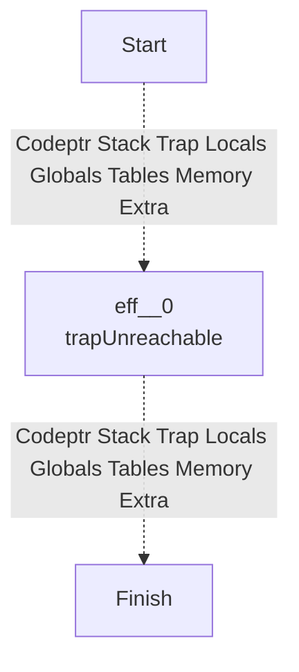
## NOP
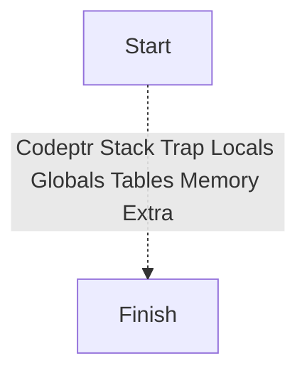
## LOCAL_GET
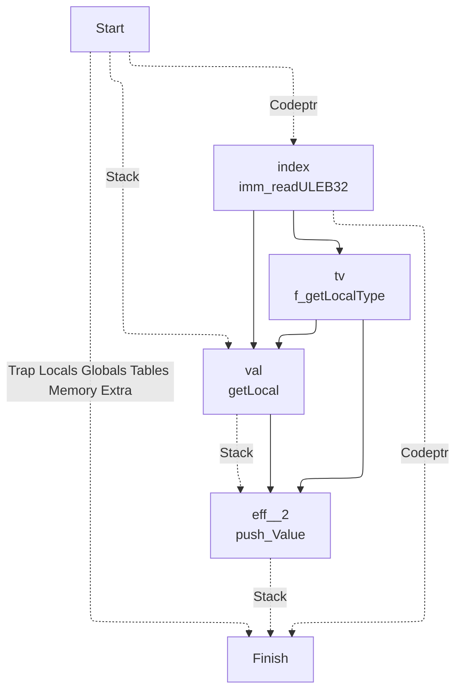
## LOCAL_SET
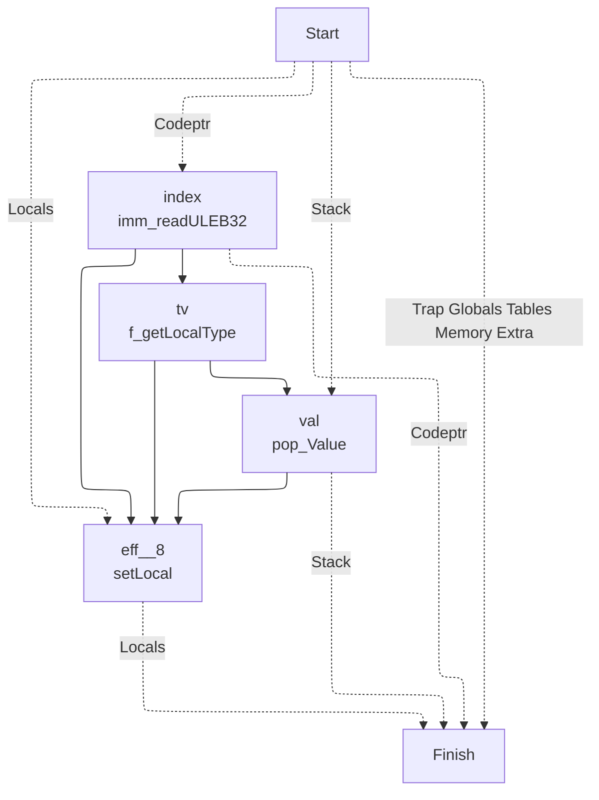
## LOCAL_TEE
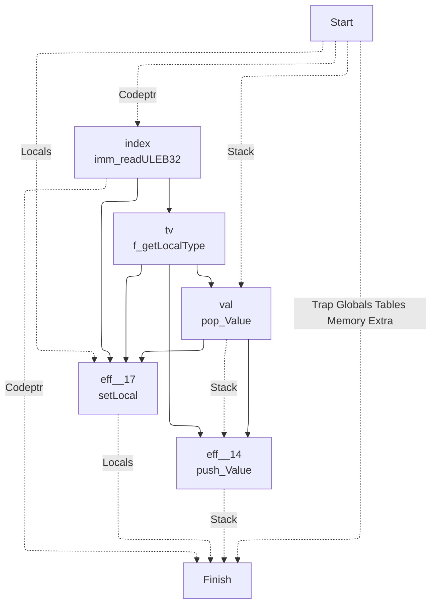
## GLOBAL_GET
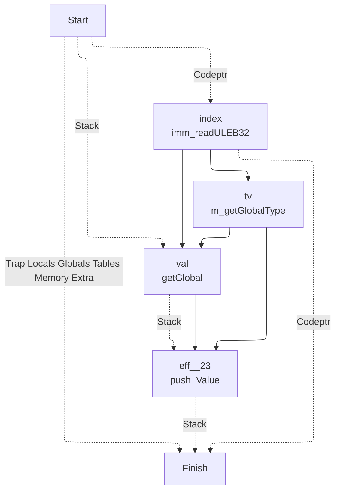
## GLOBAL_SET
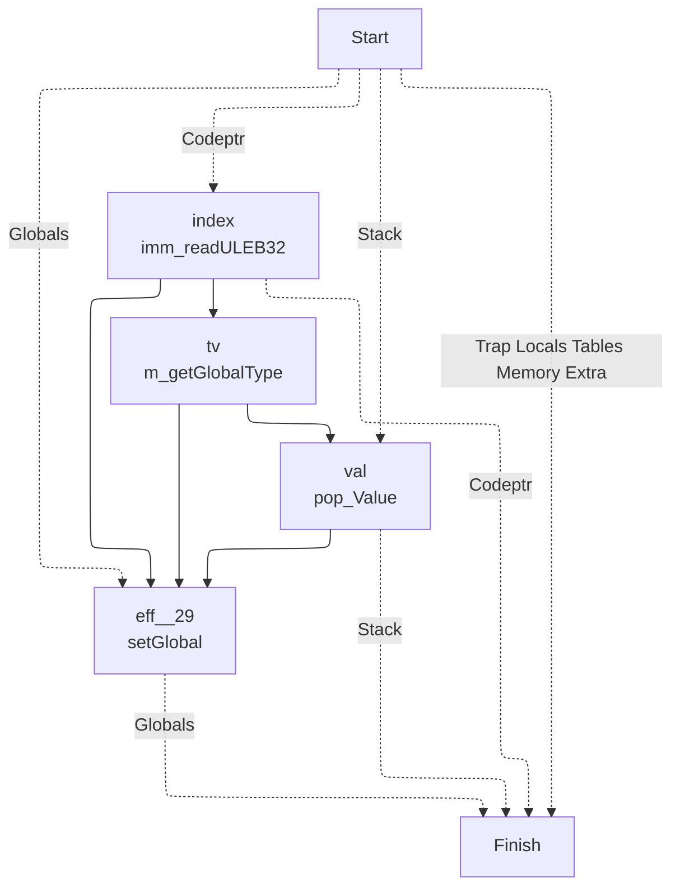
## TABLE_GET
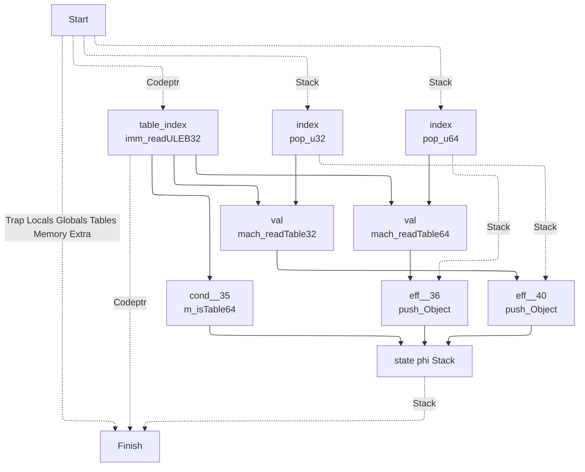
## TABLE_SET
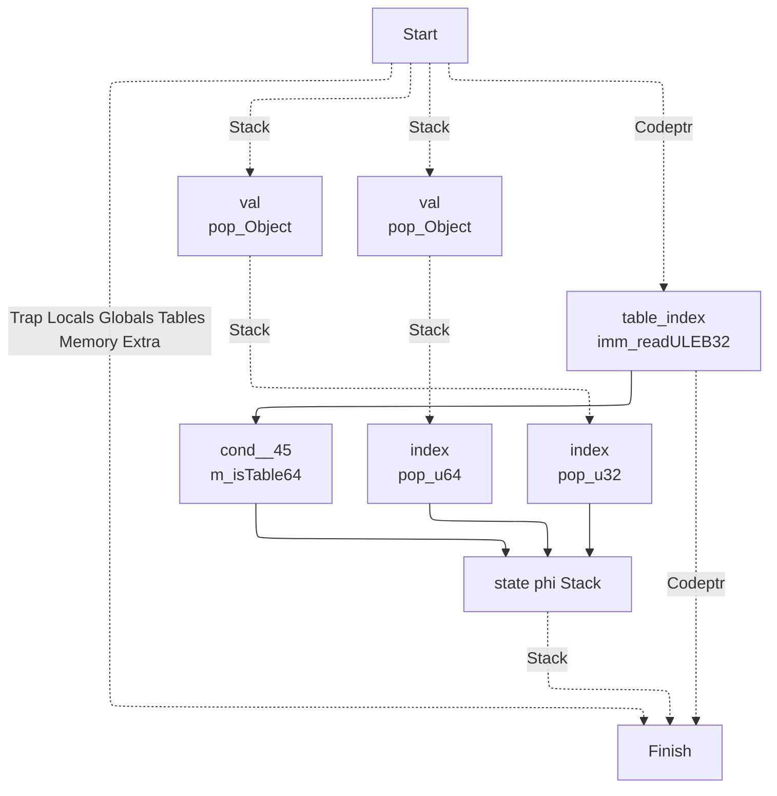
## CALL
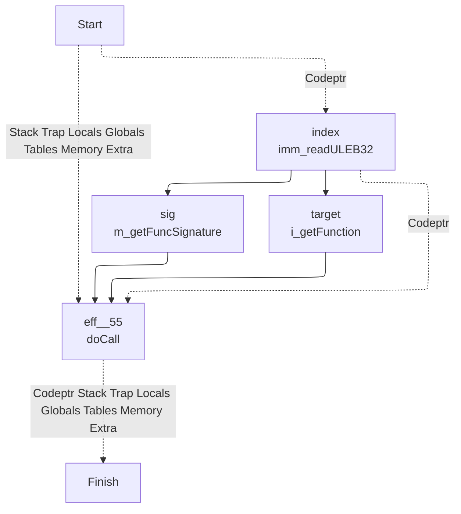
## CALL_INDIRECT

## RETURN_CALL

## DROP
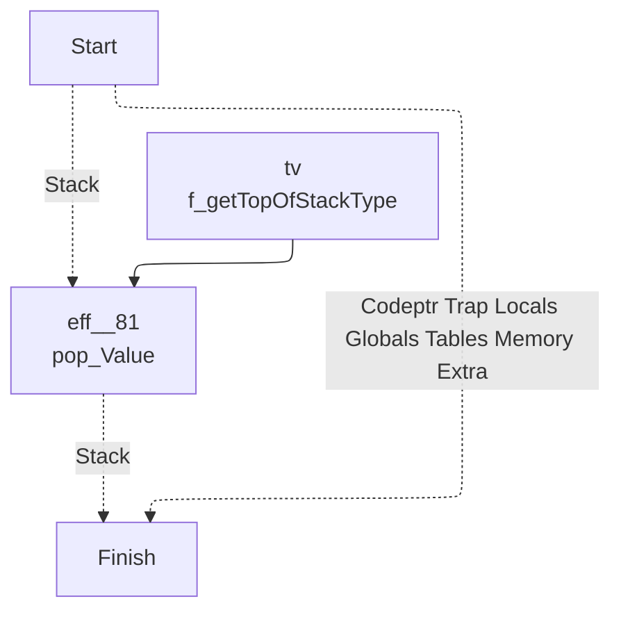
## SELECT
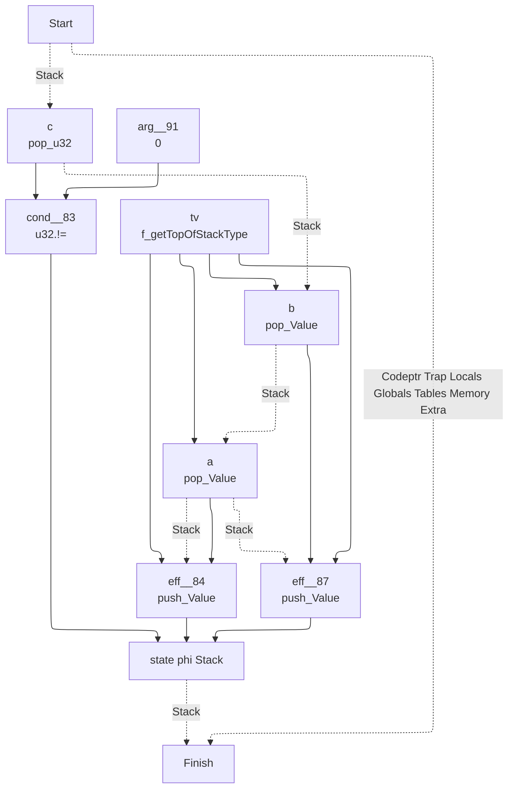
## I32_CONST

## I32_ADD

## I32_SUB
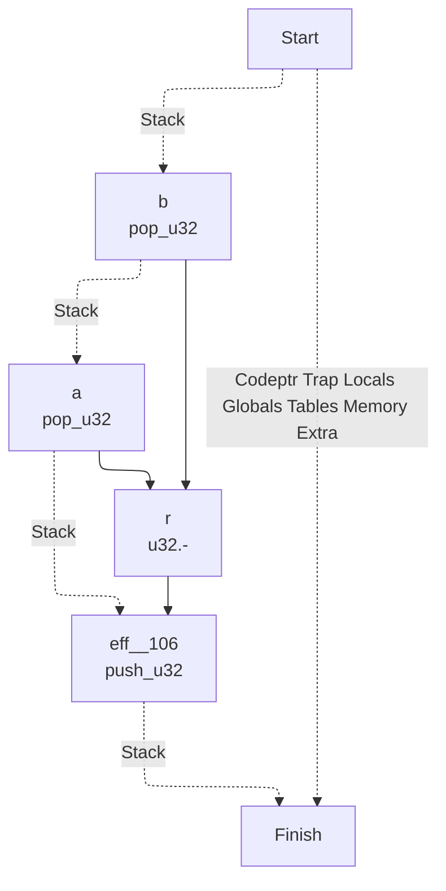
## I32_MUL

## I32_DIV_S
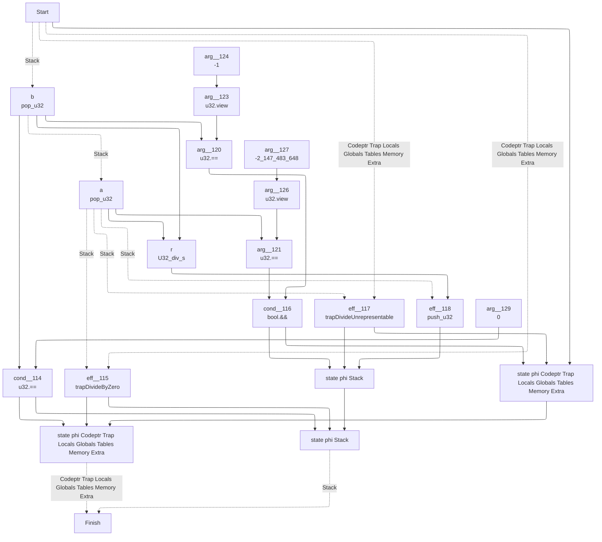
## I32_DIV_U

## I32_EQZ
```mermaid
---
config:
  layout: elk
---
graph TD
	1["
	Finish
	"]
	0 -. Codeptr Trap Locals Globals Tables Memory Extra .-> 1
	10 -. Stack .-> 1
	10["
	state phi Stack 	"]
	6 --> 10
	9 --> 10
	7 --> 10
	7["
	eff__166
	push_u32
	"]
	4 --> 7
	3 -. Stack .-> 7
	3["
	a
	pop_u32
	"]
	0 -. Stack .-> 3
	0["
	Start
	"]
	4["
	arg__169
	0
	"]
	9["
	eff__164
	push_u32
	"]
	8 --> 9
	3 -. Stack .-> 9
	8["
	arg__165
	1
	"]
	6["
	cond__163
	u32.==
	"]
	3 --> 6
	4 --> 6
```
## I32_EQ
```mermaid
---
config:
  layout: elk
---
graph TD
	1["
	Finish
	"]
	0 -. Codeptr Trap Locals Globals Tables Memory Extra .-> 1
	12 -. Stack .-> 1
	12["
	state phi Stack 	"]
	7 --> 12
	11 --> 12
	9 --> 12
	9["
	eff__180
	push_u32
	"]
	8 --> 9
	4 -. Stack .-> 9
	4["
	a
	pop_u32
	"]
	3 -. Stack .-> 4
	3["
	b
	pop_u32
	"]
	0 -. Stack .-> 3
	0["
	Start
	"]
	8["
	arg__181
	0
	"]
	11["
	eff__178
	push_u32
	"]
	10 --> 11
	4 -. Stack .-> 11
	10["
	arg__179
	1
	"]
	7["
	cond__177
	u32.==
	"]
	4 --> 7
	3 --> 7
```
## I32_NE
```mermaid
---
config:
  layout: elk
---
graph TD
	1["
	Finish
	"]
	0 -. Codeptr Trap Locals Globals Tables Memory Extra .-> 1
	12 -. Stack .-> 1
	12["
	state phi Stack 	"]
	7 --> 12
	11 --> 12
	9 --> 12
	9["
	eff__193
	push_u32
	"]
	8 --> 9
	4 -. Stack .-> 9
	4["
	a
	pop_u32
	"]
	3 -. Stack .-> 4
	3["
	b
	pop_u32
	"]
	0 -. Stack .-> 3
	0["
	Start
	"]
	8["
	arg__194
	0
	"]
	11["
	eff__191
	push_u32
	"]
	10 --> 11
	4 -. Stack .-> 11
	10["
	arg__192
	1
	"]
	7["
	cond__190
	u32.!=
	"]
	4 --> 7
	3 --> 7
```
## I32_LT_U
```mermaid
---
config:
  layout: elk
---
graph TD
	1["
	Finish
	"]
	0 -. Codeptr Trap Locals Globals Tables Memory Extra .-> 1
	12 -. Stack .-> 1
	12["
	state phi Stack 	"]
	7 --> 12
	11 --> 12
	9 --> 12
	9["
	eff__206
	push_u32
	"]
	8 --> 9
	4 -. Stack .-> 9
	4["
	a
	pop_u32
	"]
	3 -. Stack .-> 4
	3["
	b
	pop_u32
	"]
	0 -. Stack .-> 3
	0["
	Start
	"]
	8["
	arg__207
	0
	"]
	11["
	eff__204
	push_u32
	"]
	10 --> 11
	4 -. Stack .-> 11
	10["
	arg__205
	1
	"]
	7["
	cond__203
	u32.<
	"]
	4 --> 7
	3 --> 7
```
## I32_LT_S
```mermaid
---
config:
  layout: elk
---
graph TD
	1["
	Finish
	"]
	0 -. Codeptr Trap Locals Globals Tables Memory Extra .-> 1
	12 -. Stack .-> 1
	12["
	state phi Stack 	"]
	7 --> 12
	11 --> 12
	9 --> 12
	9["
	eff__219
	push_u32
	"]
	8 --> 9
	4 -. Stack .-> 9
	4["
	a
	pop_u32
	"]
	3 -. Stack .-> 4
	3["
	b
	pop_u32
	"]
	0 -. Stack .-> 3
	0["
	Start
	"]
	8["
	arg__220
	0
	"]
	11["
	eff__217
	push_u32
	"]
	10 --> 11
	4 -. Stack .-> 11
	10["
	arg__218
	1
	"]
	7["
	cond__216
	U32_lt_s
	"]
	4 --> 7
	3 --> 7
```
## I32_LE_S
```mermaid
---
config:
  layout: elk
---
graph TD
	1["
	Finish
	"]
	0 -. Codeptr Trap Locals Globals Tables Memory Extra .-> 1
	12 -. Stack .-> 1
	12["
	state phi Stack 	"]
	7 --> 12
	11 --> 12
	9 --> 12
	9["
	eff__232
	push_u32
	"]
	8 --> 9
	4 -. Stack .-> 9
	4["
	a
	pop_u32
	"]
	3 -. Stack .-> 4
	3["
	b
	pop_u32
	"]
	0 -. Stack .-> 3
	0["
	Start
	"]
	8["
	arg__233
	0
	"]
	11["
	eff__230
	push_u32
	"]
	10 --> 11
	4 -. Stack .-> 11
	10["
	arg__231
	1
	"]
	7["
	cond__229
	U32_le_s
	"]
	4 --> 7
	3 --> 7
```
## I32_GT_U
```mermaid
---
config:
  layout: elk
---
graph TD
	1["
	Finish
	"]
	0 -. Codeptr Trap Locals Globals Tables Memory Extra .-> 1
	12 -. Stack .-> 1
	12["
	state phi Stack 	"]
	7 --> 12
	11 --> 12
	9 --> 12
	9["
	eff__245
	push_u32
	"]
	8 --> 9
	4 -. Stack .-> 9
	4["
	a
	pop_u32
	"]
	3 -. Stack .-> 4
	3["
	b
	pop_u32
	"]
	0 -. Stack .-> 3
	0["
	Start
	"]
	8["
	arg__246
	0
	"]
	11["
	eff__243
	push_u32
	"]
	10 --> 11
	4 -. Stack .-> 11
	10["
	arg__244
	1
	"]
	7["
	cond__242
	u32.>
	"]
	4 --> 7
	3 --> 7
```
## I32_LE_U
```mermaid
---
config:
  layout: elk
---
graph TD
	1["
	Finish
	"]
	0 -. Codeptr Trap Locals Globals Tables Memory Extra .-> 1
	12 -. Stack .-> 1
	12["
	state phi Stack 	"]
	7 --> 12
	11 --> 12
	9 --> 12
	9["
	eff__258
	push_u32
	"]
	8 --> 9
	4 -. Stack .-> 9
	4["
	a
	pop_u32
	"]
	3 -. Stack .-> 4
	3["
	b
	pop_u32
	"]
	0 -. Stack .-> 3
	0["
	Start
	"]
	8["
	arg__259
	0
	"]
	11["
	eff__256
	push_u32
	"]
	10 --> 11
	4 -. Stack .-> 11
	10["
	arg__257
	1
	"]
	7["
	cond__255
	u32.<=
	"]
	4 --> 7
	3 --> 7
```
## I32_GT_S
```mermaid
---
config:
  layout: elk
---
graph TD
	1["
	Finish
	"]
	0 -. Codeptr Trap Locals Globals Tables Memory Extra .-> 1
	12 -. Stack .-> 1
	12["
	state phi Stack 	"]
	7 --> 12
	11 --> 12
	9 --> 12
	9["
	eff__271
	push_u32
	"]
	8 --> 9
	4 -. Stack .-> 9
	4["
	a
	pop_u32
	"]
	3 -. Stack .-> 4
	3["
	b
	pop_u32
	"]
	0 -. Stack .-> 3
	0["
	Start
	"]
	8["
	arg__272
	0
	"]
	11["
	eff__269
	push_u32
	"]
	10 --> 11
	4 -. Stack .-> 11
	10["
	arg__270
	1
	"]
	7["
	cond__268
	U32_gt_s
	"]
	4 --> 7
	3 --> 7
```
## I32_GE_U
```mermaid
---
config:
  layout: elk
---
graph TD
	1["
	Finish
	"]
	0 -. Codeptr Trap Locals Globals Tables Memory Extra .-> 1
	12 -. Stack .-> 1
	12["
	state phi Stack 	"]
	7 --> 12
	11 --> 12
	9 --> 12
	9["
	eff__284
	push_u32
	"]
	8 --> 9
	4 -. Stack .-> 9
	4["
	a
	pop_u32
	"]
	3 -. Stack .-> 4
	3["
	b
	pop_u32
	"]
	0 -. Stack .-> 3
	0["
	Start
	"]
	8["
	arg__285
	0
	"]
	11["
	eff__282
	push_u32
	"]
	10 --> 11
	4 -. Stack .-> 11
	10["
	arg__283
	1
	"]
	7["
	cond__281
	u32.>=
	"]
	4 --> 7
	3 --> 7
```
## I32_GE_S
```mermaid
---
config:
  layout: elk
---
graph TD
	1["
	Finish
	"]
	0 -. Codeptr Trap Locals Globals Tables Memory Extra .-> 1
	12 -. Stack .-> 1
	12["
	state phi Stack 	"]
	7 --> 12
	11 --> 12
	9 --> 12
	9["
	eff__297
	push_u32
	"]
	8 --> 9
	4 -. Stack .-> 9
	4["
	a
	pop_u32
	"]
	3 -. Stack .-> 4
	3["
	b
	pop_u32
	"]
	0 -. Stack .-> 3
	0["
	Start
	"]
	8["
	arg__298
	0
	"]
	11["
	eff__295
	push_u32
	"]
	10 --> 11
	4 -. Stack .-> 11
	10["
	arg__296
	1
	"]
	7["
	cond__294
	U32_ge_s
	"]
	4 --> 7
	3 --> 7
```
## I32_AND
```mermaid
---
config:
  layout: elk
---
graph TD
	1["
	Finish
	"]
	0 -. Codeptr Trap Locals Globals Tables Memory Extra .-> 1
	9 -. Stack .-> 1
	9["
	eff__307
	push_u32
	"]
	7 --> 9
	4 -. Stack .-> 9
	4["
	a
	pop_u32
	"]
	3 -. Stack .-> 4
	3["
	b
	pop_u32
	"]
	0 -. Stack .-> 3
	0["
	Start
	"]
	7["
	r
	u32.&
	"]
	4 --> 7
	3 --> 7
```
## I32_OR
```mermaid
---
config:
  layout: elk
---
graph TD
	1["
	Finish
	"]
	0 -. Codeptr Trap Locals Globals Tables Memory Extra .-> 1
	9 -. Stack .-> 1
	9["
	eff__311
	push_u32
	"]
	7 --> 9
	4 -. Stack .-> 9
	4["
	a
	pop_u32
	"]
	3 -. Stack .-> 4
	3["
	b
	pop_u32
	"]
	0 -. Stack .-> 3
	0["
	Start
	"]
	7["
	r
	u32.|
	"]
	4 --> 7
	3 --> 7
```
## I32_XOR
```mermaid
---
config:
  layout: elk
---
graph TD
	1["
	Finish
	"]
	0 -. Codeptr Trap Locals Globals Tables Memory Extra .-> 1
	9 -. Stack .-> 1
	9["
	eff__315
	push_u32
	"]
	7 --> 9
	4 -. Stack .-> 9
	4["
	a
	pop_u32
	"]
	3 -. Stack .-> 4
	3["
	b
	pop_u32
	"]
	0 -. Stack .-> 3
	0["
	Start
	"]
	7["
	r
	u32.^
	"]
	4 --> 7
	3 --> 7
```
## I32_SHL
```mermaid
---
config:
  layout: elk
---
graph TD
	1["
	Finish
	"]
	0 -. Codeptr Trap Locals Globals Tables Memory Extra .-> 1
	9 -. Stack .-> 1
	9["
	eff__319
	push_u32
	"]
	7 --> 9
	4 -. Stack .-> 9
	4["
	a
	pop_u32
	"]
	3 -. Stack .-> 4
	3["
	b
	pop_u32
	"]
	0 -. Stack .-> 3
	0["
	Start
	"]
	7["
	r
	U32_shl
	"]
	4 --> 7
	3 --> 7
```
## I32_SHR_U
```mermaid
---
config:
  layout: elk
---
graph TD
	1["
	Finish
	"]
	0 -. Codeptr Trap Locals Globals Tables Memory Extra .-> 1
	9 -. Stack .-> 1
	9["
	eff__323
	push_u32
	"]
	7 --> 9
	4 -. Stack .-> 9
	4["
	a
	pop_u32
	"]
	3 -. Stack .-> 4
	3["
	b
	pop_u32
	"]
	0 -. Stack .-> 3
	0["
	Start
	"]
	7["
	r
	U32_shr_u
	"]
	4 --> 7
	3 --> 7
```
## I32_SHR_S
```mermaid
---
config:
  layout: elk
---
graph TD
	1["
	Finish
	"]
	0 -. Codeptr Trap Locals Globals Tables Memory Extra .-> 1
	9 -. Stack .-> 1
	9["
	eff__327
	push_u32
	"]
	7 --> 9
	4 -. Stack .-> 9
	4["
	a
	pop_u32
	"]
	3 -. Stack .-> 4
	3["
	b
	pop_u32
	"]
	0 -. Stack .-> 3
	0["
	Start
	"]
	7["
	r
	U32_shr_s
	"]
	4 --> 7
	3 --> 7
```
## I32_ROTL
```mermaid
---
config:
  layout: elk
---
graph TD
	1["
	Finish
	"]
	0 -. Codeptr Trap Locals Globals Tables Memory Extra .-> 1
	9 -. Stack .-> 1
	9["
	eff__331
	push_u32
	"]
	7 --> 9
	4 -. Stack .-> 9
	4["
	a
	pop_u32
	"]
	3 -. Stack .-> 4
	3["
	b
	pop_u32
	"]
	0 -. Stack .-> 3
	0["
	Start
	"]
	7["
	r
	U32_rotl
	"]
	4 --> 7
	3 --> 7
```
## I32_ROTR
```mermaid
---
config:
  layout: elk
---
graph TD
	1["
	Finish
	"]
	0 -. Codeptr Trap Locals Globals Tables Memory Extra .-> 1
	9 -. Stack .-> 1
	9["
	eff__335
	push_u32
	"]
	7 --> 9
	4 -. Stack .-> 9
	4["
	a
	pop_u32
	"]
	3 -. Stack .-> 4
	3["
	b
	pop_u32
	"]
	0 -. Stack .-> 3
	0["
	Start
	"]
	7["
	r
	U32_rotr
	"]
	4 --> 7
	3 --> 7
```
## I32_CLZ
```mermaid
---
config:
  layout: elk
---
graph TD
	1["
	Finish
	"]
	0 -. Codeptr Trap Locals Globals Tables Memory Extra .-> 1
	7 -. Stack .-> 1
	7["
	eff__339
	push_u32
	"]
	5 --> 7
	3 -. Stack .-> 7
	3["
	a
	pop_u32
	"]
	0 -. Stack .-> 3
	0["
	Start
	"]
	5["
	r
	U32_clz
	"]
	3 --> 5
```
## I32_CTZ
```mermaid
---
config:
  layout: elk
---
graph TD
	1["
	Finish
	"]
	0 -. Codeptr Trap Locals Globals Tables Memory Extra .-> 1
	7 -. Stack .-> 1
	7["
	eff__342
	push_u32
	"]
	5 --> 7
	3 -. Stack .-> 7
	3["
	a
	pop_u32
	"]
	0 -. Stack .-> 3
	0["
	Start
	"]
	5["
	r
	U32_ctz
	"]
	3 --> 5
```
## I32_POPCNT
```mermaid
---
config:
  layout: elk
---
graph TD
	1["
	Finish
	"]
	0 -. Codeptr Trap Locals Globals Tables Memory Extra .-> 1
	7 -. Stack .-> 1
	7["
	eff__345
	push_u32
	"]
	5 --> 7
	3 -. Stack .-> 7
	3["
	a
	pop_u32
	"]
	0 -. Stack .-> 3
	0["
	Start
	"]
	5["
	r
	U32_popcnt
	"]
	3 --> 5
```
## I32_REM_S
```mermaid
---
config:
  layout: elk
---
graph TD
	1["
	Finish
	"]
	14 -. Codeptr Trap Locals Globals Tables Memory Extra .-> 1
	15 -. Stack .-> 1
	15["
	state phi Stack 	"]
	10 --> 15
	13 --> 15
	12 --> 15
	12["
	eff__350
	push_u32
	"]
	7 --> 12
	4 -. Stack .-> 12
	4["
	a
	pop_u32
	"]
	3 -. Stack .-> 4
	3["
	b
	pop_u32
	"]
	0 -. Stack .-> 3
	0["
	Start
	"]
	7["
	r
	U32_rem_s
	"]
	4 --> 7
	3 --> 7
	13["
	eff__349
	trapDivideByZero
	"]
	0 -. Codeptr Trap Locals Globals Tables Memory Extra .-> 13
	4 -. Stack .-> 13
	10["
	cond__348
	u32.==
	"]
	3 --> 10
	8 --> 10
	8["
	arg__353
	0
	"]
	14["
	state phi Codeptr Trap Locals Globals Tables Memory Extra 	"]
	10 --> 14
	13 --> 14
	0 --> 14
```
## I32_REM_U
```mermaid
---
config:
  layout: elk
---
graph TD
	1["
	Finish
	"]
	14 -. Codeptr Trap Locals Globals Tables Memory Extra .-> 1
	15 -. Stack .-> 1
	15["
	state phi Stack 	"]
	10 --> 15
	13 --> 15
	12 --> 15
	12["
	eff__365
	push_u32
	"]
	7 --> 12
	4 -. Stack .-> 12
	4["
	a
	pop_u32
	"]
	3 -. Stack .-> 4
	3["
	b
	pop_u32
	"]
	0 -. Stack .-> 3
	0["
	Start
	"]
	7["
	r
	U32_rem_u
	"]
	4 --> 7
	3 --> 7
	13["
	eff__364
	trapDivideByZero
	"]
	0 -. Codeptr Trap Locals Globals Tables Memory Extra .-> 13
	4 -. Stack .-> 13
	10["
	cond__363
	u32.==
	"]
	3 --> 10
	8 --> 10
	8["
	arg__368
	0
	"]
	14["
	state phi Codeptr Trap Locals Globals Tables Memory Extra 	"]
	10 --> 14
	13 --> 14
	0 --> 14
```
## I32_EXTEND8_S
```mermaid
---
config:
  layout: elk
---
graph TD
	1["
	Finish
	"]
	0 -. Codeptr Trap Locals Globals Tables Memory Extra .-> 1
	7 -. Stack .-> 1
	7["
	eff__378
	push_u32
	"]
	5 --> 7
	3 -. Stack .-> 7
	3["
	a
	pop_u32
	"]
	0 -. Stack .-> 3
	0["
	Start
	"]
	5["
	r
	U32_extend8_s
	"]
	3 --> 5
```
## I32_EXTEND16_S
```mermaid
---
config:
  layout: elk
---
graph TD
	1["
	Finish
	"]
	0 -. Codeptr Trap Locals Globals Tables Memory Extra .-> 1
	7 -. Stack .-> 1
	7["
	eff__381
	push_u32
	"]
	5 --> 7
	3 -. Stack .-> 7
	3["
	a
	pop_u32
	"]
	0 -. Stack .-> 3
	0["
	Start
	"]
	5["
	r
	U32_extend16_s
	"]
	3 --> 5
```
## I64_CONST
```mermaid
---
config:
  layout: elk
---
graph TD
	1["
	Finish
	"]
	3 -. Codeptr .-> 1
	5 -. Stack .-> 1
	0 -. Trap Locals Globals Tables Memory Extra .-> 1
	0["
	Start
	"]
	5["
	eff__384
	push_u64
	"]
	3 --> 5
	0 -. Stack .-> 5
	3["
	x
	imm_readILEB64
	"]
	0 -. Codeptr .-> 3
```
## I64_ADD
```mermaid
---
config:
  layout: elk
---
graph TD
	1["
	Finish
	"]
	0 -. Codeptr Trap Locals Globals Tables Memory Extra .-> 1
	9 -. Stack .-> 1
	9["
	eff__387
	push_u64
	"]
	7 --> 9
	4 -. Stack .-> 9
	4["
	a
	pop_u64
	"]
	3 -. Stack .-> 4
	3["
	b
	pop_u64
	"]
	0 -. Stack .-> 3
	0["
	Start
	"]
	7["
	r
	u64.+
	"]
	4 --> 7
	3 --> 7
```
## I64_SUB
```mermaid
---
config:
  layout: elk
---
graph TD
	1["
	Finish
	"]
	0 -. Codeptr Trap Locals Globals Tables Memory Extra .-> 1
	9 -. Stack .-> 1
	9["
	eff__391
	push_u64
	"]
	7 --> 9
	4 -. Stack .-> 9
	4["
	a
	pop_u64
	"]
	3 -. Stack .-> 4
	3["
	b
	pop_u64
	"]
	0 -. Stack .-> 3
	0["
	Start
	"]
	7["
	r
	u64.-
	"]
	4 --> 7
	3 --> 7
```
## I64_MUL
```mermaid
---
config:
  layout: elk
---
graph TD
	1["
	Finish
	"]
	0 -. Codeptr Trap Locals Globals Tables Memory Extra .-> 1
	9 -. Stack .-> 1
	9["
	eff__395
	push_u64
	"]
	7 --> 9
	4 -. Stack .-> 9
	4["
	a
	pop_u64
	"]
	3 -. Stack .-> 4
	3["
	b
	pop_u64
	"]
	0 -. Stack .-> 3
	0["
	Start
	"]
	7["
	r
	u64.*
	"]
	4 --> 7
	3 --> 7
```
## I64_DIV_S
```mermaid
---
config:
  layout: elk
---
graph TD
	1["
	Finish
	"]
	26 -. Codeptr Trap Locals Globals Tables Memory Extra .-> 1
	27 -. Stack .-> 1
	27["
	state phi Stack 	"]
	10 --> 27
	25 --> 27
	24 --> 27
	24["
	state phi Stack 	"]
	19 --> 24
	22 --> 24
	21 --> 24
	21["
	eff__403
	push_u64
	"]
	7 --> 21
	4 -. Stack .-> 21
	4["
	a
	pop_u64
	"]
	3 -. Stack .-> 4
	3["
	b
	pop_u64
	"]
	0 -. Stack .-> 3
	0["
	Start
	"]
	7["
	r
	U64_div_s
	"]
	4 --> 7
	3 --> 7
	22["
	eff__402
	trapDivideUnrepresentable
	"]
	0 -. Codeptr Trap Locals Globals Tables Memory Extra .-> 22
	4 -. Stack .-> 22
	19["
	cond__401
	bool.&&
	"]
	18 --> 19
	14 --> 19
	14["
	arg__406
	u64.==
	"]
	4 --> 14
	12 --> 14
	12["
	arg__411
	u64.view
	"]
	11 --> 12
	11["
	arg__412
	-9223372036854775808L
	"]
	18["
	arg__405
	u64.==
	"]
	3 --> 18
	16 --> 18
	16["
	arg__408
	u64.view
	"]
	15 --> 16
	15["
	arg__409
	-1
	"]
	25["
	eff__400
	trapDivideByZero
	"]
	0 -. Codeptr Trap Locals Globals Tables Memory Extra .-> 25
	4 -. Stack .-> 25
	10["
	cond__399
	u64.==
	"]
	3 --> 10
	8 --> 10
	8["
	arg__414
	0
	"]
	26["
	state phi Codeptr Trap Locals Globals Tables Memory Extra 	"]
	10 --> 26
	25 --> 26
	23 --> 26
	23["
	state phi Codeptr Trap Locals Globals Tables Memory Extra 	"]
	19 --> 23
	22 --> 23
	0 --> 23
```
## I64_DIV_U
```mermaid
---
config:
  layout: elk
---
graph TD
	1["
	Finish
	"]
	14 -. Codeptr Trap Locals Globals Tables Memory Extra .-> 1
	15 -. Stack .-> 1
	15["
	state phi Stack 	"]
	10 --> 15
	13 --> 15
	12 --> 15
	12["
	eff__435
	push_u64
	"]
	7 --> 12
	4 -. Stack .-> 12
	4["
	a
	pop_u64
	"]
	3 -. Stack .-> 4
	3["
	b
	pop_u64
	"]
	0 -. Stack .-> 3
	0["
	Start
	"]
	7["
	r
	u64./
	"]
	4 --> 7
	3 --> 7
	13["
	eff__434
	trapDivideByZero
	"]
	0 -. Codeptr Trap Locals Globals Tables Memory Extra .-> 13
	4 -. Stack .-> 13
	10["
	cond__433
	u64.==
	"]
	3 --> 10
	8 --> 10
	8["
	arg__438
	0
	"]
	14["
	state phi Codeptr Trap Locals Globals Tables Memory Extra 	"]
	10 --> 14
	13 --> 14
	0 --> 14
```
## I64_REM_S
```mermaid
---
config:
  layout: elk
---
graph TD
	1["
	Finish
	"]
	14 -. Codeptr Trap Locals Globals Tables Memory Extra .-> 1
	15 -. Stack .-> 1
	15["
	state phi Stack 	"]
	10 --> 15
	13 --> 15
	12 --> 15
	12["
	eff__450
	push_u64
	"]
	7 --> 12
	4 -. Stack .-> 12
	4["
	a
	pop_u64
	"]
	3 -. Stack .-> 4
	3["
	b
	pop_u64
	"]
	0 -. Stack .-> 3
	0["
	Start
	"]
	7["
	r
	U64_rem_s
	"]
	4 --> 7
	3 --> 7
	13["
	eff__449
	trapDivideByZero
	"]
	0 -. Codeptr Trap Locals Globals Tables Memory Extra .-> 13
	4 -. Stack .-> 13
	10["
	cond__448
	u64.==
	"]
	3 --> 10
	8 --> 10
	8["
	arg__453
	0
	"]
	14["
	state phi Codeptr Trap Locals Globals Tables Memory Extra 	"]
	10 --> 14
	13 --> 14
	0 --> 14
```
## I64_REM_U
```mermaid
---
config:
  layout: elk
---
graph TD
	1["
	Finish
	"]
	14 -. Codeptr Trap Locals Globals Tables Memory Extra .-> 1
	15 -. Stack .-> 1
	15["
	state phi Stack 	"]
	10 --> 15
	13 --> 15
	12 --> 15
	12["
	eff__465
	push_u64
	"]
	7 --> 12
	4 -. Stack .-> 12
	4["
	a
	pop_u64
	"]
	3 -. Stack .-> 4
	3["
	b
	pop_u64
	"]
	0 -. Stack .-> 3
	0["
	Start
	"]
	7["
	r
	U64_rem_u
	"]
	4 --> 7
	3 --> 7
	13["
	eff__464
	trapDivideByZero
	"]
	0 -. Codeptr Trap Locals Globals Tables Memory Extra .-> 13
	4 -. Stack .-> 13
	10["
	cond__463
	u64.==
	"]
	3 --> 10
	8 --> 10
	8["
	arg__468
	0
	"]
	14["
	state phi Codeptr Trap Locals Globals Tables Memory Extra 	"]
	10 --> 14
	13 --> 14
	0 --> 14
```
## I64_AND
```mermaid
---
config:
  layout: elk
---
graph TD
	1["
	Finish
	"]
	0 -. Codeptr Trap Locals Globals Tables Memory Extra .-> 1
	9 -. Stack .-> 1
	9["
	eff__478
	push_u64
	"]
	7 --> 9
	4 -. Stack .-> 9
	4["
	a
	pop_u64
	"]
	3 -. Stack .-> 4
	3["
	b
	pop_u64
	"]
	0 -. Stack .-> 3
	0["
	Start
	"]
	7["
	r
	u64.&
	"]
	4 --> 7
	3 --> 7
```
## I64_OR
```mermaid
---
config:
  layout: elk
---
graph TD
	1["
	Finish
	"]
	0 -. Codeptr Trap Locals Globals Tables Memory Extra .-> 1
	9 -. Stack .-> 1
	9["
	eff__482
	push_u64
	"]
	7 --> 9
	4 -. Stack .-> 9
	4["
	a
	pop_u64
	"]
	3 -. Stack .-> 4
	3["
	b
	pop_u64
	"]
	0 -. Stack .-> 3
	0["
	Start
	"]
	7["
	r
	u64.|
	"]
	4 --> 7
	3 --> 7
```
## I64_XOR
```mermaid
---
config:
  layout: elk
---
graph TD
	1["
	Finish
	"]
	0 -. Codeptr Trap Locals Globals Tables Memory Extra .-> 1
	9 -. Stack .-> 1
	9["
	eff__486
	push_u64
	"]
	7 --> 9
	4 -. Stack .-> 9
	4["
	a
	pop_u64
	"]
	3 -. Stack .-> 4
	3["
	b
	pop_u64
	"]
	0 -. Stack .-> 3
	0["
	Start
	"]
	7["
	r
	u64.^
	"]
	4 --> 7
	3 --> 7
```
## I64_SHL
```mermaid
---
config:
  layout: elk
---
graph TD
	1["
	Finish
	"]
	0 -. Codeptr Trap Locals Globals Tables Memory Extra .-> 1
	9 -. Stack .-> 1
	9["
	eff__490
	push_u64
	"]
	7 --> 9
	4 -. Stack .-> 9
	4["
	a
	pop_u64
	"]
	3 -. Stack .-> 4
	3["
	b
	pop_u64
	"]
	0 -. Stack .-> 3
	0["
	Start
	"]
	7["
	r
	U64_shl
	"]
	4 --> 7
	3 --> 7
```
## I64_SHR_U
```mermaid
---
config:
  layout: elk
---
graph TD
	1["
	Finish
	"]
	0 -. Codeptr Trap Locals Globals Tables Memory Extra .-> 1
	9 -. Stack .-> 1
	9["
	eff__494
	push_u64
	"]
	7 --> 9
	4 -. Stack .-> 9
	4["
	a
	pop_u64
	"]
	3 -. Stack .-> 4
	3["
	b
	pop_u64
	"]
	0 -. Stack .-> 3
	0["
	Start
	"]
	7["
	r
	U64_shr_u
	"]
	4 --> 7
	3 --> 7
```
## I64_SHR_S
```mermaid
---
config:
  layout: elk
---
graph TD
	1["
	Finish
	"]
	0 -. Codeptr Trap Locals Globals Tables Memory Extra .-> 1
	9 -. Stack .-> 1
	9["
	eff__498
	push_u64
	"]
	7 --> 9
	4 -. Stack .-> 9
	4["
	a
	pop_u64
	"]
	3 -. Stack .-> 4
	3["
	b
	pop_u64
	"]
	0 -. Stack .-> 3
	0["
	Start
	"]
	7["
	r
	U64_shr_s
	"]
	4 --> 7
	3 --> 7
```
## I64_ROTL
```mermaid
---
config:
  layout: elk
---
graph TD
	1["
	Finish
	"]
	0 -. Codeptr Trap Locals Globals Tables Memory Extra .-> 1
	9 -. Stack .-> 1
	9["
	eff__502
	push_u64
	"]
	7 --> 9
	4 -. Stack .-> 9
	4["
	a
	pop_u64
	"]
	3 -. Stack .-> 4
	3["
	b
	pop_u64
	"]
	0 -. Stack .-> 3
	0["
	Start
	"]
	7["
	r
	U64_rotl
	"]
	4 --> 7
	3 --> 7
```
## I64_ROTR
```mermaid
---
config:
  layout: elk
---
graph TD
	1["
	Finish
	"]
	0 -. Codeptr Trap Locals Globals Tables Memory Extra .-> 1
	9 -. Stack .-> 1
	9["
	eff__506
	push_u64
	"]
	7 --> 9
	4 -. Stack .-> 9
	4["
	a
	pop_u64
	"]
	3 -. Stack .-> 4
	3["
	b
	pop_u64
	"]
	0 -. Stack .-> 3
	0["
	Start
	"]
	7["
	r
	U64_rotr
	"]
	4 --> 7
	3 --> 7
```
## I64_CLZ
```mermaid
---
config:
  layout: elk
---
graph TD
	1["
	Finish
	"]
	0 -. Codeptr Trap Locals Globals Tables Memory Extra .-> 1
	7 -. Stack .-> 1
	7["
	eff__510
	push_u64
	"]
	5 --> 7
	3 -. Stack .-> 7
	3["
	a
	pop_u64
	"]
	0 -. Stack .-> 3
	0["
	Start
	"]
	5["
	r
	U64_clz
	"]
	3 --> 5
```
## I64_CTZ
```mermaid
---
config:
  layout: elk
---
graph TD
	1["
	Finish
	"]
	0 -. Codeptr Trap Locals Globals Tables Memory Extra .-> 1
	7 -. Stack .-> 1
	7["
	eff__513
	push_u64
	"]
	5 --> 7
	3 -. Stack .-> 7
	3["
	a
	pop_u64
	"]
	0 -. Stack .-> 3
	0["
	Start
	"]
	5["
	r
	U64_ctz
	"]
	3 --> 5
```
## I64_POPCNT
```mermaid
---
config:
  layout: elk
---
graph TD
	1["
	Finish
	"]
	0 -. Codeptr Trap Locals Globals Tables Memory Extra .-> 1
	7 -. Stack .-> 1
	7["
	eff__516
	push_u64
	"]
	5 --> 7
	3 -. Stack .-> 7
	3["
	a
	pop_u64
	"]
	0 -. Stack .-> 3
	0["
	Start
	"]
	5["
	r
	U64_popcnt
	"]
	3 --> 5
```
## I64_EQZ
```mermaid
---
config:
  layout: elk
---
graph TD
	1["
	Finish
	"]
	0 -. Codeptr Trap Locals Globals Tables Memory Extra .-> 1
	10 -. Stack .-> 1
	10["
	state phi Stack 	"]
	6 --> 10
	9 --> 10
	7 --> 10
	7["
	eff__522
	push_u32
	"]
	4 --> 7
	3 -. Stack .-> 7
	3["
	a
	pop_u64
	"]
	0 -. Stack .-> 3
	0["
	Start
	"]
	4["
	arg__525
	0
	"]
	9["
	eff__520
	push_u32
	"]
	8 --> 9
	3 -. Stack .-> 9
	8["
	arg__521
	1
	"]
	6["
	cond__519
	u64.==
	"]
	3 --> 6
	4 --> 6
```
## I64_EQ
```mermaid
---
config:
  layout: elk
---
graph TD
	1["
	Finish
	"]
	0 -. Codeptr Trap Locals Globals Tables Memory Extra .-> 1
	12 -. Stack .-> 1
	12["
	state phi Stack 	"]
	7 --> 12
	11 --> 12
	9 --> 12
	9["
	eff__536
	push_u32
	"]
	8 --> 9
	4 -. Stack .-> 9
	4["
	a
	pop_u64
	"]
	3 -. Stack .-> 4
	3["
	b
	pop_u64
	"]
	0 -. Stack .-> 3
	0["
	Start
	"]
	8["
	arg__537
	0
	"]
	11["
	eff__534
	push_u32
	"]
	10 --> 11
	4 -. Stack .-> 11
	10["
	arg__535
	1
	"]
	7["
	cond__533
	u64.==
	"]
	4 --> 7
	3 --> 7
```
## I64_NE
```mermaid
---
config:
  layout: elk
---
graph TD
	1["
	Finish
	"]
	0 -. Codeptr Trap Locals Globals Tables Memory Extra .-> 1
	12 -. Stack .-> 1
	12["
	state phi Stack 	"]
	7 --> 12
	11 --> 12
	9 --> 12
	9["
	eff__549
	push_u32
	"]
	8 --> 9
	4 -. Stack .-> 9
	4["
	a
	pop_u64
	"]
	3 -. Stack .-> 4
	3["
	b
	pop_u64
	"]
	0 -. Stack .-> 3
	0["
	Start
	"]
	8["
	arg__550
	0
	"]
	11["
	eff__547
	push_u32
	"]
	10 --> 11
	4 -. Stack .-> 11
	10["
	arg__548
	1
	"]
	7["
	cond__546
	u64.!=
	"]
	4 --> 7
	3 --> 7
```
## I64_LT_S
```mermaid
---
config:
  layout: elk
---
graph TD
	1["
	Finish
	"]
	0 -. Codeptr Trap Locals Globals Tables Memory Extra .-> 1
	12 -. Stack .-> 1
	12["
	state phi Stack 	"]
	7 --> 12
	11 --> 12
	9 --> 12
	9["
	eff__562
	push_u32
	"]
	8 --> 9
	4 -. Stack .-> 9
	4["
	a
	pop_u64
	"]
	3 -. Stack .-> 4
	3["
	b
	pop_u64
	"]
	0 -. Stack .-> 3
	0["
	Start
	"]
	8["
	arg__563
	0
	"]
	11["
	eff__560
	push_u32
	"]
	10 --> 11
	4 -. Stack .-> 11
	10["
	arg__561
	1
	"]
	7["
	cond__559
	U64_lt_s
	"]
	4 --> 7
	3 --> 7
```
## I64_LT_U
```mermaid
---
config:
  layout: elk
---
graph TD
	1["
	Finish
	"]
	0 -. Codeptr Trap Locals Globals Tables Memory Extra .-> 1
	12 -. Stack .-> 1
	12["
	state phi Stack 	"]
	7 --> 12
	11 --> 12
	9 --> 12
	9["
	eff__575
	push_u32
	"]
	8 --> 9
	4 -. Stack .-> 9
	4["
	a
	pop_u64
	"]
	3 -. Stack .-> 4
	3["
	b
	pop_u64
	"]
	0 -. Stack .-> 3
	0["
	Start
	"]
	8["
	arg__576
	0
	"]
	11["
	eff__573
	push_u32
	"]
	10 --> 11
	4 -. Stack .-> 11
	10["
	arg__574
	1
	"]
	7["
	cond__572
	u64.<
	"]
	4 --> 7
	3 --> 7
```
## I64_LE_S
```mermaid
---
config:
  layout: elk
---
graph TD
	1["
	Finish
	"]
	0 -. Codeptr Trap Locals Globals Tables Memory Extra .-> 1
	12 -. Stack .-> 1
	12["
	state phi Stack 	"]
	7 --> 12
	11 --> 12
	9 --> 12
	9["
	eff__588
	push_u32
	"]
	8 --> 9
	4 -. Stack .-> 9
	4["
	a
	pop_u64
	"]
	3 -. Stack .-> 4
	3["
	b
	pop_u64
	"]
	0 -. Stack .-> 3
	0["
	Start
	"]
	8["
	arg__589
	0
	"]
	11["
	eff__586
	push_u32
	"]
	10 --> 11
	4 -. Stack .-> 11
	10["
	arg__587
	1
	"]
	7["
	cond__585
	U64_le_s
	"]
	4 --> 7
	3 --> 7
```
## I64_LE_U
```mermaid
---
config:
  layout: elk
---
graph TD
	1["
	Finish
	"]
	0 -. Codeptr Trap Locals Globals Tables Memory Extra .-> 1
	12 -. Stack .-> 1
	12["
	state phi Stack 	"]
	7 --> 12
	11 --> 12
	9 --> 12
	9["
	eff__601
	push_u32
	"]
	8 --> 9
	4 -. Stack .-> 9
	4["
	a
	pop_u64
	"]
	3 -. Stack .-> 4
	3["
	b
	pop_u64
	"]
	0 -. Stack .-> 3
	0["
	Start
	"]
	8["
	arg__602
	0
	"]
	11["
	eff__599
	push_u32
	"]
	10 --> 11
	4 -. Stack .-> 11
	10["
	arg__600
	1
	"]
	7["
	cond__598
	u64.<=
	"]
	4 --> 7
	3 --> 7
```
## I64_GT_S
```mermaid
---
config:
  layout: elk
---
graph TD
	1["
	Finish
	"]
	0 -. Codeptr Trap Locals Globals Tables Memory Extra .-> 1
	12 -. Stack .-> 1
	12["
	state phi Stack 	"]
	7 --> 12
	11 --> 12
	9 --> 12
	9["
	eff__614
	push_u32
	"]
	8 --> 9
	4 -. Stack .-> 9
	4["
	a
	pop_u64
	"]
	3 -. Stack .-> 4
	3["
	b
	pop_u64
	"]
	0 -. Stack .-> 3
	0["
	Start
	"]
	8["
	arg__615
	0
	"]
	11["
	eff__612
	push_u32
	"]
	10 --> 11
	4 -. Stack .-> 11
	10["
	arg__613
	1
	"]
	7["
	cond__611
	U64_gt_s
	"]
	4 --> 7
	3 --> 7
```
## I64_GT_U
```mermaid
---
config:
  layout: elk
---
graph TD
	1["
	Finish
	"]
	0 -. Codeptr Trap Locals Globals Tables Memory Extra .-> 1
	12 -. Stack .-> 1
	12["
	state phi Stack 	"]
	7 --> 12
	11 --> 12
	9 --> 12
	9["
	eff__627
	push_u32
	"]
	8 --> 9
	4 -. Stack .-> 9
	4["
	a
	pop_u64
	"]
	3 -. Stack .-> 4
	3["
	b
	pop_u64
	"]
	0 -. Stack .-> 3
	0["
	Start
	"]
	8["
	arg__628
	0
	"]
	11["
	eff__625
	push_u32
	"]
	10 --> 11
	4 -. Stack .-> 11
	10["
	arg__626
	1
	"]
	7["
	cond__624
	u64.>
	"]
	4 --> 7
	3 --> 7
```
## I64_GE_S
```mermaid
---
config:
  layout: elk
---
graph TD
	1["
	Finish
	"]
	0 -. Codeptr Trap Locals Globals Tables Memory Extra .-> 1
	12 -. Stack .-> 1
	12["
	state phi Stack 	"]
	7 --> 12
	11 --> 12
	9 --> 12
	9["
	eff__640
	push_u32
	"]
	8 --> 9
	4 -. Stack .-> 9
	4["
	a
	pop_u64
	"]
	3 -. Stack .-> 4
	3["
	b
	pop_u64
	"]
	0 -. Stack .-> 3
	0["
	Start
	"]
	8["
	arg__641
	0
	"]
	11["
	eff__638
	push_u32
	"]
	10 --> 11
	4 -. Stack .-> 11
	10["
	arg__639
	1
	"]
	7["
	cond__637
	U64_ge_s
	"]
	4 --> 7
	3 --> 7
```
## I64_GE_U
```mermaid
---
config:
  layout: elk
---
graph TD
	1["
	Finish
	"]
	0 -. Codeptr Trap Locals Globals Tables Memory Extra .-> 1
	12 -. Stack .-> 1
	12["
	state phi Stack 	"]
	7 --> 12
	11 --> 12
	9 --> 12
	9["
	eff__653
	push_u32
	"]
	8 --> 9
	4 -. Stack .-> 9
	4["
	a
	pop_u64
	"]
	3 -. Stack .-> 4
	3["
	b
	pop_u64
	"]
	0 -. Stack .-> 3
	0["
	Start
	"]
	8["
	arg__654
	0
	"]
	11["
	eff__651
	push_u32
	"]
	10 --> 11
	4 -. Stack .-> 11
	10["
	arg__652
	1
	"]
	7["
	cond__650
	u64.>=
	"]
	4 --> 7
	3 --> 7
```
## I64_EXTEND8_S
```mermaid
---
config:
  layout: elk
---
graph TD
	1["
	Finish
	"]
	0 -. Codeptr Trap Locals Globals Tables Memory Extra .-> 1
	7 -. Stack .-> 1
	7["
	eff__663
	push_u64
	"]
	5 --> 7
	3 -. Stack .-> 7
	3["
	a
	pop_u64
	"]
	0 -. Stack .-> 3
	0["
	Start
	"]
	5["
	r
	U64_extend8_s
	"]
	3 --> 5
```
## I64_EXTEND16_S
```mermaid
---
config:
  layout: elk
---
graph TD
	1["
	Finish
	"]
	0 -. Codeptr Trap Locals Globals Tables Memory Extra .-> 1
	7 -. Stack .-> 1
	7["
	eff__666
	push_u64
	"]
	5 --> 7
	3 -. Stack .-> 7
	3["
	a
	pop_u64
	"]
	0 -. Stack .-> 3
	0["
	Start
	"]
	5["
	r
	U64_extend16_s
	"]
	3 --> 5
```
## I64_EXTEND32_S
```mermaid
---
config:
  layout: elk
---
graph TD
	1["
	Finish
	"]
	0 -. Codeptr Trap Locals Globals Tables Memory Extra .-> 1
	7 -. Stack .-> 1
	7["
	eff__669
	push_u64
	"]
	5 --> 7
	3 -. Stack .-> 7
	3["
	a
	pop_u64
	"]
	0 -. Stack .-> 3
	0["
	Start
	"]
	5["
	r
	U64_extend32_s
	"]
	3 --> 5
```
## F32_CONST
```mermaid
---
config:
  layout: elk
---
graph TD
	1["
	Finish
	"]
	3 -. Codeptr .-> 1
	6 -. Stack .-> 1
	0 -. Trap Locals Globals Tables Memory Extra .-> 1
	0["
	Start
	"]
	6["
	eff__672
	push_f32
	"]
	5 --> 6
	0 -. Stack .-> 6
	5["
	arg__673
	f32_reinterpret_u32
	"]
	3 --> 5
	3["
	x
	imm_readULEB32
	"]
	0 -. Codeptr .-> 3
```
## F32_ADD
```mermaid
---
config:
  layout: elk
---
graph TD
	1["
	Finish
	"]
	0 -. Codeptr Trap Locals Globals Tables Memory Extra .-> 1
	9 -. Stack .-> 1
	9["
	eff__676
	push_f32
	"]
	7 --> 9
	4 -. Stack .-> 9
	4["
	a
	pop_f32
	"]
	3 -. Stack .-> 4
	3["
	b
	pop_f32
	"]
	0 -. Stack .-> 3
	0["
	Start
	"]
	7["
	r
	float.+
	"]
	4 --> 7
	3 --> 7
```
## F32_SUB
```mermaid
---
config:
  layout: elk
---
graph TD
	1["
	Finish
	"]
	0 -. Codeptr Trap Locals Globals Tables Memory Extra .-> 1
	9 -. Stack .-> 1
	9["
	eff__680
	push_f32
	"]
	7 --> 9
	4 -. Stack .-> 9
	4["
	a
	pop_f32
	"]
	3 -. Stack .-> 4
	3["
	b
	pop_f32
	"]
	0 -. Stack .-> 3
	0["
	Start
	"]
	7["
	r
	float.-
	"]
	4 --> 7
	3 --> 7
```
## F32_MUL
```mermaid
---
config:
  layout: elk
---
graph TD
	1["
	Finish
	"]
	0 -. Codeptr Trap Locals Globals Tables Memory Extra .-> 1
	9 -. Stack .-> 1
	9["
	eff__684
	push_f32
	"]
	7 --> 9
	4 -. Stack .-> 9
	4["
	a
	pop_f32
	"]
	3 -. Stack .-> 4
	3["
	b
	pop_f32
	"]
	0 -. Stack .-> 3
	0["
	Start
	"]
	7["
	r
	float.*
	"]
	4 --> 7
	3 --> 7
```
## F32_DIV
```mermaid
---
config:
  layout: elk
---
graph TD
	1["
	Finish
	"]
	14 -. Codeptr Trap Locals Globals Tables Memory Extra .-> 1
	15 -. Stack .-> 1
	15["
	state phi Stack 	"]
	10 --> 15
	13 --> 15
	12 --> 15
	12["
	eff__690
	push_f32
	"]
	7 --> 12
	4 -. Stack .-> 12
	4["
	a
	pop_f32
	"]
	3 -. Stack .-> 4
	3["
	b
	pop_f32
	"]
	0 -. Stack .-> 3
	0["
	Start
	"]
	7["
	r
	float./
	"]
	4 --> 7
	3 --> 7
	13["
	eff__689
	trapDivideByZero
	"]
	0 -. Codeptr Trap Locals Globals Tables Memory Extra .-> 13
	4 -. Stack .-> 13
	10["
	cond__688
	float.==
	"]
	3 --> 10
	8 --> 10
	8["
	arg__693
	0.0f
	"]
	14["
	state phi Codeptr Trap Locals Globals Tables Memory Extra 	"]
	10 --> 14
	13 --> 14
	0 --> 14
```
## F32_SQRT
```mermaid
---
config:
  layout: elk
---
graph TD
	1["
	Finish
	"]
	0 -. Codeptr Trap Locals Globals Tables Memory Extra .-> 1
	7 -. Stack .-> 1
	7["
	eff__703
	push_f32
	"]
	5 --> 7
	3 -. Stack .-> 7
	3["
	a
	pop_f32
	"]
	0 -. Stack .-> 3
	0["
	Start
	"]
	5["
	r
	float.sqrt
	"]
	3 --> 5
```
## F32_EQ
```mermaid
---
config:
  layout: elk
---
graph TD
	1["
	Finish
	"]
	0 -. Codeptr Trap Locals Globals Tables Memory Extra .-> 1
	12 -. Stack .-> 1
	12["
	state phi Stack 	"]
	7 --> 12
	11 --> 12
	9 --> 12
	9["
	eff__709
	push_u32
	"]
	8 --> 9
	4 -. Stack .-> 9
	4["
	a
	pop_f32
	"]
	3 -. Stack .-> 4
	3["
	b
	pop_f32
	"]
	0 -. Stack .-> 3
	0["
	Start
	"]
	8["
	arg__710
	0
	"]
	11["
	eff__707
	push_u32
	"]
	10 --> 11
	4 -. Stack .-> 11
	10["
	arg__708
	1
	"]
	7["
	cond__706
	float.==
	"]
	4 --> 7
	3 --> 7
```
## F32_NE
```mermaid
---
config:
  layout: elk
---
graph TD
	1["
	Finish
	"]
	0 -. Codeptr Trap Locals Globals Tables Memory Extra .-> 1
	12 -. Stack .-> 1
	12["
	state phi Stack 	"]
	7 --> 12
	11 --> 12
	9 --> 12
	9["
	eff__722
	push_u32
	"]
	8 --> 9
	4 -. Stack .-> 9
	4["
	a
	pop_f32
	"]
	3 -. Stack .-> 4
	3["
	b
	pop_f32
	"]
	0 -. Stack .-> 3
	0["
	Start
	"]
	8["
	arg__723
	0
	"]
	11["
	eff__720
	push_u32
	"]
	10 --> 11
	4 -. Stack .-> 11
	10["
	arg__721
	1
	"]
	7["
	cond__719
	float.!=
	"]
	4 --> 7
	3 --> 7
```
## F32_LT
```mermaid
---
config:
  layout: elk
---
graph TD
	1["
	Finish
	"]
	0 -. Codeptr Trap Locals Globals Tables Memory Extra .-> 1
	12 -. Stack .-> 1
	12["
	state phi Stack 	"]
	7 --> 12
	11 --> 12
	9 --> 12
	9["
	eff__735
	push_u32
	"]
	8 --> 9
	4 -. Stack .-> 9
	4["
	a
	pop_f32
	"]
	3 -. Stack .-> 4
	3["
	b
	pop_f32
	"]
	0 -. Stack .-> 3
	0["
	Start
	"]
	8["
	arg__736
	0
	"]
	11["
	eff__733
	push_u32
	"]
	10 --> 11
	4 -. Stack .-> 11
	10["
	arg__734
	1
	"]
	7["
	cond__732
	float.<
	"]
	4 --> 7
	3 --> 7
```
## F32_LE
```mermaid
---
config:
  layout: elk
---
graph TD
	1["
	Finish
	"]
	0 -. Codeptr Trap Locals Globals Tables Memory Extra .-> 1
	12 -. Stack .-> 1
	12["
	state phi Stack 	"]
	7 --> 12
	11 --> 12
	9 --> 12
	9["
	eff__748
	push_u32
	"]
	8 --> 9
	4 -. Stack .-> 9
	4["
	a
	pop_f32
	"]
	3 -. Stack .-> 4
	3["
	b
	pop_f32
	"]
	0 -. Stack .-> 3
	0["
	Start
	"]
	8["
	arg__749
	0
	"]
	11["
	eff__746
	push_u32
	"]
	10 --> 11
	4 -. Stack .-> 11
	10["
	arg__747
	1
	"]
	7["
	cond__745
	float.<=
	"]
	4 --> 7
	3 --> 7
```
## F32_GT
```mermaid
---
config:
  layout: elk
---
graph TD
	1["
	Finish
	"]
	0 -. Codeptr Trap Locals Globals Tables Memory Extra .-> 1
	12 -. Stack .-> 1
	12["
	state phi Stack 	"]
	7 --> 12
	11 --> 12
	9 --> 12
	9["
	eff__761
	push_u32
	"]
	8 --> 9
	4 -. Stack .-> 9
	4["
	a
	pop_f32
	"]
	3 -. Stack .-> 4
	3["
	b
	pop_f32
	"]
	0 -. Stack .-> 3
	0["
	Start
	"]
	8["
	arg__762
	0
	"]
	11["
	eff__759
	push_u32
	"]
	10 --> 11
	4 -. Stack .-> 11
	10["
	arg__760
	1
	"]
	7["
	cond__758
	float.>
	"]
	4 --> 7
	3 --> 7
```
## BR
```mermaid
---
config:
  layout: elk
---
graph TD
	1["
	Finish
	"]
	7 -. Codeptr Stack Trap Locals Globals Tables Memory Extra .-> 1
	7["
	eff__771
	doBranch
	"]
	5 --> 7
	3 -. Codeptr .-> 7
	0 -. Stack Trap Locals Globals Tables Memory Extra .-> 7
	0["
	Start
	"]
	3["
	depth
	imm_readULEB32
	"]
	0 -. Codeptr .-> 3
	5["
	label
	f_getLabel
	"]
	3 --> 5
```
## BR_IF
```mermaid
---
config:
  layout: elk
---
graph TD
	1["
	Finish
	"]
	13 -. Codeptr Stack Trap Locals Globals Tables Memory Extra .-> 1
	13["
	state phi Codeptr Stack Trap Locals Globals Tables Memory Extra 	"]
	9 --> 13
	12 --> 13
	10 --> 13
	10["
	eff__778
	doFallthru
	"]
	3 -. Codeptr .-> 10
	6 -. Stack .-> 10
	0 -. Trap Locals Globals Tables Memory Extra .-> 10
	0["
	Start
	"]
	6["
	cond
	pop_u32
	"]
	0 -. Stack .-> 6
	3["
	depth
	imm_readULEB32
	"]
	0 -. Codeptr .-> 3
	12["
	eff__776
	doBranch
	"]
	5 --> 12
	3 -. Codeptr .-> 12
	6 -. Stack .-> 12
	0 -. Trap Locals Globals Tables Memory Extra .-> 12
	5["
	label
	f_getLabel
	"]
	3 --> 5
	9["
	cond__775
	u32.!=
	"]
	6 --> 9
	7 --> 9
	7["
	arg__780
	0
	"]
```
## BR_TABLE
```mermaid
---
config:
  layout: elk
---
graph TD
	1["
	Finish
	"]
	7 -. Codeptr Stack Trap Locals Globals Tables Memory Extra .-> 1
	7["
	eff__788
	doSwitch
	"]
	3 --> 7
	4 --> 7
	3 -. Codeptr .-> 7
	4 -. Stack .-> 7
	0 -. Trap Locals Globals Tables Memory Extra .-> 7
	0["
	Start
	"]
	4["
	key
	pop_u32
	"]
	0 -. Stack .-> 4
	3["
	labels
	imm_readLabels
	"]
	0 -. Codeptr .-> 3
```
## BLOCK
```mermaid
---
config:
  layout: elk
---
graph TD
	1["
	Finish
	"]
	5 -. Codeptr Stack Trap Locals Globals Tables Memory Extra .-> 1
	5["
	eff__792
	doBlock
	"]
	3 --> 5
	3 -. Codeptr .-> 5
	0 -. Stack Trap Locals Globals Tables Memory Extra .-> 5
	0["
	Start
	"]
	3["
	bt
	imm_readBlockType
	"]
	0 -. Codeptr .-> 3
```
## LOOP
```mermaid
---
config:
  layout: elk
---
graph TD
	1["
	Finish
	"]
	5 -. Codeptr Stack Trap Locals Globals Tables Memory Extra .-> 1
	5["
	eff__794
	doLoop
	"]
	3 --> 5
	3 -. Codeptr .-> 5
	0 -. Stack Trap Locals Globals Tables Memory Extra .-> 5
	0["
	Start
	"]
	3["
	bt
	imm_readBlockType
	"]
	0 -. Codeptr .-> 3
```
## TRY
```mermaid
---
config:
  layout: elk
---
graph TD
	1["
	Finish
	"]
	5 -. Codeptr Stack Trap Locals Globals Tables Memory Extra .-> 1
	5["
	eff__796
	doTry
	"]
	3 --> 5
	3 -. Codeptr .-> 5
	0 -. Stack Trap Locals Globals Tables Memory Extra .-> 5
	0["
	Start
	"]
	3["
	bt
	imm_readBlockType
	"]
	0 -. Codeptr .-> 3
```
## IF
```mermaid
---
config:
  layout: elk
---
graph TD
	1["
	Finish
	"]
	13 -. Codeptr Stack Trap Locals Globals Tables Memory Extra .-> 1
	13["
	state phi Codeptr Stack Trap Locals Globals Tables Memory Extra 	"]
	9 --> 13
	12 --> 13
	10 --> 13
	10["
	eff__801
	doFallthru
	"]
	6 -. Codeptr Stack Trap Locals Globals Tables Memory Extra .-> 10
	6["
	label
	doIf
	"]
	3 --> 6
	3 -. Codeptr .-> 6
	4 -. Stack .-> 6
	0 -. Trap Locals Globals Tables Memory Extra .-> 6
	0["
	Start
	"]
	4["
	cond
	pop_u32
	"]
	0 -. Stack .-> 4
	3["
	bt
	imm_readBlockType
	"]
	0 -. Codeptr .-> 3
	12["
	eff__799
	doBranch
	"]
	6 --> 12
	6 -. Codeptr Stack Trap Locals Globals Tables Memory Extra .-> 12
	9["
	cond__798
	u32.==
	"]
	4 --> 9
	7 --> 9
	7["
	arg__803
	0
	"]
```
## ELSE
```mermaid
---
config:
  layout: elk
---
graph TD
	1["
	Finish
	"]
	5 -. Codeptr Stack Trap Locals Globals Tables Memory Extra .-> 1
	5["
	eff__811
	doBranch
	"]
	3 --> 5
	3 -. Codeptr Stack Trap Locals Globals Tables Memory Extra .-> 5
	3["
	label
	doElse
	"]
	0 -. Codeptr Stack Trap Locals Globals Tables Memory Extra .-> 3
	0["
	Start
	"]
```
## END
```mermaid
---
config:
  layout: elk
---
graph TD
	1["
	Finish
	"]
	6 -. Codeptr Stack Trap Locals Globals Tables Memory Extra .-> 1
	6["
	state phi Codeptr Stack Trap Locals Globals Tables Memory Extra 	"]
	4 --> 6
	5 --> 6
	3 --> 6
	3["
	eff__816
	doEnd
	"]
	0 -. Codeptr Stack Trap Locals Globals Tables Memory Extra .-> 3
	0["
	Start
	"]
	5["
	eff__815
	doReturn
	"]
	3 -. Codeptr Stack Trap Locals Globals Tables Memory Extra .-> 5
	4["
	cond__814
	f_isAtEnd
	"]
```
## RETURN
```mermaid
---
config:
  layout: elk
---
graph TD
	1["
	Finish
	"]
	3 -. Codeptr Stack Trap Locals Globals Tables Memory Extra .-> 1
	3["
	eff__817
	doReturn
	"]
	0 -. Codeptr Stack Trap Locals Globals Tables Memory Extra .-> 3
	0["
	Start
	"]
```
## REF_NULL
```mermaid
---
config:
  layout: elk
---
graph TD
	1["
	Finish
	"]
	3 -. Codeptr .-> 1
	5 -. Stack .-> 1
	0 -. Trap Locals Globals Tables Memory Extra .-> 1
	0["
	Start
	"]
	5["
	eff__818
	push_Object
	"]
	4 --> 5
	0 -. Stack .-> 5
	4["
	arg__819
	object_Null
	"]
	3["
	idx
	imm_readULEB32
	"]
	0 -. Codeptr .-> 3
```
## REF_IS_NULL
```mermaid
---
config:
  layout: elk
---
graph TD
	1["
	Finish
	"]
	0 -. Codeptr Trap Locals Globals Tables Memory Extra .-> 1
	10 -. Stack .-> 1
	10["
	state phi Stack 	"]
	5 --> 10
	9 --> 10
	7 --> 10
	7["
	eff__823
	push_u32
	"]
	6 --> 7
	3 -. Stack .-> 7
	3["
	obj
	pop_Object
	"]
	0 -. Stack .-> 3
	0["
	Start
	"]
	6["
	arg__824
	0
	"]
	9["
	eff__821
	push_u32
	"]
	8 --> 9
	3 -. Stack .-> 9
	8["
	arg__822
	1
	"]
	5["
	cond__820
	object_isNull
	"]
	3 --> 5
```
## REF_AS_NON_NULL
```mermaid
---
config:
  layout: elk
---
graph TD
	1["
	Finish
	"]
	7 -. Codeptr Trap Locals Globals Tables Memory Extra .-> 1
	10 -. Stack .-> 1
	10["
	eff__832
	push_Object
	"]
	3 --> 10
	8 -. Stack .-> 10
	8["
	state phi Stack 	"]
	5 --> 8
	6 --> 8
	3 --> 8
	3["
	obj
	pop_Object
	"]
	0 -. Stack .-> 3
	0["
	Start
	"]
	6["
	eff__835
	trapNull
	"]
	0 -. Codeptr Trap Locals Globals Tables Memory Extra .-> 6
	3 -. Stack .-> 6
	5["
	cond__834
	object_isNull
	"]
	3 --> 5
	7["
	state phi Codeptr Trap Locals Globals Tables Memory Extra 	"]
	5 --> 7
	6 --> 7
	0 --> 7
```
## STRUCT_NEW
```mermaid
---
config:
  layout: elk
---
graph TD
	1["
	Finish
	"]
	3 -. Codeptr .-> 1
	9 -. Stack .-> 1
	0 -. Trap Locals Globals Tables Memory Extra .-> 1
	0["
	Start
	"]
	9["
	eff__843
	push_Object
	"]
	7 --> 9
	0 -. Stack .-> 9
	7["
	obj
	object_New
	"]
	5 --> 7
	5["
	sig
	m_getSignature
	"]
	3 --> 5
	3["
	struct_idx
	imm_readULEB32
	"]
	0 -. Codeptr .-> 3
```
## STRUCT_GET
```mermaid
---
config:
  layout: elk
---
graph TD
	1["
	Finish
	"]
	15 -. Codeptr .-> 1
	16 -. Stack .-> 1
	17 -. Trap Locals Globals Tables Memory Extra .-> 1
	17["
	state phi Trap Locals Globals Tables Memory Extra 	"]
	13 --> 17
	14 --> 17
	0 --> 17
	0["
	Start
	"]
	14["
	ret__873
	trapNull
	"]
	4 -. Codeptr .-> 14
	11 -. Stack .-> 14
	0 -. Trap Locals Globals Tables Memory Extra .-> 14
	11["
	obj
	pop_Object
	"]
	0 -. Stack .-> 11
	4["
	field_index
	imm_readULEB32
	"]
	3 -. Codeptr .-> 4
	3["
	struct_index
	imm_readULEB32
	"]
	0 -. Codeptr .-> 3
	13["
	cond__872
	object_isNull
	"]
	11 --> 13
	16["
	state phi Stack 	"]
	13 --> 16
	14 --> 16
	11 --> 16
	15["
	state phi Codeptr 	"]
	13 --> 15
	14 --> 15
	4 --> 15
```
## STRUCT_GET_S
```mermaid
---
config:
  layout: elk
---
graph TD
	1["
	Finish
	"]
	15 -. Codeptr .-> 1
	16 -. Stack .-> 1
	17 -. Trap Locals Globals Tables Memory Extra .-> 1
	17["
	state phi Trap Locals Globals Tables Memory Extra 	"]
	13 --> 17
	14 --> 17
	0 --> 17
	0["
	Start
	"]
	14["
	ret__899
	trapNull
	"]
	4 -. Codeptr .-> 14
	11 -. Stack .-> 14
	0 -. Trap Locals Globals Tables Memory Extra .-> 14
	11["
	obj
	pop_Object
	"]
	0 -. Stack .-> 11
	4["
	field_index
	imm_readULEB32
	"]
	3 -. Codeptr .-> 4
	3["
	struct_index
	imm_readULEB32
	"]
	0 -. Codeptr .-> 3
	13["
	cond__898
	object_isNull
	"]
	11 --> 13
	16["
	state phi Stack 	"]
	13 --> 16
	14 --> 16
	11 --> 16
	15["
	state phi Codeptr 	"]
	13 --> 15
	14 --> 15
	4 --> 15
```
## STRUCT_GET_U
```mermaid
---
config:
  layout: elk
---
graph TD
	1["
	Finish
	"]
	15 -. Codeptr .-> 1
	16 -. Stack .-> 1
	17 -. Trap Locals Globals Tables Memory Extra .-> 1
	17["
	state phi Trap Locals Globals Tables Memory Extra 	"]
	13 --> 17
	14 --> 17
	0 --> 17
	0["
	Start
	"]
	14["
	ret__925
	trapNull
	"]
	4 -. Codeptr .-> 14
	11 -. Stack .-> 14
	0 -. Trap Locals Globals Tables Memory Extra .-> 14
	11["
	obj
	pop_Object
	"]
	0 -. Stack .-> 11
	4["
	field_index
	imm_readULEB32
	"]
	3 -. Codeptr .-> 4
	3["
	struct_index
	imm_readULEB32
	"]
	0 -. Codeptr .-> 3
	13["
	cond__924
	object_isNull
	"]
	11 --> 13
	16["
	state phi Stack 	"]
	13 --> 16
	14 --> 16
	11 --> 16
	15["
	state phi Codeptr 	"]
	13 --> 15
	14 --> 15
	4 --> 15
```
## I32_LOAD
```mermaid
---
config:
  layout: elk
---
graph TD
	1["
	Finish
	"]
	31 -. Codeptr .-> 1
	32 -. Stack .-> 1
	0 -. Trap Locals Globals Tables Memory Extra .-> 1
	0["
	Start
	"]
	32["
	state phi Stack 	"]
	14 --> 32
	30 --> 32
	22 --> 32
	22["
	eff__945
	push_u32
	"]
	20 --> 22
	16 -. Stack .-> 22
	16["
	index
	pop_u32
	"]
	0 -. Stack .-> 16
	20["
	val
	mach_readMemory32_u32
	"]
	11 --> 20
	16 --> 20
	15 --> 20
	15["
	offset
	imm_readULEB32
	"]
	12 -. Codeptr .-> 15
	12["
	state phi Codeptr 	"]
	9 --> 12
	10 --> 12
	3 --> 12
	3["
	flags
	imm_readU8
	"]
	0 -. Codeptr .-> 3
	10["
	memindex__952
	imm_readULEB32
	"]
	3 -. Codeptr .-> 10
	9["
	cond__951
	u8.!=
	"]
	8 --> 9
	5 --> 9
	5["
	arg__954
	0
	"]
	8["
	arg__953
	u8.&
	"]
	3 --> 8
	6 --> 8
	6["
	arg__956
	0x40u8
	"]
	11["
	memindex
	phi
	"]
	9 --> 11
	10 --> 11
	4 --> 11
	4["
	memindex__957
	0u
	"]
	30["
	eff__940
	push_u32
	"]
	28 --> 30
	24 -. Stack .-> 30
	24["
	index
	pop_u64
	"]
	0 -. Stack .-> 24
	28["
	val
	mach_readMemory64_u32
	"]
	11 --> 28
	24 --> 28
	23 --> 28
	23["
	offset
	imm_readULEB64
	"]
	12 -. Codeptr .-> 23
	14["
	cond__939
	m_isMemory64
	"]
	11 --> 14
	31["
	state phi Codeptr 	"]
	14 --> 31
	23 --> 31
	15 --> 31
```
## I32_LOAD8_U
```mermaid
---
config:
  layout: elk
---
graph TD
	1["
	Finish
	"]
	31 -. Codeptr .-> 1
	32 -. Stack .-> 1
	0 -. Trap Locals Globals Tables Memory Extra .-> 1
	0["
	Start
	"]
	32["
	state phi Stack 	"]
	14 --> 32
	30 --> 32
	22 --> 32
	22["
	eff__965
	push_u32
	"]
	20 --> 22
	16 -. Stack .-> 22
	16["
	index
	pop_u32
	"]
	0 -. Stack .-> 16
	20["
	val
	mach_readMemory32_u8
	"]
	11 --> 20
	16 --> 20
	15 --> 20
	15["
	offset
	imm_readULEB32
	"]
	12 -. Codeptr .-> 15
	12["
	state phi Codeptr 	"]
	9 --> 12
	10 --> 12
	3 --> 12
	3["
	flags
	imm_readU8
	"]
	0 -. Codeptr .-> 3
	10["
	memindex__972
	imm_readULEB32
	"]
	3 -. Codeptr .-> 10
	9["
	cond__971
	u8.!=
	"]
	8 --> 9
	5 --> 9
	5["
	arg__974
	0
	"]
	8["
	arg__973
	u8.&
	"]
	3 --> 8
	6 --> 8
	6["
	arg__976
	0x40u8
	"]
	11["
	memindex
	phi
	"]
	9 --> 11
	10 --> 11
	4 --> 11
	4["
	memindex__977
	0u
	"]
	30["
	eff__960
	push_u32
	"]
	28 --> 30
	24 -. Stack .-> 30
	24["
	index
	pop_u64
	"]
	0 -. Stack .-> 24
	28["
	val
	mach_readMemory64_u8
	"]
	11 --> 28
	24 --> 28
	23 --> 28
	23["
	offset
	imm_readULEB64
	"]
	12 -. Codeptr .-> 23
	14["
	cond__959
	m_isMemory64
	"]
	11 --> 14
	31["
	state phi Codeptr 	"]
	14 --> 31
	23 --> 31
	15 --> 31
```
## I32_LOAD8_S
```mermaid
---
config:
  layout: elk
---
graph TD
	1["
	Finish
	"]
	33 -. Codeptr .-> 1
	34 -. Stack .-> 1
	0 -. Trap Locals Globals Tables Memory Extra .-> 1
	0["
	Start
	"]
	34["
	state phi Stack 	"]
	14 --> 34
	32 --> 34
	23 --> 34
	23["
	eff__986
	push_u32
	"]
	21 --> 23
	16 -. Stack .-> 23
	16["
	index
	pop_u32
	"]
	0 -. Stack .-> 16
	21["
	val
	U32_extend8_s
	"]
	20 --> 21
	20["
	arg__988
	mach_readMemory32_u8
	"]
	11 --> 20
	16 --> 20
	15 --> 20
	15["
	offset
	imm_readULEB32
	"]
	12 -. Codeptr .-> 15
	12["
	state phi Codeptr 	"]
	9 --> 12
	10 --> 12
	3 --> 12
	3["
	flags
	imm_readU8
	"]
	0 -. Codeptr .-> 3
	10["
	memindex__994
	imm_readULEB32
	"]
	3 -. Codeptr .-> 10
	9["
	cond__993
	u8.!=
	"]
	8 --> 9
	5 --> 9
	5["
	arg__996
	0
	"]
	8["
	arg__995
	u8.&
	"]
	3 --> 8
	6 --> 8
	6["
	arg__998
	0x40u8
	"]
	11["
	memindex
	phi
	"]
	9 --> 11
	10 --> 11
	4 --> 11
	4["
	memindex__999
	0u
	"]
	32["
	eff__980
	push_u32
	"]
	30 --> 32
	25 -. Stack .-> 32
	25["
	index
	pop_u64
	"]
	0 -. Stack .-> 25
	30["
	val
	U32_extend8_s
	"]
	29 --> 30
	29["
	arg__982
	mach_readMemory64_u8
	"]
	11 --> 29
	25 --> 29
	24 --> 29
	24["
	offset
	imm_readULEB64
	"]
	12 -. Codeptr .-> 24
	14["
	cond__979
	m_isMemory64
	"]
	11 --> 14
	33["
	state phi Codeptr 	"]
	14 --> 33
	24 --> 33
	15 --> 33
```
## I32_LOAD16_S
```mermaid
---
config:
  layout: elk
---
graph TD
	1["
	Finish
	"]
	31 -. Codeptr .-> 1
	32 -. Stack .-> 1
	0 -. Trap Locals Globals Tables Memory Extra .-> 1
	0["
	Start
	"]
	32["
	state phi Stack 	"]
	14 --> 32
	30 --> 32
	22 --> 32
	22["
	eff__1007
	push_u32
	"]
	20 --> 22
	16 -. Stack .-> 22
	16["
	index
	pop_u32
	"]
	0 -. Stack .-> 16
	20["
	val
	mach_readMemory32_u16
	"]
	11 --> 20
	16 --> 20
	15 --> 20
	15["
	offset
	imm_readULEB32
	"]
	12 -. Codeptr .-> 15
	12["
	state phi Codeptr 	"]
	9 --> 12
	10 --> 12
	3 --> 12
	3["
	flags
	imm_readU8
	"]
	0 -. Codeptr .-> 3
	10["
	memindex__1014
	imm_readULEB32
	"]
	3 -. Codeptr .-> 10
	9["
	cond__1013
	u8.!=
	"]
	8 --> 9
	5 --> 9
	5["
	arg__1016
	0
	"]
	8["
	arg__1015
	u8.&
	"]
	3 --> 8
	6 --> 8
	6["
	arg__1018
	0x40u8
	"]
	11["
	memindex
	phi
	"]
	9 --> 11
	10 --> 11
	4 --> 11
	4["
	memindex__1019
	0u
	"]
	30["
	eff__1002
	push_u32
	"]
	28 --> 30
	24 -. Stack .-> 30
	24["
	index
	pop_u64
	"]
	0 -. Stack .-> 24
	28["
	val
	mach_readMemory64_u16
	"]
	11 --> 28
	24 --> 28
	23 --> 28
	23["
	offset
	imm_readULEB64
	"]
	12 -. Codeptr .-> 23
	14["
	cond__1001
	m_isMemory64
	"]
	11 --> 14
	31["
	state phi Codeptr 	"]
	14 --> 31
	23 --> 31
	15 --> 31
```
## I64_LOAD
```mermaid
---
config:
  layout: elk
---
graph TD
	1["
	Finish
	"]
	31 -. Codeptr .-> 1
	32 -. Stack .-> 1
	0 -. Trap Locals Globals Tables Memory Extra .-> 1
	0["
	Start
	"]
	32["
	state phi Stack 	"]
	14 --> 32
	30 --> 32
	22 --> 32
	22["
	eff__1027
	push_u64
	"]
	20 --> 22
	16 -. Stack .-> 22
	16["
	index
	pop_u32
	"]
	0 -. Stack .-> 16
	20["
	val
	mach_readMemory32_u64
	"]
	11 --> 20
	16 --> 20
	15 --> 20
	15["
	offset
	imm_readULEB32
	"]
	12 -. Codeptr .-> 15
	12["
	state phi Codeptr 	"]
	9 --> 12
	10 --> 12
	3 --> 12
	3["
	flags
	imm_readU8
	"]
	0 -. Codeptr .-> 3
	10["
	memindex__1034
	imm_readULEB32
	"]
	3 -. Codeptr .-> 10
	9["
	cond__1033
	u8.!=
	"]
	8 --> 9
	5 --> 9
	5["
	arg__1036
	0
	"]
	8["
	arg__1035
	u8.&
	"]
	3 --> 8
	6 --> 8
	6["
	arg__1038
	0x40u8
	"]
	11["
	memindex
	phi
	"]
	9 --> 11
	10 --> 11
	4 --> 11
	4["
	memindex__1039
	0u
	"]
	30["
	eff__1022
	push_u64
	"]
	28 --> 30
	24 -. Stack .-> 30
	24["
	index
	pop_u64
	"]
	0 -. Stack .-> 24
	28["
	val
	mach_readMemory64_u64
	"]
	11 --> 28
	24 --> 28
	23 --> 28
	23["
	offset
	imm_readULEB64
	"]
	12 -. Codeptr .-> 23
	14["
	cond__1021
	m_isMemory64
	"]
	11 --> 14
	31["
	state phi Codeptr 	"]
	14 --> 31
	23 --> 31
	15 --> 31
```
## F32_LOAD
```mermaid
---
config:
  layout: elk
---
graph TD
	1["
	Finish
	"]
	31 -. Codeptr .-> 1
	32 -. Stack .-> 1
	0 -. Trap Locals Globals Tables Memory Extra .-> 1
	0["
	Start
	"]
	32["
	state phi Stack 	"]
	14 --> 32
	30 --> 32
	22 --> 32
	22["
	eff__1047
	push_f32
	"]
	20 --> 22
	16 -. Stack .-> 22
	16["
	index
	pop_u32
	"]
	0 -. Stack .-> 16
	20["
	val
	mach_readMemory32_f32
	"]
	11 --> 20
	16 --> 20
	15 --> 20
	15["
	offset
	imm_readULEB32
	"]
	12 -. Codeptr .-> 15
	12["
	state phi Codeptr 	"]
	9 --> 12
	10 --> 12
	3 --> 12
	3["
	flags
	imm_readU8
	"]
	0 -. Codeptr .-> 3
	10["
	memindex__1054
	imm_readULEB32
	"]
	3 -. Codeptr .-> 10
	9["
	cond__1053
	u8.!=
	"]
	8 --> 9
	5 --> 9
	5["
	arg__1056
	0
	"]
	8["
	arg__1055
	u8.&
	"]
	3 --> 8
	6 --> 8
	6["
	arg__1058
	0x40u8
	"]
	11["
	memindex
	phi
	"]
	9 --> 11
	10 --> 11
	4 --> 11
	4["
	memindex__1059
	0u
	"]
	30["
	eff__1042
	push_f32
	"]
	28 --> 30
	24 -. Stack .-> 30
	24["
	index
	pop_u64
	"]
	0 -. Stack .-> 24
	28["
	val
	mach_readMemory64_f32
	"]
	11 --> 28
	24 --> 28
	23 --> 28
	23["
	offset
	imm_readULEB64
	"]
	12 -. Codeptr .-> 23
	14["
	cond__1041
	m_isMemory64
	"]
	11 --> 14
	31["
	state phi Codeptr 	"]
	14 --> 31
	23 --> 31
	15 --> 31
```
## F64_LOAD
```mermaid
---
config:
  layout: elk
---
graph TD
	1["
	Finish
	"]
	31 -. Codeptr .-> 1
	32 -. Stack .-> 1
	0 -. Trap Locals Globals Tables Memory Extra .-> 1
	0["
	Start
	"]
	32["
	state phi Stack 	"]
	14 --> 32
	30 --> 32
	22 --> 32
	22["
	eff__1067
	push_f64
	"]
	20 --> 22
	16 -. Stack .-> 22
	16["
	index
	pop_u32
	"]
	0 -. Stack .-> 16
	20["
	val
	mach_readMemory32_f64
	"]
	11 --> 20
	16 --> 20
	15 --> 20
	15["
	offset
	imm_readULEB32
	"]
	12 -. Codeptr .-> 15
	12["
	state phi Codeptr 	"]
	9 --> 12
	10 --> 12
	3 --> 12
	3["
	flags
	imm_readU8
	"]
	0 -. Codeptr .-> 3
	10["
	memindex__1074
	imm_readULEB32
	"]
	3 -. Codeptr .-> 10
	9["
	cond__1073
	u8.!=
	"]
	8 --> 9
	5 --> 9
	5["
	arg__1076
	0
	"]
	8["
	arg__1075
	u8.&
	"]
	3 --> 8
	6 --> 8
	6["
	arg__1078
	0x40u8
	"]
	11["
	memindex
	phi
	"]
	9 --> 11
	10 --> 11
	4 --> 11
	4["
	memindex__1079
	0u
	"]
	30["
	eff__1062
	push_f64
	"]
	28 --> 30
	24 -. Stack .-> 30
	24["
	index
	pop_u64
	"]
	0 -. Stack .-> 24
	28["
	val
	mach_readMemory64_f64
	"]
	11 --> 28
	24 --> 28
	23 --> 28
	23["
	offset
	imm_readULEB64
	"]
	12 -. Codeptr .-> 23
	14["
	cond__1061
	m_isMemory64
	"]
	11 --> 14
	31["
	state phi Codeptr 	"]
	14 --> 31
	23 --> 31
	15 --> 31
```
## I32_STORE
```mermaid
---
config:
  layout: elk
---
graph TD
	1["
	Finish
	"]
	30 -. Codeptr .-> 1
	31 -. Stack .-> 1
	0 -. Trap Locals Globals Tables Extra .-> 1
	32 -. Memory .-> 1
	32["
	state phi Memory 	"]
	15 --> 32
	29 --> 32
	22 --> 32
	22["
	eff__1087
	mach_writeMemory32_u32
	"]
	11 --> 22
	17 --> 22
	16 --> 22
	13 --> 22
	0 -. Memory .-> 22
	0["
	Start
	"]
	13["
	val
	pop_u32
	"]
	0 -. Stack .-> 13
	16["
	offset
	imm_readULEB32
	"]
	12 -. Codeptr .-> 16
	12["
	state phi Codeptr 	"]
	9 --> 12
	10 --> 12
	3 --> 12
	3["
	flags
	imm_readU8
	"]
	0 -. Codeptr .-> 3
	10["
	memindex__1094
	imm_readULEB32
	"]
	3 -. Codeptr .-> 10
	9["
	cond__1093
	u8.!=
	"]
	8 --> 9
	5 --> 9
	5["
	arg__1096
	0
	"]
	8["
	arg__1095
	u8.&
	"]
	3 --> 8
	6 --> 8
	6["
	arg__1098
	0x40u8
	"]
	17["
	index
	pop_u32
	"]
	13 -. Stack .-> 17
	11["
	memindex
	phi
	"]
	9 --> 11
	10 --> 11
	4 --> 11
	4["
	memindex__1099
	0u
	"]
	29["
	eff__1082
	mach_writeMemory64_u32
	"]
	11 --> 29
	24 --> 29
	23 --> 29
	13 --> 29
	0 -. Memory .-> 29
	23["
	offset
	imm_readULEB64
	"]
	12 -. Codeptr .-> 23
	24["
	index
	pop_u64
	"]
	13 -. Stack .-> 24
	15["
	cond__1081
	m_isMemory64
	"]
	11 --> 15
	31["
	state phi Stack 	"]
	15 --> 31
	24 --> 31
	17 --> 31
	30["
	state phi Codeptr 	"]
	15 --> 30
	23 --> 30
	16 --> 30
```
## I32_STORE8
```mermaid
---
config:
  layout: elk
---
graph TD
	1["
	Finish
	"]
	30 -. Codeptr .-> 1
	31 -. Stack .-> 1
	0 -. Trap Locals Globals Tables Extra .-> 1
	32 -. Memory .-> 1
	32["
	state phi Memory 	"]
	15 --> 32
	29 --> 32
	22 --> 32
	22["
	eff__1107
	mach_writeMemory32_u8
	"]
	11 --> 22
	17 --> 22
	16 --> 22
	13 --> 22
	0 -. Memory .-> 22
	0["
	Start
	"]
	13["
	val
	pop_u32
	"]
	0 -. Stack .-> 13
	16["
	offset
	imm_readULEB32
	"]
	12 -. Codeptr .-> 16
	12["
	state phi Codeptr 	"]
	9 --> 12
	10 --> 12
	3 --> 12
	3["
	flags
	imm_readU8
	"]
	0 -. Codeptr .-> 3
	10["
	memindex__1114
	imm_readULEB32
	"]
	3 -. Codeptr .-> 10
	9["
	cond__1113
	u8.!=
	"]
	8 --> 9
	5 --> 9
	5["
	arg__1116
	0
	"]
	8["
	arg__1115
	u8.&
	"]
	3 --> 8
	6 --> 8
	6["
	arg__1118
	0x40u8
	"]
	17["
	index
	pop_u32
	"]
	13 -. Stack .-> 17
	11["
	memindex
	phi
	"]
	9 --> 11
	10 --> 11
	4 --> 11
	4["
	memindex__1119
	0u
	"]
	29["
	eff__1102
	mach_writeMemory64_u8
	"]
	11 --> 29
	24 --> 29
	23 --> 29
	13 --> 29
	0 -. Memory .-> 29
	23["
	offset
	imm_readULEB64
	"]
	12 -. Codeptr .-> 23
	24["
	index
	pop_u64
	"]
	13 -. Stack .-> 24
	15["
	cond__1101
	m_isMemory64
	"]
	11 --> 15
	31["
	state phi Stack 	"]
	15 --> 31
	24 --> 31
	17 --> 31
	30["
	state phi Codeptr 	"]
	15 --> 30
	23 --> 30
	16 --> 30
```
## I32_STORE16
```mermaid
---
config:
  layout: elk
---
graph TD
	1["
	Finish
	"]
	30 -. Codeptr .-> 1
	31 -. Stack .-> 1
	0 -. Trap Locals Globals Tables Extra .-> 1
	32 -. Memory .-> 1
	32["
	state phi Memory 	"]
	15 --> 32
	29 --> 32
	22 --> 32
	22["
	eff__1127
	mach_writeMemory32_u16
	"]
	11 --> 22
	17 --> 22
	16 --> 22
	13 --> 22
	0 -. Memory .-> 22
	0["
	Start
	"]
	13["
	val
	pop_u32
	"]
	0 -. Stack .-> 13
	16["
	offset
	imm_readULEB32
	"]
	12 -. Codeptr .-> 16
	12["
	state phi Codeptr 	"]
	9 --> 12
	10 --> 12
	3 --> 12
	3["
	flags
	imm_readU8
	"]
	0 -. Codeptr .-> 3
	10["
	memindex__1134
	imm_readULEB32
	"]
	3 -. Codeptr .-> 10
	9["
	cond__1133
	u8.!=
	"]
	8 --> 9
	5 --> 9
	5["
	arg__1136
	0
	"]
	8["
	arg__1135
	u8.&
	"]
	3 --> 8
	6 --> 8
	6["
	arg__1138
	0x40u8
	"]
	17["
	index
	pop_u32
	"]
	13 -. Stack .-> 17
	11["
	memindex
	phi
	"]
	9 --> 11
	10 --> 11
	4 --> 11
	4["
	memindex__1139
	0u
	"]
	29["
	eff__1122
	mach_writeMemory64_u16
	"]
	11 --> 29
	24 --> 29
	23 --> 29
	13 --> 29
	0 -. Memory .-> 29
	23["
	offset
	imm_readULEB64
	"]
	12 -. Codeptr .-> 23
	24["
	index
	pop_u64
	"]
	13 -. Stack .-> 24
	15["
	cond__1121
	m_isMemory64
	"]
	11 --> 15
	31["
	state phi Stack 	"]
	15 --> 31
	24 --> 31
	17 --> 31
	30["
	state phi Codeptr 	"]
	15 --> 30
	23 --> 30
	16 --> 30
```
## I64_STORE
```mermaid
---
config:
  layout: elk
---
graph TD
	1["
	Finish
	"]
	30 -. Codeptr .-> 1
	31 -. Stack .-> 1
	0 -. Trap Locals Globals Tables Extra .-> 1
	32 -. Memory .-> 1
	32["
	state phi Memory 	"]
	15 --> 32
	29 --> 32
	22 --> 32
	22["
	eff__1147
	mach_writeMemory32_u64
	"]
	11 --> 22
	17 --> 22
	16 --> 22
	13 --> 22
	0 -. Memory .-> 22
	0["
	Start
	"]
	13["
	val
	pop_u64
	"]
	0 -. Stack .-> 13
	16["
	offset
	imm_readULEB32
	"]
	12 -. Codeptr .-> 16
	12["
	state phi Codeptr 	"]
	9 --> 12
	10 --> 12
	3 --> 12
	3["
	flags
	imm_readU8
	"]
	0 -. Codeptr .-> 3
	10["
	memindex__1154
	imm_readULEB32
	"]
	3 -. Codeptr .-> 10
	9["
	cond__1153
	u8.!=
	"]
	8 --> 9
	5 --> 9
	5["
	arg__1156
	0
	"]
	8["
	arg__1155
	u8.&
	"]
	3 --> 8
	6 --> 8
	6["
	arg__1158
	0x40u8
	"]
	17["
	index
	pop_u32
	"]
	13 -. Stack .-> 17
	11["
	memindex
	phi
	"]
	9 --> 11
	10 --> 11
	4 --> 11
	4["
	memindex__1159
	0u
	"]
	29["
	eff__1142
	mach_writeMemory64_u64
	"]
	11 --> 29
	24 --> 29
	23 --> 29
	13 --> 29
	0 -. Memory .-> 29
	23["
	offset
	imm_readULEB64
	"]
	12 -. Codeptr .-> 23
	24["
	index
	pop_u64
	"]
	13 -. Stack .-> 24
	15["
	cond__1141
	m_isMemory64
	"]
	11 --> 15
	31["
	state phi Stack 	"]
	15 --> 31
	24 --> 31
	17 --> 31
	30["
	state phi Codeptr 	"]
	15 --> 30
	23 --> 30
	16 --> 30
```
## F32_STORE
```mermaid
---
config:
  layout: elk
---
graph TD
	1["
	Finish
	"]
	30 -. Codeptr .-> 1
	31 -. Stack .-> 1
	0 -. Trap Locals Globals Tables Memory Extra .-> 1
	0["
	Start
	"]
	31["
	state phi Stack 	"]
	15 --> 31
	24 --> 31
	17 --> 31
	17["
	index
	pop_u32
	"]
	13 -. Stack .-> 17
	13["
	val
	pop_f32
	"]
	0 -. Stack .-> 13
	24["
	index
	pop_u64
	"]
	13 -. Stack .-> 24
	15["
	cond__1161
	m_isMemory64
	"]
	11 --> 15
	11["
	memindex
	phi
	"]
	9 --> 11
	10 --> 11
	4 --> 11
	4["
	memindex__1179
	0u
	"]
	10["
	memindex__1174
	imm_readULEB32
	"]
	3 -. Codeptr .-> 10
	3["
	flags
	imm_readU8
	"]
	0 -. Codeptr .-> 3
	9["
	cond__1173
	u8.!=
	"]
	8 --> 9
	5 --> 9
	5["
	arg__1176
	0
	"]
	8["
	arg__1175
	u8.&
	"]
	3 --> 8
	6 --> 8
	6["
	arg__1178
	0x40u8
	"]
	30["
	state phi Codeptr 	"]
	15 --> 30
	23 --> 30
	16 --> 30
	16["
	offset
	imm_readULEB32
	"]
	12 -. Codeptr .-> 16
	12["
	state phi Codeptr 	"]
	9 --> 12
	10 --> 12
	3 --> 12
	23["
	offset
	imm_readULEB64
	"]
	12 -. Codeptr .-> 23
```
## F64_STORE
```mermaid
---
config:
  layout: elk
---
graph TD
	1["
	Finish
	"]
	30 -. Codeptr .-> 1
	31 -. Stack .-> 1
	0 -. Trap Locals Globals Tables Extra .-> 1
	32 -. Memory .-> 1
	32["
	state phi Memory 	"]
	15 --> 32
	29 --> 32
	22 --> 32
	22["
	eff__1187
	mach_writeMemory32_f64
	"]
	11 --> 22
	17 --> 22
	16 --> 22
	13 --> 22
	0 -. Memory .-> 22
	0["
	Start
	"]
	13["
	val
	pop_f64
	"]
	0 -. Stack .-> 13
	16["
	offset
	imm_readULEB32
	"]
	12 -. Codeptr .-> 16
	12["
	state phi Codeptr 	"]
	9 --> 12
	10 --> 12
	3 --> 12
	3["
	flags
	imm_readU8
	"]
	0 -. Codeptr .-> 3
	10["
	memindex__1194
	imm_readULEB32
	"]
	3 -. Codeptr .-> 10
	9["
	cond__1193
	u8.!=
	"]
	8 --> 9
	5 --> 9
	5["
	arg__1196
	0
	"]
	8["
	arg__1195
	u8.&
	"]
	3 --> 8
	6 --> 8
	6["
	arg__1198
	0x40u8
	"]
	17["
	index
	pop_u32
	"]
	13 -. Stack .-> 17
	11["
	memindex
	phi
	"]
	9 --> 11
	10 --> 11
	4 --> 11
	4["
	memindex__1199
	0u
	"]
	29["
	eff__1182
	mach_writeMemory64_f64
	"]
	11 --> 29
	24 --> 29
	23 --> 29
	13 --> 29
	0 -. Memory .-> 29
	23["
	offset
	imm_readULEB64
	"]
	12 -. Codeptr .-> 23
	24["
	index
	pop_u64
	"]
	13 -. Stack .-> 24
	15["
	cond__1181
	m_isMemory64
	"]
	11 --> 15
	31["
	state phi Stack 	"]
	15 --> 31
	24 --> 31
	17 --> 31
	30["
	state phi Codeptr 	"]
	15 --> 30
	23 --> 30
	16 --> 30
```
